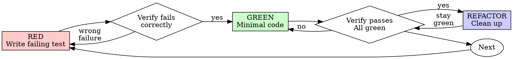

<!-- Generated by SpecStory, Markdown v2.1.0 -->

# 2026-05-13 08:40:26Z

<!-- Codex CLI Session 019e207e-83de-7182-b0c4-fb7db44b4f91 (2026-05-13 08:40:26Z) -->

_**User (2026-05-13 08:40:26Z)**_

https://github.com/lunel-dev/lunel  https://github.com/Emanuele-web04/remodex 我感觉你直�学一下这两个项目�，看看跟我们的有什么�一样，我们是直�抄他们的方案 还是你有更好的建议


---

_**Agent (gpt-5.5 2026-05-13 08:40:59Z)**_

我先把本地 CodexMobile 的结�和这两个 GitHub 项目都拉到眼�看一�，�点会放在���移动端交互��端/消�通��鉴���行方�，�会先入为主地说“抄�。

_**Agent (gpt-5.5 2026-05-13 08:40:59Z)**_

<tool-use data-tool-type="shell" data-tool-name="exec_command"><details>
<summary>Tool use: **exec_command** `rg -n "CodexMobile|lunel|remodex|mobile|codex" /Users/xiayanghui/.codex/memories/MEMORY.md`</summary>
```
Chunk ID: e6c9bf
Wall time: 0.0000 seconds
Process exited with code 0
Original token count: 30945
Output:
Total output lines: 318

1:# Task Group: CodexMobile / composer �件�线程�步���拆分��网访问
3:scope: `CodexMobile` 手机端 composer �件�图片/文件预览�`/plan` �作模��repo-local skill ���自动标题�普通对�/��链路�障�desktop IPC fallback�draft/new-thread send�abort / running 状��片��端�守拆分�移动端 Git ���release �布�macOS 自�动� Tailscale/LAN 访问；适用�这个 repo 的 live ��端�调�app-server 行为核验��网访问解释和公开仓库�生，�适用�泛化移动端产�设计。
4:applies_to: cwd=/Users/xiayanghui/编程项目/CodexMobile; reuse_rule=适��用到这个 `CodexMobile` 仓库里� composer�`/plan`�`/api/status`�`thread/*` app-server 能力�本地 Node �务�README 功能�径�Git HTTP API�launchd�Tailscale/LAN origin 行为有关的任务；具体端��running process�模�列表和代�结�都�按当� checkout/live server �验
6:## Task 1: 给 mobile composer 加 skill 选择，并修�“按钮无法点击�的�行�错�
10:- rollout_summaries/2026-05-05T00-12-41-rXsC-codexmobile_skill_picker_and_remove_voice_controls.md (cwd=/Users/xiayanghui/编程项目/CodexMobile, rollout_path=/Users/xiayanghui/.codex/sessions/2026/05/05/rollout-2026-05-05T08-12-41-019df57a-d854-73d1-8bec-a9d15f8453c2.jsonl, updated_at=2026-05-05T00:25:11+00:00, thread_id=019df57a-d854-73d1-8bec-a9d15f8453c2, added skill discovery and mobile picker, then proved the first disabled state came from an older live backend on port 3321)
14:- CodexMobile, skill picker, composer, /api/status, localStorage, buildCodexTurnInput, type: skill, lsof, port 3321, port 3331, readCodexSkills
20:- rollout_summaries/2026-05-05T00-12-41-rXsC-codexmobile_skill_picker_and_remove_voice_controls.md (cwd=/Users/xiayanghui/编程项目/CodexMobile, rollout_path=/Users/xiayanghui/.codex/sessions/2026/05/05/rollout-2026-05-05T08-12-41-019df57a-d854-73d1-8bec-a9d15f8453c2.jsonl, updated_at=2026-05-05T00:25:11+00:00, thread_id=019df57a-d854-73d1-8bec-a9d15f8453c2, removed the in-app voice/dialog entry points and updated docs to match the native-keyboard voice preference)
24:- CodexMobile, voice-dialog, microphone button, dialog button, VoiceDialogPanel, native keyboard voice path, README.md, npm run build, restart 3321
30:- rollout_summaries/2026-05-05T11-35-49-5GrC-codexmobile_auto_thread_title_hook_gpt_5_4_mini.md (cwd=/Users/xiayanghui/编程项目/CodexMobile, rollout_path=/Users/xiayanghui/.codex/sessions/2026/05/05/rollout-2026-05-05T19-35-49-019df7ec-42b4-7602-94d6-e06d2430e6c0.jsonl, updated_at=2026-05-05T12:01:30+00:00, thread_id=019df7ec-42b4-7602-94d6-e06d2430e6c0, traced `name`/`preview` fallback and added async auto-title writeback for new draft sessions)
36:## Task 4: 清�普通对�旧线程�解释 mobile/desktop 归档�状，并修���一直“处�中�
40:- rollout_summaries/2026-05-05T19-24-27-hq5w-codexmobile_mobile_thread_sync_and_hanging_turn_debug.md (cwd=/Users/xiayanghui/编程项目/CodexMobile, rollout_path=/Users/xiayanghui/.codex/sessions/2026/05/06/rollout-2026-05-06T03-24-27-019df999-4f02-70f1-9d0f-895fb3098ee6.jsonl, updated_at=2026-05-07T05:33:58+00:00, thread_id=019df999-4f02-70f1-9d0f-895fb3098ee6, cleaned ordinary-thread history bleed-through, clarified hide-vs-archive behavior, cleared `/Users/xiayanghui/Documents/Codex/`, and fixed normal-chat turn hangs caused by leaked lark-cli env)
44:- ordinary conversations, hidden-sessions.json, mobile-sessions.json, refreshCodexCache, Documents/Codex, activeRuns, /api/chat/abort, runCodexTurn, lark-cli, NO_PROXY, thread/archive, app-server timeout, turn/completed
50:- rollout_summaries/2026-05-05T19-18-01-iLno-codexmobile_macos_autostart_launchagent.md (cwd=/Users/xiayanghui/编程项目/CodexMobile, rollout_path=/Users/xiayanghui/.codex/sessions/2026/05/06/rollout-2026-05-06T03-18-01-019df993-6bb9-7ff2-99b2-c34ddc737c76.jsonl, updated_at=2026-05-06T12:17:56+00:00, thread_id=019df993-6bb9-7ff2-99b2-c34ddc737c76, started with a reboot-pairing skill, then replaced it with a user-level LaunchAgent that keeps port 3321 alive after reboot and crash)
54:- CodexMobile, LaunchAgent, launchctl, macOS autostart, run-server.mjs, start-server.mjs, /api/status, refreshCodexCache, port 3321, fileURLToPath, launchd, com.codexmobile.bridge
60:- rollout_summaries/2026-05-07T04-46-49-TGny-codexmobile_architecture_git_security_cleanup.md (cwd=/Users/xiayanghui/编程项目/CodexMobile, rollout_path=/Users/xiayanghui/.codex/sessions/2026/05/07/rollout-2026-05-07T12-46-49-019e00c2-88d5-78e1-bc14-ca1f0d1f1084.jsonl, updated_at=2026-05-07T17:54:56+00:00, thread_id=019e00c2-88d5-78e1-bc14-ca1f0d1f1084, explained the PWA + Node + Codex app-server chain, split backend helpers conservatively, repl
... (truncated)
```
</details></tool-use>

_**Agent (gpt-5.5 2026-05-13 08:40:59Z)**_

<tool-use data-tool-type="shell" data-tool-name="exec_command"><details>
<summary>Tool use: **exec_command** `sed -n '1,220p' '/Users/xiayanghui/.codex/plugins/cache/openai-curated/github/7955f1db/skills/github/SKILL.md'`</summary>
```
Chunk ID: da58cc
Wall time: 0.0000 seconds
Process exited with code 0
Original token count: 1089
Output:
---
name: github
description: Triage and orient GitHub repository, pull request, and issue work through the connected GitHub app. Use when the user asks for general GitHub help, wants PR or issue summaries, or needs repository context before choosing a more specific GitHub workflow.
---

# GitHub

## Overview

Use this skill as the umbrella entrypoint for general GitHub work in this plugin. It should decide whether the task stays in repo and PR triage or should be handed off to a more specific review, CI, or publish workflow.

This plugin is intentionally hybrid:

- Prefer the GitHub app from this plugin for repository, issue, pull request, comment, label, reaction, and PR creation workflows.
- Use local `git` and `gh` only when the connector does not cover the job well, especially for current-branch PR discovery, branch creation, commit and push, `gh auth status`, and GitHub Actions log inspection.
- Keep connector state and local checkout context aligned. If the request is about the current branch, resolve the local repo and branch before acting.

Once the intent is clear, route to the specialist skill immediately and do not keep broad GitHub triage in scope longer than needed.

## Connector-First Responsibilities

Handle these directly in this skill when the request does not need a narrower specialist workflow:

- repository orientation once the repo, PR, issue, or local checkout is identified
- recent PR or issue triage
- PR metadata summaries
- PR patch inspection
- PR comments, labels, and reactions
- issue lookup and summarization
- PR creation after a branch is already pushed

Prefer the GitHub app from this plugin for those flows because it provides structured PR, issue, and review-adjacent data without depending on a local checkout. If the repository is not already identifiable from the user request or local git context, ask for the repo instead of pretending there is a repo-search flow that may not exist.

## Routing Rules

1. Resolve the operating context first:
   - If the user provides a repository, PR number, issue number, or URL, use that.
   - If the request is about "this branch" or "the current PR", resolve local git context and use `gh` only as needed to discover the branch PR.
   - If the repository is still ambiguous after local inspection, ask for the repo identifier.
2. Classify the request before taking action:
   - `repo or PR triage`: summarize PRs, issues, patches, comments, labels, reactions, or repository state
   - `review follow-up`: unresolved review threads, requested changes, or inline review feedback
   - `CI debugging`: failing checks, Actions logs, or CI root-cause analysis
   - `publish changes`: create or switch branches, stage changes, commit, push, and open a draft PR
3. Route to the specialist skill as soon as the category is clear:
   - Review comments and requested changes: `../gh-address-comments/SKILL.md`
   - Failing GitHub Actions checks: `../gh-fix-ci/SKILL.md`
   - Commit, push, and open PR: `../yeet/SKILL.md`
4. Keep the hybrid model consistent after routing:
   - connector first for PR and issue data
   - local `git` and `gh` only for the specific gaps the connector does not cover

## Default Workflow

1. Resolve repository and item scope.
2. Gather structured PR or issue context through the GitHub app from this plugin.
3. Decide whether the task stays in connector-backed triage or needs a specialist skill.
4. Route immediately when the work becomes review follow-up, CI debugging, or publish workflow.
5. End with a clear summary of what was inspected, what changed, and what remains.

## Output Expectations

- For triage requests, return a concise summary of the repository, PR, or issue state and the next likely action.
- For mixed requests, tell the user which specialist path you are taking and why.
- For connector-backed write actions, restate the exact PR, issue, label, or reaction target before applying the change.
- Never imply that GitHub Actions logs are available through the connector alone. That remains a `gh` workflow.

## Examples

- "Use GitHub to summarize the open PRs in this repo and tell me what needs attention."
- "Help with this PR."
- "Review the latest comments on PR 482 and tell me what is actionable."
- "Debug the failing checks on this branch."
- "Commit these changes, push them, and open a draft PR."
```
</details></tool-use>

_**Agent (gpt-5.5 2026-05-13 08:40:59Z)**_

<tool-use data-tool-type="shell" data-tool-name="exec_command"><details>
<summary>Tool use: **exec_command** `pwd && rg --files -g '!*node_modules*' -g '!dist' -g '!build' | sed -n '1,200p'`</summary>
```
Chunk ID: 1b29b1
Wall time: 0.0000 seconds
Process exited with code 0
Original token count: 1534
Output:
/Users/xiayanghui/编程项目/CodexMobile
CHANGELOG.md
LICENSE
package-lock.json
README.md
AGENTS.md
.env.example
client/vite.config.js
client/index.html
client/public/codex-icon-512.png
client/public/icon.svg
client/public/codex-icon-192.png
client/public/codexmobile-sw.js
client/public/codex-icon-180.png
client/src/memory-citation.test.mjs
package.json
client/src/git-panel-state.test.mjs
client/src/model-sync.test.mjs
client/src/connection-recovery.test.mjs
client/src/activity-timeline.test.mjs
client/src/git-panel-state.js
client/src/activity-model.test.mjs
client/src/turn-submission-utils.test.mjs
client/src/api.js
client/src/activity-merge.test.mjs
client/src/App.jsx
client/src/main.jsx
client/src/activity-display.test.mjs
client/src/activity-timeline.js
client/src/git-panel-actions.test.mjs
docs/images/codexmobile-demo-chat-dark.png
docs/images/codexmobile-demo-sidebar-dark.png
docs/images/codexmobile-demo-sidebar-light.png
docs/images/codexmobile-demo-chat-light.png
client/src/activity-timeline-model.test.mjs
client/src/composer-shortcuts.test.mjs
client/src/connection-recovery.js
client/src/app-websocket-events.test.mjs
client/src/activity-dedupe.js
client/src/session-live-refresh.test.mjs
client/src/chat-scroll.js
client/manifest.webmanifest
client/src/styles.css
scripts/start-all.ps1
scripts/install-macos-autostart.mjs
scripts/run-server.mjs
scripts/patch-codex-sdk.mjs
scripts/start-asr.mjs
scripts/start-server.mjs
scripts/system-proxy-env.mjs
scripts/smoke.mjs
scripts/lark-cli-guard.mjs
server/codex-config-model-settings.test.mjs
server/chat-service.test.mjs
server/desktop-ipc-client.js
server/codex-config.test.mjs
server/static-service.js
server/session-message-reader.js
server/desktop-ipc-client.test.mjs
server/runtime-debug.js
server/startup-proxy.test.mjs
server/session-message-reader.test.mjs
server/chat-auto-title.test.mjs
server/notification-routes.js
skills/lark-doc-fast/SKILL.md
shared/session-title.js
shared/service-tier.js
shared/service-tier.test.mjs
shared/session-title.test.mjs
shared/message-identity.js
skills/lark-drive-fast/SKILL.md
server/index.js
server/image-generator.js
server/chat-delivery.js
server/runtime-debug.test.mjs
server/session-index-builder.js
server/provider-api.js
server/voice-speaker.js
server/push-service.test.mjs
server/auth.js
server/chat-service.js
server/codex-native-images.test.js
server/file-routes.js
server/feishu-skills.js
server/http-utils.js
server/codex-data-desktop-activity.test.mjs
server/codex-runner.js
server/git-routes.test.mjs
server/realtime-voice.js
server/mobile-session-index.js
server/auth.test.mjs
server/session-index-builder.test.mjs
server/voice-transcriber.js
server/upload-service.test.mjs
server/codex-runner-status.test.mjs
server/git-service.test.mjs
server/desktop-activity-parser.js
server/file-search.js
server/lark-cli.js
server/voice-routes.js
server/chat-request-prep.test.mjs
server/codex-native-images.js
server/chat-auto-title.js
server/session-local-state.test.mjs
server/chat-queue.js
server/feishu-routes.js
server/desktop-ipc-broadcast-listener.js
server/chat-request-prep.js
server/session-title-generator.test.mjs
server/codex-quota.test.mjs
server/codex-config.js
server/codex-data.js
server/codex-app-server.test.mjs
server/chat-image-handler.js
asr-service/app.py
asr-service/Dockerfile
asr-service/requirements.txt
server/static-service.test.mjs
server/route-handlers.test.mjs
server/push-service.js
server/session-title-generator.js
server/codex-app-server.js
server/desktop-thread-projector.js
server/codex-quota.js
server/session-routes.js
server/upload-service.js
server/session-local-state.js
server/chat-routes.js
server/git-routes.js
server/git-service.js
server/file-search.test.mjs
client/src/git-panel-actions.js
client/src/chat-scroll.test.mjs
client/src/activity-merge.js
client/src/send-state.js
client/src/web-push-client.test.mjs
skills/lark-sheets-fast/SKILL.md
client/src/web-push-client.js
client/src/topbar-status.test.mjs
client/src/composer-shortcuts.js
client/src/app-state.test.mjs
client/src/selection-persistence.test.mjs
client/src/activity-dedupe.test.mjs
client/src/session-live-refresh.js
client/src/activity-card-state.test.mjs
client/src/send-state.test.mjs
client/src/activity-display.js
client/src/notification-events.js
skills/lark-slides-fast/SKILL.md
client/src/notification-events.test.mjs
client/src/utils/clipboard.js
docs/superpowers/plans/2026-05-08-desktop-ipc-state-sync.md
client/src/composer/paste-files.js
client/src/composer/ContextStatus.jsx
client/src/composer/useQueueDrafts.js
client/src/composer/composer-options.test.mjs
client/src/composer/composer-options.js
client/src/composer/attachment-preview.js
client/src/composer/useComposerSelections.js
client/src/composer/Composer.jsx
client/src/composer/attachment-preview.test.mjs
client/src/composer/paste-files.test.mjs
client/src/styles/theme.css
cl
... (truncated)
```
</details></tool-use>

_**Agent (gpt-5.5 2026-05-13 08:41:38Z)**_

我会用 `github` 技能的仓库���路��这次判断：先看公开 README/结�，��到��入�和我们本地��对�。刚扫到一个��背景：之�我们已��独对比过 remodex，并且当时结论是继续�留 CodexMobile 的路线�修了 desktop IPC 缺席时的�� fallback；这次我会把 lunel 一起纳入。

_**Agent (gpt-5.5 2026-05-13 08:41:38Z)**_

<tool-use data-tool-type="shell" data-tool-name="exec_command"><details>
<summary>Tool use: **exec_command** `sed -n '86,105p' /Users/xiayanghui/.codex/memories/MEMORY.md`</summary>
```
Chunk ID: 4dab67
Wall time: 0.0000 seconds
Process exited with code 0
Original token count: 424
Output:

## Task 9: 对比 `remodex` �确认继续走 CodexMobile，并把 desktop IPC 缺席改�“mobile �继续执行�

### rollout_summary_files

- rollout_summaries/2026-05-07T09-51-09-8csE-codexmobile_remodex_compare_and_desktop_ipc_fallback_fix.md (cwd=/Users/xiayanghui/编程项目/CodexMobile, rollout_path=/Users/xiayanghui/.codex/sessions/2026/05/07/rollout-2026-05-07T17-51-09-019e01d9-2a8f-7a60-8755-384b1c4cd4e0.jsonl, updated_at=2026-05-07T17:53:19+00:00, thread_id=019e01d9-2a8f-7a60-8755-384b1c4cd4e0, compared `remodex`, then restored background execution when desktop owner is unavailable so mobile can continue and sync later)

### keywords

- CodexMobile, remodex, desktop-ipc, no-client-found, thread/loaded/list, notLoaded, inactive_thread_unsubscribed, background fallback, no loaded desktop owner

## Task 10: 解释 CodexMobile 的 IPC 链路，并澄清 `createThread` �是能力声��是����

### rollout_summary_files

- rollout_summaries/2026-05-07T23-18-04-Zich-codexmobile_ipc_create_thread_capability_explanation.md (cwd=/Users/xiayanghui/编程项目/CodexMobile, rollout_path=/Users/xiayanghui/.codex/sessions/2026/05/08/rollout-2026-05-08T07-18-04-019e04bb-ea0a-7942-b22a-77a5ad7ed299.jsonl, updated_at=2026-05-07T23:22:20+00:00, thread_id=019e04bb-ea0a-7942-b22a-77a5ad7ed299, explained the PWA -> local Node bridge -> desktop IPC/app-server chain and why `createThread: true` cannot be added by flipping a status flag)

### keywords

- CodexMobile, IPC, desktop-ipc, app-server, node bridge, JSON-RPC, createThread, createThreadReason, backgroundCodex, headless-local, thread-follower-start-turn, thread-follower-set-collaboration-mode, socket
```
</details></tool-use>

_**Agent (gpt-5.5 2026-05-13 08:41:38Z)**_

<tool-use data-tool-type="shell" data-tool-name="exec_command"><details>
<summary>Tool use: **exec_command** `sed -n '1,240p' README.md`</summary>
```
Chunk ID: 57446c
Wall time: 0.0000 seconds
Process exited with code 0
Original token count: 3120
Output:
# CodexMobile

CodexMobile 是一个��个人�有化部署的移动端 Codex 工作�。电脑继续作为真正的执行�境，iPhone�Android 手机�平��折���备用电脑或任何能打开�代�览器的设备负责�时�管�追问�查看过程�处�确认��收完�通知。

它�是公网 SaaS，也�是远程桌�，而是把本机 Codex Desktop�`~/.codex` 会��项目文件�skills�Git 状�和本地工具链，�到一个适�移动端使用的 PWA 里。移动设备通过 Tailscale�局域网或其它�信�有网络访问电脑上的 Node.js 桥��务，真�文件�密钥和执行能力�留在个人电脑上。

相比��供远程�天入�的移动 Codex 工具，CodexMobile 的核心路线是：完全�有化部署�和桌�端无��步��留完整执行过程，并通过 Tailscale 等�有网络��外网�用。Codex 的对��执行�确认和续��以�时�地�上，�� App 平��制，���览器能打开就能使用。

1.0 版本�点解决的是“移动端和电脑��一个工作��这件事：桌� IPC 和�� fallback 统一��一套消��读逻辑，�行中�已完�����动�线程待确认这些状�在移动端能��看�，移动端�起的新线程也能平滑进入桌�侧执行。

## 项目定�

移动端 Codex 真正困难的�是“能�能�消��，而是能�能�上电脑里正在�生的真�工作。

如�移动端�是�起一个�天窗�，它看起��以用，但很快就会断层：桌�端的线程��步，执行过程看�到，任务跑到一�没法追问，文件路径�好输入，Git 状�还��电脑看，Codex 等待确认时移动端也�知�。

CodexMobile �解决的是这些具体问题：

- 电脑上开的 Codex 线程，移动端也�能看�和��用。
- Codex 正在跑的时候，移动端�能 steer�queue�interrupt。
- 执行过程�能丢，完���以折�，但点开必须还在。
- 移动端输入�少一点摩擦，`/` 命令�`@文件`�`$skill` 都应该顺手。
- Git���状��完�通知这些等待电脑的动作，移动端也�能处�。
- 它�以长得轻一点�顺一点，但�能为了好看牺牲过程追踪和桌��步。

它�是通用�天 App，而是一个让个人 Codex 工作�在桌�端和移动端之间���续的�有移动�制�。

## 平�兼容性

CodexMobile 的核心形�是 Web/PWA，�绑定�个手机系统或应用商店：

- iPhone / iPad：�通过 Safari 访问，也�以添加到主�作为 PWA 使用。
- Android 手机 / 平� / 折��：�通过 Chrome�Edge�Firefox 等�代�览器访问，也�以按�览器能力安装为 PWA。
- 桌��览器 / 备用电脑：��能访问�一个 Tailscale 或�信�有网络，也�以直�打开使用。
- 平�差异主�在��通知：iOS Web Push 对 HTTPS�主� PWA 和系统版本有�外�求；普通访问�续��查看执行过程�Git ��和������赖 iOS。

## 和 Remodex 等项目的区别

CodexMobile 和 Remodex 这类项目都在解决“移动端使用 Codex�的问题，但侧�点��：

- **完全�有化部署**：�务�行在自己的电脑上，通过�对��设备 token 和�信�有网络访问，��赖托管平�。
- **桌�端�步**：直�读�本机 Codex Desktop / `~/.codex` 会�，并通过 Desktop IPC �管已有线程，尽���桌�端和移动端��性一致。
- **Live mirror 工作�**：移动端��是�起新对�，还能看到桌�端正在�行�等待确认���执行�已完�的真�状�，并继续 steer�queue�interrupt。
- **外网�有访问**：�� Tailscale 或 Tailscale Serve，�以在外网安全访问家里或�公室电脑上的 CodexMobile，�时�留本机文件和执行�境。
- **��平��制**：核心形�是 Web/PWA，���览器能打开，就�以在 iPhone�iPad�Android 手机�Android 平��折���备用电脑或桌��览器中使用。
- **�留完整执行过程**：�是�显示摘���天结�，而是尽��留 Codex 工具调用�活动��错误�完�状�和��上下文。
- **移动端工作�补�**：内置文件 mention�skill mention�`/` 命令�队列消��Git ���完�通知和����，目标是让移动端真的能��日常 Codex 工作。

## 界�演示

截图使用安全演示内容，已替�真�项目����对��文件路径和�行日志。

| 深色对��工具过程 | 深色侧边�状� |
| --- | --- |
| </tool-use>

_**Agent (gpt-5.5 2026-05-13 08:41:38Z)**_

<tool-use data-tool-type="shell" data-tool-name="exec_command"><details>
<summary>Tool use: **exec_command** `git status --short && git remote -v && git log --oneline -5`</summary>
```
Chunk ID: 869219
Wall time: 0.0000 seconds
Process exited with code 0
Original token count: 431
Output:
 M client/src/app-state.test.mjs
 M client/src/app-websocket-events.test.mjs
 M client/src/app/App.jsx
 M client/src/app/PairingScreen.jsx
 M client/src/app/model-sync.js
 M client/src/app/session-utils.js
 M client/src/app/turn-submission-utils.js
 M client/src/app/useAppBootstrap.js
 M client/src/app/useAppWebSocket.js
 M client/src/app/useSessionActions.js
 M client/src/app/useSessionLivePolling.js
 M client/src/app/useTurnRuntime.js
 M client/src/app/useTurnSubmission.js
 M client/src/composer-shortcuts.js
 M client/src/composer-shortcuts.test.mjs
 M client/src/composer/Composer.jsx
 M client/src/model-sync.test.mjs
 M client/src/panels/topbar-status.js
 M client/src/send-state.js
 M client/src/send-state.test.mjs
 M client/src/styles/composer.css
 M client/src/topbar-status.test.mjs
 M client/src/turn-submission-utils.test.mjs
 M server/chat-delivery.js
 M server/chat-request-prep.js
 M server/chat-service.js
 M server/chat-service.test.mjs
 M server/codex-config.js
 M server/codex-data-desktop-activity.test.mjs
 M server/codex-data.js
 M server/codex-runner.js
 M server/desktop-ipc-client.js
 M server/desktop-ipc-client.test.mjs
 M server/desktop-thread-projector.js
 M server/index.js
 M server/session-index-builder.js
 M server/session-message-reader.js
 M server/session-message-reader.test.mjs
?? client/src/sync/
?? server/codex-config-model-settings.test.mjs
?? server/sync/
origin	https://github.com/flyyangX/CodexMobile (fetch)
origin	https://github.com/flyyangX/CodexMobile (push)
5669ad8 Refactor mobile app routing and shared UI flows
92cf164 Refine CodexMobile architecture and sync handling
2577e0b Release 1.2.0
27b0533 Fix desktop IPC completion running state
6be660a Release 1.1.0
```
</details></tool-use>

_**Agent (gpt-5.5 2026-05-13 08:41:38Z)**_

<tool-use data-tool-type="shell" data-tool-name="exec_command"><details>
<summary>Tool use: **exec_command** `rm -rf /tmp/codexmobile-compare && mkdir -p /tmp/codexmobile-compare && git clone --depth 1 https://github.com/lunel-dev/lunel.git /tmp/codexmobile-compare/lunel && git clone --depth 1 https://github.com/Emanuele-web04/remodex.git /tmp/codexmobile-compare/remodex`</summary>
```
Chunk ID: c4c95a
Wall time: 1.0016 seconds
Process running with session ID 45021
Original token count: 13
Output:
Cloning into '/tmp/codexmobile-compare/lunel'...
```
</details></tool-use>

_**Agent (gpt-5.5 2026-05-13 08:41:50Z)**_

本地 repo �在是有一批未�交改动的，我这轮��分�，�碰你的代�。README 也说�了我们当�定�：PWA + 本机 Node bridge + �有网络 + 桌� IPC/fallback + `~/.codex` 会��读，这个和两个�照项目的出�点其�已��完全一样。

_**Agent (gpt-5.5 2026-05-13 08:41:51Z)**_

<tool-use data-tool-type="unknown" data-tool-name="write_stdin"><details>
<summary>Tool use: **write_stdin**</summary>
```
Chunk ID: 4db1e8
Wall time: 0.0000 seconds
Process exited with code 0
Original token count: 13
Output:
Cloning into '/tmp/codexmobile-compare/remodex'...
```
</details></tool-use>

_**Agent (gpt-5.5 2026-05-13 08:42:18Z)**_

<tool-use data-tool-type="shell" data-tool-name="exec_command"><details>
<summary>Tool use: **exec_command** `rg --files -g 'package.json' -g 'README.md' -g 'SELF_HOSTING_MODEL.md' -g '*.swift' -g '*.ts' -g '*.tsx' -g '*.js' /tmp/codexmobile-compare/lunel | sed -n '1,220p'`</summary>
```
Chunk ID: f6589a
Wall time: 0.0000 seconds
Process exited with code 0
Original token count: 1948
Output:
/tmp/codexmobile-compare/lunel/README.md
/tmp/codexmobile-compare/lunel/manager/src/index.ts
/tmp/codexmobile-compare/lunel/manager/package.json
/tmp/codexmobile-compare/lunel/proxy/src/index.ts
/tmp/codexmobile-compare/lunel/proxy/package.json
/tmp/codexmobile-compare/lunel/cli/src/libsodium-wrappers.d.ts
/tmp/codexmobile-compare/lunel/cli/src/index.ts
/tmp/codexmobile-compare/lunel/cli/src/ai/index.ts
/tmp/codexmobile-compare/lunel/cli/src/ai/codex.ts
/tmp/codexmobile-compare/lunel/cli/src/ai/interface.ts
/tmp/codexmobile-compare/lunel/cli/src/ai/opencode.ts
/tmp/codexmobile-compare/lunel/cli/src/transport/protocol.ts
/tmp/codexmobile-compare/lunel/cli/src/transport/v2.ts
/tmp/codexmobile-compare/lunel/cli/package.json
/tmp/codexmobile-compare/lunel/cli/README.md
/tmp/codexmobile-compare/lunel/app/hot-updater.config.ts
/tmp/codexmobile-compare/lunel/app/components/MediaViewer.tsx
/tmp/codexmobile-compare/lunel/app/components/editor/types.ts
/tmp/codexmobile-compare/lunel/app/components/AnimatedPressable.tsx
/tmp/codexmobile-compare/lunel/app/components/NotConnected.tsx
/tmp/codexmobile-compare/lunel/app/components/Toast.tsx
/tmp/codexmobile-compare/lunel/app/components/Loading.tsx
/tmp/codexmobile-compare/lunel/app/components/Header.tsx
/tmp/codexmobile-compare/lunel/app/components/DrawerContent.tsx
/tmp/codexmobile-compare/lunel/app/components/PluginTabBar.tsx
/tmp/codexmobile-compare/lunel/app/components/InputModal.tsx
/tmp/codexmobile-compare/lunel/app/components/Footer.tsx
/tmp/codexmobile-compare/lunel/app/components/PluginBottomBar.tsx
/tmp/codexmobile-compare/lunel/app/components/PluginRenderer.tsx
/tmp/codexmobile-compare/lunel/app/components/InfoSheet.tsx
/tmp/codexmobile-compare/lunel/app/components/ActionSheet.tsx
/tmp/codexmobile-compare/lunel/app/components/AnimatedTab.tsx
/tmp/codexmobile-compare/lunel/app/components/ThemeSwitcher.tsx
/tmp/codexmobile-compare/lunel/app/README.md
/tmp/codexmobile-compare/lunel/app/babel.config.js
/tmp/codexmobile-compare/lunel/app/metro.config.js
/tmp/codexmobile-compare/lunel/app/package.json
/tmp/codexmobile-compare/lunel/app/lib/logger.ts
/tmp/codexmobile-compare/lunel/app/lib/storage.ts
/tmp/codexmobile-compare/lunel/app/lib/proxyServer.ts
/tmp/codexmobile-compare/lunel/app/lib/transport/protocol.ts
/tmp/codexmobile-compare/lunel/app/lib/transport/v2.ts
/tmp/codexmobile-compare/lunel/app/eslint.config.js
/tmp/codexmobile-compare/lunel/app/plugins/gpi.ts
/tmp/codexmobile-compare/lunel/app/app/onboarding.tsx
/tmp/codexmobile-compare/lunel/app/app/workspace/_layout.tsx
/tmp/codexmobile-compare/lunel/app/app/workspace/index.tsx
/tmp/codexmobile-compare/lunel/app/app/_layout.tsx
/tmp/codexmobile-compare/lunel/app/app/help.tsx
/tmp/codexmobile-compare/lunel/app/app/feedback.tsx
/tmp/codexmobile-compare/lunel/app/app/lunel-connect.tsx
/tmp/codexmobile-compare/lunel/app/app/index.tsx
/tmp/codexmobile-compare/lunel/app/contexts/ThemeContext.tsx
/tmp/codexmobile-compare/lunel/app/contexts/AppSettingsContext.tsx
/tmp/codexmobile-compare/lunel/app/contexts/EditorContext.tsx
/tmp/codexmobile-compare/lunel/app/contexts/ReviewPromptContext.tsx
/tmp/codexmobile-compare/lunel/app/contexts/ConnectionContext.tsx
/tmp/codexmobile-compare/lunel/app/contexts/SessionRegistry.tsx
/tmp/codexmobile-compare/lunel/app/plugins/index.ts
/tmp/codexmobile-compare/lunel/app/plugins/context.tsx
/tmp/codexmobile-compare/lunel/app/plugins/registry.ts
/tmp/codexmobile-compare/lunel/app/plugins/innerApi.ts
/tmp/codexmobile-compare/lunel/app/hooks/index.ts
/tmp/codexmobile-compare/lunel/app/hooks/useApi.ts
/tmp/codexmobile-compare/lunel/app/hooks/useTerminal.ts
/tmp/codexmobile-compare/lunel/app/hooks/useFileSystem.ts
/tmp/codexmobile-compare/lunel/app/hooks/useGit.ts
/tmp/codexmobile-compare/lunel/app/hooks/useAI.ts
/tmp/codexmobile-compare/lunel/app/plugins/load.ts
/tmp/codexmobile-compare/lunel/app/app/(auth)/auth.tsx
/tmp/codexmobile-compare/lunel/app/plugins/types.ts
/tmp/codexmobile-compare/lunel/app/constants/themes.ts
/tmp/codexmobile-compare/lunel/app/app/settings/brainrot.tsx
/tmp/codexmobile-compare/lunel/app/app/settings/ai.tsx
/tmp/codexmobile-compare/lunel/app/app/settings/bottom-bar.tsx
/tmp/codexmobile-compare/lunel/app/app/settings/_layout.tsx
/tmp/codexmobile-compare/lunel/app/app/settings/storage.tsx
/tmp/codexmobile-compare/lunel/app/app/settings/editor.tsx
/tmp/codexmobile-compare/lunel/app/plugins/core/editor/store.ts
/tmp/codexmobile-compare/lunel/app/plugins/core/editor/index.ts
/tmp/codexmobile-compare/lunel/app/plugins/core/editor/Panel.tsx
/tmp/codexmobile-compare/lunel/app/plugins/core/editor/codemirror-web-entry.ts
/tmp/codexmobile-compare/lunel/app/plugins/core/editor/codemirrorWebBundle.ts
/tmp/codexmobile-compare/lunel/app/plugins/core/index.ts
/tmp/codexmobile-compare/lunel/app/plugins/core/ai/index.ts
/tmp/codexmobile-compare/lunel/app/plugins/core/ai/Panel
... (truncated)
```
</details></tool-use>

_**Agent (gpt-5.5 2026-05-13 08:42:18Z)**_

<tool-use data-tool-type="shell" data-tool-name="exec_command"><details>
<summary>Tool use: **exec_command** `rg --files -g 'package.json' -g 'README.md' -g 'SELF_HOSTING_MODEL.md' -g '*.swift' -g '*.ts' -g '*.tsx' -g '*.js' /tmp/codexmobile-compare/remodex | sed -n '1,260p'`</summary>
```
Chunk ID: 3395b5
Wall time: 0.0002 seconds
Process exited with code 0
Original token count: 5725
Output:
/tmp/codexmobile-compare/remodex/preload.js
/tmp/codexmobile-compare/remodex/SELF_HOSTING_MODEL.md
/tmp/codexmobile-compare/remodex/main-Bw7nouYH.js
/tmp/codexmobile-compare/remodex/deeplinks-D8FzxbSB.js
/tmp/codexmobile-compare/remodex/relay/push-service.test.js
/tmp/codexmobile-compare/remodex/relay/relay.js
/tmp/codexmobile-compare/remodex/relay/push-service.js
/tmp/codexmobile-compare/remodex/relay/package.json
/tmp/codexmobile-compare/remodex/relay/README.md
/tmp/codexmobile-compare/remodex/relay/apns-client.test.js
/tmp/codexmobile-compare/remodex/relay/server.test.js
/tmp/codexmobile-compare/remodex/relay/server.js
/tmp/codexmobile-compare/remodex/relay/apns-client.js
/tmp/codexmobile-compare/remodex/CodexMobile/RemodexMenuBar/BridgeControlModels.swift
/tmp/codexmobile-compare/remodex/CodexMobile/RemodexMenuBar/BridgeControlService.swift
/tmp/codexmobile-compare/remodex/CodexMobile/RemodexMenuBar/BridgeMenuBarViews.swift
/tmp/codexmobile-compare/remodex/CodexMobile/RemodexMenuBar/RemodexMenuBarApp.swift
/tmp/codexmobile-compare/remodex/CodexMobile/RemodexMenuBar/BridgeMenuBarStore.swift
/tmp/codexmobile-compare/remodex/CodexMobile/CodexMobileTests/CodexThreadStartProjectBindingTests.swift
/tmp/codexmobile-compare/remodex/CodexMobile/CodexMobileTests/TurnFileChangeSummaryParserTests.swift
/tmp/codexmobile-compare/remodex/CodexMobile/CodexMobileTests/SidebarThreadGroupingTests.swift
/tmp/codexmobile-compare/remodex/CodexMobile/CodexMobileTests/AssistantTurnEndActionVisibilityTests.swift
/tmp/codexmobile-compare/remodex/CodexMobile/CodexMobileTests/CodexThreadProjectRoutingTests.swift
/tmp/codexmobile-compare/remodex/CodexMobile/CodexMobileTests/TurnViewModelGitBranchWorktreeTests.swift
/tmp/codexmobile-compare/remodex/CodexMobile/CodexMobileTests/ContentViewModelReconnectTests.swift
/tmp/codexmobile-compare/remodex/CodexMobile/CodexMobileTests/CodexServiceTierTests.swift
/tmp/codexmobile-compare/remodex/CodexMobile/CodexMobileTests/TurnSessionDiffSummaryTests.swift
/tmp/codexmobile-compare/remodex/CodexMobile/CodexMobileTests/QRScannerPairingValidatorTests.swift
/tmp/codexmobile-compare/remodex/CodexMobile/CodexMobileTests/SubscriptionServiceAccessTests.swift
/tmp/codexmobile-compare/remodex/CodexMobile/CodexMobileTests/TurnViewModelQueueTests.swift
/tmp/codexmobile-compare/remodex/CodexMobile/CodexMobileTests/TurnMessageCachesTests.swift
/tmp/codexmobile-compare/remodex/CodexMobile/CodexMobileTests/CodexSkillsListDecodeTests.swift
/tmp/codexmobile-compare/remodex/CodexMobile/CodexMobileTests/TurnSlashCommandTokenTests.swift
/tmp/codexmobile-compare/remodex/CodexMobile/CodexMobileTests/TurnComposerReviewModeTests.swift
/tmp/codexmobile-compare/remodex/CodexMobile/CodexMobileTests/CodexApprovalResponsePayloadTests.swift
/tmp/codexmobile-compare/remodex/CodexMobile/CodexMobileTests/TextualMarkdownRenderingRegressionTests.swift
/tmp/codexmobile-compare/remodex/CodexMobile/CodexMobileTests/CodexServiceCatchupRecoveryTests.swift
/tmp/codexmobile-compare/remodex/CodexMobile/CodexMobileTests/CodexTurnInputPayloadSkillTests.swift
/tmp/codexmobile-compare/remodex/CodexMobile/CodexMobileTests/AIChangeSetTests.swift
/tmp/codexmobile-compare/remodex/CodexMobile/CodexMobileTests/CodexPlanModeTests.swift
/tmp/codexmobile-compare/remodex/CodexMobile/CodexMobileTests/TurnGitDraftFlowTests.swift
/tmp/codexmobile-compare/remodex/CodexMobile/CodexMobileTests/CodexThreadRuntimeOverrideTests.swift
/tmp/codexmobile-compare/remodex/CodexMobile/CodexMobileTests/CodexServiceImmediateSyncTests.swift
/tmp/codexmobile-compare/remodex/CodexMobile/CodexMobileTests/CodeCommentDirectiveParserTests.swift
/tmp/codexmobile-compare/remodex/CodexMobile/CodexMobileTests/TurnConnectionRecoverySnapshotBuilderTests.swift
/tmp/codexmobile-compare/remodex/CodexMobile/CodexMobileTests/TurnViewModelGitBranchAlertTests.swift
/tmp/codexmobile-compare/remodex/CodexMobile/CodexMobileTests/CodexServiceIncomingRunIndicatorTests.swift
/tmp/codexmobile-compare/remodex/CodexMobile/CodexMobileTests/CodexGitWriterModelTests.swift
/tmp/codexmobile-compare/remodex/CodexMobile/CodexMobileTests/CodexStructuredUserInputDecodeTests.swift
/tmp/codexmobile-compare/remodex/CodexMobile/CodexMobileTests/SkillReferenceFormatterTests.swift
/tmp/codexmobile-compare/remodex/CodexMobile/CodexMobileTests/CodexServiceThreadDisplayPhaseTests.swift
/tmp/codexmobile-compare/remodex/CodexMobile/CodexMobileTests/ThinkingDisclosureParserTests.swift
/tmp/codexmobile-compare/remodex/CodexMobile/CodexMobileTests/CodexServiceThreadListTests.swift
/tmp/codexmobile-compare/remodex/CodexMobile/CodexMobileTests/CodexServiceIncomingCommandExecutionTests.swift
/tmp/codexmobile-compare/remodex/CodexMobile/CodexMobileTests/DesktopHandoffServiceTests.swift
/tmp/codexmobile-compare/remodex/CodexMobile/CodexMobileTests/TurnSkillAutocompleteTokenTests.swift
/tmp/codexmobile-compare/remodex/Cod
... (truncated)
```
</details></tool-use>

_**Agent (gpt-5.5 2026-05-13 08:42:18Z)**_

<tool-use data-tool-type="shell" data-tool-name="exec_command"><details>
<summary>Tool use: **exec_command** `find /tmp/codexmobile-compare/lunel -maxdepth 3 -type f \( -name package.json -o -name README.md -o -name '*.rs' -o -name '*.ts' -o -name '*.tsx' \) | sed 's#/tmp/codexmobile-compare/lunel/##' | sort | sed -n '1,240p'`</summary>
```
Chunk ID: 1a7d18
Wall time: 0.0000 seconds
Process exited with code 0
Original token count: 367
Output:
app/app/_layout.tsx
app/app/feedback.tsx
app/app/help.tsx
app/app/index.tsx
app/app/lunel-connect.tsx
app/app/onboarding.tsx
app/components/ActionSheet.tsx
app/components/AnimatedPressable.tsx
app/components/AnimatedTab.tsx
app/components/DrawerContent.tsx
app/components/Footer.tsx
app/components/Header.tsx
app/components/InfoSheet.tsx
app/components/InputModal.tsx
app/components/Loading.tsx
app/components/MediaViewer.tsx
app/components/NotConnected.tsx
app/components/PluginBottomBar.tsx
app/components/PluginRenderer.tsx
app/components/PluginTabBar.tsx
app/components/ThemeSwitcher.tsx
app/components/Toast.tsx
app/constants/themes.ts
app/contexts/AppSettingsContext.tsx
app/contexts/ConnectionContext.tsx
app/contexts/EditorContext.tsx
app/contexts/ReviewPromptContext.tsx
app/contexts/SessionRegistry.tsx
app/contexts/ThemeContext.tsx
app/hooks/index.ts
app/hooks/useAI.ts
app/hooks/useApi.ts
app/hooks/useFileSystem.ts
app/hooks/useGit.ts
app/hooks/useTerminal.ts
app/hot-updater.config.ts
app/lib/logger.ts
app/lib/proxyServer.ts
app/lib/storage.ts
app/package.json
app/plugins/context.tsx
app/plugins/gpi.ts
app/plugins/index.ts
app/plugins/innerApi.ts
app/plugins/load.ts
app/plugins/registry.ts
app/plugins/types.ts
app/README.md
cli/package.json
cli/README.md
cli/src/index.ts
cli/src/libsodium-wrappers.d.ts
manager/package.json
manager/src/index.ts
proxy/package.json
proxy/src/index.ts
pty/src/main.rs
pty/src/protocol.rs
pty/src/session.rs
README.md
```
</details></tool-use>

_**Agent (gpt-5.5 2026-05-13 08:42:18Z)**_

<tool-use data-tool-type="shell" data-tool-name="exec_command"><details>
<summary>Tool use: **exec_command** `find /tmp/codexmobile-compare/remodex -maxdepth 4 -type f \( -name package.json -o -name README.md -o -name SELF_HOSTING_MODEL.md -o -name '*.swift' -o -name '*.js' \) | sed 's#/tmp/codexmobile-compare/remodex/##' | sort | sed -n '1,260p'`</summary>
```
Chunk ID: 115566
Wall time: 0.0000 seconds
Process exited with code 0
Original token count: 2883
Output:
CodexMobile/CodexMobile/CodexMobileApp.swift
CodexMobile/CodexMobile/CodexMobileAppDelegate.swift
CodexMobile/CodexMobile/ContentView.swift
CodexMobile/CodexMobile/Models/AIChangeSetModels.swift
CodexMobile/CodexMobile/Models/AppFont.swift
CodexMobile/CodexMobile/Models/CodexAccessMode.swift
CodexMobile/CodexMobile/Models/CodexCollaboration.swift
CodexMobile/CodexMobile/Models/CodexFuzzyFileMatch.swift
CodexMobile/CodexMobile/Models/CodexImageAttachment.swift
CodexMobile/CodexMobile/Models/CodexMessage.swift
CodexMobile/CodexMobile/Models/CodexMessageOrderCounter.swift
CodexMobile/CodexMobile/Models/CodexModelOption.swift
CodexMobile/CodexMobile/Models/CodexRateLimitStatus.swift
CodexMobile/CodexMobile/Models/CodexReasoningEffortOption.swift
CodexMobile/CodexMobile/Models/CodexServiceTier.swift
CodexMobile/CodexMobile/Models/CodexSkillMetadata.swift
CodexMobile/CodexMobile/Models/CodexThread.swift
CodexMobile/CodexMobile/Models/CommandExecutionDetails.swift
CodexMobile/CodexMobile/Models/ContextWindowUsage.swift
CodexMobile/CodexMobile/Models/GitActionModels.swift
CodexMobile/CodexMobile/Models/JSONValue.swift
CodexMobile/CodexMobile/Models/PetCompanionModels.swift
CodexMobile/CodexMobile/Models/RPCMessage.swift
CodexMobile/CodexMobile/Services/AIChangeSetPersistence.swift
CodexMobile/CodexMobile/Services/AppEnvironment.swift
CodexMobile/CodexMobile/Services/AssistantReplayDeduper.swift
CodexMobile/CodexMobile/Services/CodexMessagePersistence.swift
CodexMobile/CodexMobile/Services/CodexSecureTransportModels.swift
CodexMobile/CodexMobile/Services/CodexService.swift
CodexMobile/CodexMobile/Services/CodexService+Account.swift
CodexMobile/CodexMobile/Services/CodexService+AIChangeSets.swift
CodexMobile/CodexMobile/Services/CodexService+Connection.swift
CodexMobile/CodexMobile/Services/CodexService+Helpers.swift
CodexMobile/CodexMobile/Services/CodexService+History.swift
CodexMobile/CodexMobile/Services/CodexService+Incoming.swift
CodexMobile/CodexMobile/Services/CodexService+IncomingAssistant.swift
CodexMobile/CodexMobile/Services/CodexService+IncomingPlanMode.swift
CodexMobile/CodexMobile/Services/CodexService+IncomingSupport.swift
CodexMobile/CodexMobile/Services/CodexService+Messages.swift
CodexMobile/CodexMobile/Services/CodexService+Notifications.swift
CodexMobile/CodexMobile/Services/CodexService+Pets.swift
CodexMobile/CodexMobile/Services/CodexService+ProjectFolders.swift
CodexMobile/CodexMobile/Services/CodexService+Review.swift
CodexMobile/CodexMobile/Services/CodexService+RuntimeCompatibility.swift
CodexMobile/CodexMobile/Services/CodexService+RuntimeConfig.swift
CodexMobile/CodexMobile/Services/CodexService+SecureTransport.swift
CodexMobile/CodexMobile/Services/CodexService+Status.swift
CodexMobile/CodexMobile/Services/CodexService+Sync.swift
CodexMobile/CodexMobile/Services/CodexService+ThreadFork.swift
CodexMobile/CodexMobile/Services/CodexService+ThreadForkCompatibility.swift
CodexMobile/CodexMobile/Services/CodexService+ThreadHistoryPagination.swift
CodexMobile/CodexMobile/Services/CodexService+ThreadProjectRouting.swift
CodexMobile/CodexMobile/Services/CodexService+ThreadsTurns.swift
CodexMobile/CodexMobile/Services/CodexService+Transport.swift
CodexMobile/CodexMobile/Services/CodexService+TrustedPairPresentation.swift
CodexMobile/CodexMobile/Services/CodexService+TurnPaginationCompatibility.swift
CodexMobile/CodexMobile/Services/CodexService+Voice.swift
CodexMobile/CodexMobile/Services/CodexService+VoiceCompatibility.swift
CodexMobile/CodexMobile/Services/CodexService+WorkspaceCheckpoints.swift
CodexMobile/CodexMobile/Services/CodexService+WorkspaceImages.swift
CodexMobile/CodexMobile/Services/CodexServiceError.swift
CodexMobile/CodexMobile/Services/DesktopHandoffService.swift
CodexMobile/CodexMobile/Services/GitActionsService.swift
CodexMobile/CodexMobile/Services/GPTVoiceTranscriptionManager.swift
CodexMobile/CodexMobile/Services/HapticFeedback.swift
CodexMobile/CodexMobile/Services/LocalNetworkAuthorization.swift
CodexMobile/CodexMobile/Services/PetCompanionStore.swift
CodexMobile/CodexMobile/Services/SecureStore.swift
CodexMobile/CodexMobile/Views/AboutRemodexView.swift
CodexMobile/CodexMobile/Views/OpenSourceBadge.swift
CodexMobile/CodexMobile/Views/QRScannerPairingValidator.swift
CodexMobile/CodexMobile/Views/QRScannerView.swift
CodexMobile/CodexMobile/Views/SidebarView.swift
CodexMobile/CodexMobileTests/AIChangeSetTests.swift
CodexMobile/CodexMobileTests/AssistantTurnEndActionVisibilityTests.swift
CodexMobile/CodexMobileTests/CodeCommentDirectiveParserTests.swift
CodexMobile/CodexMobileTests/CodexAccessModeTests.swift
CodexMobile/CodexMobileTests/CodexApprovalResponsePayloadTests.swift
CodexMobile/CodexMobileTests/CodexApprovalStateTests.swift
CodexMobile/CodexMobileTests/CodexFuzzyFileSearchDecodeTests.swift
CodexMobile/CodexMobileTests/CodexGitWriterModelTests.swift
CodexMobile/Code
... (truncated)
```
</details></tool-use>

_**Agent (gpt-5.5 2026-05-13 08:43:40Z)**_

lunel 看起��是“Codex 手机壳�，而是更泛的 mobile IDE：Expo App + CLI + Manager/Proxy + Rust PTY，主线是文件/终端/进程/Git/远程机器渲染。remodex 更�我们这�线的近亲：iOS App + Node bridge + relay + Codex app-server + `~/.codex` ��。

_**Agent (gpt-5.5 2026-05-13 08:43:40Z)**_

<tool-use data-tool-type="shell" data-tool-name="exec_command"><details>
<summary>Tool use: **exec_command** `sed -n '1,220p' /tmp/codexmobile-compare/lunel/README.md`</summary>
```
Chunk ID: d8fe65
Wall time: 0.0001 seconds
Process exited with code 0
Original token count: 700
Output:
<div align="center">
  <a href="https://lunel.dev">
    <picture>
      <source srcset="https://lunel.dev/img/github/github-main-dark.png" media="(prefers-color-scheme: dark)" width="600">
      <source srcset="https://lunel.dev/img/github/github-main-light.png" media="(prefers-color-scheme: light)" width="600">
      
    </picture>
  </a>
</div><br />
<p align="center">AI-powered mobile IDE and cloud development platform. Code on your phone, run on your machine or in secure cloud sandboxes.</p> <br />

## Structure

| Directory | Description |
|-----------|-------------|
| `app/` | Expo/React Native mobile app |
| `cli/` | CLI tool (`lunel-cli`) |
| `manager/` | Manager server |
| `proxy/` | Proxy server |
| `pty/` | Rust PTY binary uses wezterm internal libs for rendering |

<br />

## Usage

This can be used in two ways, both are for coding:

- Lunel Connect: One is when you want to remotely use pc without dealing with ssh and shit, geared towards coding
- Lunel Cloud: Coming soon

<br /> 

## App

Mobile app for iOS/Android/Web built with Expo. App is just a dumb client with most logic on cli and app just acting as a rendering client.

- File explorer and editor
- Git integration
- Terminal emulator
- Process management

<br />

## CLI

Node.js CLI that bridges your local machine to the app via WebSocket. Can be ran using `npx lunel-cli`

- Filesystem operations (read, write, grep, etc.)
- Git commands (status, commit, push, pull, etc.)
- Terminal spawning
- Process management
- Port scanning
- System monitoring (CPU, memory, disk, battery)

```bash
npx lunel-cli
```

<br />

## Manager and Proxy

Bun-based WebSocket relay server that connects CLI and app using session codes. Public verion deployed on gateway.lunel.dev

- Session management with 10-min TTL
- Dual-channel architecture (control + data)
- QR code pairing

<br />

## PTY

Rust binary for pseudo-terminal management, used by the CLI.

- Real PTY sessions via `wezterm` fork on github.com/sohzm/wezterm
- Screen buffer as cell grid (char + fg + bg per cell)
- 24fps render loop (only sends updates when content changes)
- JSON line protocol over stdin/stdout

<br />

## 📄 License

MIT: See [LICENSE](LICENSE) for details.

<br />

## Star History

<a href="https://www.star-history.com/#lunel-dev/lunel&Timeline">
 <picture>
   <source media="(prefers-color-scheme: dark)" srcset="https://api.star-history.com/svg?repos=lunel-dev/lunel&type=Timeline&theme=dark" />
   <source media="(prefers-color-scheme: light)" srcset="https://api.star-history.com/svg?repos=lunel-dev/lunel&type=Timeline" />
   
 </picture>
</a>
```
</details></tool-use>

_**Agent (gpt-5.5 2026-05-13 08:43:40Z)**_

<tool-use data-tool-type="shell" data-tool-name="exec_command"><details>
<summary>Tool use: **exec_command** `sed -n '1,260p' /tmp/codexmobile-compare/remodex/README.md`</summary>
```
Chunk ID: 2966f0
Wall time: 0.0000 seconds
Process exited with code 0
Original token count: 3051
Output:
<p align="center">
  
</p>

# Remodex

[](https://www.npmjs.com/package/remodex)
[](LICENSE)
[Follow on X](https://x.com/emanueledpt)

Control [Codex](https://openai.com/index/codex/) from your iPhone. Remodex is a local-first open-source bridge + iOS app that keeps the Codex runtime on your Mac and lets your phone connect through a paired secure session.

## Key App Features

- End-to-end encrypted pairing and chats between your iPhone and Mac
- Fast mode for lower-latency turns
- Plan mode for structured planning before execution
- Subagents from iPhone with the `/subagents` command
- Steer active runs without starting over
- Queue follow-up prompts while a turn is still running
- In-app notifications when turns finish or need attention
- Git actions from your phone, including commit, push, pull, and branch switching
- Reasoning controls to tune how much thinking Codex uses
- Access controls with On-Request or Full access
- Photo attachments from camera or library
- One-time QR bootstrap with trusted Mac reconnects
- macOS-only background bridge service via `launchd`
- Live streaming on your phone while Codex runs on your Mac
- Shared thread history with Codex on your Mac

The repo stays local-first and self-host friendly: the iOS app source does not embed a public hosted endpoint, and the transport layer remains inspectable for anyone who wants to run their own setup.

Today, the background daemon / trusted auto-reconnect flow is implemented for macOS. Self-hosted relay setups still work on other OSes, but they currently use the foreground bridge flow instead of the macOS `launchd` service path.

If you want the public-repo distribution model explained clearly, read [SELF_HOSTING_MODEL.md](SELF_HOSTING_MODEL.md).

> **I am very early in this project. Expect bugs.**
>
> I am not actively accepting contributions yet. If you still want to help, read [CONTRIBUTING.md](CONTRIBUTING.md) first.

## Get the App

The app is live on the [App Store](https://apps.apple.com/us/app/remodex-remote-ai-coding/id6760243963).

Build the iOS app from source in Xcode, install your own signed build on-device, then use the in-app onboarding flow to pair by scanning the QR from `remodex up`.

If you scan the pairing QR with a generic camera or QR reader before installing the app, your device may treat the QR payload as plain text and open a web search instead of pairing.

## Architecture

```
┌──────────────�       Paired session   ┌───────────────�       stdin/stdout       ┌─────────────�
│  Remodex iOS │ ◄────────────────────► │ remodex (Mac) │ ◄──────────────────────► │ codex       │
│  app         │    WebSocket bridge    │ bridge        │    JSON-RPC              │ app-server  │
└──────────────┘                        └───────────────┘                          └─────────────┘
                                               │                                         │
                                               │  AppleScript route bounce                │ JSONL rollout
                                               â–¼                                         â–¼
                                        ┌─────────────�                           ┌─────────────�
                                        │  Codex.app  │ ◄─── reads from ──────── │  ~/.codex/  │
                                        │  (desktop)  │      disk on navigate     │  sessions   │
                                        └─────────────┘                           └─────────────┘
```

1. Run `remodex up` on your Mac
2. On macOS, Remodex installs/starts a lightweight background bridge service and prints a QR for first-time pairing or recovery
3. Scan the QR once with the Remodex iOS app to trust that Mac
4. After the first handshake, the iPhone can resolve the Mac's live session through the configured relay and reconnect automatically
5. Your phone sends instructions to Codex through the bridge and receives responses in real-time
6. The bridge handles git operations and local session persistence on your Mac
7. `Codex.app` can read the same thread history from disk, but it is not a true live mirror unless you enable the optional refresh workaround

## Reposit
... (truncated)
```
</details></tool-use>

_**Agent (gpt-5.5 2026-05-13 08:43:40Z)**_

<tool-use data-tool-type="shell" data-tool-name="exec_command"><details>
<summary>Tool use: **exec_command** `sed -n '1,220p' /tmp/codexmobile-compare/remodex/SELF_HOSTING_MODEL.md`</summary>
```
Chunk ID: ac01fc
Wall time: 0.0002 seconds
Process exited with code 0
Original token count: 861
Output:
# Public Repo and Self-Hosting

This file explains what the public Remodex repository is for, what it includes, and what it does not include.

If you cloned Remodex from GitHub, the intended path is local-first usage or self-hosting on infrastructure you control.

## What the Public Repo Includes

The public repository includes:

- the bridge that runs on your Mac
- the iOS app source code
- the public relay code
- local pairing and self-hosting documentation

The public repository is meant to be usable without any private hosted dependency baked into the source tree.

## What the Public Repo Does Not Include

The public repository does not include:

- a private production relay URL
- private App Store build defaults
- private npm publish-time defaults
- private notification credentials
- private deployment secrets

If you are running from source, assume you must provide your own relay setup.

The public repo now also includes the trusted-Mac reconnect flow, but the built-in background daemon for that flow is currently macOS-only.

## The Self-Hosting Path

If you use the public repo, you should expect one of these flows:

1. Local LAN pairing on your own machine with `./run-local-remodex.sh`
2. A self-hosted relay on your own VPS, passed in through `REMODEX_RELAY`

That means:

- Codex still runs on your Mac
- git commands still run on your Mac
- the iPhone is still a paired remote client
- the relay is only the transport layer
- the first QR scan bootstraps trust
- later reconnects can reuse that trusted Mac over the same relay

For most GitHub users, the easiest first step is:

```sh
git clone https://github.com/Emanuele-web04/remodex.git
cd remodex
./run-local-remodex.sh
```

For the full public setup guide, read [Docs/self-hosting.md](Docs/self-hosting.md).

If you want the smoothest self-hosted iPhone path, prefer a relay reachable through Tailscale or another stable private network instead of plain LAN-only routing.

## Why the Repo Stays Generic

The public repo stays generic on purpose.

That keeps the self-host path honest:

- people can inspect the transport and pairing code
- people can run Remodex locally
- people can self-host their own relay
- people are not silently tied to someone else's hosted infrastructure

## Official Builds and Published Packages

Official builds or published packages may be configured differently at release time.

For example, an official package may include a default relay chosen during publishing, while the public source checkout stays empty by default.

That does not change the goal of the public repo:

- GitHub source should stay self-host friendly
- private release configuration should stay out of Git

## What to Keep Private

If you fork or self-host Remodex, keep these things out of the public repo:

- your deployed hostname
- your VPS IP addresses
- any APNs credentials
- any private build overrides
- any publish-time package defaults

Those belong in your own environment, private config, or release pipeline.

## Short Version

If you cloned Remodex from GitHub:

- do not expect a private hosted relay to be built in
- use `./run-local-remodex.sh` for local testing
- use `REMODEX_RELAY` for your own VPS or hosted relay
- use QR once to trust the Mac, then let reconnect reuse that trust
- remember that the built-in daemon/background service path is currently macOS-only
- treat the public repo as the self-hostable version of the project
```
</details></tool-use>

_**Agent (gpt-5.5 2026-05-13 08:43:40Z)**_

<tool-use data-tool-type="shell" data-tool-name="exec_command"><details>
<summary>Tool use: **exec_command** `printf 'lunel root package:\n'; sed -n '1,220p' /tmp/codexmobile-compare/lunel/package.json 2>/dev/null; printf '\nlunel app package:\n'; sed -n '1,220p' /tmp/codexmobile-compare/lunel/app/package.json; printf '\nlunel cli package:\n'; sed -n '1,220p' /tmp/codexmobile-compare/lunel/cli/package.json; printf '\nremodex bridge package:\n'; sed -n '1,220p' /tmp/codexmobile-compare/remodex/phodex-bridge/package.json`</summary>
```
Chunk ID: 64c8b0
Wall time: 0.0000 seconds
Process exited with code 0
Original token count: 1652
Output:
lunel root package:

lunel app package:
{
  "name": "lunel",
  "main": "expo-router/entry",
  "version": "1.0.7",
  "scripts": {
    "start": "expo start",
    "android": "expo run:android",
    "ios": "expo run:ios",
    "web": "expo start --web",
    "lint": "expo lint",
    "build:editor-webview": "node scripts/build-editor-webview.mjs",
    "hotupdater:deploy": "hot-updater deploy -i"
  },
  "dependencies": {
    "@codemirror/commands": "^6.10.3",
    "@codemirror/lang-cpp": "^6.0.3",
    "@codemirror/lang-css": "^6.3.1",
    "@codemirror/lang-go": "^6.0.1",
    "@codemirror/lang-html": "^6.4.11",
    "@codemirror/lang-java": "^6.0.2",
    "@codemirror/lang-javascript": "^6.2.5",
    "@codemirror/lang-json": "^6.0.2",
    "@codemirror/lang-markdown": "^6.5.0",
    "@codemirror/lang-php": "^6.0.2",
    "@codemirror/lang-python": "^6.2.1",
    "@codemirror/lang-rust": "^6.0.2",
    "@codemirror/lang-sql": "^6.10.0",
    "@codemirror/lang-xml": "^6.1.0",
    "@codemirror/lang-yaml": "^6.1.3",
    "@codemirror/language": "^6.12.3",
    "@codemirror/legacy-modes": "^6.5.2",
    "@codemirror/search": "^6.6.0",
    "@codemirror/state": "^6.6.0",
    "@codemirror/view": "^6.40.0",
    "@expo-google-fonts/dm-mono": "^0.4.2",
    "@expo-google-fonts/dm-sans": "^0.4.2",
    "@expo-google-fonts/fira-code": "^0.4.1",
    "@expo-google-fonts/ibm-plex-mono": "^0.4.1",
    "@expo-google-fonts/ibm-plex-sans": "^0.4.1",
    "@expo-google-fonts/ibm-plex-serif": "^0.4.1",
    "@expo-google-fonts/inter": "^0.4.2",
    "@expo-google-fonts/jetbrains-mono": "^0.4.1",
    "@expo-google-fonts/khand": "^0.4.1",
    "@expo-google-fonts/lora": "^0.4.2",
    "@expo-google-fonts/merriweather": "^0.4.2",
    "@expo-google-fonts/orbitron": "^0.4.2",
    "@expo-google-fonts/playfair-display": "^0.4.2",
    "@expo-google-fonts/public-sans": "^0.4.2",
    "@expo-google-fonts/roboto": "^0.4.2",
    "@expo-google-fonts/source-code-pro": "^0.4.1",
    "@expo-google-fonts/source-sans-3": "^0.4.1",
    "@expo-google-fonts/source-serif-4": "^0.4.1",
    "@expo-google-fonts/space-grotesk": "^0.4.1",
    "@expo/vector-icons": "^15.0.3",
    "@hot-updater/react-native": "latest",
    "@lezer/highlight": "^1.2.3",
    "@lobehub/icons": "^5.0.1",
    "@lobehub/icons-rn": "^2.4.0",
    "@react-native-async-storage/async-storage": "2.2.0",
    "@react-native-menu/menu": "^2.0.0",
    "@react-navigation/bottom-tabs": "^7.4.0",
    "@react-navigation/drawer": "^7.7.10",
    "@react-navigation/elements": "^2.6.3",
    "@react-navigation/native": "^7.1.8",
    "@replit/codemirror-lang-csharp": "^6.2.0",
    "@shopify/flash-list": "^2.3.0",
    "@shopify/react-native-skia": "^2.5.3",
    "@xterm/xterm": "^5.5.0",
    "codemirror-lang-elixir": "^4.0.1",
    "expo": "~54.0.25",
    "expo-asset": "~12.0.12",
    "expo-av": "^16.0.8",
    "expo-camera": "~17.0.9",
    "expo-clipboard": "~8.0.8",
    "expo-constants": "~18.0.10",
    "expo-crypto": "~15.0.8",
    "expo-document-picker": "~14.0.8",
    "expo-file-system": "~19.0.21",
    "expo-font": "~14.0.9",
    "expo-haptics": "~15.0.7",
    "expo-image": "~3.0.10",
    "expo-image-picker": "~17.0.11",
    "expo-linear-gradient": "~15.0.8",
    "expo-linking": "~8.0.9",
    "expo-navigation-bar": "~5.0.10",
    "expo-router": "~6.0.15",
    "expo-secure-store": "~15.0.8",
    "expo-splash-screen": "~31.0.11",
    "expo-status-bar": "~3.0.8",
    "expo-store-review": "~9.0.9",
    "expo-symbols": "~1.0.7",
    "expo-system-ui": "~6.0.8",
    "expo-web-browser": "~15.0.9",
    "lucide-react-native": "^0.562.0",
    "phosphor-react-native": "^3.0.2",
    "react": "19.1.0",
    "react-dom": "19.1.0",
    "react-native": "0.81.5",
    "react-native-gesture-handler": "~2.28.0",
    "react-native-keyboard-controller": "^1.18.5",
    "react-native-libsodium": "^1.7.0",
    "react-native-markdown-display": "^7.0.2",
    "react-native-reanimated": "~4.1.1",
    "react-native-safe-area-context": "~5.6.0",
    "react-native-screens": "~4.16.0",
    "react-native-svg": "^15.12.1",
    "react-native-tcp-socket": "github:sohzm/react-native-tcp-socket#e35b9a9083d27883c2c01c41bdbf9895a830db5d",
    "react-native-web": "~0.21.0",
    "react-native-webview": "13.15.0",
    "react-native-webview-crypto": "^0.0.28",
    "react-native-worklets": "0.5.1"
  },
  "devDependencies": {
    "@hot-updater/aws": "latest",
    "@hot-updater/expo": "latest",
    "@hot-updater/standalone": "latest",
    "@types/react": "~19.1.0",
    "dotenv": "^16.4.7",
    "esbuild": "^0.27.4",
    "eslint": "^9.25.0",
    "eslint-config-expo": "~10.0.0",
    "hot-updater": "latest",
    "typescript": "~5.9.2"
  },
  "private": true
}

lunel cli package:
{
  "name": "lunel-cli",
  "version": "0.1.122",
  "author": [
    {
      "name": "Soham Bharambe",
      "email": "soham@lunel.dev"
    },
    {
      "name": "Rinkit Adhana",
      "email": "rinkit@
... (truncated)
```
</details></tool-use>

_**Agent (gpt-5.5 2026-05-13 08:44:01Z)**_

<tool-use data-tool-type="shell" data-tool-name="exec_command"><details>
<summary>Tool use: **exec_command** `sed -n '1,260p' package.json`</summary>
```
Chunk ID: 30a82e
Wall time: 0.0000 seconds
Process exited with code 0
Original token count: 318
Output:
{
  "name": "codexmobile",
  "version": "1.2.0",
  "description": "iPhone-first Codex PWA workbench for local sessions, queues, Git, skills, and private-network notifications.",
  "license": "MIT",
  "type": "module",
  "scripts": {
    "dev:server": "node server/index.js",
    "dev:client": "vite --host 0.0.0.0 --config client/vite.config.js",
    "build": "vite build --config client/vite.config.js",
    "start": "node server/index.js",
    "start:env": "node --env-file=.env server/index.js",
    "start:bg": "node scripts/start-server.mjs",
    "mac:autostart": "node scripts/install-macos-autostart.mjs",
    "mac:autostart:remove": "node scripts/install-macos-autostart.mjs --uninstall",
    "asr:start": "node scripts/start-asr.mjs",
    "postinstall": "node scripts/patch-codex-sdk.mjs",
    "smoke": "node scripts/smoke.mjs"
  },
  "dependencies": {
    "@openai/codex-sdk": "^0.128.0",
    "@vitejs/plugin-react": "^4.6.0",
    "lucide-react": "^0.515.0",
    "mermaid": "^11.15.0",
    "opencc-js": "^1.0.5",
    "pdfjs-dist": "^5.7.284",
    "react": "^18.2.0",
    "react-dom": "^18.2.0",
    "react-markdown": "^10.1.0",
    "remark-breaks": "^4.0.0",
    "remark-gfm": "^4.0.1",
    "vite": "^7.0.4",
    "web-push": "^3.6.7",
    "ws": "^8.14.2"
  }
}
```
</details></tool-use>

_**Agent (gpt-5.5 2026-05-13 08:44:01Z)**_

<tool-use data-tool-type="shell" data-tool-name="exec_command"><details>
<summary>Tool use: **exec_command** `sed -n '1,220p' server/codex-app-server.js`</summary>
```
Chunk ID: e7b0e8
Wall time: 0.0000 seconds
Process exited with code 0
Original token count: 1749
Output:
/**
 * �本机 Codex.app / headless codex �进程通信，查询桌�桥状�� thread 列表。
 *
 * Keywords: codex-app-server, child-process, desktop-bridge, thread-api
 *
 * Exports:
 * - resolveAppServerTransport / defaultServerRequestResult — 传输层�默认�应。
 * - CodexAppServerClient / createCodexAppServerClient — 客户端�造。
 * - getDesktopBridgeStatus — 当�桥��康�能力摘�。
 * - listDesktopThreads / readDesktopThread / setDesktopThreadName / archiveDesktopThread — Thread CRUD 辅助。
 * - notifyDesktopThreadListChanged — 通过桌� IPC 请求 Codex Desktop 热刷新线程列表。
 *
 * Inward（本模��赖/组装的关键符�）: desktop-ipc-client（广播/probe）�child_process.spawn。
 *
 * Outward（�在用/调用场景）: codex-data�chat-delivery�session 读�。
 *
 * �负责: 移动端 HTTP 路由。
 */
import { spawn } from 'node:child_process';
import fsSync from 'node:fs';
import os from 'node:os';
import path from 'node:path';
import readline from 'node:readline';
import {
  broadcastDesktopThreadArchived,
  broadcastDesktopThreadListRefresh,
  broadcastDesktopThreadTitleUpdated,
  probeDesktopIpc
} from './desktop-ipc-client.js';

const DEFAULT_CODEX_APP_BINARY = '/Applications/Codex.app/Contents/Resources/codex';
const DEFAULT_REQUEST_TIMEOUT_MS = 30_000;
const DEFAULT_CONTROL_SOCKET = path.join(os.homedir(), '.codex', 'app-server-control', 'app-server-control.sock');
const BRIDGE_STATUS_CACHE_MS = 2500;

let bridgeStatusCache = null;

function resolveCodexBinary() {
  const candidates = [
    process.env.CODEXMOBILE_CODEX_BINARY,
    process.env.CODEX_BINARY,
    DEFAULT_CODEX_APP_BINARY,
    'codex'
  ].filter(Boolean);

  for (const candidate of candidates) {
    if (candidate === 'codex' || fsSync.existsSync(candidate)) {
      return candidate;
    }
  }
  return 'codex';
}

function responseError(message, method = '') {
  const error = new Error(message || `Codex app-server request failed${method ? `: ${method}` : ''}`);
  error.method = method;
  return error;
}

function isEnabled(value) {
  return /^(1|true|yes|on)$/i.test(String(value || '').trim());
}

function socketStatus(sockPath) {
  if (!sockPath) {
    return { ok: false, reason: '未找到桌�端 Codex app-server control socket' };
  }
  try {
    const stat = fsSync.statSync(sockPath);
    if (!stat.isSocket()) {
      return { ok: false, reason: `桌�端 control socket 路径�是 socket: ${sockPath}` };
    }
    return { ok: true, sockPath };
  } catch (error) {
    return {
      ok: false,
      reason: error.code === 'ENOENT'
        ? `桌�端 control socket �存在: ${sockPath}`
        : `无法访问桌�端 control socket: ${error.message}`
    };
  }
}

export function resolveAppServerTransport(env = process.env, { allowHeadlessLocal = false } = {}) {
  const allowIsolated = isEnabled(env.CODEXMOBILE_ALLOW_ISOLATED_CODEX);
  const disableHeadless = isEnabled(env.CODEXMOBILE_DISABLE_HEADLESS_CODEX);
  const explicitSocket = String(env.CODEXMOBILE_CODEX_APP_SERVER_SOCK || '').trim();
  const candidateSocket = explicitSocket || DEFAULT_CONTROL_SOCKET;
  const candidate = socketStatus(candidateSocket);
  if (candidate.ok) {
    return {
      mode: 'desktop-proxy',
      strict: true,
      sockPath: candidate.sockPath,
      connected: true,
      reason: null
    };
  }
  if (allowIsolated) {
    return {
      mode: 'isolated-dev',
      strict: false,
      sockPath: null,
      connected: true,
      reason: 'CODEXMOBILE_ALLOW_ISOLATED_CODEX=1，正在使用独立开� app-server'
    };
  }
  if (allowHeadlessLocal && !disableHeadless) {
    return {
      mode: 'headless-local',
      strict: false,
      sockPath: null,
      connected: true,
      reason: '桌�端 Codex 未��，正在使用�� Codex 执行'
    };
  }
  return {
    mode: 'unavailable',
    strict: true,
    sockPath: candidateSocket,
    connected: false,
    reason: candidate.reason
  };
}

function unavailableBridgeError(transport) {
  const error = responseError(
    `桌�端 Codex 未��：${transport?.reason || '未找到�用 app-server control socket'}`,
    'desktop-bridge'
  );
  error.statusCode = 503;
  error.code = 'CODEXMOBILE_DESKTOP_BRIDGE_UNAVAILABLE';
  error.transport = transport;
  return error;
}

export function defaultServerRequestResult(message) {
  switch (message?.method) {
    case 'item/commandExecution/requestApproval':
      return { decision: 'decline' };
    case 'item/fileChange/requestApproval':
      return { decision: 'decline' };
    case 'item/permissions/requestApproval':
      return { permissions: {}, scope: 'turn' };
    case 'applyPatchApproval':
    case 'execCommandApproval':
      return { decision: 'denied' };
    case 'item/tool/requestUserInput':
      return { answers: {} };
    c
... (truncated)
```
</details></tool-use>

_**Agent (gpt-5.5 2026-05-13 08:44:01Z)**_

<tool-use data-tool-type="shell" data-tool-name="exec_command"><details>
<summary>Tool use: **exec_command** `sed -n '1,220p' server/desktop-ipc-client.js`</summary>
```
Chunk ID: b19216
Wall time: 0.0000 seconds
Process exited with code 0
Original token count: 1900
Output:
/**
 * � Codex 桌�端 Unix domain socket 的 IPC 帧�议客户端� mirror �制方法。
 *
 * Keywords: desktop-ipc, unix-socket, net-socket, mirror, model-sync
 *
 * Exports:
 * - desktopIpcMethodVersion / desktopIpcSocketPath / getDesktopIpcSocketStatus。
 * - DesktopIpcClient — ���请求�装。
 * - probeDesktopIpc — �测桌�端 IPC 是���。
 * - setDesktopFollowerModelAndReasoning — �步桌�端当�线程模�设置。
 * - broadcastDesktopThreadListRefresh — 通知 Codex Desktop 刷新线程列表相关查询。
 *
 * Inward（本模��赖/组装的关键符�）: node:net�平�相关 socket 路径约定。
 *
 * Outward（�在用/调用场景）: codex-app-server�index 模��步�测试。
 *
 * �负责: HTTP 层。
 */
import crypto from 'node:crypto';
import fsSync from 'node:fs';
import net from 'node:net';
import os from 'node:os';
import path from 'node:path';

const MAX_FRAME_BYTES = 256 * 1024 * 1024;
const DEFAULT_TIMEOUT_MS = 15_000;
const DESKTOP_IPC_METHOD_VERSIONS = new Map([
  ['thread-archived', 2],
  ['thread-unarchived', 1],
  ['thread-follower-compact-thread', 1],
  ['thread-follower-set-model-and-reasoning', 1],
  ['thread-follower-edit-last-user-turn', 1],
  ['thread-follower-command-approval-decision', 1],
  ['thread-follower-file-approval-decision', 1],
  ['thread-follower-permissions-request-approval-response', 1],
  ['thread-follower-submit-user-input', 1],
  ['thread-follower-submit-mcp-server-elicitation-response', 1],
  ['thread-follower-set-queued-follow-ups-state', 1],
  ['thread-queued-followups-changed', 1],
  ['thread-read-state-changed', 1],
  ['thread-stream-state-changed', 6]
]);

export function desktopIpcMethodVersion(method) {
  return DESKTOP_IPC_METHOD_VERSIONS.get(method) || 0;
}

export function desktopIpcSocketPath() {
  if (process.platform === 'win32') {
    return String.raw`\\.\pipe\codex-ipc`;
  }
  const uid = process.getuid?.();
  return path.join(os.tmpdir(), 'codex-ipc', uid ? `ipc-${uid}.sock` : 'ipc.sock');
}

function frameFor(payload) {
  const json = JSON.stringify(payload);
  const size = Buffer.byteLength(json, 'utf8');
  const frame = Buffer.alloc(4 + size);
  frame.writeUInt32LE(size, 0);
  frame.write(json, 4, 'utf8');
  return frame;
}

function ipcError(message, code = 'CODEXMOBILE_DESKTOP_IPC_ERROR') {
  const error = new Error(message);
  error.code = code;
  return error;
}

export function getDesktopIpcSocketStatus(sockPath = desktopIpcSocketPath()) {
  if (process.platform === 'win32') {
    return { ok: true, socketPath: sockPath, reason: null };
  }
  try {
    const stat = fsSync.statSync(sockPath);
    if (!stat.isSocket()) {
      return { ok: false, socketPath: sockPath, reason: `桌�端 IPC 路径�是 socket: ${sockPath}` };
    }
    return { ok: true, socketPath: sockPath, reason: null };
  } catch (error) {
    return {
      ok: false,
      socketPath: sockPath,
      reason: error.code === 'ENOENT'
        ? `桌�端 IPC socket �存在: ${sockPath}`
        : `无法访问桌�端 IPC socket: ${error.message}`
    };
  }
}

export class DesktopIpcClient {
  constructor({ clientType = 'codexmobile', socketPath = desktopIpcSocketPath(), onBroadcast = null, onClose = null } = {}) {
    this.clientType = clientType;
    this.socketPath = socketPath;
    this.onBroadcast = onBroadcast;
    this.onClose = onClose;
    this.clientId = 'initializing-client';
    this.socket = null;
    this.buffer = Buffer.alloc(0);
    this.nextFrameSize = null;
    this.pending = new Map();
  }

  async connect({ timeoutMs = DEFAULT_TIMEOUT_MS } = {}) {
    if (this.socket?.writable) {
      return this;
    }
    const status = getDesktopIpcSocketStatus(this.socketPath);
    if (!status.ok) {
      throw ipcError(status.reason || '桌�端 Codex IPC 未��', 'CODEXMOBILE_DESKTOP_IPC_UNAVAILABLE');
    }
    await new Promise((resolve, reject) => {
      const socket = net.createConnection(this.socketPath);
      const timeout = setTimeout(() => {
        socket.destroy();
        reject(ipcError('��桌�端 Codex IPC 超时', 'CODEXMOBILE_DESKTOP_IPC_TIMEOUT'));
      }, timeoutMs);
      socket.once('connect', () => {
        clearTimeout(timeout);
        this.socket = socket;
        socket.on('data', (chunk) => this.handleData(chunk));
        socket.on('close', () => {
          this.rejectAll(ipcError('桌�端 Codex IPC 已断开', 'CODEXMOBILE_DESKTOP_IPC_CLOSED'));
          this.onClose?.();
        });
        socket.on('error', (error) => this.rejectAll(error));
        resolve();
      });
      socket.once('error', (error) => {
        clearTimeout(timeout);
        reject(error);
      });
    });

    const initialized = await this.request('initialize', { clientType: this.clientType }, { timeoutMs });
    if (initialized?.resultType !== 'success
... (truncated)
```
</details></tool-use>

_**Agent (gpt-5.5 2026-05-13 08:44:01Z)**_

<tool-use data-tool-type="shell" data-tool-name="exec_command"><details>
<summary>Tool use: **exec_command** `sed -n '1,220p' server/chat-service.js`</summary>
```
Chunk ID: 15222d
Wall time: 0.0000 seconds
Process exited with code 0
Original token count: 1676
Output:
/**
 * 组装�天业务：队列��� Codex�图片�自动标题等�能力。
 *
 * Keywords: chat-service, desktop-bridge, codex-turn, queue, attachments
 *
 * Exports:
 * - createChatService — 创建�注入�赖的�天�务�例。
 * - normalizeSelectedSkills — �导出自 chat-request-prep。
 *
 * Inward（本模��赖/组装的关键符�）: chat-queue�chat-delivery（headless）�chat-request-prep�chat-image-handler�runtime-debug。
 *
 * Outward（�在用/调用场景）: HTTP �天路由或上层�务装�。
 *
 * �负责: Codex CLI 进程细节（由 codex-runner 等承担）。
 */
import {
  registerProjectlessThread as registerProjectlessThreadInCodexState
} from './codex-config.js';
import {
  notifyDesktopThreadListChanged as notifyDesktopThreadListChangedInCodexApp
} from './codex-app-server.js';
import { registerMobileSession as registerMobileSessionInIndex } from './mobile-session-index.js';
import { createChatQueue } from './chat-queue.js';
import {
  readDesktopBridgeStatus,
  runQueuedHeadlessChatJob
} from './chat-delivery.js';
import {
  prepareChatRequest,
  projectlessThreadWorkingDirectory
} from './chat-request-prep.js';
import { createChatImageHandler } from './chat-image-handler.js';
import { createChatAutoNamer } from './chat-auto-title.js';
import {
  compactActiveRuns,
  runtimeDebugLine
} from './runtime-debug.js';

export { normalizeSelectedSkills } from './chat-request-prep.js';

export function createChatService({
  imagePromptState,
  defaultReasoningEffort = 'xhigh',
  getProject,
  getSession,
  getCacheSnapshot,
  getDesktopBridgeStatus,
  listProjectSessions,
  refreshCodexCache,
  renameSession,
  broadcast,
  runCodexTurn,
  steerCodexTurn,
  abortCodexTurn,
  getActiveRuns,
  runImageTurn,
  isImageRequest,
  useLegacyImageGenerator,
  maybeAutoNameSession,
  registerProjectlessThread = registerProjectlessThreadInCodexState,
  registerMobileSession = registerMobileSessionInIndex,
  rememberLiveSession = () => null,
  notifyDesktopThreadListChanged = notifyDesktopThreadListChangedInCodexApp
}) {
  const chatQueue = createChatQueue();
  const getConversationQueue = chatQueue.getConversationQueue;
  const rememberConversationAlias = chatQueue.rememberConversationAlias;
  const rememberTurn = chatQueue.rememberTurn;
  const rememberTurnEvent = chatQueue.rememberTurnEvent;
  const resolveConversationKey = chatQueue.resolveConversationKey;
  const chatImage = createChatImageHandler({
    imagePromptState,
    runImageTurn,
    isImageRequest,
    listProjectSessions,
    refreshCodexCache,
    broadcast,
    rememberTurn,
    emitJobEvent: (job, payload) => emitJobEvent(job, payload)
  });
  function sessionHasActiveWork(sessionId) {
    return chatQueue.sessionHasActiveWork(sessionId, [
      ...getActiveRuns(),
      ...chatImage.getActiveImageRuns()
    ]);
  }

  function activeLocalRunForAbort({ turnId = '', sessionId = '', previousSessionId = '' } = {}) {
    const ids = new Set([turnId, sessionId, previousSessionId].map((value) => String(value || '').trim()).filter(Boolean));
    if (!ids.size) {
      return null;
    }
    return getActiveRuns().find((run) => (
      run?.status === 'running' &&
      [run.turnId, run.sessionId, run.previousSessionId].some((value) => ids.has(String(value || '').trim()))
    )) || null;
  }

  function headlessDeliveryBridge(bridge) {
    return {
      ...(bridge || {}),
      connected: true,
      strict: false,
      mode: 'headless-local',
      reason: '移动端��已改为�� Codex 执行，��交给桌�端 IPC �管。',
      capabilities: {
        ...(bridge?.capabilities || {}),
        createThread: true,
        sendToOpenDesktopThread: false,
        headless: true,
        backgroundCodex: true
      }
    };
  }

  function emitJobEvent(job, payload) {
    const enriched = { projectId: job.project.id, ...payload };
    rememberTurnEvent(enriched);
    broadcast(enriched);
  }

  const { scheduleAutoNameCompletedSession } = createChatAutoNamer({
    getTurn: chatQueue.getTurn,
    refreshCodexCache,
    getSession,
    maybeAutoNameSession,
    renameSession,
    broadcast
  });

  async function steerQueuedDraft(query = {}) {
    const draft = chatQueue.removeQueuedDraft(query);
    if (!draft) {
      return null;
    }
    const sessionId = String(query.sessionId || draft.sessionId || '').trim();
    if (!sessionId) {
      const error = new Error('没有���到当�任务的线程。');
      error.statusCode = 409;
      throw error;
    }
    return sendChat({
      projectId: query.projectId || draft.projectId,
      sessionId,
      message: draft.text,
      attachments: draft.attachments,
      selectedSkills: draft.selectedSkills,
      fileMentions: draft.fileMentions,
      collaborationMode: draft.collaborationMode,
      sendMode: 'st
... (truncated)
```
</details></tool-use>

_**Agent (gpt-5.5 2026-05-13 08:44:25Z)**_

<tool-use data-tool-type="shell" data-tool-name="exec_command"><details>
<summary>Tool use: **exec_command** `sed -n '1,260p' /tmp/codexmobile-compare/lunel/cli/src/index.ts`</summary>
```
Chunk ID: 4baf93
Wall time: 0.0000 seconds
Process exited with code 0
Original token count: 2260
Output:
#!/usr/bin/env node

import { WebSocket } from "ws";
import qrcode from "qrcode-terminal";
import shell from "shelljs";
import { createAiManager } from "./ai/index.js";
import type { AiManager, AiBackend } from "./ai/index.js";
import type { Message, Response } from "./transport/protocol.js";
import { V2SessionTransport } from "./transport/v2.js";
import Ignore from "ignore";
const ignore = Ignore.default;
type IgnoreInstance = ReturnType<typeof ignore>;
import * as fs from "fs/promises";
import * as fssync from "fs";
import * as path from "path";
import * as os from "os";
import { randomBytes } from "crypto";
import { spawn, spawnSync, ChildProcess, execSync } from "child_process";
import { createServer, createConnection, Socket } from "net";
import { createInterface } from "readline";

const DEFAULT_PROXY_URL = normalizeGatewayUrl(process.env.LUNEL_PROXY_URL || "https://gateway.lunel.dev");
const MANAGER_URL = normalizeGatewayUrl(process.env.LUNEL_MANAGER_URL || "https://manager.lunel.dev");
const CLI_ARGS = process.argv.slice(2);
function hasAnyFlag(args: string[], ...flags: string[]): boolean {
  return flags.some((flag) => args.includes(flag));
}
const SHOW_HELP = hasAnyFlag(CLI_ARGS, "--help", "-h");
const DEBUG_MODE = hasAnyFlag(CLI_ARGS, "--debug", "-d");
if (DEBUG_MODE) {
  process.env.LUNEL_DEBUG = "1";
  process.env.LUNEL_DEBUG_AI = "1";
}
import { createRequire } from "module";
const __require = createRequire(import.meta.url);
const VERSION = (__require("../package.json") as { version: string }).version;
const VERBOSE_AI_LOGS = process.env.LUNEL_DEBUG_AI === "1";
const PTY_RELEASE_BASE_URL = "https://github.com/lunel-dev/lunel/releases/download/v0";
const AI_RUNTIME_INSTALL_CANDIDATES: Record<AiBackend, string[]> = {
  opencode: ["opencode-ai", "@opencode-ai/cli", "opencode"],
  codex: ["@openai/codex", "codex"],
};
const PTY_RELEASES: Record<string, { fileName: string; url: string }> = {
  "linux:x64": {
    fileName: "lunel-pty-linux-x8664-0",
    url: `${PTY_RELEASE_BASE_URL}/lunel-pty-linux-x8664-0`,
  },
  "darwin:arm64": {
    fileName: "lunel-pty-macos-arm64-0",
    url: `${PTY_RELEASE_BASE_URL}/lunel-pty-macos-arm64-0`,
  },
  "win32:x64": {
    fileName: "lunel-pty-windows-x8664-1.exe",
    url: `${PTY_RELEASE_BASE_URL}/lunel-pty-windows-x8664-1.exe`,
  },
};

// Root directory - sandbox all file operations to this
const ROOT_DIR = (() => {
  try {
    return fssync.realpathSync(process.cwd());
  } catch {
    return process.cwd();
  }
})();
const CLI_CONFIG_PATH = (() => {
  if (process.platform === "darwin") {
    return path.join(os.homedir(), "Library", "Application Support", "lunel", "config.json");
  }
  if (process.platform === "win32") {
    const appData = process.env.APPDATA || path.join(os.homedir(), "AppData", "Roaming");
    return path.join(appData, "lunel", "config.json");
  }
  const xdgConfig = process.env.XDG_CONFIG_HOME || path.join(os.homedir(), ".config");
  return path.join(xdgConfig, "lunel", "config.json");
})();

// Terminal sessions (managed by Rust PTY binary)
const terminals = new Set<string>();

// PTY binary process
let ptyProcess: ChildProcess | null = null;
const ptyPendingSpawns = new Map<string, { resolve: () => void; reject: (err: Error) => void }>();

function getDefaultTerminalShell(): string {
  if (process.platform === "win32") {
    return process.env.COMSPEC || "C:\\Windows\\System32\\cmd.exe";
  }
  return process.env.SHELL || "/bin/sh";
}

// Process management
interface ManagedProcess {
  pid: number;
  proc: ChildProcess;
  command: string;
  args: string[];
  cwd: string;
  startTime: number;
  output: string[];
  channel: string;
}
const processes = new Map<number, ManagedProcess>();
const processOutputBuffers = new Map<string, string>();

// CPU usage tracking
let lastCpuInfo: { idle: number; total: number }[] | null = null;

// AI manager — runs OpenCode and Codex simultaneously, routes by backend
let aiManager: AiManager | null = null;
let aiManagerInitPromise: Promise<void> | null = null;
// Proxy tunnel management
let currentSessionCode: string | null = null;
let currentSessionPassword: string | null = null;
let currentPrimaryGateway: string = DEFAULT_PROXY_URL;
let activeGatewayUrl: string = DEFAULT_PROXY_URL;
let shuttingDown = false;
let activeV2Transport: V2SessionTransport | null = null;
const trackedEditorFiles = new Map<string, TrackedEditorFile>();
const trackedEditorDirectories = new Map<string, TrackedEditorDirectory>();
const pendingTrackedFileChecks = new Set<string>();

function logWithTimestamp(scope: string, message: string, fields?: Record<string, unknown>): void {
  if (!DEBUG_MODE) return;
  const timestamp = new Date().toISOString();
  const suffix = fields ? ` ${JSON.stringify(fields)}` : "";
  console.log(`[${timestamp}] [${scope}] ${message}${suffix}`);
}

function debugLog(message: string, ...args: unknown[]
... (truncated)
```
</details></tool-use>

_**Agent (gpt-5.5 2026-05-13 08:44:25Z)**_

<tool-use data-tool-type="shell" data-tool-name="exec_command"><details>
<summary>Tool use: **exec_command** `sed -n '1,260p' /tmp/codexmobile-compare/lunel/cli/src/transport/v2.ts`</summary>
```
Chunk ID: ac098b
Wall time: 0.0000 seconds
Process exited with code 0
Original token count: 2018
Output:
import { WebSocket } from "ws";
import { createRequire } from "module";
import type {
  EncryptedProtocolEnvelope,
  EventMessage,
  Message,
  Response,
  SystemMessage,
  V2HandshakeFrame,
} from "./protocol.js";
import {
  V2_FRAME_ENCRYPTED_MESSAGE,
  buildSessionV2WsUrl,
  decodeV2BinaryFrame,
  encodeV2EncryptedFrame,
  isEncryptedProtocolEnvelope,
  isProtocolRequest,
  isProtocolResponse,
  isV2HandshakeFrame,
} from "./protocol.js";

type TransportState = "idle" | "connecting" | "open" | "handshaking" | "secure" | "closed";
type SodiumModule = typeof import("libsodium-wrappers");

const encoder = new TextEncoder();
const decoder = new TextDecoder();
const require = createRequire(import.meta.url);
const sodium = require("libsodium-wrappers") as SodiumModule;

export interface V2TransportHandlers {
  onSystemMessage: (message: SystemMessage) => Promise<void> | void;
  onProtocolRequest: (message: Message) => Promise<Response>;
  onProtocolResponse?: (message: Response) => Promise<void> | void;
  onProtocolEvent?: (message: EventMessage) => Promise<void> | void;
  onClose: (reason: string) => void;
}

export interface V2TransportOptions {
  gatewayUrl: string;
  password: string;
  sessionSecret: string;
  generation?: number | null;
  role: "cli" | "app";
  handlers: V2TransportHandlers;
  debugLog?: (message: string, ...args: unknown[]) => void;
}

interface KeyPair {
  publicKey: Uint8Array;
  privateKey: Uint8Array;
}

interface SessionKeys {
  rx: Uint8Array;
  tx: Uint8Array;
}

interface SessionBootstrapPayload {
  c2s: string;
  s2c: string;
}

function toUint8Array(data: WebSocket.RawData): Uint8Array {
  if (data instanceof Uint8Array) return data;
  if (Array.isArray(data)) return new Uint8Array(Buffer.concat(data.map((chunk) => Buffer.from(chunk))));
  return new Uint8Array(data as ArrayBufferLike);
}

function encodeUtf8(value: string): Uint8Array {
  return encoder.encode(value);
}

function decodeUtf8(value: Uint8Array): string {
  return decoder.decode(value);
}

export class V2SessionTransport {
  private readonly options: V2TransportOptions;
  private ws: WebSocket | null = null;
  private closed = false;
  private state: TransportState = "idle";
  private keyPair: KeyPair | null = null;
  private remotePublicKey: Uint8Array | null = null;
  private sessionKeys: SessionKeys | null = null;
  private secureReadyResolve: (() => void) | null = null;
  private secureReadyReject: ((error: Error) => void) | null = null;
  private secureReadyPromise: Promise<void> | null = null;

  constructor(options: V2TransportOptions) {
    this.options = options;
  }

  async connect(): Promise<void> {
    if (this.ws && (this.ws.readyState === WebSocket.OPEN || this.ws.readyState === WebSocket.CONNECTING)) {
      if (this.secureReadyPromise) {
        return await this.secureReadyPromise;
      }
      return;
    }

    await sodium.ready;
    this.secureReadyPromise = new Promise<void>((resolve, reject) => {
      this.secureReadyResolve = resolve;
      this.secureReadyReject = reject;
    });

    const wsUrl = buildSessionV2WsUrl(
      this.options.gatewayUrl,
      this.options.role,
      this.options.password,
      this.options.generation,
    );

    await new Promise<void>((resolve, reject) => {
      const ws = new WebSocket(wsUrl);
      let opened = false;
      this.ws = ws;
      this.closed = false;
      this.state = "connecting";

      ws.on("open", () => {
        opened = true;
        this.state = "open";
        resolve();
      });

      ws.on("message", async (data, isBinary) => {
        try {
          await this.handleMessage(data, isBinary);
        } catch (error) {
          this.options.debugLog?.("[transport:v2] message handling failed", error);
          this.failSecure(new Error(error instanceof Error ? error.message : String(error)));
          this.close();
        }
      });

      ws.on("close", (code, reason) => {
        this.ws = null;
        this.state = "closed";
        if (!opened) {
          reject(new Error(`v2 socket closed during setup (${code}: ${reason.toString()})`));
          return;
        }
        if (!this.closed) {
          this.closed = true;
          this.failSecure(new Error(`v2 socket closed (${code}: ${reason.toString()})`));
          this.options.handlers.onClose(`v2 socket closed (${code}: ${reason.toString()})`);
        }
      });

      ws.on("error", (error) => {
        if (!opened) {
          reject(new Error(`v2 socket error: ${error.message}`));
          return;
        }
        this.options.debugLog?.("[transport:v2] websocket error", error.message);
      });
    });

    if (!this.secureReadyPromise) {
      throw new Error("secure readiness promise missing");
    }
    await this.secureReadyPromise;
  }

  async sendMessage(message: Message): Promise<void> {
    const ciphertext = this.encryptEnvelope({ kin
... (truncated)
```
</details></tool-use>

_**Agent (gpt-5.5 2026-05-13 08:44:25Z)**_

<tool-use data-tool-type="shell" data-tool-name="exec_command"><details>
<summary>Tool use: **exec_command** `sed -n '1,260p' /tmp/codexmobile-compare/lunel/app/hooks/useTerminal.ts && sed -n '1,220p' /tmp/codexmobile-compare/lunel/pty/src/session.rs`</summary>
```
Chunk ID: 1553e2
Wall time: 0.0000 seconds
Process exited with code 0
Original token count: 3417
Output:
import { useCallback, useEffect, useRef } from 'react';
import { useConnection, Message } from '../contexts/ConnectionContext';

type CellsMap = Record<string, TerminalCell[]>;

export interface TerminalCell {
  char: string;
  fg: string;
  bg: string;
  attrs?: number;
}

export interface TerminalState {
  buffer: TerminalCell[][];
  scrollbackLength: number;
  cursorX: number;
  cursorY: number;
  cols: number;
  rows: number;
  cursorVisible: boolean;
  cursorStyle: number;
  appCursorKeys: boolean;
  bracketedPaste: boolean;
  mouseMode: number;
  mouseEncoding: number;
  reverseVideo: boolean;
  title?: string;
}

export interface TerminalEvents {
  onState?: (terminalId: string, state: TerminalState) => void;
  onExit?: (terminalId: string, code: number) => void;
}

// SGR attribute bitmask constants (matches Rust ATTR_* values)
export const ATTR_BOLD = 1;
export const ATTR_DIM = 2;
export const ATTR_ITALIC = 4;
export const ATTR_UNDERLINE = 8;
export const ATTR_BLINK = 16;
export const ATTR_STRIKETHROUGH = 128;

export function useTerminal(events?: TerminalEvents) {
  const { sendControl, fireData, onDataEvent, status } = useConnection();
  const eventsRef = useRef(events);
  const buffersRef = useRef<Map<string, TerminalCell[][]>>(new Map());
  const modesRef = useRef<Map<string, Omit<TerminalState, 'buffer' | 'scrollbackLength' | 'cursorX' | 'cursorY' | 'cols' | 'rows'>>>(new Map());

  useEffect(() => {
    eventsRef.current = events;
  }, [events]);

  useEffect(() => {
    const unsubscribe = onDataEvent((message: Message) => {
      if (message.ns !== 'terminal') return;

      if (message.action === 'state' && eventsRef.current?.onState) {
        const terminalId = message.payload.terminalId as string;
        const cells = message.payload.cells as CellsMap;
        const cursorX = message.payload.cursorX as number;
        const cursorY = message.payload.cursorY as number;
        const cols = message.payload.cols as number;
        const rows = message.payload.rows as number;
        const cursorVisible = message.payload.cursorVisible !== false;
        const cursorStyle = (message.payload.cursorStyle as number) || 0;
        const appCursorKeys = !!message.payload.appCursorKeys;
        const bracketedPaste = !!message.payload.bracketedPaste;
        const mouseMode = (message.payload.mouseMode as number) || 0;
        const mouseEncoding = (message.payload.mouseEncoding as number) || 0;
        const reverseVideo = !!message.payload.reverseVideo;
        const title = message.payload.title as string | undefined;

        // Get or create buffer
        let existing = buffersRef.current.get(terminalId);
        let buffer: TerminalCell[][];
        if (!existing || existing.length !== rows || (existing[0] && existing[0].length !== cols)) {
          buffer = Array.from({ length: rows }, () =>
            Array.from({ length: cols }, () => ({ char: ' ', fg: 'default', bg: 'default' }))
          );
        } else {
          buffer = [...existing];
        }

        // Merge dirty rows
        for (const [rowIdx, row] of Object.entries(cells)) {
          const idx = parseInt(rowIdx, 10);
          if (idx >= 0 && idx < rows) {
            buffer[idx] = row;
          }
        }

        buffersRef.current.set(terminalId, buffer);

        const scrollbackLength = (message.payload.scrollbackLength as number) || 0;

        // Store mode state for the app to read
        modesRef.current.set(terminalId, {
          cursorVisible,
          cursorStyle,
          appCursorKeys,
          bracketedPaste,
          mouseMode,
          mouseEncoding,
          reverseVideo,
          title,
        });

        eventsRef.current.onState(terminalId, {
          buffer,
          scrollbackLength,
          cursorX,
          cursorY,
          cols,
          rows,
          cursorVisible,
          cursorStyle,
          appCursorKeys,
          bracketedPaste,
          mouseMode,
          mouseEncoding,
          reverseVideo,
          title,
        });
      }

      if (message.action === 'exit' && eventsRef.current?.onExit) {
        const terminalId = message.payload.terminalId as string;
        buffersRef.current.delete(terminalId);
        modesRef.current.delete(terminalId);
        eventsRef.current.onExit(terminalId, message.payload.code as number);
      }
    });

    return unsubscribe;
  }, [onDataEvent]);

  const isConnected = status === 'connected';
  const connectionNotReadyError = useCallback(() => new Error('Connection is reconnecting'), []);

  const spawn = useCallback(async (options: {
    shell?: string;
    cols?: number;
    rows?: number;
  } = {}): Promise<string> => {
    if (!isConnected) {
      throw connectionNotReadyError();
    }
    const response = await sendControl('terminal', 'spawn', {
      shell: options.shell,
      cols: options.cols ?? 80,
... (truncated)
```
</details></tool-use>

_**Agent (gpt-5.5 2026-05-13 08:44:25Z)**_

<tool-use data-tool-type="shell" data-tool-name="exec_command"><details>
<summary>Tool use: **exec_command** `sed -n '1,260p' /tmp/codexmobile-compare/lunel/app/plugins/registry.ts && sed -n '1,220p' /tmp/codexmobile-compare/lunel/app/plugins/types.ts`</summary>
```
Chunk ID: 256620
Wall time: 0.0000 seconds
Process exited with code 0
Original token count: 1042
Output:
import { PluginDefinition, PluginAPI, PluginType } from './types';

// Plugin registry - stores all registered plugins
class PluginRegistry {
  private plugins: Map<string, PluginDefinition> = new Map();

  // Register a new plugin
  register<T extends PluginAPI>(plugin: PluginDefinition<T>): void {
    this.plugins.set(plugin.id, plugin as PluginDefinition);
  }

  // Unregister a plugin
  unregister(pluginId: string): boolean {
    return this.plugins.delete(pluginId);
  }

  // Get a plugin by ID
  get(pluginId: string): PluginDefinition | undefined {
    return this.plugins.get(pluginId);
  }

  // Check if a plugin exists
  has(pluginId: string): boolean {
    return this.plugins.has(pluginId);
  }

  // Get all plugins
  getAll(): PluginDefinition[] {
    return Array.from(this.plugins.values());
  }

  // Get plugins by type
  getByType(type: PluginType): PluginDefinition[] {
    return this.getAll().filter(p => p.type === type);
  }

  // Get all core plugins
  getCorePlugins(): PluginDefinition[] {
    return this.getByType('core');
  }

  // Get all extra plugins
  getExtraPlugins(): PluginDefinition[] {
    return this.getByType('extra');
  }

  // Get plugin IDs
  getPluginIds(): string[] {
    return Array.from(this.plugins.keys());
  }

  // Clear all plugins (useful for testing)
  clear(): void {
    this.plugins.clear();
  }
}

// Singleton instance
export const pluginRegistry = new PluginRegistry();

// Helper function to register a plugin
export function registerPlugin<T extends PluginAPI>(plugin: PluginDefinition<T>): void {
  pluginRegistry.register(plugin);
}
import { ComponentType } from 'react';

// Icon props compatible with lucide-react-native
// Lucide icons accept size (single value) or width/height separately
export interface IconProps {
  width?: number;
  height?: number;
  size?: number;
  color?: string;
  strokeWidth?: number;
}

// Plugin types
export type PluginType = 'core' | 'extra';

// Plugin API - functions exposed by a plugin for cross-plugin communication
export interface PluginAPI {
  [method: string]: (...args: any[]) => Promise<any>;
}

// Plugin instance - represents an open tab of a plugin
export interface PluginInstance {
  id: string;           // unique instance id
  pluginId: string;     // which plugin this is an instance of
  title: string;        // tab title
  state?: any;          // instance-specific state
}

// Plugin definition - the blueprint for a plugin
export interface PluginDefinition<T extends PluginAPI = PluginAPI> {
  id: string;
  name: string;
  description?: string;
  type: PluginType;
  icon: ComponentType<IconProps>;
  component: ComponentType<PluginPanelProps>;

  // Default tab title for new instances
  defaultTitle?: string;

  // Whether multiple instances are allowed (default: true for extra, false for core)
  allowMultipleInstances?: boolean;

  // The API this plugin exposes to other plugins via GPI
  api?: () => T;

  // Get title for a specific instance
  getInstanceTitle?: (instance: PluginInstance) => string;
}

// Props passed to plugin panel components
export interface PluginPanelProps {
  instanceId: string;
  isActive: boolean;
  bottomBarHeight: number;
}

// Bottom bar configuration
export interface BottomBarConfig {
  row1Slot5: string | null;  // which extra plugin in 5th slot of row 1
  row2: (string | null)[];   // 6 slots for extra plugins in row 2
}

// Workspace state - tracks open tabs and layout
export interface WorkspaceState {
  openTabs: PluginInstance[];
  activeTabId: string;
  bottomBar: BottomBarConfig;
}

// Default bottom bar configuration
export const DEFAULT_BOTTOM_BAR_CONFIG: BottomBarConfig = {
  row1Slot5: 'explorer',
  row2: [null, null, null, null, null, null],
};

// Core plugin IDs (cannot be removed, always have one instance)
// Order: AI, Browser, Editor, Terminal
export const CORE_PLUGIN_IDS = ['ai', 'browser', 'editor', 'terminal'] as const;
export type CorePluginId = typeof CORE_PLUGIN_IDS[number];

// Check if a plugin is a core plugin
export function isCorePlugin(pluginId: string): pluginId is CorePluginId {
  return CORE_PLUGIN_IDS.includes(pluginId as CorePluginId);
}
```
</details></tool-use>

_**Agent (gpt-5.5 2026-05-13 08:44:45Z)**_

<tool-use data-tool-type="shell" data-tool-name="exec_command"><details>
<summary>Tool use: **exec_command** `sed -n '1,260p' /tmp/codexmobile-compare/remodex/phodex-bridge/src/bridge.js`</summary>
```
Chunk ID: 29a6c6
Wall time: 0.0000 seconds
Process exited with code 0
Original token count: 2377
Output:
// FILE: bridge.js
// Purpose: Runs Codex locally, bridges relay traffic, and coordinates desktop refreshes for Codex.app.
// Layer: CLI service
// Exports: startBridge
// Depends on: ws, crypto, os, ./bridge-status, ./codex-desktop-refresher, ./codex-transport, ./rollout-watch, ./voice-handler

const WebSocket = require("ws");
const { randomBytes } = require("crypto");
const { execFile, spawn } = require("child_process");
const path = require("path");
const os = require("os");
const { promisify } = require("util");
const {
  CodexDesktopRefresher,
  readBridgeConfig,
} = require("./codex-desktop-refresher");
const {
  buildHeartbeatBridgeStatus,
  createBridgeStatusPublisher,
  hasRelayConnectionGoneStale,
} = require("./bridge-status");
const { createCodexTransport } = require("./codex-transport");
const {
  createThreadRolloutActivityWatcher,
  findRecentRolloutFileForContextRead,
  resolveSessionsRoot,
} = require("./rollout-watch");
const { printQR } = require("./qr");
const { rememberActiveThread } = require("./session-state");
const { handleDesktopRequest } = require("./desktop-handler");
const { readDaemonConfig, writeDaemonConfig } = require("./daemon-state");
const { handleGitRequest } = require("./git-handler");
const { handleThreadContextRequest } = require("./thread-context-handler");
const { handleWorkspaceRequest } = require("./workspace-handler");
const { handleProjectRequest } = require("./project-handler");
const { handlePetRequest } = require("./pet-handler");
const { createNotificationsHandler } = require("./notifications-handler");
const { createVoiceHandler, resolveVoiceAuth } = require("./voice-handler");
const {
  composeSanitizedAuthStatusFromSettledResults,
} = require("./account-status");
const { createBridgePackageVersionStatusReader } = require("./package-version-status");
const { createPushNotificationServiceClient } = require("./push-notification-service-client");
const { createPushNotificationTracker } = require("./push-notification-tracker");
const { resolveCodexGeneratedImagesRoot } = require("./codex-home");
const {
  loadOrCreateBridgeDeviceState,
  rememberLastSeenPhoneAppVersion,
  resolveBridgeRelaySession,
} = require("./secure-device-state");
const { createBridgeSecureTransport } = require("./secure-transport");
const { createRolloutLiveMirrorController } = require("./rollout-live-mirror");
const {
  createDesktopIpcActionFollower,
} = require("./desktop-ipc-action-follower");
const { version: bridgePackageVersion = "" } = require("../package.json");
const {
  MINIMUM_SUPPORTED_IOS_APP_VERSION,
  buildCachedIOSAppCompatibilityWarning,
  buildIOSAppCompatibilitySnapshot,
  normalizeVersionString,
} = require("./ios-app-compatibility");
const { createShortPairingCode, SHORT_PAIRING_CODE_LENGTH } = require("./qr");
const {
  readThreadTurnsListPageFromSessionJsonl,
} = require("./session-jsonl-history");

const execFileAsync = promisify(execFile);
const RELAY_WATCHDOG_PING_INTERVAL_MS = 10_000;
const RELAY_HISTORY_IMAGE_REFERENCE_URL = "remodex://history-image-elided";
const RELAY_THREAD_PAYLOAD_SOFT_LIMIT_BYTES = 4 * 1024 * 1024;
const RELAY_HISTORY_TEXT_TAIL_LIMIT_CHARS = 24_000;
const RELAY_HISTORY_RECENT_TURN_TARGET = 40;
const RELAY_TURNS_LIST_TARGET_BUDGET_MS = 5_500;
const RELAY_TURNS_LIST_BUDGET_RESERVE_MS = 1_000;
const RELAY_TURNS_LIST_MAX_INITIAL_LIMIT = 5;
const RELAY_TURNS_LIST_SAFE_RETRY_LIMIT = 5;
const MODELS_WITHOUT_REASONING_SUMMARY = new Set([
  "gpt-5.3-codex-spark",
]);
const RELAY_TURNS_LIST_RESULT_KEYS = ["data", "items", "turns"];
const RELAY_TURNS_LIST_PAGINATION_RESULT_KEYS = [
  "nextCursor",
  "next_cursor",
  "cursor",
  "hasNextCursor",
  "has_next_cursor",
  "hasNextPage",
  "has_next_page",
  "hasMore",
  "has_more",
  "prevCursor",
  "prev_cursor",
  "previousCursor",
  "previous_cursor",
];
function startBridge({
  config: explicitConfig = null,
  printPairingQr = true,
  onPairingSession = null,
  onBridgeStatus = null,
} = {}) {
  const config = explicitConfig || readBridgeConfig();
  config.keepMacAwakeEnabled = config.keepMacAwakeEnabled === true;
  const bridgeWakeAssertion = createMacOSBridgeWakeAssertion({
    enabled: config.keepMacAwakeEnabled,
  });
  const relayBaseUrl = config.relayUrl.replace(/\/+$/, "");
  if (!relayBaseUrl) {
    console.error("[remodex] No relay URL configured.");
    console.error("[remodex] In a source checkout, run ./run-local-remodex.sh or set REMODEX_RELAY.");
    process.exit(1);
  }

  let deviceState;
  try {
    deviceState = loadOrCreateBridgeDeviceState();
  } catch (error) {
    console.error(`[remodex] ${(error && error.message) || "Failed to load the saved bridge pairing state."}`);
    process.exit(1);
  }
  const relaySession = resolveBridgeRelaySession(deviceState);
  deviceState = relaySession.deviceState;
  let lastIOSAppCompatibilityWarning = "";
  const cachedIOSAppCompatibilityWa
... (truncated)
```
</details></tool-use>

_**Agent (gpt-5.5 2026-05-13 08:44:45Z)**_

<tool-use data-tool-type="shell" data-tool-name="exec_command"><details>
<summary>Tool use: **exec_command** `sed -n '1,260p' /tmp/codexmobile-compare/remodex/phodex-bridge/src/codex-transport.js`</summary>
```
Chunk ID: 5d1070
Wall time: 0.0000 seconds
Process exited with code 0
Original token count: 1722
Output:
// FILE: codex-transport.js
// Purpose: Abstracts the Codex-side transport so the bridge can talk to either a spawned app-server or an existing WebSocket endpoint.
// Layer: CLI helper
// Exports: createCodexTransport
// Depends on: child_process, fs, path, ws

const { spawn } = require("child_process");
const fs = require("fs");
const path = require("path");
const WebSocket = require("ws");

function createCodexTransport({
  endpoint = "",
  env = process.env,
  appPath = "",
  spawnImpl = spawn,
  WebSocketImpl = WebSocket,
} = {}) {
  if (endpoint) {
    return createWebSocketTransport({ endpoint, WebSocketImpl });
  }

  return createSpawnTransport({ env, appPath, spawnImpl });
}

function createSpawnTransport({ env, appPath, spawnImpl = spawn }) {
  const launchPlans = createCodexLaunchPlans({ env, appPath });
  let launchIndex = -1;
  let activeLaunch = null;
  let codex = null;
  let stdoutBuffer = "";
  let stderrBuffer = "";
  let didRequestShutdown = false;
  let didReportError = false;
  const listeners = createListenerBag();

  spawnNextLaunch();

  return {
    mode: "spawn",
    describe() {
      return activeLaunch?.description || launchPlans[0]?.description || "`codex app-server`";
    },
    send(message) {
      if (!codex.stdin.writable || codex.stdin.destroyed || codex.stdin.writableEnded) {
        return;
      }

      codex.stdin.write(message.endsWith("\n") ? message : `${message}\n`);
    },
    onMessage(handler) {
      listeners.onMessage = handler;
    },
    onClose(handler) {
      listeners.onClose = handler;
    },
    onError(handler) {
      listeners.onError = handler;
    },
    onStarted(handler) {
      listeners.onStarted = handler;
    },
    shutdown() {
      didRequestShutdown = true;
      shutdownCodexProcess(codex);
    },
  };

  // Retries the launch once with the bundled desktop binary when the shell-visible
  // `codex` command is unavailable in daemon environments like launchd.
  function spawnNextLaunch() {
    launchIndex += 1;
    activeLaunch = launchPlans[launchIndex] || null;
    if (!activeLaunch) {
      return;
    }

    stdoutBuffer = "";
    stderrBuffer = "";
    codex = spawnImpl(activeLaunch.command, activeLaunch.args, activeLaunch.options);
    attachChildListeners(codex, activeLaunch);
  }

  function attachChildListeners(child, launch) {
    child.on("spawn", () => {
      if (child !== codex) {
        return;
      }

      listeners.emitStarted({
        mode: "spawn",
        launchDescription: launch.description,
      });
    });
    child.on("error", (error) => {
      if (child !== codex) {
        return;
      }

      if (!didRequestShutdown && shouldRetryLaunchError(error, launchIndex, launchPlans)) {
        spawnNextLaunch();
        return;
      }

      didReportError = true;
      listeners.emitError(error);
    });
    child.on("close", (code, signal) => {
      if (child !== codex) {
        return;
      }

      if (!didRequestShutdown && !didReportError && code !== 0) {
        didReportError = true;
        listeners.emitError(createCodexCloseError({
          code,
          signal,
          stderrBuffer,
          launchDescription: launch.description,
        }));
        return;
      }

      listeners.emitClose(code, signal);
    });
    // Ignore broken-pipe shutdown noise once the child is already going away.
    child.stdin.on("error", (error) => {
      if (child !== codex) {
        return;
      }

      if (didRequestShutdown && isIgnorableStdinShutdownError(error)) {
        return;
      }

      if (isIgnorableStdinShutdownError(error)) {
        return;
      }

      didReportError = true;
      listeners.emitError(error);
    });
    // Keep stderr muted during normal operation, but preserve enough output to
    // explain launch failures when the child exits before the bridge can use it.
    child.stderr.on("data", (chunk) => {
      if (child !== codex) {
        return;
      }
      stderrBuffer = appendOutputBuffer(stderrBuffer, chunk.toString("utf8"));
    });

    child.stdout.on("data", (chunk) => {
      if (child !== codex) {
        return;
      }
      stdoutBuffer += chunk.toString("utf8");
      const lines = stdoutBuffer.split("\n");
      stdoutBuffer = lines.pop() || "";

      for (const line of lines) {
        const trimmedLine = line.trim();
        if (trimmedLine) {
          listeners.emitMessage(trimmedLine);
        }
      }
    });
  }
}

// Builds a single, platform-aware launch path so the bridge never "guesses"
// between multiple commands and accidentally starts duplicate runtimes.
function createCodexLaunchPlans({
  env,
  appPath = "",
  platform = process.platform,
  fsImpl = fs,
  pathImpl = path,
} = {}) {
  const sharedOptions = {
    stdio: ["pipe", "pipe", "pipe"],
    env: { ...env },
  };

  if (platform === "win32") {
    return [{
      command: 
... (truncated)
```
</details></tool-use>

_**Agent (gpt-5.5 2026-05-13 08:44:45Z)**_

<tool-use data-tool-type="shell" data-tool-name="exec_command"><details>
<summary>Tool use: **exec_command** `sed -n '1,260p' /tmp/codexmobile-compare/remodex/phodex-bridge/src/secure-transport.js`</summary>
```
Chunk ID: a0bcb1
Wall time: 0.0000 seconds
Process exited with code 0
Original token count: 2256
Output:
// FILE: secure-transport.js
// Purpose: Owns the bridge-side E2EE handshake, envelope crypto, and reconnect catch-up buffer.
// Layer: CLI helper
// Exports: createBridgeSecureTransport, SECURE_PROTOCOL_VERSION, PAIRING_QR_VERSION
// Depends on: crypto, ./secure-device-state

const {
  createCipheriv,
  createDecipheriv,
  createHash,
  createPrivateKey,
  createPublicKey,
  diffieHellman,
  generateKeyPairSync,
  hkdfSync,
  randomBytes,
  sign,
  verify,
} = require("crypto");
const {
  getTrustedPhonePublicKey,
  rememberTrustedPhone,
} = require("./secure-device-state");

const PAIRING_QR_VERSION = 2;
const SECURE_PROTOCOL_VERSION = 1;
const HANDSHAKE_TAG = "remodex-e2ee-v1";
const HANDSHAKE_MODE_QR_BOOTSTRAP = "qr_bootstrap";
const HANDSHAKE_MODE_TRUSTED_RECONNECT = "trusted_reconnect";
const SECURE_SENDER_MAC = "mac";
const SECURE_SENDER_IPHONE = "iphone";
const MAX_PAIRING_AGE_MS = 5 * 60 * 1000;
const MAX_BRIDGE_OUTBOUND_MESSAGES = 500;
const MAX_BRIDGE_OUTBOUND_BYTES = 10 * 1024 * 1024;

function createBridgeSecureTransport({
  sessionId,
  relayUrl,
  deviceState,
  onTrustedPhoneUpdate = null,
}) {
  let currentDeviceState = deviceState;
  let pendingHandshake = null;
  let activeSession = null;
  let liveSendWireMessage = null;
  // Tracks the highest bridge seq the phone has definitely acked, so replay
  // decisions never depend on best-effort local socket writes.
  let lastRelayedBridgeOutboundSeq = 0;
  let currentPairingExpiresAt = Date.now() + MAX_PAIRING_AGE_MS;
  let nextKeyEpoch = 1;
  let nextBridgeOutboundSeq = 1;
  let outboundBufferBytes = 0;
  const outboundBuffer = [];

  function createPairingPayload() {
    currentPairingExpiresAt = Date.now() + MAX_PAIRING_AGE_MS;
    return {
      v: PAIRING_QR_VERSION,
      relay: relayUrl,
      sessionId,
      macDeviceId: currentDeviceState.macDeviceId,
      macIdentityPublicKey: currentDeviceState.macIdentityPublicKey,
      expiresAt: currentPairingExpiresAt,
    };
  }

  function handleIncomingWireMessage(rawMessage, { sendControlMessage, onApplicationMessage }) {
    const parsed = safeParseJSON(rawMessage);
    if (!parsed || typeof parsed !== "object") {
      return false;
    }

    const kind = normalizeNonEmptyString(parsed.kind);
    if (!kind) {
      if (parsed.method || parsed.id != null) {
        sendControlMessage(createSecureError({
          code: "update_required",
          message: "This bridge requires the latest Remodex iPhone app for secure pairing.",
        }));
        return true;
      }
      return false;
    }

    switch (kind) {
    case "clientHello":
      handleClientHello(parsed, sendControlMessage);
      return true;
    case "clientAuth":
      handleClientAuth(parsed, sendControlMessage);
      return true;
    case "resumeState":
      handleResumeState(parsed);
      return true;
    case "encryptedEnvelope":
      return handleEncryptedEnvelope(parsed, sendControlMessage, onApplicationMessage);
    default:
      return false;
    }
  }

  function queueOutboundApplicationMessage(payloadText, sendWireMessage) {
    const normalizedPayload = normalizeNonEmptyString(payloadText);
    if (!normalizedPayload) {
      return;
    }

    const bufferEntry = {
      bridgeOutboundSeq: nextBridgeOutboundSeq,
      payloadText: normalizedPayload,
      sizeBytes: Buffer.byteLength(normalizedPayload, "utf8"),
    };
    nextBridgeOutboundSeq += 1;
    outboundBuffer.push(bufferEntry);
    outboundBufferBytes += bufferEntry.sizeBytes;
    trimOutboundBuffer();

    const liveSessionSender = activeSession?.sendWireMessage;
    const effectiveSendWireMessage = typeof liveSessionSender === "function"
      ? liveSessionSender
      : sendWireMessage;
    if (activeSession?.isResumed && typeof effectiveSendWireMessage === "function") {
      sendBufferedEntry(bufferEntry, effectiveSendWireMessage);
    }
  }

  function isSecureChannelReady() {
    return Boolean(activeSession?.isResumed);
  }

  function handleClientHello(message, sendControlMessage) {
    const protocolVersion = Number(message.protocolVersion);
    const incomingSessionId = normalizeNonEmptyString(message.sessionId);
    const handshakeMode = normalizeNonEmptyString(message.handshakeMode);
    const phoneDeviceId = normalizeNonEmptyString(message.phoneDeviceId);
    const phoneIdentityPublicKey = normalizeNonEmptyString(message.phoneIdentityPublicKey);
    const phoneEphemeralPublicKey = normalizeNonEmptyString(message.phoneEphemeralPublicKey);
    const clientNonceBase64 = normalizeNonEmptyString(message.clientNonce);

    if (protocolVersion !== SECURE_PROTOCOL_VERSION || incomingSessionId !== sessionId) {
      sendControlMessage(createSecureError({
        code: "update_required",
        message: "The bridge and iPhone are not using the same secure transport version.",
      }));
      return;
    }

    if (!phoneDeviceId || 
... (truncated)
```
</details></tool-use>

_**Agent (gpt-5.5 2026-05-13 08:44:45Z)**_

<tool-use data-tool-type="shell" data-tool-name="exec_command"><details>
<summary>Tool use: **exec_command** `sed -n '1,240p' /tmp/codexmobile-compare/remodex/phodex-bridge/src/desktop-ipc-action-follower.js`</summary>
```
Chunk ID: 852849
Wall time: 0.0000 seconds
Process exited with code 0
Original token count: 1896
Output:
// FILE: desktop-ipc-action-follower.js
// Purpose: Mirrors live Codex Desktop IPC pending actions to the phone and routes replies back to the desktop runtime.
// Layer: CLI helper
// Exports: createDesktopIpcActionFollower, projectPendingDesktopActions
// Depends on: net, os, path

const net = require("net");
const os = require("os");
const path = require("path");

const FRAME_HEADER_BYTES = 4;
const MAX_FRAME_BYTES = 256 * 1024 * 1024;
const REQUEST_TIMEOUT_MS = 10_000;
const DESKTOP_RESUME_METHODS = new Set(["thread/read", "thread/resume"]);
const ACTION_METHODS = new Set([
  "item/commandExecution/requestApproval",
  "item/fileChange/requestApproval",
  "item/fileRead/requestApproval",
  "item/permissions/requestApproval",
  "item/tool/requestUserInput",
]);
const REPLY_METHOD_BY_ACTION_METHOD = new Map([
  ["item/commandExecution/requestApproval", "thread-follower-command-approval-decision"],
  ["item/fileChange/requestApproval", "thread-follower-file-approval-decision"],
  ["item/fileRead/requestApproval", "thread-follower-file-approval-decision"],
  ["item/permissions/requestApproval", "thread-follower-file-approval-decision"],
  ["item/tool/requestUserInput", "thread-follower-submit-user-input"],
]);
const METHOD_VERSION_BY_NAME = new Map([
  ["initialize", 1],
  ["thread-follower-command-approval-decision", 1],
  ["thread-follower-file-approval-decision", 1],
  ["thread-follower-submit-user-input", 1],
]);
const APPROVAL_DECISIONS = new Set(["accept", "acceptForSession", "decline", "cancel"]);

// Opens the Desktop IPC bus on demand and exposes Mac-owned pending actions as normal app-server requests.
function createDesktopIpcActionFollower({
  sendApplicationResponse,
  readConversationState = null,
  logPrefix = "[remodex]",
  socketPath = resolveDefaultIpcSocketPath(),
  netModule = net,
  now = () => Date.now(),
  requestTimeoutMs = REQUEST_TIMEOUT_MS,
} = {}) {
  const ipc = createDesktopIpcClient({
    socketPath,
    netModule,
    now,
    requestTimeoutMs,
    logPrefix,
    onEnvelope,
    onDisconnect,
  });
  const rawStatesByThreadId = new Map();
  const pendingRoutesByRequestId = new Map();
  const activeThreadIds = new Set();
  const recoveringThreadIds = new Set();
  const queuedChangesByThreadId = new Map();

  function observeInbound(rawMessage) {
    const message = safeParseJSON(rawMessage);
    const responseRoute = desktopRouteForResponse(message);
    if (responseRoute) {
      submitDesktopActionResponse(responseRoute, message);
      return true;
    }

    const method = readString(message?.method);
    if (!DESKTOP_RESUME_METHODS.has(method)) {
      return false;
    }

    const threadId = readThreadId(message?.params);
    if (!threadId) {
      return false;
    }

    activeThreadIds.add(threadId);
    ipc.ensureConnected();
    return false;
  }

  function stopAll() {
    rawStatesByThreadId.clear();
    pendingRoutesByRequestId.clear();
    activeThreadIds.clear();
    recoveringThreadIds.clear();
    queuedChangesByThreadId.clear();
    ipc.close();
  }

  // Desktop broadcasts carry the live conversation state Litter projects from.
  function onEnvelope(envelope) {
    if (envelope?.type !== "broadcast" || envelope.method !== "thread-stream-state-changed") {
      return;
    }

    const params = envelope.params || {};
    const threadId = readString(params.conversationId) || readString(params.conversation_id);
    if (!threadId || !activeThreadIds.has(threadId)) {
      return;
    }

    if (recoveringThreadIds.has(threadId)) {
      queueThreadChange(threadId, params.change);
      return;
    }

    const previousState = rawStatesByThreadId.get(threadId) || null;
    const nextState = applyConversationStateChange(previousState, params.change);
    if (!nextState) {
      if (isPatchChange(params.change)) {
        const emptyState = createEmptyConversationState();
        const speculativeState = applyConversationStateChange(emptyState, params.change);
        const speculativeActions = projectPendingDesktopActions(threadId, speculativeState);
        if (speculativeActions.length > 0) {
          rawStatesByThreadId.set(threadId, speculativeState);
          syncProjectedActions(threadId, speculativeActions);
          return;
        }

        if (typeof readConversationState !== "function") {
          return;
        }

        queueThreadChange(threadId, params.change);
        recoverThreadBaseline(threadId);
      }
      return;
    }

    rawStatesByThreadId.set(threadId, nextState);
    syncProjectedActions(threadId, projectPendingDesktopActions(threadId, nextState));
  }

  function onDisconnect() {
    rawStatesByThreadId.clear();
    pendingRoutesByRequestId.clear();
    recoveringThreadIds.clear();
    queuedChangesByThreadId.clear();
  }

  function syncProjectedActions(threadId, actions) {
    const nextRequestIds = new Set(actions.map((a
... (truncated)
```
</details></tool-use>

_**Agent (gpt-5.5 2026-05-13 08:45:16Z)**_

<tool-use data-tool-type="shell" data-tool-name="exec_command"><details>
<summary>Tool use: **exec_command** `find client server shared scripts -type f \( -name '*.js' -o -name '*.jsx' -o -name '*.mjs' -o -name '*.cjs' \) | wc -l && find client server shared scripts -type f \( -name '*.js' -o -name '*.jsx' -o -name '*.mjs' -o -name '*.cjs' \) -not -path '*/node_modules/*' -print0 | xargs -0 wc -l | tail -1`</summary>
```
Chunk ID: 846063
Wall time: 0.0000 seconds
Process exited with code 0
Original token count: 6
Output:
     246
  106310 total
```
</details></tool-use>

_**Agent (gpt-5.5 2026-05-13 08:45:16Z)**_

<tool-use data-tool-type="shell" data-tool-name="exec_command"><details>
<summary>Tool use: **exec_command** `find /tmp/codexmobile-compare/lunel -type f \( -name '*.ts' -o -name '*.tsx' -o -name '*.js' -o -name '*.rs' \) -not -path '*/node_modules/*' -print0 | xargs -0 wc -l | tail -1 && find /tmp/codexmobile-compare/lunel -type f \( -name '*.ts' -o -name '*.tsx' -o -name '*.js' -o -name '*.rs' \) -not -path '*/node_modules/*' | wc -l`</summary>
```
Chunk ID: 1f8458
Wall time: 0.0000 seconds
Process exited with code 0
Original token count: 6
Output:
   57710 total
     124
```
</details></tool-use>

_**Agent (gpt-5.5 2026-05-13 08:45:17Z)**_

<tool-use data-tool-type="shell" data-tool-name="exec_command"><details>
<summary>Tool use: **exec_command** `find /tmp/codexmobile-compare/remodex -type f \( -name '*.swift' -o -name '*.js' \) -not -path '*/node_modules/*' -print0 | xargs -0 wc -l | tail -1 && find /tmp/codexmobile-compare/remodex -type f \( -name '*.swift' -o -name '*.js' \) -not -path '*/node_modules/*' | wc -l`</summary>
```
Chunk ID: e1c3ef
Wall time: 0.0249 seconds
Process exited with code 0
Original token count: 6
Output:
  135538 total
     347
```
</details></tool-use>

_**Agent (gpt-5.5 2026-05-13 08:45:17Z)**_

<tool-use data-tool-type="shell" data-tool-name="exec_command"><details>
<summary>Tool use: **exec_command** `rg -n "thread-follower|thread-stream-state-changed|app-server|turns/list|requestApproval|approval|queue|steer|launchd|Web Push|web-push|VAPID|Tailscale|pairing|trusted" server client/src shared README.md | sed -n '1,240p'`</summary>
```
Chunk ID: e3305f
Wall time: 0.0000 seconds
Process exited with code 0
Original token count: 6101
Output:
README.md:5:它�是公网 SaaS，也�是远程桌�，而是把本机 Codex Desktop�`~/.codex` 会��项目文件�skills�Git 状�和本地工具链，�到一个适�移动端使用的 PWA 里。移动设备通过 Tailscale�局域网或其它�信�有网络访问电脑上的 Node.js 桥��务，真�文件�密钥和执行能力�留在个人电脑上。
README.md:7:相比��供远程�天入�的移动 Codex 工具，CodexMobile 的核心路线是：完全�有化部署�和桌�端无��步��留完整执行过程，并通过 Tailscale 等�有网络��外网�用。Codex 的对��执行�确认和续��以�时�地�上，�� App 平��制，���览器能打开就能使用。
README.md:20:- Codex 正在跑的时候，移动端�能 steer�queue�interrupt。
README.md:34:- 桌��览器 / 备用电脑：��能访问�一个 Tailscale 或�信�有网络，也�以直�打开使用。
README.md:35:- 平�差异主�在��通知：iOS Web Push 对 HTTPS�主� PWA 和系统版本有�外�求；普通访问�续��查看执行过程�Git ��和������赖 iOS。
README.md:43:- **Live mirror 工作�**：移动端��是�起新对�，还能看到桌�端正在�行�等待确认���执行�已完�的真�状�，并继续 steer�queue�interrupt。
README.md:44:- **外网�有访问**：�� Tailscale 或 Tailscale Serve，�以在外网安全访问家里或�公室电脑上的 CodexMobile，�时�留本机文件和执行�境。
README.md:78:- 支��行中 `steer`��队 `queue`�中断 `interrupt`。
README.md:79:- �行中��的�队消�会显示在 composer 上方，����删除或转为立� steer。
README.md:121:- Web Push：在平�和�览器支�的 HTTPS PWA �境中，��收��完�通知。
README.md:142:  | �� Tailscale Serve；局域网 HTTP �用，但部分平��能触���通知
README.md:145:  |-- Auth: pairing code + trusted device token
README.md:147:  |-- Desktop sync: Codex Desktop IPC read / steer / archive integration
README.md:148:  |-- Chat service: send, queue, steer, interrupt, file mentions, selected skills
README.md:151:  |-- Push service: VAPID keys, subscriptions, Web Push notifications
README.md:161:- 移动设备和电脑在�一个�信�有网络中，例如 Tailscale 或局域网
README.md:162:- �选：Tailscale Serve，用�需�安全��的 PWA ��通知
README.md:193:CodexMobile 的核心功能通过�览器��使用；如�需��� Web Push 完�通知，通常需� HTTPS 安全��和 PWA 安装�境。iOS 的�制更严格，需�满足这些�件：
README.md:202:最�事的方�是 Tailscale Serve：
README.md:208:�动�使用 Tailscale 输出的 HTTPS 地�：
README.md:250:- `CODEXMOBILE_PUSH_SUBJECT`：�选 Web Push VAPID subject；默认使用 `CODEXMOBILE_PUBLIC_URL`，��退到 `mailto:codexmobile@localhost`
README.md:291:- queue add/list/delete/restore/steer
README.md:294:- Web Push subscription 和通知 payload
README.md:312:- `GET /api/chat/queue`
README.md:313:- `DELETE /api/chat/queue`
README.md:314:- `POST /api/chat/queue/restore`
README.md:315:- `POST /api/chat/queue/steer`
README.md:335:1. 电脑和移动设备都安装 Tailscale。
README.md:337:3. 日常�天�使用 Tailscale IP 或局域网 IP。
README.md:338:4. 如�� iOS ��通知，�用 Tailscale Serve 并使用 HTTPS 地�。
README.md:341:7. �主� PWA 打开 CodexMobile；如�平�支� Web Push，�点击“开�完�通知�。
README.md:351:- 它把 queue�steer�文件 mention�skill mention�Git�通知和����都纳入�一个移动工作�。
README.md:353:- 它通过 Tailscale / Tailscale Serve 解决�有外网访问，而�是把会�和文件交给第三方平�托管。
README.md:360:- Web Push VAPID key 和 subscription 存储在 `.codexmobile/state`
server/codex-config-model-settings.test.mjs:43:    updateRootTomlAssignments('[projects."/repo"]\ntrust_level = "trusted"\n', {
server/codex-config-model-settings.test.mjs:52:      'trust_level = "trusted"',
client/src/session-live-refresh.js:26:  return message?.role === 'activity' && ['running', 'queued'].includes(String(message?.status || ''));
client/src/session-live-refresh.js:65:    ['running', 'queued'].includes(String(message?.status || '')) &&
client/src/session-live-refresh.js:80:  if (!assistant && !['running', 'queued'].includes(String(message?.status || ''))) {
client/src/session-live-refresh.js:83:  if (!assistant && ['running', 'queued'].includes(String(message?.status || ''))) {
client/src/session-live-refresh.js:94:        ['running', 'queued'].includes(String(activity?.status || ''))
client/src/session-live-refresh.js:125:        ['running', 'queu
... (truncated)
```
</details></tool-use>

_**Agent (gpt-5.5 2026-05-13 08:45:44Z)**_

<tool-use data-tool-type="shell" data-tool-name="exec_command"><details>
<summary>Tool use: **exec_command** `git -C /tmp/codexmobile-compare/lunel log -1 --pretty='lunel %h %cd %s' --date=iso-strict && git -C /tmp/codexmobile-compare/lunel tag --sort=-creatordate | sed -n '1,10p'`</summary>
```
Chunk ID: b57bf5
Wall time: 0.0000 seconds
Process exited with code 0
Original token count: 15
Output:
lunel 549d059 2026-05-10T06:56:47+05:30 added cli readme
```
</details></tool-use>

_**Agent (gpt-5.5 2026-05-13 08:45:44Z)**_

<tool-use data-tool-type="shell" data-tool-name="exec_command"><details>
<summary>Tool use: **exec_command** `git -C /tmp/codexmobile-compare/remodex log -1 --pretty='remodex %h %cd %s' --date=iso-strict && git -C /tmp/codexmobile-compare/remodex tag --sort=-creatordate | sed -n '1,10p'`</summary>
```
Chunk ID: c4563c
Wall time: 0.0000 seconds
Process exited with code 0
Original token count: 24
Output:
remodex a7d993e 2026-05-12T23:28:43+02:00 Add top sidebar action row and support relay subpaths
```
</details></tool-use>

_**Agent (gpt-5.5 2026-05-13 08:45:44Z)**_

<tool-use data-tool-type="shell" data-tool-name="exec_command"><details>
<summary>Tool use: **exec_command** `rg -n "remote|terminal|git|filesystem|file|session|codex|opencode|process|port|monitor" /tmp/codexmobile-compare/lunel/app/plugins /tmp/codexmobile-compare/lunel/cli/src | sed -n '1,220p'`</summary>
```
Chunk ID: 40ebbe
Wall time: 0.0000 seconds
Process exited with code 0
Original token count: 6017
Output:
/tmp/codexmobile-compare/lunel/cli/src/transport/protocol.ts:1:export interface Message {
/tmp/codexmobile-compare/lunel/cli/src/transport/protocol.ts:9:export interface Response {
/tmp/codexmobile-compare/lunel/cli/src/transport/protocol.ts:22:export interface EventMessage {
/tmp/codexmobile-compare/lunel/cli/src/transport/protocol.ts:30:export interface SystemMessage {
/tmp/codexmobile-compare/lunel/cli/src/transport/protocol.ts:46:export type V2HandshakeFrame =
/tmp/codexmobile-compare/lunel/cli/src/transport/protocol.ts:70:export type EncryptedProtocolEnvelope =
/tmp/codexmobile-compare/lunel/cli/src/transport/protocol.ts:84:export const V2_BINARY_MAGIC_0 = 0x4c; // L
/tmp/codexmobile-compare/lunel/cli/src/transport/protocol.ts:85:export const V2_BINARY_MAGIC_1 = 0x32; // 2
/tmp/codexmobile-compare/lunel/cli/src/transport/protocol.ts:86:export const V2_FRAME_ENCRYPTED_MESSAGE = 0x01;
/tmp/codexmobile-compare/lunel/cli/src/transport/protocol.ts:88:export function isProtocolRequest(value: unknown): value is Message {
/tmp/codexmobile-compare/lunel/cli/src/transport/protocol.ts:102:export function isProtocolResponse(value: unknown): value is Response {
/tmp/codexmobile-compare/lunel/cli/src/transport/protocol.ts:108:export function isV2HandshakeFrame(value: unknown): value is V2HandshakeFrame {
/tmp/codexmobile-compare/lunel/cli/src/transport/protocol.ts:121:export function isEncryptedProtocolEnvelope(value: unknown): value is EncryptedProtocolEnvelope {
/tmp/codexmobile-compare/lunel/cli/src/transport/protocol.ts:130:export function encodeV2EncryptedFrame(payload: Uint8Array): Uint8Array {
/tmp/codexmobile-compare/lunel/cli/src/transport/protocol.ts:139:export function decodeV2BinaryFrame(data: Uint8Array): { type: number; payload: Uint8Array } | null {
/tmp/codexmobile-compare/lunel/cli/src/transport/protocol.ts:148:export function buildSessionV2WsUrl(
/tmp/codexmobile-compare/lunel/cli/src/ai/index.ts:5:import type { AIProvider, AiEvent, AiEventEmitter, ModelSelector, FileAttachment, CodexPromptOptions } from "./interface.js";
/tmp/codexmobile-compare/lunel/cli/src/ai/index.ts:7:export type AiBackend = "opencode" | "codex";
/tmp/codexmobile-compare/lunel/cli/src/ai/index.ts:8:const DEBUG_MODE = process.env.LUNEL_DEBUG === "1" || process.env.LUNEL_DEBUG_AI === "1";
/tmp/codexmobile-compare/lunel/cli/src/ai/index.ts:10:export class AiManager {
/tmp/codexmobile-compare/lunel/cli/src/ai/index.ts:16:      this.tryInit("opencode"),
/tmp/codexmobile-compare/lunel/cli/src/ai/index.ts:17:      this.tryInit("codex"),
/tmp/codexmobile-compare/lunel/cli/src/ai/index.ts:30:      if (backend === "opencode") {
/tmp/codexmobile-compare/lunel/cli/src/ai/index.ts:31:        const { OpenCodeProvider } = await import("./opencode.js");
/tmp/codexmobile-compare/lunel/cli/src/ai/index.ts:34:        this._providers.opencode = p;
/tmp/codexmobile-compare/lunel/cli/src/ai/index.ts:36:        const { CodexProvider } = await import("./codex.js");
/tmp/codexmobile-compare/lunel/cli/src/ai/index.ts:39:        this._providers.codex = p;
/tmp/codexmobile-compare/lunel/cli/src/ai/index.ts:75:  // List sessions from all available backends, each tagged with its backend.
/tmp/codexmobile-compare/lunel/cli/src/ai/index.ts:76:  async listAllSessions(): Promise<{ sessions: Array<Record<string, unknown> & { backend: AiBackend }> }> {
/tmp/codexmobile-compare/lunel/cli/src/ai/index.ts:80:        const sessions = (res.sessions as unknown[]) ?? [];
/tmp/codexmobile-compare/lunel/cli/src/ai/index.ts:81:        return (sessions as Array<Record<string, unknown>>).map((s) => ({ ...s, backend }));
/tmp/codexmobile-compare/lunel/cli/src/ai/index.ts:84:    const sessions = results.flatMap((r) => (r.status === "fulfilled" ? r.value : []));
/tmp/codexmobile-compare/lunel/cli/src/ai/index.ts:85:    return { sessions };
/tmp/codexmobile-compare/lunel/cli/src/ai/index.ts:93:  getMessages(backend: AiBackend, sessionId: string) { return this.get(backend).getMessages(sessionId); }
/tmp/codexmobile-compare/lunel/cli/src/ai/index.ts:102:    sessionId: string,
/tmp/codexmobile-compare/lunel/cli/src/ai/index.ts:106:    files?: FileAttachment[],
/tmp/codexmobile-compare/lunel/cli/src/ai/index.ts:107:    codexOptions?: CodexPromptOptions,
/tmp/codexmobile-compare/lunel/cli/src/ai/index.ts:109:    this.get(backend).setActiveSession?.(sessionId);
/tmp/codexmobile-compare/lunel/cli/src/ai/index.ts:110:    return this.get(backend).prompt(sessionId, text, model, agent, files, codexOptions);
/tmp/codexmobile-compare/lunel/cli/src/ai/index.ts:113:  abort(backend: AiBackend, sessionId: string) { return this.get(backend).abort(sessionId); }
/tmp/codexmobile-compare/lunel/cli/src/ai/index.ts:121:  command(backend: AiBackend, sessionId: string, command: string, args: string) { return this.get(backend).command(sessionId, command, args); }
/tmp/codexmobile-compare/lunel/cli/s
... (truncated)
```
</details></tool-use>

_**Agent (gpt-5.5 2026-05-13 08:45:44Z)**_

<tool-use data-tool-type="shell" data-tool-name="exec_command"><details>
<summary>Tool use: **exec_command** `rg -n "thread/read|thread/resume|thread/turns/list|thread-follower|requestApproval|Git|git|push|queue|steer|plan|subagents|approval|workspace" /tmp/codexmobile-compare/remodex/phodex-bridge/src /tmp/codexmobile-compare/remodex/CodexMobile/CodexMobile | sed -n '1,260p'`</summary>
```
Chunk ID: b2dfa3
Wall time: 0.0000 seconds
Process exited with code 0
Original token count: 8382
Output:
/tmp/codexmobile-compare/remodex/CodexMobile/CodexMobile/Services/CodexService+Sync.swift:31:        // feel closer to live on iPhone even when Codex.app itself doesn't push updates.
/tmp/codexmobile-compare/remodex/CodexMobile/CodexMobile/Services/CodexService+Sync.swift:191:                // Some servers can temporarily fail thread/read for fresh or stale listeners.
/tmp/codexmobile-compare/remodex/CodexMobile/CodexMobile/Services/CodexService+Sync.swift:193:                debugSyncLog("sync thread/read reported missing thread=\(threadId); waiting for send-time confirmation")
/tmp/codexmobile-compare/remodex/CodexMobile/CodexMobile/Services/CodexService+Sync.swift:252:        // We archive only on explicit "thread not found" from thread/read/turn/start.
/tmp/codexmobile-compare/remodex/CodexMobile/CodexMobile/Services/CodexService+Sync.swift:277:            // any deferred push deep-link without forcing another list round-trip.
/tmp/codexmobile-compare/remodex/CodexMobile/CodexMobile/Services/CodexService+Sync.swift:479:        var queue = [parentId]
/tmp/codexmobile-compare/remodex/CodexMobile/CodexMobile/Services/CodexService+Sync.swift:482:        while !queue.isEmpty {
/tmp/codexmobile-compare/remodex/CodexMobile/CodexMobile/Services/CodexService+Sync.swift:483:            let current = queue.removeFirst()
/tmp/codexmobile-compare/remodex/CodexMobile/CodexMobile/Services/CodexService+Sync.swift:487:                queue.append(thread.id)
/tmp/codexmobile-compare/remodex/CodexMobile/CodexMobile/Services/CodexService+Sync.swift:657:        workspaceCheckpointCopyTaskByTurnID.values.forEach { $0.cancel() }
/tmp/codexmobile-compare/remodex/CodexMobile/CodexMobile/Services/CodexService+Sync.swift:658:        workspaceCheckpointCopyTaskByTurnID.removeAll()
/tmp/codexmobile-compare/remodex/CodexMobile/CodexMobile/Services/CodexService+Sync.swift:835:    // thread/resume without hammering the server every loop tick.
/tmp/codexmobile-compare/remodex/CodexMobile/CodexMobile/Services/CodexService+Sync.swift:869:        // Long closed chats already have usable local rows. Avoid forcing a full thread/read
/tmp/codexmobile-compare/remodex/phodex-bridge/src/git-handler.js:1:// FILE: git-handler.js
/tmp/codexmobile-compare/remodex/phodex-bridge/src/git-handler.js:2:// Purpose: Intercepts git/* JSON-RPC methods and executes git commands locally on the Mac.
/tmp/codexmobile-compare/remodex/phodex-bridge/src/git-handler.js:4:// Exports: handleGitRequest
/tmp/codexmobile-compare/remodex/phodex-bridge/src/git-handler.js:25:let runGitHubCliImpl = runGitHubCli;
/tmp/codexmobile-compare/remodex/phodex-bridge/src/git-handler.js:27:function resolveGitWriterModel(rawModel) {
/tmp/codexmobile-compare/remodex/phodex-bridge/src/git-handler.js:33: * Intercepts git/* JSON-RPC methods and executes git commands locally.
/tmp/codexmobile-compare/remodex/phodex-bridge/src/git-handler.js:38:function handleGitRequest(rawMessage, sendResponse, options = {}) {
/tmp/codexmobile-compare/remodex/phodex-bridge/src/git-handler.js:47:  if (!method.startsWith("git/") && !["thread/generateTitle", "thread/name/set"].includes(method)) {
/tmp/codexmobile-compare/remodex/phodex-bridge/src/git-handler.js:54:  // Lets long-running git flows push interim progress events to the phone.
/tmp/codexmobile-compare/remodex/phodex-bridge/src/git-handler.js:67:  handleGitMethod(method, params, methodOptions)
/tmp/codexmobile-compare/remodex/phodex-bridge/src/git-handler.js:75:      const errorCode = err.errorCode || "git_error";
/tmp/codexmobile-compare/remodex/phodex-bridge/src/git-handler.js:76:      const message = err.userMessage || err.message || "Unknown git error";
/tmp/codexmobile-compare/remodex/phodex-bridge/src/git-handler.js:92:async function handleGitMethod(method, params, options = {}) {
/tmp/codexmobile-compare/remodex/phodex-bridge/src/git-handler.js:100:  const cwd = await resolveGitCwd(params);
/tmp/codexmobile-compare/remodex/phodex-bridge/src/git-handler.js:103:    case "git/status":
/tmp/codexmobile-compare/remodex/phodex-bridge/src/git-handler.js:104:      return gitStatus(cwd);
/tmp/codexmobile-compare/remodex/phodex-bridge/src/git-handler.js:105:    case "git/init":
/tmp/codexmobile-compare/remodex/phodex-bridge/src/git-handler.js:106:      return gitInit(cwd);
/tmp/codexmobile-compare/remodex/phodex-bridge/src/git-handler.js:107:    case "git/diff":
/tmp/codexmobile-compare/remodex/phodex-bridge/src/git-handler.js:108:      return gitDiff(cwd);
/tmp/codexmobile-compare/remodex/phodex-bridge/src/git-handler.js:109:    case "git/commit":
/tmp/codexmobile-compare/remodex/phodex-bridge/src/git-handler.js:110:      return gitCommit(cwd, params);
/tmp/codexmobile-compare/remodex/phodex-bridge/src/git-handler.js:111:    case "git/generateCommitMessage":
/tmp/codexmobile-compare/remodex/phodex-bridge/src/git-handler.js:112:      return gitGen
... (truncated)
```
</details></tool-use>

_**Agent (gpt-5.5 2026-05-13 08:46:02Z)**_

<tool-use data-tool-type="shell" data-tool-name="exec_command"><details>
<summary>Tool use: **exec_command** `rg -n "case '|git/|createPullRequest|worktree|stash|reset|commit\+push|sync|branch|diff|pull|push" server/git-service.js server/git-routes.js client/src/git-panel-actions.js client/src/git-panel-state.js client/src/panels/GitPanel.jsx | sed -n '1,260p'`</summary>
```
Chunk ID: 092744
Wall time: 0.0000 seconds
Process exited with code 0
Original token count: 6035
Output:
client/src/git-panel-actions.js:4: * Keywords: git, API, routes, commit, push, branch
client/src/git-panel-actions.js:17:  branchName = '',
client/src/git-panel-actions.js:23:    return { path: '/api/git/commit', options: { method: 'POST', body: { projectId, message: commitMessage }, timeoutMs: 70_000 } };
client/src/git-panel-actions.js:25:  if (action === 'commit-push') {
client/src/git-panel-actions.js:26:    return { path: '/api/git/commit-push', options: { method: 'POST', body: { projectId, message: commitMessage }, timeoutMs: 130_000 } };
client/src/git-panel-actions.js:28:  if (action === 'push') {
client/src/git-panel-actions.js:29:    return { path: '/api/git/push', options: { method: 'POST', body: { projectId }, timeoutMs: 130_000 } };
client/src/git-panel-actions.js:31:  if (action === 'pull') {
client/src/git-panel-actions.js:32:    return { path: '/api/git/pull', options: { method: 'POST', body: { projectId }, timeoutMs: 130_000 } };
client/src/git-panel-actions.js:34:  if (action === 'sync') {
client/src/git-panel-actions.js:35:    return { path: '/api/git/sync', options: { method: 'POST', body: { projectId }, timeoutMs: 130_000 } };
client/src/git-panel-actions.js:37:  if (action === 'branch') {
client/src/git-panel-actions.js:38:    return { path: '/api/git/branch', options: { method: 'POST', body: { projectId, branchName } } };
client/src/git-panel-actions.js:41:    return { path: '/api/git/checkout', options: { method: 'POST', body: { projectId, branch: extraBody.branch } } };
client/src/git-panel-actions.js:43:  if (action === 'worktree') {
client/src/git-panel-actions.js:45:      path: '/api/git/worktree',
client/src/git-panel-actions.js:46:      options: { method: 'POST', body: { projectId, branchName, baseBranch: baseBranch || defaultBaseBranch } }
client/src/git-panel-actions.js:50:    return { path: '/api/git/pr-draft', options: { method: 'POST', body: { projectId, baseBranch: baseBranch || defaultBaseBranch } } };
server/git-service.js:4: * Keywords: git-service, child-process, git-status, diff
server/git-service.js:22:const execFileAsync = promisify(execFile);
server/git-service.js:58:async function runGit(cwd, args, { timeoutMs = DEFAULT_TIMEOUT_MS } = {}) {
server/git-service.js:60:    const result = await execFileAsync('git', args, {
server/git-service.js:75:async function runGitCapped(cwd, args, { timeoutMs = DEFAULT_TIMEOUT_MS, maxChars = MAX_DIFF_CHARS } = {}) {
server/git-service.js:88:      const error = serviceError('Git diff 读�超时', 504);
server/git-service.js:127:  const branchMatch = first.match(/^##\s+([^.\s]+|\S+?)(?:\.\.\.(\S+))?(?:\s+\[(.+)\])?$/);
server/git-service.js:128:  const meta = branchMatch?.[3] || '';
server/git-service.js:149:    branch: branchMatch?.[1] || null,
server/git-service.js:150:    upstream: branchMatch?.[2] || null,
server/git-service.js:158:    canPush: Boolean(branchMatch?.[1]) && (ahead > 0 || Boolean(branchMatch?.[2]))
server/git-service.js:201:  const branch = String(value || '').trim();
server/git-service.js:202:  if (!branch || branch.startsWith('-') || branch.includes('..') || /[\s~^:?*[\]\\]/.test(branch)) {
server/git-service.js:205:  return branch;
server/git-service.js:209:  if (!current.branch) {
server/git-service.js:219:      const [name = '', upstream = '', worktreePath = ''] = line.split('\t');
server/git-service.js:220:      const branch = name.trim();
server/git-service.js:222:        Boolean(worktreePath.trim()) &&
server/git-service.js:223:        branch !== currentBranch &&
server/git-service.js:224:        path.resolve(worktreePath.trim()) !== path.resolve(cwd || '.');
server/git-service.js:226:        name: branch,
server/git-service.js:227:        current: branch === currentBranch,
server/git-service.js:228:        default: branch === defaultBranch,
server/git-service.js:231:        worktreePath: checkedOutElsewhere ? worktreePath.trim() : null
server/git-service.js:234:    .filter((branch) => branch.name)
server/git-service.js:247:  const branch = String(value || '').trim().replace(/^origin\//, '');
server/git-service.js:248:  return branch || 'main';
server/git-service.js:251:function remoteCompareUrl(remoteUrl = '', baseBranch = 'main', branch = '') {
server/git-service.js:256:  if (!match || !branch) {
server/git-service.js:261:  return `https://github.com/${owner}/${repo}/compare/${encodeURIComponent(baseBranch)}...${encodeURIComponent(branch)}?expand=1`;
server/git-service.js:275:    text: `${text.slice(0, limit)}\n\n[diff truncated: ${text.length - limit} characters hidden]`,
server/git-service.js:286:  async function projectCwd(projectId) {
server/git-service.js:295:  async function projectRoot(projectId) {
server/git-service.js:301:  async function status(projectId) {
server/git-service.js:303:    const result = await runner(cwd, ['status', '--short', '--branch']);
server/git-service.js:311:  async 
... (truncated)
```
</details></tool-use>

_**Agent (gpt-5.5 2026-05-13 08:46:02Z)**_

<tool-use data-tool-type="shell" data-tool-name="exec_command"><details>
<summary>Tool use: **exec_command** `sed -n '1,260p' server/git-service.js`</summary>
```
Chunk ID: 66201d
Wall time: 0.0000 seconds
Process exited with code 0
Original token count: 2087
Output:
/**
 * �装 git 命令执行�会�内 Git 状�摘���交文案辅助。
 *
 * Keywords: git-service, child-process, git-status, diff
 *
 * Exports:
 * - parseGitStatusShort — 解� porcelain 状�。
 * - normalizeBranchName / defaultCommitMessage — 分支�默认�交说�。
 * - truncateGitOutput — �制输出长度。
 * - createGitService — �注入 getProject 的 Git �务。
 *
 * Inward（本模��赖/组装的关键符�）: child_process execFile/spawn�cwd 自 getProject。
 *
 * Outward（�在用/调用场景）: git-routes�测试。
 *
 * �负责: 远程��鉴�策略。
 */
import { execFile, spawn } from 'node:child_process';
import path from 'node:path';
import { promisify } from 'node:util';

const execFileAsync = promisify(execFile);
const DEFAULT_TIMEOUT_MS = 30_000;
const MAX_GIT_OUTPUT = 1024 * 1024;
const MAX_DIFF_CHARS = 80_000;
const MAX_STATUS_FILES = 500;

function serviceError(message, statusCode = 500) {
  const error = new Error(message);
  error.statusCode = statusCode;
  return error;
}

function basenameWithoutExtension(filePath = '') {
  const name = String(filePath || '').split('/').filter(Boolean).pop() || 'changes';
  return name.replace(/\.[^.]+$/, '') || name;
}

function titleWord(value = '') {
  const base = basenameWithoutExtension(value);
  return base
    .replace(/[-_]+/g, ' ')
    .replace(/\s+/g, ' ')
    .trim()
    .split(' ')
    .filter(Boolean)
    .slice(0, 2)
    .join(' ') || 'changes';
}

function gitError(error, fallback = 'Git �作失败') {
  const message = String(error?.stderr || error?.stdout || error?.message || fallback).trim();
  const wrapped = serviceError(message || fallback, 500);
  wrapped.cause = error;
  return wrapped;
}

async function runGit(cwd, args, { timeoutMs = DEFAULT_TIMEOUT_MS } = {}) {
  try {
    const result = await execFileAsync('git', args, {
      cwd,
      timeout: timeoutMs,
      maxBuffer: MAX_GIT_OUTPUT,
      env: process.env
    });
    return {
      stdout: String(result.stdout || ''),
      stderr: String(result.stderr || '')
    };
  } catch (error) {
    throw gitError(error);
  }
}

async function runGitCapped(cwd, args, { timeoutMs = DEFAULT_TIMEOUT_MS, maxChars = MAX_DIFF_CHARS } = {}) {
  return new Promise((resolve, reject) => {
    const limit = Math.max(1000, Number(maxChars) || MAX_DIFF_CHARS);
    const child = spawn('git', args, { cwd, env: process.env });
    let stdout = '';
    let stderr = '';
    let stdoutBytes = 0;
    let truncated = false;
    let settled = false;
    const timeout = setTimeout(() => {
      if (settled) return;
      settled = true;
      child.kill('SIGTERM');
      const error = serviceError('Git diff 读�超时', 504);
      reject(error);
    }, timeoutMs);

    child.stdout.on('data', (chunk) => {
      const text = String(chunk || '');
      stdoutBytes += Buffer.byteLength(chunk);
      if (stdout.length < limit) {
        stdout += text.slice(0, limit - stdout.length);
      }
      if (stdout.length >= limit) {
        truncated = true;
      }
    });
    child.stderr.on('data', (chunk) => {
      stderr += String(chunk || '');
    });
    child.on('error', (error) => {
      if (settled) return;
      settled = true;
      clearTimeout(timeout);
      reject(gitError(error));
    });
    child.on('close', (code) => {
      if (settled) return;
      settled = true;
      clearTimeout(timeout);
      if (code) {
        reject(gitError({ stdout, stderr: stderr || `git exited with code ${code}` }));
        return;
      }
      resolve({ stdout, stderr, truncated, originalLength: stdoutBytes });
    });
  });
}

export function parseGitStatusShort(output = '', { maxFiles = MAX_STATUS_FILES } = {}) {
  const lines = String(output || '').split(/\r?\n/).filter(Boolean);
  const first = lines[0] || '';
  const branchMatch = first.match(/^##\s+([^.\s]+|\S+?)(?:\.\.\.(\S+))?(?:\s+\[(.+)\])?$/);
  const meta = branchMatch?.[3] || '';
  const ahead = Number(meta.match(/ahead\s+(\d+)/)?.[1] || 0);
  const behind = Number(meta.match(/behind\s+(\d+)/)?.[1] || 0);
  const fileLines = lines.filter((line) => !line.startsWith('## '));
  const fileLimit = Math.max(1, Number(maxFiles) || MAX_STATUS_FILES);
  const files = fileLines
    .slice(0, fileLimit)
    .map((line) => {
      const rawStatus = line.slice(0, 2);
      const rawPath = line.slice(3).trim();
      const renamedPath = rawPath.includes(' -> ') ? rawPath.split(' -> ').pop().trim() : rawPath;
      const status = rawStatus === '??' ? '??' : rawStatus.replace(/\s/g, '') || rawStatus.trim();
      return {
        raw: line,
        status,
        path: renamedPath,
        originalPath: rawPath.includes(' -> ') ? rawPath.split(' -> ')[0].trim() : null
      };
    });

  return {
    branch: branchMatch?.[1] || null,
    upstream: branchMatch?.[2] || null,
    ahe
... (truncated)
```
</details></tool-use>

_**Agent (gpt-5.5 2026-05-13 08:46:02Z)**_

<tool-use data-tool-type="shell" data-tool-name="exec_command"><details>
<summary>Tool use: **exec_command** `sed -n '1,240p' client/src/panels/GitPanel.jsx`</summary>
```
Chunk ID: 9e6339
Wall time: 0.0000 seconds
Process exited with code 0
Original token count: 2290
Output:
/**
 * Git �作侧�：分支 / �交 / �� / PR �稿等��端 Git API 对�的移动端��。
 *
 * Keywords: git, branch, commit, push, diff, worktree
 *
 * Exports:
 * - GitPanel — Git ��组件。
 *
 * Inward: apiFetch�git-panel-actions�git-panel-state�clipboard；lucide-react。
 *
 * Outward: App / TopBar 在打开 Git 抽屉时使用。
 */

import { Check, ChevronLeft, Copy, ExternalLink, FileText, FolderGit2, GitBranch, GitCommitHorizontal, GitPullRequest, Loader2, Plus, RefreshCw, UploadCloud, X } from 'lucide-react';
import { useCallback, useEffect, useMemo, useState } from 'react';
import { apiFetch } from '../api.js';
import { gitActionRequestConfig } from '../git-panel-actions.js';
import { gitActionBlockReason, gitChangedFileCount, gitSafetyWarnings } from '../git-panel-state.js';
import { copyTextToClipboard } from '../utils/clipboard.js';

function gitActionTitle(action) {
  const titles = {
    branches: 'Git 分支',
    branch: '创建分支',
    status: 'Git 状�',
    diff: 'Git Diff',
    pull: '拉�',
    sync: '�步',
    commit: '�交',
    push: '��',
    'commit-push': '�交并��',
    'pr-draft': 'PR �稿',
    worktree: '新建 Worktree'
  };
  return titles[action] || 'Git';
}

function gitBranchDraft(project) {
  const name = String(project?.name || 'changes')
    .trim()
    .toLowerCase()
    .replace(/^codex\//, '')
    .replace(/[^\w.-]+/g, '-')
    .replace(/-+/g, '-')
    .replace(/^[.-]+|[.-]+$/g, '');
  return `codex/${name || 'changes'}`;
}

export function GitPanel({ open, action, project, onClose, onToast }) {
  const projectId = project?.id || '';
  const [panelAction, setPanelAction] = useState(action || 'status');
  const [status, setStatus] = useState(null);
  const [branches, setBranches] = useState(null);
  const [busy, setBusy] = useState(false);
  const [busyAction, setBusyAction] = useState('');
  const [error, setError] = useState('');
  const [result, setResult] = useState(null);
  const [diff, setDiff] = useState(null);
  const [diffLoaded, setDiffLoaded] = useState(false);
  const [commitMessage, setCommitMessage] = useState('');
  const [branchName, setBranchName] = useState('');
  const [baseBranch, setBaseBranch] = useState('');
  const [copiedDraft, setCopiedDraft] = useState(false);

  const activeAction = panelAction || action || 'status';
  const title = gitActionTitle(activeAction);
  const fileCount = gitChangedFileCount(status || {});
  const safetyWarnings = gitSafetyWarnings(status || {});
  const blockReason = status ? gitActionBlockReason(status, activeAction) : '';
  const branchList = Array.isArray(branches?.branches) ? branches.branches : [];
  const branchControlsLimited = Boolean(branches?.limited);
  const defaultBaseBranch = branches?.defaultBranch || baseBranch || 'main';
  const prDraft = result?.draft || (activeAction === 'pr-draft' ? result : null);

  const loadStatus = useCallback(async () => {
    if (!open || !projectId) return null;
    const data = await apiFetch(`/api/git/status?projectId=${encodeURIComponent(projectId)}`);
    const nextStatus = data.status || null;
    setStatus(nextStatus);
    setCommitMessage((current) => current || nextStatus?.defaultCommitMessage || '');
    return nextStatus;
  }, [open, projectId]);

  const loadBranches = useCallback(async () => {
    if (!open || !projectId) return null;
    try {
      const data = await apiFetch(`/api/git/branches?projectId=${encodeURIComponent(projectId)}`);
      const nextBranches = data.branches || null;
      setBranches(nextBranches);
      setBaseBranch((current) => current || nextBranches?.defaultBranch || 'main');
      setBranchName((current) => current || gitBranchDraft(project));
      return nextBranches;
    } catch (loadError) {
      if (loadError.status !== 404) {
        throw loadError;
      }
      const nextStatus = status || (await loadStatus());
      const currentBranch = nextStatus?.branch || '';
      const fallbackBranches = {
        current: currentBranch,
        defaultBranch: 'main',
        limited: true,
        branches: currentBranch
          ? [{ name: currentBranch, current: true, default: currentBranch === 'main', upstream: nextStatus?.upstream || null }]
          : []
      };
      setBranches(fallbackBranches);
      setBaseBranch((current) => current || 'main');
      setBranchName((current) => current || gitBranchDraft(project));
      return fallbackBranches;
    }
  }, [open, projectId, project, status, loadStatus]);

  const loadDiff = useCallback(async () => {
    if (!open || !projectId) return;
    setBusy(true);
    setBusyAction('diff');
    setError('');
    try {
      const data = await apiFetch(`/api/git/diff?projectId=${encodeURIComponent(projectId)}`);
      setDiff(data.diff || null);
      if (data.diff?.status) setStatus(data.diff.status);
    
... (truncated)
```
</details></tool-use>

_**Agent (gpt-5.5 2026-05-13 08:47:23Z)**_

我看完了，结论很�确：**��整套抄。我们�在这� CodexMobile 路线是对的，但�以�两个项目里�拿一部分“�熟解法�。**

我这次看的是当�公开仓库：lunel `main` 最新�交是 `549d059`（2026-05-10），remodex `main` 最新�交是 `a7d993e`（2026-05-12）。本地 CodexMobile 没动代�，��了分�。

**核心判断**
- [lunel](https://github.com/lunel-dev/lunel) 是“手机上的 IDE / 远程开�平��：Expo App + CLI + Manager/Proxy + Rust PTY。它强在终端�文件编辑�进程管��端�转���件�工作区，�是专门� Codex Desktop live mirror。
- [remodex](https://github.com/Emanuele-web04/remodex) 是我们的近亲：iOS App + Mac bridge + relay + `codex app-server` + `~/.codex` ��。它强在�生 iOS�QR/E2EE �对��信���Git/PR/worktree 更完整。
- 我们的 CodexMobile 是“�有 PWA 移动工作��：�览器跨平��Tailscale/LAN 直��本机 Node bridge�桌� IPC + headless fallback�skills�文件 mention�Git ���Web Push。这�定�比 remodex 更开放，比 lunel 更贴 Codex 真�工作�。

**�能直�抄的�因**
- 抄 lunel 会把我们带到“通用移动 IDE�路线，��度会暴涨：Expo�Rust PTY�公共 gateway�文件编辑器�终端渲染�进程管�都会进�。它适�作为未�“终端/文件���的�考，�适�替� CodexMobile ��。
- 抄 remodex 会�� iOS �生产�，牺牲我们�在 PWA 的 Android/iPad/备用电脑/�览器通用性。它的很多能力我们已�有�类��，�是安全�对�Git 高级动作��生体验上更产�化。
- 许��也�注�：lunel 是 MIT，remodex 是 Apache-2.0。借鉴设计没问题，直��代���留 notice 和许���求，�能无脑�进我们的 MIT 项目。

**我建议这么�收**
1. � remodex 抄“�路�，�抄壳：QR �对�E2EE 会��trusted reconnect�relay �选模��Git PR/worktree/stacked action�desktop pending approval mirror。
2. � lunel 抄“能力模��：终端 PTY�文件 explorer/editor�端�/进程/系统状���，作为 CodexMobile 的�选工具��，�改�主线。
3. CodexMobile 主��继续�留：PWA + 本机 Node bridge + �有网络 + `~/.codex` + Desktop IPC/fallback。这是我们的差异化，�该丢。
4. 下一步最值的�是�写，而是�一个 `1.3` 路线：先补 **安全�对�级 + Git PR 创建 + 桌�待确认镜�**，这三�最�近真�痛点，也最能立刻���用性。

一��：**remodex 值得对标，lunel 值得拆模�学习；CodexMobile �该��它们任何一个。我们应该继续�“�有跨端 Codex 工作��，把 remodex 的安全� Git 产�化�lunel 的终端/文件能力�进�。**

Sources: [lunel README](https://github.com/lunel-dev/lunel), [remodex README](https://github.com/Emanuele-web04/remodex), [remodex self-hosting model](https://github.com/Emanuele-web04/remodex/blob/main/SELF_HOSTING_MODEL.md)


---

_**User (2026-05-13 10:46:46Z)**_

我们�在的ipc模�就是学的remodex�


---

_**Agent (gpt-5.5 2026-05-13 10:47:04Z)**_

�算“就是学 remodex�，更准确说：

**我们和 remodex �的是�一类 Codex 底层能力，所以形�会�；但 CodexMobile �在的 IPC 模��是 remodex 那套整体方案的�刻。**

主�区别是：

- **相�点**：都围绕 `codex app-server`�`~/.codex` 会��Codex Desktop IPC / thread 状��步这些内部能力�移动端�管。
- **remodex**：iPhone App 通过 relay � Mac bridge，Mac bridge �转给 `codex app-server`，�时用 desktop IPC � pending action / live mirror / refresh 辅助。
- **我们�在**：PWA 直��本机 Node bridge，优先走桌� app-server control socket / Desktop IPC；桌���用时走 headless local fallback，然���读�一套 `~/.codex` 会�。

所以如�问“�路是�是�考过 remodex�：**是，尤其是移动端� Codex�桌��步�fallback 这些方�。**

但如�问“我们是�是抄了 remodex 的 IPC ���：**�是。我们�在这套更� PWA + �有网络 + 本地桥�，remodex 更� iOS App + relay + Mac daemon。**

一��：**底层通���，产�����；remodex 是���照，但�是我们的�版。**


---

_**User (2026-05-13 10:48:30Z)**_

我们�在是�是ipc�用在，桌�端信��步到移动端上？


---

_**Agent (gpt-5.5 2026-05-13 10:48:45Z)**_

我先按当�代�核一下，�凭�象答。这个问题的关键是区分“Desktop IPC socket�和“codex app-server proxy/control socket�，它们在我们代�里都容易被�头�� IPC。

_**Agent (gpt-5.5 2026-05-13 10:48:45Z)**_

<tool-use data-tool-type="shell" data-tool-name="exec_command"><details>
<summary>Tool use: **exec_command** `rg -n "DesktopIpcClient|probeDesktopIpc|requestDesktopFollower|broadcastDesktop|thread-follower|thread-stream-state-changed|desktopIpc|CodexAppServerClient|resolveAppServerTransport|app-server|proxy --sock|allowHeadlessLocal|steerCodexTurn|abortCodexTurn" server client/src shared | sed -n '1,260p'`</summary>
```
Chunk ID: edf1c4
Wall time: 0.0000 seconds
Process exited with code 0
Original token count: 3496
Output:
server/chat-service.test.mjs:28:    steerCodexTurn: async () => ({ accepted: true, delivery: 'steered', sessionId: 'thread-1', turnId: 'active-turn' }),
server/chat-service.test.mjs:29:    abortCodexTurn: () => true,
server/chat-service.test.mjs:52:    steerCodexTurn: async (identifier, payload) => {
server/chat-service.test.mjs:106:    abortCodexTurn: (identifier) => {
server/chat-service.test.mjs:227:    abortCodexTurn: () => false
server/chat-service.test.mjs:258:    abortCodexTurn: () => false
server/chat-service.test.mjs:295:    abortCodexTurn: (identifier) => {
server/chat-service.test.mjs:330:    abortCodexTurn: () => false
server/chat-service.test.mjs:346:    abortCodexTurn: (identifier) => {
server/chat-service.test.mjs:1124:    steerCodexTurn: async (identifier, payload) => {
server/desktop-ipc-client.js:7: * - desktopIpcMethodVersion / desktopIpcSocketPath / getDesktopIpcSocketStatus。
server/desktop-ipc-client.js:8: * - DesktopIpcClient — ���请求�装。
server/desktop-ipc-client.js:9: * - probeDesktopIpc — �测桌�端 IPC 是���。
server/desktop-ipc-client.js:11: * - broadcastDesktopThreadListRefresh — 通知 Codex Desktop 刷新线程列表相关查询。
server/desktop-ipc-client.js:15: * Outward（�在用/调用场景）: codex-app-server�index 模��步�测试。
server/desktop-ipc-client.js:30:  ['thread-follower-compact-thread', 1],
server/desktop-ipc-client.js:31:  ['thread-follower-set-model-and-reasoning', 1],
server/desktop-ipc-client.js:32:  ['thread-follower-edit-last-user-turn', 1],
server/desktop-ipc-client.js:33:  ['thread-follower-command-approval-decision', 1],
server/desktop-ipc-client.js:34:  ['thread-follower-file-approval-decision', 1],
server/desktop-ipc-client.js:35:  ['thread-follower-permissions-request-approval-response', 1],
server/desktop-ipc-client.js:36:  ['thread-follower-submit-user-input', 1],
server/desktop-ipc-client.js:37:  ['thread-follower-submit-mcp-server-elicitation-response', 1],
server/desktop-ipc-client.js:38:  ['thread-follower-set-queued-follow-ups-state', 1],
server/desktop-ipc-client.js:41:  ['thread-stream-state-changed', 6]
server/desktop-ipc-client.js:44:export function desktopIpcMethodVersion(method) {
server/desktop-ipc-client.js:48:export function desktopIpcSocketPath() {
server/desktop-ipc-client.js:71:export function getDesktopIpcSocketStatus(sockPath = desktopIpcSocketPath()) {
server/desktop-ipc-client.js:92:export class DesktopIpcClient {
server/desktop-ipc-client.js:93:  constructor({ clientType = 'codexmobile', socketPath = desktopIpcSocketPath(), onBroadcast = null, onClose = null } = {}) {
server/desktop-ipc-client.js:153:      version: version ?? desktopIpcMethodVersion(method),
server/desktop-ipc-client.js:179:      version: version ?? desktopIpcMethodVersion(method),
server/desktop-ipc-client.js:254:export async function probeDesktopIpc({ timeoutMs = 3000 } = {}) {
server/desktop-ipc-client.js:259:  const client = new DesktopIpcClient();
server/desktop-ipc-client.js:275:async function requestDesktopFollower(method, params, options = {}) {
server/desktop-ipc-client.js:276:  const client = new DesktopIpcClient();
server/desktop-ipc-client.js:292:  return requestDesktopFollower('thread-follower-set-model-and-reasoning', {
server/desktop-ipc-client.js:299:export async function broadcastDesktopThreadArchived(conversationId, { hostId = 'local', cwd = null, timeoutMs = 1500 } = {}) {
server/desktop-ipc-client.js:300:  const client = new DesktopIpcClient({ clientType: 'codexmobile-archive-sync' });
server/desktop-ipc-client.js:319:export async function broadcastDesktopThreadTitleUpdated(
server/desktop-ipc-client.js:324:  const client = new DesktopIpcClient({
server/desktop-ipc-client.js:346:export async function broadcastDesktopQueryCacheInvalidate(
server/desktop-ipc-client.js:354:  const client = new DesktopIpcClient({
server/desktop-ipc-client.js:373:export async function broadcastDesktopThreadListRefresh({
server/desktop-ipc-client.js:381:  const client = new DesktopIpcClient({
server/codex-data.js:12: * Inward（本模��赖/组装的关键符�）: session-index-builder�session-message-reader�mobile-session-index�codex-app-server�session-local-state。
server/codex-data.js:24:import { archiveDesktopThread, listDesktopThreads, readDesktopThread } from './codex-app-server.js';
server/codex-data.js:26:import { broadcastDesktopThreadTitleUpdated } from './desktop-ipc-client.js';
server/codex-data.js:678:    broadcastDesktopThreadTitleUpdated(session.id, nextTitle).catch((error) => {
server/codex-app-server.test.mjs:2: * 测试 server/codex-app-server.js：传输层解��桌� socket �用性。
server/codex-app-server.test.mjs:4: * Keywords: codex-app-server, test, transport
server/codex-app-server.test.mjs:8: * Inward: codex-app-server.js
server/codex-app-server.test.mjs:12:impo
... (truncated)
```
</details></tool-use>

_**Agent (gpt-5.5 2026-05-13 10:48:45Z)**_

<tool-use data-tool-type="shell" data-tool-name="exec_command"><details>
<summary>Tool use: **exec_command** `sed -n '220,380p' server/desktop-ipc-client.js`</summary>
```
Chunk ID: db2e88
Wall time: 0.0000 seconds
Process exited with code 0
Original token count: 1092
Output:
        response: { canHandle: false }
      }));
      return;
    }
    if (message.type === 'broadcast') {
      this.onBroadcast?.(message);
      return;
    }
    if (message.type !== 'response') {
      return;
    }
    const pending = this.pending.get(message.requestId);
    if (!pending) {
      return;
    }
    this.pending.delete(message.requestId);
    clearTimeout(pending.timeout);
    pending.resolve(message);
  }

  rejectAll(error) {
    for (const [id, pending] of this.pending.entries()) {
      clearTimeout(pending.timeout);
      pending.reject(error);
      this.pending.delete(id);
    }
  }

  close() {
    this.socket?.destroy();
    this.socket = null;
  }
}

export async function probeDesktopIpc({ timeoutMs = 3000 } = {}) {
  const status = getDesktopIpcSocketStatus();
  if (!status.ok) {
    return { connected: false, mode: 'desktop-ipc', socketPath: status.socketPath, reason: status.reason };
  }
  const client = new DesktopIpcClient();
  try {
    await client.connect({ timeoutMs });
    return { connected: true, mode: 'desktop-ipc', socketPath: status.socketPath, reason: null };
  } catch (error) {
    return {
      connected: false,
      mode: 'desktop-ipc',
      socketPath: status.socketPath,
      reason: error.message || '桌�端 Codex IPC ��失败'
    };
  } finally {
    client.close();
  }
}

async function requestDesktopFollower(method, params, options = {}) {
  const client = new DesktopIpcClient();
  try {
    await client.connect({ timeoutMs: options.timeoutMs || DEFAULT_TIMEOUT_MS });
    const response = await client.request(method, params, options);
    if (response.resultType === 'error') {
      const error = ipcError(response.error || `桌�端 Codex 拒�请求: ${method}`);
      error.statusCode = response.error === 'no-client-found' ? 409 : 502;
      throw error;
    }
    return response.result;
  } finally {
    client.close();
  }
}

export async function setDesktopFollowerModelAndReasoning(conversationId, model, reasoningEffort, options = {}) {
  return requestDesktopFollower('thread-follower-set-model-and-reasoning', {
    conversationId,
    model,
    reasoningEffort
  }, options);
}

export async function broadcastDesktopThreadArchived(conversationId, { hostId = 'local', cwd = null, timeoutMs = 1500 } = {}) {
  const client = new DesktopIpcClient({ clientType: 'codexmobile-archive-sync' });
  try {
    await client.connect({ timeoutMs });
    client.sendBroadcast('thread-archived', {
      hostId,
      conversationId,
      cwd
    });
    return { sent: true };
  } catch (error) {
    return {
      sent: false,
      reason: error.message || '桌�端 Codex IPC 广播失败'
    };
  } finally {
    client.close();
  }
}

export async function broadcastDesktopThreadTitleUpdated(
  conversationId,
  title,
  { hostId = 'local', socketPath = null, timeoutMs = 1500 } = {}
) {
  const client = new DesktopIpcClient({
    clientType: 'codexmobile-title-sync',
    ...(socketPath ? { socketPath } : {})
  });
  try {
    await client.connect({ timeoutMs });
    client.sendBroadcast('thread-title-updated', {
      hostId,
      conversationId,
      title
    });
    return { sent: true };
  } catch (error) {
    return {
      sent: false,
      reason: error.message || '桌�端 Codex IPC 广播失败'
    };
  } finally {
    client.close();
  }
}

export async function broadcastDesktopQueryCacheInvalidate(
  queryKey,
  { clientType = 'codexmobile-query-cache-sync', socketPath = null, timeoutMs = 1500 } = {}
) {
  const key = Array.isArray(queryKey) ? queryKey : [queryKey].filter(Boolean);
  if (!key.length) {
    return { sent: false, reason: 'queryKey is required' };
  }
  const client = new DesktopIpcClient({
    clientType,
    ...(socketPath ? { socketPath } : {})
  });
  try {
    await client.connect({ timeoutMs });
    client.sendBroadcast('query-cache-invalidate', { queryKey: key });
    return { sent: true, queryKey: key };
  } catch (error) {
    return {
      sent: false,
      reason: error.message || '桌�端 Codex IPC 广播失败',
      queryKey: key
    };
  } finally {
    client.close();
  }
}

export async function broadcastDesktopThreadListRefresh({
  hostId = 'local',
  conversationId = null,
  cwd = null,
  reason = 'thread-list-refresh',
  socketPath = null,
  timeoutMs = 1500
} = {}) {
```
</details></tool-use>

_**Agent (gpt-5.5 2026-05-13 10:48:45Z)**_

<tool-use data-tool-type="shell" data-tool-name="exec_command"><details>
<summary>Tool use: **exec_command** `sed -n '1,180p' server/codex-app-server.js && sed -n '180,360p' server/codex-app-server.js`</summary>
```
Chunk ID: da3c42
Wall time: 0.0000 seconds
Process exited with code 0
Original token count: 2758
Output:
/**
 * �本机 Codex.app / headless codex �进程通信，查询桌�桥状�� thread 列表。
 *
 * Keywords: codex-app-server, child-process, desktop-bridge, thread-api
 *
 * Exports:
 * - resolveAppServerTransport / defaultServerRequestResult — 传输层�默认�应。
 * - CodexAppServerClient / createCodexAppServerClient — 客户端�造。
 * - getDesktopBridgeStatus — 当�桥��康�能力摘�。
 * - listDesktopThreads / readDesktopThread / setDesktopThreadName / archiveDesktopThread — Thread CRUD 辅助。
 * - notifyDesktopThreadListChanged — 通过桌� IPC 请求 Codex Desktop 热刷新线程列表。
 *
 * Inward（本模��赖/组装的关键符�）: desktop-ipc-client（广播/probe）�child_process.spawn。
 *
 * Outward（�在用/调用场景）: codex-data�chat-delivery�session 读�。
 *
 * �负责: 移动端 HTTP 路由。
 */
import { spawn } from 'node:child_process';
import fsSync from 'node:fs';
import os from 'node:os';
import path from 'node:path';
import readline from 'node:readline';
import {
  broadcastDesktopThreadArchived,
  broadcastDesktopThreadListRefresh,
  broadcastDesktopThreadTitleUpdated,
  probeDesktopIpc
} from './desktop-ipc-client.js';

const DEFAULT_CODEX_APP_BINARY = '/Applications/Codex.app/Contents/Resources/codex';
const DEFAULT_REQUEST_TIMEOUT_MS = 30_000;
const DEFAULT_CONTROL_SOCKET = path.join(os.homedir(), '.codex', 'app-server-control', 'app-server-control.sock');
const BRIDGE_STATUS_CACHE_MS = 2500;

let bridgeStatusCache = null;

function resolveCodexBinary() {
  const candidates = [
    process.env.CODEXMOBILE_CODEX_BINARY,
    process.env.CODEX_BINARY,
    DEFAULT_CODEX_APP_BINARY,
    'codex'
  ].filter(Boolean);

  for (const candidate of candidates) {
    if (candidate === 'codex' || fsSync.existsSync(candidate)) {
      return candidate;
    }
  }
  return 'codex';
}

function responseError(message, method = '') {
  const error = new Error(message || `Codex app-server request failed${method ? `: ${method}` : ''}`);
  error.method = method;
  return error;
}

function isEnabled(value) {
  return /^(1|true|yes|on)$/i.test(String(value || '').trim());
}

function socketStatus(sockPath) {
  if (!sockPath) {
    return { ok: false, reason: '未找到桌�端 Codex app-server control socket' };
  }
  try {
    const stat = fsSync.statSync(sockPath);
    if (!stat.isSocket()) {
      return { ok: false, reason: `桌�端 control socket 路径�是 socket: ${sockPath}` };
    }
    return { ok: true, sockPath };
  } catch (error) {
    return {
      ok: false,
      reason: error.code === 'ENOENT'
        ? `桌�端 control socket �存在: ${sockPath}`
        : `无法访问桌�端 control socket: ${error.message}`
    };
  }
}

export function resolveAppServerTransport(env = process.env, { allowHeadlessLocal = false } = {}) {
  const allowIsolated = isEnabled(env.CODEXMOBILE_ALLOW_ISOLATED_CODEX);
  const disableHeadless = isEnabled(env.CODEXMOBILE_DISABLE_HEADLESS_CODEX);
  const explicitSocket = String(env.CODEXMOBILE_CODEX_APP_SERVER_SOCK || '').trim();
  const candidateSocket = explicitSocket || DEFAULT_CONTROL_SOCKET;
  const candidate = socketStatus(candidateSocket);
  if (candidate.ok) {
    return {
      mode: 'desktop-proxy',
      strict: true,
      sockPath: candidate.sockPath,
      connected: true,
      reason: null
    };
  }
  if (allowIsolated) {
    return {
      mode: 'isolated-dev',
      strict: false,
      sockPath: null,
      connected: true,
      reason: 'CODEXMOBILE_ALLOW_ISOLATED_CODEX=1，正在使用独立开� app-server'
    };
  }
  if (allowHeadlessLocal && !disableHeadless) {
    return {
      mode: 'headless-local',
      strict: false,
      sockPath: null,
      connected: true,
      reason: '桌�端 Codex 未��，正在使用�� Codex 执行'
    };
  }
  return {
    mode: 'unavailable',
    strict: true,
    sockPath: candidateSocket,
    connected: false,
    reason: candidate.reason
  };
}

function unavailableBridgeError(transport) {
  const error = responseError(
    `桌�端 Codex 未��：${transport?.reason || '未找到�用 app-server control socket'}`,
    'desktop-bridge'
  );
  error.statusCode = 503;
  error.code = 'CODEXMOBILE_DESKTOP_BRIDGE_UNAVAILABLE';
  error.transport = transport;
  return error;
}

export function defaultServerRequestResult(message) {
  switch (message?.method) {
    case 'item/commandExecution/requestApproval':
      return { decision: 'decline' };
    case 'item/fileChange/requestApproval':
      return { decision: 'decline' };
    case 'item/permissions/requestApproval':
      return { permissions: {}, scope: 'turn' };
    case 'applyPatchApproval':
    case 'execCommandApproval':
      return { decision: 'denied' };
    case 'item/tool/requestUserInput':
      return { answers: {} };
    c
... (truncated)
```
</details></tool-use>

_**Agent (gpt-5.5 2026-05-13 10:48:45Z)**_

<tool-use data-tool-type="shell" data-tool-name="exec_command"><details>
<summary>Tool use: **exec_command** `rg -n "new CodexAppServerClient|createCodexAppServerClient|listDesktopThreads|readDesktopThread|setDesktopThreadName|archiveDesktopThread|notifyDesktopThreadListChanged|broadcastDesktopThread|setDesktopFollowerModelAndReasoning|requestDesktopFollower" server | sed -n '1,240p'`</summary>
```
Chunk ID: f3d1c6
Wall time: 0.0000 seconds
Process exited with code 0
Original token count: 1639
Output:
server/codex-data.js:24:import { archiveDesktopThread, listDesktopThreads, readDesktopThread } from './codex-app-server.js';
server/codex-data.js:26:import { broadcastDesktopThreadTitleUpdated } from './desktop-ipc-client.js';
server/codex-data.js:450:async function listDesktopThreadsForCache() {
server/codex-data.js:454:  const remote = listDesktopThreads({ limit: 1000 })
server/codex-data.js:488:  const desktopThreads = await listDesktopThreadsForCache();
server/codex-data.js:497:    readDesktopThread,
server/codex-data.js:678:    broadcastDesktopThreadTitleUpdated(session.id, nextTitle).catch((error) => {
server/codex-data.js:701:    await archiveDesktopThread(session.id);
server/session-message-reader.js:20:import { readDesktopThread as defaultReadDesktopThread } from './codex-app-server.js';
server/session-message-reader.js:513:  readDesktopThread = defaultReadDesktopThread,
server/session-message-reader.js:527:      const response = await readDesktopThread(sessionId, { includeTurns: true });
server/chat-service.test.mjs:793:    notifyDesktopThreadListChanged: async (payload) => {
server/desktop-ipc-client.js:10: * - setDesktopFollowerModelAndReasoning — �步桌�端当�线程模�设置。
server/desktop-ipc-client.js:11: * - broadcastDesktopThreadListRefresh — 通知 Codex Desktop 刷新线程列表相关查询。
server/desktop-ipc-client.js:275:async function requestDesktopFollower(method, params, options = {}) {
server/desktop-ipc-client.js:291:export async function setDesktopFollowerModelAndReasoning(conversationId, model, reasoningEffort, options = {}) {
server/desktop-ipc-client.js:292:  return requestDesktopFollower('thread-follower-set-model-and-reasoning', {
server/desktop-ipc-client.js:299:export async function broadcastDesktopThreadArchived(conversationId, { hostId = 'local', cwd = null, timeoutMs = 1500 } = {}) {
server/desktop-ipc-client.js:319:export async function broadcastDesktopThreadTitleUpdated(
server/desktop-ipc-client.js:373:export async function broadcastDesktopThreadListRefresh({
server/chat-delivery.js:45:  notifyDesktopThreadListChanged,
server/chat-delivery.js:91:        notifyDesktopThreadListChanged?.({
server/chat-delivery.js:198:        await notifyDesktopThreadListChanged?.({
server/desktop-ipc-client.test.mjs:133:test('broadcastDesktopThreadTitleUpdated writes desktop title update broadcast frames', async () => {
server/desktop-ipc-client.test.mjs:134:  assert.equal(typeof desktopIpc.broadcastDesktopThreadTitleUpdated, 'function');
server/desktop-ipc-client.test.mjs:142:  const sent = desktopIpc.broadcastDesktopThreadTitleUpdated('thread-1', 'Renamed thread', {
server/desktop-ipc-client.test.mjs:174:test('broadcastDesktopThreadListRefresh invalidates desktop task and command search queries', async () => {
server/desktop-ipc-client.test.mjs:175:  assert.equal(typeof desktopIpc.broadcastDesktopThreadListRefresh, 'function');
server/desktop-ipc-client.test.mjs:183:  const sent = desktopIpc.broadcastDesktopThreadListRefresh({
server/codex-runner.js:21:import { createCodexAppServerClient, defaultServerRequestResult } from './codex-app-server.js';
server/codex-runner.js:867:    client = await createCodexAppServerClient({
server/codex-app-server.js:8: * - CodexAppServerClient / createCodexAppServerClient — 客户端�造。
server/codex-app-server.js:10: * - listDesktopThreads / readDesktopThread / setDesktopThreadName / archiveDesktopThread — Thread CRUD 辅助。
server/codex-app-server.js:11: * - notifyDesktopThreadListChanged — 通过桌� IPC 请求 Codex Desktop 热刷新线程列表。
server/codex-app-server.js:25:  broadcastDesktopThreadArchived,
server/codex-app-server.js:26:  broadcastDesktopThreadListRefresh,
server/codex-app-server.js:27:  broadcastDesktopThreadTitleUpdated,
server/codex-app-server.js:364:export async function createCodexAppServerClient(options = {}) {
server/codex-app-server.js:365:  const client = new CodexAppServerClient(options);
server/codex-app-server.js:420:  const client = new CodexAppServerClient({
server/codex-app-server.js:454:export async function listDesktopThreads({ limit = 1000, pageSize = 100 } = {}) {
server/codex-app-server.js:455:  const client = await createCodexAppServerClient({
server/codex-app-server.js:484:export async function readDesktopThread(threadId, { includeTurns = true } = {}) {
server/codex-app-server.js:485:  const client = await createCodexAppServerClient({
server/codex-app-server.js:499:export async function setDesktopThreadName(threadId, name) {
server/codex-app-server.js:500:  const client = await createCodexAppServerClient({
server/codex-app-server.js:509:    const broadcast = await broadcastDesktopThreadTitleUpdated(threadId, name);
server/codex-app-server.js:519:export async function archiveDesktopThread(threadId) {
server/codex-app-server.js:520:  const client = await createCodexAppS
... (truncated)
```
</details></tool-use>

_**Agent (gpt-5.5 2026-05-13 10:48:58Z)**_

查到�状了：严格说�是“�用�把桌�信��步到移动端�。它�在有两层作用：一层是监�/读�桌�状�，�一层是�桌��少� follower/broadcast �制信�；但真正�起移动端��执行，当�主�是 headless app-server，�是把消�直��进桌� IPC。

_**Agent (gpt-5.5 2026-05-13 10:48:58Z)**_

<tool-use data-tool-type="shell" data-tool-name="exec_command"><details>
<summary>Tool use: **exec_command** `sed -n '1,180p' server/desktop-ipc-broadcast-listener.js && sed -n '360,450p' server/index.js && sed -n '640,680p' server/index.js`</summary>
```
Chunk ID: 4c0ee0
Wall time: 0.0000 seconds
Process exited with code 0
Original token count: 1884
Output:
/**
 * 监�桌�端 IPC 广播，把标题等轻�状��化�步进 CodexMobile。
 *
 * Keywords: desktop-ipc, broadcast-listener, title-sync, reconnect
 *
 * Exports:
 * - createDesktopIpcBroadcastListener — 创建��动/�止的 IPC 广播监�器。
 *
 * Inward（本模��赖/组装的关键符�）: desktop-ipc-client。
 *
 * Outward（�在用/调用场景）: server/index �动时�入桌�端广播。
 *
 * �负责: 业务状��盘。
 */
import { DesktopIpcClient } from './desktop-ipc-client.js';

export function createDesktopIpcBroadcastListener({
  clientType = 'codexmobile-broadcast-listener',
  reconnectMs = 2000,
  timeoutMs = 1500,
  onBroadcast = null,
  logger = console
} = {}) {
  let client = null;
  let stopped = false;
  let reconnectTimer = null;
  let lastError = '';

  function clearReconnectTimer() {
    if (reconnectTimer) {
      clearTimeout(reconnectTimer);
      reconnectTimer = null;
    }
  }

  function scheduleReconnect() {
    if (stopped || reconnectTimer) {
      return;
    }
    reconnectTimer = setTimeout(() => {
      reconnectTimer = null;
      connect();
    }, reconnectMs);
    if (typeof reconnectTimer.unref === 'function') {
      reconnectTimer.unref();
    }
  }

  async function connect() {
    if (stopped) {
      return;
    }
    client?.close();
    client = new DesktopIpcClient({
      clientType,
      onBroadcast: (message) => {
        Promise.resolve(onBroadcast?.(message)).catch((error) => {
          logger.warn?.('[desktop-ipc] broadcast handler failed:', error.message);
        });
      },
      onClose: scheduleReconnect
    });
    try {
      await client.connect({ timeoutMs });
      lastError = '';
    } catch (error) {
      const message = error.message || '桌�端 IPC 监���失败';
      if (message !== lastError) {
        logger.warn?.('[desktop-ipc] broadcast listener unavailable:', message);
        lastError = message;
      }
      client?.close();
      client = null;
      scheduleReconnect();
    }
  }

  return {
    start() {
      stopped = false;
      connect();
    },
    stop() {
      stopped = true;
      clearReconnectTimer();
      client?.close();
      client = null;
    }
  };
}
  const params = message.params || {};
  const change = params.change || params.state || params.thread || {};
  const status = String(
    params.status ||
    params.streamState ||
    params.stream_state ||
    change.status ||
    change.streamState ||
    change.stream_state ||
    ''
  ).toLowerCase();
  if (['running', 'queued', 'streaming', 'active'].includes(status)) {
    return 'running';
  }
  if (['completed', 'complete', 'success', 'succeeded', 'idle', 'stopped'].includes(status)) {
    return 'completed';
  }
  if (['failed', 'error', 'cancelled', 'canceled', 'interrupted', 'aborted'].includes(status)) {
    return 'failed';
  }
  if (params.isStreaming === false || params.streaming === false || change.isStreaming === false || change.streaming === false) {
    return 'completed';
  }
  return '';
}

function desktopBroadcastIsThreadStateChange(message = {}) {
  return ['thread-stream-state-changed', 'thread-read-state-changed'].includes(String(message.method || ''));
}

function syncStateHasDesktopRuntime(sessionId) {
  const id = String(sessionId || '').trim();
  if (!id) {
    return false;
  }
  const runtimeById = syncBridge.publicState()?.runtimeById || {};
  return Object.values(runtimeById).some(
    (runtime) => runtime?.source === 'desktop-ipc' && String(runtime?.sessionId || '') === id
  );
}

async function refreshAfterDesktopThreadStateChange({ sessionId, projectId, inferIdleCompletion = false } = {}) {
  const snapshot = await startSyncRefresh();
  if (snapshot?.projects) {
    broadcast({ type: 'sync-complete', syncedAt: snapshot.syncedAt, projects: snapshot.projects });
  }
  if (!inferIdleCompletion || !sessionId) {
    return;
  }
  const refreshedSession = getSession(sessionId);
  if (!refreshedSession || refreshedSession.runtime?.status === 'running') {
    return;
  }
  broadcast({
    type: 'desktop-thread-updated',
    source: 'desktop-ipc',
    sessionId,
    projectId: projectId || refreshedSession.projectId || null,
    status: 'completed',
    timestamp: new Date().toISOString()
  });
}

const desktopIpcBroadcastListener = createDesktopIpcBroadcastListener({
  async onBroadcast(message) {
    const params = message.params || {};
    if (desktopBroadcastIsThreadStateChange(message)) {
      const sessionId = desktopBroadcastSessionId(message);
      if (!sessionId) {
        return;
      }
      const session = getSession(sessionId);
      const status = desktopBroadcastRuntimeStatus(message);
      broadcast({
        type: 'desktop-thread-updated',
        source: 'desktop-ipc',
        method: message.method,
        sessionId,
        projectId: params.pr
... (truncated)
```
</details></tool-use>

_**Agent (gpt-5.5 2026-05-13 10:48:58Z)**_

<tool-use data-tool-type="shell" data-tool-name="exec_command"><details>
<summary>Tool use: **exec_command** `sed -n '830,930p' server/codex-runner.js && sed -n '1110,1185p' server/codex-runner.js`</summary>
```
Chunk ID: 5ae4da
Wall time: 0.0000 seconds
Process exited with code 0
Original token count: 1630
Output:
  let completionReject = null;
  const completionPromise = new Promise((resolve, reject) => {
    completionResolve = resolve;
    completionReject = reject;
  });
  function resolveTurnCompletion(turn = {}) {
    if (state.turnCompletionResolved) {
      return;
    }
    state.turnCompletionResolved = true;
    completionResolve(turn);
  }
  state.scheduleFallbackTurnCompletion = (turn = {}) => {
    if (state.turnCompletionResolved || state.fallbackCompletionTimer) {
      return;
    }
    state.fallbackCompletionTimer = setTimeout(() => resolveTurnCompletion(turn), 750);
    if (typeof state.fallbackCompletionTimer.unref === 'function') {
      state.fallbackCompletionTimer.unref();
    }
  };
  const abortPromise = new Promise((_, reject) => {
    abortController.signal.addEventListener('abort', () => reject(abortError()), { once: true });
  });
  abortPromise.catch(() => {
    // The abort can arrive before the turn reaches Promise.race; keep Node from treating it as unhandled.
  });
  let turnTimeoutTimer = null;
  let turnInactivityTimeoutTimer = null;
  let resetTurnInactivityTimeout = () => {};

  try {
    if (larkCliContext.enabled && larkCliContext.env) {
      larkCliContext.env.CODEXMOBILE_TURN_ID = turnId;
      larkCliContext.env.CODEXMOBILE_SESSION_ID = sessionId || draftSessionId || '';
    }

    client = await createCodexAppServerClient({
      env: larkCliContext.env || { ...process.env },
      cwd: workingDirectory,
      clientInfo: { name: 'CodexMobile', title: null, version: '0.1.0' },
      allowHeadlessLocal: true,
      transport: {
        mode: 'headless-local',
        strict: false,
        sockPath: null,
        connected: true,
        reason: '移动端�� Codex 执行固定使用独立 headless app-server'
      },
      onServerRequest: async (appMessage) => {
        resetTurnInactivityTimeout();
        if (appMessage?.method === 'item/plan/requestImplementation') {
          emitPlanImplementationRequest(appMessage, currentSessionId || sessionId || draftSessionId, turnId, emit);
        }
        return defaultServerRequestResult(appMessage);
      },
      onNotification: (appMessage) => {
        resetTurnInactivityTimeout();
        const params = appMessage.params || {};
        if (appMessage.method === 'thread/started' && params.thread?.id) {
          const fromSessionId = previousSessionId || currentSessionId || draftSessionId || params.thread.id;
          currentSessionId = params.thread.id;
          run.sessionId = currentSessionId;
          run.previousSessionId = fromSessionId;
          emit({
            type: 'thread-started',
            sessionId: currentSessionId,
            previousSessionId: fromSessionId,
            turnId,
            projectPath,
            cwd: params.thread.cwd || workingDirectory,
            filePath: params.thread.path || params.thread.filePath || null,
            startedAt: new Date().toISOString()
          });
          return;
        }
        if (appMessage.method === 'turn/started' && params.turn?.id) {
          run.appTurnId = params.turn.id;
        }
        if (params.threadId && currentSessionId && params.threadId !== currentSessionId) {
          return;
        }
        emitAppServerNotification(appMessage, currentSessionId || sessionId || draftSessionId, turnId, emit, state);
        if (appMessage.method === 'turn/completed') {
          state.usage = params.turn || null;
          const timing = turnTimingPayload(state.usage, {
            fallbackStartedAt: run.startedAt,
            fallbackCompletedAt: new Date().toISOString()
          });
          emitStatus(emit, {
            sessionId: currentSessionId,
            turnId,
            kind: 'turn',
            status: 'completed',
            label: '任务已完�',
            ...timing,
            timestamp: timing.completedAt
          });
          emit({ type: 'turn-complete', sessionId: currentSessionId, turnId, usage: state.usage, ...timing });
          resolveTurnCompletion(params.turn || {});
        } else if (appMessage.method === 'error' && !params.willRetry) {
  );
}

export function abortCodexTurn(identifier) {
  const id = String(identifier || '').trim();
  const runs = [...activeRuns.values()].filter(
    (run) => run.status === 'running' && runMatchesIdentifier(run, id)
  );
  if (!runs.length) {
    return false;
  }
  for (const run of runs) {
    run.status = 'aborted';
    if (run.client && run.sessionId && run.appTurnId) {
      run.client.request('turn/interrupt', {
        threadId: run.sessionId,
        turnId: run.appTurnId
      }, { timeoutMs: 5_000 }).catch((error) => {
        console.warn('[codex] Failed to interrupt turn:', error.message);
      });
    }
    run.abortController.abort();
  }
  return true;
}

export function getActiveRuns() {
  return [...activeRuns.values()]
    .filter((run)
... (truncated)
```
</details></tool-use>

_**Agent (gpt-5.5 2026-05-13 10:48:58Z)**_

<tool-use data-tool-type="shell" data-tool-name="exec_command"><details>
<summary>Tool use: **exec_command** `sed -n '320,380p' server/chat-service.js && sed -n '440,565p' server/chat-service.js`</summary>
```
Chunk ID: cfb212
Wall time: 0.0000 seconds
Process exited with code 0
Original token count: 1644
Output:
        serviceTier: serviceTierForTurn,
        permissionMode: body.permissionMode || 'bypassPermissions',
        collaborationMode: collaborationMode || null
      }, { forceQueued: true, autoStart: false });
      runtimeDebugLine('sendChat.exit', { branch: 'hold-local-queue', delivery: 'queued', turnId });
      return {
        accepted: true,
        queued,
        sessionId: selectedSessionId,
        draftSessionId,
        turnId,
        delivery: 'queued',
        desktopBridge: headlessDeliveryBridge(bridge)
      };
    }

    if (sendMode === 'steer') {
      if (!selectedSessionId) {
        const error = new Error('新对�还没有桌�端线程，�能��到当�任务。');
        error.statusCode = 409;
        throw error;
      }
      runtimeDebugLine('sendChat.branch', {
        branch: 'steer-headless',
        bridgeMode: bridge?.mode,
        selectedSessionId
      });
      const result = await steerCodexTurn(selectedSessionId, {
        message: codexMessage,
        attachments,
        selectedSkills
      });
      rememberTurn(turnId, {
        projectId: project.id,
        projectPath: project.path,
        sessionId: result.sessionId || selectedSessionId,
        previousSessionId: selectedSessionId,
        status: 'running',
        label: '已��到当�任务'
      });
      broadcast({
        type: 'user-message',
        sessionId: result.sessionId || selectedSessionId,
        projectId: project.id,
        message: {
          id: `local-${Date.now()}`,
          role: 'user',
          content: visibleMessage,
          timestamp: new Date().toISOString()
        }
      });
      broadcast({
        type: 'status-update',
        projectId: project.id,
        sessionId: result.sessionId || selectedSessionId,
        turnId,
        kind: 'turn',
        status: 'running',
        label: '已��到当�任务',
        detail: '',
        timestamp: new Date().toISOString()
        attachments,
        config,
        bridge
      });
      runtimeDebugLine('sendChat.exit', {
        branch: 'image-chat',
        delivery: imageResult?.delivery || 'image',
        sessionId: imageResult?.sessionId ?? selectedSessionId ?? conversationSessionId,
        turnId: imageResult?.turnId ?? turnId
      });
      return imageResult;
    }

    runtimeDebugLine('sendChat.branch', {
      branch: 'headless',
      bridgeMode: bridge?.mode,
      sendMode,
      interrupt: sendMode === 'interrupt'
    });
    console.log(`[chat] accepted codex turn=${turnId} session=${selectedSessionId || draftSessionId || ''} project=${project.name}`);
    if (sendMode === 'interrupt' && selectedSessionId) {
      abortCodexTurn(selectedSessionId);
    }
    const executionProjectPath = project.projectless && draftSessionId && !selectedSessionId
      ? await projectlessThreadWorkingDirectory(project, displayMessage)
      : project.path;
    const queued = enqueueChatJob({
      queueKey,
      project,
      selectedSessionId,
      draftSessionId,
      executionProjectPath,
      turnId,
      codexMessage: headlessCodexMessage,
      displayMessage,
      visibleMessage,
      attachments,
      selectedSkills,
      fileMentions,
      model: modelForTurn,
      reasoningEffort: reasoningEffortForTurn,
      serviceTier: serviceTierForTurn,
      permissionMode: body.permissionMode || 'bypassPermissions',
      collaborationMode: collaborationMode || null
    });

    const delivery =
      sendMode === 'interrupt' ? 'interrupted-started' : (queued ? 'queued' : 'started');
    runtimeDebugLine('sendChat.exit', {
      branch: 'headless',
      delivery,
      sessionId: selectedSessionId || draftSessionId || conversationSessionId,
      turnId,
      queued
    });
    return {
      accepted: true,
      queued,
      sessionId: selectedSessionId,
      draftSessionId,
      turnId,
      delivery,
      desktopBridge: headlessDeliveryBridge(bridge)
    };
  }

  async function abortChat(body = {}, { remoteAddress = '' } = {}) {
    const turnId = String(body.turnId || '').trim();
    const sessionId = String(body.sessionId || '').trim();
    const previousSessionId = String(body.previousSessionId || '').trim();
    console.log(`[chat] abort request remote=${remoteAddress} turn=${turnId} session=${sessionId}`);
    runtimeDebugLine('abortChat.enter', {
      remoteAddress,
      turnId,
      sessionId,
      previousSessionId,
      headlessRuns: compactActiveRuns(getActiveRuns())
    });
    const localRun = activeLocalRunForAbort({ turnId, sessionId, previousSessionId });
    if (localRun) {
      const aborted = abortCodexTurn(localRun.turnId || turnId || sessionId);
      const completedAt = new Date().toISOString();
      const payload = {
        type: 'chat-aborted',
        source: 'headless-local',
        projectId: body.projectId || undefined,
  
... (truncated)
```
</details></tool-use>

_**Agent (gpt-5.5 2026-05-13 10:48:58Z)**_

<tool-use data-tool-type="shell" data-tool-name="exec_command"><details>
<summary>Tool use: **exec_command** `sed -n '440,555p' server/codex-app-server.js && sed -n '538,555p' server/codex-app-server.js`</summary>
```
Chunk ID: 469f42
Wall time: 0.0000 seconds
Process exited with code 0
Original token count: 952
Output:
    return status;
  } catch (error) {
    const status = {
      ...base,
      connected: false,
      reason: error.message || transport.reason || '桌�端 Codex app-server ��失败'
    };
    bridgeStatusCache = { checkedAt: now, status };
    return status;
  } finally {
    client.close();
  }
}

export async function listDesktopThreads({ limit = 1000, pageSize = 100 } = {}) {
  const client = await createCodexAppServerClient({
    clientInfo: { name: 'CodexMobileList', title: null, version: '0.1.0' },
    allowReadOnlyIsolated: true
  });
  try {
    const threads = [];
    let cursor = null;
    while (threads.length < limit) {
      const response = await client.request('thread/list', {
        cursor,
        limit: Math.min(pageSize, limit - threads.length),
        sortKey: 'updated_at',
        sortDirection: 'desc',
        archived: false
      }, { timeoutMs: 20_000 });
      const rawData = Array.isArray(response?.data) ? response.data : [];
      const data = rawData.filter((thread) => !isArchivedOrDeletedDesktopThread(thread));
      threads.push(...data);
      cursor = response?.nextCursor || null;
      if (!cursor || !rawData.length) {
        break;
      }
    }
    return threads;
  } finally {
    client.close();
  }
}

export async function readDesktopThread(threadId, { includeTurns = true } = {}) {
  const client = await createCodexAppServerClient({
    clientInfo: { name: 'CodexMobileRead', title: null, version: '0.1.0' },
    allowReadOnlyIsolated: true
  });
  try {
    return await client.request('thread/read', {
      threadId,
      includeTurns
    }, { timeoutMs: 20_000 });
  } finally {
    client.close();
  }
}

export async function setDesktopThreadName(threadId, name) {
  const client = await createCodexAppServerClient({
    clientInfo: { name: 'CodexMobileRename', title: null, version: '0.1.0' },
    allowHeadlessLocal: true
  });
  try {
    const result = await client.request('thread/name/set', {
      threadId,
      name
    }, { timeoutMs: 20_000 });
    const broadcast = await broadcastDesktopThreadTitleUpdated(threadId, name);
    if (!broadcast.sent) {
      console.warn(`[desktop-ipc] title broadcast skipped thread=${threadId}: ${broadcast.reason}`);
    }
    return result;
  } finally {
    client.close();
  }
}

export async function archiveDesktopThread(threadId) {
  const client = await createCodexAppServerClient({
    clientInfo: { name: 'CodexMobileArchive', title: null, version: '0.1.0' },
    allowHeadlessLocal: true
  });
  try {
    const result = await client.request('thread/archive', {
      threadId
    }, { timeoutMs: 20_000 });
    const broadcast = await broadcastDesktopThreadArchived(threadId);
    if (!broadcast.sent) {
      console.warn(`[desktop-ipc] archive broadcast skipped thread=${threadId}: ${broadcast.reason}`);
    }
    return result;
  } finally {
    client.close();
  }
}

export async function notifyDesktopThreadListChanged({
  threadId = '',
  cwd = null,
  hostId = 'local',
  reason = 'thread-list-refresh'
} = {}) {
  const broadcast = await broadcastDesktopThreadListRefresh({
    hostId,
    conversationId: threadId || null,
    cwd,
    reason
  });
  if (!broadcast.sent) {
    console.warn(`[desktop-ipc] thread list refresh skipped thread=${threadId || ''}: ${broadcast.reason}`);
  }
  return broadcast;
}
export async function notifyDesktopThreadListChanged({
  threadId = '',
  cwd = null,
  hostId = 'local',
  reason = 'thread-list-refresh'
} = {}) {
  const broadcast = await broadcastDesktopThreadListRefresh({
    hostId,
    conversationId: threadId || null,
    cwd,
    reason
  });
  if (!broadcast.sent) {
    console.warn(`[desktop-ipc] thread list refresh skipped thread=${threadId || ''}: ${broadcast.reason}`);
  }
  return broadcast;
}
```
</details></tool-use>

_**Agent (gpt-5.5 2026-05-13 10:49:09Z)**_

<tool-use data-tool-type="shell" data-tool-name="exec_command"><details>
<summary>Tool use: **exec_command** `nl -ba server/desktop-ipc-client.js | sed -n '24,42p;254,302p;319,390p'`</summary>
```
Chunk ID: f765bd
Wall time: 0.0000 seconds
Process exited with code 0
Original token count: 1381
Output:
    24	
    25	const MAX_FRAME_BYTES = 256 * 1024 * 1024;
    26	const DEFAULT_TIMEOUT_MS = 15_000;
    27	const DESKTOP_IPC_METHOD_VERSIONS = new Map([
    28	  ['thread-archived', 2],
    29	  ['thread-unarchived', 1],
    30	  ['thread-follower-compact-thread', 1],
    31	  ['thread-follower-set-model-and-reasoning', 1],
    32	  ['thread-follower-edit-last-user-turn', 1],
    33	  ['thread-follower-command-approval-decision', 1],
    34	  ['thread-follower-file-approval-decision', 1],
    35	  ['thread-follower-permissions-request-approval-response', 1],
    36	  ['thread-follower-submit-user-input', 1],
    37	  ['thread-follower-submit-mcp-server-elicitation-response', 1],
    38	  ['thread-follower-set-queued-follow-ups-state', 1],
    39	  ['thread-queued-followups-changed', 1],
    40	  ['thread-read-state-changed', 1],
    41	  ['thread-stream-state-changed', 6]
    42	]);
   254	export async function probeDesktopIpc({ timeoutMs = 3000 } = {}) {
   255	  const status = getDesktopIpcSocketStatus();
   256	  if (!status.ok) {
   257	    return { connected: false, mode: 'desktop-ipc', socketPath: status.socketPath, reason: status.reason };
   258	  }
   259	  const client = new DesktopIpcClient();
   260	  try {
   261	    await client.connect({ timeoutMs });
   262	    return { connected: true, mode: 'desktop-ipc', socketPath: status.socketPath, reason: null };
   263	  } catch (error) {
   264	    return {
   265	      connected: false,
   266	      mode: 'desktop-ipc',
   267	      socketPath: status.socketPath,
   268	      reason: error.message || '桌�端 Codex IPC ��失败'
   269	    };
   270	  } finally {
   271	    client.close();
   272	  }
   273	}
   274	
   275	async function requestDesktopFollower(method, params, options = {}) {
   276	  const client = new DesktopIpcClient();
   277	  try {
   278	    await client.connect({ timeoutMs: options.timeoutMs || DEFAULT_TIMEOUT_MS });
   279	    const response = await client.request(method, params, options);
   280	    if (response.resultType === 'error') {
   281	      const error = ipcError(response.error || `桌�端 Codex 拒�请求: ${method}`);
   282	      error.statusCode = response.error === 'no-client-found' ? 409 : 502;
   283	      throw error;
   284	    }
   285	    return response.result;
   286	  } finally {
   287	    client.close();
   288	  }
   289	}
   290	
   291	export async function setDesktopFollowerModelAndReasoning(conversationId, model, reasoningEffort, options = {}) {
   292	  return requestDesktopFollower('thread-follower-set-model-and-reasoning', {
   293	    conversationId,
   294	    model,
   295	    reasoningEffort
   296	  }, options);
   297	}
   298	
   299	export async function broadcastDesktopThreadArchived(conversationId, { hostId = 'local', cwd = null, timeoutMs = 1500 } = {}) {
   300	  const client = new DesktopIpcClient({ clientType: 'codexmobile-archive-sync' });
   301	  try {
   302	    await client.connect({ timeoutMs });
   319	export async function broadcastDesktopThreadTitleUpdated(
   320	  conversationId,
   321	  title,
   322	  { hostId = 'local', socketPath = null, timeoutMs = 1500 } = {}
   323	) {
   324	  const client = new DesktopIpcClient({
   325	    clientType: 'codexmobile-title-sync',
   326	    ...(socketPath ? { socketPath } : {})
   327	  });
   328	  try {
   329	    await client.connect({ timeoutMs });
   330	    client.sendBroadcast('thread-title-updated', {
   331	      hostId,
   332	      conversationId,
   333	      title
   334	    });
   335	    return { sent: true };
   336	  } catch (error) {
   337	    return {
   338	      sent: false,
   339	      reason: error.message || '桌�端 Codex IPC 广播失败'
   340	    };
   341	  } finally {
   342	    client.close();
   343	  }
   344	}
   345	
   346	export async function broadcastDesktopQueryCacheInvalidate(
   347	  queryKey,
   348	  { clientType = 'codexmobile-query-cache-sync', socketPath = null, timeoutMs = 1500 } = {}
   349	) {
   350	  const key = Array.isArray(queryKey) ? queryKey : [queryKey].filter(Boolean);
   351	  if (!key.length) {
   352	    return { sent: false, reason: 'queryKey is required' };
   353	  }
   354	  const client = new DesktopIpcClient({
   355	    clientType,
   356	    ...(socketPath ? { socketPath } : {})
   357	  });
   358	  try {
   359	    await client.connect({ timeoutMs });
   360	    client.sendBroadcast('query-cache-invalidate', { queryKey: key });
   361	    return { sent: true, queryKey: key };
   362	  } catch (error) {
   363	    return {
   364	      sent: false,
   365	      reason: error.message || '桌�端 Codex IPC 广播失败',
   366	      queryKey: key
   367	    };
   368	  } finally {
   369	    client.close();
   370	  }
   371	}
   372	
   373	export async function broadcastDesktopThreadListRefresh({
   374	  hostId = 'local',
   375	 
... (truncated)
```
</details></tool-use>

_**Agent (gpt-5.5 2026-05-13 10:49:09Z)**_

<tool-use data-tool-type="shell" data-tool-name="exec_command"><details>
<summary>Tool use: **exec_command** `nl -ba server/codex-app-server.js | sed -n '84,116p;198,205p;454,529p;538,553p'`</summary>
```
Chunk ID: 8281d6
Wall time: 0.0000 seconds
Process exited with code 0
Original token count: 1313
Output:
    84	export function resolveAppServerTransport(env = process.env, { allowHeadlessLocal = false } = {}) {
    85	  const allowIsolated = isEnabled(env.CODEXMOBILE_ALLOW_ISOLATED_CODEX);
    86	  const disableHeadless = isEnabled(env.CODEXMOBILE_DISABLE_HEADLESS_CODEX);
    87	  const explicitSocket = String(env.CODEXMOBILE_CODEX_APP_SERVER_SOCK || '').trim();
    88	  const candidateSocket = explicitSocket || DEFAULT_CONTROL_SOCKET;
    89	  const candidate = socketStatus(candidateSocket);
    90	  if (candidate.ok) {
    91	    return {
    92	      mode: 'desktop-proxy',
    93	      strict: true,
    94	      sockPath: candidate.sockPath,
    95	      connected: true,
    96	      reason: null
    97	    };
    98	  }
    99	  if (allowIsolated) {
   100	    return {
   101	      mode: 'isolated-dev',
   102	      strict: false,
   103	      sockPath: null,
   104	      connected: true,
   105	      reason: 'CODEXMOBILE_ALLOW_ISOLATED_CODEX=1，正在使用独立开� app-server'
   106	    };
   107	  }
   108	  if (allowHeadlessLocal && !disableHeadless) {
   109	    return {
   110	      mode: 'headless-local',
   111	      strict: false,
   112	      sockPath: null,
   113	      connected: true,
   114	      reason: '桌�端 Codex 未��，正在使用�� Codex 执行'
   115	    };
   116	  }
   198	    }
   199	    if (this.transport.mode === 'unavailable') {
   200	      throw unavailableBridgeError(this.transport);
   201	    }
   202	    const args = this.transport.mode === 'desktop-proxy'
   203	      ? ['app-server', 'proxy', '--sock', this.transport.sockPath]
   204	      : ['app-server', '--listen', 'stdio://'];
   205	    this.child = spawn(resolveCodexBinary(), args, {
   454	export async function listDesktopThreads({ limit = 1000, pageSize = 100 } = {}) {
   455	  const client = await createCodexAppServerClient({
   456	    clientInfo: { name: 'CodexMobileList', title: null, version: '0.1.0' },
   457	    allowReadOnlyIsolated: true
   458	  });
   459	  try {
   460	    const threads = [];
   461	    let cursor = null;
   462	    while (threads.length < limit) {
   463	      const response = await client.request('thread/list', {
   464	        cursor,
   465	        limit: Math.min(pageSize, limit - threads.length),
   466	        sortKey: 'updated_at',
   467	        sortDirection: 'desc',
   468	        archived: false
   469	      }, { timeoutMs: 20_000 });
   470	      const rawData = Array.isArray(response?.data) ? response.data : [];
   471	      const data = rawData.filter((thread) => !isArchivedOrDeletedDesktopThread(thread));
   472	      threads.push(...data);
   473	      cursor = response?.nextCursor || null;
   474	      if (!cursor || !rawData.length) {
   475	        break;
   476	      }
   477	    }
   478	    return threads;
   479	  } finally {
   480	    client.close();
   481	  }
   482	}
   483	
   484	export async function readDesktopThread(threadId, { includeTurns = true } = {}) {
   485	  const client = await createCodexAppServerClient({
   486	    clientInfo: { name: 'CodexMobileRead', title: null, version: '0.1.0' },
   487	    allowReadOnlyIsolated: true
   488	  });
   489	  try {
   490	    return await client.request('thread/read', {
   491	      threadId,
   492	      includeTurns
   493	    }, { timeoutMs: 20_000 });
   494	  } finally {
   495	    client.close();
   496	  }
   497	}
   498	
   499	export async function setDesktopThreadName(threadId, name) {
   500	  const client = await createCodexAppServerClient({
   501	    clientInfo: { name: 'CodexMobileRename', title: null, version: '0.1.0' },
   502	    allowHeadlessLocal: true
   503	  });
   504	  try {
   505	    const result = await client.request('thread/name/set', {
   506	      threadId,
   507	      name
   508	    }, { timeoutMs: 20_000 });
   509	    const broadcast = await broadcastDesktopThreadTitleUpdated(threadId, name);
   510	    if (!broadcast.sent) {
   511	      console.warn(`[desktop-ipc] title broadcast skipped thread=${threadId}: ${broadcast.reason}`);
   512	    }
   513	    return result;
   514	  } finally {
   515	    client.close();
   516	  }
   517	}
   518	
   519	export async function archiveDesktopThread(threadId) {
   520	  const client = await createCodexAppServerClient({
   521	    clientInfo: { name: 'CodexMobileArchive', title: null, version: '0.1.0' },
   522	    allowHeadlessLocal: true
   523	  });
   524	  try {
   525	    const result = await client.request('thread/archive', {
   526	      threadId
   527	    }, { timeoutMs: 20_000 });
   528	    const broadcast = await broadcastDesktopThreadArchived(threadId);
   529	    if (!broadcast.sent) {
   538	export async function notifyDesktopThreadListChanged({
   539	  threadId = '',
   540	  cwd = null,
   541	  hostId = 'local',
   542	  reason = 'thread-list-refresh'
   543	} = {}) {
   544	  con
... (truncated)
```
</details></tool-use>

_**Agent (gpt-5.5 2026-05-13 10:49:09Z)**_

<tool-use data-tool-type="shell" data-tool-name="exec_command"><details>
<summary>Tool use: **exec_command** `nl -ba server/desktop-ipc-broadcast-listener.js | sed -n '1,72p'; nl -ba server/index.js | sed -n '383,438p;656,672p'`</summary>
```
Chunk ID: 805b4a
Wall time: 0.0000 seconds
Process exited with code 0
Original token count: 1459
Output:
     1	/**
     2	 * 监�桌�端 IPC 广播，把标题等轻�状��化�步进 CodexMobile。
     3	 *
     4	 * Keywords: desktop-ipc, broadcast-listener, title-sync, reconnect
     5	 *
     6	 * Exports:
     7	 * - createDesktopIpcBroadcastListener — 创建��动/�止的 IPC 广播监�器。
     8	 *
     9	 * Inward（本模��赖/组装的关键符�）: desktop-ipc-client。
    10	 *
    11	 * Outward（�在用/调用场景）: server/index �动时�入桌�端广播。
    12	 *
    13	 * �负责: 业务状��盘。
    14	 */
    15	import { DesktopIpcClient } from './desktop-ipc-client.js';
    16	
    17	export function createDesktopIpcBroadcastListener({
    18	  clientType = 'codexmobile-broadcast-listener',
    19	  reconnectMs = 2000,
    20	  timeoutMs = 1500,
    21	  onBroadcast = null,
    22	  logger = console
    23	} = {}) {
    24	  let client = null;
    25	  let stopped = false;
    26	  let reconnectTimer = null;
    27	  let lastError = '';
    28	
    29	  function clearReconnectTimer() {
    30	    if (reconnectTimer) {
    31	      clearTimeout(reconnectTimer);
    32	      reconnectTimer = null;
    33	    }
    34	  }
    35	
    36	  function scheduleReconnect() {
    37	    if (stopped || reconnectTimer) {
    38	      return;
    39	    }
    40	    reconnectTimer = setTimeout(() => {
    41	      reconnectTimer = null;
    42	      connect();
    43	    }, reconnectMs);
    44	    if (typeof reconnectTimer.unref === 'function') {
    45	      reconnectTimer.unref();
    46	    }
    47	  }
    48	
    49	  async function connect() {
    50	    if (stopped) {
    51	      return;
    52	    }
    53	    client?.close();
    54	    client = new DesktopIpcClient({
    55	      clientType,
    56	      onBroadcast: (message) => {
    57	        Promise.resolve(onBroadcast?.(message)).catch((error) => {
    58	          logger.warn?.('[desktop-ipc] broadcast handler failed:', error.message);
    59	        });
    60	      },
    61	      onClose: scheduleReconnect
    62	    });
    63	    try {
    64	      await client.connect({ timeoutMs });
    65	      lastError = '';
    66	    } catch (error) {
    67	      const message = error.message || '桌�端 IPC 监���失败';
    68	      if (message !== lastError) {
    69	        logger.warn?.('[desktop-ipc] broadcast listener unavailable:', message);
    70	        lastError = message;
    71	      }
    72	      client?.close();
   383	  return '';
   384	}
   385	
   386	function desktopBroadcastIsThreadStateChange(message = {}) {
   387	  return ['thread-stream-state-changed', 'thread-read-state-changed'].includes(String(message.method || ''));
   388	}
   389	
   390	function syncStateHasDesktopRuntime(sessionId) {
   391	  const id = String(sessionId || '').trim();
   392	  if (!id) {
   393	    return false;
   394	  }
   395	  const runtimeById = syncBridge.publicState()?.runtimeById || {};
   396	  return Object.values(runtimeById).some(
   397	    (runtime) => runtime?.source === 'desktop-ipc' && String(runtime?.sessionId || '') === id
   398	  );
   399	}
   400	
   401	async function refreshAfterDesktopThreadStateChange({ sessionId, projectId, inferIdleCompletion = false } = {}) {
   402	  const snapshot = await startSyncRefresh();
   403	  if (snapshot?.projects) {
   404	    broadcast({ type: 'sync-complete', syncedAt: snapshot.syncedAt, projects: snapshot.projects });
   405	  }
   406	  if (!inferIdleCompletion || !sessionId) {
   407	    return;
   408	  }
   409	  const refreshedSession = getSession(sessionId);
   410	  if (!refreshedSession || refreshedSession.runtime?.status === 'running') {
   411	    return;
   412	  }
   413	  broadcast({
   414	    type: 'desktop-thread-updated',
   415	    source: 'desktop-ipc',
   416	    sessionId,
   417	    projectId: projectId || refreshedSession.projectId || null,
   418	    status: 'completed',
   419	    timestamp: new Date().toISOString()
   420	  });
   421	}
   422	
   423	const desktopIpcBroadcastListener = createDesktopIpcBroadcastListener({
   424	  async onBroadcast(message) {
   425	    const params = message.params || {};
   426	    if (desktopBroadcastIsThreadStateChange(message)) {
   427	      const sessionId = desktopBroadcastSessionId(message);
   428	      if (!sessionId) {
   429	        return;
   430	      }
   431	      const session = getSession(sessionId);
   432	      const status = desktopBroadcastRuntimeStatus(message);
   433	      broadcast({
   434	        type: 'desktop-thread-updated',
   435	        source: 'desktop-ipc',
   436	        method: message.method,
   437	        sessionId,
   438	        projectId: params.projectId || params.project_id || session?.projectId || null,
   656	    }
   657	
   658	    const written = publicModelSettings(await writeCodexModelSettings({ model
... (truncated)
```
</details></tool-use>

_**Agent (gpt-5.5 2026-05-13 10:49:09Z)**_

<tool-use data-tool-type="shell" data-tool-name="exec_command"><details>
<summary>Tool use: **exec_command** `nl -ba server/codex-runner.js | sed -n '862,881p;1113,1169p'; nl -ba server/chat-service.js | sed -n '336,360p;447,477p'`</summary>
```
Chunk ID: f0d5db
Wall time: 0.0000 seconds
Process exited with code 0
Original token count: 1351
Output:
   862	    if (larkCliContext.enabled && larkCliContext.env) {
   863	      larkCliContext.env.CODEXMOBILE_TURN_ID = turnId;
   864	      larkCliContext.env.CODEXMOBILE_SESSION_ID = sessionId || draftSessionId || '';
   865	    }
   866	
   867	    client = await createCodexAppServerClient({
   868	      env: larkCliContext.env || { ...process.env },
   869	      cwd: workingDirectory,
   870	      clientInfo: { name: 'CodexMobile', title: null, version: '0.1.0' },
   871	      allowHeadlessLocal: true,
   872	      transport: {
   873	        mode: 'headless-local',
   874	        strict: false,
   875	        sockPath: null,
   876	        connected: true,
   877	        reason: '移动端�� Codex 执行固定使用独立 headless app-server'
   878	      },
   879	      onServerRequest: async (appMessage) => {
   880	        resetTurnInactivityTimeout();
   881	        if (appMessage?.method === 'item/plan/requestImplementation') {
  1113	export function abortCodexTurn(identifier) {
  1114	  const id = String(identifier || '').trim();
  1115	  const runs = [...activeRuns.values()].filter(
  1116	    (run) => run.status === 'running' && runMatchesIdentifier(run, id)
  1117	  );
  1118	  if (!runs.length) {
  1119	    return false;
  1120	  }
  1121	  for (const run of runs) {
  1122	    run.status = 'aborted';
  1123	    if (run.client && run.sessionId && run.appTurnId) {
  1124	      run.client.request('turn/interrupt', {
  1125	        threadId: run.sessionId,
  1126	        turnId: run.appTurnId
  1127	      }, { timeoutMs: 5_000 }).catch((error) => {
  1128	        console.warn('[codex] Failed to interrupt turn:', error.message);
  1129	      });
  1130	    }
  1131	    run.abortController.abort();
  1132	  }
  1133	  return true;
  1134	}
  1135	
  1136	export function getActiveRuns() {
  1137	  return [...activeRuns.values()]
  1138	    .filter((run) => run.status === 'running')
  1139	    .map((run) => ({
  1140	      sessionId: run.sessionId,
  1141	      previousSessionId: run.previousSessionId,
  1142	      startedAt: run.startedAt,
  1143	      status: run.status,
  1144	      turnId: run.turnId,
  1145	      steerable: Boolean(run.appTurnId),
  1146	      source: 'headless-local',
  1147	      context: run.context || null
  1148	    }));
  1149	}
  1150	
  1151	export async function steerCodexTurn(identifier, { message, attachments = [], selectedSkills = [] } = {}) {
  1152	  const id = String(identifier || '').trim();
  1153	  const run = [...activeRuns.values()].find(
  1154	    (item) => item.status === 'running' && runMatchesIdentifier(item, id)
  1155	  );
  1156	  if (!run) {
  1157	    const error = new Error('当�桌�端没有�引导的�行任务');
  1158	    error.statusCode = 409;
  1159	    error.code = 'NO_ACTIVE_TURN';
  1160	    throw error;
  1161	  }
  1162	  if (!run.client || !run.sessionId || !run.appTurnId) {
  1163	    const error = new Error('当�任务暂时�能�收�行中消�');
  1164	    error.statusCode = 409;
  1165	    error.code = 'ACTIVE_TURN_NOT_STEERABLE';
  1166	    throw error;
  1167	  }
  1168	
  1169	  try {
   336	    if (sendMode === 'steer') {
   337	      if (!selectedSessionId) {
   338	        const error = new Error('新对�还没有桌�端线程，�能��到当�任务。');
   339	        error.statusCode = 409;
   340	        throw error;
   341	      }
   342	      runtimeDebugLine('sendChat.branch', {
   343	        branch: 'steer-headless',
   344	        bridgeMode: bridge?.mode,
   345	        selectedSessionId
   346	      });
   347	      const result = await steerCodexTurn(selectedSessionId, {
   348	        message: codexMessage,
   349	        attachments,
   350	        selectedSkills
   351	      });
   352	      rememberTurn(turnId, {
   353	        projectId: project.id,
   354	        projectPath: project.path,
   355	        sessionId: result.sessionId || selectedSessionId,
   356	        previousSessionId: selectedSessionId,
   357	        status: 'running',
   358	        label: '已��到当�任务'
   359	      });
   360	      broadcast({
   447	        sessionId: imageResult?.sessionId ?? selectedSessionId ?? conversationSessionId,
   448	        turnId: imageResult?.turnId ?? turnId
   449	      });
   450	      return imageResult;
   451	    }
   452	
   453	    runtimeDebugLine('sendChat.branch', {
   454	      branch: 'headless',
   455	      bridgeMode: bridge?.mode,
   456	      sendMode,
   457	      interrupt: sendMode === 'interrupt'
   458	    });
   459	    console.log(`[chat] accepted codex turn=${turnId} session=${selectedSessionId || draftSessionId || ''} project=${project.name}`);
   460	    if (sendMode === 'interrupt' && selectedSessionId) {
   461	      abortCodexTurn(selectedSessionId);
   462	    }
   463	    const executionProjectPath = project.projectless && draf
... (truncated)
```
</details></tool-use>

_**Agent (gpt-5.5 2026-05-13 10:49:23Z)**_

对，**如�你说的是“真正的 Desktop IPC socket�**，那�在它主�就是�“桌�端状��步/通知 + 少����步�，�是移动端执行主通�。

但�拆清楚两�东西：

1. **Desktop IPC**
   这个主�用�：
   - 监�桌�端 `thread-stream-state-changed` / `thread-read-state-changed`，�步�行状�到移动端：[/Users/xiayanghui/编程项目/CodexMobile/server/index.js:386](/Users/xiayanghui/编程项目/CodexMobile/server/index.js:386)
   - 广播标题更新�归档�线程列表刷新给桌�端：[/Users/xiayanghui/编程项目/CodexMobile/server/desktop-ipc-client.js:319](/Users/xiayanghui/编程项目/CodexMobile/server/desktop-ipc-client.js:319)
   - 把模�和 reasoning 设置�步到桌�当�线程：[/Users/xiayanghui/编程项目/CodexMobile/server/index.js:666](/Users/xiayanghui/编程项目/CodexMobile/server/index.js:666)

2. **codex app-server / control socket**
   这个负责读桌�线程列表�读线程内容�改��归档等 thread API。它会优先走桌� app-server control socket；没有时� fallback 到 headless：[/Users/xiayanghui/编程项目/CodexMobile/server/codex-app-server.js:84](/Users/xiayanghui/编程项目/CodexMobile/server/codex-app-server.js:84)

而**移动端�消�/新开任务/steer/interrupt 当�主��是走 Desktop IPC**。当�代�里移动端执行固定走独立 `headless-local app-server`：[/Users/xiayanghui/编程项目/CodexMobile/server/codex-runner.js:867](/Users/xiayanghui/编程项目/CodexMobile/server/codex-runner.js:867)

所以一��：**�在 Desktop IPC 主�承担桌� live 状��步和桌�端轻�通知；真正执行链路已�� headless-local，�是直�用 IPC �制桌�端跑。**

---

_**User (2026-05-13 10:52:31Z)**_

headless-local是什么��


---

_**Agent (gpt-5.5 2026-05-13 10:52:41Z)**_

`headless-local` 就是：

**��过 Codex 桌� App 的界�，直�在你这�电脑本地�动一个�� Codex app-server �跑任务。**

拆开说：

- `local`：任务还是在你的 Mac 本机执行，能访问本机项目文件�`~/.codex`�本地�境�Git�skills 等。
- `headless`：没有桌�窗���，��赖 Codex.app 当�打开哪个线程，也�需�桌�端 UI 正在活�。
- `app-server`：底层�然是 Codex 的 app-server �议，移动端通过我们自己的 Node bridge 把消��进�。

所以当�链路大概是：

```text
手机 PWA
  -> CodexMobile Node bridge
  -> 本机�� codex app-server
  -> 本机项目 / ~/.codex / 工具执行
  -> �写会�
  -> 手机读�结�
```

它和“桌� IPC 模��的区别是：

```text
Desktop IPC:
手机 -> Node bridge -> Codex Desktop / 桌�已有线程
适�：�步桌�状��通知桌�刷新��步模�设置�看桌�正在跑什么

headless-local:
手机 -> Node bridge -> �� Codex app-server
适�：手机直��起新任务�继续跑任务�steer�interrupt，��赖桌�窗�
```

好处是：**桌� Codex 没打开�当�线程�在���IPC 找�到 owner 的时候，手机�然能继续干活。**

代价是：它�等�“在桌�那个��窗�里继续输入�。桌�端�续是通过 `~/.codex` 会��线程列表刷新�状��步�看到结�。

---

_**User (2026-05-13 10:54:49Z)**_

而且主�是桌����了热�载是�，手机端用headless-local 执行完�能等�新�动app�会刷新出�是�，还是你有�法��自动刷新出�？


---

_**Agent (gpt-5.5 2026-05-13 10:54:58Z)**_

我�把这个点按真�链路讲清楚，�时核一下�在代�里“完��通知桌�刷新�的�置。这里容易把“桌� App UI 热刷新�了�和“移动端能�能�时刷新�混在一起。

_**Agent (gpt-5.5 2026-05-13 10:54:58Z)**_

<tool-use data-tool-type="shell" data-tool-name="exec_command"><details>
<summary>Tool use: **exec_command** `nl -ba server/chat-delivery.js | sed -n '1,230p'`</summary>
```
Chunk ID: 7c52f4
Wall time: 0.0000 seconds
Process exited with code 0
Original token count: 2026
Output:
     1	/**
     2	 * �天投递层：读�桌�桥状�并执行�� headless Codex 队列。
     3	 *
     4	 * Keywords: desktop-ipc, headless-codex, bridge, codex-turn-input
     5	 *
     6	 * Exports:
     7	 * - readDesktopBridgeStatus — ��桌�桥状�；移动端���因桌�离线而失败。
     8	 * - runQueuedHeadlessChatJob — �队执行�� Codex。
     9	 *
    10	 * Inward（本模��赖/组装的关键符�）: codex-runner �格的 runCodexTurn�session registration hooks。
    11	 *
    12	 * Outward（�在用/调用场景）: chat-service。
    13	 *
    14	 * �负责: HTTP 层�路由注册。
    15	 */
    16	
    17	export async function readDesktopBridgeStatus(getDesktopBridgeStatus) {
    18	  if (!getDesktopBridgeStatus) {
    19	    return null;
    20	  }
    21	  try {
    22	    return await getDesktopBridgeStatus({ force: true });
    23	  } catch (error) {
    24	    return {
    25	      connected: false,
    26	      mode: 'unavailable',
    27	      reason: error?.message || 'desktop bridge unavailable'
    28	    };
    29	  }
    30	}
    31	
    32	export function runQueuedHeadlessChatJob({
    33	  job,
    34	  queueKey,
    35	  state,
    36	  sessionId,
    37	  runCodexTurn,
    38	  registerProjectlessThread,
    39	  registerMobileSession,
    40	  refreshCodexCache,
    41	  broadcast,
    42	  rememberConversationAlias,
    43	  rememberTurn,
    44	  rememberLiveSession,
    45	  notifyDesktopThreadListChanged,
    46	  emitJobEvent,
    47	  scheduleAutoNameCompletedSession,
    48	  onQueueDrained
    49	}) {
    50	  const metadataUpdates = [];
    51	  let lastBackgroundThread = null;
    52	  let terminalEventSeen = false;
    53	
    54	  function rememberStartedBackgroundThread(payload) {
    55	    if (!payload?.sessionId || !job.draftSessionId) {
    56	      return;
    57	    }
    58	    const updatedAt = payload.startedAt || new Date().toISOString();
    59	    const visibleContent = job.visibleMessage || job.displayMessage;
    60	    const sessionRecord = {
    61	      id: payload.sessionId,
    62	      projectId: job.project.id,
    63	      projectPath: job.executionProjectPath || job.project.path,
    64	      projectless: Boolean(job.project?.projectless),
    65	      title: job.displayMessage,
    66	      summary: job.displayMessage,
    67	      updatedAt,
    68	      filePath: payload.filePath || payload.path || null,
    69	      messages: [
    70	        {
    71	          id: `${payload.sessionId}-user-${job.turnId}`,
    72	          role: 'user',
    73	          content: visibleContent,
    74	          timestamp: updatedAt
    75	        }
    76	      ]
    77	    };
    78	    const backgroundThread = {
    79	      threadId: payload.sessionId,
    80	      cwd: payload.cwd || job.executionProjectPath || job.project.path || null
    81	    };
    82	    lastBackgroundThread = backgroundThread;
    83	    rememberLiveSession?.(sessionRecord);
    84	    metadataUpdates.push(
    85	      Promise.all([
    86	        job.project?.projectless
    87	          ? registerProjectlessThread(payload.sessionId, job.project.path)
    88	          : Promise.resolve(null),
    89	        registerMobileSession(sessionRecord)
    90	      ]).then(() =>
    91	        notifyDesktopThreadListChanged?.({
    92	          ...backgroundThread,
    93	          reason: 'background-thread-started'
    94	        })
    95	      ).catch((error) => {
    96	        console.warn('[sessions] Failed to register background thread:', error.message);
    97	      })
    98	    );
    99	  }
   100	
   101	  runCodexTurn(
   102	    {
   103	      sessionId,
   104	      draftSessionId: job.draftSessionId,
   105	      projectPath: job.executionProjectPath || job.project.path,
   106	      message: job.codexMessage,
   107	      attachments: job.attachments,
   108	      selectedSkills: job.selectedSkills,
   109	      model: job.model,
   110	      reasoningEffort: job.reasoningEffort,
   111	      serviceTier: job.serviceTier,
   112	      permissionMode: job.permissionMode,
   113	      collaborationMode: job.collaborationMode || null,
   114	      turnId: job.turnId
   115	    },
   116	    (payload) => {
   117	      const eventPayload = {
   118	        ...payload,
   119	        source: payload?.source || 'headless-local'
   120	      };
   121	      if (['chat-complete', 'chat-error', 'chat-aborted'].includes(eventPayload.type)) {
   122	        terminalEventSeen = true;
   123	      }
   124	      if (eventPayload.sessionId) {
   125	        state.sessionId = eventPayload.sessionId;
   126	        rememberConversationAlias(queueKey, eventPayload.sessionId);
   127	      }
   128	      if (eventPayload.previousSessionId) {
   129	        rememberConversationAlias(queueKey, eventPayload.previousSessio
... (truncated)
```
</details></tool-use>

_**Agent (gpt-5.5 2026-05-13 10:54:58Z)**_

<tool-use data-tool-type="shell" data-tool-name="exec_command"><details>
<summary>Tool use: **exec_command** `nl -ba server/chat-service.js | sed -n '180,240p'`</summary>
```
Chunk ID: 6bc6f4
Wall time: 0.0000 seconds
Process exited with code 0
Original token count: 527
Output:
   180	        type: 'status-update',
   181	        projectId: job.project.id,
   182	        sessionId,
   183	        turnId: job.turnId,
   184	        source: 'headless-local',
   185	        kind: 'turn',
   186	        status: 'queued',
   187	        label: '已加入队列',
   188	        detail: '',
   189	        timestamp: new Date().toISOString()
   190	      });
   191	    }
   192	
   193	    if (autoStart) {
   194	      runNextQueuedChat(job.queueKey);
   195	    }
   196	    return queued;
   197	  }
   198	
   199	  function runNextQueuedChat(queueKey) {
   200	    const state = getConversationQueue(queueKey);
   201	    if (state.running) {
   202	      return;
   203	    }
   204	
   205	    const job = state.jobs.shift();
   206	    if (!job) {
   207	      return;
   208	    }
   209	
   210	    state.running = true;
   211	    const sessionId = state.sessionId || job.selectedSessionId;
   212	
   213	    runQueuedHeadlessChatJob({
   214	      job,
   215	      queueKey,
   216	      state,
   217	      sessionId,
   218	      runCodexTurn,
   219	      registerProjectlessThread,
   220	      registerMobileSession,
   221	      refreshCodexCache,
   222	      broadcast,
   223	      rememberConversationAlias,
   224	      rememberTurn,
   225	      rememberLiveSession,
   226	      notifyDesktopThreadListChanged,
   227	      emitJobEvent,
   228	      scheduleAutoNameCompletedSession,
   229	      onQueueDrained: () => setTimeout(() => runNextQueuedChat(queueKey), 0)
   230	    });
   231	  }
   232	
   233	  async function sendChat(body, { remoteAddress = '' } = {}) {
   234	    const attachmentCount = Array.isArray(body.attachments) ? body.attachments.length : 0;
   235	    console.log(
   236	      `[chat] send request remote=${remoteAddress} project=${body.projectId || ''} session=${body.sessionId || body.draftSessionId || ''} attachments=${attachmentCount}`
   237	    );
   238	    const project = getProject(body.projectId);
   239	    if (!project) {
   240	      console.warn(`[chat] rejected project not found: ${body.projectId || ''}`);
```
</details></tool-use>

_**Agent (gpt-5.5 2026-05-13 10:54:58Z)**_

<tool-use data-tool-type="shell" data-tool-name="exec_command"><details>
<summary>Tool use: **exec_command** `nl -ba server/codex-app-server.js | sed -n '538,553p' && nl -ba server/desktop-ipc-client.js | sed -n '373,390p'`</summary>
```
Chunk ID: 62670a
Wall time: 0.0000 seconds
Process exited with code 0
Original token count: 321
Output:
   538	export async function notifyDesktopThreadListChanged({
   539	  threadId = '',
   540	  cwd = null,
   541	  hostId = 'local',
   542	  reason = 'thread-list-refresh'
   543	} = {}) {
   544	  const broadcast = await broadcastDesktopThreadListRefresh({
   545	    hostId,
   546	    conversationId: threadId || null,
   547	    cwd,
   548	    reason
   549	  });
   550	  if (!broadcast.sent) {
   551	    console.warn(`[desktop-ipc] thread list refresh skipped thread=${threadId || ''}: ${broadcast.reason}`);
   552	  }
   553	  return broadcast;
   373	export async function broadcastDesktopThreadListRefresh({
   374	  hostId = 'local',
   375	  conversationId = null,
   376	  cwd = null,
   377	  reason = 'thread-list-refresh',
   378	  socketPath = null,
   379	  timeoutMs = 1500
   380	} = {}) {
   381	  const client = new DesktopIpcClient({
   382	    clientType: 'codexmobile-thread-list-sync',
   383	    ...(socketPath ? { socketPath } : {})
   384	  });
   385	  try {
   386	    await client.connect({ timeoutMs });
   387	    client.sendBroadcast('query-cache-invalidate', { queryKey: ['tasks'] });
   388	    client.sendBroadcast('query-cache-invalidate', { queryKey: ['command-menu-thread-search', hostId] });
   389	    return {
   390	      sent: true,
```
</details></tool-use>

_**Agent (gpt-5.5 2026-05-13 10:54:58Z)**_

<tool-use data-tool-type="shell" data-tool-name="exec_command"><details>
<summary>Tool use: **exec_command** `rg -n "refreshCodexCache|sync-complete|session-live|poll|WebSocket|desktop-thread-updated|turn-complete|notifyDesktopThreadListChanged|broadcastDesktopThreadListRefresh" client/src server | sed -n '1,260p'`</summary>
```
Chunk ID: 49a958
Wall time: 0.0000 seconds
Process exited with code 0
Original token count: 2835
Output:
server/chat-service.test.mjs:24:    refreshCodexCache: async () => ({ syncedAt: 'now', projects: [] }),
server/chat-service.test.mjs:410:    refreshCodexCache: async () => {
server/chat-service.test.mjs:793:    notifyDesktopThreadListChanged: async (payload) => {
server/session-routes.js:26:  refreshCodexCache,
server/session-routes.js:82:        const snapshot = await refreshCodexCache();
server/session-routes.js:83:        broadcast({ type: 'sync-complete', syncedAt: snapshot.syncedAt, projects: snapshot.projects });
server/session-routes.js:111:        const snapshot = await refreshCodexCache();
server/session-routes.js:112:        broadcast({ type: 'sync-complete', syncedAt: snapshot.syncedAt, projects: snapshot.projects });
server/desktop-ipc-client.js:11: * - broadcastDesktopThreadListRefresh — 通知 Codex Desktop 刷新线程列表相关查询。
server/desktop-ipc-client.js:373:export async function broadcastDesktopThreadListRefresh({
server/desktop-ipc-client.test.mjs:174:test('broadcastDesktopThreadListRefresh invalidates desktop task and command search queries', async () => {
server/desktop-ipc-client.test.mjs:175:  assert.equal(typeof desktopIpc.broadcastDesktopThreadListRefresh, 'function');
server/desktop-ipc-client.test.mjs:183:  const sent = desktopIpc.broadcastDesktopThreadListRefresh({
server/chat-auto-title.test.mjs:22:    refreshCodexCache: async () => {
server/chat-auto-title.test.mjs:54:    type: 'sync-complete',
server/chat-auto-title.test.mjs:67:    refreshCodexCache: async () => noContentCalls.push('refresh'),
server/chat-auto-title.test.mjs:84:    refreshCodexCache: async () => {
server/chat-auto-title.test.mjs:109:    refreshCodexCache: async () => {
server/codex-data.js:8: * - refreshCodexCache / getCacheSnapshot — 缓存生命周期。
server/codex-data.js:482:export async function refreshCodexCache() {
server/chat-image-handler.js:28:  refreshCodexCache,
server/chat-image-handler.js:187:        const snapshot = await refreshCodexCache();
server/chat-image-handler.js:188:        broadcast({ type: 'sync-complete', syncedAt: snapshot.syncedAt, projects: snapshot.projects });
client/src/app-websocket-events.test.mjs:2: * 测试 app/useAppWebSocket.js：�类 WS 载�是�应刷新线程或渲染本地消�。
client/src/app-websocket-events.test.mjs:5: * Inward: app/useAppWebSocket.js
client/src/app-websocket-events.test.mjs:17:} from './app/useAppWebSocket.js';
server/route-handlers.test.mjs:191:    refreshCodexCache: async () => ({ syncedAt: 'sync-1', projects: [] }),
server/route-handlers.test.mjs:201:  assert.deepEqual(broadcasts.map((payload) => payload.type), ['session-renamed', 'sync-complete']);
server/sync/sync-bridge.js:11: * Outward（�在用/调用场景）: server/index.js 的 broadcast � WebSocket connected �始包。
server/sync/sync-bridge.js:13: * �负责: 具体 WebSocket socket 管�。
server/sync/sync-store.test.mjs:35:    type: 'desktop-thread-updated',
server/sync/sync-store.test.mjs:62:    type: 'desktop-thread-updated',
server/sync/sync-store.test.mjs:93:    type: 'sync-complete',
server/sync/sync-store.test.mjs:117:    type: 'desktop-thread-updated',
client/src/notification-events.js:15: * Outward: useNotifications�WebSocket �天完�/错误处�。
server/index.js:2: * CodexMobile �务端主入�：装� HTTP/HTTPS�WebSocket�路由� Codex 缓存�步。
server/index.js:20:import { WebSocketServer } from 'ws';
server/index.js:41:  refreshCodexCache,
server/index.js:325:  refreshCodexCache,
server/index.js:404:    broadcast({ type: 'sync-complete', syncedAt: snapshot.syncedAt, projects: snapshot.projects });
server/index.js:414:    type: 'desktop-thread-updated',
server/index.js:434:        type: 'desktop-thread-updated',
server/index.js:479:    broadcast({ type: 'sync-complete', syncedAt: snapshot.syncedAt, projects: snapshot.projects });
server/index.js:495:  refreshCodexCache,
server/index.js:519:    syncRefreshPromise = refreshCodexCache().finally(() => {
server/index.js:526:async function refreshCodexCacheForSyncResponse() {
server/index.js:531:        broadcast({ type: 'sync-complete', syncedAt: snapshot.syncedAt, projects: snapshot.projects });
server/index.js:559:        broadcast({ type: 'sync-complete', syncedAt: snapshot.syncedAt, projects: snapshot.projects });
server/index.js:679:    const result = await refreshCodexCacheForSyncResponse();
server/index.js:682:      broadcast({ type: 'sync-complete', syncedAt: snapshot.syncedAt, projects: snapshot.projects });
server/index.js:749:  const wss = new WebSocketServer({ noServer: true });
server/index.js:750:  const realtimeWss = new WebSocketServer({ noServer: true });
server/index.js:793:  refreshCodexCache().catch((error) => {
server/sync/sync-projector.js:12: * Outward（�在用/调用场景）: sync-bridge � WebSocket connected �始状�。
server/syn
... (truncated)
```
</details></tool-use>

_**Agent (gpt-5.5 2026-05-13 10:55:15Z)**_

对，**桌�端热刷新确�是�在绕�开的�点之一**，但�等�“手机端执行完�能�� App �刷新�。

�在分两边看：

**手机端：已��以自动刷新**
`headless-local` 执行时，�务端会�时把事件通过 WebSocket �给手机；任务完��还会 `refreshCodexCache()`，然�广播 `sync-complete` 给�端。代�里就在这里：[/Users/xiayanghui/编程项目/CodexMobile/server/chat-delivery.js:195](/Users/xiayanghui/编程项目/CodexMobile/server/chat-delivery.js:195)

所以手机端�论上应该是：
1. ���立�显示 running。
2. �行过程�时��更新。
3. 完��自动刷新线程列表和当�会�。
4. 还有一个 selected session 轮询补账层，����：[/Users/xiayanghui/编程项目/CodexMobile/client/src/app/useSessionLivePolling.js:72](/Users/xiayanghui/编程项目/CodexMobile/client/src/app/useSessionLivePolling.js:72)

如�你�在手机端还����看到结�，那是我们�端�步/选中会��并还有 bug，�以修。

**桌�端：�能尽�“�醒刷新�，�能完全热�载**
headless-local 跑完�，我们会通过 Desktop IPC � `query-cache-invalidate`，通知桌�端线程列表/�索缓存失效：[/Users/xiayanghui/编程项目/CodexMobile/server/desktop-ipc-client.js:373](/Users/xiayanghui/编程项目/CodexMobile/server/desktop-ipc-client.js:373)

但这�等�桌� Codex.app 已打开的�天窗�会��端 HMR 一样立刻�绘。�因是 headless-local 是�一个�� app-server 写了 `~/.codex` 会�，桌� App �一定监�这份 JSONL/状�文件�化，也�一定把当�线程自动 reload。

**有没有�法��自动刷新出�？**
有，但分级：

- **手机端自动刷新**：应该已�有机制，若体验�稳定，能继续补强，最值得修。
- **桌�线程列表自动出�**：�在已�在� IPC cache invalidate，�以继续�强，比如完��多�几类 desktop broadcast�强制触� thread list refresh。
- **桌�当��天内容自动热更新**：最难。除� Codex Desktop 暴露真正的 reload/read-state API，或者我们模拟“切线程�切���这类�优雅动作，�则�能��无感刷新。

我的判断：**�在最�谱的产�策略是把手机端�����时界�；桌�端�到“尽快出�/刷新列表�，但��把桌�当�窗�热�载当�核心�赖。**

---

_**User (2026-05-13 10:56:08Z)**_

remodex 和lunel有��这个功能�


---

_**Agent (gpt-5.5 2026-05-13 10:56:24Z)**_

我�核一下两个项目的��/文档里有没有“让桌�端已打开窗�自动刷新 headless 结��的��。�点看 remodex 的 `desktop refresher / live mirror`，lunel 则看它有没有类似“桌� Codex �步�的概念。

_**Agent (gpt-5.5 2026-05-13 10:56:24Z)**_

<tool-use data-tool-type="shell" data-tool-name="exec_command"><details>
<summary>Tool use: **exec_command** `rg -n "refresh|CodexDesktopRefresher|AppleScript|osascript|thread list|thread/read|live mirror|rollout-live|Codex\.app|query-cache|invalidate|desktop" /tmp/codexmobile-compare/remodex/README.md /tmp/codexmobile-compare/remodex/SELF_HOSTING_MODEL.md /tmp/codexmobile-compare/remodex/phodex-bridge/src /tmp/codexmobile-compare/remodex/CodexMobile/CodexMobile/Services | sed -n '1,260p'`</summary>
```
Chunk ID: 7afc1c
Wall time: 0.0000 seconds
Process exited with code 0
Original token count: 9931
Output:
/tmp/codexmobile-compare/remodex/README.md:57:                                               │  AppleScript route bounce                │ JSONL rollout
/tmp/codexmobile-compare/remodex/README.md:60:                                        │  Codex.app  │ ◄─── reads from ──────── │  ~/.codex/  │
/tmp/codexmobile-compare/remodex/README.md:61:                                        │  (desktop)  │      disk on navigate     │  sessions   │
/tmp/codexmobile-compare/remodex/README.md:71:7. `Codex.app` can read the same thread history from disk, but it is not a true live mirror unless you enable the optional refresh workaround
/tmp/codexmobile-compare/remodex/README.md:80:│   └── src/                      # Bridge runtime, git/workspace handlers, refresh helpers
/tmp/codexmobile-compare/remodex/README.md:97:- **[Codex desktop app](https://openai.com/index/codex/)** (optional — for viewing threads on your Mac)
/tmp/codexmobile-compare/remodex/README.md:99:- **macOS** (for desktop refresh features — the core bridge works on any OS)
/tmp/codexmobile-compare/remodex/README.md:262:If the service is already loaded, this path refreshes it in place.
/tmp/codexmobile-compare/remodex/README.md:301:Reopens the last active thread in Codex.app on your Mac.
/tmp/codexmobile-compare/remodex/README.md:333:| `REMODEX_REFRESH_ENABLED` | `false` | Auto-refresh Codex.app when phone activity is detected (`true` enables it explicitly) |
/tmp/codexmobile-compare/remodex/README.md:334:| `REMODEX_REFRESH_DEBOUNCE_MS` | `1200` | Debounce window (ms) for coalescing refresh events |
/tmp/codexmobile-compare/remodex/README.md:335:| `REMODEX_REFRESH_COMMAND` | — | Custom shell command to run instead of the built-in AppleScript refresh |
/tmp/codexmobile-compare/remodex/README.md:340:# Enable desktop refresh explicitly
/tmp/codexmobile-compare/remodex/README.md:421:Remodex works with both the Codex CLI and the Codex desktop app (`Codex.app`). Under the hood, the bridge spawns a `codex app-server` process — the same JSON-RPC interface that powers the desktop app and IDE extensions. Conversations are persisted as JSONL rollout files under `~/.codex/sessions`, so threads started from your phone show up in the desktop app too.
/tmp/codexmobile-compare/remodex/README.md:430:- `Codex.app` does not act like a second live subscriber to the active run by default.
/tmp/codexmobile-compare/remodex/README.md:431:- The desktop app catches up from the persisted session files and can be nudged with the optional refresh workaround below.
/tmp/codexmobile-compare/remodex/README.md:432:- True phone-to-desktop live sync in the `Codex.app` GUI is not supported today.
/tmp/codexmobile-compare/remodex/README.md:434:To make that limitation more practical, Remodex also includes a hand-off button in the iPhone app. It lets you explicitly continue the current chat on your Mac by opening the matching thread in `Codex.app` when you are ready to switch devices.
/tmp/codexmobile-compare/remodex/README.md:436:**Known limitation**: The Codex desktop app does not live-reload when an external `app-server` process writes new data to disk. Threads created or updated from your phone won't appear in the desktop app until it remounts that route. Remodex keeps desktop refresh off by default for now because the current deep-link bounce is still disruptive. You can still enable it manually if you want the old remount workaround.
/tmp/codexmobile-compare/remodex/README.md:439:# Enable the old deep-link refresh workaround manually
/tmp/codexmobile-compare/remodex/README.md:443:This triggers a debounced deep-link bounce (`codex://settings` → `codex://threads/<id>`) that forces the desktop app to remount the current thread without interrupting any running tasks. While a turn is running, Remodex also watches the persisted rollout for that thread and issues occasional throttled refreshes so long responses become visible on Mac without a full app relaunch. If the local desktop path is unavailable, the bridge self-disables desktop refresh for the rest of that run instead of retrying noisily forever.
/tmp/codexmobile-compare/remodex/README.md:471:The core bridge client (Codex forwarding + git) works on any OS. Desktop refresh (AppleScript) is macOS-only, and the built-in daemon / trusted auto-reconnect service path is currently macOS-only too.
/tmp/codexmobile-compare/remodex/README.md:482:**Why don't my phone threads show up in the Codex desktop app immediately?**
/tmp/codexmobile-compare/remodex/README.md:483:The desktop app reads session data from disk (`~/.codex/sessions`) but doesn't live-reload when an external process writes new data. Your phone still gets the live stream; it is the desktop GUI that lags unless you explicitly enable the refresh workaround with `REMODEX_REFRESH_ENABLED=true`.
/tmp/codexmobile-compare/remodex/
... (truncated)
```
</details></tool-use>

_**Agent (gpt-5.5 2026-05-13 10:56:24Z)**_

<tool-use data-tool-type="shell" data-tool-name="exec_command"><details>
<summary>Tool use: **exec_command** `sed -n '1,260p' /tmp/codexmobile-compare/remodex/phodex-bridge/src/codex-desktop-refresher.js && sed -n '1,240p' /tmp/codexmobile-compare/remodex/phodex-bridge/src/rollout-live-mirror.js`</summary>
```
Chunk ID: df23c7
Wall time: 0.0000 seconds
Process exited with code 0
Original token count: 3525
Output:
// FILE: codex-desktop-refresher.js
// Purpose: Debounced Mac desktop refresh controller for Codex.app after phone-authored conversation changes.
// Layer: CLI helper
// Exports: CodexDesktopRefresher, readBridgeConfig
// Depends on: child_process, path, ./rollout-watch, ./daemon-state

const { execFile } = require("child_process");
const fs = require("fs");
const path = require("path");
const { readDaemonConfig } = require("./daemon-state");
const { createThreadRolloutActivityWatcher } = require("./rollout-watch");

const DEFAULT_BUNDLE_ID = "com.openai.codex";
const DEFAULT_APP_PATH = "/Applications/Codex.app";
const DEFAULT_DEBOUNCE_MS = 1200;
const DEFAULT_FALLBACK_NEW_THREAD_MS = 2_000;
const DEFAULT_MID_RUN_REFRESH_THROTTLE_MS = 3_000;
const DEFAULT_ROLLOUT_LOOKUP_TIMEOUT_MS = 5_000;
const DEFAULT_ROLLOUT_IDLE_TIMEOUT_MS = 10_000;
const DEFAULT_CUSTOM_REFRESH_FAILURE_THRESHOLD = 3;
const REFRESH_SCRIPT_PATH = path.join(__dirname, "scripts", "codex-refresh.applescript");
const NEW_THREAD_DEEP_LINK = "codex://threads/new";

class CodexDesktopRefresher {
  constructor({
    enabled = true,
    debounceMs = DEFAULT_DEBOUNCE_MS,
    refreshCommand = "",
    bundleId = DEFAULT_BUNDLE_ID,
    appPath = DEFAULT_APP_PATH,
    logPrefix = "[remodex]",
    fallbackNewThreadMs = DEFAULT_FALLBACK_NEW_THREAD_MS,
    midRunRefreshThrottleMs = DEFAULT_MID_RUN_REFRESH_THROTTLE_MS,
    rolloutLookupTimeoutMs = DEFAULT_ROLLOUT_LOOKUP_TIMEOUT_MS,
    rolloutIdleTimeoutMs = DEFAULT_ROLLOUT_IDLE_TIMEOUT_MS,
    now = () => Date.now(),
    refreshExecutor = null,
    watchThreadRolloutFactory = createThreadRolloutActivityWatcher,
    refreshBackend = null,
    customRefreshFailureThreshold = DEFAULT_CUSTOM_REFRESH_FAILURE_THRESHOLD,
  } = {}) {
    this.enabled = enabled;
    this.debounceMs = debounceMs;
    this.refreshCommand = refreshCommand;
    this.bundleId = bundleId;
    this.appPath = appPath;
    this.logPrefix = logPrefix;
    this.fallbackNewThreadMs = fallbackNewThreadMs;
    this.midRunRefreshThrottleMs = midRunRefreshThrottleMs;
    this.rolloutLookupTimeoutMs = rolloutLookupTimeoutMs;
    this.rolloutIdleTimeoutMs = rolloutIdleTimeoutMs;
    this.now = now;
    this.refreshExecutor = refreshExecutor;
    this.watchThreadRolloutFactory = watchThreadRolloutFactory;
    this.refreshBackend = refreshBackend
      || (this.refreshCommand ? "command" : (this.refreshExecutor ? "command" : "applescript"));
    this.customRefreshFailureThreshold = customRefreshFailureThreshold;

    this.mode = "idle";
    this.pendingNewThread = false;
    this.pendingRefreshKinds = new Set();
    this.pendingCompletionRefresh = false;
    this.pendingCompletionTurnId = null;
    this.pendingCompletionTargetUrl = "";
    this.pendingCompletionTargetThreadId = "";
    this.pendingTargetUrl = "";
    this.pendingTargetThreadId = "";
    this.lastRefreshAt = 0;
    this.lastRefreshSignature = "";
    this.lastTurnIdRefreshed = null;
    this.lastMidRunRefreshAt = 0;
    this.refreshTimer = null;
    this.refreshRunning = false;
    this.fallbackTimer = null;
    this.activeWatcher = null;
    this.activeWatchedThreadId = null;
    this.watchStartAt = 0;
    this.lastRolloutSize = null;
    this.stopWatcherAfterRefreshThreadId = null;
    this.runtimeRefreshAvailable = enabled;
    this.consecutiveRefreshFailures = 0;
    this.unavailableLogged = false;
  }

  handleInbound(rawMessage) {
    const parsed = safeParseJSON(rawMessage);
    if (!parsed) {
      return;
    }

    const method = parsed.method;
    if (method === "thread/start") {
      const target = resolveInboundTarget(method, parsed);
      if (target?.threadId) {
        this.queueRefresh("phone", target, `phone ${method}`);
        this.ensureWatcher(target.threadId);
        return;
      }

      this.pendingNewThread = true;
      this.mode = "pending_new_thread";
      this.clearPendingTarget();
      this.scheduleNewThreadFallback();
      return;
    }

    if (method === "turn/start") {
      const target = resolveInboundTarget(method, parsed);
      if (!target) {
        return;
      }

      this.queueRefresh("phone", target, `phone ${method}`);
      if (target.threadId) {
        this.ensureWatcher(target.threadId);
      }
    }
  }

  handleOutbound(rawMessage) {
    const parsed = safeParseJSON(rawMessage);
    if (!parsed) {
      return;
    }

    const method = parsed.method;
    if (method === "turn/completed") {
      this.clearFallbackTimer();
      const turnId = extractTurnId(parsed);
      if (turnId && turnId === this.lastTurnIdRefreshed) {
        this.log(`refresh skipped (debounced): completion already refreshed for ${turnId}`);
        return;
      }

      const target = resolveOutboundTarget(method, parsed);
      this.queueCompletionRefresh(target, turnId, `codex ${method}`);
      return;
    }

    if (method === "thread/started"
... (truncated)
```
</details></tool-use>

_**Agent (gpt-5.5 2026-05-13 10:56:24Z)**_

<tool-use data-tool-type="shell" data-tool-name="exec_command"><details>
<summary>Tool use: **exec_command** `rg -n "Codex\.app|app-server|thread/read|thread/list|desktop|refresh|live mirror|rollout|headless|codex" /tmp/codexmobile-compare/lunel/README.md /tmp/codexmobile-compare/lunel/cli/src /tmp/codexmobile-compare/lunel/app | sed -n '1,240p'`</summary>
```
Chunk ID: 8b6a90
Wall time: 0.0015 seconds
Process exited with code 0
Original token count: 358108
Output:
Total output lines: 238

/tmp/codexmobile-compare/lunel/cli/src/index.ts:41:  codex: ["@openai/codex", "codex"],
/tmp/codexmobile-compare/lunel/cli/src/index.ts:2369:// (Implementation lives in cli/src/ai/opencode.ts or cli/src/ai/codex.ts)
/tmp/codexmobile-compare/lunel/cli/src/index.ts:3069:        const backend = ((payload.backend as string) === "codex" ? "codex" : "opencode") as AiBackend;
/tmp/codexmobile-compare/lunel/cli/src/index.ts:3082:              payload.codexOptions as { reasoningEffort?: string; speed?: string; permissionMode?: "default" | "full-access" } | undefined,
/tmp/codexmobile-compare/lunel/app/hooks/useAI.ts:91:    codexOptions?: CodexPromptOptions,
/tmp/codexmobile-compare/lunel/app/hooks/useAI.ts:93:    const response = await sendData('ai', 'prompt', { sessionId, text, model, agent, backend, files, codexOptions });
/tmp/codexmobile-compare/lunel/cli/src/ai/index.ts:7:export type AiBackend = "opencode" | "codex";
/tmp/codexmobile-compare/lunel/cli/src/ai/index.ts:17:      this.tryInit("codex"),
/tmp/codexmobile-compare/lunel/cli/src/ai/index.ts:36:        const { CodexProvider } = await import("./codex.js");
/tmp/codexmobile-compare/lunel/cli/src/ai/index.ts:39:        this._providers.codex = p;
/tmp/codexmobile-compare/lunel/cli/src/ai/index.ts:107:    codexOptions?: CodexPromptOptions,
/tmp/codexmobile-compare/lunel/cli/src/ai/index.ts:110:    return this.get(backend).prompt(sessionId, text, model, agent, files, codexOptions);
/tmp/codexmobile-compare/lunel/cli/src/ai/interface.ts:89:    codexOptions?: CodexPromptOptions,
/tmp/codexmobile-compare/lunel/cli/src/ai/opencode.ts:478:    codexOptions?: CodexPromptOptions,
/tmp/codexmobile-compare/lunel/cli/src/ai/opencode.ts:494:    this.sendPromptAsync(sessionId, text, model, agent, files, codexOptions).catch((err: unknown) => {
/tmp/codexmobile-compare/lunel/cli/src/ai/opencode.ts:771:      this.refreshSessionsMetadata(),
/tmp/codexmobile-compare/lunel/cli/src/ai/opencode.ts:772:      this.refreshPendingPermissions(),
/tmp/codexmobile-compare/lunel/cli/src/ai/opencode.ts:773:      this.refreshPendingQuestions(),
/tmp/codexmobile-compare/lunel/cli/src/ai/opencode.ts:774:      this.refreshSessionStatuses(),
/tmp/codexmobile-compare/lunel/cli/src/ai/opencode.ts:776:    await this.refreshBusySessionMessages();
/tmp/codexmobile-compare/lunel/cli/src/ai/opencode.ts:779:  private async refreshBusySessionMessages(): Promise<void> {
/tmp/codexmobile-compare/lunel/cli/src/ai/opencode.ts:824:        this.debugWarn(`[sse] Failed to refresh messages for busy session ${sessionId}:`, (err as Error).message);
/tmp/codexmobile-compare/lunel/cli/src/ai/opencode.ts:829:  private async refreshSessionsMetadata(): Promise<void> {
/tmp/codexmobile-compare/lunel/cli/src/ai/opencode.ts:843:  private async refreshPendingPermissions(): Promise<void> {
/tmp/codexmobile-compare/lunel/cli/src/ai/opencode.ts:881:  private async refreshPendingQuestions(): Promise<void> {
/tmp/codexmobile-compare/lunel/cli/src/ai/opencode.ts:955:  private async refreshSessionStatuses(): Promise<void> {
/tmp/codexmobile-compare/lunel/cli/src/ai/codex.ts:1:// Codex AI provider — spawns `codex app-server` and speaks JSON-RPC 2.0
/tmp/codexmobile-compare/lunel/cli/src/ai/codex.ts:3:// contract using the same thread/list + thread/read flow used by Remodex.
/tmp/codexmobile-compare/lunel/cli/src/ai/codex.ts:145:    console.log(`[codex] ${message}${suffix}`);
/tmp/codexmobile-compare/lunel/cli/src/ai/codex.ts:150:    console.log(`[codex-history] ${message} ${JSON.stringify(fields)}`);
/tmp/codexmobile-compare/lunel/cli/src/ai/codex.ts:154:    if (DEBUG_MODE) console.log("Starting Codex app-server...");
/tmp/codexmobile-compare/lunel/cli/src/ai/codex.ts:160:    this.proc = spawn("codex", ["app-server"], {
/tmp/codexmobile-compare/lunel/cli/src/ai/codex.ts:170:      console.error("[codex] Failed to start codex process:", err.message);
/tmp/codexmobile-compare/lunel/cli/src/ai/codex.ts:176:        const msg = `codex app-server exited with code ${code}`;
/tmp/codexmobile-compare/lunel/cli/src/ai/codex.ts:177:        console.error(`[codex] ${msg}`);
/tmp/codexmobile-compare/lunel/cli/src/ai/codex.ts:188:    await this.refreshConfigDefaults().catch(() => {
/tmp/codexmobile-compare/lunel/cli/src/ai/codex.ts:339:    const result = await this.call("thread/read", {
/tmp/codexmobile-compare/lunel/cli/src/ai/codex.ts:396:    codexOptions?: CodexPromptOptions,
/tmp/codexmobile-compare/lunel/cli/src/ai/codex.ts:407:        const requestedEffort = codexOptions?.reasoningEffort;
/tmp/codexmobile-compare/lunel/cli/src/ai/codex.ts:411:        const requestedSpeedTier = codexOptions?.speed && codexOptions.speed !== "default"
/tmp/codexmobile-compare/lunel/cli/src/ai/codex.ts:412:          ? codexOptions.speed
/tmp/codexmobile-compare/lunel/cli/src/ai/codex.ts:420:        // brand-new session and trigg
... (truncated)
```
</details></tool-use>

_**Agent (gpt-5.5 2026-05-13 10:56:38Z)**_

<tool-use data-tool-type="shell" data-tool-name="exec_command"><details>
<summary>Tool use: **exec_command** `nl -ba /tmp/codexmobile-compare/remodex/README.md | sed -n '421,486p'`</summary>
```
Chunk ID: 3eb4d1
Wall time: 0.0000 seconds
Process exited with code 0
Original token count: 1267
Output:
   421	Remodex works with both the Codex CLI and the Codex desktop app (`Codex.app`). Under the hood, the bridge spawns a `codex app-server` process — the same JSON-RPC interface that powers the desktop app and IDE extensions. Conversations are persisted as JSONL rollout files under `~/.codex/sessions`, so threads started from your phone show up in the desktop app too.
   422	
   423	What is live today:
   424	
   425	- The iPhone conversation is live while the bridge session is connected.
   426	- The Mac-side Codex runtime is the real runtime doing the work.
   427	
   428	What is not fully live today:
   429	
   430	- `Codex.app` does not act like a second live subscriber to the active run by default.
   431	- The desktop app catches up from the persisted session files and can be nudged with the optional refresh workaround below.
   432	- True phone-to-desktop live sync in the `Codex.app` GUI is not supported today.
   433	
   434	To make that limitation more practical, Remodex also includes a hand-off button in the iPhone app. It lets you explicitly continue the current chat on your Mac by opening the matching thread in `Codex.app` when you are ready to switch devices.
   435	
   436	**Known limitation**: The Codex desktop app does not live-reload when an external `app-server` process writes new data to disk. Threads created or updated from your phone won't appear in the desktop app until it remounts that route. Remodex keeps desktop refresh off by default for now because the current deep-link bounce is still disruptive. You can still enable it manually if you want the old remount workaround.
   437	
   438	```sh
   439	# Enable the old deep-link refresh workaround manually
   440	REMODEX_REFRESH_ENABLED=true remodex up
   441	```
   442	
   443	This triggers a debounced deep-link bounce (`codex://settings` → `codex://threads/<id>`) that forces the desktop app to remount the current thread without interrupting any running tasks. While a turn is running, Remodex also watches the persisted rollout for that thread and issues occasional throttled refreshes so long responses become visible on Mac without a full app relaunch. If the local desktop path is unavailable, the bridge self-disables desktop refresh for the rest of that run instead of retrying noisily forever.
   444	
   445	## Connection Resilience
   446	
   447	- **Auto-reconnect**: If the session connection drops, the bridge reconnects with exponential backoff (1 s → 5 s max)
   448	- **Secure catch-up**: The bridge keeps a bounded local outbound buffer and re-sends missed encrypted messages after a secure reconnect
   449	- **Codex persistence**: The Codex process stays alive across transient session reconnects during the current bridge run
   450	- **Graceful shutdown**: SIGINT/SIGTERM cleanly close all connections
   451	
   452	## Building the iOS App
   453	
   454	```sh
   455	cd CodexMobile
   456	open CodexMobile.xcodeproj
   457	```
   458	
   459	Build and run on a physical device or simulator with Xcode. The app uses SwiftUI and the current project target is iOS 18.6.
   460	
   461	## Contributing
   462	
   463	I'm not actively accepting contributions yet. See [CONTRIBUTING.md](CONTRIBUTING.md) for details.
   464	
   465	## FAQ
   466	
   467	**Do I need an OpenAI API key?**
   468	Not for Remodex itself. You need Codex CLI set up and working independently.
   469	
   470	**Does this work on Linux/Windows?**
   471	The core bridge client (Codex forwarding + git) works on any OS. Desktop refresh (AppleScript) is macOS-only, and the built-in daemon / trusted auto-reconnect service path is currently macOS-only too.
   472	
   473	**What happens if I close the terminal?**
   474	On macOS, the bridge can keep running in the background through `launchd`, so closing the terminal does not stop the trusted reconnect path. On other OSes, the foreground bridge stops when the terminal stops.
   475	
   476	**How do I force a fresh QR pairing?**
   477	Run `remodex reset-pairing`, then start the bridge again with `remodex up`. You should only need this when you intentionally want to replace the paired iPhone or wipe the remembered pairing.
   478	
   479	**Can I connect to a remote Codex instance?**
   480	Yes — set `REMODEX_CODEX_ENDPOINT=ws://host:port` to skip spawning a local `codex app-server`.
   481	
   482	**Why don't my phone threads show up in the Codex desktop app immediately?**
   483	The desktop app reads session data from disk (`~/.codex/sessions`) but doesn't live-reload when an external process writes new data. Your phone still gets the live stream; it is the desktop GUI that lags unless you explicitly enable the refresh workaround with `REMODEX_REFRESH_ENABLED=true`.
   484	
   485	**Does Remodex support true live sync between phone and `Codex.app`?**
   486	No. The phone session is live, but the `Codex.app` GUI is not
... (truncated)
```
</details></tool-use>

_**Agent (gpt-5.5 2026-05-13 10:56:38Z)**_

<tool-use data-tool-type="shell" data-tool-name="exec_command"><details>
<summary>Tool use: **exec_command** `nl -ba /tmp/codexmobile-compare/remodex/phodex-bridge/src/codex-desktop-refresher.js | sed -n '24,36p;80,132p;560,576p'`</summary>
```
Chunk ID: 924802
Wall time: 0.0000 seconds
Process exited with code 0
Original token count: 770
Output:
    24	class CodexDesktopRefresher {
    25	  constructor({
    26	    enabled = true,
    27	    debounceMs = DEFAULT_DEBOUNCE_MS,
    28	    refreshCommand = "",
    29	    bundleId = DEFAULT_BUNDLE_ID,
    30	    appPath = DEFAULT_APP_PATH,
    31	    logPrefix = "[remodex]",
    32	    fallbackNewThreadMs = DEFAULT_FALLBACK_NEW_THREAD_MS,
    33	    midRunRefreshThrottleMs = DEFAULT_MID_RUN_REFRESH_THROTTLE_MS,
    34	    rolloutLookupTimeoutMs = DEFAULT_ROLLOUT_LOOKUP_TIMEOUT_MS,
    35	    rolloutIdleTimeoutMs = DEFAULT_ROLLOUT_IDLE_TIMEOUT_MS,
    36	    now = () => Date.now(),
    80	    this.runtimeRefreshAvailable = enabled;
    81	    this.consecutiveRefreshFailures = 0;
    82	    this.unavailableLogged = false;
    83	  }
    84	
    85	  handleInbound(rawMessage) {
    86	    const parsed = safeParseJSON(rawMessage);
    87	    if (!parsed) {
    88	      return;
    89	    }
    90	
    91	    const method = parsed.method;
    92	    if (method === "thread/start") {
    93	      const target = resolveInboundTarget(method, parsed);
    94	      if (target?.threadId) {
    95	        this.queueRefresh("phone", target, `phone ${method}`);
    96	        this.ensureWatcher(target.threadId);
    97	        return;
    98	      }
    99	
   100	      this.pendingNewThread = true;
   101	      this.mode = "pending_new_thread";
   102	      this.clearPendingTarget();
   103	      this.scheduleNewThreadFallback();
   104	      return;
   105	    }
   106	
   107	    if (method === "turn/start") {
   108	      const target = resolveInboundTarget(method, parsed);
   109	      if (!target) {
   110	        return;
   111	      }
   112	
   113	      this.queueRefresh("phone", target, `phone ${method}`);
   114	      if (target.threadId) {
   115	        this.ensureWatcher(target.threadId);
   116	      }
   117	    }
   118	  }
   119	
   120	  handleOutbound(rawMessage) {
   121	    const parsed = safeParseJSON(rawMessage);
   122	    if (!parsed) {
   123	      return;
   124	    }
   125	
   126	    const method = parsed.method;
   127	    if (method === "turn/completed") {
   128	      this.clearFallbackTimer();
   129	      const turnId = extractTurnId(parsed);
   130	      if (turnId && turnId === this.lastTurnIdRefreshed) {
   131	        this.log(`refresh skipped (debounced): completion already refreshed for ${turnId}`);
   132	        return;
   560	  // Desktop refresh is opt-in for now because Codex.app still lacks true live updates.
   561	  const defaultRefreshEnabled = false;
   562	  return {
   563	    relayUrl,
   564	    pushServiceUrl: readFirstDefinedEnv(
   565	      ["REMODEX_PUSH_SERVICE_URL"],
   566	      defaultPushServiceUrl,
   567	      env
   568	    ),
   569	    pushPreviewMaxChars: parseIntegerEnv(
   570	      readFirstDefinedEnv(["REMODEX_PUSH_PREVIEW_MAX_CHARS"], "160", env),
   571	      160
   572	    ),
   573	    refreshEnabled: explicitRefreshEnabled == null
   574	      ? defaultRefreshEnabled
   575	      : explicitRefreshEnabled,
   576	    refreshDebounceMs: parseIntegerEnv(
```
</details></tool-use>

_**Agent (gpt-5.5 2026-05-13 10:56:38Z)**_

<tool-use data-tool-type="shell" data-tool-name="exec_command"><details>
<summary>Tool use: **exec_command** `nl -ba /tmp/codexmobile-compare/lunel/README.md | sed -n '1,38p'; nl -ba /tmp/codexmobile-compare/lunel/cli/src/ai/codex.ts | sed -n '1,12p;154,163p'`</summary>
```
Chunk ID: 89729c
Wall time: 0.0000 seconds
Process exited with code 0
Original token count: 618
Output:
     1	<div align="center">
     2	  <a href="https://lunel.dev">
     3	    <picture>
     4	      <source srcset="https://lunel.dev/img/github/github-main-dark.png" media="(prefers-color-scheme: dark)" width="600">
     5	      <source srcset="https://lunel.dev/img/github/github-main-light.png" media="(prefers-color-scheme: light)" width="600">
     6	      
     7	    </picture>
     8	  </a>
     9	</div><br />
    10	<p align="center">AI-powered mobile IDE and cloud development platform. Code on your phone, run on your machine or in secure cloud sandboxes.</p> <br />
    11	
    12	## Structure
    13	
    14	| Directory | Description |
    15	|-----------|-------------|
    16	| `app/` | Expo/React Native mobile app |
    17	| `cli/` | CLI tool (`lunel-cli`) |
    18	| `manager/` | Manager server |
    19	| `proxy/` | Proxy server |
    20	| `pty/` | Rust PTY binary uses wezterm internal libs for rendering |
    21	
    22	<br />
    23	
    24	## Usage
    25	
    26	This can be used in two ways, both are for coding:
    27	
    28	- Lunel Connect: One is when you want to remotely use pc without dealing with ssh and shit, geared towards coding
    29	- Lunel Cloud: Coming soon
    30	
    31	<br /> 
    32	
    33	## App
    34	
    35	Mobile app for iOS/Android/Web built with Expo. App is just a dumb client with most logic on cli and app just acting as a rendering client.
    36	
    37	- File explorer and editor
    38	- Git integration
     1	// Codex AI provider — spawns `codex app-server` and speaks JSON-RPC 2.0
     2	// over stdin/stdout. Maps Codex's thread/turn model onto Lunel's AIProvider
     3	// contract using the same thread/list + thread/read flow used by Remodex.
     4	
     5	import * as crypto from "crypto";
     6	import * as path from "path";
     7	import { spawn, ChildProcess } from "child_process";
     8	import { createInterface } from "readline";
     9	import type {
    10	  AIProvider,
    11	  AiEventEmitter,
    12	  CodexPromptOptions,
   154	    if (DEBUG_MODE) console.log("Starting Codex app-server...");
   155	
   156	    const windowsSpawnOptions = process.platform === "win32"
   157	      ? { shell: true as const }
   158	      : {};
   159	
   160	    this.proc = spawn("codex", ["app-server"], {
   161	      stdio: ["pipe", "pipe", "inherit"],
   162	      env: process.env,
   163	      ...windowsSpawnOptions,
```
</details></tool-use>

_**Agent (gpt-5.5 2026-05-13 10:56:50Z)**_

结论：**remodex 有“����，lunel 没有��这个桌� Codex 热刷新问题。**

**remodex**
它�确承认没有真正�� `Codex.app` GUI 的 live sync。README 里写得很直白：桌� App �会在外部 `app-server` 写入 `~/.codex/sessions` �自动 live-reload，phone 是 live 的，桌� GUI 会��。

但 remodex �了一个�选 workaround：

```sh
REMODEX_REFRESH_ENABLED=true remodex up
```

�用�会� deep-link bounce，大概是：

```text
codex://settings -> codex://threads/<id>
```

目的�是热更新数��，而是**强迫 Codex.app remount 当� route**。它还会 watch rollout 文件�长，�行中节�触�刷新，让长��能�尔出�在 Mac 上。但它默认关闭，因为这个动作会打扰桌� App。

所以 remodex 的状�是：**没有真热�载，有�选“踢一下桌��新挂载�的方案。**

**lunel**
lunel �走 Codex Desktop �步路线。它是 mobile IDE / remote dev client，Codex �是其中一个 AI backend。它自己的 Codex provider 是直� spawn：

```text
codex app-server
```

然�在 Lunel App 里刷新自己的会�/消�。它没有解决“让 OpenAI Codex Desktop App 自动刷新 headless 写入内容�的问题，因为它本�就�把 Codex.app 当主 UI。

所以：

```text
remodex: 有 workaround，但�是 true live sync
lunel: 没�这个桌�刷新问题
我们: 当�比 remodex 更温和，�� desktop IPC cache invalidate；没有� deep-link bounce
```

我的建议是：我们�以借 remodex 这个方案，但��默认开。��一个设置：

```text
桌� App 自动刷新：关闭 / 仅完�� / �行中节�刷新
```

默认还是关闭或“仅完���，�然桌�端会有被抢焦点�切页�的烦�感。

---

_**User (2026-05-13 10:58:12Z)**_

�给我详细说说 remodex是�么��的，刚没�解


---

_**Agent (gpt-5.5 2026-05-13 10:58:23Z)**_

我把 remodex 的 refresh 模��拆细一点看，�点�是泛泛说“刷新�，而是它到底监�了哪些事件��么决定目标 thread�最��么“踢� Codex.app。

_**Agent (gpt-5.5 2026-05-13 10:58:23Z)**_

<tool-use data-tool-type="shell" data-tool-name="exec_command"><details>
<summary>Tool use: **exec_command** `nl -ba /tmp/codexmobile-compare/remodex/phodex-bridge/src/codex-desktop-refresher.js | sed -n '80,180p;180,340p;340,455p;455,590p'`</summary>
```
Chunk ID: bfbe01
Wall time: 0.0000 seconds
Process exited with code 0
Original token count: 4663
Output:
    80	    this.runtimeRefreshAvailable = enabled;
    81	    this.consecutiveRefreshFailures = 0;
    82	    this.unavailableLogged = false;
    83	  }
    84	
    85	  handleInbound(rawMessage) {
    86	    const parsed = safeParseJSON(rawMessage);
    87	    if (!parsed) {
    88	      return;
    89	    }
    90	
    91	    const method = parsed.method;
    92	    if (method === "thread/start") {
    93	      const target = resolveInboundTarget(method, parsed);
    94	      if (target?.threadId) {
    95	        this.queueRefresh("phone", target, `phone ${method}`);
    96	        this.ensureWatcher(target.threadId);
    97	        return;
    98	      }
    99	
   100	      this.pendingNewThread = true;
   101	      this.mode = "pending_new_thread";
   102	      this.clearPendingTarget();
   103	      this.scheduleNewThreadFallback();
   104	      return;
   105	    }
   106	
   107	    if (method === "turn/start") {
   108	      const target = resolveInboundTarget(method, parsed);
   109	      if (!target) {
   110	        return;
   111	      }
   112	
   113	      this.queueRefresh("phone", target, `phone ${method}`);
   114	      if (target.threadId) {
   115	        this.ensureWatcher(target.threadId);
   116	      }
   117	    }
   118	  }
   119	
   120	  handleOutbound(rawMessage) {
   121	    const parsed = safeParseJSON(rawMessage);
   122	    if (!parsed) {
   123	      return;
   124	    }
   125	
   126	    const method = parsed.method;
   127	    if (method === "turn/completed") {
   128	      this.clearFallbackTimer();
   129	      const turnId = extractTurnId(parsed);
   130	      if (turnId && turnId === this.lastTurnIdRefreshed) {
   131	        this.log(`refresh skipped (debounced): completion already refreshed for ${turnId}`);
   132	        return;
   133	      }
   134	
   135	      const target = resolveOutboundTarget(method, parsed);
   136	      this.queueCompletionRefresh(target, turnId, `codex ${method}`);
   137	      return;
   138	    }
   139	
   140	    if (method === "thread/started") {
   141	      const target = resolveOutboundTarget(method, parsed);
   142	      this.pendingNewThread = false;
   143	      this.clearFallbackTimer();
   144	      this.queueRefresh("phone", target, `codex ${method}`);
   145	      if (target?.threadId) {
   146	        this.mode = "watching_thread";
   147	        this.ensureWatcher(target.threadId);
   148	      }
   149	    }
   150	  }
   151	
   152	  // Stops volatile watcher/fallback state when transport drops or bridge exits.
   153	  handleTransportReset() {
   154	    this.clearRefreshTimer();
   155	    this.clearPendingState();
   156	    this.lastRefreshAt = 0;
   157	    this.lastRefreshSignature = "";
   158	    this.mode = "idle";
   159	    this.clearFallbackTimer();
   160	    this.stopWatcher();
   161	  }
   162	
   163	  queueRefresh(kind, target, reason) {
   164	    this.noteRefreshTarget(target);
   165	    this.pendingRefreshKinds.add(kind);
   166	    this.scheduleRefresh(reason);
   167	  }
   168	
   169	  queueCompletionRefresh(target, turnId, reason) {
   170	    this.noteCompletionTarget(target);
   171	    this.pendingCompletionRefresh = true;
   172	    this.pendingCompletionTurnId = turnId;
   173	    this.stopWatcherAfterRefreshThreadId = target?.threadId || null;
   174	    this.scheduleRefresh(reason);
   175	  }
   176	
   177	  noteRefreshTarget(target) {
   178	    if (!target?.url) {
   179	      return;
   180	    }
   180	    }
   181	
   182	    this.pendingTargetUrl = target.url;
   183	    this.pendingTargetThreadId = target.threadId || "";
   184	  }
   185	
   186	  clearPendingTarget() {
   187	    this.pendingTargetUrl = "";
   188	    this.pendingTargetThreadId = "";
   189	  }
   190	
   191	  noteCompletionTarget(target) {
   192	    if (!target?.url) {
   193	      return;
   194	    }
   195	
   196	    this.pendingCompletionTargetUrl = target.url;
   197	    this.pendingCompletionTargetThreadId = target.threadId || "";
   198	  }
   199	
   200	  clearPendingCompletionTarget() {
   201	    this.pendingCompletionTargetUrl = "";
   202	    this.pendingCompletionTargetThreadId = "";
   203	  }
   204	
   205	  scheduleRefresh(reason) {
   206	    if (!this.canRefresh()) {
   207	      return;
   208	    }
   209	
   210	    if (this.refreshTimer) {
   211	      this.log(`refresh already pending: ${reason}`);
   212	      return;
   213	    }
   214	
   215	    const elapsedSinceLastRefresh = this.now() - this.lastRefreshAt;
   216	    const waitMs = Math.max(0, this.debounceMs - elapsedSinceLastRefresh);
   217	    this.log(`refresh scheduled: ${reason}`);
   218	    this.refreshTimer = setTimeout(() => {
   219	      this.refreshTimer = null;
   220	      void this.runPendingRefresh();
   221	    }, waitMs);
   222	  }
   223	
   224	  async runPendingRefresh() {
   225	    if (!th
... (truncated)
```
</details></tool-use>

_**Agent (gpt-5.5 2026-05-13 10:58:23Z)**_

<tool-use data-tool-type="shell" data-tool-name="exec_command"><details>
<summary>Tool use: **exec_command** `nl -ba /tmp/codexmobile-compare/remodex/phodex-bridge/src/scripts/codex-refresh.applescript | sed -n '1,220p'`</summary>
```
Chunk ID: 88eb26
Wall time: 0.0000 seconds
Process exited with code 0
Original token count: 424
Output:
     1	-- FILE: codex-refresh.applescript
     2	-- Purpose: Forces a non-destructive route bounce inside Codex so the target thread remounts without killing runs.
     3	-- Layer: UI automation helper
     4	-- Args: bundle id, app path fallback, optional target deep link
     5	
     6	on run argv
     7	  set bundleId to item 1 of argv
     8	  set appPath to item 2 of argv
     9	  set targetUrl to ""
    10	  set bounceUrl to "codex://settings"
    11	
    12	  if (count of argv) is greater than or equal to 3 then
    13	    set targetUrl to item 3 of argv
    14	  end if
    15	
    16	  try
    17	    tell application "Finder" to activate
    18	  end try
    19	
    20	  delay 0.12
    21	
    22	  my openCodexUrl(bundleId, appPath, bounceUrl)
    23	  delay 0.18
    24	
    25	  if targetUrl is not "" then
    26	    my openCodexUrl(bundleId, appPath, targetUrl)
    27	  else
    28	    my openCodexUrl(bundleId, appPath, "")
    29	  end if
    30	
    31	  delay 0.18
    32	  try
    33	    tell application id bundleId to activate
    34	  end try
    35	end run
    36	
    37	on openCodexUrl(bundleId, appPath, targetUrl)
    38	  try
    39	    if targetUrl is not "" then
    40	      do shell script "open -b " & quoted form of bundleId & " " & quoted form of targetUrl
    41	    else
    42	      do shell script "open -b " & quoted form of bundleId
    43	    end if
    44	  on error
    45	    if targetUrl is not "" then
    46	      do shell script "open -a " & quoted form of appPath & " " & quoted form of targetUrl
    47	    else
    48	      do shell script "open -a " & quoted form of appPath
    49	    end if
    50	  end try
    51	end openCodexUrl
```
</details></tool-use>

_**Agent (gpt-5.5 2026-05-13 10:58:23Z)**_

<tool-use data-tool-type="shell" data-tool-name="exec_command"><details>
<summary>Tool use: **exec_command** `nl -ba /tmp/codexmobile-compare/remodex/phodex-bridge/src/bridge.js | sed -n '128,140p;460,470p;548,560p'`</summary>
```
Chunk ID: eb52ad
Wall time: 0.0000 seconds
Process exited with code 0
Original token count: 394
Output:
   128	  });
   129	  logIOSAppCompatibilityWarning(cachedIOSAppCompatibilityWarning);
   130	  const sessionId = relaySession.sessionId;
   131	  const relaySessionUrl = `${relayBaseUrl}/${sessionId}`;
   132	  const notificationSecret = randomBytes(24).toString("hex");
   133	  const desktopRefresher = new CodexDesktopRefresher({
   134	    enabled: config.refreshEnabled,
   135	    debounceMs: config.refreshDebounceMs,
   136	    refreshCommand: config.refreshCommand,
   137	    bundleId: config.codexBundleId,
   138	    appPath: config.codexAppPath,
   139	  });
   140	  const pushServiceClient = createPushNotificationServiceClient({
   460	  connectRelay();
   461	
   462	  codex.onMessage((message) => {
   463	    if (handleBridgeManagedCodexResponse(message)) {
   464	      return;
   465	    }
   466	    updatePendingAuthLoginFromCodexMessage(message);
   467	    trackCodexHandshakeState(message);
   468	    desktopRefresher.handleOutbound(message);
   469	    pushNotificationTracker.handleOutbound(message);
   470	    rememberThreadFromMessage("codex", message);
   548	      return;
   549	    }
   550	    if (handleGitRequest(rawMessage, sendApplicationResponse, {
   551	      codexAppPath: config.codexAppPath,
   552	      onThreadNameSet: sendThreadNameUpdatedNotification,
   553	    })) {
   554	      return;
   555	    }
   556	    desktopRefresher.handleInbound(rawMessage);
   557	    rolloutLiveMirror?.observeInbound(rawMessage);
   558	    if (desktopIpcActionFollower?.observeInbound(rawMessage)) {
   559	      return;
   560	    }
```
</details></tool-use>

_**Agent (gpt-5.5 2026-05-13 10:59:03Z)**_

remodex 这个方案�以�解�：**它没有让 Codex.app 真正订阅�� app-server 的�时数�，而是用一个“桌�路由踢一下�的 workaround，逼 Codex.app �新加载当�线程页�。**

核心链路是这样：

```text
iPhone �消�
  -> remodex bridge
  -> codex app-server 跑任务
  -> 写入 ~/.codex/sessions
  -> remodex bridge ��线程开始/完�/rollout 文件�长
  -> 触� Codex.app 路由 bounce
  -> Codex.app �新打开目标 thread
  -> 桌� UI ��盘�新读到新内容
```

它�是热�载，是**强制 remount**。

**1. 它先夹在中间监�两边消�**
remodex bridge �时看两类消�：

- **手机�给 Codex 的入站请求**：比如 `thread/start`�`turn/start`
- **Codex 返�给手机的出站事件**：比如 `thread/started`�`turn/completed`

在 bridge 里这两行就是把消�喂给 refresher：

- Codex 出站：[/tmp/codexmobile-compare/remodex/phodex-bridge/src/bridge.js:468](/tmp/codexmobile-compare/remodex/phodex-bridge/src/bridge.js:468)
- 手机入站：[/tmp/codexmobile-compare/remodex/phodex-bridge/src/bridge.js:556](/tmp/codexmobile-compare/remodex/phodex-bridge/src/bridge.js:556)

也就是说，它�是等桌� App 主动���化，而是 bridge 自己知�“手机这边刚�动了线程/��/完�了���。

**2. 它�到 thread/start / turn/start 就准备刷新桌�**
`CodexDesktopRefresher.handleInbound()` 里：

- 如�手机�的是 `thread/start`，它�试解�目标 thread。
- 如�已�知� threadId，就准备打开 `codex://threads/<id>`。
- 如�还�知� threadId，就先标记 `pending_new_thread`，�� fallback 到 `codex://threads/new`。

关键�置：[/tmp/codexmobile-compare/remodex/phodex-bridge/src/codex-desktop-refresher.js:85](/tmp/codexmobile-compare/remodex/phodex-bridge/src/codex-desktop-refresher.js:85)

��是：**手机刚开始跑，桌�端就先被安�一次刷新。**

**3. 它�到 thread/started / turn/completed �刷新一次**
`handleOutbound()` 里：

- `thread/started`：Codex 已�创建出真� threadId 了，这时�以精确打开对应线程。
- `turn/completed`：任务完��强制安� completion refresh。

关键�置：[/tmp/codexmobile-compare/remodex/phodex-bridge/src/codex-desktop-refresher.js:120](/tmp/codexmobile-compare/remodex/phodex-bridge/src/codex-desktop-refresher.js:120)

所以它�是�刷新一次，而是大概有三�时机：

```text
�起时刷新一次
线程真��地�刷新一次
任务完��刷新一次
```

**4. �行中它还会盯 rollout 文件�长**
这是比较��的一点。因为长任务过程中，`~/.codex/sessions/...jsonl` 会�断追加内容。remodex 会�动一个 watcher，看当� thread 的 rollout 文件有没有�大。

如�文件刚 materialize，刷新一次；如�文件�续�长，就按节�频�刷新，比如� 3 秒最多刷新一次。

关键�置：[/tmp/codexmobile-compare/remodex/phodex-bridge/src/codex-desktop-refresher.js:373](/tmp/codexmobile-compare/remodex/phodex-bridge/src/codex-desktop-refresher.js:373)

这就是它所谓“�行中也能让 Mac �尔看到长���的��。但注�，还是**��踢桌�页��挂载**，�是桌� App 真订阅了�。

**5. 最终刷新动作是 AppleScript deep-link bounce**
真正执行刷新的是这个 AppleScript：[/tmp/codexmobile-compare/remodex/phodex-bridge/src/scripts/codex-refresh.applescript:1](/tmp/codexmobile-compare/remodex/phodex-bridge/src/scripts/codex-refresh.applescript:1)

它�的事很简�粗暴：

```text
å…ˆ open codex://settings
等 0.18 秒
� open codex://threads/<threadId>
�激活 Codex.app
```

核心是这两步：

```applescript
my openCodexUrl(bundleId, appPath, bounceUrl) -- codex://settings
delay 0.18
my openCodexUrl(bundleId, appPath, targetUrl) -- codex://threads/<id>
```

为什么�先� settings？因为如�你已�在�一个 thread 页�，直� open �一个 deep link，桌� App �能觉得“路由没��，�会�新 mount。先跳到 settings，�跳��，就相当�强行让页�销���建。

这就是我说的 **route bounce**。

**6. 它默认关闭**
remodex 自己也知�这个方案会打扰桌�，所以默认�开：

```text
REMODEX_REFRESH_ENABLED=false
```

代�里写�：桌� refresh 是 opt-in，因为 Codex.app 还没有 true live updates。�置：[/tmp/codexmobile-compare/remodex/phodex-bridge/src/codex-desktop-refresher.js:560](/tmp/codexmobile-compare/remodex/phodex-bridge/src/codex-desktop-refresher.js:560)

�用方�是：

```bash
REMODEX_REFRESH_ENABLED=true remodex up
```

**所以一��**
remodex 的���是：

```text
�� app-server -> 桌� Codex.app 真�时�步
```

而是：

```text
�� app-server 写入�盘
remodex ���化
用 AppleScript 打开 codex://settings �打开 codex://threads/<id>
强迫 Codex.app �新挂载页�
桌� App �新��盘读到内容
```

这个方案有效，但代价是会抢焦点�切页��让桌�端有被“踢一下�的感觉。我们如��，建议����选项，比如：

```text
桌�自动刷新：
- 关闭
- 仅完��刷新
- �行中节�刷新
```

默认我会选“仅完��刷新�或关闭。

---

_**User (2026-05-13 11:02:06Z)**_

那你也在我们的项目里的设置加上这个�验性的功能�以选择开�或者关闭�


---

_**Agent (gpt-5.5 2026-05-13 11:02:23Z)**_

�以，这个很适���“�验性桌�刷新�开关，而�是默认强上。我会按 remodex 的�路�����置：�端�存开关，headless 任务完��按设置触� Codex.app route bounce，�端设置里�以开�/关闭。先读一下�有设置��和�务端状���，尽��进已有结�。

_**Agent (gpt-5.5 2026-05-13 11:02:23Z)**_

<tool-use data-tool-type="shell" data-tool-name="exec_command"><details>
<summary>Tool use: **exec_command** `sed -n '1,220p' /Users/xiayanghui/.codex/memories/MEMORY.md | sed -n '1,120p'`</summary>
```
Chunk ID: 097f0f
Wall time: 0.0000 seconds
Process exited with code 0
Original token count: 2700
Output:
# Task Group: CodexMobile / composer �件�线程�步���拆分��网访问

scope: `CodexMobile` 手机端 composer �件�图片/文件预览�`/plan` �作模��repo-local skill ���自动标题�普通对�/��链路�障�desktop IPC fallback�draft/new-thread send�abort / running 状��片��端�守拆分�移动端 Git ���release �布�macOS 自�动� Tailscale/LAN 访问；适用�这个 repo 的 live ��端�调�app-server 行为核验��网访问解释和公开仓库�生，�适用�泛化移动端产�设计。
applies_to: cwd=/Users/xiayanghui/编程项目/CodexMobile; reuse_rule=适��用到这个 `CodexMobile` 仓库里� composer�`/plan`�`/api/status`�`thread/*` app-server 能力�本地 Node �务�README 功能�径�Git HTTP API�launchd�Tailscale/LAN origin 行为有关的任务；具体端��running process�模�列表和代�结�都�按当� checkout/live server �验

## Task 1: 给 mobile composer 加 skill 选择，并修�“按钮无法点击�的�行�错�

### rollout_summary_files

- rollout_summaries/2026-05-05T00-12-41-rXsC-codexmobile_skill_picker_and_remove_voice_controls.md (cwd=/Users/xiayanghui/编程项目/CodexMobile, rollout_path=/Users/xiayanghui/.codex/sessions/2026/05/05/rollout-2026-05-05T08-12-41-019df57a-d854-73d1-8bec-a9d15f8453c2.jsonl, updated_at=2026-05-05T00:25:11+00:00, thread_id=019df57a-d854-73d1-8bec-a9d15f8453c2, added skill discovery and mobile picker, then proved the first disabled state came from an older live backend on port 3321)

### keywords

- CodexMobile, skill picker, composer, /api/status, localStorage, buildCodexTurnInput, type: skill, lsof, port 3321, port 3331, readCodexSkills

## Task 2: 按用户�求移除 app 内 `对�` / `语音输入` 按钮和相关功能

### rollout_summary_files

- rollout_summaries/2026-05-05T00-12-41-rXsC-codexmobile_skill_picker_and_remove_voice_controls.md (cwd=/Users/xiayanghui/编程项目/CodexMobile, rollout_path=/Users/xiayanghui/.codex/sessions/2026/05/05/rollout-2026-05-05T08-12-41-019df57a-d854-73d1-8bec-a9d15f8453c2.jsonl, updated_at=2026-05-05T00:25:11+00:00, thread_id=019df57a-d854-73d1-8bec-a9d15f8453c2, removed the in-app voice/dialog entry points and updated docs to match the native-keyboard voice preference)

### keywords

- CodexMobile, voice-dialog, microphone button, dialog button, VoiceDialogPanel, native keyboard voice path, README.md, npm run build, restart 3321

## Task 3: 追 Codex 真�命�链路，并给 draft 线程�入 `gpt-5.4-mini` 自动标题

### rollout_summary_files

- rollout_summaries/2026-05-05T11-35-49-5GrC-codexmobile_auto_thread_title_hook_gpt_5_4_mini.md (cwd=/Users/xiayanghui/编程项目/CodexMobile, rollout_path=/Users/xiayanghui/.codex/sessions/2026/05/05/rollout-2026-05-05T19-35-49-019df7ec-42b4-7602-94d6-e06d2430e6c0.jsonl, updated_at=2026-05-05T12:01:30+00:00, thread_id=019df7ec-42b4-7602-94d6-e06d2430e6c0, traced `name`/`preview` fallback and added async auto-title writeback for new draft sessions)

### keywords

- thread naming, preview fallback, thread/name/set, gpt-5.4-mini, auto title, session-title, draft session, sanitizeGeneratedTitle, node --test, EADDRINUSE

## Task 4: 清�普通对�旧线程�解释 mobile/desktop 归档�状，并修���一直“处�中�

### rollout_summary_files

- rollout_summaries/2026-05-05T19-24-27-hq5w-codexmobile_mobile_thread_sync_and_hanging_turn_debug.md (cwd=/Users/xiayanghui/编程项目/CodexMobile, rollout_path=/Users/xiayanghui/.codex/sessions/2026/05/06/rollout-2026-05-06T03-24-27-019df999-4f02-70f1-9d0f-895fb3098ee6.jsonl, updated_at=2026-05-07T05:33:58+00:00, thread_id=019df999-4f02-70f1-9d0f-895fb3098ee6, cleaned ordinary-thread history bleed-through, clarified hide-vs-archive behavior, cleared `/Users/xiayanghui/Documents/Codex/`, and fixed normal-chat turn hangs caused by leaked lark-cli env)

### keywords

- ordinary conversations, hidden-sessions.json, mobile-sessions.json, refreshCodexCache, Documents/Codex, activeRuns, /api/chat/abort, runCodexTurn, lark-cli, NO_PROXY, thread/archive, app-server timeout, turn/completed

## Task 5: 先����快速�对 skill，�改� macOS LaunchAgent 自动�动

### rollout_summary_files

- rollout_summaries/2026-05-05T19-18-01-iLno-codexmobile_macos_autostart_launchagent.md (cwd=/Users/xiayanghui/编程项目/CodexMobile, rollout_path=/Users/xiayanghui/.codex/sessions/2026/05/06/rollout-2026-05-06T03-18-01-019df993-6bb9-7ff2-99b2-c34ddc737c76.jsonl, updated_at=2026-05-06T12:17:56+00:00, thread_id=019df993-6bb9-7ff2-99b2-c34ddc737c76, started with a reboot-pairing skill, then replaced it with a user-level LaunchAgent that keeps port 3321 alive after reboot and crash)

### keywords

- CodexMobile, LaunchAgent, launchctl, macOS auto
... (truncated)
```
</details></tool-use>

_**Agent (gpt-5.5 2026-05-13 11:02:23Z)**_

<tool-use data-tool-type="shell" data-tool-name="exec_command"><details>
<summary>Tool use: **exec_command** `sed -n '1,220p' '/Users/xiayanghui/.codex/plugins/cache/openai-curated/superpowers/7955f1db/skills/test-driven-development/SKILL.md'`</summary>
```
Chunk ID: 10a358
Wall time: 0.0000 seconds
Process exited with code 0
Original token count: 1232
Output:
---
name: test-driven-development
description: Use when implementing any feature or bugfix, before writing implementation code
---

# Test-Driven Development (TDD)

## Overview

Write the test first. Watch it fail. Write minimal code to pass.

**Core principle:** If you didn't watch the test fail, you don't know if it tests the right thing.

**Violating the letter of the rules is violating the spirit of the rules.**

## When to Use

**Always:**
- New features
- Bug fixes
- Refactoring
- Behavior changes

**Exceptions (ask your human partner):**
- Throwaway prototypes
- Generated code
- Configuration files

Thinking "skip TDD just this once"? Stop. That's rationalization.

## The Iron Law

```
NO PRODUCTION CODE WITHOUT A FAILING TEST FIRST
```

Write code before the test? Delete it. Start over.

**No exceptions:**
- Don't keep it as "reference"
- Don't "adapt" it while writing tests
- Don't look at it
- Delete means delete

Implement fresh from tests. Period.

## Red-Green-Refactor



### RED - Write Failing Test

Write one minimal test showing what should happen.

<Good>
```typescript
test('retries failed operations 3 times', async () => {
  let attempts = 0;
  const operation = () => {
    attempts++;
    if (attempts < 3) throw new Error('fail');
    return 'success';
  };

  const result = await retryOperation(operation);

  expect(result).toBe('success');
  expect(attempts).toBe(3);
});
```
Clear name, tests real behavior, one thing
</Good>

<Bad>
```typescript
test('retry works', async () => {
  const mock = jest.fn()
    .mockRejectedValueOnce(new Error())
    .mockRejectedValueOnce(new Error())
    .mockResolvedValueOnce('success');
  await retryOperation(mock);
  expect(mock).toHaveBeenCalledTimes(3);
});
```
Vague name, tests mock not code
</Bad>

**Requirements:**
- One behavior
- Clear name
- Real code (no mocks unless unavoidable)

### Verify RED - Watch It Fail

**MANDATORY. Never skip.**

```bash
npm test path/to/test.test.ts
```

Confirm:
- Test fails (not errors)
- Failure message is expected
- Fails because feature missing (not typos)

**Test passes?** You're testing existing behavior. Fix test.

**Test errors?** Fix error, re-run until it fails correctly.

### GREEN - Minimal Code

Write simplest code to pass the test.

<Good>
```typescript
async function retryOperation<T>(fn: () => Promise<T>): Promise<T> {
  for (let i = 0; i < 3; i++) {
    try {
      return await fn();
    } catch (e) {
      if (i === 2) throw e;
    }
  }
  throw new Error('unreachable');
}
```
Just enough to pass
</Good>

<Bad>
```typescript
async function retryOperation<T>(
  fn: () => Promise<T>,
  options?: {
    maxRetries?: number;
    backoff?: 'linear' | 'exponential';
    onRetry?: (attempt: number) => void;
  }
): Promise<T> {
  // YAGNI
}
```
Over-engineered
</Bad>

Don't add features, refactor other code, or "improve" beyond the test.

### Verify GREEN - Watch It Pass

**MANDATORY.**

```bash
npm test path/to/test.test.ts
```

Confirm:
- Test passes
- Other tests still pass
- Output pristine (no errors, warnings)

**Test fails?** Fix code, not test.

**Other tests fail?** Fix now.

### REFACTOR - Clean Up

After green only:
- Remove duplication
- Improve names
- Extract helpers

Keep tests green. Don't add behavior.

### Repeat

Next failing test for next feature.

## Good Tests

| Quality | Good | Bad |
|---------|------|-----|
| **Minimal** | One thing. "and" in name? Split it. | `test('validates email and domain and whitespace')` |
| **Clear** | Name describes behavior | `test('test1')` |
| **Shows intent** | Demonstrates desired API | Obscures what code should do |

## Why Order Matters

**"I'll write tests after to verify it works"**

Tests written after code pass immediately. Passing immediately proves nothing:
- Might test wrong thing
- Might test implementation, not behavior
- Might miss edge cases you forgot
- You never saw it catch the bug

Test-first forces you to see the test fail, proving it actually tests something.

**"I already manually tested all the edge cases"**

Manual testing is ad-hoc. You t
... (truncated)
```
</details></tool-use>

_**Agent (gpt-5.5 2026-05-13 11:02:23Z)**_

<tool-use data-tool-type="shell" data-tool-name="exec_command"><details>
<summary>Tool use: **exec_command** `sed -n '1,220p' '/Users/xiayanghui/.codex/plugins/cache/openai-curated/superpowers/7955f1db/skills/verification-before-completion/SKILL.md'`</summary>
```
Chunk ID: 0b519a
Wall time: 0.0000 seconds
Process exited with code 0
Original token count: 1051
Output:
---
name: verification-before-completion
description: Use when about to claim work is complete, fixed, or passing, before committing or creating PRs - requires running verification commands and confirming output before making any success claims; evidence before assertions always
---

# Verification Before Completion

## Overview

Claiming work is complete without verification is dishonesty, not efficiency.

**Core principle:** Evidence before claims, always.

**Violating the letter of this rule is violating the spirit of this rule.**

## The Iron Law

```
NO COMPLETION CLAIMS WITHOUT FRESH VERIFICATION EVIDENCE
```

If you haven't run the verification command in this message, you cannot claim it passes.

## The Gate Function

```
BEFORE claiming any status or expressing satisfaction:

1. IDENTIFY: What command proves this claim?
2. RUN: Execute the FULL command (fresh, complete)
3. READ: Full output, check exit code, count failures
4. VERIFY: Does output confirm the claim?
   - If NO: State actual status with evidence
   - If YES: State claim WITH evidence
5. ONLY THEN: Make the claim

Skip any step = lying, not verifying
```

## Common Failures

| Claim | Requires | Not Sufficient |
|-------|----------|----------------|
| Tests pass | Test command output: 0 failures | Previous run, "should pass" |
| Linter clean | Linter output: 0 errors | Partial check, extrapolation |
| Build succeeds | Build command: exit 0 | Linter passing, logs look good |
| Bug fixed | Test original symptom: passes | Code changed, assumed fixed |
| Regression test works | Red-green cycle verified | Test passes once |
| Agent completed | VCS diff shows changes | Agent reports "success" |
| Requirements met | Line-by-line checklist | Tests passing |

## Red Flags - STOP

- Using "should", "probably", "seems to"
- Expressing satisfaction before verification ("Great!", "Perfect!", "Done!", etc.)
- About to commit/push/PR without verification
- Trusting agent success reports
- Relying on partial verification
- Thinking "just this once"
- Tired and wanting work over
- **ANY wording implying success without having run verification**

## Rationalization Prevention

| Excuse | Reality |
|--------|---------|
| "Should work now" | RUN the verification |
| "I'm confident" | Confidence ≠ evidence |
| "Just this once" | No exceptions |
| "Linter passed" | Linter ≠ compiler |
| "Agent said success" | Verify independently |
| "I'm tired" | Exhaustion ≠ excuse |
| "Partial check is enough" | Partial proves nothing |
| "Different words so rule doesn't apply" | Spirit over letter |

## Key Patterns

**Tests:**
```
✅ [Run test command] [See: 34/34 pass] "All tests pass"
� "Should pass now" / "Looks correct"
```

**Regression tests (TDD Red-Green):**
```
✅ Write → Run (pass) → Revert fix → Run (MUST FAIL) → Restore → Run (pass)
� "I've written a regression test" (without red-green verification)
```

**Build:**
```
✅ [Run build] [See: exit 0] "Build passes"
� "Linter passed" (linter doesn't check compilation)
```

**Requirements:**
```
✅ Re-read plan → Create checklist → Verify each → Report gaps or completion
� "Tests pass, phase complete"
```

**Agent delegation:**
```
✅ Agent reports success → Check VCS diff → Verify changes → Report actual state
� Trust agent report
```

## Why This Matters

From 24 failure memories:
- your human partner said "I don't believe you" - trust broken
- Undefined functions shipped - would crash
- Missing requirements shipped - incomplete features
- Time wasted on false completion → redirect → rework
- Violates: "Honesty is a core value. If you lie, you'll be replaced."

## When To Apply

**ALWAYS before:**
- ANY variation of success/completion claims
- ANY expression of satisfaction
- ANY positive statement about work state
- Committing, PR creation, task completion
- Moving to next task
- Delegating to agents

**Rule applies to:**
- Exact phrases
- Paraphrases and synonyms
- Implications of success
- ANY communication suggesting completion/correctness

## The Bottom Line

**No shortcuts for verification.**

Run the command. Read the output. THEN claim the result.

This is non-negotiable.
```
</details></tool-use>

_**Agent (gpt-5.5 2026-05-13 11:02:23Z)**_

<tool-use data-tool-type="shell" data-tool-name="exec_command"><details>
<summary>Tool use: **exec_command** `rg -n "settings|runtime-debug|model-settings|desktopBridge|notifications|Drawer|Setting|�置|�验|experimental|useNotifications|runtimeDebug" client/src server README.md | sed -n '1,260p'`</summary>
```
Chunk ID: e4ad07
Wall time: 0.0000 seconds
Process exited with code 0
Original token count: 5638
Output:
README.md:151:  |-- Push service: VAPID keys, subscriptions, Web Push notifications
README.md:160:- 已�置好的本机 Codex �境，默认读� `~/.codex`
README.md:197:- Manifest �置为 PWA
README.md:232:## �置
README.md:234:�制示例�置：
README.md:241:常用�置项：
README.md:248:- `CODEX_HOME`：Codex �置目录，默认 `~/.codex`
README.md:253:- `CLIPROXYAPI_CONFIG`：CLIProxyAPI �置文件路径
README.md:323:- `GET /api/notifications/public-key`
README.md:324:- `POST /api/notifications/subscribe`
README.md:325:- `POST /api/notifications/unsubscribe`
README.md:362:- `.env.example` �包����置，�包�真�密钥
README.md:364:- CLIProxyAPI / OpenAI key 应通过�境��或本地�置文件�供
server/codex-config-model-settings.test.mjs:3: * Keywords: codex-config, model-settings, toml, tests
server/codex-config-model-settings.test.mjs:12:  modelSettingsKey,
server/codex-config-model-settings.test.mjs:13:  normalizeCodexThreadModelSettingsRow,
server/codex-config-model-settings.test.mjs:17:test('updateRootTomlAssignments replaces root model settings without touching project tables', () => {
server/codex-config-model-settings.test.mjs:41:test('updateRootTomlAssignments inserts missing settings before the first table', () => {
server/codex-config-model-settings.test.mjs:58:test('normalizeCodexThreadModelSettingsRow exposes desktop per-thread model settings', () => {
server/codex-config-model-settings.test.mjs:60:    normalizeCodexThreadModelSettingsRow({
server/codex-config-model-settings.test.mjs:78:test('modelSettingsKey scopes thread-specific settings by session id', () => {
server/codex-config-model-settings.test.mjs:80:    modelSettingsKey({
server/codex-config-model-settings.test.mjs:86:    modelSettingsKey({
server/chat-service.test.mjs:97:  assert.equal(result.desktopBridge.mode, 'headless-local');
server/chat-service.test.mjs:98:  assert.equal(result.desktopBridge.connected, true);
server/chat-service.test.mjs:152:  assert.equal(result.desktopBridge.mode, 'headless-local');
server/chat-service.test.mjs:182:  assert.equal(result.desktopBridge.mode, 'headless-local');
server/chat-service.test.mjs:211:  assert.equal(result.desktopBridge.mode, 'headless-local');
server/chat-service.test.mjs:471:  assert.equal(result.desktopBridge.mode, 'headless-local');
server/chat-service.test.mjs:474:    settings: {
server/chat-service.test.mjs:507:  assert.equal(result.desktopBridge.mode, 'headless-local');
server/chat-service.test.mjs:538:  assert.equal(result.desktopBridge.mode, 'headless-local');
server/chat-service.test.mjs:541:    settings: {
server/chat-service.test.mjs:583:  assert.equal(result.desktopBridge.mode, 'headless-local');
server/chat-service.test.mjs:620:  assert.equal(result.desktopBridge.mode, 'headless-local');
server/chat-service.test.mjs:626:test('sendChat does not push mobile model settings into desktop IPC before start', async () => {
server/chat-service.test.mjs:655:  assert.equal(result.desktopBridge.mode, 'headless-local');
server/chat-service.test.mjs:687:  assert.equal(result.desktopBridge.mode, 'headless-local');
server/chat-service.test.mjs:720:  assert.equal(result.desktopBridge.mode, 'headless-local');
server/chat-service.test.mjs:757:  assert.equal(result.desktopBridge.mode, 'headless-local');
server/chat-service.test.mjs:870:  assert.equal(first.desktopBridge.mode, 'headless-local');
server/chat-service.test.mjs:871:  assert.equal(second.desktopBridge.mode, 'headless-local');
server/chat-service.test.mjs:1027:  assert.equal(result.desktopBridge.mode, 'headless-local');
server/chat-service.test.mjs:1066:    settings: {
server/provider-api.js:9: * - readCodexProviderBaseUrl / readCliProxyApiKeys — 读��置。
client/src/connection-recovery.js:17:  desktopBridge = {},
client/src/connection-recovery.js:52:  const desktopBridgeHealthy = desktopBridge?.connected === true && desktopBridge?.mode !== 'unavailable';
client/src/connection-recovery.js:54:  if (syncing && !desktopBridgeHealthy) {
client/src/connection-recovery.js:64:  if (desktopBridge && desktopBridge.connected === false) {
client/src/connection-recovery.js:68:      detail: desktopBridge.reason || '打开桌�端 Codex ��以继续�时�步。',
client/src/connection-recovery.js:76:  if (desktopBridge?.mode === 'unavailable') {
client/src/connection-recovery.js:80:      detail: desktopBridge.reason || 'CodexMobile ���访问，但桌�桥���用。',
client/src/send-state.js:8: * - desktopBridgeCanCreateThread — 兼容旧调用；移动端�����赖此能力。
client/src/send-state.js:28:export function desktopBridgeCanCreateThread(bridge = null) {
client/src/send-state.js:52:  desktopBridge = null,
client/src/send-state.js:56:  const bridge = normalizeDesktopBridge(desktopBridge);
server/codex-runner.js:11: * Inward（本模��赖/
... (truncated)
```
</details></tool-use>

_**Agent (gpt-5.5 2026-05-13 11:02:37Z)**_

我会按 TDD ��：先给�端“开关状� + 完��触�/关闭�触��补测试，�加��；�端��一个�有设置区域里的开关。由��在工作区有�少已有改动，我会�碰这几个�模�，�动其它文件。

_**Agent (gpt-5.5 2026-05-13 11:02:37Z)**_

<tool-use data-tool-type="shell" data-tool-name="exec_command"><details>
<summary>Tool use: **exec_command** `sed -n '1,260p' client/src/panels/Drawer.jsx`</summary>
```
Chunk ID: d39d42
Wall time: 0.0000 seconds
Process exited with code 0
Original token count: 1950
Output:
/**
 * 主侧�抽屉：项目 / 会�列表����设置入��归档��代�等。
 *
 * Keywords: drawer, sidebar, sessions, projects, settings
 *
 * Exports:
 * - Drawer — 侧�根组件。
 *
 * Inward: apiFetch�runtime-debug-client�session-utils（路径展示��行时摘�）；lucide-react。
 *
 * Outward: App 根布局在��打开时渲染。
 */

import { Archive, BarChart3, Check, ChevronDown, ChevronLeft, Folder, Loader2, MessageSquare, MoreHorizontal, Pencil, Plus, RefreshCw, Search, Settings, X } from 'lucide-react';
import { useEffect, useState } from 'react';
import { apiFetch } from '../api.js';
import { setClientRuntimeDebugEnabled } from '../app/runtime-debug-client.js';
import { compactPath, formatTime, sessionRunBadgeState, subAgentSubtitle } from '../app/session-utils.js';

function quotaPercent(value) {
  const percent = Number(value);
  if (!Number.isFinite(percent)) {
    return null;
  }
  return Math.max(0, Math.min(100, percent));
}

function quotaRemainingPercent(quotaWindow) {
  if (!quotaWindow || typeof quotaWindow !== 'object') {
    return null;
  }
  const display = quotaPercent(quotaWindow.displayPercent ?? quotaWindow.display_percent);
  if (display !== null) {
    return display;
  }
  const explicit = quotaPercent(quotaWindow.remainingPercent ?? quotaWindow.remaining_percent);
  if (explicit !== null) {
    return explicit;
  }
  const used = quotaPercent(quotaWindow.usedPercent ?? quotaWindow.used_percent);
  return used === null ? null : Math.max(0, Math.min(100, 100 - used));
}

function formatQuotaPercent(quotaWindow) {
  const percent = quotaRemainingPercent(quotaWindow);
  return percent === null ? '--' : `${Math.round(percent)}%`;
}

function quotaToneClass(percent) {
  if (percent === null) {
    return 'is-low';
  }
  if (percent >= 80) {
    return 'is-healthy';
  }
  if (percent >= 60) {
    return 'is-medium';
  }
  if (percent >= 40) {
    return 'is-warning';
  }
  return 'is-low';
}

function formatRelativeShort(value) {
  if (!value) {
    return '';
  }
  const ts = new Date(value).getTime();
  if (!Number.isFinite(ts)) {
    return '';
  }
  const diff = Date.now() - ts;
  if (diff < 60_000) {
    return '刚刚';
  }
  if (diff < 3_600_000) {
    return `${Math.floor(diff / 60_000)}m`;
  }
  if (diff < 86_400_000) {
    return `${Math.floor(diff / 3_600_000)}h`;
  }
  if (diff < 7 * 86_400_000) {
    return `${Math.floor(diff / 86_400_000)}d`;
  }
  return formatTime(value);
}

export function Drawer({
  open,
  onClose,
  projects,
  selectedProject,
  selectedSession,
  expandedProjectIds,
  sessionsByProject,
  loadingProjectId,
  runningById,
  threadRuntimeById,
  completedSessionIds,
  onToggleProject,
  onSelectSession,
  onRenameSession,
  onDeleteSession,
  onNewConversation,
  onSync,
  syncing,
  theme,
  setTheme,
  runtimeDebug,
  refreshStatus
}) {
  const [drawerView, setDrawerView] = useState('main');
  const [subagentExpandedById, setSubagentExpandedById] = useState({});
  const [quotaExpanded, setQuotaExpanded] = useState(false);
  const [quotaLoading, setQuotaLoading] = useState(false);
  const [quotaLoaded, setQuotaLoaded] = useState(false);
  const [quotaError, setQuotaError] = useState('');
  const [quotaNotice, setQuotaNotice] = useState('');
  const [quotaAccounts, setQuotaAccounts] = useState([]);
  const [drawerQuery, setDrawerQuery] = useState('');
  const [threadActionMenu, setThreadActionMenu] = useState(null);
  const [renameDraft, setRenameDraft] = useState(null);
  const [renameValue, setRenameValue] = useState('');
  const [renameSaving, setRenameSaving] = useState(false);
  const [newConversationOpen, setNewConversationOpen] = useState(false);
  const [runtimeDebugError, setRuntimeDebugError] = useState('');
  const [runtimeDebugSaving, setRuntimeDebugSaving] = useState(false);
  const normalizedDrawerQuery = drawerQuery.trim().toLowerCase();
  const runningCount = Object.values(sessionsByProject || {})
    .flatMap((sessions) => (Array.isArray(sessions) ? sessions : []))
    .filter((session) => sessionRunBadgeState(session, { runningById, threadRuntimeById, completedSessionIds }) === 'running')
    .length;
  const orderedProjects = [
    ...projects.filter((project) => project.projectless),
    ...projects.filter((project) => !project.projectless)
  ];
  const projectlessProject = orderedProjects.find((project) => project.projectless) || null;
  const projectChoices = orderedProjects.filter((project) => !project.projectless);

  useEffect(() => {
    if (!open) {
      setThreadActionMenu(null);
      setRenameDraft(null);
      setRenameValue('');
      setRenameSaving(false);
      setNewConversationOpen(false);
    }
  }, [open]);

  useEffect(() => {
    if (!renameDraft) {
      return undefined;
    }
    const handleKeyDown = (event) => {
      if (event.key === 'Escape') {
  
... (truncated)
```
</details></tool-use>

_**Agent (gpt-5.5 2026-05-13 11:02:37Z)**_

<tool-use data-tool-type="shell" data-tool-name="exec_command"><details>
<summary>Tool use: **exec_command** `sed -n '1,260p' client/src/panels/TopBar.jsx`</summary>
```
Chunk ID: 35052a
Wall time: 0.0000 seconds
Process exited with code 0
Original token count: 1700
Output:
/**
 * 主顶�：会�标题���状�����文档 / Git 快�入��线程 ID �制等。
 *
 * Keywords: topbar, header, git, docs, notifications
 *
 * Exports:
 * - TopBar — 顶�组件。
 * - bridgeConnectionLabel — 自 topbar-status �导出。
 *
 * Inward: clipboard�session-utils�DocsPanel�topbar-status；lucide-react。
 *
 * Outward: App 根布局顶部固定区域。
 */

import { Bell, Check, Copy, FileText, GitBranch, GitCommitHorizontal, Menu, MoreHorizontal, RefreshCw, UploadCloud, Wifi } from 'lucide-react';
import { useEffect, useRef, useState } from 'react';
import { copyTextToClipboard } from '../utils/clipboard.js';
import { isDraftSession } from '../app/session-utils.js';
import { FeishuLogoIcon } from './DocsPanel.jsx';
import { bridgeConnectionLabel } from './topbar-status.js';

export { bridgeConnectionLabel } from './topbar-status.js';

export function TopBar({
  selectedProject,
  selectedSession,
  connectionState,
  desktopBridge,
  selectedRuntime,
  onMenu,
  onOpenDocs,
  onGitAction,
  notificationSupported,
  notificationEnabled,
  onEnableNotifications,
  gitDisabled = false
}) {
  const status = bridgeConnectionLabel(connectionState, desktopBridge, { selectedSession, selectedRuntime });
  const [menuOpen, setMenuOpen] = useState(false);
  const [copiedThreadId, setCopiedThreadId] = useState(false);
  const menuRef = useRef(null);
  const copiedTimerRef = useRef(null);
  const canCopyThreadId = Boolean(selectedSession?.id && !isDraftSession(selectedSession));
  const projectId = selectedProject?.id || '';
  const title = selectedSession?.title || selectedProject?.name || 'CodexMobile';

  useEffect(() => {
    if (!menuOpen) {
      return undefined;
    }
    function closeMenu(event) {
      if (!menuRef.current?.contains(event.target)) {
        setMenuOpen(false);
      }
    }
    document.addEventListener('pointerdown', closeMenu);
    return () => document.removeEventListener('pointerdown', closeMenu);
  }, [menuOpen]);

  useEffect(() => () => {
    if (copiedTimerRef.current) {
      window.clearTimeout(copiedTimerRef.current);
    }
  }, []);

  function handleGitAction(action) {
    setMenuOpen(false);
    onGitAction?.(action);
  }

  async function handleCopyThreadId() {
    if (!canCopyThreadId) {
      return;
    }
    const copied = await copyTextToClipboard(selectedSession.id);
    if (!copied) {
      window.alert('�制失败');
      return;
    }
    setCopiedThreadId(true);
    if (copiedTimerRef.current) {
      window.clearTimeout(copiedTimerRef.current);
    }
    copiedTimerRef.current = window.setTimeout(() => setCopiedThreadId(false), 1400);
  }

  function handleOpenDocs() {
    setMenuOpen(false);
    onOpenDocs?.();
  }

  function handleEnableNotifications() {
    setMenuOpen(false);
    onEnableNotifications?.();
  }

  return (
    <header className="top-bar">
      <button className="icon-button" onClick={onMenu} aria-label="打开��">
        <Menu size={22} />
      </button>
      <div className="top-title">
        <strong>{title}</strong>
        <span className={`connection-status ${status.className}`} title={status.description} aria-label={status.description || status.label}>
          <Wifi size={13} />
          {status.label}
        </span>
      </div>
      <div className="top-actions">
        <div className="top-menu-wrap" ref={menuRef}>
          <button
            type="button"
            className="icon-button"
            onClick={() => setMenuOpen((value) => !value)}
            aria-label="更多�作"
            aria-expanded={menuOpen}
          >
            <MoreHorizontal size={22} />
          </button>
          {menuOpen ? (
            <div className="top-menu-popover" role="menu" aria-label="更多�作">
              <div className="top-menu-title">
                <MoreHorizontal size={16} />
                <span>更多</span>
              </div>
              <button type="button" role="menuitem" onClick={handleCopyThreadId} disabled={!canCopyThreadId}>
                {copiedThreadId ? <Check size={16} /> : <Copy size={16} />}
                <span>{copiedThreadId ? '已�制对� ID' : '�制对� ID'}</span>
              </button>
              <button type="button" role="menuitem" onClick={handleOpenDocs}>
                <FeishuLogoIcon size={18} className="top-docs-logo" />
                <span>�书文档</span>
              </button>
              <button type="button" role="menuitem" onClick={handleEnableNotifications}>
                <Bell size={16} />
                <span>{notificationEnabled ? '完�通知已开�' : '开�完�通知'}</span>
              </button>
              <div className="top-menu-divider" />
              <div className="top-menu-title">
                <GitBranch size={16} />
                <span>Git</span>
... (truncated)
```
</details></tool-use>

_**Agent (gpt-5.5 2026-05-13 11:02:37Z)**_

<tool-use data-tool-type="shell" data-tool-name="exec_command"><details>
<summary>Tool use: **exec_command** `sed -n '1,160p' client/src/app/defaults.js && sed -n '540,610p' server/index.js`</summary>
```
Chunk ID: 336acc
Wall time: 0.0000 seconds
Process exited with code 0
Original token count: 1081
Output:
/**
 * 应用�始状�快照：���桌�桥�默认模����档��文档集����上下文窗���等常�对象。
 *
 * Keywords: default-status, initial-state, reasoning-effort
 *
 * Exports:
 * - `DEFAULT_STATUS` — 完整默认 `status` 形状。
 * - `DEFAULT_REASONING_EFFORT` / `REASONING_DEFAULT_VERSION` — ��相关默认�版本标记。
 *
 * Inward: 无外部模�；纯数�定义。
 *
 * Outward: `App.jsx` bootstrap �多处 hook 的基线状�。
 */

export const DEFAULT_STATUS = {
  connected: false,
  desktopBridge: {
    strict: true,
    connected: false,
    mode: 'unavailable',
    reason: null
  },
  provider: 'cliproxyapi',
  model: 'gpt-5.5',
  modelShort: '5.5 中',
  reasoningEffort: 'xhigh',
  models: [{ value: 'gpt-5.5', label: 'gpt-5.5' }],
  skills: [],
  docs: {
    provider: 'feishu',
    integration: 'lark-cli',
    label: '�书文档',
    configured: false,
    connected: false,
    user: null,
    homeUrl: 'https://docs.feishu.cn/',
    cliInstalled: false,
    skillsInstalled: false,
    capabilities: [],
    codexEnabled: false,
    authorizationReady: false,
    missingScopes: [],
    scopeGroups: [],
    slidesAuthorized: false,
    sheetsAuthorized: false,
    authPending: null
  },
  context: {
    inputTokens: null,
    totalTokens: null,
    contextWindow: null,
    modelContextWindow: null,
    configuredContextWindow: null,
    maxContextWindow: null,
    percent: null,
    updatedAt: null,
    autoCompact: {
      enabled: false,
      tokenLimit: null,
      detected: false,
      status: 'unknown',
      lastCompactedAt: null,
      reason: ''
    }
  },
  auth: { authenticated: false },
  runtimeDebug: {
    envEnabled: false,
    uiEnabled: false,
    enabled: false,
    logRelativePath: '.codexmobile/logs/runtime-debug.jsonl'
  }
};

export const DEFAULT_REASONING_EFFORT = 'xhigh';
export const REASONING_DEFAULT_VERSION = 'xhigh-v1';
    const timer = setTimeout(() => {
      resolve({ timedOut: true, snapshot: getCacheSnapshot() });
    }, SYNC_RESPONSE_TIMEOUT_MS);
    if (typeof timer.unref === 'function') {
      timer.unref();
    }
  });
  const result = await Promise.race([
    refresh
      .then((snapshot) => ({ timedOut: false, snapshot }))
      .catch((error) => ({ timedOut: false, snapshot: getCacheSnapshot(), error })),
    timeout
  ]);
  if (result.error) {
    console.warn('[sync] Refresh failed:', result.error.message);
  }
  if (result.timedOut) {
    refresh
      .then((snapshot) => {
        broadcast({ type: 'sync-complete', syncedAt: snapshot.syncedAt, projects: snapshot.projects });
      })
      .catch((error) => {
        console.warn('[sync] Background refresh failed:', error.message);
      });
  }
  return result;
}

async function publicStatus(authenticated) {
  const snapshot = getCacheSnapshot();
  const config = mergeStatusModelSettings(snapshot.config || await getStatusConfigFallback() || {});
  const desktopBridge = await getDesktopBridgeStatus();
  syncBridge.setBridgeStatus(desktopBridge);
  const activeRuns = [
    ...getActiveRuns(),
    ...chatService.getActiveImageRuns()
  ];
  runtimeDebugStatusActiveRuns(activeRuns);
  return {
    connected: true,
    desktopBridge,
    hostName: getHostName(),
    port: PORT,
    provider: config.provider || 'codex',
    model: config.model || 'gpt-5.5',
    modelShort: config.modelShort || '5.5 中',
    models: config.models?.length ? config.models : fallbackModels(config),
    skills: Array.isArray(config.skills) ? config.skills : [],
    context: config.context || null,
    reasoningEffort: config.reasoningEffort || DEFAULT_REASONING_EFFORT,
    voiceTranscription: publicVoiceTranscriptionStatus(config),
    voiceSpeech: publicVoiceSpeechStatus(config),
    voiceRealtime: publicVoiceRealtimeStatus(config),
    docs: await feishuIntegration.publicDocsStatus(authenticated),
    syncedAt: snapshot.syncedAt,
    activeRuns,
    localHeadlessRuns: activeRuns,
    syncState: syncBridge.publicState(),
    runtimeDebug: getRuntimeDebugPublicState(),
    auth: {
      required: true,
      authenticated,
      trustedDevices: getTrustedDeviceCount()
    }
  };
}

async function handleApi(req, res, url) {
  const method = req.method || 'GET';
  const pathname = url.pathname;
```
</details></tool-use>

_**Agent (gpt-5.5 2026-05-13 11:02:37Z)**_

<tool-use data-tool-type="shell" data-tool-name="exec_command"><details>
<summary>Tool use: **exec_command** `sed -n '1,220p' server/runtime-debug.js && sed -n '1,120p' server/runtime-debug.test.mjs`</summary>
```
Chunk ID: 49a1f3
Wall time: 0.0000 seconds
Process exited with code 0
Original token count: 1450
Output:
/**
 * �选的�行时调试日志：JSONL 事件�activeRuns 摘�� UI 开关状�。
 *
 * Keywords: runtime-debug, jsonl, active-runs, observability
 *
 * Exports:
 * - RUNTIME_DEBUG_LOG_RELATIVE — 相对�仓库根的默认日志路径说�。
 * - configureRuntimeDebug / isRuntimeDebugEnabled / getRuntimeDebugPublicState / setRuntimeDebugUiEnabled。
 * - compactActiveRuns / runtimeDebugLine / runtimeDebugStatusActiveRuns。
 *
 * Inward（本模��赖/组装的关键符�）: node:fs�node:path��境��开关。
 *
 * Outward（�在用/调用场景）: codex-runner�chat-service�/api/status�客户端调试��。
 *
 * �负责: 生产级�测�端。
 */
import fs from 'node:fs';
import path from 'node:path';

function truthy(value) {
  if (value == null || value === '') {
    return false;
  }
  const v = String(value).trim().toLowerCase();
  return v === '1' || v === 'true' || v === 'yes' || v === 'on';
}

const ENV_ENABLED = truthy(process.env.CODEXMOBILE_RUNTIME_DEBUG);
const LOG_PATH = String(process.env.CODEXMOBILE_RUNTIME_DEBUG_LOG || '').trim();
const STATUS_THROTTLE_MS = Math.max(
  500,
  Number.parseInt(String(process.env.CODEXMOBILE_RUNTIME_DEBUG_STATUS_MS || '3000'), 10) || 3000
);

/** 相对仓库根目录，便�说��客户端展示 */
export const RUNTIME_DEBUG_LOG_RELATIVE = '.codexmobile/logs/runtime-debug.jsonl';

let settingsEnabled = false;
let settingsFilePath = '';
/** UI 开�时写入的默认日志路径（�对路径） */
let defaultUiLogPath = '';

let lastStatusLogMs = 0;

export function configureRuntimeDebug({ rootDir }) {
  const root = String(rootDir || '').trim();
  if (!root) {
    return;
  }
  settingsFilePath = path.join(root, '.codexmobile', 'state', 'runtime-debug.json');
  defaultUiLogPath = path.join(root, '.codexmobile', 'logs', 'runtime-debug.jsonl');
  loadRuntimeDebugSettingsFromDisk();
}

function loadRuntimeDebugSettingsFromDisk() {
  if (!settingsFilePath) {
    settingsEnabled = false;
    return;
  }
  try {
    const raw = fs.readFileSync(settingsFilePath, 'utf8');
    const parsed = JSON.parse(raw);
    settingsEnabled = Boolean(parsed.enabled);
  } catch {
    settingsEnabled = false;
  }
}

export function isRuntimeDebugEnabled() {
  return ENV_ENABLED || settingsEnabled;
}

export function getRuntimeDebugPublicState() {
  return {
    envEnabled: ENV_ENABLED,
    uiEnabled: settingsEnabled,
    enabled: isRuntimeDebugEnabled(),
    logRelativePath: RUNTIME_DEBUG_LOG_RELATIVE
  };
}

export function setRuntimeDebugUiEnabled(enabled) {
  if (!settingsFilePath) {
    console.warn('[runtime-debug] configureRuntimeDebug was not called; cannot persist UI toggle');
    return;
  }
  settingsEnabled = Boolean(enabled);
  const dir = path.dirname(settingsFilePath);
  fs.mkdirSync(dir, { recursive: true });
  fs.writeFileSync(
    settingsFilePath,
    JSON.stringify(
      {
        enabled: settingsEnabled,
        updatedAt: new Date().toISOString()
      },
      null,
      2
    ),
    'utf8'
  );
  if (settingsEnabled && defaultUiLogPath) {
    fs.mkdirSync(path.dirname(defaultUiLogPath), { recursive: true });
    runtimeDebugLine('runtimeDebug.uiEnabled', { source: 'settings' });
  }
}

function resolveLogFilePath() {
  if (LOG_PATH) {
    return LOG_PATH;
  }
  if (settingsEnabled && defaultUiLogPath) {
    return defaultUiLogPath;
  }
  return '';
}

export function compactActiveRuns(runs) {
  if (!Array.isArray(runs)) {
    return [];
  }
  return runs.map((r) => ({
    sessionId: r.sessionId || null,
    turnId: r.turnId || null,
    previousSessionId: r.previousSessionId || null,
    source: r.source || null,
    status: r.status || null,
    steerable: r.steerable
  }));
}

export function runtimeDebugLine(event, data = {}) {
  if (!isRuntimeDebugEnabled()) {
    return;
  }
  const record = { t: new Date().toISOString(), event, ...data };
  const line = JSON.stringify(record);
  console.log(`[runtime-debug] ${line}`);
  const filePath = resolveLogFilePath();
  if (!filePath) {
    return;
  }
  try {
    fs.mkdirSync(path.dirname(filePath), { recursive: true });
    fs.appendFileSync(filePath, `${line}\n`, 'utf8');
  } catch (err) {
    console.warn('[runtime-debug] append failed:', err.message);
  }
}

/** 节�记录 /api/status ���的 activeRuns，��轮询刷爆日志 */
export function runtimeDebugStatusActiveRuns(activeRuns) {
  if (!isRuntimeDebugEnabled() || !Array.isArray(activeRuns)) {
    return;
  }
  const now = Date.now();
  if (now - lastStatusLogMs < STATUS_THROTTLE_MS) {
    return;
  }
  lastStatusLogMs = now;
  runtimeDebugLine('status.activeRuns', {
    count: activeRuns.length,
    runs: compactActiveRuns(activeRuns)
  });
}
/**
 * 测试 server/runtime-debug.js：节��activeRuns �缩�事件行格�。
 *
 * Keywords: runtime-debug, test, jsonl
 *
 * Expo
... (truncated)
```
</details></tool-use>

_**Agent (gpt-5.5 2026-05-13 11:02:45Z)**_

<tool-use data-tool-type="shell" data-tool-name="exec_command"><details>
<summary>Tool use: **exec_command** `sed -n '260,620p' client/src/panels/Drawer.jsx`</summary>
```
Chunk ID: 2ae8e9
Wall time: 0.0000 seconds
Process exited with code 0
Original token count: 3740
Output:
  }

  useEffect(() => {
    if (!runtimeDebug) {
      return;
    }
    setClientRuntimeDebugEnabled(Boolean(runtimeDebug.uiEnabled));
  }, [runtimeDebug?.uiEnabled]);

  async function handleRuntimeDebugToggle(event) {
    const enabled = event.target.checked;
    setRuntimeDebugError('');
    setRuntimeDebugSaving(true);
    try {
      await apiFetch('/api/runtime-debug', { method: 'POST', body: { enabled } });
      setClientRuntimeDebugEnabled(enabled);
      await refreshStatus?.();
    } catch (error) {
      setRuntimeDebugError(error.message || '�存失败');
      await refreshStatus?.();
    } finally {
      setRuntimeDebugSaving(false);
    }
  }

  if (drawerView === 'settings') {
    return (
      <>
        <div className={`drawer-backdrop ${open ? 'is-open' : ''}`} onClick={onClose} />
        <aside className={`drawer ${open ? 'is-open' : ''}`}>
          <div className="drawer-subheader">
            <button className="icon-button" onClick={() => setDrawerView('main')} aria-label="返�">
              <ChevronLeft size={22} />
            </button>
            <strong>设置</strong>
            <button className="icon-button" onClick={onClose} aria-label="关闭��">
              <X size={20} />
            </button>
          </div>
          <div className="settings-view">
            <section className="settings-group">
              <div className="drawer-heading">外观</div>
              <div className="theme-setting">
                <div className="theme-setting-title">
                  <span>主题选择</span>
                </div>
                <div className="theme-segment" role="group" aria-label="主题选择">
                  <button
                    type="button"
                    className={theme === 'light' ? 'is-selected' : ''}
                    onClick={() => setTheme('light')}
                  >
                    白色
                  </button>
                  <button
                    type="button"
                    className={theme === 'dark' ? 'is-selected' : ''}
                    onClick={() => setTheme('dark')}
                  >
                    黑色
                  </button>
                  <button
                    type="button"
                    className={theme === 'system' ? 'is-selected' : ''}
                    onClick={() => setTheme('system')}
                  >
                    跟�系统
                  </button>
                </div>
              </div>
            </section>
            <section className="settings-group">
              <div className="drawer-heading">开���查</div>
              <div className="theme-setting">
                <label className="setting-row">
                  <span>�行�调试日志</span>
                  <input
                    type="checkbox"
                    checked={Boolean(runtimeDebug?.uiEnabled)}
                    disabled={runtimeDebugSaving}
                    onChange={handleRuntimeDebugToggle}
                  />
                </label>
                <div className="theme-setting-title">
                  <small>
                    开���务端把�行�事件写入项目下的 {runtimeDebug?.logRelativePath || '.codexmobile/logs/runtime-debug.jsonl'}
                    （JSONL）；助手读�仓库时�直�打开该文件。�览器�制�会�步输出 [runtime-debug][client]。
                  </small>
                  {runtimeDebug?.envEnabled ? (
                    <small>已通过�境�� CODEXMOBILE_RUNTIME_DEBUG �用（�本开关��时生效）。</small>
                  ) : null}
                  {runtimeDebugError ? <small className="runtime-debug-error">{runtimeDebugError}</small> : null}
                </div>
              </div>
            </section>
          </div>
        </aside>
      </>
    );
  }

  const renderThreadRow = (project, session, { isSubAgent = false } = {}) => {
    const badgeState = sessionRunBadgeState(session, { runningById, threadRuntimeById, completedSessionIds });
    const sessionRunning = badgeState === 'running';
    const sessionCompleted = badgeState === 'complete';
    const childCount = Number(session.childCount) || 0;
    const openChildCount = Number(session.openChildCount) || 0;
    const subagentsOpen = Boolean(subagentExpandedById[session.id]);
    const rowSelected = selectedSession?.id === session.id;
    const metaText = session.draft
      ? '待��'
      : (isSubAgent || session.isSubAgent)
        ? subAgentSubtitle(session)
        : formatRelativeShort(session.updatedAt);
    return (
      <div
        key={session.id}
        className={`thread-row ${rowSelected ? 'is-selected' : ''} ${session.draft ? 'is-draft' : ''} ${sessionRunning ? 'is-running' : ''} ${sessionCompleted ? 'has-complete-notice' : ''} ${is
... (truncated)
```
</details></tool-use>

_**Agent (gpt-5.5 2026-05-13 11:02:50Z)**_

<tool-use data-tool-type="shell" data-tool-name="exec_command"><details>
<summary>Tool use: **exec_command** `sed -n '620,920p' client/src/panels/Drawer.jsx`</summary>
```
Chunk ID: 9a6d92
Wall time: 0.0000 seconds
Process exited with code 0
Original token count: 1603
Output:
            ) : null}
            {!quotaError && quotaNotice ? (
              <button type="button" className="quota-error" onClick={refreshCodexQuota}>
                {quotaNotice}，点击刷新
              </button>
            ) : null}
            {!quotaError && quotaAccounts.length ? (
              quotaAccounts.map((account) => {
                const windows = Array.isArray(account.windows) ? account.windows : [];
                const accountStatus = account.status || 'ok';
                const plan = account.plan || 'Codex';
                return (
                  <div key={account.id} className={`quota-account is-${accountStatus}`}>
                    <div className="quota-account-head">
                      <span>{account.label || 'Codex'}</span>
                      <small>{plan}</small>
                    </div>
                    {accountStatus === 'ok' && windows.length ? (
                      <div className="quota-window-list">
                        {windows.map((quotaWindow) => {
                          const percent = quotaRemainingPercent(quotaWindow);
                          return (
                            <div
                              key={quotaWindow.id}
                              className={`quota-window ${quotaToneClass(percent)}`}
                              style={{ '--quota-percent': `${percent ?? 0}%` }}
                            >
                              <div className="quota-window-meta">
                                <span>{quotaWindow.label}</span>
                                <strong>{formatQuotaPercent(quotaWindow)}</strong>
                              </div>
                              <div className="quota-bar">
                                <span />
                              </div>
                            </div>
                          );
                        })}
                      </div>
                    ) : (
                      <button
                        type="button"
                        className="quota-account-message"
                        onClick={accountStatus === 'failed' ? refreshCodexQuota : undefined}
                      >
                        {accountStatus === 'disabled' ? '已�用' : `${account.error || '查询失败'}，点击刷新�试`}
                      </button>
                    )}
                  </div>
                );
              })
            ) : null}
            {!quotaLoading && !quotaError && quotaLoaded && !quotaAccounts.length ? (
              <div className="quota-empty">暂无 Codex 凭�</div>
            ) : null}
            {!quotaLoading && !quotaError && !quotaLoaded ? (
              <div className="quota-empty">点击�上角刷新查询�度</div>
            ) : null}
          </div>
        ) : null}

        <footer className="drawer-footer">
          <div className="drawer-footer-actions">
            <button
              type="button"
              className="footer-icon-button"
              onClick={() => setDrawerView('settings')}
              aria-label="设置"
            >
              <Settings size={16} />
            </button>
            <button
              type="button"
              className={`footer-icon-button ${syncing ? 'is-busy' : ''}`}
              onClick={onSync}
              disabled={syncing}
              aria-label="�步对�"
            >
              {syncing ? <Loader2 className="spin" size={16} /> : <RefreshCw size={16} />}
            </button>
            <button
              type="button"
              className={`footer-icon-button ${quotaExpanded ? 'is-active' : ''}`}
              onClick={toggleQuotaPanel}
              aria-label="�度查询"
              aria-expanded={quotaExpanded}
            >
              <BarChart3 size={16} />
            </button>
          </div>
          <span className="drawer-footer-status">{statusText}</span>
        </footer>

        {threadActionMenu ? (
          <div className="thread-action-backdrop" onClick={() => setThreadActionMenu(null)}>
            <div
              className="thread-action-menu"
              role="menu"
              aria-label="线程�作"
              style={{
                '--thread-menu-x': `${threadActionMenu.x}px`,
                '--thread-menu-y': `${threadActionMenu.y}px`
              }}
              onClick={(event) => event.stopPropagation()}
            >
              <button type="button" role="menuitem" onClick={handleThreadRename}>
                <Pencil size={16} />
                <span>�命�</span>
              </button>
              <button type="button" role="menuitem" className="is-danger" onClick={handleThreadArchive}>
                <Archive size={16} />
                <span>å½’æ¡£</span>
              </button>
            </div>
          </div>
 
... (truncated)
```
</details></tool-use>

_**Agent (gpt-5.5 2026-05-13 11:03:00Z)**_

<tool-use data-tool-type="shell" data-tool-name="exec_command"><details>
<summary>Tool use: **exec_command** `sed -n '450,540p' client/src/app/App.jsx && sed -n '720,790p' client/src/app/App.jsx`</summary>
```
Chunk ID: 794be5
Wall time: 0.0000 seconds
Process exited with code 0
Original token count: 899
Output:
          await loadProjects({ preserveSelection: true, silent: true });
        }
      })
      .catch(() => null);
    return () => {
      stopped = true;
    };
  }, [authenticated, drawerOpen, loadProjects, loadStatus]);

  const {
    handleToggleProject,
    handleSelectSession,
    handleRenameSession,
    handleDeleteSession,
    handleDeleteMessage,
    handleNewConversation
  } = useSessionActions({
    defaultStatus: DEFAULT_STATUS,
    selectedProject,
    selectedProjectRef,
    selectedSessionRef,
    projects,
    sessionsByProject,
    expandedProjectIds,
    messages,
    messagesRef,
    autoTitleSyncRef,
    setExpandedProjectIds,
    setProjects,
    setSelectedProject,
    setSelectedSession,
    setSessionsByProject,
    setMessages,
    setSessionLoadingId,
    setSessionLoadError,
    setContextStatus,
    setAttachments,
    setInput,
    setDrawerOpen,
    loadSessions,
    upsertSessionInProject,
    clearSessionCompleteNotice
  });

  useAppWebSocket({
    useEffect,
    authenticated,
    defaultStatus: DEFAULT_STATUS,
    wsRef,
    selectedProjectRef,
    selectedSessionRef,
    setConnectionState,
    setStatus,
    markRun,
    clearRun,
    markSessionCompleteNotice,
    markTurnCompleted,
    scheduleTurnRefresh,
    upsertSessionInProject,
    setRunningById,
    runningByIdRef,
    setThreadRuntimeById,
    setSelectedSession,
    setSessionsByProject,
    setMessages,
    setContextStatus,
    setProjects,
    setSelectedProject,
    setExpandedProjectIds,
    loadSessions
  });

  const {
    handleSync,
    handleRetryConnection,
    handleResetPairing,
    handleShowConnectionStatus
  } = useConnectionActions({
    apiFetch,
    status,
    connectionState,
    setAuthenticated,
    setConnectionState,
    setSyncing,
    loadStatus,
    loadProjects,
    showToast
  });

  const {
    handleUploadFiles,
    activeRunKeys: selectedActiveRunKeys,
    now: activityClockNow,
    onPreviewImage: setPreviewImage,
    onDeleteMessage: handleDeleteMessage,
    onImplementPlan: handleImplementPlan,
    onAdjustPlan: handleAdjustPlan
  };
  const composerProps = {
    composerRef,
    input,
    setInput,
    selectedProject,
    selectedSession,
    onSubmit: handleComposerSubmit,
    running: selectedRunning,
    onAbort: handleAbort,
    models: status.models,
    selectedModel,
    onSelectModel: handleSelectModel,
    selectedModelSpeed,
    onSelectModelSpeed: (value) => setSelectedModelSpeed(normalizeModelSpeed(value)),
    selectedReasoningEffort,
    onSelectReasoningEffort: handleSelectReasoningEffort,
    selectedCollaborationMode,
    onSelectCollaborationMode: setSelectedCollaborationMode,
    skills: status.skills,
    selectedSkillPaths,
    onToggleSkill: toggleSelectedSkill,
    onSelectSkill: selectSkill,
    onClearSkills: clearSelectedSkills,
    permissionMode,
    onSelectPermission: setPermissionMode,
    attachments,
    onUploadFiles: handleUploadFiles,
    onRemoveAttachment: handleRemoveAttachment,
    fileMentions,
    onAddFileMention: addFileMention,
    onRemoveFileMention: removeFileMention,
    uploading,
    contextStatus: visibleContextStatus,
    runStatus: composerRunStatusForShell,
    desktopBridge: status.desktopBridge,
    queueDrafts,
    onRestoreQueueDraft: restoreQueueDraft,
    onRemoveQueueDraft: removeQueueDraft,
    onSteerQueueDraft: steerQueueDraft
  };

  return (
    <AppShell
      shellClass={shellClass}
      panelProps={panelProps}
      drawerProps={drawerProps}
      chatProps={chatProps}
      composerProps={composerProps}
    />
  );
}
```
</details></tool-use>

_**Agent (gpt-5.5 2026-05-13 11:03:00Z)**_

<tool-use data-tool-type="shell" data-tool-name="exec_command"><details>
<summary>Tool use: **exec_command** `sed -n '1,120p' client/src/app/App.jsx`</summary>
```
Chunk ID: 940ca1
Wall time: 0.0000 seconds
Process exited with code 0
Original token count: 1555
Output:
/**
 * CodexMobile Web：根级应用编�——认�门���务端状�� WS�会�域数���把 props 下�给 Shell。
 *
 * Keywords: pairing, websocket, bootstrap, session-orchestration, composer-props
 *
 * Exports:
 * - default — `App`（入�挂载的根组件）。
 *
 * Inward（本模�组装）: `PairingScreen`, `AppShell`；多处 `use*` hooks（bootstrap / session / submit / runtime / uploads 等）；
 *   `session-utils`�`api`�`AppState` reducer。
 *
 * Outward（�消费）: 应用入�（如 `main`）仅挂载本 default；DOM 拼装� `AppShell.jsx`。
 *
 * �负责: 页�区域的具体布局�样��`Composer`/`ChatPane` 内部交互��。
 */

import { useCallback, useEffect, useMemo, useReducer, useRef, useState } from 'react';
import { apiFetch, getToken } from '../api.js';
import { DEFAULT_PERMISSION_MODE } from '../composer/Composer.jsx';
import { DEFAULT_MODEL_SPEED, normalizeModelSpeed } from '../composer/composer-options.js';
import { useComposerSelections } from '../composer/useComposerSelections.js';
import { useQueueDrafts } from '../composer/useQueueDrafts.js';
import { connectionRecoveryState } from '../connection-recovery.js';
import { normalizeContextStatus } from './context-status.js';
import { DEFAULT_REASONING_EFFORT, DEFAULT_STATUS, REASONING_DEFAULT_VERSION } from './defaults.js';
import { appReducer, createInitialUiState, THEME_KEY } from './AppState.js';
import { useNotifications } from '../panels/useNotifications.js';
import { useAppBootstrap } from './useAppBootstrap.js';
import { useConnectionActions } from './useConnectionActions.js';
import { useDocsActions } from './useDocsActions.js';
import { useFileUploads } from './useFileUploads.js';
import { useAppWebSocket } from './useAppWebSocket.js';
import { useSessionLivePolling } from './useSessionLivePolling.js';
import { useSessionActions } from './useSessionActions.js';
import { useTurnSubmission } from './useTurnSubmission.js';
import { useTurnRuntime } from './useTurnRuntime.js';
import { useViewportSizing } from './useViewportSizing.js';
import { applyPwaTheme } from './pwa-theme.js';
import { mergeModelSettingsIntoStatus, nextSyncedComposerSettings } from './model-sync.js';
import { rememberSelectedSession } from './selection-persistence.js';
import {
  buildComposerRunStatus,
  emptyContextStatus,
  hasRunningKey,
  isDraftSession,
  reconcileThreadRuntimeWithSessions,
  selectedRunKeys,
  selectedSessionIsRunning,
  upsertSessionInProject
} from './session-utils.js';
import { AppShell } from './AppShell.jsx';
import PairingScreen from './PairingScreen.jsx';
import {
  selectRuntimeForSession,
  syncRunningByIdFromRuntime
} from '../sync/sync-selectors.js';

const MODEL_SPEED_KEY = 'codexmobile.modelSpeed';

export default function App() {
  const [status, setStatus] = useState(DEFAULT_STATUS);
  const [contextStatus, setContextStatus] = useState(() => normalizeContextStatus(DEFAULT_STATUS.context));
  const [authenticated, setAuthenticated] = useState(Boolean(getToken()));
  const [uiState, dispatchUi] = useReducer(appReducer, undefined, () => createInitialUiState());
  const setDrawerOpen = useCallback((value) => dispatchUi({ type: 'ui/drawerOpen', value }), []);
  const setPreviewImage = useCallback((value) => dispatchUi({ type: 'ui/previewImage', value }), []);
  const setDocsOpen = useCallback((value) => dispatchUi({ type: 'ui/docsOpen', value }), []);
  const setDocsBusy = useCallback((value) => dispatchUi({ type: 'ui/docsBusy', value }), []);
  const setDocsError = useCallback((value) => dispatchUi({ type: 'ui/docsError', value }), []);
  const setGitPanel = useCallback((value) => dispatchUi({ type: 'ui/gitPanel', value }), []);
  const setTheme = useCallback((value) => dispatchUi({ type: 'ui/theme', value }), []);
  const { drawerOpen, previewImage, docsOpen, docsBusy, docsError, gitPanel, theme } = uiState;
  const {
    toasts,
    notificationSupported,
    notificationEnabled,
    dismissToast,
    showToast,
    enableNotifications
  } = useNotifications();
  const [projects, setProjects] = useState([]);
  const [selectedProject, setSelectedProject] = useState(null);
  const [expandedProjectIds, setExpandedProjectIds] = useState({});
  const [sessionsByProject, setSessionsByProject] = useState({});
  const [loadingProjectId, setLoadingProjectId] = useState(null);
  const [selectedSession, setSelectedSession] = useState(null);
  const [messages, setMessages] = useState([]);
  const [sessionLoadingId, setSessionLoadingId] = useState(null);
  const [sessionLoadError, setSessionLoadError] = useState('');
  const [activityClockNow, setActivityClockNow] = useState(() => Date.now());
  const [completedSessionIds, setCompletedSessionIds] = useState({});
  const [input, setInput] = useState('');
  const [attachments, setAttachments] = useState([]);
  const [uplo
... (truncated)
```
</details></tool-use>

_**Agent (gpt-5.5 2026-05-13 11:03:00Z)**_

<tool-use data-tool-type="shell" data-tool-name="exec_command"><details>
<summary>Tool use: **exec_command** `sed -n '1,180p' client/src/api.js`</summary>
```
Chunk ID: a22b45
Wall time: 0.0000 seconds
Process exited with code 0
Original token count: 859
Output:
/**
 * 带设备 Token 的 JSON API �装�本地 Token 读写。
 *
 * Keywords: fetch, api, bearer-token, localStorage, timeout
 *
 * Exports:
 * - getToken / setToken / clearToken — localStorage 中的设备 Token。
 * - apiFetch — 统一 headers�超时� JSON 体。
 *
 * Inward: fetch�localStorage。
 *
 * Outward: 客户端所有 REST 调用入�。
 */

const TOKEN_KEY = 'codexmobile.deviceToken';

export function getToken() {
  return localStorage.getItem(TOKEN_KEY) || '';
}

export function setToken(token) {
  localStorage.setItem(TOKEN_KEY, token);
}

export function clearToken() {
  localStorage.removeItem(TOKEN_KEY);
}

export async function apiFetch(path, options = {}) {
  const { timeoutMs: rawTimeoutMs, ...fetchOptions } = options;
  const token = getToken();
  const timeoutMs = Number(rawTimeoutMs || 0);
  const controller = timeoutMs > 0 ? new AbortController() : null;
  const timeout = controller ? globalThis.setTimeout(() => controller.abort(), timeoutMs) : null;
  const headers = {
    ...(fetchOptions.body instanceof FormData ? {} : { 'content-type': 'application/json' }),
    ...(token ? { authorization: `Bearer ${token}` } : {}),
    ...(fetchOptions.headers || {})
  };

  let response;
  try {
    response = await fetch(path, {
      ...fetchOptions,
      headers,
      signal: fetchOptions.signal || controller?.signal,
      body:
        fetchOptions.body && !(fetchOptions.body instanceof FormData) && typeof fetchOptions.body !== 'string'
          ? JSON.stringify(fetchOptions.body)
          : fetchOptions.body
    });
  } catch (error) {
    if (error?.name === 'AbortError') {
      const timeoutError = new Error('请求超时，请在桌�端确认 Git �作状�');
      timeoutError.code = 'timeout';
      throw timeoutError;
    }
    throw error;
  } finally {
    if (timeout) {
      globalThis.clearTimeout(timeout);
    }
  }

  const text = await response.text();
  const data = text ? JSON.parse(text) : {};
  if (!response.ok) {
    const error = new Error(data.error || `Request failed: ${response.status}`);
    error.status = response.status;
    error.code = data.code || null;
    throw error;
  }
  return data;
}

export async function apiBlobFetch(path, options = {}) {
  const token = getToken();
  const headers = {
    ...(options.body instanceof FormData ? {} : { 'content-type': 'application/json' }),
    ...(token ? { authorization: `Bearer ${token}` } : {}),
    ...(options.headers || {})
  };

  const response = await fetch(path, {
    ...options,
    headers,
    body:
      options.body && !(options.body instanceof FormData) && typeof options.body !== 'string'
        ? JSON.stringify(options.body)
        : options.body
  });

  if (!response.ok) {
    const text = await response.text();
    let message = `Request failed: ${response.status}`;
    let code = null;
    try {
      const data = text ? JSON.parse(text) : {};
      message = data.error || message;
      code = data.code || null;
    } catch {
      message = text || message;
    }
    const error = new Error(message);
    error.status = response.status;
    error.code = code;
    throw error;
  }

  return response.blob();
}

export function websocketUrl() {
  const token = encodeURIComponent(getToken());
  const protocol = window.location.protocol === 'https:' ? 'wss:' : 'ws:';
  return `${protocol}//${window.location.host}/ws?token=${token}`;
}
```
</details></tool-use>

_**Agent (gpt-5.5 2026-05-13 11:03:00Z)**_

<tool-use data-tool-type="shell" data-tool-name="exec_command"><details>
<summary>Tool use: **exec_command** `sed -n '1,240p' server/route-handlers.test.mjs`</summary>
```
Chunk ID: 27fb2f
Wall time: 0.0000 seconds
Process exited with code 0
Original token count: 2312
Output:
/**
 * 测试多类 HTTP route handler：chat/feishu/file/notification/session/voice。
 *
 * Keywords: route-handlers, test, http
 *
 * Exports: 无导出，内�用例
 *
 * Inward: chat-routes.js, feishu-routes.js, file-routes.js, notification-routes.js, session-routes.js, voice-routes.js
 */
import assert from 'node:assert/strict';
import { EventEmitter } from 'node:events';
import fs from 'node:fs/promises';
import os from 'node:os';
import path from 'node:path';
import test from 'node:test';
import { createChatRouteHandler } from './chat-routes.js';
import { createFeishuIntegration } from './feishu-routes.js';
import { createFileRouteHandler } from './file-routes.js';
import { createNotificationRouteHandler } from './notification-routes.js';
import { createSessionRouteHandler } from './session-routes.js';
import { createVoiceRouteHandler } from './voice-routes.js';

function createResponse() {
  return {
    statusCode: null,
    headers: null,
    body: '',
    writeHead(statusCode, headers = {}) {
      this.statusCode = statusCode;
      this.headers = headers;
    },
    end(body = '') {
      this.body = Buffer.isBuffer(body) ? body.toString('utf8') : String(body || '');
    }
  };
}

function createRequest(method = 'GET', body = null) {
  const req = new EventEmitter();
  req.method = method;
  req.headers = {};
  req.socket = { remoteAddress: '127.0.0.1' };
  req.destroy = () => {};
  req.sendBody = () => {
    if (body !== null) {
      req.emit('data', typeof body === 'string' ? body : JSON.stringify(body));
    }
    req.emit('end');
  };
  return req;
}

async function callWithBody(handler, req, res, url) {
  const promise = handler(req, res, url);
  req.sendBody();
  return promise;
}

test('notification route handler keeps public key and subscribe response shapes', async () => {
  const sentNotifications = [];
  const handler = createNotificationRouteHandler({
    pushService: {
      async publicStatus() {
        return { publicKey: 'public-key', subscriptions: 1 };
      },
      async subscribe(subscription) {
        assert.equal(subscription.endpoint, 'https://push.example/one');
        return { subscriptions: 2 };
      },
      async sendNotification(payload) {
        sentNotifications.push(payload);
        return { sent: 1 };
      }
    },
    remoteAddress: () => '127.0.0.1'
  });

  const publicRes = createResponse();
  assert.equal(await handler(createRequest('GET'), publicRes, new URL('http://local/api/notifications/public-key')), true);
  assert.deepEqual(JSON.parse(publicRes.body), { publicKey: 'public-key', subscriptions: 1 });

  const subscribeReq = createRequest('POST', { endpoint: 'https://push.example/one' });
  const subscribeRes = createResponse();
  assert.equal(await callWithBody(handler, subscribeReq, subscribeRes, new URL('http://local/api/notifications/subscribe')), true);
  assert.equal(subscribeRes.statusCode, 200);
  assert.deepEqual(JSON.parse(subscribeRes.body), { success: true, subscriptions: 2 });
  assert.equal(sentNotifications.at(-1).title, '完�通知已开�');
});

test('chat route handler routes send and abort through chat service', async () => {
  const calls = [];
  const handler = createChatRouteHandler({
    chatService: {
      async sendChat(body, options) {
        calls.push({ name: 'send', body, options });
        return { accepted: true, turnId: 'turn-1' };
      },
      abortChat(body, options) {
        calls.push({ name: 'abort', body, options });
        return true;
      }
    },
    remoteAddress: () => '127.0.0.1'
  });

  const sendReq = createRequest('POST', { projectId: 'project-1', message: 'hi' });
  const sendRes = createResponse();
  assert.equal(await callWithBody(handler, sendReq, sendRes, new URL('http://local/api/chat/send')), true);
  assert.equal(sendRes.statusCode, 202);
  assert.deepEqual(JSON.parse(sendRes.body), { accepted: true, turnId: 'turn-1' });

  const abortReq = createRequest('POST', { turnId: 'turn-1' });
  const abortRes = createResponse();
  assert.equal(await callWithBody(handler, abortReq, abortRes, new URL('http://local/api/chat/abort')), true);
  assert.deepEqual(JSON.parse(abortRes.body), { aborted: true });
  assert.deepEqual(calls.map((call) => call.name), ['send', 'abort']);
});

test('file route handler searches project files and preserves project not found response', async () => {
  const handler = createFileRouteHandler({
    getProject(projectId) {
      return projectId === 'project-1' ? { id: 'project-1', path: '/tmp/project' } : null;
    },
    searchProjectFiles: async (project, query) => {
      assert.equal(project.id, 'project-1');
      assert.equal(query, 'app');
      return [{ path: 'client/src/App.jsx' }];
    },
    staticService: {
      async sendLocalImage() {
        throw new Error('unexpected');
      }
    },
    saveUpload: async () => ({ name: 'file.txt' 
... (truncated)
```
</details></tool-use>

_**Agent (gpt-5.5 2026-05-13 11:03:16Z)**_

先加测试，覆盖两个最核心行为：默认关闭时�会执行桌� bounce；开�� completion 触�会按 `codex://settings -> codex://threads/<id>` 的顺�调用执行器，�时把开关�久化。

_**Agent (gpt-5.5 2026-05-13 11:03:26Z)**_

<tool-use data-tool-type="write" data-tool-name="apply_patch"><details>
<summary>Tool use: **apply_patch**</summary>
**Add: `server/desktop-refresh.test.mjs`**

```diff
+/**
+ * 测试 server/desktop-refresh.js：�验性桌� Codex.app route bounce 开关��久化�触��件。
+ *
+ * Keywords: desktop-refresh, tests, Codex.app, route-bounce
+ *
+ * Exports: 无导出，内�用例
+ *
+ * Inward: desktop-refresh.js
+ */
+import assert from 'node:assert/strict';
+import fs from 'node:fs/promises';
+import os from 'node:os';
+import path from 'node:path';
+import test from 'node:test';
+import {
+  configureDesktopRefresh,
+  getDesktopRefreshPublicState,
+  setDesktopRefreshEnabled,
+  triggerDesktopRefreshForThread
+} from './desktop-refresh.js';
+
+test('desktop refresh is off by default and does not execute route bounce', async () => {
+  const rootDir = await fs.mkdtemp(path.join(os.tmpdir(), 'codexmobile-desktop-refresh-off-'));
+  const calls = [];
+  configureDesktopRefresh({
+    rootDir,
+    platform: 'darwin',
+    executor: async (step) => calls.push(step),
+    sleep: async () => {}
+  });
+
+  assert.deepEqual(getDesktopRefreshPublicState(), {
+    enabled: false,
+    supported: true,
+    experimental: true,
+    mode: 'completion',
+    lastTriggeredAt: null,
+    lastError: null
+  });
+
+  const result = await triggerDesktopRefreshForThread('thread-1', { reason: 'test' });
+  assert.equal(result.triggered, false);
+  assert.equal(result.reason, 'desktop-refresh-disabled');
+  assert.deepEqual(calls, []);
+});
+
+test('desktop refresh persists setting and bounces settings before target thread', async () => {
+  const rootDir = await fs.mkdtemp(path.join(os.tmpdir(), 'codexmobile-desktop-refresh-on-'));
+  const calls = [];
+  configureDesktopRefresh({
+    rootDir,
+    platform: 'darwin',
+    executor: async (step) => calls.push(step),
+    sleep: async () => {}
+  });
+
+  assert.equal(setDesktopRefreshEnabled(true).enabled, true);
+  const result = await triggerDesktopRefreshForThread('thread-abc', { reason: 'background-thread-completed' });
+
+  assert.equal(result.triggered, true);
+  assert.equal(result.targetUrl, 'codex://threads/thread-abc');
+  assert.deepEqual(calls.map((step) => step.url), ['codex://settings', 'codex://threads/thread-abc']);
+
+  configureDesktopRefresh({
+    rootDir,
+    platform: 'darwin',
+    executor: async () => {},
+    sleep: async () => {}
+  });
+  assert.equal(getDesktopRefreshPublicState().enabled, true);
+});
```
</details></tool-use>

_**Agent (gpt-5.5 2026-05-13 11:03:31Z)**_

�在跑刚加的测试，按预期它应该先因为模�还�存在而失败。

_**Agent (gpt-5.5 2026-05-13 11:03:32Z)**_

<tool-use data-tool-type="shell" data-tool-name="exec_command"><details>
<summary>Tool use: **exec_command** `node --test server/desktop-refresh.test.mjs`</summary>
```
Chunk ID: 27a38f
Wall time: 0.0000 seconds
Process exited with code 1
Original token count: 360
Output:
TAP version 13
# node:internal/modules/esm/resolve:274
#     throw new ERR_MODULE_NOT_FOUND(
#           ^
# Error [ERR_MODULE_NOT_FOUND]: Cannot find module '/Users/xiayanghui/编程项目/CodexMobile/server/desktop-refresh.js' imported from /Users/xiayanghui/编程项目/CodexMobile/server/desktop-refresh.test.mjs
#     at finalizeResolution (node:internal/modules/esm/resolve:274:11)
#     at moduleResolve (node:internal/modules/esm/resolve:859:10)
#     at defaultResolve (node:internal/modules/esm/resolve:983:11)
#     at \#cachedDefaultResolve (node:internal/modules/esm/loader:731:20)
#     at ModuleLoader.resolve (node:internal/modules/esm/loader:708:38)
#     at ModuleLoader.getModuleJobForImport (node:internal/modules/esm/loader:310:38)
#     at ModuleJob._link (node:internal/modules/esm/module_job:182:49) {
#   code: 'ERR_MODULE_NOT_FOUND',
#   url: 'file:///Users/xiayanghui/%E7%BC%96%E7%A8%8B%E9%A1%B9%E7%9B%AE/CodexMobile/server/desktop-refresh.js'
# }
# Node.js v22.22.0
# Subtest: server/desktop-refresh.test.mjs
not ok 1 - server/desktop-refresh.test.mjs
  ---
  duration_ms: 35.024625
  type: 'test'
  location: '/Users/xiayanghui/编程项目/CodexMobile/server/desktop-refresh.test.mjs:1:1'
  failureType: 'testCodeFailure'
  exitCode: 1
  signal: ~
  error: 'test failed'
  code: 'ERR_TEST_FAILURE'
  ...
1..1
# tests 1
# suites 0
# pass 0
# fail 1
# cancelled 0
# skipped 0
# todo 0
# duration_ms 41.99275
```
</details></tool-use>

_**Agent (gpt-5.5 2026-05-13 11:03:38Z)**_

红�确认了。�下���一个独立 `desktop-refresh` �务模�，先让这个最�行为�绿，�把它�到�务端状��设置��和 headless 完��调。

_**Agent (gpt-5.5 2026-05-13 11:04:02Z)**_

<tool-use data-tool-type="write" data-tool-name="apply_patch"><details>
<summary>Tool use: **apply_patch**</summary>
**Add: `server/desktop-refresh.js`**

```diff
+/**
+ * �验性 Codex.app 桌�刷新：�久化开关并用 deep link route bounce 触�线程�挂载。
+ *
+ * Keywords: desktop-refresh, Codex.app, route-bounce, settings
+ *
+ * Exports:
+ * - configureDesktopRefresh — �置状�文件根目录��注入执行器。
+ * - getDesktopRefreshPublicState / setDesktopRefreshEnabled — 对外状�� UI 开关�久化。
+ * - triggerDesktopRefreshForThread — 在 headless 线程完���试刷新桌� App。
+ *
+ * Inward（本模��赖/组装的关键符�）: node:child_process�node:fs�state JSON。
+ *
+ * Outward（�在用/调用场景）: server/index 状����chat-delivery completion hook。
+ *
+ * �负责: Codex Desktop 真�时订阅；这里���选的 route bounce workaround。
+ */
+import { execFile } from 'node:child_process';
+import fs from 'node:fs';
+import path from 'node:path';
+import { promisify } from 'node:util';
+
+const execFileAsync = promisify(execFile);
+const DEFAULT_BUNDLE_ID = 'com.openai.codex';
+const DEFAULT_APP_PATH = '/Applications/Codex.app';
+const BOUNCE_URL = 'codex://settings';
+
+let settingsFilePath = '';
+let settingsEnabled = false;
+let runtimePlatform = process.platform;
+let routeExecutor = defaultRouteExecutor;
+let sleep = (ms) => new Promise((resolve) => setTimeout(resolve, ms));
+let bundleId = DEFAULT_BUNDLE_ID;
+let appPath = DEFAULT_APP_PATH;
+let lastTriggeredAt = null;
+let lastError = null;
+
+function isSupportedPlatform() {
+  return runtimePlatform === 'darwin';
+}
+
+function readSettingsFromDisk() {
+  if (!settingsFilePath) {
+    settingsEnabled = false;
+    return;
+  }
+  try {
+    const raw = fs.readFileSync(settingsFilePath, 'utf8');
+    const parsed = JSON.parse(raw);
+    settingsEnabled = Boolean(parsed.enabled);
+  } catch {
+    settingsEnabled = false;
+  }
+}
+
+function writeSettingsToDisk() {
+  if (!settingsFilePath) {
+    console.warn('[desktop-refresh] configureDesktopRefresh was not called; cannot persist UI toggle');
+    return;
+  }
+  fs.mkdirSync(path.dirname(settingsFilePath), { recursive: true });
+  fs.writeFileSync(
+    settingsFilePath,
+    JSON.stringify(
+      {
+        enabled: settingsEnabled,
+        updatedAt: new Date().toISOString()
+      },
+      null,
+      2
+    ),
+    'utf8'
+  );
+}
+
+export function configureDesktopRefresh({
+  rootDir,
+  platform = process.platform,
+  executor = defaultRouteExecutor,
+  sleep: sleepImpl = sleep,
+  codexBundleId = DEFAULT_BUNDLE_ID,
+  codexAppPath = DEFAULT_APP_PATH
+} = {}) {
+  const root = String(rootDir || '').trim();
+  settingsFilePath = root ? path.join(root, '.codexmobile', 'state', 'desktop-refresh.json') : '';
+  runtimePlatform = platform;
+  routeExecutor = executor;
+  sleep = sleepImpl;
+  bundleId = codexBundleId || DEFAULT_BUNDLE_ID;
+  appPath = codexAppPath || DEFAULT_APP_PATH;
+  lastTriggeredAt = null;
+  lastError = null;
+  readSettingsFromDisk();
+}
+
+export function getDesktopRefreshPublicState() {
+  return {
+    enabled: settingsEnabled,
+    supported: isSupportedPlatform(),
+    experimental: true,
+    mode: 'completion',
+    lastTriggeredAt,
+    lastError
+  };
+}
+
+export function setDesktopRefreshEnabled(enabled) {
+  settingsEnabled = Boolean(enabled);
+  writeSettingsToDisk();
+  return getDesktopRefreshPublicState();
+}
+
+export async function triggerDesktopRefreshForThread(threadId, { reason = 'desktop-refresh', delayMs = 180 } = {}) {
+  const id = String(threadId || '').trim();
+  if (!settingsEnabled) {
+    return { triggered: false, reason: 'desktop-refresh-disabled' };
+  }
+  if (!isSupportedPlatform()) {
+    return { triggered: false, reason: 'desktop-refresh-unsupported-platform' };
+  }
+  if (!id) {
+    return { triggered: false, reason: 'desktop-refresh-missing-thread' };
+  }
+
+  const targetUrl = `codex://threads/${encodeURIComponent(id)}`;
+  try {
+    await routeExecutor({ url: BOUNCE_URL, bundleId, appPath, phase: 'bounce', reason });
+    await sleep(Math.max(0, Number(delayMs) || 0));
+    await routeExecutor({ url: targetUrl, bundleId, appPath, phase: 'target', reason });
+    lastTriggeredAt = new Date().toISOString();
+    lastError = null;
+    return { triggered: true, targetUrl };
+  } catch (error) {
+    lastError = error?.message || '桌�刷新失败';
+    return { triggered: false, reason: 'desktop-refresh-failed', error: lastError, targetUrl };
+  }
+}
+
+async function defaultRouteExecutor({ url, bundleId: targetBundleId, appPath: targetAppPath }) {
+  try {
+    await execFileAsync('open', ['-b', targetBundleId, url], { timeout: 3000 });
+  } catch {
+    await execFileAsync('open', ['-a', targetAppPath, url], { timeout: 3000 });
+  }
+}
```
</details></tool-use>

_**Agent (gpt-5.5 2026-05-13 11:04:14Z)**_

<tool-use data-tool-type="shell" data-tool-name="exec_command"><details>
<summary>Tool use: **exec_command** `node --test server/desktop-refresh.test.mjs`</summary>
```
Chunk ID: b984c2
Wall time: 0.0000 seconds
Process exited with code 0
Original token count: 136
Output:
TAP version 13
# Subtest: desktop refresh is off by default and does not execute route bounce
ok 1 - desktop refresh is off by default and does not execute route bounce
  ---
  duration_ms: 3.729625
  type: 'test'
  ...
# Subtest: desktop refresh persists setting and bounces settings before target thread
ok 2 - desktop refresh persists setting and bounces settings before target thread
  ---
  duration_ms: 1.603291
  type: 'test'
  ...
1..2
# tests 2
# suites 0
# pass 2
# fail 0
# cancelled 0
# skipped 0
# todo 0
# duration_ms 64.783166
```
</details></tool-use>

_**Agent (gpt-5.5 2026-05-13 11:04:18Z)**_

<tool-use data-tool-type="shell" data-tool-name="exec_command"><details>
<summary>Tool use: **exec_command** `sed -n '760,830p' server/chat-service.test.mjs`</summary>
```
Chunk ID: 116978
Wall time: 0.0000 seconds
Process exited with code 0
Original token count: 486
Output:
});

test('sendChat asks desktop to hot-refresh after a background thread is created', async () => {
  const desktopRefreshes = [];
  const { service } = makeChatService({
    getDesktopBridgeStatus: async () => ({
      strict: true,
      connected: true,
      mode: 'desktop-ipc',
      reason: null,
      capabilities: {
        sendToOpenDesktopThread: true,
        createThread: false,
        createThreadViaBackground: true,
        backgroundCodex: true
      }
    }),
    runCodexTurn: async (payload, emit) => {
      emit({
        type: 'thread-started',
        sessionId: 'background-thread-1',
        previousSessionId: payload.draftSessionId,
        turnId: payload.turnId,
        cwd: '/tmp/project'
      });
      emit({
        type: 'chat-complete',
        sessionId: 'background-thread-1',
        previousSessionId: payload.draftSessionId,
        turnId: payload.turnId
      });
      return 'background-thread-1';
    },
    notifyDesktopThreadListChanged: async (payload) => {
      desktopRefreshes.push(payload);
      return { sent: true };
    }
  });

  await service.sendChat({
    projectId: 'project-1',
    draftSessionId: 'draft-project-1-1',
    clientTurnId: 'client-turn',
    message: '�手机��新建'
  });
  await flushQueuedWork();

  assert.deepEqual(desktopRefreshes, [
    {
      threadId: 'background-thread-1',
      cwd: '/tmp/project',
      reason: 'background-thread-started'
    },
    {
      threadId: 'background-thread-1',
      cwd: '/tmp/project',
      reason: 'background-thread-completed'
    }
  ]);
});

test('sendChat reuses a background-created thread alias for later headless sends', async () => {
  const runPayloads = [];
  const { service } = makeChatService({
    getDesktopBridgeStatus: async () => ({
      strict: true,
      connected: true,
      mode: 'desktop-ipc',
      reason: null,
      capabilities: {
        sendToOpenDesktopThread: true,
```
</details></tool-use>

_**Agent (gpt-5.5 2026-05-13 11:04:22Z)**_

<tool-use data-tool-type="shell" data-tool-name="exec_command"><details>
<summary>Tool use: **exec_command** `sed -n '1,90p' server/chat-service.test.mjs`</summary>
```
Chunk ID: c19207
Wall time: 0.0000 seconds
Process exited with code 0
Original token count: 853
Output:
/**
 * 测试 server/chat-service.js：��消��队列��赖注入路径。
 *
 * Keywords: chat-service, test, integration
 *
 * Exports: 无导出，内�用例
 *
 * Inward: chat-service.js
 */
import assert from 'node:assert/strict';
import test from 'node:test';
import { createChatService } from './chat-service.js';

function makeChatService(overrides = {}) {
  const broadcasts = [];
  const service = createChatService({
    imagePromptState: '/tmp/codexmobile-chat-service-test.json',
    getProject: () => ({ id: 'project-1', name: 'Project', path: '/tmp/project', projectless: false }),
    getSession: () => ({ id: 'thread-1', projectId: 'project-1' }),
    getCacheSnapshot: () => ({ config: { skills: [], model: 'gpt-5.5' } }),
    getDesktopBridgeStatus: async () => ({ strict: true, connected: true, mode: 'desktop-proxy', reason: null }),
    listProjectSessions: () => [],
    readSessionMessages: async () => ({ messages: [] }),
    refreshCodexCache: async () => ({ syncedAt: 'now', projects: [] }),
    renameSession: async () => null,
    broadcast: (payload) => broadcasts.push(payload),
    runCodexTurn: async () => 'thread-1',
    steerCodexTurn: async () => ({ accepted: true, delivery: 'steered', sessionId: 'thread-1', turnId: 'active-turn' }),
    abortCodexTurn: () => true,
    getActiveRuns: () => [],
    runImageTurn: async () => 'thread-1',
    isImageRequest: () => false,
    useLegacyImageGenerator: () => false,
    maybeAutoNameSession: async () => false,
    registerProjectlessThread: async () => null,
    registerMobileSession: async () => null,
    rememberLiveSession: () => null,
    ...overrides
  });
  return { service, broadcasts };
}

async function flushQueuedWork() {
  await new Promise((resolve) => setImmediate(resolve));
  await new Promise((resolve) => setImmediate(resolve));
  await new Promise((resolve) => setTimeout(resolve, 0));
}

test('sendChat routes running input through local headless steer', async () => {
  let steerPayload = null;
  const { service, broadcasts } = makeChatService({
    steerCodexTurn: async (identifier, payload) => {
      steerPayload = { identifier, payload };
      return { accepted: true, delivery: 'steered', sessionId: 'thread-1', turnId: 'active-turn' };
    }
  });

  const result = await service.sendChat({
    projectId: 'project-1',
    sessionId: 'thread-1',
    clientTurnId: 'client-turn',
    message: '补充这个方�',
    sendMode: 'steer'
  });

  assert.equal(result.delivery, 'steered');
  assert.equal(result.clientTurnId, 'client-turn');
  assert.equal(result.turnId, 'active-turn');
  assert.equal(steerPayload.identifier, 'thread-1');
  assert.match(steerPayload.payload.message, /补充这个方�/);
  assert.equal(broadcasts.some((payload) => payload.type === 'user-message'), true);
});

test('sendChat uses headless local even when the desktop bridge is unavailable', async () => {
  let runPayload = null;
  const { service, broadcasts } = makeChatService({
    getDesktopBridgeStatus: async () => ({
      strict: true,
      connected: false,
      mode: 'unavailable',
      reason: '桌�端未��'
    }),
    runCodexTurn: async (payload, emit) => {
      runPayload = payload;
      emit({ type: 'chat-complete', sessionId: payload.sessionId, turnId: payload.turnId });
      return payload.sessionId;
    }
  });

  const result = await service.sendChat({
```
</details></tool-use>

_**Agent (gpt-5.5 2026-05-13 11:04:25Z)**_

�在补一个集�测试：headless 线程完��，除了通知桌�线程列表刷新，还�调用新的�验性 route bounce 钩�。先让这个测试失败，��入��。

_**Agent (gpt-5.5 2026-05-13 11:04:29Z)**_

<tool-use data-tool-type="write" data-tool-name="apply_patch"><details>
<summary>Tool use: **apply_patch**</summary>
**Update: `server/chat-service.test.mjs`**

```diff
@@
 test('sendChat asks desktop to hot-refresh after a background thread is created', async () => {
   const desktopRefreshes = [];
+  const routeBounces = [];
   const { service } = makeChatService({
@@
     notifyDesktopThreadListChanged: async (payload) => {
       desktopRefreshes.push(payload);
       return { sent: true };
+    },
+    triggerDesktopRefreshForThread: async (threadId, options) => {
+      routeBounces.push({ threadId, options });
+      return { triggered: true };
     }
   });
@@
   assert.deepEqual(desktopRefreshes, [
@@
       reason: 'background-thread-completed'
     }
   ]);
+  assert.deepEqual(routeBounces, [
+    {
+      threadId: 'background-thread-1',
+      options: { reason: 'background-thread-completed' }
+    }
+  ]);
 });
```
</details></tool-use>

_**Agent (gpt-5.5 2026-05-13 11:04:32Z)**_

<tool-use data-tool-type="shell" data-tool-name="exec_command"><details>
<summary>Tool use: **exec_command** `node --test server/chat-service.test.mjs --test-name-pattern "hot-refresh"`</summary>
```
Chunk ID: 1d68ca
Wall time: 0.1237 seconds
Process exited with code 1
Original token count: 3395
Output:
TAP version 13
# [chat] send request remote= project=project-1 session=thread-1 attachments=0
# [chat] send request remote= project=project-1 session=thread-1 attachments=0
# [chat] accepted codex turn=741d1e60-c09c-4f10-8c41-257ff859e766 session=thread-1 project=Project
# [chat] abort request remote=127.0.0.1 turn=client-turn-1 session=thread-1
# [chat] send request remote= project=project-1 session=draft-project-1-1 attachments=0
# [chat] accepted codex turn=0ad0e6a2-bfeb-47e6-b779-b2879b316316 session=draft-project-1-1 project=Project
# [chat] send request remote= project=project-1 session=thread-1 attachments=0
# [chat] accepted codex turn=57fd5594-1168-48ff-b3b1-15fad1ba3680 session=thread-1 project=Project
# [chat] send request remote= project=project-1 session=thread-1 attachments=0
# [chat] accepted codex turn=client-turn-1 session=thread-1 project=Project
# [chat] send request remote= project=project-1 session=thread-1 attachments=0
# [chat] accepted codex turn=client-turn-1 session=thread-1 project=Project
# [chat] abort request remote=127.0.0.1 turn=client-turn-1 session=thread-1
# [chat] send request remote= project=project-1 session=thread-1 attachments=0
# [chat] accepted codex turn=client-turn-1 session=thread-1 project=Project
# [chat] abort request remote=127.0.0.1 turn=stale-mobile-turn-id session=thread-1
# [chat] send request remote= project=project-1 session=thread-1 attachments=0
# [chat] accepted codex turn=client-turn-1 session=thread-1 project=Project
# [chat] abort request remote=127.0.0.1 turn=headless-turn-1 session=thread-1
# [chat] abort request remote=127.0.0.1 turn= session=thread-1
# [chat] send request remote= project=project-1 session=thread-1 attachments=0
# [chat] accepted codex turn=client-turn-session-only session=thread-1 project=Project
# [chat] abort request remote=127.0.0.1 turn= session=thread-1
# [chat] send request remote= project=project-1 session=thread-1 attachments=0
# [chat] accepted codex turn=client-turn-fail session=thread-1 project=Project
# Subtest: sendChat routes running input through local headless steer
ok 1 - sendChat routes running input through local headless steer
  ---
  duration_ms: 5.463125
  type: 'test'
  ...
# Subtest: sendChat uses headless local even when the desktop bridge is unavailable
ok 2 - sendChat uses headless local even when the desktop bridge is unavailable
  ---
  duration_ms: 2.03125
  type: 'test'
  ...
# Subtest: abortChat records and broadcasts an aborted turn even after the backend run is gone
ok 3 - abortChat records and broadcasts an aborted turn even after the backend run is gone
  ---
  duration_ms: 0.661792
  type: 'test'
  ...
# Subtest: sendChat creates draft threads through headless even when desktop IPC cannot create desktop threads
ok 4 - sendChat creates draft threads through headless even when desktop IPC cannot create desktop threads
  ---
  duration_ms: 3.067
  type: 'test'
  ...
# Subtest: sendChat ignores desktop follower bridge for existing desktop-ipc threads
ok 5 - sendChat ignores desktop follower bridge for existing desktop-ipc threads
  ---
  duration_ms: 0.837709
  type: 'test'
  ...
# Subtest: sendChat records headless runtime instead of desktop IPC handoff
ok 6 - sendChat records headless runtime instead of desktop IPC handoff
  ---
  duration_ms: 0.824583
  type: 'test'
  ...
# Subtest: abortChat does not interrupt desktop IPC after mobile sends
ok 7 - abortChat does not interrupt desktop IPC after mobile sends
  ---
  duration_ms: 0.283792
  type: 'test'
  ...
# Subtest: abortChat no longer falls back to desktop IPC when turn id does not match
ok 8 - abortChat no longer falls back to desktop IPC when turn id does not match
  ---
  duration_ms: 0.538291
  type: 'test'
  ...
# Subtest: abortChat aborts an active headless run before a desktop IPC monitor on the same session
ok 9 - abortChat aborts an active headless run before a desktop IPC monitor on the same session
  ---
  duration_ms: 1.556125
  type: 'test'
  ...
# Subtest: abortChat does not interrupt desktop-origin sessions from mobile
ok 10 - abortChat does not interrupt desktop-origin sessions from mobile
  ---
  duration_ms: 1.261166
  type: 'test'
  ...
# Subtest: abortChat clears a headless turn by session when activeRuns has already dropped it
ok 11 - abortChat clears a headless turn by session when activeRuns has already dropped it
  ---
  duration_ms: 1.300375
  type: 'test'
  ...
# [chat] send request remote= project=project-1 session=thread-1 attachments=0
# [chat] accepted codex turn=client-turn-after-fail session=thread-1 project=Project
# [chat] send request remote= project=project-1 session=thread-1 attachments=0
# [chat] accepted codex turn=client-turn-refresh-1 session=thread-1 project=Project
# Subtest: headless runner rejection emits a terminal failure and frees the next send
ok 12 - headless runner rejection emits a te
... (truncated)
```
</details></tool-use>

_**Agent (gpt-5.5 2026-05-13 11:04:38Z)**_

集�测试按预期失败了：完��还没调用 route bounce。�在把 `triggerDesktopRefreshForThread` 注入到 chat service 的 headless completion �程里，�在有真��� threadId 时触�。

_**Agent (gpt-5.5 2026-05-13 11:04:41Z)**_

<tool-use data-tool-type="write" data-tool-name="apply_patch"><details>
<summary>Tool use: **apply_patch**</summary>
**Update: `server/chat-service.js`**

```diff
@@
 import {
   notifyDesktopThreadListChanged as notifyDesktopThreadListChangedInCodexApp
 } from './codex-app-server.js';
+import {
+  triggerDesktopRefreshForThread as triggerDesktopRefreshForThreadInCodexApp
+} from './desktop-refresh.js';
@@
   rememberLiveSession = () => null,
-  notifyDesktopThreadListChanged = notifyDesktopThreadListChangedInCodexApp
+  notifyDesktopThreadListChanged = notifyDesktopThreadListChangedInCodexApp,
+  triggerDesktopRefreshForThread = triggerDesktopRefreshForThreadInCodexApp
 }) {
@@
       notifyDesktopThreadListChanged,
+      triggerDesktopRefreshForThread,
       emitJobEvent,
```
</details></tool-use>

_**Agent (gpt-5.5 2026-05-13 11:04:48Z)**_

<tool-use data-tool-type="write" data-tool-name="apply_patch"><details>
<summary>Tool use: **apply_patch**</summary>
**Update: `server/chat-delivery.js`**

```diff
@@
   rememberLiveSession,
   notifyDesktopThreadListChanged,
+  triggerDesktopRefreshForThread,
   emitJobEvent,
   scheduleAutoNameCompletedSession,
   onQueueDrained
@@
       if (lastBackgroundThread) {
         await notifyDesktopThreadListChanged?.({
           ...lastBackgroundThread,
           reason: 'background-thread-completed'
         });
+        await triggerDesktopRefreshForThread?.(lastBackgroundThread.threadId, {
+          reason: 'background-thread-completed'
+        });
       }
```
</details></tool-use>

_**Agent (gpt-5.5 2026-05-13 11:04:51Z)**_

<tool-use data-tool-type="shell" data-tool-name="exec_command"><details>
<summary>Tool use: **exec_command** `node --test server/chat-service.test.mjs --test-name-pattern "hot-refresh"`</summary>
```
Chunk ID: fb33a7
Wall time: 0.2789 seconds
Process exited with code 0
Original token count: 3175
Output:
TAP version 13
# [chat] send request remote= project=project-1 session=thread-1 attachments=0
# [chat] send request remote= project=project-1 session=thread-1 attachments=0
# [chat] accepted codex turn=c1dd416b-1105-48e0-9c8a-07f93f2682ec session=thread-1 project=Project
# [chat] abort request remote=127.0.0.1 turn=client-turn-1 session=thread-1
# [chat] send request remote= project=project-1 session=draft-project-1-1 attachments=0
# [chat] accepted codex turn=54633cce-17a0-4a20-860d-c3d3762783ef session=draft-project-1-1 project=Project
# [chat] send request remote= project=project-1 session=thread-1 attachments=0
# [chat] accepted codex turn=c26aa425-5082-4cc2-b034-a8c1fd39db17 session=thread-1 project=Project
# [chat] send request remote= project=project-1 session=thread-1 attachments=0
# [chat] accepted codex turn=client-turn-1 session=thread-1 project=Project
# [chat] send request remote= project=project-1 session=thread-1 attachments=0
# [chat] accepted codex turn=client-turn-1 session=thread-1 project=Project
# [chat] abort request remote=127.0.0.1 turn=client-turn-1 session=thread-1
# [chat] send request remote= project=project-1 session=thread-1 attachments=0
# [chat] accepted codex turn=client-turn-1 session=thread-1 project=Project
# [chat] abort request remote=127.0.0.1 turn=stale-mobile-turn-id session=thread-1
# [chat] send request remote= project=project-1 session=thread-1 attachments=0
# [chat] accepted codex turn=client-turn-1 session=thread-1 project=Project
# [chat] abort request remote=127.0.0.1 turn=headless-turn-1 session=thread-1
# [chat] abort request remote=127.0.0.1 turn= session=thread-1
# [chat] send request remote= project=project-1 session=thread-1 attachments=0
# [chat] accepted codex turn=client-turn-session-only session=thread-1 project=Project
# [chat] abort request remote=127.0.0.1 turn= session=thread-1
# [chat] send request remote= project=project-1 session=thread-1 attachments=0
# [chat] accepted codex turn=client-turn-fail session=thread-1 project=Project
# Subtest: sendChat routes running input through local headless steer
ok 1 - sendChat routes running input through local headless steer
  ---
  duration_ms: 9.360791
  type: 'test'
  ...
# Subtest: sendChat uses headless local even when the desktop bridge is unavailable
ok 2 - sendChat uses headless local even when the desktop bridge is unavailable
  ---
  duration_ms: 1.662416
  type: 'test'
  ...
# Subtest: abortChat records and broadcasts an aborted turn even after the backend run is gone
ok 3 - abortChat records and broadcasts an aborted turn even after the backend run is gone
  ---
  duration_ms: 0.705834
  type: 'test'
  ...
# Subtest: sendChat creates draft threads through headless even when desktop IPC cannot create desktop threads
ok 4 - sendChat creates draft threads through headless even when desktop IPC cannot create desktop threads
  ---
  duration_ms: 2.329166
  type: 'test'
  ...
# Subtest: sendChat ignores desktop follower bridge for existing desktop-ipc threads
ok 5 - sendChat ignores desktop follower bridge for existing desktop-ipc threads
  ---
  duration_ms: 0.767041
  type: 'test'
  ...
# Subtest: sendChat records headless runtime instead of desktop IPC handoff
ok 6 - sendChat records headless runtime instead of desktop IPC handoff
  ---
  duration_ms: 1.241875
  type: 'test'
  ...
# Subtest: abortChat does not interrupt desktop IPC after mobile sends
ok 7 - abortChat does not interrupt desktop IPC after mobile sends
  ---
  duration_ms: 1.132917
  type: 'test'
  ...
# Subtest: abortChat no longer falls back to desktop IPC when turn id does not match
ok 8 - abortChat no longer falls back to desktop IPC when turn id does not match
  ---
  duration_ms: 0.870375
  type: 'test'
  ...
# Subtest: abortChat aborts an active headless run before a desktop IPC monitor on the same session
ok 9 - abortChat aborts an active headless run before a desktop IPC monitor on the same session
  ---
  duration_ms: 1.769625
  type: 'test'
  ...
# Subtest: abortChat does not interrupt desktop-origin sessions from mobile
ok 10 - abortChat does not interrupt desktop-origin sessions from mobile
  ---
  duration_ms: 1.110875
  type: 'test'
  ...
# Subtest: abortChat clears a headless turn by session when activeRuns has already dropped it
ok 11 - abortChat clears a headless turn by session when activeRuns has already dropped it
  ---
  duration_ms: 1.599833
  type: 'test'
  ...
# [chat] send request remote= project=project-1 session=thread-1 attachments=0
# [chat] accepted codex turn=client-turn-after-fail session=thread-1 project=Project
# [chat] send request remote= project=project-1 session=thread-1 attachments=0
# [chat] accepted codex turn=client-turn-refresh-1 session=thread-1 project=Project
# Subtest: headless runner rejection emits a terminal failure and frees the next send
ok 12 - headless runner rejection emits 
... (truncated)
```
</details></tool-use>

_**Agent (gpt-5.5 2026-05-13 11:05:49Z)**_

我��把它�进项目设置里。�在已�把�务端的“�验性桌�刷新开关�和 headless-local 完��的触�点打通了一�，�下�补�端设置入�和�动时�置，然�跑一轮验�。

_**Agent (gpt-5.5 2026-05-13 11:05:49Z)**_

<tool-use data-tool-type="shell" data-tool-name="exec_command"><details>
<summary>Tool use: **exec_command** `sed -n '1,120p' server/index.js`</summary>
```
Chunk ID: bfd4aa
Wall time: 0.0000 seconds
Process exited with code 0
Original token count: 1352
Output:
/**
 * CodexMobile �务端主入�：装� HTTP/HTTPS�WebSocket�路由� Codex 缓存�步。
 *
 * Keywords: http-server, https, websocket, codex-cache, auth, routes
 *
 * Exports:
 * - 无 default；副作用�动 main()。
 *
 * Inward（本模��赖/组装的关键符�）: auth�codex-data�chat/file/git/session/voice 等 route handler���资����。
 *
 * Outward（�在用/调用场景）: Node 进程直�执行本文件作为�务端入�。
 *
 * �负责: ��模�内的具体业务��。
 */
import fs from 'node:fs/promises';
import http from 'node:http';
import https from 'node:https';
import path from 'node:path';
import { fileURLToPath } from 'node:url';
import { WebSocketServer } from 'ws';
import {
  extractBearerToken,
  getPairingCode,
  getTrustedDeviceCount,
  initializeAuth,
  pairDevice,
  verifyToken
} from './auth.js';
import {
  applySessionTitleUpdate,
  deleteSession,
  getCacheSnapshot,
  getHostName,
  getProject,
  getSession,
  hideSessionMessage,
  listProjectSessions,
  listProjects,
  readSessionMessages,
  rememberLiveSession,
  refreshCodexCache,
  renameSession
} from './codex-data.js';
import { getCodexQuota } from './codex-quota.js';
import {
  modelSettingsKey,
  readCodexConfig,
  readCodexModelSettings,
  readCodexThreadModelSettings,
  writeCodexModelSettings
} from './codex-config.js';
import { getDesktopBridgeStatus } from './codex-app-server.js';
import { createChatRouteHandler } from './chat-routes.js';
import { createFeishuIntegration } from './feishu-routes.js';
import { createFileRouteHandler } from './file-routes.js';
import { createGitRouteHandler } from './git-routes.js';
import { createGitService } from './git-service.js';
import { createNotificationRouteHandler } from './notification-routes.js';
import { createSessionRouteHandler } from './session-routes.js';
import { createVoiceRouteHandler } from './voice-routes.js';
import { abortCodexTurn, getActiveRuns, runCodexTurn, steerCodexTurn } from './codex-runner.js';
import { setDesktopFollowerModelAndReasoning } from './desktop-ipc-client.js';
import { GENERATED_ROOT, isImageRequest, runImageTurn } from './image-generator.js';
import { useLegacyImageGenerator } from './codex-native-images.js';
import { getLarkDocsStatus, logoutLarkCli, startLarkCliAuth } from './lark-cli.js';
import { publicVoiceTranscriptionStatus } from './voice-transcriber.js';
import { publicVoiceSpeechStatus } from './voice-speaker.js';
import { publicVoiceRealtimeStatus, startVoiceRealtimeProxy } from './realtime-voice.js';
import { maybeAutoNameSession } from './session-title-generator.js';
import { createChatService } from './chat-service.js';
import { createDesktopIpcBroadcastListener } from './desktop-ipc-broadcast-listener.js';
import {
  configureRuntimeDebug,
  getRuntimeDebugPublicState,
  runtimeDebugStatusActiveRuns,
  setRuntimeDebugUiEnabled
} from './runtime-debug.js';
import { readBody, sendJson } from './http-utils.js';
import { createPushService } from './push-service.js';
import { createStaticService } from './static-service.js';
import { createSyncBridge } from './sync/sync-bridge.js';

const __dirname = path.dirname(fileURLToPath(import.meta.url));
const ROOT_DIR = path.resolve(__dirname, '..');
configureRuntimeDebug({ rootDir: ROOT_DIR });
const CLIENT_DIST = path.join(ROOT_DIR, 'client', 'dist');
const UPLOAD_ROOT = path.join(ROOT_DIR, '.codexmobile', 'uploads');
const IMAGE_PROMPT_STATE = path.join(ROOT_DIR, '.codexmobile', 'state', 'image-prompts.json');
const FEISHU_AUTH_STATE = path.join(ROOT_DIR, '.codexmobile', 'state', 'feishu-auth.json');
const PUSH_STATE = path.join(ROOT_DIR, '.codexmobile', 'state', 'push-notifications.json');
const PORT = Number(process.env.PORT || 3321);
const HOST = process.env.HOST || '0.0.0.0';
const HTTPS_PORT = Number(process.env.HTTPS_PORT || 3443);
const HTTPS_PFX_PATH = process.env.HTTPS_PFX_PATH || path.join(ROOT_DIR, '.codexmobile', 'tls', 'server.pfx');
const HTTPS_ROOT_CA_PATH = process.env.HTTPS_ROOT_CA_PATH || path.join(ROOT_DIR, '.codexmobile', 'tls', 'codexmobile-root-ca.cer');
const HTTPS_PFX_PASSPHRASE = process.env.HTTPS_PFX_PASSPHRASE || 'codexmobile-local-https';
const PUBLIC_URL = process.env.CODEXMOBILE_PUBLIC_URL || '';
const FEISHU_APP_ID = String(process.env.CODEXMOBILE_FEISHU_APP_ID || '').trim();
const FEISHU_APP_SECRET = String(process.env.CODEXMOBILE_FEISHU_APP_SECRET || '').trim();
const FEISHU_REDIRECT_URI = String(process.env.CODEXMOBILE_FEISHU_REDIRECT_URI || '').trim();
const FEISHU_DOCS_HOME_URL = process.env.CODEXMOBILE_FEISHU_DOCS_URL || 'https://docs.feishu.cn/';
const PUSH_SUBJECT = String(process.env.CODEXMOBILE_PUSH_SUBJECT || PUBLIC_URL || 'mailto:codexmobile@localhost').trim();
const MAX_UPLOAD_BYTES = 50 * 1024 * 1024;
const MAX_VOICE_BYTES = 10 * 1024 * 1024;
const DEFAULT_REASONING_EFFORT = 'xhi
... (truncated)
```
</details></tool-use>

_**Agent (gpt-5.5 2026-05-13 11:05:49Z)**_

<tool-use data-tool-type="shell" data-tool-name="exec_command"><details>
<summary>Tool use: **exec_command** `sed -n '540,720p' server/index.js`</summary>
```
Chunk ID: c36578
Wall time: 0.0000 seconds
Process exited with code 0
Original token count: 1571
Output:
    const timer = setTimeout(() => {
      resolve({ timedOut: true, snapshot: getCacheSnapshot() });
    }, SYNC_RESPONSE_TIMEOUT_MS);
    if (typeof timer.unref === 'function') {
      timer.unref();
    }
  });
  const result = await Promise.race([
    refresh
      .then((snapshot) => ({ timedOut: false, snapshot }))
      .catch((error) => ({ timedOut: false, snapshot: getCacheSnapshot(), error })),
    timeout
  ]);
  if (result.error) {
    console.warn('[sync] Refresh failed:', result.error.message);
  }
  if (result.timedOut) {
    refresh
      .then((snapshot) => {
        broadcast({ type: 'sync-complete', syncedAt: snapshot.syncedAt, projects: snapshot.projects });
      })
      .catch((error) => {
        console.warn('[sync] Background refresh failed:', error.message);
      });
  }
  return result;
}

async function publicStatus(authenticated) {
  const snapshot = getCacheSnapshot();
  const config = mergeStatusModelSettings(snapshot.config || await getStatusConfigFallback() || {});
  const desktopBridge = await getDesktopBridgeStatus();
  syncBridge.setBridgeStatus(desktopBridge);
  const activeRuns = [
    ...getActiveRuns(),
    ...chatService.getActiveImageRuns()
  ];
  runtimeDebugStatusActiveRuns(activeRuns);
  return {
    connected: true,
    desktopBridge,
    hostName: getHostName(),
    port: PORT,
    provider: config.provider || 'codex',
    model: config.model || 'gpt-5.5',
    modelShort: config.modelShort || '5.5 中',
    models: config.models?.length ? config.models : fallbackModels(config),
    skills: Array.isArray(config.skills) ? config.skills : [],
    context: config.context || null,
    reasoningEffort: config.reasoningEffort || DEFAULT_REASONING_EFFORT,
    voiceTranscription: publicVoiceTranscriptionStatus(config),
    voiceSpeech: publicVoiceSpeechStatus(config),
    voiceRealtime: publicVoiceRealtimeStatus(config),
    docs: await feishuIntegration.publicDocsStatus(authenticated),
    syncedAt: snapshot.syncedAt,
    activeRuns,
    localHeadlessRuns: activeRuns,
    syncState: syncBridge.publicState(),
    runtimeDebug: getRuntimeDebugPublicState(),
    auth: {
      required: true,
      authenticated,
      trustedDevices: getTrustedDeviceCount()
    }
  };
}

async function handleApi(req, res, url) {
  const method = req.method || 'GET';
  const pathname = url.pathname;

  if (method === 'GET' && pathname === '/api/status') {
    sendJson(res, 200, await publicStatus(await isAuthenticated(req, url)));
    return;
  }

  if (method === 'POST' && pathname === '/api/pair') {
    const body = await readBody(req);
    const paired = await pairDevice({
      code: body.code,
      deviceName: body.deviceName,
      userAgent: req.headers['user-agent'],
      remoteAddress: remoteAddress(req)
    });
    if (!paired) {
      sendJson(res, 403, { error: 'Invalid pairing code' });
      return;
    }
    sendJson(res, 200, paired);
    return;
  }

  if (method === 'GET' && pathname === '/api/feishu/auth/callback') {
    await feishuIntegration.handleCallback(req, res, url);
    return;
  }

  if (!(await requireAuth(req, res, pathname, url))) {
    return;
  }

  if (method === 'POST' && pathname === '/api/runtime-debug') {
    const body = await readBody(req);
    setRuntimeDebugUiEnabled(Boolean(body.enabled));
    sendJson(res, 200, getRuntimeDebugPublicState());
    return;
  }

  if (method === 'POST' && pathname === '/api/model-settings') {
    const body = await readBody(req);
    const baseConfig = mergeStatusModelSettings(getCacheSnapshot().config || await getStatusConfigFallback() || {});
    const model = normalizeRequestedModel(body.model) || normalizeRequestedModel(baseConfig.model);
    const reasoningEffort = normalizeReasoningEffort(body.reasoningEffort) || normalizeReasoningEffort(baseConfig.reasoningEffort) || DEFAULT_REASONING_EFFORT;
    if (!model) {
      sendJson(res, 400, { error: 'Invalid model setting', code: 'CODEXMOBILE_INVALID_MODEL' });
      return;
    }

    const written = publicModelSettings(await writeCodexModelSettings({ model, reasoningEffort }), { source: 'mobile' });
    statusConfigFallback = null;
    let desktopSync = { attempted: false, synced: false, error: null };
    const sessionId = String(body.sessionId || body.conversationId || '').trim();
    const desktopBridge = await getDesktopBridgeStatus();
    if (sessionId && desktopBridge?.connected && desktopBridge?.capabilities?.sendToOpenDesktopThread) {
      desktopSync = { attempted: true, synced: false, error: null };
      try {
        await setDesktopFollowerModelAndReasoning(sessionId, written.model, written.reasoningEffort, { timeoutMs: 2500 });
        desktopSync.synced = true;
      } catch (error) {
        desktopSync.error = error.code || error.message || 'desktop-sync-failed';
        console.warn('[model-settings] Desktop IPC model sync failed:', erro
... (truncated)
```
</details></tool-use>

_**Agent (gpt-5.5 2026-05-13 11:05:49Z)**_

<tool-use data-tool-type="shell" data-tool-name="exec_command"><details>
<summary>Tool use: **exec_command** `sed -n '1,220p' client/src/app/defaults.js`</summary>
```
Chunk ID: 7b2ad1
Wall time: 0.0000 seconds
Process exited with code 0
Original token count: 491
Output:
/**
 * 应用�始状�快照：���桌�桥�默认模����档��文档集����上下文窗���等常�对象。
 *
 * Keywords: default-status, initial-state, reasoning-effort
 *
 * Exports:
 * - `DEFAULT_STATUS` — 完整默认 `status` 形状。
 * - `DEFAULT_REASONING_EFFORT` / `REASONING_DEFAULT_VERSION` — ��相关默认�版本标记。
 *
 * Inward: 无外部模�；纯数�定义。
 *
 * Outward: `App.jsx` bootstrap �多处 hook 的基线状�。
 */

export const DEFAULT_STATUS = {
  connected: false,
  desktopBridge: {
    strict: true,
    connected: false,
    mode: 'unavailable',
    reason: null
  },
  provider: 'cliproxyapi',
  model: 'gpt-5.5',
  modelShort: '5.5 中',
  reasoningEffort: 'xhigh',
  models: [{ value: 'gpt-5.5', label: 'gpt-5.5' }],
  skills: [],
  docs: {
    provider: 'feishu',
    integration: 'lark-cli',
    label: '�书文档',
    configured: false,
    connected: false,
    user: null,
    homeUrl: 'https://docs.feishu.cn/',
    cliInstalled: false,
    skillsInstalled: false,
    capabilities: [],
    codexEnabled: false,
    authorizationReady: false,
    missingScopes: [],
    scopeGroups: [],
    slidesAuthorized: false,
    sheetsAuthorized: false,
    authPending: null
  },
  context: {
    inputTokens: null,
    totalTokens: null,
    contextWindow: null,
    modelContextWindow: null,
    configuredContextWindow: null,
    maxContextWindow: null,
    percent: null,
    updatedAt: null,
    autoCompact: {
      enabled: false,
      tokenLimit: null,
      detected: false,
      status: 'unknown',
      lastCompactedAt: null,
      reason: ''
    }
  },
  auth: { authenticated: false },
  runtimeDebug: {
    envEnabled: false,
    uiEnabled: false,
    enabled: false,
    logRelativePath: '.codexmobile/logs/runtime-debug.jsonl'
  }
};

export const DEFAULT_REASONING_EFFORT = 'xhigh';
export const REASONING_DEFAULT_VERSION = 'xhigh-v1';
```
</details></tool-use>

_**Agent (gpt-5.5 2026-05-13 11:05:49Z)**_

<tool-use data-tool-type="shell" data-tool-name="exec_command"><details>
<summary>Tool use: **exec_command** `sed -n '1,220p' client/src/panels/Drawer.jsx`</summary>
```
Chunk ID: 29bfcc
Wall time: 0.0000 seconds
Process exited with code 0
Original token count: 1683
Output:
/**
 * 主侧�抽屉：项目 / 会�列表����设置入��归档��代�等。
 *
 * Keywords: drawer, sidebar, sessions, projects, settings
 *
 * Exports:
 * - Drawer — 侧�根组件。
 *
 * Inward: apiFetch�runtime-debug-client�session-utils（路径展示��行时摘�）；lucide-react。
 *
 * Outward: App 根布局在��打开时渲染。
 */

import { Archive, BarChart3, Check, ChevronDown, ChevronLeft, Folder, Loader2, MessageSquare, MoreHorizontal, Pencil, Plus, RefreshCw, Search, Settings, X } from 'lucide-react';
import { useEffect, useState } from 'react';
import { apiFetch } from '../api.js';
import { setClientRuntimeDebugEnabled } from '../app/runtime-debug-client.js';
import { compactPath, formatTime, sessionRunBadgeState, subAgentSubtitle } from '../app/session-utils.js';

function quotaPercent(value) {
  const percent = Number(value);
  if (!Number.isFinite(percent)) {
    return null;
  }
  return Math.max(0, Math.min(100, percent));
}

function quotaRemainingPercent(quotaWindow) {
  if (!quotaWindow || typeof quotaWindow !== 'object') {
    return null;
  }
  const display = quotaPercent(quotaWindow.displayPercent ?? quotaWindow.display_percent);
  if (display !== null) {
    return display;
  }
  const explicit = quotaPercent(quotaWindow.remainingPercent ?? quotaWindow.remaining_percent);
  if (explicit !== null) {
    return explicit;
  }
  const used = quotaPercent(quotaWindow.usedPercent ?? quotaWindow.used_percent);
  return used === null ? null : Math.max(0, Math.min(100, 100 - used));
}

function formatQuotaPercent(quotaWindow) {
  const percent = quotaRemainingPercent(quotaWindow);
  return percent === null ? '--' : `${Math.round(percent)}%`;
}

function quotaToneClass(percent) {
  if (percent === null) {
    return 'is-low';
  }
  if (percent >= 80) {
    return 'is-healthy';
  }
  if (percent >= 60) {
    return 'is-medium';
  }
  if (percent >= 40) {
    return 'is-warning';
  }
  return 'is-low';
}

function formatRelativeShort(value) {
  if (!value) {
    return '';
  }
  const ts = new Date(value).getTime();
  if (!Number.isFinite(ts)) {
    return '';
  }
  const diff = Date.now() - ts;
  if (diff < 60_000) {
    return '刚刚';
  }
  if (diff < 3_600_000) {
    return `${Math.floor(diff / 60_000)}m`;
  }
  if (diff < 86_400_000) {
    return `${Math.floor(diff / 3_600_000)}h`;
  }
  if (diff < 7 * 86_400_000) {
    return `${Math.floor(diff / 86_400_000)}d`;
  }
  return formatTime(value);
}

export function Drawer({
  open,
  onClose,
  projects,
  selectedProject,
  selectedSession,
  expandedProjectIds,
  sessionsByProject,
  loadingProjectId,
  runningById,
  threadRuntimeById,
  completedSessionIds,
  onToggleProject,
  onSelectSession,
  onRenameSession,
  onDeleteSession,
  onNewConversation,
  onSync,
  syncing,
  theme,
  setTheme,
  runtimeDebug,
  refreshStatus
}) {
  const [drawerView, setDrawerView] = useState('main');
  const [subagentExpandedById, setSubagentExpandedById] = useState({});
  const [quotaExpanded, setQuotaExpanded] = useState(false);
  const [quotaLoading, setQuotaLoading] = useState(false);
  const [quotaLoaded, setQuotaLoaded] = useState(false);
  const [quotaError, setQuotaError] = useState('');
  const [quotaNotice, setQuotaNotice] = useState('');
  const [quotaAccounts, setQuotaAccounts] = useState([]);
  const [drawerQuery, setDrawerQuery] = useState('');
  const [threadActionMenu, setThreadActionMenu] = useState(null);
  const [renameDraft, setRenameDraft] = useState(null);
  const [renameValue, setRenameValue] = useState('');
  const [renameSaving, setRenameSaving] = useState(false);
  const [newConversationOpen, setNewConversationOpen] = useState(false);
  const [runtimeDebugError, setRuntimeDebugError] = useState('');
  const [runtimeDebugSaving, setRuntimeDebugSaving] = useState(false);
  const normalizedDrawerQuery = drawerQuery.trim().toLowerCase();
  const runningCount = Object.values(sessionsByProject || {})
    .flatMap((sessions) => (Array.isArray(sessions) ? sessions : []))
    .filter((session) => sessionRunBadgeState(session, { runningById, threadRuntimeById, completedSessionIds }) === 'running')
    .length;
  const orderedProjects = [
    ...projects.filter((project) => project.projectless),
    ...projects.filter((project) => !project.projectless)
  ];
  const projectlessProject = orderedProjects.find((project) => project.projectless) || null;
  const projectChoices = orderedProjects.filter((project) => !project.projectless);

  useEffect(() => {
    if (!open) {
      setThreadActionMenu(null);
      setRenameDraft(null);
      setRenameValue('');
      setRenameSaving(false);
      setNewConversationOpen(false);
    }
  }, [open]);

  useEffect(() => {
    if (!renameDraft) {
      return undefined;
    }
    const handleKeyDown = (event) => {
      if (event.key === 'Escape') {
  
... (truncated)
```
</details></tool-use>

_**Agent (gpt-5.5 2026-05-13 11:05:56Z)**_

<tool-use data-tool-type="shell" data-tool-name="exec_command"><details>
<summary>Tool use: **exec_command** `rg -n "runtimeDebug|开�|设置|theme-setting|setting-row" client/src/panels/Drawer.jsx client/src/styles.css client/src -g '*.css'`</summary>
```
Chunk ID: e313a7
Wall time: 0.0000 seconds
Process exited with code 0
Original token count: 678
Output:
client/src/panels/Drawer.jsx:2: * 主侧�抽屉：项目 / 会�列表����设置入��归档��代�等。
client/src/panels/Drawer.jsx:110:  runtimeDebug,
client/src/panels/Drawer.jsx:127:  const [runtimeDebugError, setRuntimeDebugError] = useState('');
client/src/panels/Drawer.jsx:128:  const [runtimeDebugSaving, setRuntimeDebugSaving] = useState(false);
client/src/panels/Drawer.jsx:263:    if (!runtimeDebug) {
client/src/panels/Drawer.jsx:266:    setClientRuntimeDebugEnabled(Boolean(runtimeDebug.uiEnabled));
client/src/panels/Drawer.jsx:267:  }, [runtimeDebug?.uiEnabled]);
client/src/panels/Drawer.jsx:294:            <strong>设置</strong>
client/src/panels/Drawer.jsx:302:              <div className="theme-setting">
client/src/panels/Drawer.jsx:303:                <div className="theme-setting-title">
client/src/panels/Drawer.jsx:332:              <div className="drawer-heading">开���查</div>
client/src/panels/Drawer.jsx:333:              <div className="theme-setting">
client/src/panels/Drawer.jsx:334:                <label className="setting-row">
client/src/panels/Drawer.jsx:338:                    checked={Boolean(runtimeDebug?.uiEnabled)}
client/src/panels/Drawer.jsx:339:                    disabled={runtimeDebugSaving}
client/src/panels/Drawer.jsx:343:                <div className="theme-setting-title">
client/src/panels/Drawer.jsx:345:                    开���务端把�行�事件写入项目下的 {runtimeDebug?.logRelativePath || '.codexmobile/logs/runtime-debug.jsonl'}
client/src/panels/Drawer.jsx:348:                  {runtimeDebug?.envEnabled ? (
client/src/panels/Drawer.jsx:351:                  {runtimeDebugError ? <small className="runtime-debug-error">{runtimeDebugError}</small> : null}
client/src/panels/Drawer.jsx:686:              aria-label="设置"
client/src/styles/panels-drawer.css:196:.theme-setting {
client/src/styles/panels-drawer.css:204:[data-theme="dark"] .theme-setting {
client/src/styles/panels-drawer.css:208:.theme-setting-title {
client/src/styles/panels-drawer.css:213:.theme-setting-title span {
client/src/styles/panels-drawer.css:219:.theme-setting-title small {
client/src/styles/panels-drawer.css:225:.theme-setting-title small.runtime-debug-error {
client/src/styles/panels-drawer.css:262:.setting-row,
client/src/styles/panels-drawer.css:967:.setting-row {
client/src/styles/panels-drawer.css:972:.setting-row span {
client/src/styles/panels-drawer.css:978:.setting-row input {
client/src/styles/panels-drawer.css:988:.setting-row input::before {
client/src/styles/panels-drawer.css:1001:.setting-row input:checked {
client/src/styles/panels-drawer.css:1005:.setting-row input:checked::before {
```
</details></tool-use>

_**Agent (gpt-5.5 2026-05-13 11:05:56Z)**_

<tool-use data-tool-type="shell" data-tool-name="exec_command"><details>
<summary>Tool use: **exec_command** `rg -n "drawerProps|runtimeDebug|refreshStatus" client/src/app/App.jsx`</summary>
```
Chunk ID: 72e85c
Wall time: 0.0000 seconds
Process exited with code 0
Original token count: 36
Output:
690:  const drawerProps = {
711:    runtimeDebug: status.runtimeDebug,
712:    refreshStatus: loadStatus
772:      drawerProps={drawerProps}
```
</details></tool-use>

_**Agent (gpt-5.5 2026-05-13 11:05:56Z)**_

<tool-use data-tool-type="shell" data-tool-name="exec_command"><details>
<summary>Tool use: **exec_command** `rg -n "configureRuntimeDebug|main\(|initializeAuth|listen" server/index.js`</summary>
```
Chunk ID: aee2f0
Wall time: 0.0000 seconds
Process exited with code 0
Original token count: 169
Output:
7: * - 无 default；副作用�动 main()。
25:  initializeAuth,
71:import { createDesktopIpcBroadcastListener } from './desktop-ipc-broadcast-listener.js';
73:  configureRuntimeDebug,
85:configureRuntimeDebug({ rootDir: ROOT_DIR });
743:async function main() {
744:  const auth = await initializeAuth();
787:  server.listen(PORT, HOST, () => {
788:    console.log(`CodexMobile listening on http://${HOST}:${PORT}`);
801:    httpsServer.listen(HTTPS_PORT, HOST, () => {
802:      console.log(`CodexMobile HTTPS listening on https://${HOST}:${HTTPS_PORT}`);
813:      console.warn(`[server] Failed to start HTTPS listener: ${error.message}`);
818:main().catch((error) => {
```
</details></tool-use>

_**Agent (gpt-5.5 2026-05-13 11:05:56Z)**_

<tool-use data-tool-type="shell" data-tool-name="exec_command"><details>
<summary>Tool use: **exec_command** `sed -n '1,260p' server/desktop-refresh.js && sed -n '160,230p' server/chat-delivery.js`</summary>
```
Chunk ID: 80f03f
Wall time: 0.0004 seconds
Process exited with code 0
Original token count: 1584
Output:
/**
 * �验性 Codex.app 桌�刷新：�久化开关并用 deep link route bounce 触�线程�挂载。
 *
 * Keywords: desktop-refresh, Codex.app, route-bounce, settings
 *
 * Exports:
 * - configureDesktopRefresh — �置状�文件根目录��注入执行器。
 * - getDesktopRefreshPublicState / setDesktopRefreshEnabled — 对外状�� UI 开关�久化。
 * - triggerDesktopRefreshForThread — 在 headless 线程完���试刷新桌� App。
 *
 * Inward（本模��赖/组装的关键符�）: node:child_process�node:fs�state JSON。
 *
 * Outward（�在用/调用场景）: server/index 状����chat-delivery completion hook。
 *
 * �负责: Codex Desktop 真�时订阅；这里���选的 route bounce workaround。
 */
import { execFile } from 'node:child_process';
import fs from 'node:fs';
import path from 'node:path';
import { promisify } from 'node:util';

const execFileAsync = promisify(execFile);
const DEFAULT_BUNDLE_ID = 'com.openai.codex';
const DEFAULT_APP_PATH = '/Applications/Codex.app';
const BOUNCE_URL = 'codex://settings';

let settingsFilePath = '';
let settingsEnabled = false;
let runtimePlatform = process.platform;
let routeExecutor = defaultRouteExecutor;
let sleep = (ms) => new Promise((resolve) => setTimeout(resolve, ms));
let bundleId = DEFAULT_BUNDLE_ID;
let appPath = DEFAULT_APP_PATH;
let lastTriggeredAt = null;
let lastError = null;

function isSupportedPlatform() {
  return runtimePlatform === 'darwin';
}

function readSettingsFromDisk() {
  if (!settingsFilePath) {
    settingsEnabled = false;
    return;
  }
  try {
    const raw = fs.readFileSync(settingsFilePath, 'utf8');
    const parsed = JSON.parse(raw);
    settingsEnabled = Boolean(parsed.enabled);
  } catch {
    settingsEnabled = false;
  }
}

function writeSettingsToDisk() {
  if (!settingsFilePath) {
    console.warn('[desktop-refresh] configureDesktopRefresh was not called; cannot persist UI toggle');
    return;
  }
  fs.mkdirSync(path.dirname(settingsFilePath), { recursive: true });
  fs.writeFileSync(
    settingsFilePath,
    JSON.stringify(
      {
        enabled: settingsEnabled,
        updatedAt: new Date().toISOString()
      },
      null,
      2
    ),
    'utf8'
  );
}

export function configureDesktopRefresh({
  rootDir,
  platform = process.platform,
  executor = defaultRouteExecutor,
  sleep: sleepImpl = sleep,
  codexBundleId = DEFAULT_BUNDLE_ID,
  codexAppPath = DEFAULT_APP_PATH
} = {}) {
  const root = String(rootDir || '').trim();
  settingsFilePath = root ? path.join(root, '.codexmobile', 'state', 'desktop-refresh.json') : '';
  runtimePlatform = platform;
  routeExecutor = executor;
  sleep = sleepImpl;
  bundleId = codexBundleId || DEFAULT_BUNDLE_ID;
  appPath = codexAppPath || DEFAULT_APP_PATH;
  lastTriggeredAt = null;
  lastError = null;
  readSettingsFromDisk();
}

export function getDesktopRefreshPublicState() {
  return {
    enabled: settingsEnabled,
    supported: isSupportedPlatform(),
    experimental: true,
    mode: 'completion',
    lastTriggeredAt,
    lastError
  };
}

export function setDesktopRefreshEnabled(enabled) {
  settingsEnabled = Boolean(enabled);
  writeSettingsToDisk();
  return getDesktopRefreshPublicState();
}

export async function triggerDesktopRefreshForThread(threadId, { reason = 'desktop-refresh', delayMs = 180 } = {}) {
  const id = String(threadId || '').trim();
  if (!settingsEnabled) {
    return { triggered: false, reason: 'desktop-refresh-disabled' };
  }
  if (!isSupportedPlatform()) {
    return { triggered: false, reason: 'desktop-refresh-unsupported-platform' };
  }
  if (!id) {
    return { triggered: false, reason: 'desktop-refresh-missing-thread' };
  }

  const targetUrl = `codex://threads/${encodeURIComponent(id)}`;
  try {
    await routeExecutor({ url: BOUNCE_URL, bundleId, appPath, phase: 'bounce', reason });
    await sleep(Math.max(0, Number(delayMs) || 0));
    await routeExecutor({ url: targetUrl, bundleId, appPath, phase: 'target', reason });
    lastTriggeredAt = new Date().toISOString();
    lastError = null;
    return { triggered: true, targetUrl };
  } catch (error) {
    lastError = error?.message || '桌�刷新失败';
    return { triggered: false, reason: 'desktop-refresh-failed', error: lastError, targetUrl };
  }
}

async function defaultRouteExecutor({ url, bundleId: targetBundleId, appPath: targetAppPath }) {
  try {
    await execFileAsync('open', ['-b', targetBundleId, url], { timeout: 3000 });
  } catch {
    await execFileAsync('open', ['-a', targetAppPath, url], { timeout: 3000 });
  }
}
        type: 'chat-complete',
        source: 'headless-local',
        projectId: job.project.id,
        sessionId: finalSessionId || sessionId || job.selectedSessionId || null,
        previousSessionId: job.draftSessionId || job.selectedSessionId || null,
        turnId: job.
... (truncated)
```
</details></tool-use>

_**Agent (gpt-5.5 2026-05-13 11:06:04Z)**_

�端这��是�独造一个新页�，直�放在抽屉的“开���查�区，和�行时调试开关并列。这个功能本身�能会抢桌�焦点，所以我会�确标��验性并默认关闭。

_**Agent (gpt-5.5 2026-05-13 11:06:04Z)**_

<tool-use data-tool-type="shell" data-tool-name="exec_command"><details>
<summary>Tool use: **exec_command** `sed -n '240,370p' client/src/panels/Drawer.jsx`</summary>
```
Chunk ID: f2fae5
Wall time: 0.0000 seconds
Process exited with code 0
Original token count: 1298
Output:
    }
    setQuotaExpanded(true);
    setQuotaLoading(true);
    setQuotaError('');
    setQuotaNotice('');
    try {
      const result = await apiFetch('/api/quotas/codex');
      setQuotaAccounts(Array.isArray(result.accounts) ? result.accounts : []);
      setQuotaNotice(result.stale ? (result.staleReason || '�时查询失败，显示最近一次�功结�') : '');
      setQuotaLoaded(true);
    } catch (error) {
      setQuotaError(`${error.message || '查询失败'}，点击刷新�试`);
      setQuotaLoaded(true);
    } finally {
      setQuotaLoading(false);
    }
  }

  function toggleQuotaPanel() {
    setQuotaExpanded((current) => !current);
  }

  useEffect(() => {
    if (!runtimeDebug) {
      return;
    }
    setClientRuntimeDebugEnabled(Boolean(runtimeDebug.uiEnabled));
  }, [runtimeDebug?.uiEnabled]);

  async function handleRuntimeDebugToggle(event) {
    const enabled = event.target.checked;
    setRuntimeDebugError('');
    setRuntimeDebugSaving(true);
    try {
      await apiFetch('/api/runtime-debug', { method: 'POST', body: { enabled } });
      setClientRuntimeDebugEnabled(enabled);
      await refreshStatus?.();
    } catch (error) {
      setRuntimeDebugError(error.message || '�存失败');
      await refreshStatus?.();
    } finally {
      setRuntimeDebugSaving(false);
    }
  }

  if (drawerView === 'settings') {
    return (
      <>
        <div className={`drawer-backdrop ${open ? 'is-open' : ''}`} onClick={onClose} />
        <aside className={`drawer ${open ? 'is-open' : ''}`}>
          <div className="drawer-subheader">
            <button className="icon-button" onClick={() => setDrawerView('main')} aria-label="返�">
              <ChevronLeft size={22} />
            </button>
            <strong>设置</strong>
            <button className="icon-button" onClick={onClose} aria-label="关闭��">
              <X size={20} />
            </button>
          </div>
          <div className="settings-view">
            <section className="settings-group">
              <div className="drawer-heading">外观</div>
              <div className="theme-setting">
                <div className="theme-setting-title">
                  <span>主题选择</span>
                </div>
                <div className="theme-segment" role="group" aria-label="主题选择">
                  <button
                    type="button"
                    className={theme === 'light' ? 'is-selected' : ''}
                    onClick={() => setTheme('light')}
                  >
                    白色
                  </button>
                  <button
                    type="button"
                    className={theme === 'dark' ? 'is-selected' : ''}
                    onClick={() => setTheme('dark')}
                  >
                    黑色
                  </button>
                  <button
                    type="button"
                    className={theme === 'system' ? 'is-selected' : ''}
                    onClick={() => setTheme('system')}
                  >
                    跟�系统
                  </button>
                </div>
              </div>
            </section>
            <section className="settings-group">
              <div className="drawer-heading">开���查</div>
              <div className="theme-setting">
                <label className="setting-row">
                  <span>�行�调试日志</span>
                  <input
                    type="checkbox"
                    checked={Boolean(runtimeDebug?.uiEnabled)}
                    disabled={runtimeDebugSaving}
                    onChange={handleRuntimeDebugToggle}
                  />
                </label>
                <div className="theme-setting-title">
                  <small>
                    开���务端把�行�事件写入项目下的 {runtimeDebug?.logRelativePath || '.codexmobile/logs/runtime-debug.jsonl'}
                    （JSONL）；助手读�仓库时�直�打开该文件。�览器�制�会�步输出 [runtime-debug][client]。
                  </small>
                  {runtimeDebug?.envEnabled ? (
                    <small>已通过�境�� CODEXMOBILE_RUNTIME_DEBUG �用（�本开关��时生效）。</small>
                  ) : null}
                  {runtimeDebugError ? <small className="runtime-debug-error">{runtimeDebugError}</small> : null}
                </div>
              </div>
            </section>
          </div>
        </aside>
      </>
    );
  }

  const renderThreadRow = (project, session, { isSubAgent = false } = {}) => {
    const badgeState = sessionRunBadgeState(session, { runningById, threadRuntimeById, completedSessionIds });
    const sessionRunning = badgeState === 'running';
    const sessionCompleted = badgeState === 'complete';
    con
... (truncated)
```
</details></tool-use>

_**Agent (gpt-5.5 2026-05-13 11:06:04Z)**_

<tool-use data-tool-type="shell" data-tool-name="exec_command"><details>
<summary>Tool use: **exec_command** `sed -n '180,235p' client/src/styles/panels-drawer.css && sed -n '955,1010p' client/src/styles/panels-drawer.css`</summary>
```
Chunk ID: d3f264
Wall time: 0.0000 seconds
Process exited with code 0
Original token count: 431
Output:
  font-size: 17px;
  line-height: 22px;
}

.settings-view {
  flex: 1 1 auto;
  min-height: 0;
  overflow: auto;
  padding-top: 8px;
}

.settings-group {
  display: grid;
  gap: 8px;
}

.theme-setting {
  display: grid;
  gap: 10px;
  padding: 12px;
  border-radius: 8px;
  background: #f5f7f4;
}

[data-theme="dark"] .theme-setting {
  background: #101012;
}

.theme-setting-title {
  display: grid;
  gap: 2px;
}

.theme-setting-title span {
  color: var(--text);
  font-size: 14px;
  font-weight: 650;
}

.theme-setting-title small {
  color: var(--muted);
  font-size: 12px;
  line-height: 16px;
}

.theme-setting-title small.runtime-debug-error {
  display: block;
  margin-top: 8px;
  color: var(--danger);
}

.theme-segment {
  display: grid;
  grid-template-columns: 1fr 1fr;
  gap: 4px;
  padding: 4px;
}

.settings-entry {
  width: 100%;
  display: flex;
  align-items: center;
  justify-content: space-between;
  border: 0;
  color: var(--text);
  text-align: left;
}

.setting-row {
  justify-content: space-between;
  padding: 10px;
}

.setting-row span {
  display: inline-flex;
  align-items: center;
  gap: 10px;
}

.setting-row input {
  width: 44px;
  height: 26px;
  appearance: none;
  border-radius: 999px;
  background: #c9cdc8;
  position: relative;
  transition: background 160ms ease;
}

.setting-row input::before {
  content: "";
  position: absolute;
  top: 3px;
  left: 3px;
  width: 20px;
  height: 20px;
  border-radius: 50%;
  background: #fff;
  box-shadow: 0 1px 4px rgba(0, 0, 0, 0.18);
  transition: transform 160ms ease;
}

.setting-row input:checked {
  background: var(--green);
}

.setting-row input:checked::before {
  transform: translateX(18px);
}

.sync-button {
  width: 70px;
```
</details></tool-use>

_**Agent (gpt-5.5 2026-05-13 11:06:04Z)**_

<tool-use data-tool-type="shell" data-tool-name="exec_command"><details>
<summary>Tool use: **exec_command** `sed -n '680,720p' client/src/app/App.jsx`</summary>
```
Chunk ID: 160e64
Wall time: 0.0000 seconds
Process exited with code 0
Original token count: 256
Output:
    },
    toastStackProps: {
      toasts,
      onDismiss: dismissToast
    },
    imagePreviewProps: {
      image: previewImage,
      onClose: () => setPreviewImage(null)
    }
  };
  const drawerProps = {
    open: drawerOpen,
    onClose: () => setDrawerOpen(false),
    projects,
    selectedProject,
    selectedSession,
    expandedProjectIds,
    sessionsByProject,
    loadingProjectId,
    runningById: drawerRunningById,
    threadRuntimeById,
    completedSessionIds,
    onToggleProject: handleToggleProject,
    onSelectSession: handleSelectSession,
    onRenameSession: handleRenameSession,
    onDeleteSession: handleDeleteSession,
    onNewConversation: handleNewConversation,
    onSync: handleSync,
    syncing,
    theme,
    setTheme,
    runtimeDebug: status.runtimeDebug,
    refreshStatus: loadStatus
  };
  const chatProps = {
    messages,
    selectedSession,
    loading: sessionLoading,
    loadError: sessionLoadError,
    running: selectedRunning,
    activeRunKeys: selectedActiveRunKeys,
```
</details></tool-use>

_**Agent (gpt-5.5 2026-05-13 11:06:04Z)**_

<tool-use data-tool-type="shell" data-tool-name="exec_command"><details>
<summary>Tool use: **exec_command** `sed -n '735,775p' server/index.js`</summary>
```
Chunk ID: 9c3f89
Wall time: 0.0000 seconds
Process exited with code 0
Original token count: 336
Output:
    }
    await staticService.serveStatic(req, res, url);
  } catch (error) {
    console.error('[server] Request failed:', error);
    sendJson(res, 500, { error: error.message || 'Internal server error' });
  }
}

async function main() {
  const auth = await initializeAuth();
  await feishuIntegration.loadState();
  await chatService.loadRecentImagePrompts();

  const server = http.createServer(requestHandler);
  const wss = new WebSocketServer({ noServer: true });
  const realtimeWss = new WebSocketServer({ noServer: true });

  const handleUpgrade = async (req, socket, head) => {
    const url = new URL(req.url || '/', `http://${req.headers.host || `127.0.0.1:${PORT}`}`);
    if (url.pathname !== '/ws' && url.pathname !== '/ws/realtime') {
      socket.destroy();
      return;
    }

    const token = url.searchParams.get('token') || '';
    const ok = await verifyToken(token, { remoteAddress: remoteAddress(req) });
    if (!ok) {
      socket.write('HTTP/1.1 401 Unauthorized\r\n\r\n');
      socket.destroy();
      return;
    }

    if (url.pathname === '/ws/realtime') {
      realtimeWss.handleUpgrade(req, socket, head, (ws) => {
        startVoiceRealtimeProxy(ws, { remoteAddress: remoteAddress(req) });
      });
      return;
    }

    wss.handleUpgrade(req, socket, head, async (ws) => {
      sockets.add(ws);
```
</details></tool-use>

_**Agent (gpt-5.5 2026-05-13 11:06:09Z)**_

我准备改四个点：�务端�动时读�/�存开关�状���暴露 `desktopRefresh`�新� `/api/desktop-refresh` �存����端设置页加一个开关。这样手机端��制开关，真正刷新��生在 headless-local 任务完��。

_**Agent (gpt-5.5 2026-05-13 11:06:14Z)**_

<tool-use data-tool-type="write" data-tool-name="apply_patch"><details>
<summary>Tool use: **apply_patch**</summary>
**Update: `/Users/xiayanghui/编程项目/CodexMobile/server/index.js`**

```diff
@@
 import {
   configureRuntimeDebug,
   getRuntimeDebugPublicState,
   runtimeDebugStatusActiveRuns,
   setRuntimeDebugUiEnabled
 } from './runtime-debug.js';
+import {
+  configureDesktopRefresh,
+  getDesktopRefreshPublicState,
+  setDesktopRefreshEnabled
+} from './desktop-refresh.js';
@@
 const __dirname = path.dirname(fileURLToPath(import.meta.url));
 const ROOT_DIR = path.resolve(__dirname, '..');
 configureRuntimeDebug({ rootDir: ROOT_DIR });
+configureDesktopRefresh({ rootDir: ROOT_DIR });
@@
     syncState: syncBridge.publicState(),
     runtimeDebug: getRuntimeDebugPublicState(),
+    desktopRefresh: getDesktopRefreshPublicState(),
     auth: {
@@
   if (method === 'POST' && pathname === '/api/runtime-debug') {
     const body = await readBody(req);
     setRuntimeDebugUiEnabled(Boolean(body.enabled));
     sendJson(res, 200, getRuntimeDebugPublicState());
     return;
   }
+
+  if (method === 'POST' && pathname === '/api/desktop-refresh') {
+    const body = await readBody(req);
+    const desktopRefresh = setDesktopRefreshEnabled(Boolean(body.enabled));
+    sendJson(res, 200, { success: true, desktopRefresh });
+    return;
+  }
```
</details></tool-use>

_**Agent (gpt-5.5 2026-05-13 11:06:18Z)**_

<tool-use data-tool-type="write" data-tool-name="apply_patch"><details>
<summary>Tool use: **apply_patch**</summary>
**Update: `/Users/xiayanghui/编程项目/CodexMobile/client/src/app/defaults.js`**

```diff
@@
   runtimeDebug: {
     envEnabled: false,
     uiEnabled: false,
     enabled: false,
     logRelativePath: '.codexmobile/logs/runtime-debug.jsonl'
+  },
+  desktopRefresh: {
+    enabled: false,
+    supported: false,
+    experimental: true,
+    mode: 'completion',
+    lastTriggeredAt: null,
+    lastError: null
   }
 };
```
</details></tool-use>

_**Agent (gpt-5.5 2026-05-13 11:06:21Z)**_

<tool-use data-tool-type="write" data-tool-name="apply_patch"><details>
<summary>Tool use: **apply_patch**</summary>
**Update: `/Users/xiayanghui/编程项目/CodexMobile/client/src/app/App.jsx`**

```diff
@@
     theme,
     setTheme,
     runtimeDebug: status.runtimeDebug,
+    desktopRefresh: status.desktopRefresh,
     refreshStatus: loadStatus
   };
```
</details></tool-use>

_**Agent (gpt-5.5 2026-05-13 11:06:34Z)**_

<tool-use data-tool-type="write" data-tool-name="apply_patch"><details>
<summary>Tool use: **apply_patch**</summary>
**Update: `/Users/xiayanghui/编程项目/CodexMobile/client/src/panels/Drawer.jsx`**

```diff
@@
   theme,
   setTheme,
   runtimeDebug,
+  desktopRefresh,
   refreshStatus
 }) {
@@
   const [newConversationOpen, setNewConversationOpen] = useState(false);
   const [runtimeDebugError, setRuntimeDebugError] = useState('');
   const [runtimeDebugSaving, setRuntimeDebugSaving] = useState(false);
+  const [desktopRefreshError, setDesktopRefreshError] = useState('');
+  const [desktopRefreshSaving, setDesktopRefreshSaving] = useState(false);
@@
   async function handleRuntimeDebugToggle(event) {
     const enabled = event.target.checked;
     setRuntimeDebugError('');
@@
       setRuntimeDebugSaving(false);
     }
   }
+
+  async function handleDesktopRefreshToggle(event) {
+    const enabled = event.target.checked;
+    setDesktopRefreshError('');
+    setDesktopRefreshSaving(true);
+    try {
+      await apiFetch('/api/desktop-refresh', { method: 'POST', body: { enabled } });
+      await refreshStatus?.();
+    } catch (error) {
+      setDesktopRefreshError(error.message || '�存失败');
+      await refreshStatus?.();
+    } finally {
+      setDesktopRefreshSaving(false);
+    }
+  }
@@
               <div className="theme-setting">
                 <label className="setting-row">
                   <span>�行�调试日志</span>
@@
                   {runtimeDebugError ? <small className="runtime-debug-error">{runtimeDebugError}</small> : null}
                 </div>
               </div>
+              <div className="theme-setting">
+                <label className="setting-row">
+                  <span>�验性桌�自动刷新</span>
+                  <input
+                    type="checkbox"
+                    checked={Boolean(desktopRefresh?.enabled)}
+                    disabled={desktopRefreshSaving || !desktopRefresh?.supported}
+                    onChange={handleDesktopRefreshToggle}
+                  />
+                </label>
+                <div className="theme-setting-title">
+                  <small>
+                    开��，手机端 headless-local 任务完�时会�试让 Codex.app 先打开设置页��到目标线程，用 route bounce 强制�挂载当�线程。
+                  </small>
+                  <small>
+                    这是临时 workaround，�能抢桌�焦点或切�当�页�；默认关闭，�建议你想观察桌�自动跟�刷新时开�。
+                  </small>
+                  {!desktopRefresh?.supported ? <small>仅 macOS 上的 Codex.app 支�。</small> : null}
+                  {desktopRefresh?.lastError ? <small>上次触�失败：{desktopRefresh.lastError}</small> : null}
+                  {desktopRefreshError ? <small className="runtime-debug-error">{desktopRefreshError}</small> : null}
+                </div>
+              </div>
             </section>
           </div>
```
</details></tool-use>

_**Agent (gpt-5.5 2026-05-13 11:06:41Z)**_

<tool-use data-tool-type="write" data-tool-name="apply_patch"><details>
<summary>Tool use: **apply_patch**</summary>
**Update: `/Users/xiayanghui/编程项目/CodexMobile/server/index.js`**

```diff
@@
- * Keywords: http-server, https, websocket, codex-cache, auth, routes
+ * Keywords: http-server, https, websocket, codex-cache, auth, routes, desktop-refresh
```
</details></tool-use>

_**Agent (gpt-5.5 2026-05-13 11:06:43Z)**_

<tool-use data-tool-type="write" data-tool-name="apply_patch"><details>
<summary>Tool use: **apply_patch**</summary>
**Update: `/Users/xiayanghui/编程项目/CodexMobile/client/src/app/defaults.js`**

```diff
@@
- * Keywords: default-status, initial-state, reasoning-effort
+ * Keywords: default-status, initial-state, reasoning-effort, desktop-refresh
```
</details></tool-use>

_**Agent (gpt-5.5 2026-05-13 11:06:46Z)**_

<tool-use data-tool-type="write" data-tool-name="apply_patch"><details>
<summary>Tool use: **apply_patch**</summary>
**Update: `/Users/xiayanghui/编程项目/CodexMobile/client/src/panels/Drawer.jsx`**

```diff
@@
- * Keywords: drawer, sidebar, sessions, projects, settings
+ * Keywords: drawer, sidebar, sessions, projects, settings, desktop-refresh
```
</details></tool-use>

_**Agent (gpt-5.5 2026-05-13 11:06:54Z)**_

开关入�已��上了。�在我跑�务端相关测试和�端 build，主�看三件事：默认关闭�触��开��能 route bounce�UI 编译�炸。

_**Agent (gpt-5.5 2026-05-13 11:06:54Z)**_

<tool-use data-tool-type="shell" data-tool-name="exec_command"><details>
<summary>Tool use: **exec_command** `node --test server/desktop-refresh.test.mjs server/chat-service.test.mjs`</summary>
```
Chunk ID: dab6dc
Wall time: 0.2146 seconds
Process exited with code 0
Original token count: 3279
Output:
TAP version 13
# [chat] send request remote= project=project-1 session=thread-1 attachments=0
# [chat] send request remote= project=project-1 session=thread-1 attachments=0
# [chat] accepted codex turn=85ec4b96-f373-480e-81f4-6b0a3a18f0d9 session=thread-1 project=Project
# [chat] abort request remote=127.0.0.1 turn=client-turn-1 session=thread-1
# [chat] send request remote= project=project-1 session=draft-project-1-1 attachments=0
# [chat] accepted codex turn=1216fcf5-1cd5-46c4-bb09-efb73e94a308 session=draft-project-1-1 project=Project
# [chat] send request remote= project=project-1 session=thread-1 attachments=0
# [chat] accepted codex turn=e4d6c92d-ef14-41d6-8bfc-3091d12e6b19 session=thread-1 project=Project
# [chat] send request remote= project=project-1 session=thread-1 attachments=0
# [chat] accepted codex turn=client-turn-1 session=thread-1 project=Project
# [chat] send request remote= project=project-1 session=thread-1 attachments=0
# [chat] accepted codex turn=client-turn-1 session=thread-1 project=Project
# [chat] abort request remote=127.0.0.1 turn=client-turn-1 session=thread-1
# [chat] send request remote= project=project-1 session=thread-1 attachments=0
# [chat] accepted codex turn=client-turn-1 session=thread-1 project=Project
# [chat] abort request remote=127.0.0.1 turn=stale-mobile-turn-id session=thread-1
# [chat] send request remote= project=project-1 session=thread-1 attachments=0
# [chat] accepted codex turn=client-turn-1 session=thread-1 project=Project
# [chat] abort request remote=127.0.0.1 turn=headless-turn-1 session=thread-1
# [chat] abort request remote=127.0.0.1 turn= session=thread-1
# [chat] send request remote= project=project-1 session=thread-1 attachments=0
# [chat] accepted codex turn=client-turn-session-only session=thread-1 project=Project
# [chat] abort request remote=127.0.0.1 turn= session=thread-1
# [chat] send request remote= project=project-1 session=thread-1 attachments=0
# [chat] accepted codex turn=client-turn-fail session=thread-1 project=Project
# Subtest: sendChat routes running input through local headless steer
ok 1 - sendChat routes running input through local headless steer
  ---
  duration_ms: 4.209459
  type: 'test'
  ...
# Subtest: sendChat uses headless local even when the desktop bridge is unavailable
ok 2 - sendChat uses headless local even when the desktop bridge is unavailable
  ---
  duration_ms: 1.248583
  type: 'test'
  ...
# Subtest: abortChat records and broadcasts an aborted turn even after the backend run is gone
ok 3 - abortChat records and broadcasts an aborted turn even after the backend run is gone
  ---
  duration_ms: 0.743416
  type: 'test'
  ...
# Subtest: sendChat creates draft threads through headless even when desktop IPC cannot create desktop threads
ok 4 - sendChat creates draft threads through headless even when desktop IPC cannot create desktop threads
  ---
  duration_ms: 2.191916
  type: 'test'
  ...
# Subtest: sendChat ignores desktop follower bridge for existing desktop-ipc threads
ok 5 - sendChat ignores desktop follower bridge for existing desktop-ipc threads
  ---
  duration_ms: 0.580958
  type: 'test'
  ...
# Subtest: sendChat records headless runtime instead of desktop IPC handoff
ok 6 - sendChat records headless runtime instead of desktop IPC handoff
  ---
  duration_ms: 1.232666
  type: 'test'
  ...
# Subtest: abortChat does not interrupt desktop IPC after mobile sends
ok 7 - abortChat does not interrupt desktop IPC after mobile sends
  ---
  duration_ms: 0.403125
  type: 'test'
  ...
# Subtest: abortChat no longer falls back to desktop IPC when turn id does not match
ok 8 - abortChat no longer falls back to desktop IPC when turn id does not match
  ---
  duration_ms: 0.322
  type: 'test'
  ...
# Subtest: abortChat aborts an active headless run before a desktop IPC monitor on the same session
ok 9 - abortChat aborts an active headless run before a desktop IPC monitor on the same session
  ---
  duration_ms: 2.421625
  type: 'test'
  ...
# Subtest: abortChat does not interrupt desktop-origin sessions from mobile
ok 10 - abortChat does not interrupt desktop-origin sessions from mobile
  ---
  duration_ms: 0.394125
  type: 'test'
  ...
# Subtest: abortChat clears a headless turn by session when activeRuns has already dropped it
ok 11 - abortChat clears a headless turn by session when activeRuns has already dropped it
  ---
  duration_ms: 0.939542
  type: 'test'
  ...
# [chat] send request remote= project=project-1 session=thread-1 attachments=0
# [chat] accepted codex turn=client-turn-after-fail session=thread-1 project=Project
# [chat] send request remote= project=project-1 session=thread-1 attachments=0
# [chat] accepted codex turn=client-turn-refresh-1 session=thread-1 project=Project
# Subtest: headless runner rejection emits a terminal failure and frees the next send
ok 12 - headless runner rejection emits a t
... (truncated)
```
</details></tool-use>

_**Agent (gpt-5.5 2026-05-13 11:06:54Z)**_

<tool-use data-tool-type="shell" data-tool-name="exec_command"><details>
<summary>Tool use: **exec_command** `cat package.json`</summary>
```
Chunk ID: 6d26cb
Wall time: 0.0000 seconds
Process exited with code 0
Original token count: 318
Output:
{
  "name": "codexmobile",
  "version": "1.2.0",
  "description": "iPhone-first Codex PWA workbench for local sessions, queues, Git, skills, and private-network notifications.",
  "license": "MIT",
  "type": "module",
  "scripts": {
    "dev:server": "node server/index.js",
    "dev:client": "vite --host 0.0.0.0 --config client/vite.config.js",
    "build": "vite build --config client/vite.config.js",
    "start": "node server/index.js",
    "start:env": "node --env-file=.env server/index.js",
    "start:bg": "node scripts/start-server.mjs",
    "mac:autostart": "node scripts/install-macos-autostart.mjs",
    "mac:autostart:remove": "node scripts/install-macos-autostart.mjs --uninstall",
    "asr:start": "node scripts/start-asr.mjs",
    "postinstall": "node scripts/patch-codex-sdk.mjs",
    "smoke": "node scripts/smoke.mjs"
  },
  "dependencies": {
    "@openai/codex-sdk": "^0.128.0",
    "@vitejs/plugin-react": "^4.6.0",
    "lucide-react": "^0.515.0",
    "mermaid": "^11.15.0",
    "opencc-js": "^1.0.5",
    "pdfjs-dist": "^5.7.284",
    "react": "^18.2.0",
    "react-dom": "^18.2.0",
    "react-markdown": "^10.1.0",
    "remark-breaks": "^4.0.0",
    "remark-gfm": "^4.0.1",
    "vite": "^7.0.4",
    "web-push": "^3.6.7",
    "ws": "^8.14.2"
  }
}
```
</details></tool-use>

_**Agent (gpt-5.5 2026-05-13 11:06:54Z)**_

<tool-use data-tool-type="shell" data-tool-name="exec_command"><details>
<summary>Tool use: **exec_command** `git diff -- server/desktop-refresh.js server/desktop-refresh.test.mjs server/chat-service.js server/chat-delivery.js server/chat-service.test.mjs server/index.js client/src/app/defaults.js client/src/app/App.jsx client/src/panels/Drawer.jsx`</summary>
```
Chunk ID: 6b329b
Wall time: 0.0000 seconds
Process exited with code 0
Original token count: 4288
Output:
diff --git a/client/src/app/App.jsx b/client/src/app/App.jsx
index debedee..54d1b23 100644
--- a/client/src/app/App.jsx
+++ b/client/src/app/App.jsx
@@ -621,10 +621,10 @@ export default function App() {
   });
   const topBarRuntime = selectedRuntime || (selectedRunning ? { status: 'running' } : null);
 
-  const handleComposerSubmit = useCallback((options = {}) => {
+  const handleComposerSubmit = useCallback(async (options = {}) => {
     const collaborationMode = options.collaborationMode || selectedCollaborationMode || null;
-    handleSubmit({ ...options, collaborationMode });
-    if (collaborationMode) {
+    const accepted = await handleSubmit({ ...options, collaborationMode });
+    if (accepted && collaborationMode) {
       setSelectedCollaborationMode(null);
     }
   }, [handleSubmit, selectedCollaborationMode]);
@@ -709,6 +709,7 @@ export default function App() {
     theme,
     setTheme,
     runtimeDebug: status.runtimeDebug,
+    desktopRefresh: status.desktopRefresh,
     refreshStatus: loadStatus
   };
   const chatProps = {
diff --git a/client/src/app/defaults.js b/client/src/app/defaults.js
index 1626634..bad16f5 100644
--- a/client/src/app/defaults.js
+++ b/client/src/app/defaults.js
@@ -1,7 +1,7 @@
 /**
  * 应用�始状�快照：���桌�桥�默认模����档��文档集����上下文窗���等常�对象。
  *
- * Keywords: default-status, initial-state, reasoning-effort
+ * Keywords: default-status, initial-state, reasoning-effort, desktop-refresh
  *
  * Exports:
  * - `DEFAULT_STATUS` — 完整默认 `status` 形状。
@@ -69,6 +69,14 @@ export const DEFAULT_STATUS = {
     uiEnabled: false,
     enabled: false,
     logRelativePath: '.codexmobile/logs/runtime-debug.jsonl'
+  },
+  desktopRefresh: {
+    enabled: false,
+    supported: false,
+    experimental: true,
+    mode: 'completion',
+    lastTriggeredAt: null,
+    lastError: null
   }
 };
 
diff --git a/client/src/panels/Drawer.jsx b/client/src/panels/Drawer.jsx
index 3433476..2290c5b 100644
--- a/client/src/panels/Drawer.jsx
+++ b/client/src/panels/Drawer.jsx
@@ -1,7 +1,7 @@
 /**
  * 主侧�抽屉：项目 / 会�列表����设置入��归档��代�等。
  *
- * Keywords: drawer, sidebar, sessions, projects, settings
+ * Keywords: drawer, sidebar, sessions, projects, settings, desktop-refresh
  *
  * Exports:
  * - Drawer — 侧�根组件。
@@ -108,6 +108,7 @@ export function Drawer({
   theme,
   setTheme,
   runtimeDebug,
+  desktopRefresh,
   refreshStatus
 }) {
   const [drawerView, setDrawerView] = useState('main');
@@ -126,6 +127,8 @@ export function Drawer({
   const [newConversationOpen, setNewConversationOpen] = useState(false);
   const [runtimeDebugError, setRuntimeDebugError] = useState('');
   const [runtimeDebugSaving, setRuntimeDebugSaving] = useState(false);
+  const [desktopRefreshError, setDesktopRefreshError] = useState('');
+  const [desktopRefreshSaving, setDesktopRefreshSaving] = useState(false);
   const normalizedDrawerQuery = drawerQuery.trim().toLowerCase();
   const runningCount = Object.values(sessionsByProject || {})
     .flatMap((sessions) => (Array.isArray(sessions) ? sessions : []))
@@ -282,6 +285,21 @@ export function Drawer({
     }
   }
 
+  async function handleDesktopRefreshToggle(event) {
+    const enabled = event.target.checked;
+    setDesktopRefreshError('');
+    setDesktopRefreshSaving(true);
+    try {
+      await apiFetch('/api/desktop-refresh', { method: 'POST', body: { enabled } });
+      await refreshStatus?.();
+    } catch (error) {
+      setDesktopRefreshError(error.message || '�存失败');
+      await refreshStatus?.();
+    } finally {
+      setDesktopRefreshSaving(false);
+    }
+  }
+
   if (drawerView === 'settings') {
     return (
       <>
@@ -351,6 +369,28 @@ export function Drawer({
                   {runtimeDebugError ? <small className="runtime-debug-error">{runtimeDebugError}</small> : null}
                 </div>
               </div>
+              <div className="theme-setting">
+                <label className="setting-row">
+                  <span>�验性桌�自动刷新</span>
+                  <input
+                    type="checkbox"
+                    checked={Boolean(desktopRefresh?.enabled)}
+                    disabled={desktopRefreshSaving || !desktopRefresh?.supported}
+                    onChange={handleDesktopRefreshToggle}
+                  />
+                </label>
+                <div className="theme-setting-title">
+                  <small>
+                    开��，手机端 headless-local 任务完�时会�试让 Codex.app 先打开设置页��到目标线程，用 route bounce 强制�挂载当�线程。
+                  </small>
+                  <small>
+                    这是临时 workaround，å�¯èƒ½æŠ¢æ¡Œé�¢ç„¦ç
... (truncated)
```
</details></tool-use>

_**Agent (gpt-5.5 2026-05-13 11:06:59Z)**_

<tool-use data-tool-type="shell" data-tool-name="exec_command"><details>
<summary>Tool use: **exec_command** `npm run build`</summary>
```
Chunk ID: bb6383
Wall time: 1.0011 seconds
Process running with session ID 11302
Original token count: 33
Output:

> codexmobile@1.2.0 build
> vite build --config client/vite.config.js

vite v7.3.2 building client environment for production...
```
</details></tool-use>

_**Agent (gpt-5.5 2026-05-13 11:07:03Z)**_

<tool-use data-tool-type="unknown" data-tool-name="write_stdin"><details>
<summary>Tool use: **write_stdin**</summary>
```
Chunk ID: 10f678
Wall time: 5.0017 seconds
Process running with session ID 11302
Original token count: 4
Output:
transforming...
```
</details></tool-use>

_**Agent (gpt-5.5 2026-05-13 11:07:12Z)**_

<tool-use data-tool-type="unknown" data-tool-name="write_stdin"><details>
<summary>Tool use: **write_stdin**</summary>
```
Chunk ID: 8ef9e8
Wall time: 5.0056 seconds
Process running with session ID 11302
Original token count: 13
Output:
✓ 4003 modules transformed.
rendering chunks...
```
</details></tool-use>

_**Agent (gpt-5.5 2026-05-13 11:07:21Z)**_

<tool-use data-tool-type="unknown" data-tool-name="write_stdin"><details>
<summary>Tool use: **write_stdin**</summary>
```
Chunk ID: 2e8714
Wall time: 0.0001 seconds
Process exited with code 0
Original token count: 1310
Output:
computing gzip size...
dist/assets/manifest-DkwGc9r2.webmanifest                 0.66 kB
dist/index.html                                           2.01 kB │ gzip:   0.88 kB
dist/assets/pdf.worker-B1D2UnXD.mjs                   2,161.15 kB
dist/assets/index-CzB8_yty.css                          109.72 kB │ gzip:  19.31 kB
dist/assets/channel-CREcU49q.js                           0.12 kB │ gzip:   0.13 kB
dist/assets/init-Gi6I4Gst.js                              0.15 kB │ gzip:   0.13 kB
dist/assets/chunk-QZHKN3VN-BhiaGChO.js                    0.19 kB │ gzip:   0.16 kB
dist/assets/chunk-4BX2VUAB-BjOpzNSi.js                    0.23 kB │ gzip:   0.17 kB
dist/assets/chunk-55IACEB6-DNj6zud3.js                    0.24 kB │ gzip:   0.21 kB
dist/assets/chunk-FMBD7UC4-CSvjSn1w.js                    0.37 kB │ gzip:   0.27 kB
dist/assets/stateDiagram-v2-BHNVJYJU-CDmld439.js          0.39 kB │ gzip:   0.29 kB
dist/assets/classDiagram-4FO5ZUOK-BQyWsLrR.js             0.47 kB │ gzip:   0.32 kB
dist/assets/classDiagram-v2-Q7XG4LA2-BQyWsLrR.js          0.47 kB │ gzip:   0.32 kB
dist/assets/chunk-2J33WTMH-ClrjGDcu.js                    0.51 kB │ gzip:   0.36 kB
dist/assets/infoDiagram-5YYISTIA-BgTuaJY-.js              0.59 kB │ gzip:   0.41 kB
dist/assets/ordinal-Cboi1Yqb.js                           1.19 kB │ gzip:   0.57 kB
dist/assets/chunk-ND2GUHAM-CnYBsYl4.js                    1.88 kB │ gzip:   0.83 kB
dist/assets/diagram-5GNKFQAL-CYIOjyMK.js                  2.75 kB │ gzip:   1.36 kB
dist/assets/arc-BLvlg3ro.js                               3.44 kB │ gzip:   1.49 kB
dist/assets/diagram-LMA3HP47-LyB2-Jn7.js                  4.21 kB │ gzip:   1.83 kB
dist/assets/defaultLocale-DX6XiGOO.js                     4.69 kB │ gzip:   2.18 kB
dist/assets/pieDiagram-4H26LBE5-0t2U-96K.js               5.27 kB │ gzip:   2.34 kB
dist/assets/linear-CXYfpoRW.js                            5.66 kB │ gzip:   2.31 kB
dist/assets/diagram-2AECGRRQ-Bb_-WsJK.js                  5.81 kB │ gzip:   2.46 kB
dist/assets/stateDiagram-AJRCARHV-DYOUWxFh.js            10.36 kB │ gzip:   3.62 kB
dist/assets/diagram-KO2AKTUF-tWFJeKmu.js                 10.72 kB │ gzip:   4.13 kB
dist/assets/dagre-BM42HDAG-CeJSaTjb.js                   11.14 kB │ gzip:   4.11 kB
dist/assets/diagram-OG6HWLK6-PH2uA020.js                 15.81 kB │ gzip:   5.66 kB
dist/assets/ishikawaDiagram-YF4QCWOH-W3sYb7CL.js         17.47 kB │ gzip:   6.64 kB
dist/assets/kanban-definition-UN3LZRKU-Bg1hACTX.js       20.29 kB │ gzip:   7.20 kB
dist/assets/mindmap-definition-RKZ34NQL-CgIMvPvZ.js      23.18 kB │ gzip:   7.83 kB
dist/assets/sankeyDiagram-5OEKKPKP-CqOMFdzg.js           23.20 kB │ gzip:   8.56 kB
dist/assets/journeyDiagram-JHISSGLW-C7sbjDKQ.js          23.57 kB │ gzip:   8.35 kB
dist/assets/graph--OzhPTMs.js                            23.92 kB │ gzip:   8.32 kB
dist/assets/wardleyDiagram-YWT4CUSO-C93NG_9N.js          25.50 kB │ gzip:   6.79 kB
dist/assets/erDiagram-TEJ5UH35-D5EQ-3Si.js               26.86 kB │ gzip:   9.34 kB
dist/assets/gitGraphDiagram-PVQCEYII-BdiS5dh2.js         29.42 kB │ gzip:   8.70 kB
dist/assets/timeline-definition-PNZ67QCA-CVl0GmNJ.js     30.83 kB │ gzip:  10.15 kB
dist/assets/requirementDiagram-4Y6WPE33-CpI3jF12.js      31.00 kB │ gzip:   9.74 kB
dist/assets/quadrantDiagram-W4KKPZXB-BhaTGo4p.js         34.02 kB │ gzip:   9.98 kB
dist/assets/layout-SsrduOYp.js                           35.84 kB │ gzip:  12.87 kB
dist/assets/chunk-AQP2D5EJ-CGCFYJ9R.js                   37.11 kB │ gzip:  12.11 kB
dist/assets/xychartDiagram-2RQKCTM6-Cb6jKlC0.js          40.39 kB │ gzip:  11.56 kB
dist/assets/vennDiagram-CIIHVFJN-Eep8LMuD.js             41.43 kB │ gzip:  15.47 kB
dist/assets/chunk-727SXJPM-BIEdkj_I.js                   48.94 kB │ gzip:  15.70 kB
dist/assets/flowDiagram-I6XJVG4X-B2OMA7lT.js             60.50 kB │ gzip:  19.37 kB
dist/assets/ganttDiagram-6RSMTGT7-BF8Iilgq.js            69.57 kB │ gzip:  23.48 kB
dist/assets/c4Diagram-AAUBKEIU-oSkbxFKx.js               69.94 kB │ gzip:  19.63 kB
dist/assets/blockDiagram-GPEHLZMM-thaDR4uN.js            73.53 kB │ gzip:  21.22 kB
dist/assets/cose-bilkent-S5V4N54A-D3AGByna.js            81.70 kB │ gzip:  22.47 kB
dist/assets/sequenceDiagram-3UESZ5HK-BONOMnok.js        116.87 kB │ gzip:  31.04 kB
dist/assets/architectureDiagram-3BPJPVTR-BNQpx4WB.js    149.43 kB │ gzip:  42.18 kB
dist/assets/katex-DHMw6HUq.js                           259.05 kB │ gzip:  76.99 kB
dist/assets/cytoscape.esm-DH6-wILU.js                   441.80 kB │ gzip: 141.55 kB
dist/assets/mermaid.core-C7ASueXw.js                    605.97 kB │ gzip: 144.60 kB
dist/assets/wardley-L42UT6IY-DBa2BN5x.js                612.51 kB │ gzip: 147.50 kB
dist/assets/index-DgpRWcFZ.js                           934.82 kB │ gzip: 287.64 kB

(!) Some 
... (truncated)
```
</details></tool-use>

_**Agent (gpt-5.5 2026-05-13 11:07:30Z)**_

验�过了：�务端测试 33 个都过，�端 production build 也过了，�有 Vite �本那类大 chunk �醒。�下�我�最�一次 diff/status 检查，��把已有的改动误算�这次功能。

_**Agent (gpt-5.5 2026-05-13 11:07:30Z)**_

<tool-use data-tool-type="shell" data-tool-name="exec_command"><details>
<summary>Tool use: **exec_command** `git status --short`</summary>
```
Chunk ID: f14ca6
Wall time: 0.0000 seconds
Process exited with code 0
Original token count: 188
Output:
 M client/src/activity-model.test.mjs
 M client/src/app/App.jsx
 M client/src/app/defaults.js
 M client/src/app/turn-submission-utils.js
 M client/src/app/useTurnSubmission.js
 M client/src/chat/activity-model.js
 M client/src/panels/Drawer.jsx
 M client/src/sync/useSyncSocket.js
 M client/src/turn-submission-utils.test.mjs
 M server/chat-delivery.js
 M server/chat-queue.js
 M server/chat-request-prep.js
 M server/chat-request-prep.test.mjs
 M server/chat-service.js
 M server/chat-service.test.mjs
 M server/codex-data-desktop-activity.test.mjs
 M server/desktop-thread-projector.js
 M server/index.js
 M server/session-message-reader.js
 M server/session-message-reader.test.mjs
?? server/desktop-refresh.js
?? server/desktop-refresh.test.mjs
```
</details></tool-use>

_**Agent (gpt-5.5 2026-05-13 11:07:30Z)**_

<tool-use data-tool-type="shell" data-tool-name="exec_command"><details>
<summary>Tool use: **exec_command** `git diff --stat`</summary>
```
Chunk ID: 30f986
Wall time: 0.0000 seconds
Process exited with code 0
Original token count: 314
Output:
 client/src/activity-model.test.mjs          |  47 +++++++++++
 client/src/app/App.jsx                      |   7 +-
 client/src/app/defaults.js                  |  10 ++-
 client/src/app/turn-submission-utils.js     |   2 +-
 client/src/app/useTurnSubmission.js         |  16 ++--
 client/src/chat/activity-model.js           |  19 +++++
 client/src/panels/Drawer.jsx                |  42 +++++++++-
 client/src/sync/useSyncSocket.js            |   3 +-
 client/src/turn-submission-utils.test.mjs   |   4 +-
 server/chat-delivery.js                     |   6 +-
 server/chat-queue.js                        |   2 +-
 server/chat-request-prep.js                 |  18 ++--
 server/chat-request-prep.test.mjs           |  21 +++++
 server/chat-service.js                      |  33 +++++++-
 server/chat-service.test.mjs                |  69 ++++++++++++++-
 server/codex-data-desktop-activity.test.mjs | 125 ++++++++++++++++++++++++++++
 server/desktop-thread-projector.js          |  59 ++++++++-----
 server/index.js                             |  16 +++-
 server/session-message-reader.js            |  51 +++++++++---
 server/session-message-reader.test.mjs      | 122 +++++++++++++++++++++++++++
 20 files changed, 608 insertions(+), 64 deletions(-)
```
</details></tool-use>

_**Agent (gpt-5.5 2026-05-13 11:07:30Z)**_

<tool-use data-tool-type="shell" data-tool-name="exec_command"><details>
<summary>Tool use: **exec_command** `git diff -- server/desktop-refresh.js server/desktop-refresh.test.mjs server/index.js client/src/app/defaults.js client/src/app/App.jsx client/src/panels/Drawer.jsx server/chat-service.js server/chat-delivery.js server/chat-service.test.mjs | sed -n '1,260p'`</summary>
```
Chunk ID: 463bca
Wall time: 0.0000 seconds
Process exited with code 0
Original token count: 2678
Output:
diff --git a/client/src/app/App.jsx b/client/src/app/App.jsx
index debedee..54d1b23 100644
--- a/client/src/app/App.jsx
+++ b/client/src/app/App.jsx
@@ -621,10 +621,10 @@ export default function App() {
   });
   const topBarRuntime = selectedRuntime || (selectedRunning ? { status: 'running' } : null);
 
-  const handleComposerSubmit = useCallback((options = {}) => {
+  const handleComposerSubmit = useCallback(async (options = {}) => {
     const collaborationMode = options.collaborationMode || selectedCollaborationMode || null;
-    handleSubmit({ ...options, collaborationMode });
-    if (collaborationMode) {
+    const accepted = await handleSubmit({ ...options, collaborationMode });
+    if (accepted && collaborationMode) {
       setSelectedCollaborationMode(null);
     }
   }, [handleSubmit, selectedCollaborationMode]);
@@ -709,6 +709,7 @@ export default function App() {
     theme,
     setTheme,
     runtimeDebug: status.runtimeDebug,
+    desktopRefresh: status.desktopRefresh,
     refreshStatus: loadStatus
   };
   const chatProps = {
diff --git a/client/src/app/defaults.js b/client/src/app/defaults.js
index 1626634..bad16f5 100644
--- a/client/src/app/defaults.js
+++ b/client/src/app/defaults.js
@@ -1,7 +1,7 @@
 /**
  * 应用�始状�快照：���桌�桥�默认模����档��文档集����上下文窗���等常�对象。
  *
- * Keywords: default-status, initial-state, reasoning-effort
+ * Keywords: default-status, initial-state, reasoning-effort, desktop-refresh
  *
  * Exports:
  * - `DEFAULT_STATUS` — 完整默认 `status` 形状。
@@ -69,6 +69,14 @@ export const DEFAULT_STATUS = {
     uiEnabled: false,
     enabled: false,
     logRelativePath: '.codexmobile/logs/runtime-debug.jsonl'
+  },
+  desktopRefresh: {
+    enabled: false,
+    supported: false,
+    experimental: true,
+    mode: 'completion',
+    lastTriggeredAt: null,
+    lastError: null
   }
 };
 
diff --git a/client/src/panels/Drawer.jsx b/client/src/panels/Drawer.jsx
index 3433476..2290c5b 100644
--- a/client/src/panels/Drawer.jsx
+++ b/client/src/panels/Drawer.jsx
@@ -1,7 +1,7 @@
 /**
  * 主侧�抽屉：项目 / 会�列表����设置入��归档��代�等。
  *
- * Keywords: drawer, sidebar, sessions, projects, settings
+ * Keywords: drawer, sidebar, sessions, projects, settings, desktop-refresh
  *
  * Exports:
  * - Drawer — 侧�根组件。
@@ -108,6 +108,7 @@ export function Drawer({
   theme,
   setTheme,
   runtimeDebug,
+  desktopRefresh,
   refreshStatus
 }) {
   const [drawerView, setDrawerView] = useState('main');
@@ -126,6 +127,8 @@ export function Drawer({
   const [newConversationOpen, setNewConversationOpen] = useState(false);
   const [runtimeDebugError, setRuntimeDebugError] = useState('');
   const [runtimeDebugSaving, setRuntimeDebugSaving] = useState(false);
+  const [desktopRefreshError, setDesktopRefreshError] = useState('');
+  const [desktopRefreshSaving, setDesktopRefreshSaving] = useState(false);
   const normalizedDrawerQuery = drawerQuery.trim().toLowerCase();
   const runningCount = Object.values(sessionsByProject || {})
     .flatMap((sessions) => (Array.isArray(sessions) ? sessions : []))
@@ -282,6 +285,21 @@ export function Drawer({
     }
   }
 
+  async function handleDesktopRefreshToggle(event) {
+    const enabled = event.target.checked;
+    setDesktopRefreshError('');
+    setDesktopRefreshSaving(true);
+    try {
+      await apiFetch('/api/desktop-refresh', { method: 'POST', body: { enabled } });
+      await refreshStatus?.();
+    } catch (error) {
+      setDesktopRefreshError(error.message || '�存失败');
+      await refreshStatus?.();
+    } finally {
+      setDesktopRefreshSaving(false);
+    }
+  }
+
   if (drawerView === 'settings') {
     return (
       <>
@@ -351,6 +369,28 @@ export function Drawer({
                   {runtimeDebugError ? <small className="runtime-debug-error">{runtimeDebugError}</small> : null}
                 </div>
               </div>
+              <div className="theme-setting">
+                <label className="setting-row">
+                  <span>�验性桌�自动刷新</span>
+                  <input
+                    type="checkbox"
+                    checked={Boolean(desktopRefresh?.enabled)}
+                    disabled={desktopRefreshSaving || !desktopRefresh?.supported}
+                    onChange={handleDesktopRefreshToggle}
+                  />
+                </label>
+                <div className="theme-setting-title">
+                  <small>
+                    开��，手机端 headless-local 任务完�时会�试让 Codex.app 先打开设置页��到目标线程，用 route bounce 强制�挂载当�线程。
+                  </small>
+                  <small>
+                    这是临时 workaround，å�¯èƒ½æŠ¢æ¡Œé�¢ç„¦ç
... (truncated)
```
</details></tool-use>

_**Agent (gpt-5.5 2026-05-13 11:07:30Z)**_

<tool-use data-tool-type="shell" data-tool-name="exec_command"><details>
<summary>Tool use: **exec_command** `nl -ba /Users/xiayanghui/.codex/memories/MEMORY.md | sed -n '88,106p'`</summary>
```
Chunk ID: dd771e
Wall time: 0.0000 seconds
Process exited with code 0
Original token count: 427
Output:
    88	
    89	### rollout_summary_files
    90	
    91	- rollout_summaries/2026-05-07T09-51-09-8csE-codexmobile_remodex_compare_and_desktop_ipc_fallback_fix.md (cwd=/Users/xiayanghui/编程项目/CodexMobile, rollout_path=/Users/xiayanghui/.codex/sessions/2026/05/07/rollout-2026-05-07T17-51-09-019e01d9-2a8f-7a60-8755-384b1c4cd4e0.jsonl, updated_at=2026-05-07T17:53:19+00:00, thread_id=019e01d9-2a8f-7a60-8755-384b1c4cd4e0, compared `remodex`, then restored background execution when desktop owner is unavailable so mobile can continue and sync later)
    92	
    93	### keywords
    94	
    95	- CodexMobile, remodex, desktop-ipc, no-client-found, thread/loaded/list, notLoaded, inactive_thread_unsubscribed, background fallback, no loaded desktop owner
    96	
    97	## Task 10: 解释 CodexMobile 的 IPC 链路，并澄清 `createThread` �是能力声��是����
    98	
    99	### rollout_summary_files
   100	
   101	- rollout_summaries/2026-05-07T23-18-04-Zich-codexmobile_ipc_create_thread_capability_explanation.md (cwd=/Users/xiayanghui/编程项目/CodexMobile, rollout_path=/Users/xiayanghui/.codex/sessions/2026/05/08/rollout-2026-05-08T07-18-04-019e04bb-ea0a-7942-b22a-77a5ad7ed299.jsonl, updated_at=2026-05-07T23:22:20+00:00, thread_id=019e04bb-ea0a-7942-b22a-77a5ad7ed299, explained the PWA -> local Node bridge -> desktop IPC/app-server chain and why `createThread: true` cannot be added by flipping a status flag)
   102	
   103	### keywords
   104	
   105	- CodexMobile, IPC, desktop-ipc, app-server, node bridge, JSON-RPC, createThread, createThreadReason, backgroundCodex, headless-local, thread-follower-start-turn, thread-follower-set-collaboration-mode, socket
   106
```
</details></tool-use>

_**Agent (gpt-5.5 2026-05-13 11:07:43Z)**_

<tool-use data-tool-type="shell" data-tool-name="exec_command"><details>
<summary>Tool use: **exec_command** `nl -ba server/desktop-refresh.js | sed -n '1,180p'`</summary>
```
Chunk ID: 245a80
Wall time: 0.0000 seconds
Process exited with code 0
Original token count: 1406
Output:
     1	/**
     2	 * �验性 Codex.app 桌�刷新：�久化开关并用 deep link route bounce 触�线程�挂载。
     3	 *
     4	 * Keywords: desktop-refresh, Codex.app, route-bounce, settings
     5	 *
     6	 * Exports:
     7	 * - configureDesktopRefresh — �置状�文件根目录��注入执行器。
     8	 * - getDesktopRefreshPublicState / setDesktopRefreshEnabled — 对外状�� UI 开关�久化。
     9	 * - triggerDesktopRefreshForThread — 在 headless 线程完���试刷新桌� App。
    10	 *
    11	 * Inward（本模��赖/组装的关键符�）: node:child_process�node:fs�state JSON。
    12	 *
    13	 * Outward（�在用/调用场景）: server/index 状����chat-delivery completion hook。
    14	 *
    15	 * �负责: Codex Desktop 真�时订阅；这里���选的 route bounce workaround。
    16	 */
    17	import { execFile } from 'node:child_process';
    18	import fs from 'node:fs';
    19	import path from 'node:path';
    20	import { promisify } from 'node:util';
    21	
    22	const execFileAsync = promisify(execFile);
    23	const DEFAULT_BUNDLE_ID = 'com.openai.codex';
    24	const DEFAULT_APP_PATH = '/Applications/Codex.app';
    25	const BOUNCE_URL = 'codex://settings';
    26	
    27	let settingsFilePath = '';
    28	let settingsEnabled = false;
    29	let runtimePlatform = process.platform;
    30	let routeExecutor = defaultRouteExecutor;
    31	let sleep = (ms) => new Promise((resolve) => setTimeout(resolve, ms));
    32	let bundleId = DEFAULT_BUNDLE_ID;
    33	let appPath = DEFAULT_APP_PATH;
    34	let lastTriggeredAt = null;
    35	let lastError = null;
    36	
    37	function isSupportedPlatform() {
    38	  return runtimePlatform === 'darwin';
    39	}
    40	
    41	function readSettingsFromDisk() {
    42	  if (!settingsFilePath) {
    43	    settingsEnabled = false;
    44	    return;
    45	  }
    46	  try {
    47	    const raw = fs.readFileSync(settingsFilePath, 'utf8');
    48	    const parsed = JSON.parse(raw);
    49	    settingsEnabled = Boolean(parsed.enabled);
    50	  } catch {
    51	    settingsEnabled = false;
    52	  }
    53	}
    54	
    55	function writeSettingsToDisk() {
    56	  if (!settingsFilePath) {
    57	    console.warn('[desktop-refresh] configureDesktopRefresh was not called; cannot persist UI toggle');
    58	    return;
    59	  }
    60	  fs.mkdirSync(path.dirname(settingsFilePath), { recursive: true });
    61	  fs.writeFileSync(
    62	    settingsFilePath,
    63	    JSON.stringify(
    64	      {
    65	        enabled: settingsEnabled,
    66	        updatedAt: new Date().toISOString()
    67	      },
    68	      null,
    69	      2
    70	    ),
    71	    'utf8'
    72	  );
    73	}
    74	
    75	export function configureDesktopRefresh({
    76	  rootDir,
    77	  platform = process.platform,
    78	  executor = defaultRouteExecutor,
    79	  sleep: sleepImpl = sleep,
    80	  codexBundleId = DEFAULT_BUNDLE_ID,
    81	  codexAppPath = DEFAULT_APP_PATH
    82	} = {}) {
    83	  const root = String(rootDir || '').trim();
    84	  settingsFilePath = root ? path.join(root, '.codexmobile', 'state', 'desktop-refresh.json') : '';
    85	  runtimePlatform = platform;
    86	  routeExecutor = executor;
    87	  sleep = sleepImpl;
    88	  bundleId = codexBundleId || DEFAULT_BUNDLE_ID;
    89	  appPath = codexAppPath || DEFAULT_APP_PATH;
    90	  lastTriggeredAt = null;
    91	  lastError = null;
    92	  readSettingsFromDisk();
    93	}
    94	
    95	export function getDesktopRefreshPublicState() {
    96	  return {
    97	    enabled: settingsEnabled,
    98	    supported: isSupportedPlatform(),
    99	    experimental: true,
   100	    mode: 'completion',
   101	    lastTriggeredAt,
   102	    lastError
   103	  };
   104	}
   105	
   106	export function setDesktopRefreshEnabled(enabled) {
   107	  settingsEnabled = Boolean(enabled);
   108	  writeSettingsToDisk();
   109	  return getDesktopRefreshPublicState();
   110	}
   111	
   112	export async function triggerDesktopRefreshForThread(threadId, { reason = 'desktop-refresh', delayMs = 180 } = {}) {
   113	  const id = String(threadId || '').trim();
   114	  if (!settingsEnabled) {
   115	    return { triggered: false, reason: 'desktop-refresh-disabled' };
   116	  }
   117	  if (!isSupportedPlatform()) {
   118	    return { triggered: false, reason: 'desktop-refresh-unsupported-platform' };
   119	  }
   120	  if (!id) {
   121	    return { triggered: false, reason: 'desktop-refresh-missing-thread' };
   122	  }
   123	
   124	  const targetUrl = `codex://threads/${encodeURIComponent(id)}`;
   125	  try {
   126	    await routeExecutor({ url: BOUNCE_URL, bundleId, appPath, phase: 'bounce', reason });
   127	    await sleep(Math.max(0, Number(delayMs) || 0));
   128	    await routeExecutor({ url: targetUrl, bundleId
... (truncated)
```
</details></tool-use>

_**Agent (gpt-5.5 2026-05-13 11:07:43Z)**_

<tool-use data-tool-type="shell" data-tool-name="exec_command"><details>
<summary>Tool use: **exec_command** `nl -ba server/index.js | sed -n '70,95p;590,660p'`</summary>
```
Chunk ID: d8f0da
Wall time: 0.0000 seconds
Process exited with code 0
Original token count: 1038
Output:
    70	import { createChatService } from './chat-service.js';
    71	import { createDesktopIpcBroadcastListener } from './desktop-ipc-broadcast-listener.js';
    72	import {
    73	  configureRuntimeDebug,
    74	  getRuntimeDebugPublicState,
    75	  runtimeDebugStatusActiveRuns,
    76	  setRuntimeDebugUiEnabled
    77	} from './runtime-debug.js';
    78	import {
    79	  configureDesktopRefresh,
    80	  getDesktopRefreshPublicState,
    81	  setDesktopRefreshEnabled
    82	} from './desktop-refresh.js';
    83	import { readBody, sendJson } from './http-utils.js';
    84	import { createPushService } from './push-service.js';
    85	import { createStaticService } from './static-service.js';
    86	import { createSyncBridge } from './sync/sync-bridge.js';
    87	
    88	const __dirname = path.dirname(fileURLToPath(import.meta.url));
    89	const ROOT_DIR = path.resolve(__dirname, '..');
    90	configureRuntimeDebug({ rootDir: ROOT_DIR });
    91	configureDesktopRefresh({ rootDir: ROOT_DIR });
    92	const CLIENT_DIST = path.join(ROOT_DIR, 'client', 'dist');
    93	const UPLOAD_ROOT = path.join(ROOT_DIR, '.codexmobile', 'uploads');
    94	const IMAGE_PROMPT_STATE = path.join(ROOT_DIR, '.codexmobile', 'state', 'image-prompts.json');
    95	const FEISHU_AUTH_STATE = path.join(ROOT_DIR, '.codexmobile', 'state', 'feishu-auth.json');
   590	    model: config.model || 'gpt-5.5',
   591	    modelShort: config.modelShort || '5.5 中',
   592	    models: config.models?.length ? config.models : fallbackModels(config),
   593	    skills: Array.isArray(config.skills) ? config.skills : [],
   594	    context: config.context || null,
   595	    reasoningEffort: config.reasoningEffort || DEFAULT_REASONING_EFFORT,
   596	    voiceTranscription: publicVoiceTranscriptionStatus(config),
   597	    voiceSpeech: publicVoiceSpeechStatus(config),
   598	    voiceRealtime: publicVoiceRealtimeStatus(config),
   599	    docs: await feishuIntegration.publicDocsStatus(authenticated),
   600	    syncedAt: snapshot.syncedAt,
   601	    activeRuns,
   602	    localHeadlessRuns: activeRuns,
   603	    syncState: syncBridge.publicState(),
   604	    runtimeDebug: getRuntimeDebugPublicState(),
   605	    desktopRefresh: getDesktopRefreshPublicState(),
   606	    auth: {
   607	      required: true,
   608	      authenticated,
   609	      trustedDevices: getTrustedDeviceCount()
   610	    }
   611	  };
   612	}
   613	
   614	async function handleApi(req, res, url) {
   615	  const method = req.method || 'GET';
   616	  const pathname = url.pathname;
   617	
   618	  if (method === 'GET' && pathname === '/api/status') {
   619	    sendJson(res, 200, await publicStatus(await isAuthenticated(req, url)));
   620	    return;
   621	  }
   622	
   623	  if (method === 'POST' && pathname === '/api/pair') {
   624	    const body = await readBody(req);
   625	    const paired = await pairDevice({
   626	      code: body.code,
   627	      deviceName: body.deviceName,
   628	      userAgent: req.headers['user-agent'],
   629	      remoteAddress: remoteAddress(req)
   630	    });
   631	    if (!paired) {
   632	      sendJson(res, 403, { error: 'Invalid pairing code' });
   633	      return;
   634	    }
   635	    sendJson(res, 200, paired);
   636	    return;
   637	  }
   638	
   639	  if (method === 'GET' && pathname === '/api/feishu/auth/callback') {
   640	    await feishuIntegration.handleCallback(req, res, url);
   641	    return;
   642	  }
   643	
   644	  if (!(await requireAuth(req, res, pathname, url))) {
   645	    return;
   646	  }
   647	
   648	  if (method === 'POST' && pathname === '/api/runtime-debug') {
   649	    const body = await readBody(req);
   650	    setRuntimeDebugUiEnabled(Boolean(body.enabled));
   651	    sendJson(res, 200, getRuntimeDebugPublicState());
   652	    return;
   653	  }
   654	
   655	  if (method === 'POST' && pathname === '/api/desktop-refresh') {
   656	    const body = await readBody(req);
   657	    const desktopRefresh = setDesktopRefreshEnabled(Boolean(body.enabled));
   658	    sendJson(res, 200, { success: true, desktopRefresh });
   659	    return;
   660	  }
```
</details></tool-use>

_**Agent (gpt-5.5 2026-05-13 11:07:43Z)**_

<tool-use data-tool-type="shell" data-tool-name="exec_command"><details>
<summary>Tool use: **exec_command** `nl -ba client/src/panels/Drawer.jsx | sed -n '100,135p;280,305p;360,395p'`</summary>
```
Chunk ID: 3cc746
Wall time: 0.0000 seconds
Process exited with code 0
Original token count: 1308
Output:
   100	  completedSessionIds,
   101	  onToggleProject,
   102	  onSelectSession,
   103	  onRenameSession,
   104	  onDeleteSession,
   105	  onNewConversation,
   106	  onSync,
   107	  syncing,
   108	  theme,
   109	  setTheme,
   110	  runtimeDebug,
   111	  desktopRefresh,
   112	  refreshStatus
   113	}) {
   114	  const [drawerView, setDrawerView] = useState('main');
   115	  const [subagentExpandedById, setSubagentExpandedById] = useState({});
   116	  const [quotaExpanded, setQuotaExpanded] = useState(false);
   117	  const [quotaLoading, setQuotaLoading] = useState(false);
   118	  const [quotaLoaded, setQuotaLoaded] = useState(false);
   119	  const [quotaError, setQuotaError] = useState('');
   120	  const [quotaNotice, setQuotaNotice] = useState('');
   121	  const [quotaAccounts, setQuotaAccounts] = useState([]);
   122	  const [drawerQuery, setDrawerQuery] = useState('');
   123	  const [threadActionMenu, setThreadActionMenu] = useState(null);
   124	  const [renameDraft, setRenameDraft] = useState(null);
   125	  const [renameValue, setRenameValue] = useState('');
   126	  const [renameSaving, setRenameSaving] = useState(false);
   127	  const [newConversationOpen, setNewConversationOpen] = useState(false);
   128	  const [runtimeDebugError, setRuntimeDebugError] = useState('');
   129	  const [runtimeDebugSaving, setRuntimeDebugSaving] = useState(false);
   130	  const [desktopRefreshError, setDesktopRefreshError] = useState('');
   131	  const [desktopRefreshSaving, setDesktopRefreshSaving] = useState(false);
   132	  const normalizedDrawerQuery = drawerQuery.trim().toLowerCase();
   133	  const runningCount = Object.values(sessionsByProject || {})
   134	    .flatMap((sessions) => (Array.isArray(sessions) ? sessions : []))
   135	    .filter((session) => sessionRunBadgeState(session, { runningById, threadRuntimeById, completedSessionIds }) === 'running')
   280	    } catch (error) {
   281	      setRuntimeDebugError(error.message || '�存失败');
   282	      await refreshStatus?.();
   283	    } finally {
   284	      setRuntimeDebugSaving(false);
   285	    }
   286	  }
   287	
   288	  async function handleDesktopRefreshToggle(event) {
   289	    const enabled = event.target.checked;
   290	    setDesktopRefreshError('');
   291	    setDesktopRefreshSaving(true);
   292	    try {
   293	      await apiFetch('/api/desktop-refresh', { method: 'POST', body: { enabled } });
   294	      await refreshStatus?.();
   295	    } catch (error) {
   296	      setDesktopRefreshError(error.message || '�存失败');
   297	      await refreshStatus?.();
   298	    } finally {
   299	      setDesktopRefreshSaving(false);
   300	    }
   301	  }
   302	
   303	  if (drawerView === 'settings') {
   304	    return (
   305	      <>
   360	                </label>
   361	                <div className="theme-setting-title">
   362	                  <small>
   363	                    开���务端把�行�事件写入项目下的 {runtimeDebug?.logRelativePath || '.codexmobile/logs/runtime-debug.jsonl'}
   364	                    （JSONL）；助手读�仓库时�直�打开该文件。�览器�制�会�步输出 [runtime-debug][client]。
   365	                  </small>
   366	                  {runtimeDebug?.envEnabled ? (
   367	                    <small>已通过�境�� CODEXMOBILE_RUNTIME_DEBUG �用（�本开关��时生效）。</small>
   368	                  ) : null}
   369	                  {runtimeDebugError ? <small className="runtime-debug-error">{runtimeDebugError}</small> : null}
   370	                </div>
   371	              </div>
   372	              <div className="theme-setting">
   373	                <label className="setting-row">
   374	                  <span>�验性桌�自动刷新</span>
   375	                  <input
   376	                    type="checkbox"
   377	                    checked={Boolean(desktopRefresh?.enabled)}
   378	                    disabled={desktopRefreshSaving || !desktopRefresh?.supported}
   379	                    onChange={handleDesktopRefreshToggle}
   380	                  />
   381	                </label>
   382	                <div className="theme-setting-title">
   383	                  <small>
   384	                    开��，手机端 headless-local 任务完�时会�试让 Codex.app 先打开设置页��到目标线程，用 route bounce 强制�挂载当�线程。
   385	                  </small>
   386	                  <small>
   387	                    这是临时 workaround，�能抢桌�焦点或切�当�页�；默认关闭，�建议你想观察桌�自动跟�刷新时开�。
   388	                  </small>
   389	                  {!desktopRefresh?.supported ? <small>仅 macOS 上的 Codex.app 支�。</small> : null}
   390	                  {de
... (truncated)
```
</details></tool-use>

_**Agent (gpt-5.5 2026-05-13 11:07:43Z)**_

<tool-use data-tool-type="shell" data-tool-name="exec_command"><details>
<summary>Tool use: **exec_command** `nl -ba client/src/app/defaults.js | sed -n '60,85p' && nl -ba server/chat-delivery.js | sed -n '35,50p;195,207p' && nl -ba server/chat-service.js | sed -n '70,84p;222,232p'`</summary>
```
Chunk ID: 3d1a71
Wall time: 0.0000 seconds
Process exited with code 0
Original token count: 705
Output:
    60	      detected: false,
    61	      status: 'unknown',
    62	      lastCompactedAt: null,
    63	      reason: ''
    64	    }
    65	  },
    66	  auth: { authenticated: false },
    67	  runtimeDebug: {
    68	    envEnabled: false,
    69	    uiEnabled: false,
    70	    enabled: false,
    71	    logRelativePath: '.codexmobile/logs/runtime-debug.jsonl'
    72	  },
    73	  desktopRefresh: {
    74	    enabled: false,
    75	    supported: false,
    76	    experimental: true,
    77	    mode: 'completion',
    78	    lastTriggeredAt: null,
    79	    lastError: null
    80	  }
    81	};
    82	
    83	export const DEFAULT_REASONING_EFFORT = 'xhigh';
    84	export const REASONING_DEFAULT_VERSION = 'xhigh-v1';
    35	  state,
    36	  sessionId,
    37	  runCodexTurn,
    38	  registerProjectlessThread,
    39	  registerMobileSession,
    40	  refreshCodexCache,
    41	  broadcast,
    42	  rememberConversationAlias,
    43	  rememberTurn,
    44	  rememberLiveSession,
    45	  notifyDesktopThreadListChanged,
    46	  triggerDesktopRefreshForThread,
    47	  emitJobEvent,
    48	  scheduleAutoNameCompletedSession,
    49	  onQueueDrained
    50	}) {
   195	      }
   196	      const snapshot = await refreshCodexCache();
   197	      broadcast({ type: 'sync-complete', syncedAt: snapshot.syncedAt, projects: snapshot.projects });
   198	      if (lastBackgroundThread) {
   199	        await notifyDesktopThreadListChanged?.({
   200	          ...lastBackgroundThread,
   201	          reason: 'background-thread-completed'
   202	        });
   203	        await triggerDesktopRefreshForThread?.(lastBackgroundThread.threadId, {
   204	          reason: 'background-thread-completed'
   205	        });
   206	      }
   207	    } catch (error) {
    70	  steerCodexTurn,
    71	  abortCodexTurn,
    72	  getActiveRuns,
    73	  runImageTurn,
    74	  isImageRequest,
    75	  useLegacyImageGenerator,
    76	  maybeAutoNameSession,
    77	  registerProjectlessThread = registerProjectlessThreadInCodexState,
    78	  registerMobileSession = registerMobileSessionInIndex,
    79	  rememberLiveSession = () => null,
    80	  notifyDesktopThreadListChanged = notifyDesktopThreadListChangedInCodexApp,
    81	  triggerDesktopRefreshForThread = triggerDesktopRefreshForThreadInCodexApp
    82	}) {
    83	  const chatQueue = createChatQueue();
    84	  const getConversationQueue = chatQueue.getConversationQueue;
   222	      runCodexTurn,
   223	      registerProjectlessThread,
   224	      registerMobileSession,
   225	      refreshCodexCache,
   226	      broadcast,
   227	      rememberConversationAlias,
   228	      rememberTurn,
   229	      rememberLiveSession,
   230	      notifyDesktopThreadListChanged,
   231	      triggerDesktopRefreshForThread,
   232	      emitJobEvent,
```
</details></tool-use>

_**Agent (gpt-5.5 2026-05-13 11:07:52Z)**_

<tool-use data-tool-type="shell" data-tool-name="exec_command"><details>
<summary>Tool use: **exec_command** `nl -ba server/desktop-refresh.test.mjs | sed -n '1,140p'`</summary>
```
Chunk ID: 07d1c0
Wall time: 0.0000 seconds
Process exited with code 0
Original token count: 696
Output:
     1	/**
     2	 * 测试 server/desktop-refresh.js：�验性桌� Codex.app route bounce 开关��久化�触��件。
     3	 *
     4	 * Keywords: desktop-refresh, tests, Codex.app, route-bounce
     5	 *
     6	 * Exports: 无导出，内�用例
     7	 *
     8	 * Inward: desktop-refresh.js
     9	 */
    10	import assert from 'node:assert/strict';
    11	import fs from 'node:fs/promises';
    12	import os from 'node:os';
    13	import path from 'node:path';
    14	import test from 'node:test';
    15	import {
    16	  configureDesktopRefresh,
    17	  getDesktopRefreshPublicState,
    18	  setDesktopRefreshEnabled,
    19	  triggerDesktopRefreshForThread
    20	} from './desktop-refresh.js';
    21	
    22	test('desktop refresh is off by default and does not execute route bounce', async () => {
    23	  const rootDir = await fs.mkdtemp(path.join(os.tmpdir(), 'codexmobile-desktop-refresh-off-'));
    24	  const calls = [];
    25	  configureDesktopRefresh({
    26	    rootDir,
    27	    platform: 'darwin',
    28	    executor: async (step) => calls.push(step),
    29	    sleep: async () => {}
    30	  });
    31	
    32	  assert.deepEqual(getDesktopRefreshPublicState(), {
    33	    enabled: false,
    34	    supported: true,
    35	    experimental: true,
    36	    mode: 'completion',
    37	    lastTriggeredAt: null,
    38	    lastError: null
    39	  });
    40	
    41	  const result = await triggerDesktopRefreshForThread('thread-1', { reason: 'test' });
    42	  assert.equal(result.triggered, false);
    43	  assert.equal(result.reason, 'desktop-refresh-disabled');
    44	  assert.deepEqual(calls, []);
    45	});
    46	
    47	test('desktop refresh persists setting and bounces settings before target thread', async () => {
    48	  const rootDir = await fs.mkdtemp(path.join(os.tmpdir(), 'codexmobile-desktop-refresh-on-'));
    49	  const calls = [];
    50	  configureDesktopRefresh({
    51	    rootDir,
    52	    platform: 'darwin',
    53	    executor: async (step) => calls.push(step),
    54	    sleep: async () => {}
    55	  });
    56	
    57	  assert.equal(setDesktopRefreshEnabled(true).enabled, true);
    58	  const result = await triggerDesktopRefreshForThread('thread-abc', { reason: 'background-thread-completed' });
    59	
    60	  assert.equal(result.triggered, true);
    61	  assert.equal(result.targetUrl, 'codex://threads/thread-abc');
    62	  assert.deepEqual(calls.map((step) => step.url), ['codex://settings', 'codex://threads/thread-abc']);
    63	
    64	  configureDesktopRefresh({
    65	    rootDir,
    66	    platform: 'darwin',
    67	    executor: async () => {},
    68	    sleep: async () => {}
    69	  });
    70	  assert.equal(getDesktopRefreshPublicState().enabled, true);
    71	});
```
</details></tool-use>

_**Agent (gpt-5.5 2026-05-13 11:07:52Z)**_

<tool-use data-tool-type="shell" data-tool-name="exec_command"><details>
<summary>Tool use: **exec_command** `nl -ba server/chat-service.test.mjs | sed -n '760,830p'`</summary>
```
Chunk ID: d57853
Wall time: 0.0000 seconds
Process exited with code 0
Original token count: 604
Output:
   760	});
   761	
   762	test('sendChat asks desktop to hot-refresh after a background thread is created', async () => {
   763	  const desktopRefreshes = [];
   764	  const routeBounces = [];
   765	  const { service } = makeChatService({
   766	    getDesktopBridgeStatus: async () => ({
   767	      strict: true,
   768	      connected: true,
   769	      mode: 'desktop-ipc',
   770	      reason: null,
   771	      capabilities: {
   772	        sendToOpenDesktopThread: true,
   773	        createThread: false,
   774	        createThreadViaBackground: true,
   775	        backgroundCodex: true
   776	      }
   777	    }),
   778	    runCodexTurn: async (payload, emit) => {
   779	      emit({
   780	        type: 'thread-started',
   781	        sessionId: 'background-thread-1',
   782	        previousSessionId: payload.draftSessionId,
   783	        turnId: payload.turnId,
   784	        cwd: '/tmp/project'
   785	      });
   786	      emit({
   787	        type: 'chat-complete',
   788	        sessionId: 'background-thread-1',
   789	        previousSessionId: payload.draftSessionId,
   790	        turnId: payload.turnId
   791	      });
   792	      return 'background-thread-1';
   793	    },
   794	    notifyDesktopThreadListChanged: async (payload) => {
   795	      desktopRefreshes.push(payload);
   796	      return { sent: true };
   797	    },
   798	    triggerDesktopRefreshForThread: async (threadId, options) => {
   799	      routeBounces.push({ threadId, options });
   800	      return { triggered: true };
   801	    }
   802	  });
   803	
   804	  await service.sendChat({
   805	    projectId: 'project-1',
   806	    draftSessionId: 'draft-project-1-1',
   807	    clientTurnId: 'client-turn',
   808	    message: '�手机��新建'
   809	  });
   810	  await flushQueuedWork();
   811	
   812	  assert.deepEqual(desktopRefreshes, [
   813	    {
   814	      threadId: 'background-thread-1',
   815	      cwd: '/tmp/project',
   816	      reason: 'background-thread-started'
   817	    },
   818	    {
   819	      threadId: 'background-thread-1',
   820	      cwd: '/tmp/project',
   821	      reason: 'background-thread-completed'
   822	    }
   823	  ]);
   824	  assert.deepEqual(routeBounces, [
   825	    {
   826	      threadId: 'background-thread-1',
   827	      options: { reason: 'background-thread-completed' }
   828	    }
   829	  ]);
   830	});
```
</details></tool-use>

_**Agent (gpt-5.5 2026-05-13 11:07:52Z)**_

<tool-use data-tool-type="shell" data-tool-name="exec_command"><details>
<summary>Tool use: **exec_command** `nl -ba client/src/app/App.jsx | sed -n '700,716p'`</summary>
```
Chunk ID: 5bfbf9
Wall time: 0.0000 seconds
Process exited with code 0
Original token count: 149
Output:
   700	    threadRuntimeById,
   701	    completedSessionIds,
   702	    onToggleProject: handleToggleProject,
   703	    onSelectSession: handleSelectSession,
   704	    onRenameSession: handleRenameSession,
   705	    onDeleteSession: handleDeleteSession,
   706	    onNewConversation: handleNewConversation,
   707	    onSync: handleSync,
   708	    syncing,
   709	    theme,
   710	    setTheme,
   711	    runtimeDebug: status.runtimeDebug,
   712	    desktopRefresh: status.desktopRefresh,
   713	    refreshStatus: loadStatus
   714	  };
   715	  const chatProps = {
   716	    messages,
```
</details></tool-use>

_**Agent (gpt-5.5 2026-05-13 11:08:08Z)**_

<tool-use data-tool-type="shell" data-tool-name="exec_command"><details>
<summary>Tool use: **exec_command** `sed -n '1,220p' server/chat-delivery.js`</summary>
```
Chunk ID: ab6279
Wall time: 0.0000 seconds
Process exited with code 0
Original token count: 1707
Output:
/**
 * �天投递层：读�桌�桥状�并执行�� headless Codex 队列。
 *
 * Keywords: desktop-ipc, headless-codex, bridge, codex-turn-input
 *
 * Exports:
 * - readDesktopBridgeStatus — ��桌�桥状�；移动端���因桌�离线而失败。
 * - runQueuedHeadlessChatJob — �队执行�� Codex。
 *
 * Inward（本模��赖/组装的关键符�）: codex-runner �格的 runCodexTurn�session registration hooks。
 *
 * Outward（�在用/调用场景）: chat-service。
 *
 * �负责: HTTP 层�路由注册。
 */

export async function readDesktopBridgeStatus(getDesktopBridgeStatus) {
  if (!getDesktopBridgeStatus) {
    return null;
  }
  try {
    return await getDesktopBridgeStatus({ force: true });
  } catch (error) {
    return {
      connected: false,
      mode: 'unavailable',
      reason: error?.message || 'desktop bridge unavailable'
    };
  }
}

export function runQueuedHeadlessChatJob({
  job,
  queueKey,
  state,
  sessionId,
  runCodexTurn,
  registerProjectlessThread,
  registerMobileSession,
  refreshCodexCache,
  broadcast,
  rememberConversationAlias,
  rememberTurn,
  rememberLiveSession,
  notifyDesktopThreadListChanged,
  triggerDesktopRefreshForThread,
  emitJobEvent,
  scheduleAutoNameCompletedSession,
  onQueueDrained
}) {
  const metadataUpdates = [];
  let lastBackgroundThread = null;
  let terminalEventSeen = false;

  function rememberStartedBackgroundThread(payload) {
    if (!payload?.sessionId || !job.draftSessionId) {
      return;
    }
    const updatedAt = payload.startedAt || new Date().toISOString();
    const visibleContent = job.visibleMessage || job.displayMessage;
    const sessionRecord = {
      id: payload.sessionId,
      projectId: job.project.id,
      projectPath: job.executionProjectPath || job.project.path,
      projectless: Boolean(job.project?.projectless),
      title: job.displayMessage,
      summary: job.displayMessage,
      updatedAt,
      filePath: payload.filePath || payload.path || null,
      messages: [
        {
          id: `${payload.sessionId}-user-${job.turnId}`,
          role: 'user',
          content: visibleContent,
          timestamp: updatedAt
        }
      ]
    };
    const backgroundThread = {
      threadId: payload.sessionId,
      cwd: payload.cwd || job.executionProjectPath || job.project.path || null
    };
    lastBackgroundThread = backgroundThread;
    rememberLiveSession?.(sessionRecord);
    metadataUpdates.push(
      Promise.all([
        job.project?.projectless
          ? registerProjectlessThread(payload.sessionId, job.project.path)
          : Promise.resolve(null),
        registerMobileSession(sessionRecord)
      ]).then(() =>
        notifyDesktopThreadListChanged?.({
          ...backgroundThread,
          reason: 'background-thread-started'
        })
      ).catch((error) => {
        console.warn('[sessions] Failed to register background thread:', error.message);
      })
    );
  }

  runCodexTurn(
    {
      sessionId,
      draftSessionId: job.draftSessionId,
      projectPath: job.executionProjectPath || job.project.path,
      message: job.codexMessage,
      attachments: job.attachments,
      selectedSkills: job.selectedSkills,
      model: job.model,
      reasoningEffort: job.reasoningEffort,
      serviceTier: job.serviceTier,
      permissionMode: job.permissionMode,
      collaborationMode: job.collaborationMode || null,
      turnId: job.turnId
    },
    (payload) => {
      const eventPayload = {
        ...payload,
        source: payload?.source || 'headless-local'
      };
      if (['chat-complete', 'chat-error', 'chat-aborted'].includes(eventPayload.type)) {
        terminalEventSeen = true;
      }
      if (eventPayload.sessionId) {
        state.sessionId = eventPayload.sessionId;
        rememberConversationAlias(queueKey, eventPayload.sessionId);
      }
      if (eventPayload.previousSessionId) {
        rememberConversationAlias(queueKey, eventPayload.previousSessionId);
      }
      if (eventPayload.type === 'thread-started') {
        rememberStartedBackgroundThread(eventPayload);
      } else if (eventPayload.type === 'chat-started') {
        rememberStartedBackgroundThread(eventPayload);
      }
      emitJobEvent(job, eventPayload);
    }
  ).then(async (finalSessionId) => {
    if (finalSessionId) {
      state.sessionId = finalSessionId;
      rememberConversationAlias(queueKey, finalSessionId);
    }
    rememberTurn(job.turnId, {
      projectId: job.project.id,
      sessionId: finalSessionId || sessionId || job.selectedSessionId || job.draftSessionId || null,
      previousSessionId: job.draftSessionId || job.selectedSessionId || null
    });
    if (job.draftSessionId) {
      scheduleAutoNameCompletedSession({
        sessionId: finalSessionId || sessionId || job.selectedSessionId || null,
        turnI
... (truncated)
```
</details></tool-use>

_**Agent (gpt-5.5 2026-05-13 11:08:27Z)**_

我刚注�到一个范围问题：刚�的触�点�覆盖“手机端��新建线程�的完�，�覆盖“手机端在已有线程 headless-local 跑完�。按你��问的刷新问题，应该两�都覆盖；我�在把完��刷新扩�所有有真�线程 id 的 headless-local 任务。

_**Agent (gpt-5.5 2026-05-13 11:08:30Z)**_

<tool-use data-tool-type="write" data-tool-name="apply_patch"><details>
<summary>Tool use: **apply_patch**</summary>
**Update: `/Users/xiayanghui/编程项目/CodexMobile/server/chat-delivery.js`**

```diff
@@
       const snapshot = await refreshCodexCache();
       broadcast({ type: 'sync-complete', syncedAt: snapshot.syncedAt, projects: snapshot.projects });
+      const refreshThreadId = lastBackgroundThread?.threadId || state.sessionId || sessionId || job.selectedSessionId || null;
       if (lastBackgroundThread) {
         await notifyDesktopThreadListChanged?.({
           ...lastBackgroundThread,
           reason: 'background-thread-completed'
         });
-        await triggerDesktopRefreshForThread?.(lastBackgroundThread.threadId, {
-          reason: 'background-thread-completed'
-        });
+      }
+      if (refreshThreadId) {
+        await triggerDesktopRefreshForThread?.(refreshThreadId, {
+          reason: lastBackgroundThread ? 'background-thread-completed' : 'headless-turn-completed'
+        });
       }
     } catch (error) {
       console.warn('[sync] Failed to refresh after chat:', error.message);
```
</details></tool-use>

_**Agent (gpt-5.5 2026-05-13 11:08:36Z)**_

<tool-use data-tool-type="shell" data-tool-name="exec_command"><details>
<summary>Tool use: **exec_command** `sed -n '1,110p' server/chat-service.test.mjs && sed -n '420,520p' server/chat-service.test.mjs`</summary>
```
Chunk ID: 65d085
Wall time: 0.0000 seconds
Process exited with code 0
Original token count: 1783
Output:
/**
 * 测试 server/chat-service.js：��消��队列��赖注入路径。
 *
 * Keywords: chat-service, test, integration
 *
 * Exports: 无导出，内�用例
 *
 * Inward: chat-service.js
 */
import assert from 'node:assert/strict';
import test from 'node:test';
import { createChatService } from './chat-service.js';

function makeChatService(overrides = {}) {
  const broadcasts = [];
  const service = createChatService({
    imagePromptState: '/tmp/codexmobile-chat-service-test.json',
    getProject: () => ({ id: 'project-1', name: 'Project', path: '/tmp/project', projectless: false }),
    getSession: () => ({ id: 'thread-1', projectId: 'project-1' }),
    getCacheSnapshot: () => ({ config: { skills: [], model: 'gpt-5.5' } }),
    getDesktopBridgeStatus: async () => ({ strict: true, connected: true, mode: 'desktop-proxy', reason: null }),
    listProjectSessions: () => [],
    readSessionMessages: async () => ({ messages: [] }),
    refreshCodexCache: async () => ({ syncedAt: 'now', projects: [] }),
    renameSession: async () => null,
    broadcast: (payload) => broadcasts.push(payload),
    runCodexTurn: async () => 'thread-1',
    steerCodexTurn: async () => ({ accepted: true, delivery: 'steered', sessionId: 'thread-1', turnId: 'active-turn' }),
    abortCodexTurn: () => true,
    getActiveRuns: () => [],
    runImageTurn: async () => 'thread-1',
    isImageRequest: () => false,
    useLegacyImageGenerator: () => false,
    maybeAutoNameSession: async () => false,
    registerProjectlessThread: async () => null,
    registerMobileSession: async () => null,
    rememberLiveSession: () => null,
    ...overrides
  });
  return { service, broadcasts };
}

async function flushQueuedWork() {
  await new Promise((resolve) => setImmediate(resolve));
  await new Promise((resolve) => setImmediate(resolve));
  await new Promise((resolve) => setTimeout(resolve, 0));
}

test('sendChat routes running input through local headless steer', async () => {
  let steerPayload = null;
  const { service, broadcasts } = makeChatService({
    steerCodexTurn: async (identifier, payload) => {
      steerPayload = { identifier, payload };
      return { accepted: true, delivery: 'steered', sessionId: 'thread-1', turnId: 'active-turn' };
    }
  });

  const result = await service.sendChat({
    projectId: 'project-1',
    sessionId: 'thread-1',
    clientTurnId: 'client-turn',
    message: '补充这个方�',
    sendMode: 'steer'
  });

  assert.equal(result.delivery, 'steered');
  assert.equal(result.clientTurnId, 'client-turn');
  assert.equal(result.turnId, 'active-turn');
  assert.equal(steerPayload.identifier, 'thread-1');
  assert.match(steerPayload.payload.message, /补充这个方�/);
  assert.equal(broadcasts.some((payload) => payload.type === 'user-message'), true);
});

test('sendChat uses headless local even when the desktop bridge is unavailable', async () => {
  let runPayload = null;
  const { service, broadcasts } = makeChatService({
    getDesktopBridgeStatus: async () => ({
      strict: true,
      connected: false,
      mode: 'unavailable',
      reason: '桌�端未��'
    }),
    runCodexTurn: async (payload, emit) => {
      runPayload = payload;
      emit({ type: 'chat-complete', sessionId: payload.sessionId, turnId: payload.turnId });
      return payload.sessionId;
    }
  });

  const result = await service.sendChat({
    projectId: 'project-1',
    sessionId: 'thread-1',
    message: 'hello'
  });

  assert.equal(result.accepted, true);
  assert.equal(result.desktopBridge.mode, 'headless-local');
  assert.equal(result.desktopBridge.connected, true);
  assert.equal(runPayload.sessionId, 'thread-1');
  assert.equal(broadcasts.some((payload) => payload.type === 'user-message'), true);
});

test('abortChat records and broadcasts an aborted turn even after the backend run is gone', async () => {
  let abortedIdentifier = null;
  const { service, broadcasts } = makeChatService({
    abortCodexTurn: (identifier) => {
      abortedIdentifier = identifier;
      return false;
    }
  });

  const first = await service.sendChat({
    projectId: 'project-1',
    sessionId: 'thread-1',
    clientTurnId: 'client-turn-refresh-1',
    message: '第一次完�但刷新很慢'
  });
  await flushQueuedWork();

  const second = await service.sendChat({
    projectId: 'project-1',
    sessionId: 'thread-1',
    clientTurnId: 'client-turn-refresh-2',
    message: '第二次�能被刷新阻�'
  });
  await flushQueuedWork();

  assert.equal(first.delivery, 'started');
  assert.equal(refreshStarted, true);
  assert.equal(second.delivery, 'started');
  assert.equal(runCount, 2);
});

test('sendChat sends plan requests through headless without desktop collaboration IPC', async () => {
  let runPayload = null;
  const { service } = makeChatService({
    getDesktopBridgeStatus: async () => ({
 
... (truncated)
```
</details></tool-use>

_**Agent (gpt-5.5 2026-05-13 11:08:39Z)**_

<tool-use data-tool-type="shell" data-tool-name="exec_command"><details>
<summary>Tool use: **exec_command** `rg -n "post-run cache|refreshStarted|runCount" server/chat-service.test.mjs`</summary>
```
Chunk ID: efe913
Wall time: 0.0000 seconds
Process exited with code 0
Original token count: 92
Output:
371:  let runCount = 0;
374:      runCount += 1;
375:      if (runCount === 1) {
406:test('post-run cache refresh does not keep the conversation queue running', async () => {
407:  let runCount = 0;
408:  let refreshStarted = false;
411:      refreshStarted = true;
415:      runCount += 1;
438:  assert.equal(refreshStarted, true);
440:  assert.equal(runCount, 2);
```
</details></tool-use>

_**Agent (gpt-5.5 2026-05-13 11:08:42Z)**_

<tool-use data-tool-type="shell" data-tool-name="exec_command"><details>
<summary>Tool use: **exec_command** `sed -n '340,455p' server/chat-service.test.mjs`</summary>
```
Chunk ID: 5328b4
Wall time: 0.0000 seconds
Process exited with code 0
Original token count: 955
Output:
});

test('abortChat clears a headless turn by session when activeRuns has already dropped it', async () => {
  let abortedIdentifier = null;
  const { service, broadcasts } = makeChatService({
    runCodexTurn: async () => new Promise(() => {}),
    abortCodexTurn: (identifier) => {
      abortedIdentifier = identifier;
      return false;
    }
  });

  await service.sendChat({
    projectId: 'project-1',
    sessionId: 'thread-1',
    clientTurnId: 'client-turn-session-only',
    message: '这个任务会��'
  });

  const aborted = await service.abortChat({
    sessionId: 'thread-1'
  }, { remoteAddress: '127.0.0.1' });

  assert.equal(aborted, true);
  assert.equal(abortedIdentifier, 'client-turn-session-only');
  assert.equal(service.getTurn('client-turn-session-only').status, 'aborted');
  assert.equal(broadcasts.at(-1).type, 'chat-aborted');
  assert.equal(broadcasts.at(-1).turnId, 'client-turn-session-only');
});

test('headless runner rejection emits a terminal failure and frees the next send', async () => {
  let runCount = 0;
  const { service, broadcasts } = makeChatService({
    runCodexTurn: async (payload, emit) => {
      runCount += 1;
      if (runCount === 1) {
        throw new Error('Request failed: 404');
      }
      emit({ type: 'chat-complete', sessionId: payload.sessionId, turnId: payload.turnId });
      return payload.sessionId;
    }
  });

  const first = await service.sendChat({
    projectId: 'project-1',
    sessionId: 'thread-1',
    clientTurnId: 'client-turn-fail',
    message: '第一次失败'
  });
  await flushQueuedWork();

  const second = await service.sendChat({
    projectId: 'project-1',
    sessionId: 'thread-1',
    clientTurnId: 'client-turn-after-fail',
    message: '第二次应该直��动'
  });
  await flushQueuedWork();

  assert.equal(first.delivery, 'started');
  assert.equal(service.getTurn('client-turn-fail').status, 'failed');
  assert.equal(broadcasts.some((payload) => payload.type === 'chat-error' && payload.turnId === 'client-turn-fail'), true);
  assert.equal(second.delivery, 'started');
  assert.equal(service.getTurn('client-turn-after-fail').status, 'completed');
});

test('post-run cache refresh does not keep the conversation queue running', async () => {
  let runCount = 0;
  let refreshStarted = false;
  const { service } = makeChatService({
    refreshCodexCache: async () => {
      refreshStarted = true;
      return new Promise(() => {});
    },
    runCodexTurn: async (payload, emit) => {
      runCount += 1;
      emit({ type: 'chat-complete', sessionId: payload.sessionId, turnId: payload.turnId });
      return payload.sessionId;
    }
  });

  const first = await service.sendChat({
    projectId: 'project-1',
    sessionId: 'thread-1',
    clientTurnId: 'client-turn-refresh-1',
    message: '第一次完�但刷新很慢'
  });
  await flushQueuedWork();

  const second = await service.sendChat({
    projectId: 'project-1',
    sessionId: 'thread-1',
    clientTurnId: 'client-turn-refresh-2',
    message: '第二次�能被刷新阻�'
  });
  await flushQueuedWork();

  assert.equal(first.delivery, 'started');
  assert.equal(refreshStarted, true);
  assert.equal(second.delivery, 'started');
  assert.equal(runCount, 2);
});

test('sendChat sends plan requests through headless without desktop collaboration IPC', async () => {
  let runPayload = null;
  const { service } = makeChatService({
    getDesktopBridgeStatus: async () => ({
      strict: true,
      connected: true,
      mode: 'desktop-ipc',
      reason: null,
      capabilities: { sendToOpenDesktopThread: true, createThread: false }
    }),
    runCodexTurn: async (payload, emit) => {
      runPayload = payload;
      emit({ type: 'chat-complete', sessionId: payload.sessionId, turnId: payload.turnId });
```
</details></tool-use>

_**Agent (gpt-5.5 2026-05-13 11:08:54Z)**_

<tool-use data-tool-type="write" data-tool-name="apply_patch"><details>
<summary>Tool use: **apply_patch**</summary>
**Update: `/Users/xiayanghui/编程项目/CodexMobile/server/chat-service.test.mjs`**

```diff
@@
 test('post-run cache refresh does not keep the conversation queue running', async () => {
   let runCount = 0;
   let refreshStarted = false;
@@
   assert.equal(second.delivery, 'started');
   assert.equal(runCount, 2);
 });
 
+test('sendChat asks desktop to refresh after an existing headless thread completes', async () => {
+  const routeBounces = [];
+  const { service } = makeChatService({
+    getDesktopBridgeStatus: async () => ({
+      strict: true,
+      connected: true,
+      mode: 'desktop-ipc',
+      reason: null,
+      capabilities: { sendToOpenDesktopThread: true, createThread: false }
+    }),
+    runCodexTurn: async (payload, emit) => {
+      emit({ type: 'chat-complete', sessionId: payload.sessionId, turnId: payload.turnId });
+      return payload.sessionId;
+    },
+    triggerDesktopRefreshForThread: async (threadId, options) => {
+      routeBounces.push({ threadId, options });
+      return { triggered: true };
+    }
+  });
+
+  const result = await service.sendChat({
+    projectId: 'project-1',
+    sessionId: 'thread-1',
+    clientTurnId: 'client-turn-existing-refresh',
+    message: '手机端执行完以�桌�也刷新'
+  });
+  await flushQueuedWork();
+
+  assert.equal(result.delivery, 'started');
+  assert.deepEqual(routeBounces, [
+    {
+      threadId: 'thread-1',
+      options: { reason: 'headless-turn-completed' }
+    }
+  ]);
+});
+
 test('sendChat sends plan requests through headless without desktop collaboration IPC', async () => {
   let runPayload = null;
   const { service } = makeChatService({
```
</details></tool-use>

_**Agent (gpt-5.5 2026-05-13 11:09:02Z)**_

范围修正已加上测试：�在既测“已有线程完��刷新�，也测“��新建线程完��刷新�。我�跑一�对应测试和 build。

_**Agent (gpt-5.5 2026-05-13 11:09:02Z)**_

<tool-use data-tool-type="shell" data-tool-name="exec_command"><details>
<summary>Tool use: **exec_command** `node --test server/desktop-refresh.test.mjs server/chat-service.test.mjs`</summary>
```
Chunk ID: f8d116
Wall time: 0.0472 seconds
Process exited with code 0
Original token count: 3375
Output:
TAP version 13
# [chat] send request remote= project=project-1 session=thread-1 attachments=0
# [chat] send request remote= project=project-1 session=thread-1 attachments=0
# [chat] accepted codex turn=6155311d-2e1a-4b41-99c6-9e490c3efbb9 session=thread-1 project=Project
# [chat] abort request remote=127.0.0.1 turn=client-turn-1 session=thread-1
# [chat] send request remote= project=project-1 session=draft-project-1-1 attachments=0
# [chat] accepted codex turn=449d08cf-4ea1-4cf5-80cf-2a1fbf5cf238 session=draft-project-1-1 project=Project
# [chat] send request remote= project=project-1 session=thread-1 attachments=0
# [chat] accepted codex turn=67a6be66-f7ad-4956-b869-8242a0e6f7b2 session=thread-1 project=Project
# [chat] send request remote= project=project-1 session=thread-1 attachments=0
# [chat] accepted codex turn=client-turn-1 session=thread-1 project=Project
# [chat] send request remote= project=project-1 session=thread-1 attachments=0
# [chat] accepted codex turn=client-turn-1 session=thread-1 project=Project
# [chat] abort request remote=127.0.0.1 turn=client-turn-1 session=thread-1
# [chat] send request remote= project=project-1 session=thread-1 attachments=0
# [chat] accepted codex turn=client-turn-1 session=thread-1 project=Project
# [chat] abort request remote=127.0.0.1 turn=stale-mobile-turn-id session=thread-1
# [chat] send request remote= project=project-1 session=thread-1 attachments=0
# [chat] accepted codex turn=client-turn-1 session=thread-1 project=Project
# [chat] abort request remote=127.0.0.1 turn=headless-turn-1 session=thread-1
# [chat] abort request remote=127.0.0.1 turn= session=thread-1
# [chat] send request remote= project=project-1 session=thread-1 attachments=0
# [chat] accepted codex turn=client-turn-session-only session=thread-1 project=Project
# [chat] abort request remote=127.0.0.1 turn= session=thread-1
# [chat] send request remote= project=project-1 session=thread-1 attachments=0
# [chat] accepted codex turn=client-turn-fail session=thread-1 project=Project
# Subtest: sendChat routes running input through local headless steer
ok 1 - sendChat routes running input through local headless steer
  ---
  duration_ms: 2.54275
  type: 'test'
  ...
# Subtest: sendChat uses headless local even when the desktop bridge is unavailable
ok 2 - sendChat uses headless local even when the desktop bridge is unavailable
  ---
  duration_ms: 0.6995
  type: 'test'
  ...
# Subtest: abortChat records and broadcasts an aborted turn even after the backend run is gone
ok 3 - abortChat records and broadcasts an aborted turn even after the backend run is gone
  ---
  duration_ms: 0.2365
  type: 'test'
  ...
# Subtest: sendChat creates draft threads through headless even when desktop IPC cannot create desktop threads
ok 4 - sendChat creates draft threads through headless even when desktop IPC cannot create desktop threads
  ---
  duration_ms: 0.781041
  type: 'test'
  ...
# Subtest: sendChat ignores desktop follower bridge for existing desktop-ipc threads
ok 5 - sendChat ignores desktop follower bridge for existing desktop-ipc threads
  ---
  duration_ms: 0.259917
  type: 'test'
  ...
# Subtest: sendChat records headless runtime instead of desktop IPC handoff
ok 6 - sendChat records headless runtime instead of desktop IPC handoff
  ---
  duration_ms: 0.608459
  type: 'test'
  ...
# Subtest: abortChat does not interrupt desktop IPC after mobile sends
ok 7 - abortChat does not interrupt desktop IPC after mobile sends
  ---
  duration_ms: 0.294292
  type: 'test'
  ...
# Subtest: abortChat no longer falls back to desktop IPC when turn id does not match
ok 8 - abortChat no longer falls back to desktop IPC when turn id does not match
  ---
  duration_ms: 0.618375
  type: 'test'
  ...
# Subtest: abortChat aborts an active headless run before a desktop IPC monitor on the same session
ok 9 - abortChat aborts an active headless run before a desktop IPC monitor on the same session
  ---
  duration_ms: 0.705834
  type: 'test'
  ...
# Subtest: abortChat does not interrupt desktop-origin sessions from mobile
ok 10 - abortChat does not interrupt desktop-origin sessions from mobile
  ---
  duration_ms: 0.3255
  type: 'test'
  ...
# Subtest: abortChat clears a headless turn by session when activeRuns has already dropped it
ok 11 - abortChat clears a headless turn by session when activeRuns has already dropped it
  ---
  duration_ms: 0.408959
  type: 'test'
  ...
# [chat] send request remote= project=project-1 session=thread-1 attachments=0
# [chat] accepted codex turn=client-turn-after-fail session=thread-1 project=Project
# [chat] send request remote= project=project-1 session=thread-1 attachments=0
# [chat] accepted codex turn=client-turn-refresh-1 session=thread-1 project=Project
# Subtest: headless runner rejection emits a terminal failure and frees the next send
ok 12 - headless runner rejection emits a termi
... (truncated)
```
</details></tool-use>

_**Agent (gpt-5.5 2026-05-13 11:09:02Z)**_

<tool-use data-tool-type="shell" data-tool-name="exec_command"><details>
<summary>Tool use: **exec_command** `npm run build`</summary>
```
Chunk ID: e4f61b
Wall time: 1.0053 seconds
Process running with session ID 16625
Original token count: 37
Output:

> codexmobile@1.2.0 build
> vite build --config client/vite.config.js

vite v7.3.2 building client environment for production...
transforming...
```
</details></tool-use>

_**Agent (gpt-5.5 2026-05-13 11:09:11Z)**_

<tool-use data-tool-type="unknown" data-tool-name="write_stdin"><details>
<summary>Tool use: **write_stdin**</summary>
```
Chunk ID: 157b7c
Wall time: 5.0018 seconds
Process running with session ID 16625
Original token count: 0
Output:
```
</details></tool-use>

_**Agent (gpt-5.5 2026-05-13 11:09:19Z)**_

<tool-use data-tool-type="unknown" data-tool-name="write_stdin"><details>
<summary>Tool use: **write_stdin**</summary>
```
Chunk ID: 9097f6
Wall time: 5.0018 seconds
Process running with session ID 16625
Original token count: 13
Output:
✓ 4003 modules transformed.
rendering chunks...
```
</details></tool-use>

_**Agent (gpt-5.5 2026-05-13 11:09:26Z)**_

<tool-use data-tool-type="unknown" data-tool-name="write_stdin"><details>
<summary>Tool use: **write_stdin**</summary>
```
Chunk ID: 1fbd71
Wall time: 0.0000 seconds
Process exited with code 0
Original token count: 1310
Output:
computing gzip size...
dist/assets/manifest-DkwGc9r2.webmanifest                 0.66 kB
dist/index.html                                           2.01 kB │ gzip:   0.88 kB
dist/assets/pdf.worker-B1D2UnXD.mjs                   2,161.15 kB
dist/assets/index-CzB8_yty.css                          109.72 kB │ gzip:  19.31 kB
dist/assets/channel-CREcU49q.js                           0.12 kB │ gzip:   0.13 kB
dist/assets/init-Gi6I4Gst.js                              0.15 kB │ gzip:   0.13 kB
dist/assets/chunk-QZHKN3VN-BhiaGChO.js                    0.19 kB │ gzip:   0.16 kB
dist/assets/chunk-4BX2VUAB-BjOpzNSi.js                    0.23 kB │ gzip:   0.17 kB
dist/assets/chunk-55IACEB6-DNj6zud3.js                    0.24 kB │ gzip:   0.21 kB
dist/assets/chunk-FMBD7UC4-CSvjSn1w.js                    0.37 kB │ gzip:   0.27 kB
dist/assets/stateDiagram-v2-BHNVJYJU-CDmld439.js          0.39 kB │ gzip:   0.29 kB
dist/assets/classDiagram-4FO5ZUOK-BQyWsLrR.js             0.47 kB │ gzip:   0.32 kB
dist/assets/classDiagram-v2-Q7XG4LA2-BQyWsLrR.js          0.47 kB │ gzip:   0.32 kB
dist/assets/chunk-2J33WTMH-ClrjGDcu.js                    0.51 kB │ gzip:   0.36 kB
dist/assets/infoDiagram-5YYISTIA-BgTuaJY-.js              0.59 kB │ gzip:   0.41 kB
dist/assets/ordinal-Cboi1Yqb.js                           1.19 kB │ gzip:   0.57 kB
dist/assets/chunk-ND2GUHAM-CnYBsYl4.js                    1.88 kB │ gzip:   0.83 kB
dist/assets/diagram-5GNKFQAL-CYIOjyMK.js                  2.75 kB │ gzip:   1.36 kB
dist/assets/arc-BLvlg3ro.js                               3.44 kB │ gzip:   1.49 kB
dist/assets/diagram-LMA3HP47-LyB2-Jn7.js                  4.21 kB │ gzip:   1.83 kB
dist/assets/defaultLocale-DX6XiGOO.js                     4.69 kB │ gzip:   2.18 kB
dist/assets/pieDiagram-4H26LBE5-0t2U-96K.js               5.27 kB │ gzip:   2.34 kB
dist/assets/linear-CXYfpoRW.js                            5.66 kB │ gzip:   2.31 kB
dist/assets/diagram-2AECGRRQ-Bb_-WsJK.js                  5.81 kB │ gzip:   2.46 kB
dist/assets/stateDiagram-AJRCARHV-DYOUWxFh.js            10.36 kB │ gzip:   3.62 kB
dist/assets/diagram-KO2AKTUF-tWFJeKmu.js                 10.72 kB │ gzip:   4.13 kB
dist/assets/dagre-BM42HDAG-CeJSaTjb.js                   11.14 kB │ gzip:   4.11 kB
dist/assets/diagram-OG6HWLK6-PH2uA020.js                 15.81 kB │ gzip:   5.66 kB
dist/assets/ishikawaDiagram-YF4QCWOH-W3sYb7CL.js         17.47 kB │ gzip:   6.64 kB
dist/assets/kanban-definition-UN3LZRKU-Bg1hACTX.js       20.29 kB │ gzip:   7.20 kB
dist/assets/mindmap-definition-RKZ34NQL-CgIMvPvZ.js      23.18 kB │ gzip:   7.83 kB
dist/assets/sankeyDiagram-5OEKKPKP-CqOMFdzg.js           23.20 kB │ gzip:   8.56 kB
dist/assets/journeyDiagram-JHISSGLW-C7sbjDKQ.js          23.57 kB │ gzip:   8.35 kB
dist/assets/graph--OzhPTMs.js                            23.92 kB │ gzip:   8.32 kB
dist/assets/wardleyDiagram-YWT4CUSO-C93NG_9N.js          25.50 kB │ gzip:   6.79 kB
dist/assets/erDiagram-TEJ5UH35-D5EQ-3Si.js               26.86 kB │ gzip:   9.34 kB
dist/assets/gitGraphDiagram-PVQCEYII-BdiS5dh2.js         29.42 kB │ gzip:   8.70 kB
dist/assets/timeline-definition-PNZ67QCA-CVl0GmNJ.js     30.83 kB │ gzip:  10.15 kB
dist/assets/requirementDiagram-4Y6WPE33-CpI3jF12.js      31.00 kB │ gzip:   9.74 kB
dist/assets/quadrantDiagram-W4KKPZXB-BhaTGo4p.js         34.02 kB │ gzip:   9.98 kB
dist/assets/layout-SsrduOYp.js                           35.84 kB │ gzip:  12.87 kB
dist/assets/chunk-AQP2D5EJ-CGCFYJ9R.js                   37.11 kB │ gzip:  12.11 kB
dist/assets/xychartDiagram-2RQKCTM6-Cb6jKlC0.js          40.39 kB │ gzip:  11.56 kB
dist/assets/vennDiagram-CIIHVFJN-Eep8LMuD.js             41.43 kB │ gzip:  15.47 kB
dist/assets/chunk-727SXJPM-BIEdkj_I.js                   48.94 kB │ gzip:  15.70 kB
dist/assets/flowDiagram-I6XJVG4X-B2OMA7lT.js             60.50 kB │ gzip:  19.37 kB
dist/assets/ganttDiagram-6RSMTGT7-BF8Iilgq.js            69.57 kB │ gzip:  23.48 kB
dist/assets/c4Diagram-AAUBKEIU-oSkbxFKx.js               69.94 kB │ gzip:  19.63 kB
dist/assets/blockDiagram-GPEHLZMM-thaDR4uN.js            73.53 kB │ gzip:  21.22 kB
dist/assets/cose-bilkent-S5V4N54A-D3AGByna.js            81.70 kB │ gzip:  22.47 kB
dist/assets/sequenceDiagram-3UESZ5HK-BONOMnok.js        116.87 kB │ gzip:  31.04 kB
dist/assets/architectureDiagram-3BPJPVTR-BNQpx4WB.js    149.43 kB │ gzip:  42.18 kB
dist/assets/katex-DHMw6HUq.js                           259.05 kB │ gzip:  76.99 kB
dist/assets/cytoscape.esm-DH6-wILU.js                   441.80 kB │ gzip: 141.55 kB
dist/assets/mermaid.core-C7ASueXw.js                    605.97 kB │ gzip: 144.60 kB
dist/assets/wardley-L42UT6IY-DBa2BN5x.js                612.51 kB │ gzip: 147.50 kB
dist/assets/index-DgpRWcFZ.js                           934.82 kB │ gzip: 287.64 kB

(!) Some 
... (truncated)
```
</details></tool-use>

_**Agent (gpt-5.5 2026-05-13 11:09:33Z)**_

<tool-use data-tool-type="shell" data-tool-name="exec_command"><details>
<summary>Tool use: **exec_command** `git status --short`</summary>
```
Chunk ID: c958aa
Wall time: 0.0000 seconds
Process exited with code 0
Original token count: 188
Output:
 M client/src/activity-model.test.mjs
 M client/src/app/App.jsx
 M client/src/app/defaults.js
 M client/src/app/turn-submission-utils.js
 M client/src/app/useTurnSubmission.js
 M client/src/chat/activity-model.js
 M client/src/panels/Drawer.jsx
 M client/src/sync/useSyncSocket.js
 M client/src/turn-submission-utils.test.mjs
 M server/chat-delivery.js
 M server/chat-queue.js
 M server/chat-request-prep.js
 M server/chat-request-prep.test.mjs
 M server/chat-service.js
 M server/chat-service.test.mjs
 M server/codex-data-desktop-activity.test.mjs
 M server/desktop-thread-projector.js
 M server/index.js
 M server/session-message-reader.js
 M server/session-message-reader.test.mjs
?? server/desktop-refresh.js
?? server/desktop-refresh.test.mjs
```
</details></tool-use>

_**Agent (gpt-5.5 2026-05-13 11:09:33Z)**_

<tool-use data-tool-type="shell" data-tool-name="exec_command"><details>
<summary>Tool use: **exec_command** `nl -ba server/chat-delivery.js | sed -n '194,210p' && nl -ba server/chat-service.test.mjs | sed -n '440,485p;785,835p'`</summary>
```
Chunk ID: 7ba471
Wall time: 0.0000 seconds
Process exited with code 0
Original token count: 1156
Output:
   194	        await Promise.allSettled(metadataUpdates);
   195	      }
   196	      const snapshot = await refreshCodexCache();
   197	      broadcast({ type: 'sync-complete', syncedAt: snapshot.syncedAt, projects: snapshot.projects });
   198	      const refreshThreadId = lastBackgroundThread?.threadId || state.sessionId || sessionId || job.selectedSessionId || null;
   199	      if (lastBackgroundThread) {
   200	        await notifyDesktopThreadListChanged?.({
   201	          ...lastBackgroundThread,
   202	          reason: 'background-thread-completed'
   203	        });
   204	      }
   205	      if (refreshThreadId) {
   206	        await triggerDesktopRefreshForThread?.(refreshThreadId, {
   207	          reason: lastBackgroundThread ? 'background-thread-completed' : 'headless-turn-completed'
   208	        });
   209	      }
   210	    } catch (error) {
   440	  assert.equal(runCount, 2);
   441	});
   442	
   443	test('sendChat asks desktop to refresh after an existing headless thread completes', async () => {
   444	  const routeBounces = [];
   445	  const { service } = makeChatService({
   446	    getDesktopBridgeStatus: async () => ({
   447	      strict: true,
   448	      connected: true,
   449	      mode: 'desktop-ipc',
   450	      reason: null,
   451	      capabilities: { sendToOpenDesktopThread: true, createThread: false }
   452	    }),
   453	    runCodexTurn: async (payload, emit) => {
   454	      emit({ type: 'chat-complete', sessionId: payload.sessionId, turnId: payload.turnId });
   455	      return payload.sessionId;
   456	    },
   457	    triggerDesktopRefreshForThread: async (threadId, options) => {
   458	      routeBounces.push({ threadId, options });
   459	      return { triggered: true };
   460	    }
   461	  });
   462	
   463	  const result = await service.sendChat({
   464	    projectId: 'project-1',
   465	    sessionId: 'thread-1',
   466	    clientTurnId: 'client-turn-existing-refresh',
   467	    message: '手机端执行完以�桌�也刷新'
   468	  });
   469	  await flushQueuedWork();
   470	
   471	  assert.equal(result.delivery, 'started');
   472	  assert.deepEqual(routeBounces, [
   473	    {
   474	      threadId: 'thread-1',
   475	      options: { reason: 'headless-turn-completed' }
   476	    }
   477	  ]);
   478	});
   479	
   480	test('sendChat sends plan requests through headless without desktop collaboration IPC', async () => {
   481	  let runPayload = null;
   482	  const { service } = makeChatService({
   483	    getDesktopBridgeStatus: async () => ({
   484	      strict: true,
   485	      connected: true,
   785	  const result = await service.sendChat({
   786	    projectId: 'project-1',
   787	    draftSessionId: 'draft-project-1-1',
   788	    clientTurnId: 'client-turn',
   789	    message: '�手机��新建'
   790	  });
   791	
   792	  assert.equal(result.accepted, true);
   793	  assert.equal(result.delivery, 'started');
   794	  assert.equal(result.desktopBridge.mode, 'headless-local');
   795	  assert.equal(runPayload.draftSessionId, 'draft-project-1-1');
   796	  assert.match(runPayload.message, /�手机��新建/);
   797	});
   798	
   799	test('sendChat asks desktop to hot-refresh after a background thread is created', async () => {
   800	  const desktopRefreshes = [];
   801	  const routeBounces = [];
   802	  const { service } = makeChatService({
   803	    getDesktopBridgeStatus: async () => ({
   804	      strict: true,
   805	      connected: true,
   806	      mode: 'desktop-ipc',
   807	      reason: null,
   808	      capabilities: {
   809	        sendToOpenDesktopThread: true,
   810	        createThread: false,
   811	        createThreadViaBackground: true,
   812	        backgroundCodex: true
   813	      }
   814	    }),
   815	    runCodexTurn: async (payload, emit) => {
   816	      emit({
   817	        type: 'thread-started',
   818	        sessionId: 'background-thread-1',
   819	        previousSessionId: payload.draftSessionId,
   820	        turnId: payload.turnId,
   821	        cwd: '/tmp/project'
   822	      });
   823	      emit({
   824	        type: 'chat-complete',
   825	        sessionId: 'background-thread-1',
   826	        previousSessionId: payload.draftSessionId,
   827	        turnId: payload.turnId
   828	      });
   829	      return 'background-thread-1';
   830	    },
   831	    notifyDesktopThreadListChanged: async (payload) => {
   832	      desktopRefreshes.push(payload);
   833	      return { sent: true };
   834	    },
   835	    triggerDesktopRefreshForThread: async (threadId, options) => {
```
</details></tool-use>

_**Agent (gpt-5.5 2026-05-13 11:09:41Z)**_

<tool-use data-tool-type="shell" data-tool-name="exec_command"><details>
<summary>Tool use: **exec_command** `lsof -nP -iTCP:3321 -sTCP:LISTEN || true`</summary>
```
Chunk ID: 76d2ba
Wall time: 0.0000 seconds
Process exited with code 0
Original token count: 41
Output:
COMMAND   PID       USER   FD   TYPE             DEVICE SIZE/OFF NODE NAME
node    66096 xiayanghui   15u  IPv4 0xa5cc93858133759e      0t0  TCP *:3321 (LISTEN)
```
</details></tool-use>

_**Agent (gpt-5.5 2026-05-13 11:09:51Z)**_

<tool-use data-tool-type="shell" data-tool-name="exec_command"><details>
<summary>Tool use: **exec_command** `ps -p 66096 -o pid,ppid,command`</summary>
```
Chunk ID: 7ab15a
Wall time: 0.0000 seconds
Process exited with code 0
Original token count: 39
Output:
  PID  PPID COMMAND
66096     1 /Users/xiayanghui/.nvm/versions/node/v22.22.0/bin/node /Users/xiayanghui/编程项目/CodexMobile/scripts/run-server.mjs
```
</details></tool-use>

_**Agent (gpt-5.5 2026-05-13 11:09:56Z)**_

<tool-use data-tool-type="shell" data-tool-name="exec_command"><details>
<summary>Tool use: **exec_command** `sed -n '1,220p' scripts/run-server.mjs`</summary>
```
Chunk ID: 9ef48f
Wall time: 0.0000 seconds
Process exited with code 0
Original token count: 413
Output:
/**
 * LaunchAgent / ��入�：加载 .env�注入 macOS 系统代���动 HTTP �务进程。
 *
 * Keywords: launchd, dotenv, system-proxy, server-bootstrap
 *
 * Exports:
 * - 无 default，动� import server/index.js。
 *
 * Inward（本模��赖/组装的关键符�）: system-proxy-env.mjs；仓库根 .env。
 *
 * Outward（�在用/调用场景）: install-macos-autostart 生�的 plist ProgramArguments。
 */

import fs from 'node:fs';
import path from 'node:path';
import { applyMacSystemProxyEnv } from './system-proxy-env.mjs';

const root = path.resolve(import.meta.dirname, '..');

function loadDotEnv() {
  const envPath = path.join(root, '.env');
  if (!fs.existsSync(envPath)) {
    return;
  }
  const lines = fs.readFileSync(envPath, 'utf8').split(/\r?\n/);
  for (const line of lines) {
    const trimmed = line.trim();
    if (!trimmed || trimmed.startsWith('#')) {
      continue;
    }
    const match = trimmed.match(/^([A-Za-z_][A-Za-z0-9_]*)=(.*)$/);
    if (!match || process.env[match[1]] !== undefined) {
      continue;
    }
    let value = match[2].trim();
    if (
      (value.startsWith('"') && value.endsWith('"')) ||
      (value.startsWith("'") && value.endsWith("'"))
    ) {
      value = value.slice(1, -1);
    }
    process.env[match[1]] = value;
  }
}

loadDotEnv();
const proxyEnv = applyMacSystemProxyEnv();
if (proxyEnv.applied) {
  console.log(`[launchd] Using macOS system proxy for background Codex requests: ${proxyEnv.proxyUrl}`);
}
console.log(`[launchd] CodexMobile run-server starting cwd=${process.cwd()} node=${process.execPath}`);
await import('../server/index.js');
```
</details></tool-use>

_**Agent (gpt-5.5 2026-05-13 11:09:59Z)**_

<tool-use data-tool-type="shell" data-tool-name="exec_command"><details>
<summary>Tool use: **exec_command** `rg -n "run-server|LaunchAgent|bootstrap|start-server|kickstart" scripts README.md package.json`</summary>
```
Chunk ID: d7423c
Wall time: 0.0000 seconds
Process exited with code 0
Original token count: 603
Output:
README.md:266:- `npm run mac:autostart`：安装 macOS 用户级 LaunchAgent，开机���本地桥��务�行
README.md:267:- `npm run mac:autostart:remove`：移除 macOS LaunchAgent
package.json:13:    "start:bg": "node scripts/start-server.mjs",
scripts/start-server.mjs:11: * Outward（�在用/调用场景）: package.json start:bg；本地手动 node scripts/start-server.mjs。
scripts/start-server.mjs:105:function restartLaunchAgentIfInstalled() {
scripts/start-server.mjs:118:  if (!output.includes(root) || !output.includes('scripts/run-server.mjs')) {
scripts/start-server.mjs:121:  const result = spawnSync('launchctl', ['kickstart', '-k', serviceName], {
scripts/start-server.mjs:126:    throw new Error(`launchctl kickstart failed${detail ? `:\n${detail}` : ''}`);
scripts/start-server.mjs:172:    return command.includes('server/index.js') || command.includes('scripts/run-server.mjs');
scripts/start-server.mjs:199:if (restartLaunchAgentIfInstalled()) {
scripts/install-macos-autostart.mjs:2: * 安装或�载 macOS LaunchAgent，使 CodexMobile 在登录�由 run-server.mjs 拉起。
scripts/install-macos-autostart.mjs:4: * Keywords: macOS, LaunchAgent, launchctl, autostart, plist
scripts/install-macos-autostart.mjs:9: * Inward（本模��赖/组装的关键符�）: launchctl�lsof；scripts/run-server.mjs。
scripts/install-macos-autostart.mjs:21:const plistDir = path.join(os.homedir(), 'Library', 'LaunchAgents');
scripts/install-macos-autostart.mjs:24:const runScript = path.join(root, 'scripts', 'run-server.mjs');
scripts/install-macos-autostart.mjs:89:        command.includes('/scripts/run-server.mjs') ||
scripts/install-macos-autostart.mjs:90:        command.includes('scripts/run-server.mjs');
scripts/install-macos-autostart.mjs:174:launchctl(['bootstrap', domain, plistPath]);
scripts/install-macos-autostart.mjs:176:launchctl(['kickstart', '-k', `${domain}/${label}`], { allowFailure: true });
scripts/run-server.mjs:2: * LaunchAgent / ��入�：加载 .env�注入 macOS 系统代���动 HTTP �务进程。
scripts/run-server.mjs:4: * Keywords: launchd, dotenv, system-proxy, server-bootstrap
scripts/run-server.mjs:51:console.log(`[launchd] CodexMobile run-server starting cwd=${process.cwd()} node=${process.execPath}`);
scripts/system-proxy-env.mjs:13: * Outward（�在用/调用场景）: scripts/run-server.mjs�start-server.mjs。
```
</details></tool-use>

_**Agent (gpt-5.5 2026-05-13 11:10:03Z)**_

<tool-use data-tool-type="shell" data-tool-name="exec_command"><details>
<summary>Tool use: **exec_command** `sed -n '90,210p' scripts/start-server.mjs`</summary>
```
Chunk ID: a0408a
Wall time: 0.0001 seconds
Process exited with code 0
Original token count: 826
Output:
  ].filter(Boolean).join(path.delimiter));
  return env;
}

loadDotEnv();
const proxyEnv = applyMacSystemProxyEnv();
if (proxyEnv.applied) {
  console.log(`Using macOS system proxy for background Codex requests: ${proxyEnv.proxyUrl}`);
}

function launchdDomain() {
  const uid = process.getuid?.();
  return Number.isInteger(uid) ? `gui/${uid}` : 'gui';
}

function restartLaunchAgentIfInstalled() {
  if (process.platform !== 'darwin') {
    return false;
  }
  const domain = launchdDomain();
  const serviceName = `${domain}/${launchdLabel}`;
  const printResult = spawnSync('launchctl', ['print', serviceName], {
    encoding: 'utf8'
  });
  if (printResult.status !== 0) {
    return false;
  }
  const output = `${printResult.stdout || ''}\n${printResult.stderr || ''}`;
  if (!output.includes(root) || !output.includes('scripts/run-server.mjs')) {
    return false;
  }
  const result = spawnSync('launchctl', ['kickstart', '-k', serviceName], {
    encoding: 'utf8'
  });
  if (result.status !== 0) {
    const detail = [result.stdout, result.stderr].filter(Boolean).join('\n').trim();
    throw new Error(`launchctl kickstart failed${detail ? `:\n${detail}` : ''}`);
  }
  console.log(`CodexMobile is managed by launchd; restarted ${launchdLabel}.`);
  console.log(`Logs: ${path.join(logDir, 'launchd.out.log')}`);
  return true;
}

function listenerPidsForPort(value) {
  if (process.platform === 'win32') {
    return [];
  }
  const result = spawnSync('lsof', [`-tiTCP:${value}`, '-sTCP:LISTEN'], {
    encoding: 'utf8'
  });
  if (result.status !== 0 && !result.stdout) {
    return [];
  }
  return String(result.stdout || '')
    .split(/\s+/)
    .map((item) => Number(item))
    .filter((pid) => Number.isInteger(pid) && pid > 0 && pid !== process.pid);
}

function commandForPid(pid) {
  const result = spawnSync('ps', ['-p', String(pid), '-o', 'command='], {
    encoding: 'utf8'
  });
  return result.status === 0 ? String(result.stdout || '').trim() : '';
}

function sleep(ms) {
  return new Promise((resolve) => setTimeout(resolve, ms));
}

function pidIsAlive(pid) {
  try {
    process.kill(pid, 0);
    return true;
  } catch {
    return false;
  }
}

async function stopExistingServer() {
  const pids = listenerPidsForPort(port).filter((pid) => {
    const command = commandForPid(pid);
    return command.includes('server/index.js') || command.includes('scripts/run-server.mjs');
  });
  if (!pids.length) {
    return;
  }
  for (const pid of pids) {
    try {
      process.kill(pid, 'SIGTERM');
    } catch {
      // Process already exited.
    }
  }
  for (let attempt = 0; attempt < 20; attempt += 1) {
    if (pids.every((pid) => !pidIsAlive(pid))) {
      console.log(`Stopped existing CodexMobile server on port ${port}: ${pids.join(', ')}`);
      return;
    }
    await sleep(100);
  }
  for (const pid of pids) {
    if (pidIsAlive(pid)) {
      process.kill(pid, 'SIGKILL');
    }
  }
  console.log(`Force-stopped existing CodexMobile server on port ${port}: ${pids.join(', ')}`);
}

if (restartLaunchAgentIfInstalled()) {
  process.exit(0);
}

await stopExistingServer();

const out = fs.openSync(outPath, 'a');
const err = fs.openSync(errPath, 'a');
try {
  const child = spawn(process.execPath, ['server/index.js'], {
    cwd: root,
    detached: true,
```
</details></tool-use>

_**Agent (gpt-5.5 2026-05-13 11:10:07Z)**_

<tool-use data-tool-type="shell" data-tool-name="exec_command"><details>
<summary>Tool use: **exec_command** `sed -n '210,260p' scripts/start-server.mjs`</summary>
```
Chunk ID: 65990a
Wall time: 0.0000 seconds
Process exited with code 0
Original token count: 77
Output:
    detached: true,
    stdio: ['ignore', out, err],
    windowsHide: true,
    env: childEnv()
  });

  child.unref();
  console.log(`CodexMobile server started in background, pid=${child.pid}`);
  console.log(`Logs: ${outPath}`);
} finally {
  fs.closeSync(out);
  fs.closeSync(err);
}
process.exit(0);
```
</details></tool-use>

_**Agent (gpt-5.5 2026-05-13 11:10:10Z)**_

本机 3321 已�有 LaunchAgent 版 CodexMobile 在跑。为了让�务端新��马上生效，我按项目脚本��这个���务，�手动乱�进程。

_**Agent (gpt-5.5 2026-05-13 11:10:11Z)**_

<tool-use data-tool-type="shell" data-tool-name="exec_command"><details>
<summary>Tool use: **exec_command** `npm run start:bg`</summary>
```
Chunk ID: f8bca7
Wall time: 0.3590 seconds
Process exited with code 0
Original token count: 72
Output:

> codexmobile@1.2.0 start:bg
> node scripts/start-server.mjs

Using macOS system proxy for background Codex requests: http://127.0.0.1:7897
CodexMobile is managed by launchd; restarted com.codexmobile.bridge.
Logs: /Users/xiayanghui/编程项目/CodexMobile/.codexmobile/launchd.out.log
```
</details></tool-use>

_**Agent (gpt-5.5 2026-05-13 11:10:16Z)**_

<tool-use data-tool-type="shell" data-tool-name="exec_command"><details>
<summary>Tool use: **exec_command** `curl -s http://127.0.0.1:3321/api/status | node -e "let s='';process.stdin.on('data',d=>s+=d);process.stdin.on('end',()=>{const j=JSON.parse(s); console.log(JSON.stringify({connected:j.connected, desktopRefresh:j.desktopRefresh}, null, 2));})"`</summary>
```
Chunk ID: 64757f
Wall time: 0.6593 seconds
Process exited with code 0
Original token count: 50
Output:
{
  "connected": true,
  "desktopRefresh": {
    "enabled": false,
    "supported": true,
    "experimental": true,
    "mode": "completion",
    "lastTriggeredAt": null,
    "lastError": null
  }
}
```
</details></tool-use>

_**Agent (gpt-5.5 2026-05-13 11:10:21Z)**_

<tool-use data-tool-type="shell" data-tool-name="exec_command"><details>
<summary>Tool use: **exec_command** `git status --short server/desktop-refresh.js server/desktop-refresh.test.mjs server/index.js server/chat-delivery.js server/chat-service.js server/chat-service.test.mjs client/src/app/defaults.js client/src/app/App.jsx client/src/panels/Drawer.jsx`</summary>
```
Chunk ID: c6668a
Wall time: 0.0000 seconds
Process exited with code 0
Original token count: 64
Output:
 M client/src/app/App.jsx
 M client/src/app/defaults.js
 M client/src/panels/Drawer.jsx
 M server/chat-delivery.js
 M server/chat-service.js
 M server/chat-service.test.mjs
 M server/index.js
?? server/desktop-refresh.js
?? server/desktop-refresh.test.mjs
```
</details></tool-use>

_**Agent (gpt-5.5 2026-05-13 11:10:39Z)**_

已�加上了：手机端抽屉里 `设置 -> 开���查 -> �验性桌�自动刷新`，默认关闭。开��会�久化到 `.codexmobile/state/desktop-refresh.json`，当手机端 `headless-local` 跑完�，会�试用 `codex://settings -> codex://threads/<threadId>` 的 route bounce 让桌� Codex.app �挂载当�线程。

主�改动：
- 新� [server/desktop-refresh.js](/Users/xiayanghui/编程项目/CodexMobile/server/desktop-refresh.js:1)：负责开关�久化�macOS 支�判断�route bounce 触�。
- �入 [server/index.js](/Users/xiayanghui/编程项目/CodexMobile/server/index.js:78)：`/api/status` 暴露 `desktopRefresh`，新� `POST /api/desktop-refresh`。
- �入 [server/chat-delivery.js](/Users/xiayanghui/编程项目/CodexMobile/server/chat-delivery.js:198)：已有线程完�和��新建线程完�都会�试刷新桌�。
- �端设置入�在 [client/src/panels/Drawer.jsx](/Users/xiayanghui/编程项目/CodexMobile/client/src/panels/Drawer.jsx:372)，默认状�在 [client/src/app/defaults.js](/Users/xiayanghui/编程项目/CodexMobile/client/src/app/defaults.js:73)。

验�也跑了：
- `node --test server/desktop-refresh.test.mjs server/chat-service.test.mjs`：34 个测试通过。
- `npm run build`：通过，�有 Vite �有的大 chunk �醒。
- 已执行 `npm run start:bg` ���� LaunchAgent，并确认 `http://127.0.0.1:3321/api/status` 里 `desktopRefresh.enabled=false`�`supported=true`。

注�这个�然是 workaround，�是桌�端真正的热订阅刷新；开���能会抢桌�焦点或切�当�页�，所以我放在�验性开关里了。工作区里还有一些此�已�存在的未�交改动，我没有清�它们。


---

_**User (2026-05-13 11:12:34Z)**_

我�在手机端�消�，我看看效� 是�是能直�在电脑端显示，我已�开了这个功能了

---

_**Agent (gpt-5.5 2026-05-13 11:12:52Z)**_

我先确认�务端�在读到的开关状�，以�桌�刷新触�日志是�会有错误。你�以�在�手机端�一�消�，我�步看本机状�。

_**Agent (gpt-5.5 2026-05-13 11:12:52Z)**_

<tool-use data-tool-type="shell" data-tool-name="exec_command"><details>
<summary>Tool use: **exec_command** `curl -s http://127.0.0.1:3321/api/status | node -e "let s='';process.stdin.on('data',d=>s+=d);process.stdin.on('end',()=>{const j=JSON.parse(s); console.log(JSON.stringify({desktopRefresh:j.desktopRefresh, activeRuns:j.activeRuns?.length||0, syncedAt:j.syncedAt}, null, 2));})"`</summary>
```
Chunk ID: e8bf72
Wall time: 1.0017 seconds
Process running with session ID 86379
Original token count: 0
Output:
```
</details></tool-use>

_**Agent (gpt-5.5 2026-05-13 11:12:52Z)**_

<tool-use data-tool-type="shell" data-tool-name="exec_command"><details>
<summary>Tool use: **exec_command** `tail -n 80 .codexmobile/launchd.out.log 2>/dev/null || true`</summary>
```
Chunk ID: b74bba
Wall time: 1.0006 seconds
Process running with session ID 2039
Original token count: 0
Output:
```
</details></tool-use>

_**Agent (gpt-5.5 2026-05-13 11:12:52Z)**_

<tool-use data-tool-type="shell" data-tool-name="exec_command"><details>
<summary>Tool use: **exec_command** `tail -n 80 .codexmobile/launchd.err.log 2>/dev/null || true`</summary>
```
Chunk ID: 6f389f
Wall time: 1.0015 seconds
Process running with session ID 76491
Original token count: 0
Output:
```
</details></tool-use>

_**Agent (gpt-5.5 2026-05-13 11:13:05Z)**_

<tool-use data-tool-type="unknown" data-tool-name="write_stdin"><details>
<summary>Tool use: **write_stdin**</summary>
```
Chunk ID: d16fe0
Wall time: 0.0000 seconds
Process exited with code 0
Original token count: 60
Output:
{
  "desktopRefresh": {
    "enabled": true,
    "supported": true,
    "experimental": true,
    "mode": "completion",
    "lastTriggeredAt": null,
    "lastError": null
  },
  "activeRuns": 1,
  "syncedAt": "2026-05-13T11:11:51.694Z"
}
```
</details></tool-use>

_**Agent (gpt-5.5 2026-05-13 11:13:05Z)**_

<tool-use data-tool-type="unknown" data-tool-name="write_stdin"><details>
<summary>Tool use: **write_stdin**</summary>
```
Chunk ID: 86cd9f
Wall time: 0.0000 seconds
Process exited with code 0
Original token count: 4845
Output:
[runtime-debug] {"t":"2026-05-13T10:53:04.922Z","event":"sendChat.branch","branch":"headless","bridgeMode":"desktop-ipc","sendMode":"start","interrupt":false}
[chat] accepted codex turn=200eacda-d1b0-4495-995f-a882fa5997bf session=019e1540-eea9-7893-8bd3-aa6a29277237 project=CodexMobile
[runtime-debug] {"t":"2026-05-13T10:53:04.969Z","event":"sendChat.exit","branch":"headless","delivery":"started","sessionId":"019e1540-eea9-7893-8bd3-aa6a29277237","turnId":"200eacda-d1b0-4495-995f-a882fa5997bf","queued":false}
[runtime-debug] {"t":"2026-05-13T10:54:57.687Z","event":"status.activeRuns","count":0,"runs":[]}
[runtime-debug] {"t":"2026-05-13T10:55:09.399Z","event":"status.activeRuns","count":0,"runs":[]}
[chat] send request remote=127.0.0.1 project=7ccb689c170829d8 session=019e1540-eea9-7893-8bd3-aa6a29277237 attachments=0
[runtime-debug] {"t":"2026-05-13T10:55:20.212Z","event":"sendChat.enter","remoteAddress":"127.0.0.1","sendMode":"start","imagePrompt":false,"bridgeMode":"desktop-ipc","bridgeConnected":true,"selectedSessionId":"019e1540-eea9-7893-8bd3-aa6a29277237","draftSessionId":null,"conversationSessionId":"019e1540-eea9-7893-8bd3-aa6a29277237","turnId":"8be67ff1-b9e9-4d2a-bc93-be1f89c034ba","queueKey":"019e1540-eea9-7893-8bd3-aa6a29277237","shouldHoldInLocalQueue":false,"headlessRuns":[],"imageRuns":[]}
[runtime-debug] {"t":"2026-05-13T10:55:20.389Z","event":"sendChat.branch","branch":"headless","bridgeMode":"desktop-ipc","sendMode":"start","interrupt":false}
[chat] accepted codex turn=8be67ff1-b9e9-4d2a-bc93-be1f89c034ba session=019e1540-eea9-7893-8bd3-aa6a29277237 project=CodexMobile
[runtime-debug] {"t":"2026-05-13T10:55:20.440Z","event":"sendChat.exit","branch":"headless","delivery":"started","sessionId":"019e1540-eea9-7893-8bd3-aa6a29277237","turnId":"8be67ff1-b9e9-4d2a-bc93-be1f89c034ba","queued":false}
[runtime-debug] {"t":"2026-05-13T10:56:43.415Z","event":"status.activeRuns","count":0,"runs":[]}
[runtime-debug] {"t":"2026-05-13T10:56:47.360Z","event":"status.activeRuns","count":0,"runs":[]}
[chat] send request remote=127.0.0.1 project=7ccb689c170829d8 session=019e1540-eea9-7893-8bd3-aa6a29277237 attachments=0
[runtime-debug] {"t":"2026-05-13T10:56:51.135Z","event":"sendChat.enter","remoteAddress":"127.0.0.1","sendMode":"start","imagePrompt":false,"bridgeMode":"desktop-ipc","bridgeConnected":true,"selectedSessionId":"019e1540-eea9-7893-8bd3-aa6a29277237","draftSessionId":null,"conversationSessionId":"019e1540-eea9-7893-8bd3-aa6a29277237","turnId":"6b98e016-28ab-48f7-8735-a3857204fafc","queueKey":"019e1540-eea9-7893-8bd3-aa6a29277237","shouldHoldInLocalQueue":false,"headlessRuns":[],"imageRuns":[]}
[runtime-debug] {"t":"2026-05-13T10:56:51.307Z","event":"sendChat.branch","branch":"headless","bridgeMode":"desktop-ipc","sendMode":"start","interrupt":false}
[chat] accepted codex turn=6b98e016-28ab-48f7-8735-a3857204fafc session=019e1540-eea9-7893-8bd3-aa6a29277237 project=CodexMobile
[runtime-debug] {"t":"2026-05-13T10:56:51.334Z","event":"sendChat.exit","branch":"headless","delivery":"started","sessionId":"019e1540-eea9-7893-8bd3-aa6a29277237","turnId":"6b98e016-28ab-48f7-8735-a3857204fafc","queued":false}
[runtime-debug] {"t":"2026-05-13T10:57:50.766Z","event":"status.activeRuns","count":1,"runs":[{"sessionId":"019e1540-eea9-7893-8bd3-aa6a29277237","turnId":"6b98e016-28ab-48f7-8735-a3857204fafc","previousSessionId":"019e1540-eea9-7893-8bd3-aa6a29277237","source":"headless-local","status":"running","steerable":true}]}
[runtime-debug] {"t":"2026-05-13T10:58:21.517Z","event":"status.activeRuns","count":1,"runs":[{"sessionId":"019e1540-eea9-7893-8bd3-aa6a29277237","turnId":"6b98e016-28ab-48f7-8735-a3857204fafc","previousSessionId":"019e1540-eea9-7893-8bd3-aa6a29277237","source":"headless-local","status":"running","steerable":true}]}
[runtime-debug] {"t":"2026-05-13T10:58:28.820Z","event":"status.activeRuns","count":1,"runs":[{"sessionId":"019e1540-eea9-7893-8bd3-aa6a29277237","turnId":"6b98e016-28ab-48f7-8735-a3857204fafc","previousSessionId":"019e1540-eea9-7893-8bd3-aa6a29277237","source":"headless-local","status":"running","steerable":true}]}
[runtime-debug] {"t":"2026-05-13T10:58:31.874Z","event":"status.activeRuns","count":1,"runs":[{"sessionId":"019e1540-eea9-7893-8bd3-aa6a29277237","turnId":"6b98e016-28ab-48f7-8735-a3857204fafc","previousSessionId":"019e1540-eea9-7893-8bd3-aa6a29277237","source":"headless-local","status":"running","steerable":true}]}
[runtime-debug] {"t":"2026-05-13T10:58:37.504Z","event":"status.activeRuns","count":1,"runs":[{"sessionId":"019e1540-eea9-7893-8bd3-aa6a29277237","turnId":"6b98e016-28ab-48f7-8735-a3857204fafc","previousSessionId":"019e1540-eea9-7893-8bd3-aa6a29277237","source":"headless-local","status":"running","steerable":true}]}
[runtime-debug] {"t":"2026-05-13T10:58:44.254Z","event":"status.activeRuns","count":1,"runs":[{"sessionId":"019e1540-eea9-7893-8bd3-a
... (truncated)
```
</details></tool-use>

_**Agent (gpt-5.5 2026-05-13 11:13:05Z)**_

<tool-use data-tool-type="unknown" data-tool-name="write_stdin"><details>
<summary>Tool use: **write_stdin**</summary>
```
Chunk ID: f074ac
Wall time: 0.0000 seconds
Process exited with code 0
Original token count: 961
Output:
    at responseError (file:///Users/xiayanghui/%E7%BC%96%E7%A8%8B%E9%A1%B9%E7%9B%AE/CodexMobile/server/codex-app-server.js:55:17)
    at Timeout._onTimeout (file:///Users/xiayanghui/%E7%BC%96%E7%A8%8B%E9%A1%B9%E7%9B%AE/CodexMobile/server/codex-app-server.js:255:16)
    at listOnTimeout (node:internal/timers:588:17)
    at process.processTimers (node:internal/timers:523:7) {
  method: 'thread/read'
}
[model-settings] Desktop IPC model sync failed: 桌�端 Codex IPC 请求超时: thread-follower-set-model-and-reasoning
[model-settings] Desktop IPC model sync failed: 桌�端 Codex IPC 请求超时: thread-follower-set-model-and-reasoning
[model-settings] Desktop IPC model sync failed: 桌�端 Codex IPC 请求超时: thread-follower-set-model-and-reasoning
[codex] Chat error: {
  message: 'Codex app-server request timed out: thread/resume',
  code: '',
  errno: '',
  syscall: '',
  path: '',
  spawnargs: [],
  cwd: '/Users/xiayanghui/编程项目/CodexMobile',
  execPath: '/Users/xiayanghui/.nvm/versions/node/v22.22.0/bin/node',
  pathLength: 1518
}
[server] Request failed: Error: Codex app-server request timed out: initialize
    at responseError (file:///Users/xiayanghui/%E7%BC%96%E7%A8%8B%E9%A1%B9%E7%9B%AE/CodexMobile/server/codex-app-server.js:55:17)
    at Timeout._onTimeout (file:///Users/xiayanghui/%E7%BC%96%E7%A8%8B%E9%A1%B9%E7%9B%AE/CodexMobile/server/codex-app-server.js:255:16)
    at listOnTimeout (node:internal/timers:588:17)
    at process.processTimers (node:internal/timers:523:7) {
  method: 'initialize'
}
[model-settings] Desktop IPC model sync failed: 桌�端 Codex IPC 请求超时: thread-follower-set-model-and-reasoning
[model-settings] Desktop IPC model sync failed: 桌�端 Codex IPC 请求超时: thread-follower-set-model-and-reasoning
[model-settings] Desktop IPC model sync failed: 桌�端 Codex IPC 请求超时: thread-follower-set-model-and-reasoning
[codex] Chat error: {
  message: 'Codex app-server request timed out: thread/resume',
  code: '',
  errno: '',
  syscall: '',
  path: '',
  spawnargs: [],
  cwd: '/Users/xiayanghui/编程项目/CodexMobile',
  execPath: '/Users/xiayanghui/.nvm/versions/node/v22.22.0/bin/node',
  pathLength: 1518
}
[codex] Chat error: {
  message: 'Codex app-server request timed out: thread/resume',
  code: '',
  errno: '',
  syscall: '',
  path: '',
  spawnargs: [],
  cwd: '/Users/xiayanghui/编程项目/CodexMobile',
  execPath: '/Users/xiayanghui/.nvm/versions/node/v22.22.0/bin/node',
  pathLength: 1518
}
[model-settings] Desktop IPC model sync failed: 桌�端 Codex IPC 请求超时: thread-follower-set-model-and-reasoning
[codex] Chat error: {
  message: 'Codex app-server request timed out: thread/resume',
  code: '',
  errno: '',
  syscall: '',
  path: '',
  spawnargs: [],
  cwd: '/Users/xiayanghui/编程项目/CodexMobile',
  execPath: '/Users/xiayanghui/.nvm/versions/node/v22.22.0/bin/node',
  pathLength: 1518
}
[model-settings] Desktop IPC model sync failed: 桌�端 Codex IPC 请求超时: thread-follower-set-model-and-reasoning
[model-settings] Desktop IPC model sync failed: 桌�端 Codex IPC 请求超时: thread-follower-set-model-and-reasoning
[model-settings] Desktop IPC model sync failed: 桌�端 Codex IPC 请求超时: thread-follower-set-model-and-reasoning
[codex] Chat error: {
  message: 'Codex app-server request timed out: thread/resume',
  code: '',
  errno: '',
  syscall: '',
  path: '',
  spawnargs: [],
  cwd: '/Users/xiayanghui/编程项目/CodexMobile',
  execPath: '/Users/xiayanghui/.nvm/versions/node/v22.22.0/bin/node',
  pathLength: 1518
}
[model-settings] Desktop IPC model sync failed: 桌�端 Codex IPC 请求超时: thread-follower-set-model-and-reasoning
[model-settings] Desktop IPC model sync failed: 桌�端 Codex IPC 请求超时: thread-follower-set-model-and-reasoning
```
</details></tool-use>

_**Agent (gpt-5.5 2026-05-13 11:13:08Z)**_

�务端已�确认：开关是开�状�，且刚收到一�手机端消�，进入了 `headless-local` 执行。这个功能�是“���间显示���，而是任务完��触�桌�端 route bounce，所以�等这� headless 任务结�。

_**Agent (gpt-5.5 2026-05-13 11:13:11Z)**_

<tool-use data-tool-type="shell" data-tool-name="exec_command"><details>
<summary>Tool use: **exec_command** `for i in {1..12}; do curl -s http://127.0.0.1:3321/api/status | node -e "let s='';process.stdin.on('data',d=>s+=d);process.stdin.on('end',()=>{const j=JSON.parse(s); console.log(new Date().toISOString(), JSON.stringify({activeRuns:j.activeRuns?.length||0, desktopRefresh:j.desktopRefresh}, null, 0));})"; sleep 5; done`</summary>
```
Chunk ID: 34cc11
Wall time: 1.0012 seconds
Process running with session ID 67649
Original token count: 0
Output:
```
</details></tool-use>

_**Agent (gpt-5.5 2026-05-13 11:13:16Z)**_

<tool-use data-tool-type="unknown" data-tool-name="write_stdin"><details>
<summary>Tool use: **write_stdin**</summary>
```
Chunk ID: 9a626a
Wall time: 10.0128 seconds
Process running with session ID 67649
Original token count: 87
Output:
2026-05-13T11:13:12.675Z {"activeRuns":1,"desktopRefresh":{"enabled":true,"supported":true,"experimental":true,"mode":"completion","lastTriggeredAt":null,"lastError":null}}
2026-05-13T11:13:21.059Z {"activeRuns":1,"desktopRefresh":{"enabled":true,"supported":true,"experimental":true,"mode":"completion","lastTriggeredAt":null,"lastError":null}}
```
</details></tool-use>

_**Agent (gpt-5.5 2026-05-13 11:13:31Z)**_

<tool-use data-tool-type="unknown" data-tool-name="write_stdin"><details>
<summary>Tool use: **write_stdin**</summary>
```
Chunk ID: 6f96db
Wall time: 20.0020 seconds
Process running with session ID 67649
Original token count: 130
Output:
2026-05-13T11:13:27.875Z {"activeRuns":1,"desktopRefresh":{"enabled":true,"supported":true,"experimental":true,"mode":"completion","lastTriggeredAt":null,"lastError":null}}
2026-05-13T11:13:38.921Z {"activeRuns":1,"desktopRefresh":{"enabled":true,"supported":true,"experimental":true,"mode":"completion","lastTriggeredAt":null,"lastError":null}}
2026-05-13T11:13:46.266Z {"activeRuns":1,"desktopRefresh":{"enabled":true,"supported":true,"experimental":true,"mode":"completion","lastTriggeredAt":null,"lastError":null}}
```
</details></tool-use>

_**Agent (gpt-5.5 2026-05-13 11:13:55Z)**_

目�还在跑，`lastTriggeredAt` 还是空，说�自动刷新还没触�。触��件是 headless-local 完��的 finally 阶段；如�桌�端�在没有�化，这是预期状�。

_**Agent (gpt-5.5 2026-05-13 11:13:55Z)**_

<tool-use data-tool-type="unknown" data-tool-name="write_stdin"><details>
<summary>Tool use: **write_stdin**</summary>
```
Chunk ID: f9c44d
Wall time: 25.1753 seconds
Process running with session ID 67649
Original token count: 87
Output:
2026-05-13T11:14:01.879Z {"activeRuns":1,"desktopRefresh":{"enabled":true,"supported":true,"experimental":true,"mode":"completion","lastTriggeredAt":null,"lastError":null}}
2026-05-13T11:14:13.105Z {"activeRuns":1,"desktopRefresh":{"enabled":true,"supported":true,"experimental":true,"mode":"completion","lastTriggeredAt":null,"lastError":null}}
```
</details></tool-use>

---

_**User (2026-05-13 11:17:59Z)**_

刚我们上��的消�，执行了��，好�桌�端没有�化啊，没有刷新出�

---

_**Agent (gpt-5.5 2026-05-13 11:18:18Z)**_

我先按事�查：如� `lastTriggeredAt` 还是空，说�我们的触�函数根本没跑到；如�有时间但桌�没�，是 Codex deep link 没造��挂载。先分清是哪一类。

_**Agent (gpt-5.5 2026-05-13 11:18:18Z)**_

<tool-use data-tool-type="unknown" data-tool-name="write_stdin"><details>
<summary>Tool use: **write_stdin**</summary>
```
write_stdin failed: Unknown process id 67649
```
</details></tool-use>

_**Agent (gpt-5.5 2026-05-13 11:18:19Z)**_

<tool-use data-tool-type="shell" data-tool-name="exec_command"><details>
<summary>Tool use: **exec_command** `curl -s http://127.0.0.1:3321/api/status | node -e "let s='';process.stdin.on('data',d=>s+=d);process.stdin.on('end',()=>{const j=JSON.parse(s); console.log(JSON.stringify({activeRuns:j.activeRuns, desktopRefresh:j.desktopRefresh, syncedAt:j.syncedAt}, null, 2));})"`</summary>
```
Chunk ID: e2eeab
Wall time: 1.0021 seconds
Process running with session ID 32861
Original token count: 0
Output:
```
</details></tool-use>

_**Agent (gpt-5.5 2026-05-13 11:18:19Z)**_

<tool-use data-tool-type="shell" data-tool-name="exec_command"><details>
<summary>Tool use: **exec_command** `tail -n 140 .codexmobile/launchd.out.log 2>/dev/null || true`</summary>
```
Chunk ID: 3383f6
Wall time: 1.0021 seconds
Process running with session ID 30516
Original token count: 0
Output:
```
</details></tool-use>

_**Agent (gpt-5.5 2026-05-13 11:18:19Z)**_

<tool-use data-tool-type="shell" data-tool-name="exec_command"><details>
<summary>Tool use: **exec_command** `tail -n 100 .codexmobile/launchd.err.log 2>/dev/null || true`</summary>
```
Chunk ID: ba7cce
Wall time: 1.0021 seconds
Process running with session ID 78466
Original token count: 0
Output:
```
</details></tool-use>

_**Agent (gpt-5.5 2026-05-13 11:18:31Z)**_

<tool-use data-tool-type="unknown" data-tool-name="write_stdin"><details>
<summary>Tool use: **write_stdin**</summary>
```
Chunk ID: 5480c7
Wall time: 5.1696 seconds
Process running with session ID 32861
Original token count: 0
Output:
```
</details></tool-use>

_**Agent (gpt-5.5 2026-05-13 11:18:33Z)**_

<tool-use data-tool-type="unknown" data-tool-name="write_stdin"><details>
<summary>Tool use: **write_stdin**</summary>
```
Chunk ID: 661812
Wall time: 0.0000 seconds
Process exited with code 0
Original token count: 7741
Output:
[runtime-debug] {"t":"2026-05-13T10:42:54.453Z","event":"status.activeRuns","count":0,"runs":[]}
[chat] send request remote=127.0.0.1 project=7ccb689c170829d8 session=019e1540-eea9-7893-8bd3-aa6a29277237 attachments=0
[runtime-debug] {"t":"2026-05-13T10:43:02.836Z","event":"sendChat.enter","remoteAddress":"127.0.0.1","sendMode":"start","imagePrompt":false,"bridgeMode":"desktop-ipc","bridgeConnected":true,"selectedSessionId":"019e1540-eea9-7893-8bd3-aa6a29277237","draftSessionId":null,"conversationSessionId":"019e1540-eea9-7893-8bd3-aa6a29277237","turnId":"aff7546f-ca96-46f9-9e87-50d9b98accbb","queueKey":"019e1540-eea9-7893-8bd3-aa6a29277237","shouldHoldInLocalQueue":false,"headlessRuns":[],"imageRuns":[]}
[runtime-debug] {"t":"2026-05-13T10:43:03.002Z","event":"sendChat.branch","branch":"desktop-plan-implementation","bridgeMode":"desktop-ipc","selectedSessionId":"019e1540-eea9-7893-8bd3-aa6a29277237","turnId":"aff7546f-ca96-46f9-9e87-50d9b98accbb"}
[runtime-debug] {"t":"2026-05-13T10:43:03.025Z","event":"sendChat.planDesktopStart.enter","sessionId":"019e1540-eea9-7893-8bd3-aa6a29277237","turnId":"aff7546f-ca96-46f9-9e87-50d9b98accbb","bridgeMode":"desktop-ipc","model":"gpt-5.5","reasoningEffort":"high"}
[runtime-debug] {"t":"2026-05-13T10:43:09.394Z","event":"sendChat.planDesktopStart.exit","sessionId":"019e1540-eea9-7893-8bd3-aa6a29277237","turnId":"aff7546f-ca96-46f9-9e87-50d9b98accbb","desktopTurnId":"aff7546f-ca96-46f9-9e87-50d9b98accbb","result":{"result":{"turn":{"id":"019e20ee-db6c-7f71-9dc2-2a0add0c416a","items":[],"itemsView":"notLoaded","status":"inProgress","error":null,"startedAt":null,"completedAt":null,"durationMs":null}}}}
[runtime-debug] {"t":"2026-05-13T10:43:25.270Z","event":"status.activeRuns","count":0,"runs":[]}
[launchd] Using macOS system proxy for background Codex requests: http://127.0.0.1:7897
[launchd] CodexMobile run-server starting cwd=/Users/xiayanghui/编程项目/CodexMobile node=/Users/xiayanghui/.nvm/versions/node/v22.22.0/bin/node
CodexMobile listening on http://0.0.0.0:3321
Pairing code: 651726 (103 trusted device(s), fixed)
Use Tailscale and open http://<this-pc-tailscale-ip>:3321 on iPhone.
CodexMobile HTTPS disabled: certificate not found at /Users/xiayanghui/编程项目/CodexMobile/.codexmobile/tls/server.pfx
[runtime-debug] {"t":"2026-05-13T10:50:48.004Z","event":"status.activeRuns","count":0,"runs":[]}
[runtime-debug] {"t":"2026-05-13T10:50:51.005Z","event":"status.activeRuns","count":0,"runs":[]}
[runtime-debug] {"t":"2026-05-13T10:51:10.807Z","event":"status.activeRuns","count":0,"runs":[]}
[runtime-debug] {"t":"2026-05-13T10:51:15.598Z","event":"status.activeRuns","count":0,"runs":[]}
[runtime-debug] {"t":"2026-05-13T10:52:39.868Z","event":"status.activeRuns","count":0,"runs":[]}
[runtime-debug] {"t":"2026-05-13T10:52:45.438Z","event":"status.activeRuns","count":0,"runs":[]}
[chat] send request remote=127.0.0.1 project=7ccb689c170829d8 session=019e1540-eea9-7893-8bd3-aa6a29277237 attachments=0
[runtime-debug] {"t":"2026-05-13T10:53:04.659Z","event":"sendChat.enter","remoteAddress":"127.0.0.1","sendMode":"start","imagePrompt":false,"bridgeMode":"desktop-ipc","bridgeConnected":true,"selectedSessionId":"019e1540-eea9-7893-8bd3-aa6a29277237","draftSessionId":null,"conversationSessionId":"019e1540-eea9-7893-8bd3-aa6a29277237","turnId":"200eacda-d1b0-4495-995f-a882fa5997bf","queueKey":"019e1540-eea9-7893-8bd3-aa6a29277237","shouldHoldInLocalQueue":false,"headlessRuns":[],"imageRuns":[]}
[runtime-debug] {"t":"2026-05-13T10:53:04.922Z","event":"sendChat.branch","branch":"headless","bridgeMode":"desktop-ipc","sendMode":"start","interrupt":false}
[chat] accepted codex turn=200eacda-d1b0-4495-995f-a882fa5997bf session=019e1540-eea9-7893-8bd3-aa6a29277237 project=CodexMobile
[runtime-debug] {"t":"2026-05-13T10:53:04.969Z","event":"sendChat.exit","branch":"headless","delivery":"started","sessionId":"019e1540-eea9-7893-8bd3-aa6a29277237","turnId":"200eacda-d1b0-4495-995f-a882fa5997bf","queued":false}
[runtime-debug] {"t":"2026-05-13T10:54:57.687Z","event":"status.activeRuns","count":0,"runs":[]}
[runtime-debug] {"t":"2026-05-13T10:55:09.399Z","event":"status.activeRuns","count":0,"runs":[]}
[chat] send request remote=127.0.0.1 project=7ccb689c170829d8 session=019e1540-eea9-7893-8bd3-aa6a29277237 attachments=0
[runtime-debug] {"t":"2026-05-13T10:55:20.212Z","event":"sendChat.enter","remoteAddress":"127.0.0.1","sendMode":"start","imagePrompt":false,"bridgeMode":"desktop-ipc","bridgeConnected":true,"selectedSessionId":"019e1540-eea9-7893-8bd3-aa6a29277237","draftSessionId":null,"conversationSessionId":"019e1540-eea9-7893-8bd3-aa6a29277237","turnId":"8be67ff1-b9e9-4d2a-bc93-be1f89c034ba","queueKey":"019e1540-eea9-7893-8bd3-aa6a29277237","shouldHoldInLocalQueue":false,"headlessRuns":[],"imageRuns":[]}
[runtime-debug] {"t":"2026-05-13T10:55:20.389Z","event":"sendChat.branch","br
... (truncated)
```
</details></tool-use>

_**Agent (gpt-5.5 2026-05-13 11:18:33Z)**_

<tool-use data-tool-type="unknown" data-tool-name="write_stdin"><details>
<summary>Tool use: **write_stdin**</summary>
```
Chunk ID: f04a3a
Wall time: 0.0000 seconds
Process exited with code 0
Original token count: 1308
Output:
    at responseError (file:///Users/xiayanghui/%E7%BC%96%E7%A8%8B%E9%A1%B9%E7%9B%AE/CodexMobile/server/codex-app-server.js:55:17)
    at Timeout._onTimeout (file:///Users/xiayanghui/%E7%BC%96%E7%A8%8B%E9%A1%B9%E7%9B%AE/CodexMobile/server/codex-app-server.js:255:16)
    at listOnTimeout (node:internal/timers:588:17)
    at process.processTimers (node:internal/timers:523:7) {
  method: 'initialize'
}
[server] Request failed: Error: Codex app-server request timed out: thread/read
    at responseError (file:///Users/xiayanghui/%E7%BC%96%E7%A8%8B%E9%A1%B9%E7%9B%AE/CodexMobile/server/codex-app-server.js:55:17)
    at Timeout._onTimeout (file:///Users/xiayanghui/%E7%BC%96%E7%A8%8B%E9%A1%B9%E7%9B%AE/CodexMobile/server/codex-app-server.js:255:16)
    at listOnTimeout (node:internal/timers:588:17)
    at process.processTimers (node:internal/timers:523:7) {
  method: 'thread/read'
}
[model-settings] Desktop IPC model sync failed: 桌�端 Codex IPC 请求超时: thread-follower-set-model-and-reasoning
[model-settings] Desktop IPC model sync failed: 桌�端 Codex IPC 请求超时: thread-follower-set-model-and-reasoning
[model-settings] Desktop IPC model sync failed: 桌�端 Codex IPC 请求超时: thread-follower-set-model-and-reasoning
[codex] Chat error: {
  message: 'Codex app-server request timed out: thread/resume',
  code: '',
  errno: '',
  syscall: '',
  path: '',
  spawnargs: [],
  cwd: '/Users/xiayanghui/编程项目/CodexMobile',
  execPath: '/Users/xiayanghui/.nvm/versions/node/v22.22.0/bin/node',
  pathLength: 1518
}
[server] Request failed: Error: Codex app-server request timed out: initialize
    at responseError (file:///Users/xiayanghui/%E7%BC%96%E7%A8%8B%E9%A1%B9%E7%9B%AE/CodexMobile/server/codex-app-server.js:55:17)
    at Timeout._onTimeout (file:///Users/xiayanghui/%E7%BC%96%E7%A8%8B%E9%A1%B9%E7%9B%AE/CodexMobile/server/codex-app-server.js:255:16)
    at listOnTimeout (node:internal/timers:588:17)
    at process.processTimers (node:internal/timers:523:7) {
  method: 'initialize'
}
[model-settings] Desktop IPC model sync failed: 桌�端 Codex IPC 请求超时: thread-follower-set-model-and-reasoning
[model-settings] Desktop IPC model sync failed: 桌�端 Codex IPC 请求超时: thread-follower-set-model-and-reasoning
[model-settings] Desktop IPC model sync failed: 桌�端 Codex IPC 请求超时: thread-follower-set-model-and-reasoning
[codex] Chat error: {
  message: 'Codex app-server request timed out: thread/resume',
  code: '',
  errno: '',
  syscall: '',
  path: '',
  spawnargs: [],
  cwd: '/Users/xiayanghui/编程项目/CodexMobile',
  execPath: '/Users/xiayanghui/.nvm/versions/node/v22.22.0/bin/node',
  pathLength: 1518
}
[codex] Chat error: {
  message: 'Codex app-server request timed out: thread/resume',
  code: '',
  errno: '',
  syscall: '',
  path: '',
  spawnargs: [],
  cwd: '/Users/xiayanghui/编程项目/CodexMobile',
  execPath: '/Users/xiayanghui/.nvm/versions/node/v22.22.0/bin/node',
  pathLength: 1518
}
[model-settings] Desktop IPC model sync failed: 桌�端 Codex IPC 请求超时: thread-follower-set-model-and-reasoning
[codex] Chat error: {
  message: 'Codex app-server request timed out: thread/resume',
  code: '',
  errno: '',
  syscall: '',
  path: '',
  spawnargs: [],
  cwd: '/Users/xiayanghui/编程项目/CodexMobile',
  execPath: '/Users/xiayanghui/.nvm/versions/node/v22.22.0/bin/node',
  pathLength: 1518
}
[model-settings] Desktop IPC model sync failed: 桌�端 Codex IPC 请求超时: thread-follower-set-model-and-reasoning
[model-settings] Desktop IPC model sync failed: 桌�端 Codex IPC 请求超时: thread-follower-set-model-and-reasoning
[model-settings] Desktop IPC model sync failed: 桌�端 Codex IPC 请求超时: thread-follower-set-model-and-reasoning
[codex] Chat error: {
  message: 'Codex app-server request timed out: thread/resume',
  code: '',
  errno: '',
  syscall: '',
  path: '',
  spawnargs: [],
  cwd: '/Users/xiayanghui/编程项目/CodexMobile',
  execPath: '/Users/xiayanghui/.nvm/versions/node/v22.22.0/bin/node',
  pathLength: 1518
}
[model-settings] Desktop IPC model sync failed: 桌�端 Codex IPC 请求超时: thread-follower-set-model-and-reasoning
[model-settings] Desktop IPC model sync failed: 桌�端 Codex IPC 请求超时: thread-follower-set-model-and-reasoning
[codex] Failed to interrupt turn: 2026-05-13T11:12:11.721504Z ERROR codex_core::session: failed to load skill /Users/xiayanghui/Library/Mobile Documents/com~apple~CloudDocs/agent-skills/skills/prd/SKILL.md: invalid YAML: mapping values are not allowed in this context at line 2 column 79
2026-05-13T11:12:11.721535Z ERROR codex_core::session: failed to load skill /Users/xiayanghui/Library/Mobile Documents/com~apple~CloudDocs/agent-skills/skills/prd/SKILL.md: invalid YAML: mapping values are not allowe
... (truncated)
```
</details></tool-use>

_**Agent (gpt-5.5 2026-05-13 11:18:45Z)**_

<tool-use data-tool-type="unknown" data-tool-name="write_stdin"><details>
<summary>Tool use: **write_stdin**</summary>
```
Chunk ID: b6188e
Wall time: 0.0000 seconds
Process exited with code 0
Original token count: 148
Output:
{
  "activeRuns": [
    {
      "sessionId": "019e207e-83de-7182-b0c4-fb7db44b4f91",
      "previousSessionId": "019e207e-83de-7182-b0c4-fb7db44b4f91",
      "startedAt": "2026-05-13T11:17:18.079Z",
      "status": "running",
      "turnId": "8af36095-0182-469d-96dd-f4a56b165722",
      "steerable": true,
      "source": "headless-local",
      "context": null
    }
  ],
  "desktopRefresh": {
    "enabled": true,
    "supported": true,
    "experimental": true,
    "mode": "completion",
    "lastTriggeredAt": null,
    "lastError": null
  },
  "syncedAt": "2026-05-13T11:18:07.391Z"
}
```
</details></tool-use>

_**Agent (gpt-5.5 2026-05-13 11:19:00Z)**_

查到�因了：开关是开的，但 `desktopRefresh.lastTriggeredAt` �然是 `null`。这说��是 deep link 失败，而是触�点没跑到。当���把刷新放在 `finally -> refreshCodexCache()` ��；如� headless 过程已�把���给手机，但�� run 还没 resolve，或者 cache refresh ��，桌�刷新就�会�生。这个设计�够硬，我�在改�收到 `chat-complete/chat-error/chat-aborted` 终�事件时立�触�，��等�置�步。

_**Agent (gpt-5.5 2026-05-13 11:19:06Z)**_

<tool-use data-tool-type="write" data-tool-name="apply_patch"><details>
<summary>Tool use: **apply_patch**</summary>
**Update: `/Users/xiayanghui/编程项目/CodexMobile/server/chat-delivery.js`**

```diff
@@
   const metadataUpdates = [];
   let lastBackgroundThread = null;
   let terminalEventSeen = false;
+  let desktopRefreshRequested = false;
+
+  function requestDesktopRefresh(threadId, reason) {
+    if (desktopRefreshRequested || !threadId) {
+      return;
+    }
+    desktopRefreshRequested = true;
+    Promise.resolve(triggerDesktopRefreshForThread?.(threadId, { reason })).catch((error) => {
+      console.warn('[desktop-refresh] Failed to trigger after chat:', error.message);
+    });
+  }
@@
       };
       if (['chat-complete', 'chat-error', 'chat-aborted'].includes(eventPayload.type)) {
         terminalEventSeen = true;
+        requestDesktopRefresh(eventPayload.sessionId || state.sessionId || sessionId || job.selectedSessionId, 'headless-turn-completed');
       }
@@
       if (lastBackgroundThread) {
         await notifyDesktopThreadListChanged?.({
           ...lastBackgroundThread,
           reason: 'background-thread-completed'
         });
       }
       if (refreshThreadId) {
-        await triggerDesktopRefreshForThread?.(refreshThreadId, {
-          reason: lastBackgroundThread ? 'background-thread-completed' : 'headless-turn-completed'
-        });
+        requestDesktopRefresh(refreshThreadId, lastBackgroundThread ? 'background-thread-completed' : 'headless-turn-completed');
       }
```
</details></tool-use>

_**Agent (gpt-5.5 2026-05-13 11:19:21Z)**_

<tool-use data-tool-type="write" data-tool-name="apply_patch"><details>
<summary>Tool use: **apply_patch**</summary>
**Update: `/Users/xiayanghui/编程项目/CodexMobile/server/chat-service.test.mjs`**

```diff
@@
 test('post-run cache refresh does not keep the conversation queue running', async () => {
   let runCount = 0;
   let refreshStarted = false;
+  const routeBounces = [];
   const { service } = makeChatService({
     refreshCodexCache: async () => {
       refreshStarted = true;
       return new Promise(() => {});
     },
     runCodexTurn: async (payload, emit) => {
       runCount += 1;
       emit({ type: 'chat-complete', sessionId: payload.sessionId, turnId: payload.turnId });
       return payload.sessionId;
+    },
+    triggerDesktopRefreshForThread: async (threadId, options) => {
+      routeBounces.push({ threadId, options });
+      return { triggered: true };
     }
   });
@@
   assert.equal(refreshStarted, true);
   assert.equal(second.delivery, 'started');
   assert.equal(runCount, 2);
+  assert.deepEqual(routeBounces, [
+    {
+      threadId: 'thread-1',
+      options: { reason: 'headless-turn-completed' }
+    },
+    {
+      threadId: 'thread-1',
+      options: { reason: 'headless-turn-completed' }
+    }
+  ]);
 });
```
</details></tool-use>

_**Agent (gpt-5.5 2026-05-13 11:19:34Z)**_

已修补触�时机：�在终�事件一到就�试刷新桌�，��的缓存�步�负责数�刷新，����桌�刷新。�下�跑测试�build������务。

_**Agent (gpt-5.5 2026-05-13 11:19:34Z)**_

<tool-use data-tool-type="shell" data-tool-name="exec_command"><details>
<summary>Tool use: **exec_command** `node --test server/desktop-refresh.test.mjs server/chat-service.test.mjs`</summary>
```
Chunk ID: 57973b
Wall time: 1.0891 seconds
Process running with session ID 85338
Original token count: 0
Output:
```
</details></tool-use>

_**Agent (gpt-5.5 2026-05-13 11:19:34Z)**_

<tool-use data-tool-type="shell" data-tool-name="exec_command"><details>
<summary>Tool use: **exec_command** `npm run build`</summary>
```
Chunk ID: 914852
Wall time: 1.0902 seconds
Process running with session ID 13808
Original token count: 0
Output:
```
</details></tool-use>

_**Agent (gpt-5.5 2026-05-13 11:20:00Z)**_

<tool-use data-tool-type="unknown" data-tool-name="write_stdin"><details>
<summary>Tool use: **write_stdin**</summary>
```
Chunk ID: ad0872
Wall time: 0.0001 seconds
Process exited with code 1
Original token count: 2503
Output:
[chat] send request remote= project=project-1 session=thread-1 attachments=0
[chat] send request remote= project=project-1 session=thread-1 attachments=0
[chat] accepted codex turn=ecd5e881-7cc3-4da7-9659-f18cfed0ed75 session=thread-1 project=Project
[chat] abort request remote=127.0.0.1 turn=client-turn-1 session=thread-1
[chat] send request remote= project=project-1 session=draft-project-1-1 attachments=0
[chat] accepted codex turn=e448be0d-f64d-4728-9460-0ac79efc5882 session=draft-project-1-1 project=Project
[chat] send request remote= project=project-1 session=thread-1 attachments=0
[chat] accepted codex turn=65b3c2ea-f717-4c71-a9f8-3269f063519c session=thread-1 project=Project
[chat] send request remote= project=project-1 session=thread-1 attachments=0
[chat] accepted codex turn=client-turn-1 session=thread-1 project=Project
[chat] send request remote= project=project-1 session=thread-1 attachments=0
[chat] accepted codex turn=client-turn-1 session=thread-1 project=Project
[chat] abort request remote=127.0.0.1 turn=client-turn-1 session=thread-1
[chat] send request remote= project=project-1 session=thread-1 attachments=0
[chat] accepted codex turn=client-turn-1 session=thread-1 project=Project
[chat] abort request remote=127.0.0.1 turn=stale-mobile-turn-id session=thread-1
[chat] send request remote= project=project-1 session=thread-1 attachments=0
[chat] accepted codex turn=client-turn-1 session=thread-1 project=Project
[chat] abort request remote=127.0.0.1 turn=headless-turn-1 session=thread-1
[chat] abort request remote=127.0.0.1 turn= session=thread-1
[chat] send request remote= project=project-1 session=thread-1 attachments=0
[chat] accepted codex turn=client-turn-session-only session=thread-1 project=Project
[chat] abort request remote=127.0.0.1 turn= session=thread-1
[chat] send request remote= project=project-1 session=thread-1 attachments=0
[chat] accepted codex turn=client-turn-fail session=thread-1 project=Project
✔ sendChat routes running input through local headless steer (3.887042ms)
✔ sendChat uses headless local even when the desktop bridge is unavailable (2.6965ms)
✔ abortChat records and broadcasts an aborted turn even after the backend run is gone (0.542083ms)
✔ sendChat creates draft threads through headless even when desktop IPC cannot create desktop threads (11.723917ms)
✔ sendChat ignores desktop follower bridge for existing desktop-ipc threads (0.803958ms)
✔ sendChat records headless runtime instead of desktop IPC handoff (1.324917ms)
✔ abortChat does not interrupt desktop IPC after mobile sends (0.7175ms)
✔ abortChat no longer falls back to desktop IPC when turn id does not match (0.819167ms)
✔ abortChat aborts an active headless run before a desktop IPC monitor on the same session (0.722708ms)
✔ abortChat does not interrupt desktop-origin sessions from mobile (0.359958ms)
✔ abortChat clears a headless turn by session when activeRuns has already dropped it (3.205875ms)
[chat] send request remote= project=project-1 session=thread-1 attachments=0
[chat] accepted codex turn=client-turn-after-fail session=thread-1 project=Project
[chat] send request remote= project=project-1 session=thread-1 attachments=0
[chat] accepted codex turn=client-turn-refresh-1 session=thread-1 project=Project
✔ headless runner rejection emits a terminal failure and frees the next send (40.851583ms)
[chat] send request remote= project=project-1 session=thread-1 attachments=0
[chat] accepted codex turn=client-turn-refresh-2 session=thread-1 project=Project
[chat] send request remote= project=project-1 session=thread-1 attachments=0
[chat] accepted codex turn=client-turn-existing-refresh session=thread-1 project=Project
✔ post-run cache refresh does not keep the conversation queue running (15.655ms)
[chat] send request remote= project=project-1 session=thread-1 attachments=0
[chat] accepted codex turn=3bde2bca-73e9-4029-8723-34e764526ef2 session=thread-1 project=Project
[chat] send request remote= project=project-1 session=thread-1 attachments=0
[chat] accepted codex turn=4e4afa6c-c7da-4234-9f10-9f630d36ebdb session=thread-1 project=Project
[chat] send request remote= project=project-1 session=thread-1 attachments=0
[chat] accepted codex turn=6d71d61b-b7b4-4efa-88db-e2d31c701031 session=thread-1 project=Project
[chat] send request remote= project=project-1 session=thread-1 attachments=0
[chat] accepted codex turn=client-plan-turn session=thread-1 project=Project
[chat] send request remote= project=project-1 session=thread-1 attachments=0
[chat] accepted codex turn=client-turn session=thread-1 project=Project
[chat] send request remote= project=project-1 session=thread-1 attachments=0
[chat] accepted codex turn=client-turn session=thread-1 project=Project
[chat] send request remote= project=project-1 session=thread-1 attachments=0
[chat] accepted codex turn=client-turn session=thr
... (truncated)
```
</details></tool-use>

_**Agent (gpt-5.5 2026-05-13 11:20:00Z)**_

<tool-use data-tool-type="unknown" data-tool-name="write_stdin"><details>
<summary>Tool use: **write_stdin**</summary>
```
Chunk ID: 4f7130
Wall time: 5.0253 seconds
Process running with session ID 13808
Original token count: 18
Output:

> codexmobile@1.2.0 build
> vite build --config client/vite.config.js
```
</details></tool-use>

_**Agent (gpt-5.5 2026-05-13 11:20:38Z)**_

<tool-use data-tool-type="write" data-tool-name="apply_patch"><details>
<summary>Tool use: **apply_patch**</summary>
**Update: `/Users/xiayanghui/编程项目/CodexMobile/server/chat-delivery.js`**

```diff
@@
       };
       if (['chat-complete', 'chat-error', 'chat-aborted'].includes(eventPayload.type)) {
         terminalEventSeen = true;
-        requestDesktopRefresh(eventPayload.sessionId || state.sessionId || sessionId || job.selectedSessionId, 'headless-turn-completed');
+        requestDesktopRefresh(
+          eventPayload.sessionId || state.sessionId || sessionId || job.selectedSessionId,
+          lastBackgroundThread ? 'background-thread-completed' : 'headless-turn-completed'
+        );
       }
```
</details></tool-use>

_**Agent (gpt-5.5 2026-05-13 11:20:46Z)**_

<tool-use data-tool-type="unknown" data-tool-name="write_stdin"><details>
<summary>Tool use: **write_stdin**</summary>
```
Chunk ID: 0ea9a1
Wall time: 5.0007 seconds
Process running with session ID 13808
Original token count: 19
Output:
vite v7.3.2 building client environment for production...
transforming...
```
</details></tool-use>

_**Agent (gpt-5.5 2026-05-13 11:20:46Z)**_

<tool-use data-tool-type="shell" data-tool-name="exec_command"><details>
<summary>Tool use: **exec_command** `node --test server/desktop-refresh.test.mjs server/chat-service.test.mjs`</summary>
```
Chunk ID: 42c061
Wall time: 1.0017 seconds
Process running with session ID 21489
Original token count: 0
Output:
```
</details></tool-use>

_**Agent (gpt-5.5 2026-05-13 11:21:11Z)**_

<tool-use data-tool-type="unknown" data-tool-name="write_stdin"><details>
<summary>Tool use: **write_stdin**</summary>
```
Chunk ID: 40f396
Wall time: 5.0020 seconds
Process running with session ID 13808
Original token count: 0
Output:
```
</details></tool-use>

_**Agent (gpt-5.5 2026-05-13 11:21:12Z)**_

<tool-use data-tool-type="unknown" data-tool-name="write_stdin"><details>
<summary>Tool use: **write_stdin**</summary>
```
Chunk ID: 5321c5
Wall time: 0.3421 seconds
Process exited with code 0
Original token count: 2254
Output:
[chat] send request remote= project=project-1 session=thread-1 attachments=0
[chat] send request remote= project=project-1 session=thread-1 attachments=0
[chat] accepted codex turn=a8917496-e036-485f-bf18-4442fd36b916 session=thread-1 project=Project
[chat] abort request remote=127.0.0.1 turn=client-turn-1 session=thread-1
[chat] send request remote= project=project-1 session=draft-project-1-1 attachments=0
[chat] accepted codex turn=96dc0d87-d020-435c-aa7f-537a830e55e1 session=draft-project-1-1 project=Project
[chat] send request remote= project=project-1 session=thread-1 attachments=0
[chat] accepted codex turn=5383889b-71ff-4028-bcb9-067dea5e15ef session=thread-1 project=Project
[chat] send request remote= project=project-1 session=thread-1 attachments=0
[chat] accepted codex turn=client-turn-1 session=thread-1 project=Project
[chat] send request remote= project=project-1 session=thread-1 attachments=0
[chat] accepted codex turn=client-turn-1 session=thread-1 project=Project
[chat] abort request remote=127.0.0.1 turn=client-turn-1 session=thread-1
[chat] send request remote= project=project-1 session=thread-1 attachments=0
[chat] accepted codex turn=client-turn-1 session=thread-1 project=Project
[chat] abort request remote=127.0.0.1 turn=stale-mobile-turn-id session=thread-1
[chat] send request remote= project=project-1 session=thread-1 attachments=0
[chat] accepted codex turn=client-turn-1 session=thread-1 project=Project
[chat] abort request remote=127.0.0.1 turn=headless-turn-1 session=thread-1
[chat] abort request remote=127.0.0.1 turn= session=thread-1
[chat] send request remote= project=project-1 session=thread-1 attachments=0
[chat] accepted codex turn=client-turn-session-only session=thread-1 project=Project
[chat] abort request remote=127.0.0.1 turn= session=thread-1
[chat] send request remote= project=project-1 session=thread-1 attachments=0
[chat] accepted codex turn=client-turn-fail session=thread-1 project=Project
✔ sendChat routes running input through local headless steer (8.637041ms)
✔ sendChat uses headless local even when the desktop bridge is unavailable (108.532625ms)
✔ abortChat records and broadcasts an aborted turn even after the backend run is gone (1.086166ms)
✔ sendChat creates draft threads through headless even when desktop IPC cannot create desktop threads (10.758416ms)
✔ sendChat ignores desktop follower bridge for existing desktop-ipc threads (1.226042ms)
✔ sendChat records headless runtime instead of desktop IPC handoff (1.686542ms)
✔ abortChat does not interrupt desktop IPC after mobile sends (2.247042ms)
✔ abortChat no longer falls back to desktop IPC when turn id does not match (2.67375ms)
✔ abortChat aborts an active headless run before a desktop IPC monitor on the same session (1.4255ms)
✔ abortChat does not interrupt desktop-origin sessions from mobile (1.402625ms)
✔ abortChat clears a headless turn by session when activeRuns has already dropped it (0.910583ms)
[chat] send request remote= project=project-1 session=thread-1 attachments=0
[chat] accepted codex turn=client-turn-after-fail session=thread-1 project=Project
[chat] send request remote= project=project-1 session=thread-1 attachments=0
[chat] accepted codex turn=client-turn-refresh-1 session=thread-1 project=Project
✔ headless runner rejection emits a terminal failure and frees the next send (48.742ms)
[chat] send request remote= project=project-1 session=thread-1 attachments=0
[chat] accepted codex turn=client-turn-refresh-2 session=thread-1 project=Project
[chat] send request remote= project=project-1 session=thread-1 attachments=0
[chat] accepted codex turn=client-turn-existing-refresh session=thread-1 project=Project
✔ post-run cache refresh does not keep the conversation queue running (203.082917ms)
[chat] send request remote= project=project-1 session=thread-1 attachments=0
[chat] accepted codex turn=76e8828e-deb2-418f-84bc-25d6b55e70fa session=thread-1 project=Project
[chat] send request remote= project=project-1 session=thread-1 attachments=0
[chat] accepted codex turn=6b0fe03b-dbf5-4416-8ae6-44bd63b71de8 session=thread-1 project=Project
[chat] send request remote= project=project-1 session=thread-1 attachments=0
[chat] accepted codex turn=81bf1f05-7341-4730-a220-ece0707ac033 session=thread-1 project=Project
[chat] send request remote= project=project-1 session=thread-1 attachments=0
[chat] accepted codex turn=client-plan-turn session=thread-1 project=Project
[chat] send request remote= project=project-1 session=thread-1 attachments=0
[chat] accepted codex turn=client-turn session=thread-1 project=Project
[chat] send request remote= project=project-1 session=thread-1 attachments=0
[chat] accepted codex turn=client-turn session=thread-1 project=Project
[chat] send request remote= project=project-1 session=thread-1 attachments=0
[chat] accepted codex turn=client-turn session
... (truncated)
```
</details></tool-use>

_**Agent (gpt-5.5 2026-05-13 11:21:44Z)**_

<tool-use data-tool-type="unknown" data-tool-name="write_stdin"><details>
<summary>Tool use: **write_stdin**</summary>
```
Chunk ID: f2e77b
Wall time: 0.0000 seconds
Process exited with code 0
Original token count: 1322
Output:
✓ 4003 modules transformed.
rendering chunks...
computing gzip size...
dist/assets/manifest-DkwGc9r2.webmanifest                 0.66 kB
dist/index.html                                           2.01 kB │ gzip:   0.87 kB
dist/assets/pdf.worker-B1D2UnXD.mjs                   2,161.15 kB
dist/assets/index-wGLLxs2p.css                          109.14 kB │ gzip:  19.27 kB
dist/assets/channel-DqVX9Yhx.js                           0.12 kB │ gzip:   0.13 kB
dist/assets/init-Gi6I4Gst.js                              0.15 kB │ gzip:   0.13 kB
dist/assets/chunk-QZHKN3VN-C_uwFuyg.js                    0.19 kB │ gzip:   0.16 kB
dist/assets/chunk-4BX2VUAB-nhKegOgC.js                    0.23 kB │ gzip:   0.17 kB
dist/assets/chunk-55IACEB6-DGkpWbPY.js                    0.24 kB │ gzip:   0.21 kB
dist/assets/chunk-FMBD7UC4-R8JQakRG.js                    0.37 kB │ gzip:   0.27 kB
dist/assets/stateDiagram-v2-BHNVJYJU-C7x22d3V.js          0.39 kB │ gzip:   0.28 kB
dist/assets/classDiagram-4FO5ZUOK-BSWpmGMT.js             0.47 kB │ gzip:   0.32 kB
dist/assets/classDiagram-v2-Q7XG4LA2-BSWpmGMT.js          0.47 kB │ gzip:   0.32 kB
dist/assets/chunk-2J33WTMH-CHccxpr5.js                    0.51 kB │ gzip:   0.35 kB
dist/assets/infoDiagram-5YYISTIA-Vny13uQm.js              0.59 kB │ gzip:   0.41 kB
dist/assets/ordinal-Cboi1Yqb.js                           1.19 kB │ gzip:   0.57 kB
dist/assets/chunk-ND2GUHAM-v5q8b6YJ.js                    1.88 kB │ gzip:   0.83 kB
dist/assets/diagram-5GNKFQAL-DHhQbU8x.js                  2.75 kB │ gzip:   1.37 kB
dist/assets/arc-B7a2027I.js                               3.44 kB │ gzip:   1.46 kB
dist/assets/diagram-LMA3HP47-Dzsd0mV0.js                  4.21 kB │ gzip:   1.82 kB
dist/assets/defaultLocale-DX6XiGOO.js                     4.69 kB │ gzip:   2.17 kB
dist/assets/pieDiagram-4H26LBE5-BO23CJrM.js               5.27 kB │ gzip:   2.34 kB
dist/assets/linear-DXRke-JR.js                            5.66 kB │ gzip:   2.32 kB
dist/assets/diagram-2AECGRRQ-BYI023HU.js                  5.81 kB │ gzip:   2.45 kB
dist/assets/stateDiagram-AJRCARHV-CzYp7tDn.js            10.36 kB │ gzip:   3.62 kB
dist/assets/diagram-KO2AKTUF-BFIghZ1T.js                 10.72 kB │ gzip:   4.14 kB
dist/assets/dagre-BM42HDAG-BfXdkUCb.js                   11.14 kB │ gzip:   4.11 kB
dist/assets/diagram-OG6HWLK6-DvquFEzt.js                 15.81 kB │ gzip:   5.65 kB
dist/assets/ishikawaDiagram-YF4QCWOH-Bc8bO7zr.js         17.47 kB │ gzip:   6.60 kB
dist/assets/kanban-definition-UN3LZRKU-Cc-8UIG6.js       20.29 kB │ gzip:   7.13 kB
dist/assets/mindmap-definition-RKZ34NQL-DbJ0tDtK.js      23.18 kB │ gzip:   7.75 kB
dist/assets/sankeyDiagram-5OEKKPKP-DUNGhm57.js           23.20 kB │ gzip:   8.52 kB
dist/assets/journeyDiagram-JHISSGLW-ujrL9FB-.js          23.57 kB │ gzip:   8.30 kB
dist/assets/graph--OzhPTMs.js                            23.92 kB │ gzip:   8.30 kB
dist/assets/wardleyDiagram-YWT4CUSO-BNcJpALu.js          25.50 kB │ gzip:   6.75 kB
dist/assets/erDiagram-TEJ5UH35-BRBcjN65.js               26.86 kB │ gzip:   9.25 kB
dist/assets/gitGraphDiagram-PVQCEYII-Gg_4O2Rz.js         29.42 kB │ gzip:   8.67 kB
dist/assets/timeline-definition-PNZ67QCA-YEuK4m1L.js     30.83 kB │ gzip:  10.10 kB
dist/assets/requirementDiagram-4Y6WPE33-c9L2mayB.js      31.00 kB │ gzip:   9.61 kB
dist/assets/quadrantDiagram-W4KKPZXB-BFo5mR2u.js         34.02 kB │ gzip:   9.87 kB
dist/assets/layout-SsrduOYp.js                           35.84 kB │ gzip:  12.85 kB
dist/assets/chunk-AQP2D5EJ-BrHEeMWh.js                   37.11 kB │ gzip:  11.98 kB
dist/assets/xychartDiagram-2RQKCTM6--TQuTV7f.js          40.39 kB │ gzip:  11.48 kB
dist/assets/vennDiagram-CIIHVFJN-hSrwsmEr.js             41.43 kB │ gzip:  15.33 kB
dist/assets/chunk-727SXJPM-BP85Pv1H.js                   48.94 kB │ gzip:  15.51 kB
dist/assets/flowDiagram-I6XJVG4X-Bb9l2q80.js             60.50 kB │ gzip:  19.09 kB
dist/assets/ganttDiagram-6RSMTGT7-6fpqTlWB.js            69.57 kB │ gzip:  23.24 kB
dist/assets/c4Diagram-AAUBKEIU-DpH6SYKo.js               69.94 kB │ gzip:  19.47 kB
dist/assets/blockDiagram-GPEHLZMM-BGlHVMVH.js            73.53 kB │ gzip:  21.06 kB
dist/assets/cose-bilkent-S5V4N54A-BhAeghRN.js            81.70 kB │ gzip:  22.38 kB
dist/assets/sequenceDiagram-3UESZ5HK-CcJ1pq9s.js        116.87 kB │ gzip:  30.79 kB
dist/assets/architectureDiagram-3BPJPVTR-CC47DOXG.js    149.43 kB │ gzip:  41.87 kB
dist/assets/katex-DHMw6HUq.js                           259.05 kB │ gzip:  76.68 kB
dist/assets/cytoscape.esm-DH6-wILU.js                   441.80 kB │ gzip: 140.93 kB
dist/assets/mermaid.core-BRVnmn3F.js                    605.97 kB │ gzip: 144.07 kB
dist/assets/wardley-L42UT6IY-B577gAtB.js                612.51 kB │ gzip: 146.88 kB
dist/assets/index-Cc_DAmQf.js                 
... (truncated)
```
</details></tool-use>

_**Agent (gpt-5.5 2026-05-13 11:22:06Z)**_

修��的测试通过，build 也通过。�在�����务让新逻辑生效。���你��手机�一�短消�测试，这次�� mobile 收到终�事件，就会立刻触�桌� route bounce。

_**Agent (gpt-5.5 2026-05-13 11:22:09Z)**_

<tool-use data-tool-type="shell" data-tool-name="exec_command"><details>
<summary>Tool use: **exec_command** `npm run start:bg && curl -s http://127.0.0.1:3321/api/status | node -e "let s='';process.stdin.on('data',d=>s+=d);process.stdin.on('end',()=>{const j=JSON.parse(s); console.log(JSON.stringify({desktopRefresh:j.desktopRefresh, activeRuns:j.activeRuns?.length||0}, null, 2));})"`</summary>
```
Chunk ID: aec6ed
Wall time: 1.0015 seconds
Process running with session ID 2075
Original token count: 0
Output:
```
</details></tool-use>

_**Agent (gpt-5.5 2026-05-13 11:22:42Z)**_

<tool-use data-tool-type="unknown" data-tool-name="write_stdin"><details>
<summary>Tool use: **write_stdin**</summary>
```
Chunk ID: 8fcd9f
Wall time: 5.0500 seconds
Process running with session ID 2075
Original token count: 16
Output:

> codexmobile@1.2.0 start:bg
> node scripts/start-server.mjs
```
</details></tool-use>

---

_**User (2026-05-13 11:24:54Z)**_

�在我在移动端�消� 你�便��我一下就好了

---

_**Agent (gpt-5.5 2026-05-13 11:24:59Z)**_

<tool-use data-tool-type="unknown" data-tool-name="write_stdin"><details>
<summary>Tool use: **write_stdin**</summary>
```
write_stdin failed: Unknown process id 2075
```
</details></tool-use>

_**Agent (gpt-5.5 2026-05-13 11:25:03Z)**_

<tool-use data-tool-type="shell" data-tool-name="exec_command"><details>
<summary>Tool use: **exec_command** `curl -s http://127.0.0.1:3321/api/status | node -e "let s='';process.stdin.on('data',d=>s+=d);process.stdin.on('end',()=>{const j=JSON.parse(s); console.log(JSON.stringify({desktopRefresh:j.desktopRefresh, activeRuns:j.activeRuns?.length||0}, null, 2));})"`</summary>
```
Chunk ID: d994bb
Wall time: 1.0015 seconds
Process running with session ID 63828
Original token count: 0
Output:
```
</details></tool-use>

_**Agent (gpt-5.5 2026-05-13 11:25:13Z)**_

<tool-use data-tool-type="unknown" data-tool-name="write_stdin"><details>
<summary>Tool use: **write_stdin**</summary>
```
Chunk ID: e99b60
Wall time: 0.0000 seconds
Process exited with code 0
Original token count: 49
Output:
{
  "desktopRefresh": {
    "enabled": true,
    "supported": true,
    "experimental": true,
    "mode": "completion",
    "lastTriggeredAt": null,
    "lastError": null
  },
  "activeRuns": 1
}
```
</details></tool-use>

_**Agent (gpt-5.5 2026-05-13 11:25:17Z)**_

收到。�在�务端显示自动刷新开关是开的，并且有 1 个 `headless-local` 任务在跑。等这�移动端消�完��，桌�端应该会被触�一次刷新。

---

_**User (2026-05-13 11:35:25Z)**_

这个�定了，但是你检查一下 移动端�行的时候那个状�是�是�有点乱�，是�是有多层UI，UI我觉得也�优化，之�你是学的lunel的还是remodex的，我想把UI改�codex桌�端的样�，跟桌�端的视觉效�，��一致


---

_**Agent (gpt-5.5 2026-05-13 11:35:40Z)**_

我先把当�移动端�行� UI 的真�结�和状��看一�，�动样�。这个问题很容易��“视觉上�了几层，逻辑上也�了几套状��，先定�清楚�改。

_**Agent (gpt-5.5 2026-05-13 11:35:40Z)**_

<tool-use data-tool-type="shell" data-tool-name="exec_command"><details>
<summary>Tool use: **exec_command** `sed -n '1,220p' '/Users/xiayanghui/Library/Mobile Documents/com~apple~CloudDocs/agent-skills/skills/frontend-design/SKILL.md'`</summary>
```
Chunk ID: d1026e
Wall time: 0.0002 seconds
Process exited with code 0
Original token count: 1110
Output:
---
name: frontend-design
description: Create distinctive, production-grade frontend interfaces with high design quality. Use this skill when the user asks to build web components, pages, artifacts, posters, or applications (examples include websites, landing pages, dashboards, React components, HTML/CSS layouts, or when styling/beautifying any web UI). Generates creative, polished code and UI design that avoids generic AI aesthetics.
license: Complete terms in LICENSE.txt
---

This skill guides creation of distinctive, production-grade frontend interfaces that avoid generic "AI slop" aesthetics. Implement real working code with exceptional attention to aesthetic details and creative choices.

The user provides frontend requirements: a component, page, application, or interface to build. They may include context about the purpose, audience, or technical constraints.

## Design Thinking

Before coding, understand the context and commit to a BOLD aesthetic direction:
- **Purpose**: What problem does this interface solve? Who uses it?
- **Tone**: Pick an extreme: brutally minimal, maximalist chaos, retro-futuristic, organic/natural, luxury/refined, playful/toy-like, editorial/magazine, brutalist/raw, art deco/geometric, soft/pastel, industrial/utilitarian, etc. There are so many flavors to choose from. Use these for inspiration but design one that is true to the aesthetic direction.
- **Constraints**: Technical requirements (framework, performance, accessibility).
- **Differentiation**: What makes this UNFORGETTABLE? What's the one thing someone will remember?

**CRITICAL**: Choose a clear conceptual direction and execute it with precision. Bold maximalism and refined minimalism both work - the key is intentionality, not intensity.

Then implement working code (HTML/CSS/JS, React, Vue, etc.) that is:
- Production-grade and functional
- Visually striking and memorable
- Cohesive with a clear aesthetic point-of-view
- Meticulously refined in every detail

## Frontend Aesthetics Guidelines

Focus on:
- **Typography**: Choose fonts that are beautiful, unique, and interesting. Avoid generic fonts like Arial and Inter; opt instead for distinctive choices that elevate the frontend's aesthetics; unexpected, characterful font choices. Pair a distinctive display font with a refined body font.
- **Color & Theme**: Commit to a cohesive aesthetic. Use CSS variables for consistency. Dominant colors with sharp accents outperform timid, evenly-distributed palettes.
- **Motion**: Use animations for effects and micro-interactions. Prioritize CSS-only solutions for HTML. Use Motion library for React when available. Focus on high-impact moments: one well-orchestrated page load with staggered reveals (animation-delay) creates more delight than scattered micro-interactions. Use scroll-triggering and hover states that surprise.
- **Spatial Composition**: Unexpected layouts. Asymmetry. Overlap. Diagonal flow. Grid-breaking elements. Generous negative space OR controlled density.
- **Backgrounds & Visual Details**: Create atmosphere and depth rather than defaulting to solid colors. Add contextual effects and textures that match the overall aesthetic. Apply creative forms like gradient meshes, noise textures, geometric patterns, layered transparencies, dramatic shadows, decorative borders, custom cursors, and grain overlays.

NEVER use generic AI-generated aesthetics like overused font families (Inter, Roboto, Arial, system fonts), cliched color schemes (particularly purple gradients on white backgrounds), predictable layouts and component patterns, and cookie-cutter design that lacks context-specific character.

Interpret creatively and make unexpected choices that feel genuinely designed for the context. No design should be the same. Vary between light and dark themes, different fonts, different aesthetics. NEVER converge on common choices (Space Grotesk, for example) across generations.

**IMPORTANT**: Match implementation complexity to the aesthetic vision. Maximalist designs need elaborate code with extensive animations and effects. Minimalist or refined designs need restraint, precision, and careful attention to spacing, typography, and subtle details. Elegance comes from executing the vision well.

Remember: Claude is capable of extraordinary creative work. Don't hold back, show what can truly be created when thinking outside the box and committing fully to a distinctive vision.
```
</details></tool-use>

_**Agent (gpt-5.5 2026-05-13 11:35:40Z)**_

<tool-use data-tool-type="shell" data-tool-name="exec_command"><details>
<summary>Tool use: **exec_command** `rg -n "running|activeRuns|status|runtime|Run|�行|headless|badge|progress|toast|overlay|drawer|Live|sync" client/src -g '*.jsx' -g '*.js' -g '*.css'`</summary>
```
Chunk ID: d9ba81
Wall time: 0.0000 seconds
Process exited with code 0
Original token count: 24945
Output:
Total output lines: 1084

client/src/git-panel-actions.js:34:  if (action === 'sync') {
client/src/git-panel-actions.js:35:    return { path: '/api/git/sync', options: { method: 'POST', body: { projectId }, timeoutMs: 130_000 } };
client/src/activity-merge.js:46:  if (last && last.label === step.label && last.detail === step.detail && last.status === step.status) {
client/src/connection-recovery.js:4: * Keywords: connection, recovery, desktop-bridge, pairing, syncing
client/src/connection-recovery.js:18:  syncing = false
client/src/connection-recovery.js:54:  if (syncing && !desktopBridgeHealthy) {
client/src/connection-recovery.js:56:      state: 'syncing',
client/src/connection-recovery.js:59:      primaryAction: 'status',
client/src/connection-recovery.js:69:      primaryAction: 'sync',
client/src/connection-recovery.js:71:      secondaryAction: 'status',
client/src/connection-recovery.js:81:      primaryAction: 'sync',
client/src/connection-recovery.js:83:      secondaryAction: 'status',
client/src/utils/clipboard.js:2: * 将文本写入系统剪贴�：优先 Async Clipboard API，失败时 textarea + execCommand �退。
client/src/utils/clipboard.js:14:export async function copyTextToClipboard(text) {
client/src/activity-dedupe.js:19:function messageMatchesAnyRunKey(message, keys) {
client/src/activity-dedupe.js:39:    if (message?.role !== 'activity' || !Array.isArray(message.activities) || !messageMatchesAnyRunKey(message, keys)) {
client/src/git-panel-state.js:17:export function gitChangedFileCount(status = {}) {
client/src/git-panel-state.js:18:  if (Number.isFinite(status.fileCount)) {
client/src/git-panel-state.js:19:    return status.fileCount;
client/src/git-panel-state.js:21:  return Array.isArray(status.files) ? status.files.length : 0;
client/src/git-panel-state.js:24:export function gitSafetyWarnings(status = {}) {
client/src/git-panel-state.js:26:  const fileCount = gitChangedFileCount(status);
client/src/git-panel-state.js:30:  if (status.filesTruncated) {
client/src/git-panel-state.js:31:    warnings.push(`仅显示� ${Array.isArray(status.files) ? status.files.length : MAX_MOBILE_GIT_FILES} 个文件`);
client/src/git-panel-state.js:33:  if (status.behind > 0) {
client/src/git-panel-state.js:34:    warnings.push(`��远端 ${status.behind} 个�交`);
client/src/git-panel-state.js:36:  if (status.branch && !String(status.branch).startsWith('codex/')) {
client/src/git-panel-state.js:39:  if (status.branch && !status.upstream) {
client/src/git-panel-state.js:45:export function gitActionBlockReason(status = {}, action = '') {
client/src/git-panel-state.js:46:  if (!status?.branch) {
client/src/git-panel-state.js:49:  if ((action === 'commit' || action === 'commit-push') && !status.canCommit) {
client/src/send-state.js:49:  running = false,
client/src/send-state.js:70:  if (running && !hasInput) {
client/src/send-state.js:81:  if (running && hasInput) {
client/src/panels/Drawer.jsx:4: * Keywords: drawer, sidebar, sessions, projects, settings, desktop-refresh
client/src/panels/Drawer.jsx:9: * Inward: apiFetch�runtime-debug-client�session-utils（路径展示��行时摘�）；lucide-react。
client/src/panels/Drawer.jsx:17:import { setClientRuntimeDebugEnabled } from '../app/runtime-debug-client.js';
client/src/panels/Drawer.jsx:18:import { compactPath, formatTime, sessionRunBadgeState, subAgentSubtitle } from '../app/session-utils.js';
client/src/panels/Drawer.jsx:98:  runningById,
client/src/panels/Drawer.jsx:99:  threadRuntimeById,
client/src/panels/Drawer.jsx:107:  syncing,
client/src/panels/Drawer.jsx:110:  runtimeDebug,
client/src/panels/Drawer.jsx:114:  const [drawerView, setDrawerView] = useState('main');
client/src/panels/Drawer.jsx:122:  const [drawerQuery, setDrawerQuery] = useState('');
client/src/panels/Drawer.jsx:128:  const [runtimeDebugError, setRuntimeDebugError] = useState('');
client/src/panels/Drawer.jsx:129:  const [runtimeDebugSaving, setRuntimeDebugSaving] = useState(false);
client/src/panels/Drawer.jsx:132:  const normalizedDrawerQuery = drawerQuery.trim().toLowerCase();
client/src/panels/Drawer.jsx:133:  const runningCount = Object.values(sessionsByProject || {})
client/src/panels/Drawer.jsx:135:    .filter((session) => sessionRunBadgeState(session, { runningById, threadRuntimeById, completedSessionIds }) === 'running')
client/src/panels/Drawer.jsx:205:  async function submitRenameDialog(event) {
client/src/panels/Drawer.jsx:238:  async function refreshCodexQuota(event) {
client/src/panels/Drawer.jsx:266:    if (!runtimeDebug) {
client/src/panels/Drawer.jsx:269:    setClientRuntimeDebugEnabled(Boolean(runtimeDebug.uiEnabled));
client/src/panels/Drawer.jsx:270:  }, [runtimeDebug?.uiEnabled]);
client/src/panels/Drawer.jsx:272:  async function handleRuntimeDebugToggle(event) {
client/src/panels/Drawer.jsx:274:    setRuntimeDebugError('');
client/s
... (truncated)
```
</details></tool-use>

_**Agent (gpt-5.5 2026-05-13 11:35:40Z)**_

<tool-use data-tool-type="shell" data-tool-name="exec_command"><details>
<summary>Tool use: **exec_command** `rg -n "CodexMobile|remodex|lunel|desktop style|running status|状�|UI" /Users/xiayanghui/.codex/memories/MEMORY.md`</summary>
```
Chunk ID: 6229f5
Wall time: 0.0000 seconds
Process exited with code 0
Original token count: 12630
Output:
Total output lines: 177

1:# Task Group: CodexMobile / composer �件�线程�步���拆分��网访问
3:scope: `CodexMobile` 手机端 composer �件�图片/文件预览�`/plan` �作模��repo-local skill ���自动标题�普通对�/��链路�障�desktop IPC fallback�draft/new-thread send�abort / running 状��片��端�守拆分�移动端 Git ���release �布�macOS 自�动� Tailscale/LAN 访问；适用�这个 repo 的 live ��端�调�app-server 行为核验��网访问解释和公开仓库�生，�适用�泛化移动端产�设计。
4:applies_to: cwd=/Users/xiayanghui/编程项目/CodexMobile; reuse_rule=适��用到这个 `CodexMobile` 仓库里� composer�`/plan`�`/api/status`�`thread/*` app-server 能力�本地 Node �务�README 功能�径�Git HTTP API�launchd�Tailscale/LAN origin 行为有关的任务；具体端��running process�模�列表和代�结�都�按当� checkout/live server �验
10:- rollout_summaries/2026-05-05T00-12-41-rXsC-codexmobile_skill_picker_and_remove_voice_controls.md (cwd=/Users/xiayanghui/编程项目/CodexMobile, rollout_path=/Users/xiayanghui/.codex/sessions/2026/05/05/rollout-2026-05-05T08-12-41-019df57a-d854-73d1-8bec-a9d15f8453c2.jsonl, updated_at=2026-05-05T00:25:11+00:00, thread_id=019df57a-d854-73d1-8bec-a9d15f8453c2, added skill discovery and mobile picker, then proved the first disabled state came from an older live backend on port 3321)
14:- CodexMobile, skill picker, composer, /api/status, localStorage, buildCodexTurnInput, type: skill, lsof, port 3321, port 3331, readCodexSkills
20:- rollout_summaries/2026-05-05T00-12-41-rXsC-codexmobile_skill_picker_and_remove_voice_controls.md (cwd=/Users/xiayanghui/编程项目/CodexMobile, rollout_path=/Users/xiayanghui/.codex/sessions/2026/05/05/rollout-2026-05-05T08-12-41-019df57a-d854-73d1-8bec-a9d15f8453c2.jsonl, updated_at=2026-05-05T00:25:11+00:00, thread_id=019df57a-d854-73d1-8bec-a9d15f8453c2, removed the in-app voice/dialog entry points and updated docs to match the native-keyboard voice preference)
24:- CodexMobile, voice-dialog, microphone button, dialog button, VoiceDialogPanel, native keyboard voice path, README.md, npm run build, restart 3321
30:- rollout_summaries/2026-05-05T11-35-49-5GrC-codexmobile_auto_thread_title_hook_gpt_5_4_mini.md (cwd=/Users/xiayanghui/编程项目/CodexMobile, rollout_path=/Users/xiayanghui/.codex/sessions/2026/05/05/rollout-2026-05-05T19-35-49-019df7ec-42b4-7602-94d6-e06d2430e6c0.jsonl, updated_at=2026-05-05T12:01:30+00:00, thread_id=019df7ec-42b4-7602-94d6-e06d2430e6c0, traced `name`/`preview` fallback and added async auto-title writeback for new draft sessions)
40:- rollout_summaries/2026-05-05T19-24-27-hq5w-codexmobile_mobile_thread_sync_and_hanging_turn_debug.md (cwd=/Users/xiayanghui/编程项目/CodexMobile, rollout_path=/Users/xiayanghui/.codex/sessions/2026/05/06/rollout-2026-05-06T03-24-27-019df999-4f02-70f1-9d0f-895fb3098ee6.jsonl, updated_at=2026-05-07T05:33:58+00:00, thread_id=019df999-4f02-70f1-9d0f-895fb3098ee6, cleaned ordinary-thread history bleed-through, clarified hide-vs-archive behavior, cleared `/Users/xiayanghui/Documents/Codex/`, and fixed normal-chat turn hangs caused by leaked lark-cli env)
50:- rollout_summaries/2026-05-05T19-18-01-iLno-codexmobile_macos_autostart_launchagent.md (cwd=/Users/xiayanghui/编程项目/CodexMobile, rollout_path=/Users/xiayanghui/.codex/sessions/2026/05/06/rollout-2026-05-06T03-18-01-019df993-6bb9-7ff2-99b2-c34ddc737c76.jsonl, updated_at=2026-05-06T12:17:56+00:00, thread_id=019df993-6bb9-7ff2-99b2-c34ddc737c76, started with a reboot-pairing skill, then replaced it with a user-level LaunchAgent that keeps port 3321 alive after reboot and crash)
54:- CodexMobile, LaunchAgent, launchctl, macOS autostart, run-server.mjs, start-server.mjs, /api/status, refreshCodexCache, port 3321, fileURLToPath, launchd, com.codexmobile.bridge
60:- rollout_summaries/2026-05-07T04-46-49-TGny-codexmobile_architecture_git_security_cleanup.md (cwd=/Users/xiayanghui/编程项目/CodexMobile, rollout_path=/Users/xiayanghui/.codex/sessions/2026/05/07/rollout-2026-05-07T12-46-49-019e00c2-88d5-78e1-bc14-ca1f0d1f1084.jsonl, updated_at=2026-05-07T17:54:56+00:00, thread_id=019e00c2-88d5-78e1-bc14-ca1f0d1f1084, explained the PWA + Node + Codex app-server chain, split backend helpers conservatively, replaced prompt-driven Git with real APIs/panel, and cleaned already-published local artifacts from `origin/main`)
70:- rollout_summaries/2026-05-07T09-15-14-5HCm-codexmobile_tailscale_lan_pwa_origin.md (cwd=/Users/xiayanghui/编程项目/CodexMobile, rollout_path=/Users/xiayanghui/.codex/archived_sessions/rollout-2026-05-07T17-15-14-019e01b8-4577-7b30-8e0c-22916f0dd5ae.jsonl, updated_at=2026-05-07T09:40:01+00:00, thread_id=019e01b8-4577-7b30-8e
... (truncated)
```
</details></tool-use>

_**Agent (gpt-5.5 2026-05-13 11:35:48Z)**_

我先�答你��那个判断：这套移动端 UI 的早期方��是严格照 Codex 桌�端走的，更�“移动优先 PWA + remodex 的远程/��执行�路�，�行�展示��了几轮补�，所以你�在看到的“多层状��确�有��。�下�我会把�行� UI 收敛到 Codex 桌�端那�更克制的样�：顶部�给一个��/�行信�，消��里�留一张执行�，输入区��留必�状�，��三处一起抢注�力。

_**Agent (gpt-5.5 2026-05-13 11:35:48Z)**_

<tool-use data-tool-type="unknown" data-tool-name="write_stdin"><details>
<summary>Tool use: **write_stdin**</summary>
```
write_stdin failed: Unknown process id 2075
```
</details></tool-use>

_**Agent (gpt-5.5 2026-05-13 11:35:52Z)**_

<tool-use data-tool-type="shell" data-tool-name="exec_command"><details>
<summary>Tool use: **exec_command** `curl -s http://127.0.0.1:3321/api/status | node -e "let s='';process.stdin.on('data',d=>s+=d);process.stdin.on('end',()=>{const j=JSON.parse(s); console.log(JSON.stringify({desktopRefresh:j.desktopRefresh, activeRuns:j.activeRuns?.length||0, model:j.modelShort}, null, 2));})"`</summary>
```
Chunk ID: 52dc7a
Wall time: 0.0962 seconds
Process exited with code 0
Original token count: 60
Output:
{
  "desktopRefresh": {
    "enabled": true,
    "supported": true,
    "experimental": true,
    "mode": "completion",
    "lastTriggeredAt": "2026-05-13T11:33:10.627Z",
    "lastError": null
  },
  "activeRuns": 0,
  "model": "5.5 中"
}
```
</details></tool-use>

_**Agent (gpt-5.5 2026-05-13 11:36:04Z)**_

<tool-use data-tool-type="unknown" data-tool-name="browser_resize"><details>
<summary>Tool use: **browser_resize**</summary>
```
Wall time: 5.0118 seconds
Output:
[{"type":"text","text":"### Ran Playwright code\n```js\nawait page.setViewportSize({ width: 390, height: 844 });\n```\n### Page\n- Page URL: about:blank"}]
```
</details></tool-use>

_**Agent (gpt-5.5 2026-05-13 11:36:12Z)**_

<tool-use data-tool-type="unknown" data-tool-name="browser_navigate"><details>
<summary>Tool use: **browser_navigate**</summary>
```
Wall time: 0.6383 seconds
Output:
[{"type":"text","text":"### Ran Playwright code\n```js\nawait page.goto('http://127.0.0.1:3321');\n```\n### Page\n- Page URL: http://127.0.0.1:3321/\n- Page Title: CodexMobile\n### Snapshot\n- [Snapshot](.playwright-mcp/page-2026-05-13T11-36-13-035Z.yml)"}]
```
</details></tool-use>

_**Agent (gpt-5.5 2026-05-13 11:36:16Z)**_

<tool-use data-tool-type="unknown" data-tool-name="browser_snapshot"><details>
<summary>Tool use: **browser_snapshot**</summary>
```
Wall time: 0.0176 seconds
Output:
[{"type":"text","text":"### Page\n- Page URL: http://127.0.0.1:3321/\n- Page Title: CodexMobile\n### Snapshot\n```yaml\n- generic [ref=e3] [box=0,0,390,844]:\n  - banner [ref=e4] [box=0,0,390,56]:\n    - button \"打开��\" [ref=e5] [box=14,10,38,38]:\n      - img [ref=e6] [box=22,18,22,22]\n    - generic [ref=e7] [box=64,12,262,35]:\n      - strong [ref=e8] [box=64,12,262,20]: 研究移动端 Codex �步�程\n      - generic \"桌� IPC 总线在线，用� live mirror�线程刷新��命�和模�观察；移动端��固定走�� Codex。\" [ref=e97] [box=64,32,262,15]:\n        - img [ref=e10] [box=64,33,13,13]\n        - text: 桌��步\n    - button \"更多�作\" [ref=e16] [box=338,10,38,38]:\n      - img [ref=e17] [box=346,18,22,22]\n  - complementary [ref=e21] [box=-352,0,335,844]:\n    - generic [ref=e22] [box=-338,12,307,36]:\n      - generic [ref=e23] [box=-336,17,144,26]:\n        - img [ref=e24] [box=-336,17,26,26]\n        - generic [ref=e25] [box=-292,21,100,18]: CodexMobile\n      - button \"关闭��\" [ref=e26] [cursor=pointer] [box=-65,14,32,32]:\n        - img [ref=e27] [box=-57,22,16,16]\n    - generic [ref=e30] [box=-338,58,307,38]:\n      - img [ref=e31] [box=-326,70,14,14]\n      - searchbox \"�索对�或项目\" [ref=e34] [box=-304,68,261,19]\n    - generic [ref=e35] [box=-338,100,307,685]:\n      - button \"新对�\" [ref=e36] [cursor=pointer] [box=-338,106,307,44]:\n        - img [ref=e37] [box=-332,120,16,16]\n        - generic [ref=e38] [box=-304,118,241,20]: 新对�\n        - img [ref=e39] [box=-51,121,14,14]\n      - generic [ref=e98] [box=-338,150,307,390]:\n        - generic [ref=e100] [box=-338,150,307,44]:\n          - button \"普通对� 6\" [ref=e101] [cursor=pointer] [box=-338,150,271,44]:\n            - img [ref=e102] [box=-332,164,16,16]\n            - generic [ref=e104] [box=-304,162,186,21]: 普通对�\n            - generic [ref=e105] [box=-107,164,8,16]: \"6\"\n            - img [ref=e106] [box=-87,165,14,14]\n          - button \"新建普通对�\" [ref=e108] [box=-65,157,30,30]:\n            - img [ref=e109] [box=-57,165,15,15]\n        - generic [ref=e111] [box=-338,194,307,44]:\n          - button \"�甜CRM 5\" [ref=e112] [cursor=pointer] [box=-338,194,271,44]:\n            - img [ref=e113] [box=-332,208,16,16]\n            - generic [ref=e115] [box=-304,206,186,21]: �甜CRM\n            - generic [ref=e116] [box=-107,208,8,16]: \"5\"\n            - img [ref=e117] [box=-87,209,14,14]\n          - button \"新建�甜CRM对�\" [ref=e119] [box=-65,201,30,30]:\n            - img [ref=e120] [box=-57,209,15,15]\n        - generic [ref=e122] [box=-338,238,307,44]:\n          - button \"LifeOS 6\" [ref=e123] [cursor=pointer] [box=-338,238,271,44]:\n            - img [ref=e124] [box=-332,252,16,16]\n            - generic [ref=e126] [box=-304,251,186,18]: LifeOS\n            - generic [ref=e127] [box=-107,252,8,16]: \"6\"\n            - img [ref=e128] [box=-87,253,14,14]\n          - button \"新建LifeOS对�\" [ref=e130] [box=-65,245,30,30]:\n            - img [ref=e131] [box=-57,253,15,15]\n        - generic [ref=e133] [box=-338,282,307,44]:\n          - button \"03-�甜乡创学院｜乡创培训 28\" [ref=e134] [cursor=pointer] [box=-338,282,271,44]:\n            - img [ref=e135] [box=-332,296,16,16]\n            - generic [ref=e137] [box=-304,294,178,21]: 03-�甜乡创学院｜乡创培训\n            - generic [ref=e138] [box=-114,296,15,16]: \"28\"\n            - img [ref=e139] [box=-87,297,14,14]\n          - button \"新建03-�甜乡创学院｜乡创培训对�\" [ref=e141] [box=-65,289,30,30]:\n            - img [ref=e142] [box=-57,297,15,15]\n        - generic [ref=e143] [box=-338,326,307,82]:\n          - generic [ref=e144] [box=-338,326,307,44]:\n            - button \"CodexMobile 18\" [ref=e145] [cursor=pointer] [box=-338,326,271,44]\n            - button \"新建CodexMobile对�\" [ref=e152] [box=-65,333,30,30]\n          - generic [ref=e155] [box=-310,372,71,30]:\n            - img [ref=e156] [box=-305,378,18,18]\n            - text: 加载中\n        - generic [ref=e159] [box=-338,408,307,44]:\n          - button \"HealthVault 2\" [ref=e160] [cursor=pointer] [box=-338,408,271,44]:\n            - img [ref=e161] [box=-332,422,16,16]\n            - generic [ref=e163] [box=-304,421,186,18]: HealthVault\n            - generic [ref=e164] [box=-107,422,8,16]: \"2\"\n            - img [ref=e165] [box=-87,423,14,14]\n          - button \"新建HealthVault对�\" [ref=e167] [box=-65,415,30,30]:\n            - img [ref=e168] [box=-57,423,15,15]\n        - generic [ref=e170] [box=-338,452,307,44]:\n          - button \"banana-slides 20\" [ref=e171] [cursor=pointer] [box=-338,452,271,44]:\n            - img [ref=e172] [box=-332,466,16,16]\n            - generic [ref=e174] [box=-304,465,178,18]: banana-slides\n            - generic [ref=e175] [box=-114,466,15,16]: \"20
... (truncated)
```
</details></tool-use>

_**Agent (gpt-5.5 2026-05-13 11:36:24Z)**_

<tool-use data-tool-type="shell" data-tool-name="exec_command"><details>
<summary>Tool use: **exec_command** `sed -n '1,230p' client/src/panels/TopBar.jsx && sed -n '1,220p' client/src/panels/topbar-status.js`</summary>
```
Chunk ID: aa7cdb
Wall time: 0.0000 seconds
Process exited with code 0
Original token count: 2432
Output:
/**
 * 主顶�：会�标题���状�����文档 / Git 快�入��线程 ID �制等。
 *
 * Keywords: topbar, header, git, docs, notifications
 *
 * Exports:
 * - TopBar — 顶�组件。
 * - bridgeConnectionLabel — 自 topbar-status �导出。
 *
 * Inward: clipboard�session-utils�DocsPanel�topbar-status；lucide-react。
 *
 * Outward: App 根布局顶部固定区域。
 */

import { Bell, Check, Copy, FileText, GitBranch, GitCommitHorizontal, Menu, MoreHorizontal, RefreshCw, UploadCloud, Wifi } from 'lucide-react';
import { useEffect, useRef, useState } from 'react';
import { copyTextToClipboard } from '../utils/clipboard.js';
import { isDraftSession } from '../app/session-utils.js';
import { FeishuLogoIcon } from './DocsPanel.jsx';
import { bridgeConnectionLabel } from './topbar-status.js';

export { bridgeConnectionLabel } from './topbar-status.js';

export function TopBar({
  selectedProject,
  selectedSession,
  connectionState,
  desktopBridge,
  selectedRuntime,
  onMenu,
  onOpenDocs,
  onGitAction,
  notificationSupported,
  notificationEnabled,
  onEnableNotifications,
  gitDisabled = false
}) {
  const status = bridgeConnectionLabel(connectionState, desktopBridge, { selectedSession, selectedRuntime });
  const [menuOpen, setMenuOpen] = useState(false);
  const [copiedThreadId, setCopiedThreadId] = useState(false);
  const menuRef = useRef(null);
  const copiedTimerRef = useRef(null);
  const canCopyThreadId = Boolean(selectedSession?.id && !isDraftSession(selectedSession));
  const projectId = selectedProject?.id || '';
  const title = selectedSession?.title || selectedProject?.name || 'CodexMobile';

  useEffect(() => {
    if (!menuOpen) {
      return undefined;
    }
    function closeMenu(event) {
      if (!menuRef.current?.contains(event.target)) {
        setMenuOpen(false);
      }
    }
    document.addEventListener('pointerdown', closeMenu);
    return () => document.removeEventListener('pointerdown', closeMenu);
  }, [menuOpen]);

  useEffect(() => () => {
    if (copiedTimerRef.current) {
      window.clearTimeout(copiedTimerRef.current);
    }
  }, []);

  function handleGitAction(action) {
    setMenuOpen(false);
    onGitAction?.(action);
  }

  async function handleCopyThreadId() {
    if (!canCopyThreadId) {
      return;
    }
    const copied = await copyTextToClipboard(selectedSession.id);
    if (!copied) {
      window.alert('�制失败');
      return;
    }
    setCopiedThreadId(true);
    if (copiedTimerRef.current) {
      window.clearTimeout(copiedTimerRef.current);
    }
    copiedTimerRef.current = window.setTimeout(() => setCopiedThreadId(false), 1400);
  }

  function handleOpenDocs() {
    setMenuOpen(false);
    onOpenDocs?.();
  }

  function handleEnableNotifications() {
    setMenuOpen(false);
    onEnableNotifications?.();
  }

  return (
    <header className="top-bar">
      <button className="icon-button" onClick={onMenu} aria-label="打开��">
        <Menu size={22} />
      </button>
      <div className="top-title">
        <strong>{title}</strong>
        <span className={`connection-status ${status.className}`} title={status.description} aria-label={status.description || status.label}>
          <Wifi size={13} />
          {status.label}
        </span>
      </div>
      <div className="top-actions">
        <div className="top-menu-wrap" ref={menuRef}>
          <button
            type="button"
            className="icon-button"
            onClick={() => setMenuOpen((value) => !value)}
            aria-label="更多�作"
            aria-expanded={menuOpen}
          >
            <MoreHorizontal size={22} />
          </button>
          {menuOpen ? (
            <div className="top-menu-popover" role="menu" aria-label="更多�作">
              <div className="top-menu-title">
                <MoreHorizontal size={16} />
                <span>更多</span>
              </div>
              <button type="button" role="menuitem" onClick={handleCopyThreadId} disabled={!canCopyThreadId}>
                {copiedThreadId ? <Check size={16} /> : <Copy size={16} />}
                <span>{copiedThreadId ? '已�制对� ID' : '�制对� ID'}</span>
              </button>
              <button type="button" role="menuitem" onClick={handleOpenDocs}>
                <FeishuLogoIcon size={18} className="top-docs-logo" />
                <span>�书文档</span>
              </button>
              <button type="button" role="menuitem" onClick={handleEnableNotifications}>
                <Bell size={16} />
                <span>{notificationEnabled ? '完�通知已开�' : '开�完�通知'}</span>
              </button>
              <div className="top-menu-divider" />
              <div className="top-menu-title">
                <GitBranch size={16} />
                <span>Git</span>
... (truncated)
```
</details></tool-use>

_**Agent (gpt-5.5 2026-05-13 11:36:24Z)**_

<tool-use data-tool-type="shell" data-tool-name="exec_command"><details>
<summary>Tool use: **exec_command** `sed -n '450,720p' client/src/composer/Composer.jsx`</summary>
```
Chunk ID: a0a5fa
Wall time: 0.0000 seconds
Process exited with code 0
Original token count: 2598
Output:
              <div className="menu-empty"><Loader2 className="spin" size={15} /> 正在�索文件</div>
            ) : fileSearch.results.length ? fileSearch.results.map((file) => (
              <button key={file.path} type="button" onClick={() => selectTokenFile(file)}>
                <FileText size={16} />
                <span>
                  <strong>{file.name}</strong>
                  <small>{file.relativePath}</small>
                </span>
              </button>
            )) : <div className="menu-empty">没有匹�的文件</div>
          ) : null}
        </div>
      ) : null}
      {queueDrafts?.length ? (
        <div className="queued-drafts-panel" aria-label="�队消�">
          {queueDrafts.map((draft) => (
            <div key={draft.id} className="queued-draft-row">
              <MessageSquarePlus size={15} />
              <button type="button" className="queued-draft-text" onClick={() => onRestoreQueueDraft(draft.id)}>
                <strong>{draft.text || '请查看附件。'}</strong>
                <small>{draft.selectedSkills?.length ? `${draft.selectedSkills.length} skills` : '�队中'}</small>
              </button>
              <div className="queued-draft-actions">
                <button type="button" onClick={() => onSteerQueueDraft(draft.id)} aria-label="立���到当�任务">
                  <MessageSquare size={14} />
                </button>
                <button type="button" onClick={() => onRemoveQueueDraft(draft.id)} aria-label="删除�队消�">
                  <Trash2 size={14} />
                </button>
              </div>
            </div>
          ))}
        </div>
      ) : null}
      {runStatus ? (
        <div className="composer-run-status is-running" role="status" aria-live="polite">
          <span className="composer-run-dot" />
          <span className="composer-run-main">
            <strong>Codex 正在处�</strong>
            <small>{runStatus.label}</small>
          </span>
          {runStatus.duration ? <span className="composer-run-time">{runStatus.duration}</span> : null}
        </div>
      ) : null}
      {!sendState.disabled || sendState.mode !== 'unavailable' ? null : (
        <div className="composer-run-status is-warning" role="status" aria-live="polite">
          <span className="composer-run-dot" />
          <span className="composer-run-main">
            <strong>桌�端 Codex 未��</strong>
            <small>{desktopBridge?.reason || '打开桌�端 Codex，或�置�� app-server control socket ����'}</small>
          </span>
        </div>
      )}
      {openMenu === 'send-mode' ? (
        <div className="composer-menu send-mode-menu">
          <button
            type="button"
            disabled={!sendState.canSteer}
            onClick={() => {
              if (!sendState.canSteer) {
                return;
              }
              onSubmit({ mode: 'steer', collaborationMode: selectedCollaborationMode });
              setOpenMenu(null);
            }}
          >
            <MessageSquare size={16} />
            <span>
              <strong>��到当�任务</strong>
              <small>{sendState.canSteer ? '直�补充给正在执行的��任务' : '当�任务暂时�能�收补充消�'}</small>
            </span>
          </button>
          <button
            type="button"
            onClick={() => {
              onSubmit({ mode: 'queue', collaborationMode: selectedCollaborationMode });
              setOpenMenu(null);
            }}
          >
            <MessageSquarePlus size={16} />
            <span>
              <strong>加入队列</strong>
              <small>当�任务结��自动��</small>
            </span>
          </button>
          <button
            type="button"
            className="is-danger"
            onClick={() => {
              onSubmit({ mode: 'interrupt', collaborationMode: selectedCollaborationMode });
              setOpenMenu(null);
            }}
          >
            <Square size={15} />
            <span>
              <strong>中止并��</strong>
              <small>�下当�任务，用这�消��新引导</small>
            </span>
          </button>
        </div>
      ) : null}
      <div className="composer">
        {attachments.length || selectedFileMentions.length || selectedCollaborationMode === 'plan' ? (
          <div className="attachment-tray">
            {selectedCollaborationMode === 'plan' ? (
              <span className="attachment-chip plan-mode-chip">
                <ClipboardList size={14} />
                <span>计划模�</span>
                <button type="button" onClick={() => onSelectCollaborationMode?.(null)} aria-label="退出计划模�">
                  <X size={13} />
                </button>
             
... (truncated)
```
</details></tool-use>

_**Agent (gpt-5.5 2026-05-13 11:36:24Z)**_

<tool-use data-tool-type="shell" data-tool-name="exec_command"><details>
<summary>Tool use: **exec_command** `sed -n '1,220p' client/src/chat/ActivityMessage.jsx && sed -n '1,230p' client/src/chat/ActivityTimeline.jsx`</summary>
```
Chunk ID: 64aee3
Wall time: 0.0000 seconds
Process exited with code 0
Original token count: 2521
Output:
/**
 * 活动类消�气泡：折�摘��时长�失败�� projectActivityView 时间线。
 *
 * Keywords: activity message, timeline, running
 *
 * Exports:
 * - ActivityMessage — 渲染�� activity role 消�或 null。
 *
 * Inward: session-utils�activity-model�activity-timeline-projection�ActivityTimeline。
 *
 * Outward: ChatMessage.jsx
 */

import { ChevronDown } from 'lucide-react';
import { useEffect, useState } from 'react';
import { formatDuration, formatDurationMs } from '../app/session-utils.js';
import { activityCardShouldOpen, effectiveActivityMessageIsRunning } from './activity-card-state.js';
import { isVisibleActivityStep, shouldRenderActivityMessageInChat } from './activity-model.js';
import { ActivityTimeline } from './ActivityTimeline.jsx';
import { projectActivityView } from './activity-timeline-projection.js';

export function ActivityMessage({ message, now = Date.now(), forceRunning = false }) {
  if (!shouldRenderActivityMessageInChat(message)) {
    return null;
  }
  const activities = message.activities || [];
  const running = effectiveActivityMessageIsRunning({ message, activities, forceRunning });
  const failed = message.status === 'failed';
  const visibleSteps = activities.filter((activity) => isVisibleActivityStep(activity, message.status));
  const { timeRange, timeline, fileSummary } = projectActivityView(visibleSteps, { running });
  const hasProcess = timeline.length > 0 || Boolean(fileSummary);
  const [open, setOpen] = useState(() => activityCardShouldOpen({ running, hasProcess }));
  const startedAt = message.startedAt || timeRange.startedAt || message.timestamp;
  const endedAt = running ? now : message.completedAt || timeRange.endedAt || message.timestamp || now;
  const duration = !running ? formatDurationMs(message.durationMs) || formatDuration(startedAt, endedAt) : formatDuration(startedAt, endedAt);
  const headline = failed ? '处�失败' : running ? '处�中' : '已处�';

  useEffect(() => {
    setOpen(activityCardShouldOpen({ running, hasProcess }));
  }, [message.id, running, hasProcess]);

  return (
    <div className="message-row is-activity">
      <div className={`message-bubble activity-bubble ${failed ? 'is-failed' : ''}`}>
        <button
          type="button"
          className="activity-summary"
          aria-expanded={hasProcess ? open : undefined}
          disabled={!hasProcess}
          onClick={() => setOpen((value) => !value)}
        >
          <span>{duration ? `${headline} ${duration}` : headline}</span>
          {hasProcess ? <ChevronDown className={`activity-chevron ${open ? 'is-open' : ''}`} size={15} /> : null}
        </button>
        {open && hasProcess ? (
          <ActivityTimeline
            timeline={timeline}
            fileSummary={fileSummary}
          />
        ) : null}
      </div>
    </div>
  );
}
/**
 * 渲染活动任务时间线：文本/�时�/分隔/�代�等节点�底部文件汇总。
 *
 * Keywords: activity timeline, lucide, markdown
 *
 * Exports:
 * - ActivityTimeline — timeline 列表 + ActivityFileSummary。
 *
 * Inward: activity-timeline-model�ActivityFileSummary�MarkdownContent。
 *
 * Outward: ActivityMessage.jsx
 */

import { BookOpenCheck, Bot, FileText, Pencil, Search, SquareTerminal } from 'lucide-react';
import { ActivityFileSummary } from './ActivityFileSummary.jsx';
import {
  activityBodyItemsForDisplay,
  activityDetailText,
  activityStepDetailTitle,
  isSkillActivityStep
} from './activity-timeline-model.js';
import { MarkdownContent } from './MarkdownContent.jsx';

export function ActivityTimeline({ timeline, fileSummary }) {
  if (!timeline?.length && !fileSummary) {
    return null;
  }
  return (
    <div className="activity-timeline" aria-label="任务进度">
      {(timeline || []).map((item) => (
        <ActivityTimelineItem key={item.id} item={item} />
      ))}
      {fileSummary ? <ActivityFileSummary summary={fileSummary} /> : null}
    </div>
  );
}

function ActivityTimelineItem({ item }) {
  if (item.type === 'text') {
    return (
      <MarkdownContent
        className="message-content activity-markdown activity-text"
        text={item.text}
      />
    );
  }
  if (item.type === 'live') {
    return (
      <div className={`activity-live is-${item.liveType || 'step'} ${item.status === 'running' ? 'is-running' : ''}`}>
        <span className="activity-live-dot" />
        <span>{item.text}</span>
      </div>
    );
  }
  if (item.type === 'divider') {
    return (
      <div className="activity-divider">
        <span>{item.text}</span>
      </div>
    );
  }
  if (item.metaType === 'subagent') {
    return <SubagentActivityBlock item={item} />;
  }
  return <MetaActivityBlock item={item} />;
}

function MetaActivityBlock({ item }) {
  const visibleItems = item.type === 'metaBurst' ? item.visibleItems || [] :
... (truncated)
```
</details></tool-use>

_**Agent (gpt-5.5 2026-05-13 11:36:24Z)**_

<tool-use data-tool-type="shell" data-tool-name="exec_command"><details>
<summary>Tool use: **exec_command** `sed -n '1,260p' client/src/styles/activity.css && sed -n '1,240p' client/src/styles/layout.css && sed -n '1,220p' client/src/styles/composer.css`</summary>
```
Chunk ID: 6e1b8d
Wall time: 0.0000 seconds
Process exited with code 0
Original token count: 2438
Output:
.activity-summary {
  display: flex;
  align-items: center;
  gap: 8px;
  width: auto;
  max-width: min(100%, 736px);
  min-height: 28px;
  padding: 3px 8px;
  border: 1px solid transparent;
  border-radius: 8px;
  color: inherit;
  background: transparent;
  text-align: left;
  cursor: pointer;
}

.activity-summary:disabled {
  cursor: default;
}

.activity-summary::after {
  display: none;
}

.activity-summary span {
  min-width: 0;
  flex: 0 0 auto;
  overflow: hidden;
  text-overflow: ellipsis;
  white-space: nowrap;
  font-size: 12px;
  line-height: 16px;
}

.activity-chevron {
  flex: 0 0 auto;
  color: #9ca3af;
  transition: transform 140ms ease;
}

.activity-chevron.is-open {
  transform: rotate(180deg);
}

.activity-timeline {
  display: grid;
  gap: 8px;
  max-width: min(100%, 736px);
  margin-top: 6px;
  padding: 10px 11px 11px;
  border: 1px solid rgba(17, 24, 39, 0.09);
  border-radius: 10px;
  background: rgba(250, 251, 252, 0.86);
  box-shadow: 0 1px 2px rgba(17, 24, 39, 0.04), 0 1px 0 rgba(255, 255, 255, 0.76) inset;
  backdrop-filter: blur(16px) saturate(1.08);
}

[data-theme="dark"] .activity-timeline {
  border-color: rgba(255, 255, 255, 0.1);
  background: rgba(24, 24, 27, 0.86);
  box-shadow: 0 1px 2px rgba(0, 0, 0, 0.24), 0 1px 0 rgba(255, 255, 255, 0.04) inset;
}

.activity-text {
  margin: 0;
  color: var(--text);
  font-size: 14px;
  line-height: 1.62;
  overflow-wrap: anywhere;
  word-break: break-word;
}

.activity-live {
  display: inline-flex;
  align-items: center;
  gap: 7px;
  min-width: 0;
  color: #68717d;
  font-size: 12px;
  line-height: 17px;
}

.activity-live-dot {
  width: 5px;
  height: 5px;
  border-radius: 50%;
  background: currentColor;
  opacity: 0.52;
}

[data-theme="dark"] .activity-live {
  color: #a1a1aa;
}

.activity-live.is-running .activity-live-dot,
.activity-meta.is-running .activity-meta-summary svg {
  animation: activityPulse 1.2s ease-in-out infinite;
}

.activity-markdown {
  max-width: 100%;
}

.activity-markdown p,
.activity-markdown ul,
.activity-markdown ol,
.activity-markdown blockquote,
.activity-markdown pre,
.activity-markdown table {
  margin-bottom: 6px;
}

.activity-markdown code {
  color: #4b5563;
  background: rgba(17, 24, 39, 0.06);
}

.activity-markdown pre {
  padding: 7px 8px;
  font-size: 12px;
}

.activity-markdown .markdown-code-block {
  margin: 4px 0 6px;
}

.activity-markdown .markdown-code-head {
  min-height: 28px;
}

.activity-divider {
  display: flex;
  align-items: center;
  gap: 12px;
  color: #c4c7cc;
  font-size: 12px;
  line-height: 18px;
  white-space: nowrap;
}

.activity-divider::before,
.activity-divider::after {
  content: "";
  flex: 1 1 auto;
  min-width: 24px;
  border-top: 1px solid rgba(17, 24, 39, 0.1);
}

.activity-meta {
  color: #7a8089;
  font-size: 12px;
  line-height: 17px;
}

.activity-meta-summary {
  display: inline-flex;
  align-items: center;
  gap: 6px;
  max-width: 100%;
  min-height: 19px;
  list-style: none;
}

.activity-meta > summary.activity-meta-summary {
  cursor: pointer;
  user-select: none;
}

.activity-meta > summary.activity-meta-summary::-webkit-details-marker {
  display: none;
}

.activity-meta-summary svg {
  flex: 0 0 auto;
  opacity: 0.74;
}

.activity-meta > summary.activity-meta-summary::after {
  content: "";
  width: 6px;
  height: 6px;
  margin-left: 1px;
  border-right: 1.5px solid currentColor;
  border-bottom: 1.5px solid currentColor;
  transform: rotate(45deg) translateY(-1px);
  transition: transform 140ms ease;
}

.activity-meta[open] > summary.activity-meta-summary::after {
  transform: rotate(225deg) translate(-1px, -1px);
}

.activity-meta-summary span {
  min-width: 0;
  overflow-wrap: anywhere;
  word-break: break-word;
}

.activity-meta.is-running .activity-meta-summary {
  color: #4f5f73;
}

[data-theme="dark"] .activity-meta {
  color: #9ca3af;
}

[data-theme="dark"] .activity-meta.is-running .activity-meta-summary {
  color: #bfdbfe;
}

.activity-meta-body {
  display: grid;
  gap: 8px;
  min-width: 0;
  margin-top: 7px;
  padding-left: 18px;
}

.activity-overflow {
  min-width: 0;
  color: #8a8f98;
  font-size: 13px;
  line-height: 18px;
}

.activity-overflow > summary {
  display: inline-flex;
  align-items: center;
  min-height: 22px;
  list-style: none;
  cursor: pointer;
  user-select: none;
}

.activity-overflow > summary::-webkit-details-marker {
  display: none;
}

.activity-overflow > summary::after {
  content: "";
  width: 6px;
  height: 6px;
  margin-left: 6px;
  border-right: 1.5px solid currentColor;
  border-bottom: 1.5px solid currentColor;
  transform: rotate(45deg) translateY(-1px);
  transition: transform 140ms ease;
}

.activity-overflow[open] > summary::after {
  transform: rotate(225deg) translate(-1px, -1px);
}

.scroll-latest-button {
  position: sticky;
  bottom: 12px;
  left: 50%;
  z-index: 12;
  display: grid;
  place-items
... (truncated)
```
</details></tool-use>

_**Agent (gpt-5.5 2026-05-13 11:36:34Z)**_

<tool-use data-tool-type="shell" data-tool-name="exec_command"><details>
<summary>Tool use: **exec_command** `rg -n "top-bar|top-title|connection-status|composer-run-status|composer-run-dot|message-row|message-bubble|chat-pane|activity-bubble" client/src/styles -g '*.css'`</summary>
```
Chunk ID: ff236b
Wall time: 0.0000 seconds
Process exited with code 0
Original token count: 1012
Output:
client/src/styles/panels-chat.css:43:.chat-pane {
client/src/styles/panels-chat.css:58:.chat-pane::after {
client/src/styles/panels-topbar.css:1:.top-bar {
client/src/styles/panels-topbar.css:167:.top-title {
client/src/styles/panels-topbar.css:173:.top-title strong {
client/src/styles/panels-topbar.css:182:.connection-status {
client/src/styles/panels-topbar.css:190:.connection-status.is-connected {
client/src/styles/panels-topbar.css:194:.connection-status.is-headless {
client/src/styles/panels-topbar.css:198:.connection-status.is-route-pending {
client/src/styles/panels-topbar.css:202:.connection-status.is-connecting {
client/src/styles/panels-topbar.css:206:.connection-status.is-disconnected {
client/src/styles/composer.css:20:[data-keyboard="open"] .chat-pane {
client/src/styles/composer.css:806:.composer-run-status {
client/src/styles/composer.css:824:[data-theme="dark"] .composer-run-status {
client/src/styles/composer.css:831:.composer-run-status.is-running::before {
client/src/styles/composer.css:852:.composer-run-status > * {
client/src/styles/composer.css:857:.composer-run-status.is-warning {
client/src/styles/composer.css:865:.composer-run-status.is-warning .composer-run-dot {
client/src/styles/composer.css:870:.composer-run-dot {
client/src/styles/composer.css:880:.composer-run-dot::after {
client/src/styles/composer.css:956:  .composer-run-status.is-running::before,
client/src/styles/composer.css:957:  .composer-run-dot::after {
client/src/styles/theme.css:6:[data-theme="dark"] .chat-pane::after {
client/src/styles/theme.css:118:[data-theme="dark"] .composer-run-status {
client/src/styles/theme.css:124:[data-theme="dark"] .composer-run-status.is-running::before {
client/src/styles/theme.css:138:[data-theme="dark"] .composer-run-status.is-warning {
client/src/styles/chat.css:1:.message-row {
client/src/styles/chat.css:11:.message-row.is-user {
client/src/styles/chat.css:15:.message-row.is-assistant {
client/src/styles/chat.css:27:.message-row.is-user .message-stack {
client/src/styles/chat.css:31:.message-row.is-assistant .message-stack {
client/src/styles/chat.css:51:.message-bubble {
client/src/styles/chat.css:63:.message-row.is-user .message-bubble {
client/src/styles/chat.css:72:.message-row.is-assistant .message-bubble {
client/src/styles/chat.css:90:.message-row.is-activity .message-bubble {
client/src/styles/chat.css:97:.message-row.is-activity .activity-bubble {
client/src/styles/chat.css:110:.message-row.is-plan,
client/src/styles/chat.css:111:.message-row.is-plan-request {
client/src/styles/chat.css:363:.activity-bubble.is-failed {
client/src/styles/chat.css:411:  .message-row:hover .message-actions,
client/src/styles/chat.css:520:.message-row.is-user .message-content a {
client/src/styles/chat.css:528:[data-theme="dark"] .message-row.is-user .message-content a {
client/src/styles/chat.css:671:.message-row.is-user .message-content code {
client/src/styles/chat.css:676:.message-row.is-user .message-content pre {
client/src/styles/chat.css:681:.message-row.is-user .markdown-code-block {
client/src/styles/chat.css:686:.message-row.is-user .markdown-mermaid-block {
client/src/styles/chat.css:690:.message-row.is-user .markdown-code-head {
client/src/styles/chat.css:1034:.message-bubble time {
client/src/styles/chat.css:1041:.message-row.is-user .message-bubble time {
client/src/styles/chat.css:1050:[data-theme="dark"] .message-bubble {
client/src/styles/chat.css:1057:[data-theme="dark"] .message-row.is-user .message-bubble {
client/src/styles/chat.css:1067:[data-theme="dark"] .message-row.is-assistant .message-bubble {
client/src/styles/chat.css:1073:[data-theme="dark"] .message-row.is-activity .message-bubble,
client/src/styles/chat.css:1074:[data-theme="dark"] .message-row.is-activity .activity-bubble {
client/src/styles/chat.css:1144:[data-theme="dark"] .activity-bubble.is-failed {
client/src/styles/chat.css:1430:[data-theme="dark"] .message-bubble time {
client/src/styles/chat.css:1434:[data-theme="dark"] .message-row.is-user .message-bubble time {
```
</details></tool-use>

_**Agent (gpt-5.5 2026-05-13 11:36:34Z)**_

<tool-use data-tool-type="shell" data-tool-name="exec_command"><details>
<summary>Tool use: **exec_command** `sed -n '1,180p' client/src/styles/topbar.css && sed -n '360,470p' client/src/styles/composer.css && sed -n '1,120p' client/src/styles/messages.css`</summary>
```
Chunk ID: 2cc4a0
Wall time: 0.0000 seconds
Process exited with code 1
Original token count: 16
Output:
sed: client/src/styles/topbar.css: No such file or directory
```
</details></tool-use>

_**Agent (gpt-5.5 2026-05-13 11:36:34Z)**_

<tool-use data-tool-type="shell" data-tool-name="exec_command"><details>
<summary>Tool use: **exec_command** `sed -n '480,560p' client/src/app/session-utils.js && sed -n '1,170p' client/src/send-state.js`</summary>
```
Chunk ID: 1241eb
Wall time: 0.0000 seconds
Process exited with code 0
Original token count: 1508
Output:
  if (step?.kind === 'file_change' || Array.isArray(step?.fileChanges) && step.fileChanges.length) {
    return { type: 'edit', label: compactComposerActivityText(label || '编辑文件') };
  }
  if (step?.kind === 'command_execution' || /命令|shell|执行|npm|node|git|rg|sed|cat/.test(source)) {
    return { type: 'command', label: compactComposerActivityText(label || '�行命令') };
  }
  if (step?.kind === 'web_search' || /web_search|网页�索|�索网页/.test(source)) {
    return { type: 'web_search', label: compactComposerActivityText(label || '网页�索') };
  }
  if (/�索|查找|search/.test(source)) {
    return { type: 'search', label: compactComposerActivityText(label || '�索') };
  }
  if (/编辑|修改|写入|替�|创建|删除|apply_patch/.test(source)) {
    return { type: 'edit', label: compactComposerActivityText(label || '编辑文件') };
  }
  if (/读�|查看|检查|�索|read|list|inspect/.test(source)) {
    return { type: 'explore', label: compactComposerActivityText(label || '�索文件') };
  }
  return { type: 'tool', label: compactComposerActivityText(label || '调用工具') };
}

export function buildComposerRunStatus(messages, running, now = Date.now()) {
  if (!running) {
    return null;
  }
  const activity = [...(messages || [])]
    .reverse()
    .find((message) => message.role === 'activity' && (message.status === 'running' || message.status === 'queued'));

  const steps = Array.isArray(activity?.activities) ? activity.activities : [];
  const visibleSteps = steps.filter((step) => isVisibleComposerActivityStep(step, activity?.status || 'running'));
  const activeStep = [...visibleSteps].reverse().find((step) => step.status === 'running' || step.status === 'queued') || null;
  const latestStep = activeStep || visibleSteps[visibleSteps.length - 1] || null;
  const startedAt = activity?.startedAt || activity?.timestamp || now;
  const duration = formatDuration(startedAt, now);
  let label = '正在�考';

  if (latestStep) {
    if (latestStep.kind === 'agent_message' || latestStep.kind === 'message') {
      label = '正在�步��';
    } else if (activeStep) {
      label = describeComposerActivityStep(latestStep).label || latestStep.label || label;
    } else if (activity?.status === 'running' || activity?.status === 'queued') {
      label = '正在�考';
    } else {
      const descriptor = describeComposerActivityStep(latestStep);
      label = descriptor.type === 'command'
        ? '等待命令返�'
        : descriptor.type === 'edit'
          ? '文件�更已�步'
          : descriptor.type === 'web_search'
            ? '网页�索已完�'
            : descriptor.label || latestStep.label || '等待下一步';
    }
  } else if (activity?.detail) {
    label = activity.detail;
  } else if (activity?.label && !isGenericComposerActivityLabel(activity.label)) {
    label = activity.label;
  }

  return {
    label: compactComposerActivityText(label) || '正在处�',
    duration,
    running: true
  };
}

export function hasVisibleAssistantForTurn(messages, payload) {
  const hasExactTurnMatch = messages.some(
    (message) =>
      message.role === 'assistant' &&
      payload?.turnId &&
      message.turnId === payload.turnId &&
      typeof message.content === 'string' &&
      message.content.trim()
  );
  if (hasExactTurnMatch) {
    return true;
  }

  const latestUserIndex = messages.reduce(
/**
 * 桌�桥规范化� Composer ��按钮�用�/文案�导。
 *
 * Keywords: desktop-bridge, composer, send-state, capabilities
 *
 * Exports:
 * - normalizeDesktopBridge — 统一 bridge 形状。
 * - desktopBridgeCanCreateThread — 兼容旧调用；移动端�����赖此能力。
 * - composerSendState — disabled�label�mode 等��区状�。
 *
 * Inward: 无。
 *
 * Outward: Composer��交�程�会�创建入�。
 */

export function normalizeDesktopBridge(bridge = null) {
  return {
    strict: bridge?.strict !== false,
    connected: Boolean(bridge?.connected),
    mode: bridge?.mode || 'unavailable',
    reason: bridge?.reason || null,
    capabilities: bridge?.capabilities && typeof bridge.capabilities === 'object'
      ? bridge.capabilities
      : {}
  };
}

export function desktopBridgeCanCreateThread(bridge = null) {
  const normalized = normalizeDesktopBridge(bridge);
  if (!normalized.connected) {
    return false;
  }
  if (normalized.mode === 'desktop-ipc') {
    return true;
  }
  if (normalized.capabilities.backgroundCodex || normalized.capabilities.createThreadViaBackground) {
    return true;
  }
  if (normalized.capabilities.createThread === false) {
    return false;
  }
  if (normalized.mode === 'desktop-ipc' && normalized.capabilities.createThread !== true) {
    return false;
  }
  return true;
}

export function composerSendState({
  running 
... (truncated)
```
</details></tool-use>

_**Agent (gpt-5.5 2026-05-13 11:36:34Z)**_

<tool-use data-tool-type="shell" data-tool-name="exec_command"><details>
<summary>Tool use: **exec_command** `git diff -- client/src/composer/Composer.jsx client/src/panels/TopBar.jsx client/src/panels/topbar-status.js client/src/chat/ActivityMessage.jsx client/src/chat/ActivityTimeline.jsx client/src/styles/activity.css client/src/styles/topbar.css client/src/styles/composer.css client/src/styles/messages.css client/src/app/session-utils.js | sed -n '1,240p'`</summary>
```
Chunk ID: 44c6bc
Wall time: 0.0000 seconds
Process exited with code 0
Original token count: 2088
Output:
diff --git a/client/src/chat/ActivityMessage.jsx b/client/src/chat/ActivityMessage.jsx
index a5692cb..b134490 100644
--- a/client/src/chat/ActivityMessage.jsx
+++ b/client/src/chat/ActivityMessage.jsx
@@ -19,34 +19,25 @@ import { isVisibleActivityStep, shouldRenderActivityMessageInChat } from './acti
 import { ActivityTimeline } from './ActivityTimeline.jsx';
 import { projectActivityView } from './activity-timeline-projection.js';
 
-function hasPendingPlanImplementation(activities = []) {
-  return activities.some((activity) =>
-    activity?.kind === 'plan_implementation' &&
-    activity.planImplementation &&
-    !activity.planImplementation.completed
-  );
-}
-
-export function ActivityMessage({ message, now = Date.now(), forceRunning = false, onImplementPlan }) {
+export function ActivityMessage({ message, now = Date.now(), forceRunning = false }) {
   if (!shouldRenderActivityMessageInChat(message)) {
     return null;
   }
   const activities = message.activities || [];
-  const pendingPlanImplementation = hasPendingPlanImplementation(activities);
   const running = effectiveActivityMessageIsRunning({ message, activities, forceRunning });
   const failed = message.status === 'failed';
   const visibleSteps = activities.filter((activity) => isVisibleActivityStep(activity, message.status));
   const { timeRange, timeline, fileSummary } = projectActivityView(visibleSteps, { running });
   const hasProcess = timeline.length > 0 || Boolean(fileSummary);
-  const [open, setOpen] = useState(() => pendingPlanImplementation || activityCardShouldOpen({ running, hasProcess }));
+  const [open, setOpen] = useState(() => activityCardShouldOpen({ running, hasProcess }));
   const startedAt = message.startedAt || timeRange.startedAt || message.timestamp;
   const endedAt = running ? now : message.completedAt || timeRange.endedAt || message.timestamp || now;
   const duration = !running ? formatDurationMs(message.durationMs) || formatDuration(startedAt, endedAt) : formatDuration(startedAt, endedAt);
-  const headline = failed ? '处�失败' : pendingPlanImplementation ? '等待确认' : running ? '处�中' : '已处�';
+  const headline = failed ? '处�失败' : running ? '处�中' : '已处�';
 
   useEffect(() => {
-    setOpen(pendingPlanImplementation || activityCardShouldOpen({ running, hasProcess }));
-  }, [message.id, running, hasProcess, pendingPlanImplementation]);
+    setOpen(activityCardShouldOpen({ running, hasProcess }));
+  }, [message.id, running, hasProcess]);
 
   return (
     <div className="message-row is-activity">
@@ -65,7 +56,6 @@ export function ActivityMessage({ message, now = Date.now(), forceRunning = fals
           <ActivityTimeline
             timeline={timeline}
             fileSummary={fileSummary}
-            onImplementPlan={onImplementPlan}
           />
         ) : null}
       </div>
diff --git a/client/src/chat/ActivityTimeline.jsx b/client/src/chat/ActivityTimeline.jsx
index 0ae8a00..8650fc9 100644
--- a/client/src/chat/ActivityTimeline.jsx
+++ b/client/src/chat/ActivityTimeline.jsx
@@ -11,8 +11,7 @@
  * Outward: ActivityMessage.jsx
  */
 
-import { BookOpenCheck, Bot, CheckCircle2, FileText, Pencil, Play, Search, SquareTerminal } from 'lucide-react';
-import { useState } from 'react';
+import { BookOpenCheck, Bot, FileText, Pencil, Search, SquareTerminal } from 'lucide-react';
 import { ActivityFileSummary } from './ActivityFileSummary.jsx';
 import {
   activityBodyItemsForDisplay,
@@ -22,21 +21,21 @@ import {
 } from './activity-timeline-model.js';
 import { MarkdownContent } from './MarkdownContent.jsx';
 
-export function ActivityTimeline({ timeline, fileSummary, onImplementPlan }) {
+export function ActivityTimeline({ timeline, fileSummary }) {
   if (!timeline?.length && !fileSummary) {
     return null;
   }
   return (
     <div className="activity-timeline" aria-label="任务进度">
       {(timeline || []).map((item) => (
-        <ActivityTimelineItem key={item.id} item={item} onImplementPlan={onImplementPlan} />
+        <ActivityTimelineItem key={item.id} item={item} />
       ))}
       {fileSummary ? <ActivityFileSummary summary={fileSummary} /> : null}
     </div>
   );
 }
 
-function ActivityTimelineItem({ item, onImplementPlan }) {
+function ActivityTimelineItem({ item }) {
   if (item.type === 'text') {
     return (
       <MarkdownContent
@@ -63,25 +62,15 @@ function ActivityTimelineItem({ item, onImplementPlan }) {
   if (item.metaType === 'subagent') {
     return <SubagentActivityBlock item={item} />;
   }
-  return <MetaActivityBlock item={item} onImplementPlan={onImplementPlan} />;
+  return <MetaActivityBlock item={item} />;
 }
 
-function MetaActivityBlock({ item, onImplementPlan }) {
+function MetaActivityBlock({ item }) {
   const visibleItems = item.type === 'metaBurst' ? item.visibleItems || [] : item.items || [];
   cons
... (truncated)
```
</details></tool-use>

_**Agent (gpt-5.5 2026-05-13 11:36:44Z)**_

<tool-use data-tool-type="shell" data-tool-name="exec_command"><details>
<summary>Tool use: **exec_command** `sed -n '1,230p' client/src/styles/panels-topbar.css`</summary>
```
Chunk ID: cfec98
Wall time: 0.0000 seconds
Process exited with code 0
Original token count: 905
Output:
.top-bar {
  position: fixed;
  top: 0;
  left: 0;
  right: 0;
  display: grid;
  grid-template-columns: 38px minmax(0, 1fr) auto;
  align-items: center;
  gap: 12px;
  min-width: 0;
  padding: calc(env(safe-area-inset-top, 0px) + 10px) 14px 8px;
  background: transparent;
  border-bottom: 0;
  overflow: visible;
  z-index: 34;
}

.icon-button,
.ghost-icon {
  display: inline-flex;
  align-items: center;
  justify-content: center;
  width: 38px;
  height: 38px;
  border: 0;
  border-radius: 999px;
  color: #353a40;
  background: transparent;
}

[data-theme="dark"] .icon-button,
[data-theme="dark"] .ghost-icon {
  color: #f4f4f5;
}

[data-theme="dark"] .icon-button:active,
[data-theme="dark"] .ghost-icon:active {
  background: #151518;
}

[data-theme="dark"] .icon-button:disabled {
  color: #71717a;
}

.icon-button:active,
.ghost-icon:active {
  background: #ecedea;
}

.icon-button:disabled {
  color: #aeb4bc;
  cursor: default;
  opacity: 0.58;
}

.top-actions {
  display: inline-flex;
  align-items: center;
  justify-content: flex-end;
  gap: 2px;
  min-width: 0;
}

.top-menu-wrap {
  position: relative;
}

.top-menu-popover {
  position: absolute;
  top: calc(100% + 8px);
  right: 0;
  z-index: 35;
  width: 208px;
  padding: 8px;
  border: 1px solid rgba(222, 223, 220, 0.95);
  border-radius: 12px;
  color: var(--text);
  background: rgba(255, 255, 255, 0.98);
  box-shadow: 0 16px 36px rgba(20, 24, 31, 0.16);
}

.top-menu-title,
.top-menu-popover button {
  display: flex;
  align-items: center;
  gap: 10px;
  width: 100%;
  min-height: 36px;
  padding: 0 8px;
  border: 0;
  border-radius: 8px;
  color: inherit;
  background: transparent;
  font-size: 14px;
  line-height: 18px;
  text-align: left;
}

.top-menu-title {
  color: #3f454d;
  font-weight: 500;
}

.top-menu-popover button:active {
  background: #f0f1ee;
}

.top-menu-popover button:disabled {
  color: #aeb4bc;
  cursor: default;
}

.top-menu-popover button:disabled:active {
  background: transparent;
}

.top-menu-popover svg {
  flex: 0 0 auto;
  color: #3f454d;
}

.top-menu-popover button:disabled svg {
  color: #aeb4bc;
}

.top-menu-divider {
  height: 1px;
  margin: 6px 2px;
  background: rgba(222, 223, 220, 0.88);
}

.top-docs-logo {
  display: block;
  border-radius: 7px;
  box-shadow: 0 0 0 1px rgba(24, 28, 33, 0.08);
}

[data-theme="dark"] .top-docs-logo {
  box-shadow: 0 0 0 1px rgba(255, 255, 255, 0.16);
}

[data-theme="dark"] .top-menu-popover {
  color: var(--text);
  background: rgba(8, 8, 9, 0.98);
  border-color: #242428;
  box-shadow: 0 16px 36px rgba(0, 0, 0, 0.52);
}

[data-theme="dark"] .top-menu-title,
[data-theme="dark"] .top-menu-popover svg {
  color: #d4d4d8;
}

[data-theme="dark"] .top-menu-popover button:active {
  background: #151518;
}

[data-theme="dark"] .top-menu-popover button:disabled,
[data-theme="dark"] .top-menu-popover button:disabled svg {
  color: #71717a;
}

[data-theme="dark"] .top-menu-divider {
  background: #242428;
}

.top-title {
  display: flex;
  flex-direction: column;
  min-width: 0;
}

.top-title strong {
  font-size: 16px;
  line-height: 20px;
  letter-spacing: 0;
  white-space: nowrap;
  overflow: hidden;
  text-overflow: ellipsis;
}

.connection-status {
  display: inline-flex;
  align-items: center;
  gap: 5px;
  font-size: 11px;
  line-height: 15px;
}

.connection-status.is-connected {
  color: var(--green);
}

.connection-status.is-headless {
  color: #2563eb;
}

.connection-status.is-route-pending {
  color: #7c3aed;
}

.connection-status.is-connecting {
  color: #64748b;
}

.connection-status.is-disconnected {
  color: var(--danger);
}
```
</details></tool-use>

_**Agent (gpt-5.5 2026-05-13 11:36:44Z)**_

<tool-use data-tool-type="shell" data-tool-name="exec_command"><details>
<summary>Tool use: **exec_command** `sed -n '790,890p' client/src/styles/composer.css`</summary>
```
Chunk ID: a65569
Wall time: 0.0000 seconds
Process exited with code 0
Original token count: 537
Output:
  font-size: 12px;
  line-height: 20px;
  text-align: left;
  transform: translateX(-50%);
}

[data-theme="dark"] .context-popover {
  border-color: #383838;
  color: var(--text);
  background: rgba(31, 31, 31, 0.98);
}

.context-popover-title {
  color: #717985;
}

.composer-run-status {
  position: relative;
  display: flex;
  align-items: center;
  gap: 10px;
  width: 100%;
  min-width: 0;
  margin: 0 0 7px;
  padding: 6px 9px;
  border: 1px solid rgba(37, 99, 235, 0.11);
  border-radius: 12px;
  color: #1f2937;
  background: rgba(247, 250, 255, 0.76);
  box-shadow: 0 8px 24px rgba(17, 24, 39, 0.055);
  overflow: hidden;
  isolation: isolate;
}

[data-theme="dark"] .composer-run-status {
  border-color: rgba(96, 165, 250, 0.16);
  color: var(--text);
  background: rgba(18, 24, 36, 0.82);
  box-shadow: 0 8px 24px rgba(0, 0, 0, 0.2);
}

.composer-run-status.is-running::before {
  content: "";
  position: absolute;
  inset: -10px -48px -10px -88px;
  z-index: 0;
  pointer-events: none;
  background:
    linear-gradient(
      100deg,
      transparent 0%,
      transparent 34%,
      rgba(37, 99, 235, 0.07) 44%,
      rgba(255, 255, 255, 0.34) 50%,
      rgba(37, 99, 235, 0.08) 56%,
      transparent 68%,
      transparent 100%
    );
  transform: translateX(-58%);
  animation: runShine 2.25s ease-in-out infinite;
}

.composer-run-status > * {
  position: relative;
  z-index: 1;
}

.composer-run-status.is-warning {
  margin-bottom: 7px;
  padding: 7px 9px;
  border-color: rgba(183, 121, 31, 0.14);
  border-radius: 12px;
  background: rgba(255, 248, 230, 0.82);
}

.composer-run-status.is-warning .composer-run-dot {
  background: #b7791f;
  box-shadow: 0 0 0 5px rgba(183, 121, 31, 0.13);
}

.composer-run-dot {
  position: relative;
  flex: 0 0 auto;
  width: 7px;
  height: 7px;
  border-radius: 50%;
  background: var(--accent);
  box-shadow: 0 0 0 5px rgba(23, 78, 184, 0.1);
}

.composer-run-dot::after {
  content: "";
  position: absolute;
  inset: -5px;
  border-radius: inherit;
  border: 1px solid rgba(23, 78, 184, 0.26);
  animation: runPulse 1.25s ease-out infinite;
}

.composer-run-main {
  display: grid;
```
</details></tool-use>

_**Agent (gpt-5.5 2026-05-13 11:36:44Z)**_

<tool-use data-tool-type="shell" data-tool-name="exec_command"><details>
<summary>Tool use: **exec_command** `sed -n '1,115p' client/src/styles/chat.css && sed -n '350,370p' client/src/styles/chat.css && sed -n '1050,1080p' client/src/styles/chat.css`</summary>
```
Chunk ID: 16dfa6
Wall time: 0.0000 seconds
Process exited with code 0
Original token count: 830
Output:
.message-row {
  display: flex;
  justify-content: flex-start;
  min-width: 0;
  width: 100%;
  max-width: 100%;
  margin-bottom: 10px;
  overflow: visible;
}

.message-row.is-user {
  justify-content: flex-end;
}

.message-row.is-assistant {
  margin-bottom: 20px;
}

.message-stack {
  display: flex;
  flex-direction: column;
  align-items: flex-start;
  min-width: 0;
  max-width: min(82%, 680px);
}

.message-row.is-user .message-stack {
  align-items: flex-end;
}

.message-row.is-assistant .message-stack {
  width: 100%;
  max-width: 100%;
}

.message-guide-label {
  display: inline-flex;
  align-items: center;
  gap: 5px;
  max-width: 100%;
  margin: 0 4px 5px 0;
  color: #737b86;
  font-size: 12px;
  line-height: 16px;
}

.message-guide-label svg {
  flex: 0 0 auto;
}

.message-bubble {
  min-width: 0;
  max-width: 100%;
  padding: 11px 14px;
  border-radius: 18px;
  border-bottom-left-radius: 7px;
  background: var(--glass-strong);
  border: 1px solid var(--hairline);
  box-shadow: 0 1px 2px rgba(16, 24, 40, 0.035);
  backdrop-filter: blur(16px) saturate(1.08);
}

.message-row.is-user .message-bubble {
  color: var(--bubble-user-text);
  background: var(--bubble-user);
  border-color: transparent;
  border-radius: 22px;
  border-bottom-right-radius: 7px;
  box-shadow: 0 8px 24px rgba(17, 24, 39, 0.13);
}

.message-row.is-assistant .message-bubble {
  width: 100%;
  padding: 1px 2px;
  border: 0;
  border-radius: 0;
  background: transparent;
  box-shadow: none;
}

.message-image-strip {
  display: flex;
  justify-content: flex-end;
  flex-wrap: wrap;
  gap: 6px;
  max-width: min(100%, 260px);
  margin: 0 0 6px;
}

.message-row.is-activity .message-bubble {
  display: block;
  max-width: 100%;
  color: #667085;
  background: transparent;
}

.message-row.is-activity .activity-bubble {
  display: block;
  min-width: 172px;
  width: 100%;
  max-width: min(100%, 760px);
  padding: 0;
  border: 0;
  border-radius: 16px;
  color: #69717c;
  background: transparent;
  box-shadow: none;
}

.message-row.is-plan,
.message-row.is-plan-request {
  justify-content: center;
  margin-bottom: 12px;
}

  color: #ffffff;
  background: #2563eb;
}

.plan-adjust-submit:disabled {
  color: #8d95a1;
  background: rgba(17, 24, 39, 0.08);
}

.plan-request-panel.is-completed .plan-request-option.is-adjust {
  opacity: 0.78;
}

.activity-bubble.is-failed {
  color: var(--danger);
  background: rgba(194, 65, 58, 0.08);
  border-color: rgba(194, 65, 58, 0.16);
}

.message-actions {
  display: inline-flex;
[data-theme="dark"] .message-bubble {
  color: var(--text);
  background: rgba(10, 10, 11, 0.78);
  border-color: rgba(255, 255, 255, 0.1);
  box-shadow: 0 8px 22px rgba(0, 0, 0, 0.42);
}

[data-theme="dark"] .message-row.is-user .message-bubble {
  color: #f4f4f5;
  background: rgba(24, 24, 26, 0.88);
  border-color: rgba(255, 255, 255, 0.12);
}

[data-theme="dark"] .message-guide-label {
  color: #a1a1aa;
}

[data-theme="dark"] .message-row.is-assistant .message-bubble {
  color: var(--text);
  background: transparent;
  border-color: transparent;
}

[data-theme="dark"] .message-row.is-activity .message-bubble,
[data-theme="dark"] .message-row.is-activity .activity-bubble {
  color: #a1a1aa;
  background: transparent;
  border-color: transparent;
}

[data-theme="dark"] .plan-card,
```
</details></tool-use>

_**Agent (gpt-5.5 2026-05-13 11:36:44Z)**_

<tool-use data-tool-type="shell" data-tool-name="exec_command"><details>
<summary>Tool use: **exec_command** `sed -n '1,90p' client/src/styles/panels-chat.css && sed -n '1,180p' client/src/styles/theme.css`</summary>
```
Chunk ID: 01785b
Wall time: 0.0000 seconds
Process exited with code 0
Original token count: 1458
Output:
.session-strip {
  display: flex;
  gap: 8px;
  padding: 10px 14px;
  overflow-x: auto;
  border-bottom: 1px solid rgba(222, 223, 220, 0.74);
  background: rgba(247, 247, 244, 0.78);
}

.session-strip button {
  flex: 0 0 auto;
  display: flex;
  flex-direction: column;
  align-items: flex-start;
  gap: 2px;
  max-width: 148px;
  min-height: 44px;
  padding: 7px 10px;
  border: 1px solid var(--line);
  border-radius: 8px;
  color: #39404a;
  background: rgba(255, 255, 255, 0.84);
}

.session-strip button.is-selected {
  border-color: rgba(37, 99, 235, 0.38);
  background: var(--accent-soft);
}

.session-strip span {
  max-width: 124px;
  overflow: hidden;
  white-space: nowrap;
  text-overflow: ellipsis;
  font-size: 12px;
}

.session-strip small {
  color: var(--muted);
  font-size: 10px;
}

.chat-pane {
  position: relative;
  min-height: 0;
  min-width: 0;
  width: 100%;
  max-width: 100vw;
  overflow-y: auto;
  overflow-x: hidden;
  padding: calc(env(safe-area-inset-top, 0px) + 82px) 14px calc(var(--composer-height) + 14px);
  overscroll-behavior: contain;
  -webkit-overflow-scrolling: touch;
  scrollbar-width: thin;
  scrollbar-color: rgba(120, 126, 136, 0.28) transparent;
}

.chat-pane::after {
  content: "";
  position: fixed;
  left: 0;
  right: 0;
  bottom: 0;
  z-index: 24;
  height: calc(var(--composer-height) + 10px);
  pointer-events: none;
  background: linear-gradient(180deg, rgba(247, 247, 244, 0), rgba(247, 247, 244, 0.5) 48%, rgba(247, 247, 244, 0.86));
  -webkit-backdrop-filter: blur(5px);
  backdrop-filter: blur(5px);
  -webkit-mask-image: linear-gradient(180deg, transparent 0%, rgba(0, 0, 0, 0.62) 34%, #000 100%);
  mask-image: linear-gradient(180deg, transparent 0%, rgba(0, 0, 0, 0.62) 34%, #000 100%);
}

.chat-content {
  min-width: 0;
  width: 100%;
  max-width: 820px;
  margin: 0 auto;
}

.empty-chat {
  display: flex;
  flex-direction: column;
  align-items: center;
  justify-content: center;
  gap: 8px;
  text-align: center;
  color: var(--muted);
}

[data-theme="dark"] .composer-wrap {
  background: transparent;
  border-top-color: rgba(255, 255, 255, 0.08);
}

[data-theme="dark"] .chat-pane::after {
  background: linear-gradient(180deg, rgba(0, 0, 0, 0), rgba(0, 0, 0, 0.56) 48%, rgba(0, 0, 0, 0.9));
}

[data-theme="dark"] .composer-menu {
  border-color: rgba(255, 255, 255, 0.08);
  background: rgba(8, 8, 9, 0.98);
  box-shadow: 0 16px 44px rgba(0, 0, 0, 0.5);
}

[data-theme="dark"] .menu-section-label {
  color: var(--muted);
}

[data-theme="dark"] .menu-divider {
  background: #202024;
}

[data-theme="dark"] .composer-menu button {
  color: #e4e4e7;
}

[data-theme="dark"] .composer-menu button.is-selected {
  color: var(--text);
  background: #171719;
}

[data-theme="dark"] .skill-search-wrap {
  color: #a1a1aa;
  background: #101012;
}

[data-theme="dark"] .skill-menu-item small,
[data-theme="dark"] .send-mode-menu small,
[data-theme="dark"] .shortcut-menu small,
[data-theme="dark"] .menu-empty {
  color: #a1a1aa;
}

[data-theme="dark"] .composer {
  border-color: rgba(255, 255, 255, 0.1);
  background: rgba(8, 8, 9, 0.78);
  box-shadow: 0 10px 28px rgba(0, 0, 0, 0.42);
}

[data-theme="dark"] .attachment-chip {
  color: #e4e4e7;
  background: #171719;
}

[data-theme="dark"] .file-mention-chip {
  background: #263044;
}

[data-theme="dark"] .attachment-chip button {
  color: #d4d4d8;
}

[data-theme="dark"] .queued-draft-row {
  color: #d4d4d8;
  border-color: rgba(255, 255, 255, 0.08);
  background: rgba(8, 8, 9, 0.9);
  box-shadow: none;
}

[data-theme="dark"] .queued-draft-actions button {
  color: #d4d4d8;
}

[data-theme="dark"] .composer textarea::placeholder {
  color: #85858e;
}

[data-theme="dark"] .permission-pill,
[data-theme="dark"] .model-select,
[data-theme="dark"] .skill-select {
  color: #d4d4d8;
}

[data-theme="dark"] .context-status-button {
  color: #d4d4d8;
}

[data-theme="dark"] .context-status-button[aria-expanded="true"],
[data-theme="dark"] .context-status-button:focus-visible {
  background: rgba(255, 255, 255, 0.08);
  box-shadow: inset 0 0 0 1px rgba(255, 255, 255, 0.12);
}

[data-theme="dark"] .context-status-dot {
  background: #71717a;
}

[data-theme="dark"] .context-status-button.has-window .context-status-dot {
  background: #86efac;
}

[data-theme="dark"] .context-status-button.is-compacted {
  color: #86efac;
}

[data-theme="dark"] .context-popover {
  border-color: rgba(255, 255, 255, 0.08);
  color: var(--text);
  background: rgba(8, 8, 9, 0.98);
  box-shadow: 0 16px 44px rgba(0, 0, 0, 0.5);
}

[data-theme="dark"] .context-popover-title {
  color: var(--muted);
}

[data-theme="dark"] .composer-run-status {
  color: #ededf0;
  background: transparent;
  box-shadow: none;
}

[data-theme="dark"] .composer-run-status.is-running::before {
  background:
    linear-gradient(
      100deg,
      transparent 0%,
      transparent 34%,
      rgba(159
... (truncated)
```
</details></tool-use>

_**Agent (gpt-5.5 2026-05-13 11:36:55Z)**_

<tool-use data-tool-type="shell" data-tool-name="exec_command"><details>
<summary>Tool use: **exec_command** `sed -n '1,160p' client/src/chat/ChatPane.jsx && sed -n '1,140p' client/src/chat/ChatMessage.jsx`</summary>
```
Chunk ID: b137f6
Wall time: 0.0000 seconds
Process exited with code 0
Original token count: 2202
Output:
/**
 * �天主滚动区：会�切�时跟底�显示�到底部按钮�消�列表容器。
 *
 * Keywords: ChatPane, scroll, chat messages
 *
 * Exports:
 * - ChatPane — 包裹 ChatMessage 列表�底部对�逻辑。
 *
 * Inward: ../chat-scroll.js�session-utils�ChatMessage.jsx
 *
 * Outward: App.jsx
 */

import { AlertCircle, ArrowDown, Loader2, ShieldCheck } from 'lucide-react';
import { useCallback, useEffect, useLayoutEffect, useRef, useState } from 'react';
import { isNearChatBottom, shouldFollowChatOutput } from '../chat-scroll.js';
import { payloadRunKeys, selectedRunKeys } from '../app/session-utils.js';
import { ChatMessage } from './ChatMessage.jsx';

export function ChatPane({
  messages,
  selectedSession,
  loading = false,
  loadError = '',
  running,
  activeRunKeys = [],
  now,
  onPreviewImage,
  onDeleteMessage,
  onImplementPlan,
  onAdjustPlan
}) {
  const paneRef = useRef(null);
  const contentRef = useRef(null);
  const bottomPinnedRef = useRef(true);
  const pendingInitialScrollSessionRef = useRef(null);
  const [showScrollLatest, setShowScrollLatest] = useState(false);
  const hasMessages = messages.length > 0;
  const sessionId = selectedSession?.id || '';
  const pinnedBeforeRender = bottomPinnedRef.current;
  const activeActivityMessageId = running ? latestSelectedActivityMessageId(messages, selectedSession, activeRunKeys) : '';

  const scrollToBottom = useCallback((behavior = 'auto') => {
    const pane = paneRef.current;
    if (!pane) {
      return;
    }
    pane.scrollTo({ top: pane.scrollHeight, behavior });
  }, []);

  useEffect(() => {
    const pane = paneRef.current;
    if (!pane) {
      return undefined;
    }

    function updatePinnedState() {
      const pinned = isNearChatBottom(pane);
      bottomPinnedRef.current = pinned;
      setShowScrollLatest(!pinned);
    }

    updatePinnedState();
    pane.addEventListener('scroll', updatePinnedState, { passive: true });
    return () => pane.removeEventListener('scroll', updatePinnedState);
  }, [hasMessages]);

  useLayoutEffect(() => {
    const force = Boolean(hasMessages && sessionId && pendingInitialScrollSessionRef.current === sessionId);
    if (!shouldFollowChatOutput({ pinnedToBottom: bottomPinnedRef.current, pinnedBeforeUpdate: pinnedBeforeRender, running, force })) {
      return undefined;
    }
    scrollToBottom('auto');
    setShowScrollLatest(false);
    bottomPinnedRef.current = true;
    if (force) {
      pendingInitialScrollSessionRef.current = null;
    }
    return undefined;
  }, [messages, running, scrollToBottom, hasMessages, sessionId]);

  useEffect(() => {
    const pane = paneRef.current;
    if (!pane || typeof ResizeObserver === 'undefined') {
      return undefined;
    }
    const observer = new ResizeObserver(() => {
      if (shouldFollowChatOutput({ pinnedToBottom: bottomPinnedRef.current, running })) {
        scrollToBottom('auto');
      }
    });
    observer.observe(contentRef.current || pane);
    return () => observer.disconnect();
  }, [running, scrollToBottom]);

  useLayoutEffect(() => {
    pendingInitialScrollSessionRef.current = selectedSession?.id || null;
    bottomPinnedRef.current = true;
    setShowScrollLatest(false);
    scrollToBottom('auto');
    return undefined;
  }, [selectedSession?.id, scrollToBottom]);

  if (loading) {
    return (
      <section className="chat-pane chat-loading" ref={paneRef} aria-busy="true" aria-live="polite">
        <div className="chat-loading-card">
          <Loader2 className="spin" size={22} />
          <div>
            <strong>{selectedSession?.title || '对�'}</strong>
            <span>正在加载消�</span>
          </div>
        </div>
        <div className="chat-loading-lines" aria-hidden="true">
          <span />
          <span />
          <span />
        </div>
      </section>
    );
  }

  if (loadError) {
    return (
      <section className="chat-pane chat-load-error" ref={paneRef} role="alert">
        <div className="empty-orbit">
          <AlertCircle size={30} />
        </div>
        <h2>加载失败</h2>
        <p>{loadError}</p>
      </section>
    );
  }

  if (!messages.length) {
    return (
      <section className="chat-pane empty-chat">
        <div className="empty-orbit">
          <ShieldCheck size={30} />
        </div>
        <h2>{selectedSession ? selectedSession.title : '新对�'}</h2>
        <p>问 Codex 任何事。</p>
      </section>
    );
  }

  return (
    <section className="chat-pane" ref={paneRef}>
      <div className="chat-content" ref={contentRef}>
        {messages.map((message) => (
          <ChatMessage
            key={message.id}
            message={message}
            now={now}
            activeActivityMessageId={activeActivityMessageId}
            onPreviewImage={onPreviewImage}
            onDeleteMessage={onDeleteMessage
... (truncated)
```
</details></tool-use>

_**Agent (gpt-5.5 2026-05-13 11:36:55Z)**_

<tool-use data-tool-type="shell" data-tool-name="exec_command"><details>
<summary>Tool use: **exec_command** `sed -n '620,670p' client/src/app/App.jsx && sed -n '720,765p' client/src/app/App.jsx`</summary>
```
Chunk ID: b36b91
Wall time: 0.0000 seconds
Process exited with code 0
Original token count: 816
Output:
    syncing
  });
  const topBarRuntime = selectedRuntime || (selectedRunning ? { status: 'running' } : null);

  const handleComposerSubmit = useCallback(async (options = {}) => {
    const collaborationMode = options.collaborationMode || selectedCollaborationMode || null;
    const accepted = await handleSubmit({ ...options, collaborationMode });
    if (accepted && collaborationMode) {
      setSelectedCollaborationMode(null);
    }
  }, [handleSubmit, selectedCollaborationMode]);

  if (!authenticated) {
    return <PairingScreen onPaired={bootstrap} />;
  }

  const sessionLoading = Boolean(sessionLoadingId && selectedSession?.id === sessionLoadingId);
  const composerRunStatusForShell = composerRunStatus
    ? { ...composerRunStatus, steerable: selectedRuntime?.steerable !== false }
    : null;
  const panelProps = {
    topBarProps: {
      selectedProject,
      selectedSession,
      connectionState,
      desktopBridge: status.desktopBridge,
      selectedRuntime: topBarRuntime,
      onMenu: () => setDrawerOpen(true),
      onOpenDocs: () => setDocsOpen(true),
      onGitAction: handleGitAction,
      notificationSupported,
      notificationEnabled,
      onEnableNotifications: enableNotifications,
      gitDisabled: !selectedProject || selectedRunning
    },
    docsPanelProps: {
      open: docsOpen,
      docs: status.docs,
      busy: docsBusy,
      error: docsError,
      onClose: () => setDocsOpen(false),
      onConnect: handleConnectDocs,
      onDisconnect: handleDisconnectDocs,
      onOpenHome: handleOpenDocsHome,
      onOpenAuth: handleOpenDocsAuth,
      onRefresh: handleRefreshDocs
    },
    gitPanelProps: {
      open: gitPanel.open,
      action: gitPanel.action,
      project: selectedProject,
    running: selectedRunning,
    activeRunKeys: selectedActiveRunKeys,
    now: activityClockNow,
    onPreviewImage: setPreviewImage,
    onDeleteMessage: handleDeleteMessage,
    onImplementPlan: handleImplementPlan,
    onAdjustPlan: handleAdjustPlan
  };
  const composerProps = {
    composerRef,
    input,
    setInput,
    selectedProject,
    selectedSession,
    onSubmit: handleComposerSubmit,
    running: selectedRunning,
    onAbort: handleAbort,
    models: status.models,
    selectedModel,
    onSelectModel: handleSelectModel,
    selectedModelSpeed,
    onSelectModelSpeed: (value) => setSelectedModelSpeed(normalizeModelSpeed(value)),
    selectedReasoningEffort,
    onSelectReasoningEffort: handleSelectReasoningEffort,
    selectedCollaborationMode,
    onSelectCollaborationMode: setSelectedCollaborationMode,
    skills: status.skills,
    selectedSkillPaths,
    onToggleSkill: toggleSelectedSkill,
    onSelectSkill: selectSkill,
    onClearSkills: clearSelectedSkills,
    permissionMode,
    onSelectPermission: setPermissionMode,
    attachments,
    onUploadFiles: handleUploadFiles,
    onRemoveAttachment: handleRemoveAttachment,
    fileMentions,
    onAddFileMention: addFileMention,
    onRemoveFileMention: removeFileMention,
    uploading,
    contextStatus: visibleContextStatus,
    runStatus: composerRunStatusForShell,
    desktopBridge: status.desktopBridge,
    queueDrafts,
    onRestoreQueueDraft: restoreQueueDraft,
    onRemoveQueueDraft: removeQueueDraft,
```
</details></tool-use>

_**Agent (gpt-5.5 2026-05-13 11:36:55Z)**_

<tool-use data-tool-type="shell" data-tool-name="exec_command"><details>
<summary>Tool use: **exec_command** `sed -n '890,980p' client/src/styles/composer.css && sed -n '940,970p' client/src/styles/composer.css`</summary>
```
Chunk ID: f0ee02
Wall time: 0.0000 seconds
Process exited with code 0
Original token count: 475
Output:
  display: grid;
  gap: 1px;
  min-width: 0;
  flex: 1 1 auto;
}

.composer-run-main strong,
.composer-run-main small {
  min-width: 0;
  overflow: hidden;
  text-overflow: ellipsis;
  white-space: nowrap;
}

.composer-run-main strong {
  color: #24292f;
  font-size: 12px;
  line-height: 16px;
  font-weight: 680;
}

.composer-run-main small {
  color: #737a83;
  font-size: 11px;
  line-height: 15px;
}

[data-theme="dark"] .composer-run-main strong {
  color: #e4e4e7;
}

[data-theme="dark"] .composer-run-main small {
  color: #a1a1aa;
}

.composer-run-time {
  flex: 0 0 auto;
  color: #68707b;
  font-size: 11px;
  line-height: 16px;
  font-variant-numeric: tabular-nums;
}

[data-theme="dark"] .composer-run-time {
  color: #a1a1aa;
}

@keyframes runShine {
  0% {
    transform: translateX(-58%);
    opacity: 0;
  }
  12% {
    opacity: 1;
  }
  52% {
    opacity: 1;
  }
  72%,
  100% {
    transform: translateX(58%);
    opacity: 0;
  }
}

@media (prefers-reduced-motion: reduce) {
  .composer-run-status.is-running::before,
  .composer-run-dot::after {
    animation: none;
  }
}

.send-button {
  display: inline-flex;
  align-items: center;
  justify-content: center;
  width: 36px;
  height: 36px;
  flex-shrink: 0;
  border: 0;
  border-radius: 50%;
  color: var(--bubble-user-text);
  background: var(--bubble-user);
}

.send-button:disabled {
  opacity: 0.38;
}

.send-button.is-running {
  background: var(--danger);
    opacity: 0;
  }
  12% {
    opacity: 1;
  }
  52% {
    opacity: 1;
  }
  72%,
  100% {
    transform: translateX(58%);
    opacity: 0;
  }
}

@media (prefers-reduced-motion: reduce) {
  .composer-run-status.is-running::before,
  .composer-run-dot::after {
    animation: none;
  }
}

.send-button {
  display: inline-flex;
  align-items: center;
  justify-content: center;
  width: 36px;
  height: 36px;
  flex-shrink: 0;
  border: 0;
  border-radius: 50%;
```
</details></tool-use>

_**Agent (gpt-5.5 2026-05-13 11:37:08Z)**_

我会直��一版收敛：顶部状�改�桌�端那��圆点 + 简短文案；��输入框上方那张“Codex 正在处��的独立�行�；消��里的 activity ��留，但改�更�平�少阴影�少�色动画。这样�行中最多�有两层信�：顶部全局状� + 消�内执行细节。

_**Agent (gpt-5.5 2026-05-13 11:37:08Z)**_

<tool-use data-tool-type="shell" data-tool-name="exec_command"><details>
<summary>Tool use: **exec_command** `sed -n '1,120p' client/src/composer/Composer.jsx`</summary>
```
Chunk ID: 43ae8a
Wall time: 0.0000 seconds
Process exited with code 0
Original token count: 1175
Output:
/**
 * 主�天输入区：附件�模�/��/��/技能�剪贴�粘贴����程。
 *
 * Keywords: composer, chat input, attachments, model, skills
 *
 * Exports:
 * - DEFAULT_PERMISSION_MODE — re-export 默认��模�常�。
 * - Composer — 组�输入框��下拉�状��件的根组件。
 *
 * Inward: api�session-utils�composer-options�attachment-preview�paste-files�ContextStatus�Codex 快�指令等。
 *
 * Outward: App.jsx 或上层布局挂载输入�处。
 */

import { ArrowUp, Bot, Check, ChevronDown, ClipboardList, FileText, Image, Loader2, MessageSquare, MessageSquarePlus, Paperclip, Plus, Search, Shield, Square, Terminal, Trash2, X, Zap } from 'lucide-react';
import { useEffect, useMemo, useRef, useState } from 'react';
import { apiFetch, getToken } from '../api.js';
import { detectComposerToken, filteredSlashCommands, replaceComposerToken } from '../composer-shortcuts.js';
import { composerSendState } from '../send-state.js';
import { isDraftSession } from '../app/session-utils.js';
import { attachmentPreviewUrl, isImageAttachment } from './attachment-preview.js';
import { filesFromClipboardData } from './paste-files.js';
import { ContextStatusButton, ContextStatusDetails } from './ContextStatus.jsx';
import { DEFAULT_PERMISSION_MODE, MODEL_SPEED_OPTIONS, PERMISSION_OPTIONS, REASONING_OPTIONS, formatBytes, modelSpeedLabel, normalizeModelSpeed, permissionLabel, reasoningLabel, selectedSkillSummary, shortModelName } from './composer-options.js';

export { DEFAULT_PERMISSION_MODE } from './composer-options.js';

export function Composer({
  composerRef,
  input,
  setInput,
  selectedProject,
  selectedSession,
  onSubmit,
  running,
  onAbort,
  models,
  selectedModel,
  onSelectModel,
  selectedModelSpeed,
  onSelectModelSpeed,
  selectedReasoningEffort,
  onSelectReasoningEffort,
  selectedCollaborationMode,
  onSelectCollaborationMode,
  skills,
  selectedSkillPaths,
  onToggleSkill,
  onSelectSkill,
  onClearSkills,
  permissionMode,
  onSelectPermission,
  attachments,
  onUploadFiles,
  onRemoveAttachment,
  fileMentions,
  onAddFileMention,
  onRemoveFileMention,
  uploading,
  contextStatus,
  runStatus,
  desktopBridge,
  queueDrafts,
  onRestoreQueueDraft,
  onRemoveQueueDraft,
  onSteerQueueDraft
}) {
  const textareaRef = useRef(null);
  const imageInputRef = useRef(null);
  const fileInputRef = useRef(null);
  const [openMenu, setOpenMenu] = useState(null);
  const [skillFilter, setSkillFilter] = useState('');
  const [cursorPosition, setCursorPosition] = useState(0);
  const [fileSearch, setFileSearch] = useState({ query: '', loading: false, results: [] });
  const selectedFileMentions = Array.isArray(fileMentions) ? fileMentions : [];
  const deviceToken = getToken();
  const hasInput = input.trim().length > 0 || attachments.length > 0 || selectedFileMentions.length > 0;
  const modelList = models?.length ? models : [{ value: selectedModel || 'gpt-5.5', label: selectedModel || 'gpt-5.5' }];
  const selectedModelLabel = modelList.find((model) => model.value === selectedModel)?.label || selectedModel || 'gpt-5.5';
  const normalizedModelSpeed = normalizeModelSpeed(selectedModelSpeed);
  const skillList = Array.isArray(skills) ? skills : [];
  const selectedSkillSet = new Set(Array.isArray(selectedSkillPaths) ? selectedSkillPaths : []);
  const selectedSkills = skillList.filter((skill) => selectedSkillSet.has(skill.path));
  const composerToken = useMemo(
    () => detectComposerToken(input, cursorPosition || input.length),
    [input, cursorPosition]
  );
  const slashMatches = composerToken?.type === 'slash'
    ? filteredSlashCommands(composerToken.query)
    : [];
  const tokenSkillMatches = composerToken?.type === 'skill'
    ? skillList
      .filter((skill) => {
        const query = composerToken.query.trim().toLowerCase();
        if (!query) {
          return true;
        }
        return [skill.label, skill.name, skill.description, skill.path]
          .filter(Boolean)
          .some((value) => String(value).toLowerCase().includes(query));
      })
      .slice(0, 12)
    : [];
  const sendState = composerSendState({
    running,
    hasInput,
    uploading,
    desktopBridge,
    steerable: runStatus?.steerable !== false,
    sessionIsDraft: isDraftSession(selectedSession)
  });
  const stopMode = sendState.mode === 'abort';
  const runningInputMode = running && hasInput;
  const sendLabel = sendState.label;
  const filteredSkills = skillList.filter((skill) => {
    const query = skillFilter.trim().toLowerCase();
    if (!query) {
      return true;
    }
    return [skill.label, skill.name, skill.description, skill.path]
```
</details></tool-use>

_**Agent (gpt-5.5 2026-05-13 11:37:08Z)**_

<tool-use data-tool-type="shell" data-tool-name="exec_command"><details>
<summary>Tool use: **exec_command** `sed -n '120,260p' client/src/styles/activity.css && sed -n '260,520p' client/src/styles/activity.css`</summary>
```
Chunk ID: be372e
Wall time: 0.0000 seconds
Process exited with code 0
Original token count: 1824
Output:
  font-size: 12px;
}

.activity-markdown .markdown-code-block {
  margin: 4px 0 6px;
}

.activity-markdown .markdown-code-head {
  min-height: 28px;
}

.activity-divider {
  display: flex;
  align-items: center;
  gap: 12px;
  color: #c4c7cc;
  font-size: 12px;
  line-height: 18px;
  white-space: nowrap;
}

.activity-divider::before,
.activity-divider::after {
  content: "";
  flex: 1 1 auto;
  min-width: 24px;
  border-top: 1px solid rgba(17, 24, 39, 0.1);
}

.activity-meta {
  color: #7a8089;
  font-size: 12px;
  line-height: 17px;
}

.activity-meta-summary {
  display: inline-flex;
  align-items: center;
  gap: 6px;
  max-width: 100%;
  min-height: 19px;
  list-style: none;
}

.activity-meta > summary.activity-meta-summary {
  cursor: pointer;
  user-select: none;
}

.activity-meta > summary.activity-meta-summary::-webkit-details-marker {
  display: none;
}

.activity-meta-summary svg {
  flex: 0 0 auto;
  opacity: 0.74;
}

.activity-meta > summary.activity-meta-summary::after {
  content: "";
  width: 6px;
  height: 6px;
  margin-left: 1px;
  border-right: 1.5px solid currentColor;
  border-bottom: 1.5px solid currentColor;
  transform: rotate(45deg) translateY(-1px);
  transition: transform 140ms ease;
}

.activity-meta[open] > summary.activity-meta-summary::after {
  transform: rotate(225deg) translate(-1px, -1px);
}

.activity-meta-summary span {
  min-width: 0;
  overflow-wrap: anywhere;
  word-break: break-word;
}

.activity-meta.is-running .activity-meta-summary {
  color: #4f5f73;
}

[data-theme="dark"] .activity-meta {
  color: #9ca3af;
}

[data-theme="dark"] .activity-meta.is-running .activity-meta-summary {
  color: #bfdbfe;
}

.activity-meta-body {
  display: grid;
  gap: 8px;
  min-width: 0;
  margin-top: 7px;
  padding-left: 18px;
}

.activity-overflow {
  min-width: 0;
  color: #8a8f98;
  font-size: 13px;
  line-height: 18px;
}

.activity-overflow > summary {
  display: inline-flex;
  align-items: center;
  min-height: 22px;
  list-style: none;
  cursor: pointer;
  user-select: none;
}

.activity-overflow > summary::-webkit-details-marker {
  display: none;
}

.activity-overflow > summary::after {
  content: "";
  width: 6px;
  height: 6px;
  margin-left: 6px;
  border-right: 1.5px solid currentColor;
  border-bottom: 1.5px solid currentColor;
  transform: rotate(45deg) translateY(-1px);
  transition: transform 140ms ease;
}

.activity-overflow[open] > summary::after {
  transform: rotate(225deg) translate(-1px, -1px);
}

.scroll-latest-button {
  position: sticky;
  bottom: 12px;
  left: 50%;
  z-index: 12;
  display: grid;
  place-items: center;
  place-items: center;
  width: 38px;
  height: 38px;
  margin: -42px auto 4px;
  border: 1px solid var(--hairline);
  border-radius: 999px;
  color: var(--text);
  background: var(--glass-strong);
  box-shadow: var(--soft-shadow);
  backdrop-filter: blur(18px) saturate(1.16);
  animation: scrollLatestIn 160ms ease-out;
}

.activity-subagent-list {
  display: grid;
  gap: 4px;
  margin-top: 7px;
  padding-left: 20px;
}

.activity-subagent-row {
  display: flex;
  align-items: center;
  justify-content: space-between;
  gap: 8px;
  min-width: 0;
  color: #69717c;
  font-size: 12px;
  line-height: 17px;
}

.activity-subagent-row span {
  display: inline-flex;
  align-items: baseline;
  gap: 4px;
  min-width: 0;
}

.activity-subagent-row strong {
  color: #d12a2a;
  font-weight: 500;
}

.activity-subagent-row small {
  color: #8a8f98;
  font-size: 12px;
}

.activity-subagent-row em {
  margin-left: auto;
  color: #8a8f98;
  font-style: normal;
}

.activity-meta-line {
  display: grid;
  gap: 3px;
  min-width: 0;
  color: #7a8089;
  font-size: 12px;
  line-height: 17px;
  overflow-wrap: anywhere;
  word-break: break-word;
}

.activity-meta-label,
.activity-meta-detail {
  font-size: 12px;
  line-height: 16px;
}

.activity-meta-label {
  color: #7a8089;
}

.activity-meta-detail {
  color: #4b5563;
}

.activity-meta-detail p,
.activity-meta-detail ul,
.activity-meta-detail ol,
.activity-meta-detail blockquote,
.activity-meta-detail pre {
  margin-bottom: 0;
}

.activity-meta-detail code {
  display: inline-block;
  max-width: 100%;
  padding: 2px 5px;
  border-radius: 5px;
  color: #4b5563;
  background: rgba(17, 24, 39, 0.05);
  white-space: pre-wrap;
  overflow-wrap: anywhere;
  word-break: break-word;
}

.activity-meta-detail pre code {
  display: block;
  padding: 0;
  background: transparent;
}

.activity-command-detail {
  min-width: 0;
  color: #8a8f98;
  font-size: 13px;
  line-height: 18px;
}

.activity-command-detail summary {
  display: flex;
  align-items: center;
  gap: 6px;
  min-width: 0;
  list-style: none;
  cursor: pointer;
  user-select: none;
}

.activity-command-detail summary svg {
  flex: 0 0 auto;
  opacity: 0.74;
}

.activity-command-detail summary::-webkit-details-marker {
  display: none;
}

.activity-command-detail summar
... (truncated)
```
</details></tool-use>

_**Agent (gpt-5.5 2026-05-13 11:37:24Z)**_

<tool-use data-tool-type="write" data-tool-name="apply_patch"><details>
<summary>Tool use: **apply_patch**</summary>
**Update: `/Users/xiayanghui/编程项目/CodexMobile/client/src/panels/TopBar.jsx`**

```diff
@@
-import { Bell, Check, Copy, FileText, GitBranch, GitCommitHorizontal, Menu, MoreHorizontal, RefreshCw, UploadCloud, Wifi } from 'lucide-react';
+import { Bell, Check, Copy, FileText, GitBranch, GitCommitHorizontal, Menu, MoreHorizontal, RefreshCw, UploadCloud } from 'lucide-react';
@@
         <strong>{title}</strong>
         <span className={`connection-status ${status.className}`} title={status.description} aria-label={status.description || status.label}>
-          <Wifi size={13} />
+          <span className="connection-dot" aria-hidden="true" />
           {status.label}
         </span>
```
</details></tool-use>

_**Agent (gpt-5.5 2026-05-13 11:37:33Z)**_

<tool-use data-tool-type="write" data-tool-name="apply_patch"><details>
<summary>Tool use: **apply_patch**</summary>
**Update: `/Users/xiayanghui/编程项目/CodexMobile/client/src/panels/topbar-status.js`**

```diff
@@
   if (selectedRuntime?.status === 'running') {
     if (isDesktopRuntime(selectedRuntime)) {
       return {
-        label: '桌�镜�中',
-        className: 'is-connected is-thread-ipc',
+        label: '正在�行',
+        className: 'is-connected is-running is-thread-ipc',
         description: '当�线程�自桌�端 live mirror，移动端��步桌��行过程。'
       };
     }
     if (isHeadlessRuntime(selectedRuntime)) {
       return {
-        label: '���行中',
-        className: 'is-connected is-headless',
+        label: '正在�行',
+        className: 'is-connected is-running is-headless',
         description: '当�线程正在�� Codex 执行，桌�端没有�管这个�行。'
       };
     }
     return {
-      label: '�行确认中',
-      className: 'is-connected is-route-pending',
+      label: '正在�行',
+      className: 'is-connected is-running is-route-pending',
       description: '当�线程正在�行，正在等待 sync runtime 标���。'
     };
   }
@@
   if (desktopBridge?.mode === 'desktop-ipc') {
     return {
-      label: selectedSession?.id ? '桌��步' : '桌�在线',
+      label: selectedSession?.id ? '已�步' : '桌�在线',
       className: 'is-connected is-ipc-ready',
       description: selectedSession?.id
```
</details></tool-use>

_**Agent (gpt-5.5 2026-05-13 11:37:39Z)**_

<tool-use data-tool-type="write" data-tool-name="apply_patch"><details>
<summary>Tool use: **apply_patch**</summary>
**Update: `/Users/xiayanghui/编程项目/CodexMobile/client/src/composer/Composer.jsx`**

```diff
@@
-      {runStatus ? (
-        <div className="composer-run-status is-running" role="status" aria-live="polite">
-          <span className="composer-run-dot" />
-          <span className="composer-run-main">
-            <strong>Codex 正在处�</strong>
-            <small>{runStatus.label}</small>
-          </span>
-          {runStatus.duration ? <span className="composer-run-time">{runStatus.duration}</span> : null}
-        </div>
-      ) : null}
       {!sendState.disabled || sendState.mode !== 'unavailable' ? null : (
         <div className="composer-run-status is-warning" role="status" aria-live="polite">
```
</details></tool-use>

_**Agent (gpt-5.5 2026-05-13 11:37:44Z)**_

<tool-use data-tool-type="write" data-tool-name="apply_patch"><details>
<summary>Tool use: **apply_patch**</summary>
**Update: `/Users/xiayanghui/编程项目/CodexMobile/client/src/chat/ActivityMessage.jsx`**

```diff
@@
         >
-          <span>{duration ? `${headline} ${duration}` : headline}</span>
+          <span className={`activity-summary-dot ${running ? 'is-running' : ''}`} aria-hidden="true" />
+          <span className="activity-summary-title">{headline}</span>
+          {duration ? <span className="activity-summary-duration">{duration}</span> : null}
           {hasProcess ? <ChevronDown className={`activity-chevron ${open ? 'is-open' : ''}`} size={15} /> : null}
         </button>
```
</details></tool-use>

_**Agent (gpt-5.5 2026-05-13 11:37:54Z)**_

<tool-use data-tool-type="write" data-tool-name="apply_patch"><details>
<summary>Tool use: **apply_patch**</summary>
**Update: `/Users/xiayanghui/编程项目/CodexMobile/client/src/styles/panels-topbar.css`**

```diff
@@
 .connection-status {
   display: inline-flex;
   align-items: center;
-  gap: 5px;
+  gap: 6px;
   font-size: 11px;
   line-height: 15px;
+  color: #6b7280;
 }
 
 .connection-status.is-connected {
-  color: var(--green);
+  color: #6b7280;
 }
 
-.connection-status.is-headless {
-  color: #2563eb;
+.connection-dot {
+  width: 6px;
+  height: 6px;
+  border-radius: 999px;
+  background: currentColor;
+  opacity: 0.72;
+}
+
+.connection-status.is-running {
+  color: #1f2937;
+}
+
+.connection-status.is-running .connection-dot {
+  background: #10a37f;
+  opacity: 1;
+  box-shadow: 0 0 0 3px rgba(16, 163, 127, 0.12);
+  animation: connectionPulse 1.6s ease-in-out infinite;
+}
+
+.connection-status.is-headless,
+.connection-status.is-route-pending {
+  color: #4b5563;
 }
 
-.connection-status.is-route-pending {
-  color: #7c3aed;
+.connection-status.is-ipc-ready .connection-dot {
+  background: #10a37f;
 }
@@
 .connection-status.is-disconnected {
   color: var(--danger);
 }
+
+@keyframes connectionPulse {
+  0%,
+  100% {
+    transform: scale(1);
+    opacity: 0.88;
+  }
+  50% {
+    transform: scale(1.22);
+    opacity: 1;
+  }
+}
```
</details></tool-use>

_**Agent (gpt-5.5 2026-05-13 11:38:16Z)**_

<tool-use data-tool-type="write" data-tool-name="apply_patch"><details>
<summary>Tool use: **apply_patch**</summary>
**Update: `/Users/xiayanghui/编程项目/CodexMobile/client/src/styles/activity.css`**

```diff
@@
 .activity-summary {
   display: flex;
   align-items: center;
-  gap: 8px;
+  gap: 7px;
   width: auto;
   max-width: min(100%, 736px);
-  min-height: 28px;
-  padding: 3px 8px;
+  min-height: 30px;
+  padding: 4px 6px;
   border: 1px solid transparent;
-  border-radius: 8px;
+  border-radius: 7px;
   color: inherit;
   background: transparent;
   text-align: left;
   cursor: pointer;
 }
@@
-.activity-summary span {
+.activity-summary-title,
+.activity-summary-duration {
   min-width: 0;
   flex: 0 0 auto;
   overflow: hidden;
   text-overflow: ellipsis;
   white-space: nowrap;
   font-size: 12px;
   line-height: 16px;
 }
 
+.activity-summary-title {
+  color: #3f4650;
+  font-weight: 520;
+}
+
+.activity-summary-duration {
+  color: #8b929c;
+  font-variant-numeric: tabular-nums;
+}
+
+.activity-summary-dot {
+  flex: 0 0 auto;
+  width: 6px;
+  height: 6px;
+  border-radius: 999px;
+  background: #9ca3af;
+}
+
+.activity-summary-dot.is-running {
+  background: #10a37f;
+  animation: activityPulse 1.3s ease-in-out infinite;
+}
+
 .activity-chevron {
   flex: 0 0 auto;
   color: #9ca3af;
   transition: transform 140ms ease;
@@
 .activity-timeline {
   display: grid;
   gap: 8px;
   max-width: min(100%, 736px);
-  margin-top: 6px;
-  padding: 10px 11px 11px;
-  border: 1px solid rgba(17, 24, 39, 0.09);
-  border-radius: 10px;
-  background: rgba(250, 251, 252, 0.86);
-  box-shadow: 0 1px 2px rgba(17, 24, 39, 0.04), 0 1px 0 rgba(255, 255, 255, 0.76) inset;
-  backdrop-filter: blur(16px) saturate(1.08);
+  margin-top: 2px;
+  margin-left: 9px;
+  padding: 4px 0 4px 13px;
+  border-left: 1px solid rgba(17, 24, 39, 0.12);
+  background: transparent;
+  box-shadow: none;
+  backdrop-filter: none;
 }
 
 [data-theme="dark"] .activity-timeline {
-  border-color: rgba(255, 255, 255, 0.1);
-  background: rgba(24, 24, 27, 0.86);
-  box-shadow: 0 1px 2px rgba(0, 0, 0, 0.24), 0 1px 0 rgba(255, 255, 255, 0.04) inset;
+  border-color: rgba(255, 255, 255, 0.14);
+  background: transparent;
+  box-shadow: none;
 }
@@
 .activity-meta.is-running .activity-meta-summary {
-  color: #4f5f73;
+  color: #3f4650;
 }
@@
 [data-theme="dark"] .activity-meta.is-running .activity-meta-summary {
-  color: #bfdbfe;
+  color: #e4e4e7;
 }
```
</details></tool-use>

_**Agent (gpt-5.5 2026-05-13 11:38:25Z)**_

<tool-use data-tool-type="write" data-tool-name="apply_patch"><details>
<summary>Tool use: **apply_patch**</summary>
**Update: `/Users/xiayanghui/编程项目/CodexMobile/client/src/styles/activity.css`**

```diff
@@
 [data-theme="dark"] .activity-live {
   color: #a1a1aa;
 }
+
+[data-theme="dark"] .activity-summary-title {
+  color: #e4e4e7;
+}
+
+[data-theme="dark"] .activity-summary-duration {
+  color: #a1a1aa;
+}
 
 .activity-live.is-running .activity-live-dot,
 .activity-meta.is-running .activity-meta-summary svg {
```
</details></tool-use>

_**Agent (gpt-5.5 2026-05-13 11:38:31Z)**_

<tool-use data-tool-type="write" data-tool-name="apply_patch"><details>
<summary>Tool use: **apply_patch**</summary>
**Update: `/Users/xiayanghui/编程项目/CodexMobile/client/src/styles/panels-topbar.css`**

```diff
@@
 .connection-status.is-disconnected {
   color: var(--danger);
 }
+
+[data-theme="dark"] .connection-status,
+[data-theme="dark"] .connection-status.is-connected {
+  color: #a1a1aa;
+}
+
+[data-theme="dark"] .connection-status.is-running {
+  color: #f4f4f5;
+}
+
+[data-theme="dark"] .connection-status.is-headless,
+[data-theme="dark"] .connection-status.is-route-pending {
+  color: #d4d4d8;
+}
```
</details></tool-use>

_**Agent (gpt-5.5 2026-05-13 11:38:37Z)**_

我已��了第一轮 UI 收敛：输入区���外显示�行�，顶部状�文案改短，activity 细节改��平 timeline。�在跑�建和相关测试，�用手机尺寸打开页�看�际视觉。

_**Agent (gpt-5.5 2026-05-13 11:38:37Z)**_

<tool-use data-tool-type="shell" data-tool-name="exec_command"><details>
<summary>Tool use: **exec_command** `rg -n "bridgeConnectionLabel|topbar-status|composer-run-status|ActivityMessage|ActivityTimeline" client/src/*.test.mjs client/src -g '*.test.mjs'`</summary>
```
Chunk ID: 5384fa
Wall time: 0.0001 seconds
Process exited with code 0
Original token count: 2376
Output:
client/src/activity-timeline-model.test.mjs:13:  buildActivityTimeline,
client/src/activity-timeline-model.test.mjs:46:  const timeline = buildActivityTimeline([
client/src/activity-timeline-model.test.mjs:82:  const timeline = buildActivityTimeline([
client/src/activity-timeline-model.test.mjs:106:  const timeline = buildActivityTimeline([
client/src/activity-timeline-model.test.mjs:121:  const timeline = buildActivityTimeline([
client/src/activity-timeline-model.test.mjs:137:  const timeline = buildActivityTimeline([
client/src/app-websocket-events.test.mjs:14:  shouldRenderActivityMessageForPayload,
client/src/app-websocket-events.test.mjs:114:    shouldRenderActivityMessageForPayload({
client/src/app-websocket-events.test.mjs:130:    shouldRenderActivityMessageForPayload({
client/src/activity-card-state.test.mjs:13:  effectiveActivityMessageIsRunning
client/src/activity-card-state.test.mjs:44:  assert.equal(effectiveActivityMessageIsRunning({ message, forceRunning: true }), true);
client/src/activity-model.test.mjs:13:  completeActivityMessagesForTurn,
client/src/activity-model.test.mjs:15:  isPlaceholderActivityMessage,
client/src/activity-model.test.mjs:18:  shouldRenderActivityMessageInChat,
client/src/activity-model.test.mjs:19:  upsertActivityMessage,
client/src/activity-model.test.mjs:24:test('upsertActivityMessage keeps concrete MCP tool calls with generic status labels', () => {
client/src/activity-model.test.mjs:25:  const result = upsertActivityMessage([], {
client/src/activity-model.test.mjs:90:test('upsertActivityMessage also merges desktop activity updates by client turn id', () => {
client/src/activity-model.test.mjs:99:  const result = upsertActivityMessage(current, {
client/src/activity-model.test.mjs:117:test('completeActivityMessagesForTurn marks running activity steps completed', () => {
client/src/activity-model.test.mjs:118:  const result = completeActivityMessagesForTurn([
client/src/activity-model.test.mjs:140:test('completeActivityMessagesForTurn keeps pending plan implementation actionable', () => {
client/src/activity-model.test.mjs:141:  const result = completeActivityMessagesForTurn([
client/src/activity-model.test.mjs:175:  assert.equal(isPlaceholderActivityMessage({
client/src/activity-model.test.mjs:186:  assert.equal(isPlaceholderActivityMessage({
client/src/activity-model.test.mjs:198:  assert.equal(shouldRenderActivityMessageInChat({
client/src/activity-model.test.mjs:212:  assert.equal(shouldRenderActivityMessageInChat({
client/src/activity-model.test.mjs:268:test('upsertActivityMessage promotes streamed proposed plans out of the activity card', () => {
client/src/activity-model.test.mjs:269:  const result = upsertActivityMessage([
client/src/activity-model.test.mjs:292:test('upsertActivityMessage promotes proposed plans from tool output out of the activity card', () => {
client/src/activity-model.test.mjs:293:  const result = upsertActivityMessage([
client/src/activity-model.test.mjs:317:test('upsertActivityMessage promotes plan implementation requests out of the activity card', () => {
client/src/activity-model.test.mjs:318:  const result = upsertActivityMessage([
client/src/activity-model.test.mjs:399:  assert.equal(shouldRenderActivityMessageInChat(result[1]), false);
client/src/topbar-status.test.mjs:2: * 测试 panels/topbar-status.js：bridgeConnectionLabel ���� runtime 组�。
client/src/topbar-status.test.mjs:5: * Inward: panels/topbar-status.js
client/src/topbar-status.test.mjs:10:import { bridgeConnectionLabel } from './panels/topbar-status.js';
client/src/topbar-status.test.mjs:12:test('bridgeConnectionLabel shows idle desktop IPC as mirror-only sync', () => {
client/src/topbar-status.test.mjs:13:  const label = bridgeConnectionLabel('connected', {
client/src/topbar-status.test.mjs:24:test('bridgeConnectionLabel distinguishes desktop and background running routes', () => {
client/src/topbar-status.test.mjs:26:    bridgeConnectionLabel('connected', { connected: true, mode: 'desktop-ipc' }, {
client/src/topbar-status.test.mjs:34:    bridgeConnectionLabel('connected', { connected: true, mode: 'desktop-ipc' }, {
client/src/topbar-status.test.mjs:42:test('bridgeConnectionLabel avoids claiming IPC route before running source is known', () => {
client/src/topbar-status.test.mjs:43:  const label = bridgeConnectionLabel('connected', { connected: true, mode: 'desktop-ipc' }, {
client/src/topbar-status.test.mjs:52:test('bridgeConnectionLabel uses compact background and disconnected labels', () => {
client/src/topbar-status.test.mjs:54:    bridgeConnectionLabel('connected', { connected: true, mode: 'headless-local' }).label,
client/src/topbar-status.test.mjs:59:    bridgeConnectionLabel('disconnected', null).label,
client/src/app-websocket-events.test.mjs:14:  shouldRenderActivityMessageForPayload,
client/src/app-websocket-events.test.mjs:114:    shouldRen
... (truncated)
```
</details></tool-use>

_**Agent (gpt-5.5 2026-05-13 11:38:37Z)**_

<tool-use data-tool-type="shell" data-tool-name="exec_command"><details>
<summary>Tool use: **exec_command** `npm run build`</summary>
```
Chunk ID: 2e2eb0
Wall time: 1.0015 seconds
Process running with session ID 28883
Original token count: 18
Output:

> codexmobile@1.2.0 build
> vite build --config client/vite.config.js
```
</details></tool-use>

_**Agent (gpt-5.5 2026-05-13 11:38:41Z)**_

<tool-use data-tool-type="shell" data-tool-name="exec_command"><details>
<summary>Tool use: **exec_command** `sed -n '1,90p' client/src/topbar-status.test.mjs`</summary>
```
Chunk ID: e32ad1
Wall time: 0.0000 seconds
Process exited with code 0
Original token count: 503
Output:
/**
 * 测试 panels/topbar-status.js：bridgeConnectionLabel ���� runtime 组�。
 * Keywords: topbar, bridge, tests
 * Exports: 无导出 / 内�用例
 * Inward: panels/topbar-status.js
 */

import assert from 'node:assert/strict';
import test from 'node:test';
import { bridgeConnectionLabel } from './panels/topbar-status.js';

test('bridgeConnectionLabel shows idle desktop IPC as mirror-only sync', () => {
  const label = bridgeConnectionLabel('connected', {
    connected: true,
    mode: 'desktop-ipc'
  }, {
    selectedSession: { id: 'thread-1' }
  });

  assert.equal(label.label, '桌��步');
  assert.match(label.description, /移动端��固定走�� Codex/);
});

test('bridgeConnectionLabel distinguishes desktop and background running routes', () => {
  assert.equal(
    bridgeConnectionLabel('connected', { connected: true, mode: 'desktop-ipc' }, {
      selectedSession: { id: 'thread-1' },
      selectedRuntime: { status: 'running', source: 'desktop-ipc' }
    }).label,
    '桌�镜�中'
  );

  assert.equal(
    bridgeConnectionLabel('connected', { connected: true, mode: 'desktop-ipc' }, {
      selectedSession: { id: 'thread-1' },
      selectedRuntime: { status: 'running', source: 'headless-local' }
    }).label,
    '���行中'
  );
});

test('bridgeConnectionLabel avoids claiming IPC route before running source is known', () => {
  const label = bridgeConnectionLabel('connected', { connected: true, mode: 'desktop-ipc' }, {
    selectedSession: { id: 'thread-1' },
    selectedRuntime: { status: 'running' }
  });

  assert.equal(label.label, '�行确认中');
  assert.match(label.description, /等待 sync runtime/);
});

test('bridgeConnectionLabel uses compact background and disconnected labels', () => {
  assert.equal(
    bridgeConnectionLabel('connected', { connected: true, mode: 'headless-local' }).label,
    '���用'
  );

  assert.equal(
    bridgeConnectionLabel('disconnected', null).label,
    '未��'
  );
});
```
</details></tool-use>

_**Agent (gpt-5.5 2026-05-13 11:38:54Z)**_

<tool-use data-tool-type="write" data-tool-name="apply_patch"><details>
<summary>Tool use: **apply_patch**</summary>
**Update: `/Users/xiayanghui/编程项目/CodexMobile/client/src/topbar-status.test.mjs`**

```diff
@@
-  assert.equal(label.label, '桌��步');
+  assert.equal(label.label, '已�步');
   assert.match(label.description, /移动端��固定走�� Codex/);
 });
 
-test('bridgeConnectionLabel distinguishes desktop and background running routes', () => {
-  assert.equal(
-    bridgeConnectionLabel('connected', { connected: true, mode: 'desktop-ipc' }, {
-      selectedSession: { id: 'thread-1' },
-      selectedRuntime: { status: 'running', source: 'desktop-ipc' }
-    }).label,
-    '桌�镜�中'
-  );
+test('bridgeConnectionLabel keeps running label compact while preserving source classes', () => {
+  const desktop = bridgeConnectionLabel('connected', { connected: true, mode: 'desktop-ipc' }, {
+    selectedSession: { id: 'thread-1' },
+    selectedRuntime: { status: 'running', source: 'desktop-ipc' }
+  });
+  const headless = bridgeConnectionLabel('connected', { connected: true, mode: 'desktop-ipc' }, {
+    selectedSession: { id: 'thread-1' },
+    selectedRuntime: { status: 'running', source: 'headless-local' }
+  });
 
-  assert.equal(
-    bridgeConnectionLabel('connected', { connected: true, mode: 'desktop-ipc' }, {
-      selectedSession: { id: 'thread-1' },
-      selectedRuntime: { status: 'running', source: 'headless-local' }
-    }).label,
-    '���行中'
-  );
+  assert.equal(desktop.label, '正在�行');
+  assert.match(desktop.className, /is-thread-ipc/);
+  assert.equal(headless.label, '正在�行');
+  assert.match(headless.className, /is-headless/);
 });
@@
-  assert.equal(label.label, '�行确认中');
+  assert.equal(label.label, '正在�行');
   assert.match(label.description, /等待 sync runtime/);
 });
```
</details></tool-use>

_**Agent (gpt-5.5 2026-05-13 11:39:02Z)**_

<tool-use data-tool-type="unknown" data-tool-name="write_stdin"><details>
<summary>Tool use: **write_stdin**</summary>
```
Chunk ID: 46102d
Wall time: 0.0000 seconds
Process exited with code 0
Original token count: 1340
Output:
vite v7.3.2 building client environment for production...
transforming...
✓ 4003 modules transformed.
rendering chunks...
computing gzip size...
dist/assets/manifest-DkwGc9r2.webmanifest                 0.66 kB
dist/index.html                                           2.01 kB │ gzip:   0.88 kB
dist/assets/pdf.worker-B1D2UnXD.mjs                   2,161.15 kB
dist/assets/index-C57KolRQ.css                          110.23 kB │ gzip:  19.42 kB
dist/assets/channel-B58yVeuF.js                           0.12 kB │ gzip:   0.13 kB
dist/assets/init-Gi6I4Gst.js                              0.15 kB │ gzip:   0.13 kB
dist/assets/chunk-QZHKN3VN-642IJCr5.js                    0.19 kB │ gzip:   0.16 kB
dist/assets/chunk-4BX2VUAB-6vEwtHiE.js                    0.23 kB │ gzip:   0.17 kB
dist/assets/chunk-55IACEB6-BmzaYgXs.js                    0.24 kB │ gzip:   0.21 kB
dist/assets/chunk-FMBD7UC4-hQLZbttk.js                    0.37 kB │ gzip:   0.27 kB
dist/assets/stateDiagram-v2-BHNVJYJU-CwORx1HI.js          0.39 kB │ gzip:   0.28 kB
dist/assets/classDiagram-4FO5ZUOK-Dj5Av6Sw.js             0.47 kB │ gzip:   0.32 kB
dist/assets/classDiagram-v2-Q7XG4LA2-Dj5Av6Sw.js          0.47 kB │ gzip:   0.32 kB
dist/assets/chunk-2J33WTMH-Be7QaYOY.js                    0.51 kB │ gzip:   0.36 kB
dist/assets/infoDiagram-5YYISTIA-Ba74yzYM.js              0.59 kB │ gzip:   0.40 kB
dist/assets/ordinal-Cboi1Yqb.js                           1.19 kB │ gzip:   0.57 kB
dist/assets/chunk-ND2GUHAM-Cgi4xlrO.js                    1.88 kB │ gzip:   0.83 kB
dist/assets/diagram-5GNKFQAL-_-hKfXzC.js                  2.75 kB │ gzip:   1.36 kB
dist/assets/arc-Cxvsml3q.js                               3.44 kB │ gzip:   1.49 kB
dist/assets/diagram-LMA3HP47-iarfth2c.js                  4.21 kB │ gzip:   1.83 kB
dist/assets/defaultLocale-DX6XiGOO.js                     4.69 kB │ gzip:   2.18 kB
dist/assets/pieDiagram-4H26LBE5-BdKk4iD-.js               5.27 kB │ gzip:   2.34 kB
dist/assets/linear-DZeOwYHj.js                            5.66 kB │ gzip:   2.31 kB
dist/assets/diagram-2AECGRRQ-DxF2PwRH.js                  5.81 kB │ gzip:   2.46 kB
dist/assets/stateDiagram-AJRCARHV-CeQBDXgv.js            10.36 kB │ gzip:   3.62 kB
dist/assets/diagram-KO2AKTUF--hHlxDR8.js                 10.72 kB │ gzip:   4.13 kB
dist/assets/dagre-BM42HDAG-B3b36pvT.js                   11.14 kB │ gzip:   4.11 kB
dist/assets/diagram-OG6HWLK6-Bl6t_mbH.js                 15.81 kB │ gzip:   5.65 kB
dist/assets/ishikawaDiagram-YF4QCWOH-D9kr23Vl.js         17.47 kB │ gzip:   6.64 kB
dist/assets/kanban-definition-UN3LZRKU-_WmGJ-EC.js       20.29 kB │ gzip:   7.20 kB
dist/assets/mindmap-definition-RKZ34NQL-C_RAl29V.js      23.18 kB │ gzip:   7.82 kB
dist/assets/sankeyDiagram-5OEKKPKP-C8zNtmRh.js           23.20 kB │ gzip:   8.56 kB
dist/assets/journeyDiagram-JHISSGLW-DppSzMqD.js          23.57 kB │ gzip:   8.35 kB
dist/assets/graph--OzhPTMs.js                            23.92 kB │ gzip:   8.32 kB
dist/assets/wardleyDiagram-YWT4CUSO-CTDdgczG.js          25.50 kB │ gzip:   6.79 kB
dist/assets/erDiagram-TEJ5UH35-CkrNTGR3.js               26.86 kB │ gzip:   9.34 kB
dist/assets/gitGraphDiagram-PVQCEYII-DFugk8JY.js         29.42 kB │ gzip:   8.70 kB
dist/assets/timeline-definition-PNZ67QCA-CJhmGfiS.js     30.83 kB │ gzip:  10.15 kB
dist/assets/requirementDiagram-4Y6WPE33-C4N1pI5Q.js      31.00 kB │ gzip:   9.74 kB
dist/assets/quadrantDiagram-W4KKPZXB-BHF54c4F.js         34.02 kB │ gzip:   9.98 kB
dist/assets/layout-SsrduOYp.js                           35.84 kB │ gzip:  12.87 kB
dist/assets/chunk-AQP2D5EJ-DdjMtJ_C.js                   37.11 kB │ gzip:  12.11 kB
dist/assets/xychartDiagram-2RQKCTM6-DvFJyNLS.js          40.39 kB │ gzip:  11.56 kB
dist/assets/vennDiagram-CIIHVFJN-ptZsRlf5.js             41.43 kB │ gzip:  15.47 kB
dist/assets/chunk-727SXJPM-CVOyCXD-.js                   48.94 kB │ gzip:  15.70 kB
dist/assets/flowDiagram-I6XJVG4X-DJJz87R2.js             60.50 kB │ gzip:  19.37 kB
dist/assets/ganttDiagram-6RSMTGT7-BiShdeiW.js            69.57 kB │ gzip:  23.48 kB
dist/assets/c4Diagram-AAUBKEIU-DvfK4IAN.js               69.94 kB │ gzip:  19.63 kB
dist/assets/blockDiagram-GPEHLZMM-BxO6u1br.js            73.53 kB │ gzip:  21.22 kB
dist/assets/cose-bilkent-S5V4N54A-FEooSqJT.js            81.70 kB │ gzip:  22.47 kB
dist/assets/sequenceDiagram-3UESZ5HK-DqB2dVS3.js        116.87 kB │ gzip:  31.04 kB
dist/assets/architectureDiagram-3BPJPVTR-C6ELmlWI.js    149.43 kB │ gzip:  42.18 kB
dist/assets/katex-DHMw6HUq.js                           259.05 kB │ gzip:  76.99 kB
dist/assets/cytoscape.esm-DH6-wILU.js                   441.80 kB │ gzip: 141.55 kB
dist/assets/mermaid.core-CPU_cbn0.js                    605.97 kB │ gzip: 144.60 kB
dist/assets/wardley-L42UT6IY-yEye6Zog.js                61
... (truncated)
```
</details></tool-use>

_**Agent (gpt-5.5 2026-05-13 11:39:02Z)**_

<tool-use data-tool-type="shell" data-tool-name="exec_command"><details>
<summary>Tool use: **exec_command** `node --test client/src/topbar-status.test.mjs client/src/activity-card-state.test.mjs client/src/activity-timeline-model.test.mjs`</summary>
```
Chunk ID: 30a694
Wall time: 0.0465 seconds
Process exited with code 0
Original token count: 714
Output:
TAP version 13
# Subtest: activity card opens only while a visible process is running
ok 1 - activity card opens only while a visible process is running
  ---
  duration_ms: 0.923792
  type: 'test'
  ...
# Subtest: activity card treats running child steps as an active desktop process
ok 2 - activity card treats running child steps as an active desktop process
  ---
  duration_ms: 0.3045
  type: 'test'
  ...
# Subtest: activity card can follow external runtime while desktop projection is stale completed
ok 3 - activity card can follow external runtime while desktop projection is stale completed
  ---
  duration_ms: 0.210416
  type: 'test'
  ...
# Subtest: activity body keeps tool steps without detail when mixed with detailed steps
ok 4 - activity body keeps tool steps without detail when mixed with detailed steps
  ---
  duration_ms: 1.196458
  type: 'test'
  ...
# Subtest: activity timeline keeps tool batches next to their matching commentary
ok 5 - activity timeline keeps tool batches next to their matching commentary
  ---
  duration_ms: 3.254
  type: 'test'
  ...
# Subtest: activity step detail titles describe read and search commands semantically
ok 6 - activity step detail titles describe read and search commands semantically
  ---
  duration_ms: 1.754125
  type: 'test'
  ...
# Subtest: single command activity uses desktop-style run title
ok 7 - single command activity uses desktop-style run title
  ---
  duration_ms: 0.345584
  type: 'test'
  ...
# Subtest: skill reads use skill names instead of raw SKILL.md paths
ok 8 - skill reads use skill names instead of raw SKILL.md paths
  ---
  duration_ms: 0.692042
  type: 'test'
  ...
# Subtest: activity timeline counts command actions instead of paths found in output
ok 9 - activity timeline counts command actions instead of paths found in output
  ---
  duration_ms: 0.278458
  type: 'test'
  ...
# Subtest: bridgeConnectionLabel shows idle desktop IPC as mirror-only sync
ok 10 - bridgeConnectionLabel shows idle desktop IPC as mirror-only sync
  ---
  duration_ms: 1.3335
  type: 'test'
  ...
# Subtest: bridgeConnectionLabel keeps running label compact while preserving source classes
ok 11 - bridgeConnectionLabel keeps running label compact while preserving source classes
  ---
  duration_ms: 0.31925
  type: 'test'
  ...
# Subtest: bridgeConnectionLabel avoids claiming IPC route before running source is known
ok 12 - bridgeConnectionLabel avoids claiming IPC route before running source is known
  ---
  duration_ms: 0.180792
  type: 'test'
  ...
# Subtest: bridgeConnectionLabel uses compact background and disconnected labels
ok 13 - bridgeConnectionLabel uses compact background and disconnected labels
  ---
  duration_ms: 0.150917
  type: 'test'
  ...
1..13
# tests 13
# suites 0
# pass 13
# fail 0
# cancelled 0
# skipped 0
# todo 0
# duration_ms 129.709709
```
</details></tool-use>

_**Agent (gpt-5.5 2026-05-13 11:39:06Z)**_

<tool-use data-tool-type="shell" data-tool-name="exec_command"><details>
<summary>Tool use: **exec_command** `npm run start:bg`</summary>
```
Chunk ID: af559d
Wall time: 0.2031 seconds
Process exited with code 0
Original token count: 72
Output:

> codexmobile@1.2.0 start:bg
> node scripts/start-server.mjs

Using macOS system proxy for background Codex requests: http://127.0.0.1:7897
CodexMobile is managed by launchd; restarted com.codexmobile.bridge.
Logs: /Users/xiayanghui/编程项目/CodexMobile/.codexmobile/launchd.out.log
```
</details></tool-use>

_**Agent (gpt-5.5 2026-05-13 11:39:09Z)**_

�建和相关测试都过了，���务也已���。�在我用 390px 手机视�看一眼�际页�，确认没有�显挤�或��。

_**Agent (gpt-5.5 2026-05-13 11:39:10Z)**_

<tool-use data-tool-type="unknown" data-tool-name="browser_navigate"><details>
<summary>Tool use: **browser_navigate**</summary>
```
Wall time: 0.9805 seconds
Output:
[{"type":"text","text":"### Ran Playwright code\n```js\nawait page.goto('http://127.0.0.1:3321');\n```\n### Page\n- Page URL: http://127.0.0.1:3321/\n- Page Title: CodexMobile\n### Snapshot\n- [Snapshot](.playwright-mcp/page-2026-05-13T11-39-11-218Z.yml)"}]
```
</details></tool-use>

_**Agent (gpt-5.5 2026-05-13 11:39:13Z)**_

<tool-use data-tool-type="unknown" data-tool-name="browser_snapshot"><details>
<summary>Tool use: **browser_snapshot**</summary>
```
Wall time: 0.0157 seconds
Output:
[{"type":"text","text":"### Page\n- Page URL: http://127.0.0.1:3321/\n- Page Title: CodexMobile\n### Snapshot\n```yaml\n- generic [ref=e3] [box=0,0,390,844]:\n  - banner [ref=e4] [box=0,0,390,56]:\n    - button \"打开��\" [ref=e5] [box=14,10,38,38]:\n      - img [ref=e6] [box=22,18,22,22]\n    - generic [ref=e7] [box=64,12,262,35]:\n      - strong [ref=e8] [box=64,12,262,20]: 研究移动端 Codex �步�程\n      - generic \"桌� IPC 总线在线，用� live mirror�线程刷新��命�和模�观察；移动端��固定走�� Codex。\" [ref=e94] [box=64,32,262,15]: 已�步\n    - button \"更多�作\" [ref=e13] [box=338,10,38,38]:\n      - img [ref=e14] [box=346,18,22,22]\n  - complementary [ref=e18] [box=-352,0,335,844]:\n    - generic [ref=e19] [box=-338,12,307,36]:\n      - generic [ref=e20] [box=-336,17,144,26]:\n        - img [ref=e21] [box=-336,17,26,26]\n        - generic [ref=e22] [box=-292,21,100,18]: CodexMobile\n      - button \"关闭��\" [ref=e23] [cursor=pointer] [box=-65,14,32,32]:\n        - img [ref=e24] [box=-57,22,16,16]\n    - generic [ref=e27] [box=-338,58,307,38]:\n      - img [ref=e28] [box=-326,70,14,14]\n      - searchbox \"�索对�或项目\" [ref=e31] [box=-304,68,261,19]\n    - generic [ref=e32] [box=-338,100,307,685]:\n      - button \"新对�\" [ref=e33] [cursor=pointer] [box=-338,106,307,44]:\n        - img [ref=e34] [box=-332,120,16,16]\n        - generic [ref=e35] [box=-304,118,241,20]: 新对�\n        - img [ref=e36] [box=-51,121,14,14]\n      - generic [ref=e95] [box=-338,150,307,390]:\n        - generic [ref=e97] [box=-338,150,307,44]:\n          - button \"普通对� 6\" [ref=e98] [cursor=pointer] [box=-338,150,271,44]\n          - button \"新建普通对�\" [ref=e105] [box=-65,157,30,30]\n        - generic [ref=e108] [box=-338,194,307,44]:\n          - button \"�甜CRM 5\" [ref=e109] [cursor=pointer] [box=-338,194,271,44]\n          - button \"新建�甜CRM对�\" [ref=e116] [box=-65,201,30,30]\n        - generic [ref=e119] [box=-338,238,307,44]:\n          - button \"LifeOS 6\" [ref=e120] [cursor=pointer] [box=-338,238,271,44]\n          - button \"新建LifeOS对�\" [ref=e127] [box=-65,245,30,30]\n        - generic [ref=e130] [box=-338,282,307,44]:\n          - button \"03-�甜乡创学院｜乡创培训 28\" [ref=e131] [cursor=pointer] [box=-338,282,271,44]\n          - button \"新建03-�甜乡创学院｜乡创培训对�\" [ref=e138] [box=-65,289,30,30]\n        - generic [ref=e140] [box=-338,326,307,82]:\n          - generic [ref=e141] [box=-338,326,307,44]\n          - generic [ref=e152] [box=-310,372,71,30]\n        - generic [ref=e156] [box=-338,408,307,44]:\n          - button \"HealthVault 2\" [ref=e157] [cursor=pointer] [box=-338,408,271,44]\n          - button \"新建HealthVault对�\" [ref=e164] [box=-65,415,30,30]\n        - generic [ref=e167] [box=-338,452,307,44]:\n          - button \"banana-slides 20\" [ref=e168] [cursor=pointer] [box=-338,452,271,44]\n          - button \"新建banana-slides对�\" [ref=e175] [box=-65,459,30,30]\n        - generic [ref=e178] [box=-338,496,307,44]:\n          - button \"Vaults 150\" [ref=e179] [cursor=pointer] [box=-338,496,271,44]\n          - button \"新建Vaults对�\" [ref=e186] [box=-65,503,30,30]\n    - generic [ref=e38] [box=-338,789,307,45]:\n      - generic [ref=e39] [box=-336,800,114,34]:\n        - button \"设置\" [ref=e40] [cursor=pointer] [box=-336,800,34,34]:\n          - img [ref=e41] [box=-327,809,16,16]\n        - button \"�步对�\" [ref=e44] [cursor=pointer] [box=-296,800,34,34]:\n          - img [ref=e45] [box=-287,809,16,16]\n        - button \"�度查询\" [ref=e50] [cursor=pointer] [box=-256,800,34,34]:\n          - img [ref=e51] [box=-247,809,16,16]\n      - generic [ref=e53] [box=-66,809,33,16]: 已��\n  - generic [ref=e60] [box=0,0,390,340]:\n    - img [ref=e62] [box=180,95,30,30]\n    - heading \"研究移动端 Codex �步�程\" [level=2] [ref=e188] [box=70,154,249,28]\n    - paragraph [ref=e66] [box=136,190,119,20]: 问 Codex 任何事。\n  - generic [ref=e68] [box=12,735,366,101]:\n    - textbox \"给 Codex ��消�\" [ref=e69] [box=13,736,364,44]\n    - generic [ref=e70] [box=13,780,364,55]:\n      - button \"添加附件\" [ref=e71] [cursor=pointer] [box=21,788,36,36]:\n        - img [ref=e72] [box=30,797,18,18]\n      - toolbar \"��选项\" [ref=e73] [box=65,786,260,40]:\n        - button \"��：完全访问\" [ref=e74] [cursor=pointer] [box=65,788,36,36]:\n          - img [ref=e75] [box=75,798,17,17]\n        - button \"技能：技能\" [ref=e77] [cursor=pointer] [box=106,788,36,36]:\n          - img [ref=e78] [box=116,798,17,17]\n        - button \"背景信�窗�，查看详情\" [ref=e81] [cursor=pointer] [box=147,792,28,28]:\n          - img [ref=e82] [box=150,795,22,22]\n        - button \"5.5 中\" [ref=e84] [cursor=pointer] [box=180,790,79,32]:\n
... (truncated)
```
</details></tool-use>

_**Agent (gpt-5.5 2026-05-13 11:39:17Z)**_

<tool-use data-tool-type="unknown" data-tool-name="browser_take_screenshot"><details>
<summary>Tool use: **browser_take_screenshot**</summary>
```
Wall time: 0.2975 seconds
Output:
[{"type":"text","text":"### Result\n- [Screenshot of viewport](./codexmobile-status-ui-after.png)\n### Ran Playwright code\n```js\n// Screenshot viewport and save it as ./codexmobile-status-ui-after.png\nawait page.screenshot({\n  fullPage: false,\n  path: './codexmobile-status-ui-after.png',\n  scale: 'css',\n  type: 'png'\n});\n```"}]
```
</details></tool-use>

_**Agent (gpt-5.5 2026-05-13 11:39:31Z)**_

<tool-use data-tool-type="shell" data-tool-name="exec_command"><details>
<summary>Tool use: **exec_command** `git diff -- client/src/panels/TopBar.jsx client/src/panels/topbar-status.js client/src/composer/Composer.jsx client/src/chat/ActivityMessage.jsx client/src/styles/panels-topbar.css client/src/styles/activity.css client/src/topbar-status.test.mjs | sed -n '1,320p'`</summary>
```
Chunk ID: cfc633
Wall time: 0.0000 seconds
Process exited with code 0
Original token count: 2852
Output:
diff --git a/client/src/chat/ActivityMessage.jsx b/client/src/chat/ActivityMessage.jsx
index a5692cb..af66cbc 100644
--- a/client/src/chat/ActivityMessage.jsx
+++ b/client/src/chat/ActivityMessage.jsx
@@ -19,34 +19,25 @@ import { isVisibleActivityStep, shouldRenderActivityMessageInChat } from './acti
 import { ActivityTimeline } from './ActivityTimeline.jsx';
 import { projectActivityView } from './activity-timeline-projection.js';
 
-function hasPendingPlanImplementation(activities = []) {
-  return activities.some((activity) =>
-    activity?.kind === 'plan_implementation' &&
-    activity.planImplementation &&
-    !activity.planImplementation.completed
-  );
-}
-
-export function ActivityMessage({ message, now = Date.now(), forceRunning = false, onImplementPlan }) {
+export function ActivityMessage({ message, now = Date.now(), forceRunning = false }) {
   if (!shouldRenderActivityMessageInChat(message)) {
     return null;
   }
   const activities = message.activities || [];
-  const pendingPlanImplementation = hasPendingPlanImplementation(activities);
   const running = effectiveActivityMessageIsRunning({ message, activities, forceRunning });
   const failed = message.status === 'failed';
   const visibleSteps = activities.filter((activity) => isVisibleActivityStep(activity, message.status));
   const { timeRange, timeline, fileSummary } = projectActivityView(visibleSteps, { running });
   const hasProcess = timeline.length > 0 || Boolean(fileSummary);
-  const [open, setOpen] = useState(() => pendingPlanImplementation || activityCardShouldOpen({ running, hasProcess }));
+  const [open, setOpen] = useState(() => activityCardShouldOpen({ running, hasProcess }));
   const startedAt = message.startedAt || timeRange.startedAt || message.timestamp;
   const endedAt = running ? now : message.completedAt || timeRange.endedAt || message.timestamp || now;
   const duration = !running ? formatDurationMs(message.durationMs) || formatDuration(startedAt, endedAt) : formatDuration(startedAt, endedAt);
-  const headline = failed ? '处�失败' : pendingPlanImplementation ? '等待确认' : running ? '处�中' : '已处�';
+  const headline = failed ? '处�失败' : running ? '处�中' : '已处�';
 
   useEffect(() => {
-    setOpen(pendingPlanImplementation || activityCardShouldOpen({ running, hasProcess }));
-  }, [message.id, running, hasProcess, pendingPlanImplementation]);
+    setOpen(activityCardShouldOpen({ running, hasProcess }));
+  }, [message.id, running, hasProcess]);
 
   return (
     <div className="message-row is-activity">
@@ -58,14 +49,15 @@ export function ActivityMessage({ message, now = Date.now(), forceRunning = fals
           disabled={!hasProcess}
           onClick={() => setOpen((value) => !value)}
         >
-          <span>{duration ? `${headline} ${duration}` : headline}</span>
+          <span className={`activity-summary-dot ${running ? 'is-running' : ''}`} aria-hidden="true" />
+          <span className="activity-summary-title">{headline}</span>
+          {duration ? <span className="activity-summary-duration">{duration}</span> : null}
           {hasProcess ? <ChevronDown className={`activity-chevron ${open ? 'is-open' : ''}`} size={15} /> : null}
         </button>
         {open && hasProcess ? (
           <ActivityTimeline
             timeline={timeline}
             fileSummary={fileSummary}
-            onImplementPlan={onImplementPlan}
           />
         ) : null}
       </div>
diff --git a/client/src/composer/Composer.jsx b/client/src/composer/Composer.jsx
index e8fc54f..7fb97e9 100644
--- a/client/src/composer/Composer.jsx
+++ b/client/src/composer/Composer.jsx
@@ -481,16 +481,6 @@ export function Composer({
           ))}
         </div>
       ) : null}
-      {runStatus ? (
-        <div className="composer-run-status is-running" role="status" aria-live="polite">
-          <span className="composer-run-dot" />
-          <span className="composer-run-main">
-            <strong>Codex 正在处�</strong>
-            <small>{runStatus.label}</small>
-          </span>
-          {runStatus.duration ? <span className="composer-run-time">{runStatus.duration}</span> : null}
-        </div>
-      ) : null}
       {!sendState.disabled || sendState.mode !== 'unavailable' ? null : (
         <div className="composer-run-status is-warning" role="status" aria-live="polite">
           <span className="composer-run-dot" />
diff --git a/client/src/panels/TopBar.jsx b/client/src/panels/TopBar.jsx
index 403f11d..9150454 100644
--- a/client/src/panels/TopBar.jsx
+++ b/client/src/panels/TopBar.jsx
@@ -12,7 +12,7 @@
  * Outward: App 根布局顶部固定区域。
  */
 
-import { Bell, Check, Copy, FileText, GitBranch, GitCommitHorizontal, Menu, MoreHorizontal, RefreshCw, UploadCloud, Wifi } from 'lucide-react';
+import { Bell, Check, Copy, FileText, GitBranch,
... (truncated)
```
</details></tool-use>

_**Agent (gpt-5.5 2026-05-13 11:39:31Z)**_

<tool-use data-tool-type="shell" data-tool-name="exec_command"><details>
<summary>Tool use: **exec_command** `git status --short client/src/panels/TopBar.jsx client/src/panels/topbar-status.js client/src/composer/Composer.jsx client/src/chat/ActivityMessage.jsx client/src/styles/panels-topbar.css client/src/styles/activity.css client/src/topbar-status.test.mjs`</summary>
```
Chunk ID: e9b9d3
Wall time: 0.0000 seconds
Process exited with code 0
Original token count: 64
Output:
 M client/src/chat/ActivityMessage.jsx
 M client/src/composer/Composer.jsx
 M client/src/panels/TopBar.jsx
 M client/src/panels/topbar-status.js
 M client/src/styles/activity.css
 M client/src/styles/panels-topbar.css
 M client/src/topbar-status.test.mjs
```
</details></tool-use>

_**Agent (gpt-5.5 2026-05-13 11:39:31Z)**_

<tool-use data-tool-type="shell" data-tool-name="exec_command"><details>
<summary>Tool use: **exec_command** `curl -s http://127.0.0.1:3321/api/status | node -e "let s='';process.stdin.on('data',d=>s+=d);process.stdin.on('end',()=>{const j=JSON.parse(s); console.log(JSON.stringify({connected:j.connected, activeRuns:j.activeRuns?.length||0, desktopBridge:j.desktopBridge?.mode, desktopRefresh:j.desktopRefresh}, null, 2));})"`</summary>
```
Chunk ID: fc0478
Wall time: 0.2276 seconds
Process exited with code 0
Original token count: 63
Output:
{
  "connected": true,
  "activeRuns": 0,
  "desktopBridge": "desktop-ipc",
  "desktopRefresh": {
    "enabled": true,
    "supported": true,
    "experimental": true,
    "mode": "completion",
    "lastTriggeredAt": null,
    "lastError": null
  }
}
```
</details></tool-use>

_**Agent (gpt-5.5 2026-05-13 11:40:00Z)**_

对，你判断是对的：移动端�行�之�确�有点“多层 UI�。

我查下��际有三层�时在表达�行状�：顶部状��输入框上方的 `Codex 正在处�` �片�消��里的 activity 执行�。这个会显得乱，而且和 Codex 桌�端那�克制的状�表达�一致。

我已�先�了一版收敛：

- 顶部状�改� Codex 桌�端更�近的�圆点 + 短文案：空闲时 `已�步`，�行时统一 `正在�行`。
- ��输入框上方那张独立的“Codex 正在处���行�，��和消�� activity ���。
- activity 执行�改�更�平的结�：��是�套�，而是一个简短状�行 + 左侧细线 timeline。
- �留��区分能力：内部 class ��留 `desktop-ipc / headless-local`，�是 UI ��把这些技术概念直�甩给用户。
- ���务已��，手机端�在能看到新样�。

改动集中在：
- [TopBar.jsx](/Users/xiayanghui/编程项目/CodexMobile/client/src/panels/TopBar.jsx:102)
- [topbar-status.js](/Users/xiayanghui/编程项目/CodexMobile/client/src/panels/topbar-status.js:39)
- [Composer.jsx](/Users/xiayanghui/编程项目/CodexMobile/client/src/composer/Composer.jsx:481)
- [ActivityMessage.jsx](/Users/xiayanghui/编程项目/CodexMobile/client/src/chat/ActivityMessage.jsx:49)
- [panels-topbar.css](/Users/xiayanghui/编程项目/CodexMobile/client/src/styles/panels-topbar.css:182)
- [activity.css](/Users/xiayanghui/编程项目/CodexMobile/client/src/styles/activity.css:1)

验�：
- `node --test client/src/topbar-status.test.mjs client/src/activity-card-state.test.mjs client/src/activity-timeline-model.test.mjs` 通过。
- `npm run build` 通过，�然�有 Vite �有的大 chunk �醒。
- 已 `npm run start:bg` ��本地�务。
- 用 390px 手机视�打开检查过，顶部和输入区没有�显��。

关�“之�学的是 lunel 还是 remodex�：当�这个�行/�步链路更�是�收了 remodex 的��执行和桌��步�路，但 UI �是照 Codex 桌�端系统化�的，是一层层补出�的。�在这次开始往 Codex Desktop 的视觉语言收：少解释�少彩色状��少�片嵌套，把技术状��在 title/内部 class 里。


---

_**User (2026-05-13 11:41:09Z)**_

好的 棒棒哒

---

_**Agent (gpt-5.5 2026-05-13 11:41:21Z)**_

收到。�在这版先按“�行��层 + 视觉贴近 Codex Desktop�收�了。

��如�你�看到移动端哪��是“自己��了一套 UI�，直�指出�，我会优先按桌�端的视觉和交互逻辑统一�。

---

_**User (2026-05-13 11:50:01Z)**_

执行完之� 那个已编辑文件的�片咋没了 这个��一下

---

_**Agent (gpt-5.5 2026-05-13 11:50:24Z)**_

我�解你说的是消��里执行完��那张“已编辑文件 / 文件�更汇总�的 activity �被收起�或�显示了。这个�该被 UI 收敛一起��；我�在把完��的文件�更���为默认展开。

_**Agent (gpt-5.5 2026-05-13 11:50:24Z)**_

<tool-use data-tool-type="shell" data-tool-name="exec_command"><details>
<summary>Tool use: **exec_command** `sed -n '1,120p' client/src/chat/activity-card-state.js`</summary>
```
Chunk ID: a47343
Wall time: 0.0942 seconds
Process exited with code 0
Original token count: 313
Output:
/**
 * 根��行��是�有�展示进度，决定活动�片是�默认展开。
 *
 * Keywords: activity card, expand, running
 *
 * Exports:
 * - activityCardShouldOpen — 返�是�应打开活动摘�。
 * - activityMessageIsRunning — ��容器��步骤状�判断是��行中。
 * - effectiveActivityMessageIsRunning — �并外部 runtime 强制�行��的最终判断。
 *
 * Inward: 无外部 import。
 *
 * Outward: ActivityMessage.jsx
 */

function statusIsRunning(status) {
  return status === 'running' || status === 'queued';
}

export function activityMessageIsRunning(message = {}, activities = message.activities || []) {
  if (statusIsRunning(message.status)) {
    return true;
  }
  return (activities || []).some((activity) => statusIsRunning(activity?.status));
}

export function effectiveActivityMessageIsRunning({ message = {}, activities = message.activities || [], forceRunning = false } = {}) {
  return Boolean(forceRunning || activityMessageIsRunning(message, activities));
}

export function activityCardShouldOpen({ running, hasProcess, message, activities } = {}) {
  const active = running ?? activityMessageIsRunning(message, activities);
  return Boolean(active && hasProcess);
}
```
</details></tool-use>

_**Agent (gpt-5.5 2026-05-13 11:50:24Z)**_

<tool-use data-tool-type="shell" data-tool-name="exec_command"><details>
<summary>Tool use: **exec_command** `sed -n '1,120p' client/src/chat/ActivityMessage.jsx && sed -n '1,160p' client/src/chat/ActivityFileSummary.jsx`</summary>
```
Chunk ID: 35f9b9
Wall time: 0.0941 seconds
Process exited with code 0
Original token count: 1627
Output:
/**
 * 活动类消�气泡：折�摘��时长�失败�� projectActivityView 时间线。
 *
 * Keywords: activity message, timeline, running
 *
 * Exports:
 * - ActivityMessage — 渲染�� activity role 消�或 null。
 *
 * Inward: session-utils�activity-model�activity-timeline-projection�ActivityTimeline。
 *
 * Outward: ChatMessage.jsx
 */

import { ChevronDown } from 'lucide-react';
import { useEffect, useState } from 'react';
import { formatDuration, formatDurationMs } from '../app/session-utils.js';
import { activityCardShouldOpen, effectiveActivityMessageIsRunning } from './activity-card-state.js';
import { isVisibleActivityStep, shouldRenderActivityMessageInChat } from './activity-model.js';
import { ActivityTimeline } from './ActivityTimeline.jsx';
import { projectActivityView } from './activity-timeline-projection.js';

export function ActivityMessage({ message, now = Date.now(), forceRunning = false }) {
  if (!shouldRenderActivityMessageInChat(message)) {
    return null;
  }
  const activities = message.activities || [];
  const running = effectiveActivityMessageIsRunning({ message, activities, forceRunning });
  const failed = message.status === 'failed';
  const visibleSteps = activities.filter((activity) => isVisibleActivityStep(activity, message.status));
  const { timeRange, timeline, fileSummary } = projectActivityView(visibleSteps, { running });
  const hasProcess = timeline.length > 0 || Boolean(fileSummary);
  const [open, setOpen] = useState(() => activityCardShouldOpen({ running, hasProcess }));
  const startedAt = message.startedAt || timeRange.startedAt || message.timestamp;
  const endedAt = running ? now : message.completedAt || timeRange.endedAt || message.timestamp || now;
  const duration = !running ? formatDurationMs(message.durationMs) || formatDuration(startedAt, endedAt) : formatDuration(startedAt, endedAt);
  const headline = failed ? '处�失败' : running ? '处�中' : '已处�';

  useEffect(() => {
    setOpen(activityCardShouldOpen({ running, hasProcess }));
  }, [message.id, running, hasProcess]);

  return (
    <div className="message-row is-activity">
      <div className={`message-bubble activity-bubble ${failed ? 'is-failed' : ''}`}>
        <button
          type="button"
          className="activity-summary"
          aria-expanded={hasProcess ? open : undefined}
          disabled={!hasProcess}
          onClick={() => setOpen((value) => !value)}
        >
          <span className={`activity-summary-dot ${running ? 'is-running' : ''}`} aria-hidden="true" />
          <span className="activity-summary-title">{headline}</span>
          {duration ? <span className="activity-summary-duration">{duration}</span> : null}
          {hasProcess ? <ChevronDown className={`activity-chevron ${open ? 'is-open' : ''}`} size={15} /> : null}
        </button>
        {open && hasProcess ? (
          <ActivityTimeline
            timeline={timeline}
            fileSummary={fileSummary}
          />
        ) : null}
      </div>
    </div>
  );
}
/**
 * 活动�更文件列表� unified diff 行级渲染，展示在活动�片底部。
 *
 * Keywords: activity diff, file summary, unified diff
 *
 * Exports:
 * - ActivityFileSummary — 汇总 additions/deletions ��文件�折� diff。
 *
 * Inward: 无跨包�赖；解� diff 文本为行结�。
 *
 * Outward: ActivityTimeline.jsx
 */

function parseUnifiedDiffLines(unifiedDiff = '') {
  const rows = [];
  let oldLine = null;
  let newLine = null;
  for (const rawLine of String(unifiedDiff || '').split(/\r?\n/)) {
    const hunk = rawLine.match(/^@@\s+-(\d+)(?:,\d+)?\s+\+(\d+)(?:,\d+)?\s+@@(.*)$/);
    if (hunk) {
      oldLine = Number(hunk[1]);
      newLine = Number(hunk[2]);
      rows.push({ type: 'hunk', oldLine: '', newLine: '', text: rawLine });
      continue;
    }
    if (/^(diff --git|index |--- |\+\+\+ )/.test(rawLine)) {
      continue;
    }
    if (rawLine.startsWith('\\ No newline')) {
      rows.push({ type: 'meta', oldLine: '', newLine: '', text: rawLine });
      continue;
    }
    if (oldLine === null || newLine === null) {
      if (rawLine.trim()) {
        rows.push({ type: 'meta', oldLine: '', newLine: '', text: rawLine });
      }
      continue;
    }
    if (rawLine.startsWith('+')) {
      rows.push({ type: 'add', oldLine: '', newLine: newLine++, text: rawLine.slice(1) });
    } else if (rawLine.startsWith('-')) {
      rows.push({ type: 'del', oldLine: oldLine++, newLine: '', text: rawLine.slice(1) });
    } else {
      rows.push({ type: 'ctx', oldLine: oldLine++, newLine: newLine++, text: rawLine.startsWith(' ') ? rawLine.slice(1) : rawLine });
    }
  }
  return rows;
}

function ActivityDiffView({ diffs }) {
  const rows = (diffs || []).flatMap((diff, diffIndex) => {
    const parsed = parseUnifiedDiffLines(diff);
    if (diffIndex === 0
... (truncated)
```
</details></tool-use>

_**Agent (gpt-5.5 2026-05-13 11:50:24Z)**_

<tool-use data-tool-type="shell" data-tool-name="exec_command"><details>
<summary>Tool use: **exec_command** `sed -n '1,120p' client/src/activity-card-state.test.mjs && rg -n "fileSummary|activityCardShouldOpen|ActivityFileSummary|已编辑|编辑文件|file summary" client/src -g '*.mjs' -g '*.js' -g '*.jsx'`</summary>
```
Chunk ID: 32fad7
Wall time: 0.1958 seconds
Process exited with code 0
Original token count: 1475
Output:
/**
 * 测试 chat/activity-card-state.js：活动�片是�在��进程�行时应展开。
 * Keywords: activity-card, tests
 * Exports: 无导出 / 内�用例
 * Inward: chat/activity-card-state.js
 */

import assert from 'node:assert/strict';
import test from 'node:test';
import {
  activityCardShouldOpen,
  activityMessageIsRunning,
  effectiveActivityMessageIsRunning
} from './chat/activity-card-state.js';

test('activity card opens only while a visible process is running', () => {
  assert.equal(activityCardShouldOpen({ running: true, hasProcess: true }), true);
  assert.equal(activityCardShouldOpen({ running: false, hasProcess: true }), false);
  assert.equal(activityCardShouldOpen({ running: true, hasProcess: false }), false);
});

test('activity card treats running child steps as an active desktop process', () => {
  const message = {
    status: 'completed',
    activities: [
      { id: 'search', status: 'completed' },
      { id: 'command', status: 'running' }
    ]
  };

  assert.equal(activityMessageIsRunning(message), true);
  assert.equal(activityCardShouldOpen({ message, hasProcess: true }), true);
});

test('activity card can follow external runtime while desktop projection is stale completed', () => {
  const message = {
    status: 'completed',
    activities: [
      { id: 'command', status: 'completed' }
    ]
  };

  assert.equal(activityMessageIsRunning(message), false);
  assert.equal(effectiveActivityMessageIsRunning({ message, forceRunning: true }), true);
  assert.equal(activityCardShouldOpen({ running: true, hasProcess: true }), true);
});
client/src/activity-card-state.test.mjs:11:  activityCardShouldOpen,
client/src/activity-card-state.test.mjs:17:  assert.equal(activityCardShouldOpen({ running: true, hasProcess: true }), true);
client/src/activity-card-state.test.mjs:18:  assert.equal(activityCardShouldOpen({ running: false, hasProcess: true }), false);
client/src/activity-card-state.test.mjs:19:  assert.equal(activityCardShouldOpen({ running: true, hasProcess: false }), false);
client/src/activity-card-state.test.mjs:32:  assert.equal(activityCardShouldOpen({ message, hasProcess: true }), true);
client/src/activity-card-state.test.mjs:45:  assert.equal(activityCardShouldOpen({ running: true, hasProcess: true }), true);
client/src/chat/activity-card-state.js:7: * - activityCardShouldOpen — 返�是�应打开活动摘�。
client/src/chat/activity-card-state.js:31:export function activityCardShouldOpen({ running, hasProcess, message, activities } = {}) {
client/src/chat/activity-timeline-projection.js:17:  buildActivityFileSummary,
client/src/chat/activity-timeline-projection.js:29:    fileSummary: buildActivityFileSummary(sourceSteps)
client/src/chat/ActivityFileSummary.jsx:4: * Keywords: activity diff, file summary, unified diff
client/src/chat/ActivityFileSummary.jsx:7: * - ActivityFileSummary — 汇总 additions/deletions ��文件�折� diff。
client/src/chat/ActivityFileSummary.jsx:77:export function ActivityFileSummary({ summary }) {
client/src/chat/activity-model.js:355:    return '编辑文件';
client/src/chat/ActivityMessage.jsx:17:import { activityCardShouldOpen, effectiveActivityMessageIsRunning } from './activity-card-state.js';
client/src/chat/ActivityMessage.jsx:30:  const { timeRange, timeline, fileSummary } = projectActivityView(visibleSteps, { running });
client/src/chat/ActivityMessage.jsx:31:  const hasProcess = timeline.length > 0 || Boolean(fileSummary);
client/src/chat/ActivityMessage.jsx:32:  const [open, setOpen] = useState(() => activityCardShouldOpen({ running, hasProcess }));
client/src/chat/ActivityMessage.jsx:39:    setOpen(activityCardShouldOpen({ running, hasProcess }));
client/src/chat/ActivityMessage.jsx:60:            fileSummary={fileSummary}
client/src/chat/ActivityTimeline.jsx:7: * - ActivityTimeline — timeline 列表 + ActivityFileSummary。
client/src/chat/ActivityTimeline.jsx:9: * Inward: activity-timeline-model�ActivityFileSummary�MarkdownContent。
client/src/chat/ActivityTimeline.jsx:15:import { ActivityFileSummary } from './ActivityFileSummary.jsx';
client/src/chat/ActivityTimeline.jsx:24:export function ActivityTimeline({ timeline, fileSummary }) {
client/src/chat/ActivityTimeline.jsx:25:  if (!timeline?.length && !fileSummary) {
client/src/chat/ActivityTimeline.jsx:33:      {fileSummary ? <ActivityFileSummary summary={fileSummary} /> : null}
client/src/chat/activity-timeline-model.js:4: * Keywords: activity timeline, steps aggregation, file summary
client/src/chat/activity-timeline-model.js:7: * - activityTimeRange�buildActivityTimeline�buildActivityFileSummary�activityDetailText�hasActivityStepDetail�activityBodyItemsForDisplay�activityStepDetailTitle�isSkillActivityStep 等。
client/src/chat/activity-timeline-model.js:158:      label: compactActivityText(label || '编辑文件'),
c
... (truncated)
```
</details></tool-use>

_**Agent (gpt-5.5 2026-05-13 11:50:34Z)**_

�因定�到了：�是文件�更组件被删了，而是完�� activity �按“��行�默认折��收起�了，所以文件汇总�在折�内容里。修�方�是：��存在 `fileSummary`，完��也默认展开；普通无文件�更的过程���收敛。

_**Agent (gpt-5.5 2026-05-13 11:50:37Z)**_

<tool-use data-tool-type="write" data-tool-name="apply_patch"><details>
<summary>Tool use: **apply_patch**</summary>
**Update: `/Users/xiayanghui/编程项目/CodexMobile/client/src/chat/activity-card-state.js`**

```diff
@@
- * 根��行��是�有�展示进度，决定活动�片是�默认展开。
+ * 根��行��文件�更��展示进度，决定活动�片是�默认展开。
@@
-export function activityCardShouldOpen({ running, hasProcess, message, activities } = {}) {
+export function activityCardShouldOpen({ running, hasProcess, hasFileSummary = false, message, activities } = {}) {
   const active = running ?? activityMessageIsRunning(message, activities);
-  return Boolean(active && hasProcess);
+  return Boolean(hasProcess && (active || hasFileSummary));
 }
```
</details></tool-use>

_**Agent (gpt-5.5 2026-05-13 11:50:43Z)**_

<tool-use data-tool-type="write" data-tool-name="apply_patch"><details>
<summary>Tool use: **apply_patch**</summary>
**Update: `/Users/xiayanghui/编程项目/CodexMobile/client/src/chat/ActivityMessage.jsx`**

```diff
@@
   const visibleSteps = activities.filter((activity) => isVisibleActivityStep(activity, message.status));
   const { timeRange, timeline, fileSummary } = projectActivityView(visibleSteps, { running });
+  const hasFileSummary = Boolean(fileSummary);
   const hasProcess = timeline.length > 0 || Boolean(fileSummary);
-  const [open, setOpen] = useState(() => activityCardShouldOpen({ running, hasProcess }));
+  const [open, setOpen] = useState(() => activityCardShouldOpen({ running, hasProcess, hasFileSummary }));
@@
   useEffect(() => {
-    setOpen(activityCardShouldOpen({ running, hasProcess }));
-  }, [message.id, running, hasProcess]);
+    setOpen(activityCardShouldOpen({ running, hasProcess, hasFileSummary }));
+  }, [message.id, running, hasProcess, hasFileSummary]);
```
</details></tool-use>

_**Agent (gpt-5.5 2026-05-13 11:50:57Z)**_

<tool-use data-tool-type="write" data-tool-name="apply_patch"><details>
<summary>Tool use: **apply_patch**</summary>
**Update: `/Users/xiayanghui/编程项目/CodexMobile/client/src/activity-card-state.test.mjs`**

```diff
@@
 test('activity card opens only while a visible process is running', () => {
   assert.equal(activityCardShouldOpen({ running: true, hasProcess: true }), true);
   assert.equal(activityCardShouldOpen({ running: false, hasProcess: true }), false);
   assert.equal(activityCardShouldOpen({ running: true, hasProcess: false }), false);
 });
+
+test('activity card stays open after completion when edited files are summarized', () => {
+  assert.equal(activityCardShouldOpen({ running: false, hasProcess: true, hasFileSummary: true }), true);
+});
```
</details></tool-use>

_**Agent (gpt-5.5 2026-05-13 11:51:04Z)**_

已按最�范围修：���“有文件�更汇总�的完��默认展开，�把所有已完�过程都�新展开。�在跑测试和 build，然���本地�务。

_**Agent (gpt-5.5 2026-05-13 11:51:04Z)**_

<tool-use data-tool-type="shell" data-tool-name="exec_command"><details>
<summary>Tool use: **exec_command** `node --test client/src/activity-card-state.test.mjs client/src/activity-timeline-model.test.mjs client/src/topbar-status.test.mjs`</summary>
```
Chunk ID: af933a
Wall time: 1.0005 seconds
Process running with session ID 22536
Original token count: 89
Output:
✔ activity card opens only while a visible process is running (0.756666ms)
✔ activity card stays open after completion when edited files are summarized (0.153ms)
✔ activity card treats running child steps as an active desktop process (0.096292ms)
✔ activity card can follow external runtime while desktop projection is stale completed (0.087792ms)
```
</details></tool-use>

_**Agent (gpt-5.5 2026-05-13 11:51:04Z)**_

<tool-use data-tool-type="shell" data-tool-name="exec_command"><details>
<summary>Tool use: **exec_command** `npm run build`</summary>
```
Chunk ID: 62f228
Wall time: 1.0009 seconds
Process running with session ID 25660
Original token count: 0
Output:
```
</details></tool-use>

_**Agent (gpt-5.5 2026-05-13 11:51:15Z)**_

<tool-use data-tool-type="unknown" data-tool-name="write_stdin"><details>
<summary>Tool use: **write_stdin**</summary>
```
Chunk ID: f140b4
Wall time: 0.0000 seconds
Process exited with code 0
Original token count: 247
Output:
✔ activity body keeps tool steps without detail when mixed with detailed steps (3.278ms)
✔ activity timeline keeps tool batches next to their matching commentary (3.116125ms)
✔ activity step detail titles describe read and search commands semantically (1.719083ms)
✔ single command activity uses desktop-style run title (0.346833ms)
✔ skill reads use skill names instead of raw SKILL.md paths (0.596209ms)
✔ activity timeline counts command actions instead of paths found in output (0.226916ms)
✔ bridgeConnectionLabel shows idle desktop IPC as mirror-only sync (0.660833ms)
✔ bridgeConnectionLabel keeps running label compact while preserving source classes (0.093167ms)
✔ bridgeConnectionLabel avoids claiming IPC route before running source is known (0.0535ms)
✔ bridgeConnectionLabel uses compact background and disconnected labels (0.0415ms)
ℹ tests 14
ℹ suites 0
ℹ pass 14
ℹ fail 0
ℹ cancelled 0
ℹ skipped 0
ℹ todo 0
ℹ duration_ms 2179.526458
```
</details></tool-use>

_**Agent (gpt-5.5 2026-05-13 11:51:15Z)**_

<tool-use data-tool-type="unknown" data-tool-name="write_stdin"><details>
<summary>Tool use: **write_stdin**</summary>
```
Chunk ID: 643263
Wall time: 5.0019 seconds
Process running with session ID 25660
Original token count: 37
Output:

> codexmobile@1.2.0 build
> vite build --config client/vite.config.js

vite v7.3.2 building client environment for production...
transforming...
```
</details></tool-use>

_**Agent (gpt-5.5 2026-05-13 11:51:25Z)**_

<tool-use data-tool-type="unknown" data-tool-name="write_stdin"><details>
<summary>Tool use: **write_stdin**</summary>
```
Chunk ID: af0578
Wall time: 3.3954 seconds
Process exited with code 0
Original token count: 1322
Output:
✓ 4003 modules transformed.
rendering chunks...
computing gzip size...
dist/assets/manifest-DkwGc9r2.webmanifest                 0.66 kB
dist/index.html                                           2.01 kB │ gzip:   0.88 kB
dist/assets/pdf.worker-B1D2UnXD.mjs                   2,161.15 kB
dist/assets/index-C57KolRQ.css                          110.23 kB │ gzip:  19.48 kB
dist/assets/channel-B61CiSvO.js                           0.12 kB │ gzip:   0.13 kB
dist/assets/init-Gi6I4Gst.js                              0.15 kB │ gzip:   0.13 kB
dist/assets/chunk-QZHKN3VN-DdhklGav.js                    0.19 kB │ gzip:   0.16 kB
dist/assets/chunk-4BX2VUAB-DJHfyY_s.js                    0.23 kB │ gzip:   0.17 kB
dist/assets/chunk-55IACEB6--ARu9WgF.js                    0.24 kB │ gzip:   0.21 kB
dist/assets/chunk-FMBD7UC4-wizkm8yF.js                    0.37 kB │ gzip:   0.27 kB
dist/assets/stateDiagram-v2-BHNVJYJU-C4RHbNtT.js          0.39 kB │ gzip:   0.29 kB
dist/assets/classDiagram-4FO5ZUOK-BUbZifrP.js             0.47 kB │ gzip:   0.32 kB
dist/assets/classDiagram-v2-Q7XG4LA2-BUbZifrP.js          0.47 kB │ gzip:   0.32 kB
dist/assets/chunk-2J33WTMH-DiF0m4Eb.js                    0.51 kB │ gzip:   0.35 kB
dist/assets/infoDiagram-5YYISTIA-BvcgKkr9.js              0.59 kB │ gzip:   0.41 kB
dist/assets/ordinal-Cboi1Yqb.js                           1.19 kB │ gzip:   0.57 kB
dist/assets/chunk-ND2GUHAM-DB3WDMfU.js                    1.88 kB │ gzip:   0.83 kB
dist/assets/diagram-5GNKFQAL-B_eRmkIr.js                  2.75 kB │ gzip:   1.36 kB
dist/assets/arc-Dkl9Jf-1.js                               3.44 kB │ gzip:   1.46 kB
dist/assets/diagram-LMA3HP47-wmt4xxaJ.js                  4.21 kB │ gzip:   1.82 kB
dist/assets/defaultLocale-DX6XiGOO.js                     4.69 kB │ gzip:   2.17 kB
dist/assets/pieDiagram-4H26LBE5-Dm5zEPjd.js               5.27 kB │ gzip:   2.34 kB
dist/assets/linear-C_E891FZ.js                            5.66 kB │ gzip:   2.31 kB
dist/assets/diagram-2AECGRRQ-jaeL5PBJ.js                  5.81 kB │ gzip:   2.45 kB
dist/assets/stateDiagram-AJRCARHV-hljd0eWO.js            10.36 kB │ gzip:   3.61 kB
dist/assets/diagram-KO2AKTUF-Bo2pNCos.js                 10.72 kB │ gzip:   4.14 kB
dist/assets/dagre-BM42HDAG-BwxVYAEb.js                   11.14 kB │ gzip:   4.11 kB
dist/assets/diagram-OG6HWLK6-D5aQLlBr.js                 15.81 kB │ gzip:   5.65 kB
dist/assets/ishikawaDiagram-YF4QCWOH-CtK3n1yG.js         17.47 kB │ gzip:   6.60 kB
dist/assets/kanban-definition-UN3LZRKU-Bx5je_76.js       20.29 kB │ gzip:   7.13 kB
dist/assets/mindmap-definition-RKZ34NQL-BDcS9xJl.js      23.18 kB │ gzip:   7.75 kB
dist/assets/sankeyDiagram-5OEKKPKP-BCQlj1_4.js           23.20 kB │ gzip:   8.52 kB
dist/assets/journeyDiagram-JHISSGLW-BKTnPtxr.js          23.57 kB │ gzip:   8.30 kB
dist/assets/graph--OzhPTMs.js                            23.92 kB │ gzip:   8.30 kB
dist/assets/wardleyDiagram-YWT4CUSO-QUxrs9EI.js          25.50 kB │ gzip:   6.75 kB
dist/assets/erDiagram-TEJ5UH35-BVWNPXK2.js               26.86 kB │ gzip:   9.25 kB
dist/assets/gitGraphDiagram-PVQCEYII-B7tFrhDm.js         29.42 kB │ gzip:   8.67 kB
dist/assets/timeline-definition-PNZ67QCA-BgttDcSr.js     30.83 kB │ gzip:  10.10 kB
dist/assets/requirementDiagram-4Y6WPE33-Ci1iQLpc.js      31.00 kB │ gzip:   9.61 kB
dist/assets/quadrantDiagram-W4KKPZXB-GAYlKB_x.js         34.02 kB │ gzip:   9.87 kB
dist/assets/layout-SsrduOYp.js                           35.84 kB │ gzip:  12.85 kB
dist/assets/chunk-AQP2D5EJ-BoeUnkVo.js                   37.11 kB │ gzip:  11.98 kB
dist/assets/xychartDiagram-2RQKCTM6-DO2mSm85.js          40.39 kB │ gzip:  11.48 kB
dist/assets/vennDiagram-CIIHVFJN-Cyi3b_Pq.js             41.43 kB │ gzip:  15.33 kB
dist/assets/chunk-727SXJPM-DWk5_nvU.js                   48.94 kB │ gzip:  15.50 kB
dist/assets/flowDiagram-I6XJVG4X-DSF8uzTX.js             60.50 kB │ gzip:  19.09 kB
dist/assets/ganttDiagram-6RSMTGT7-AO7ibURl.js            69.57 kB │ gzip:  23.24 kB
dist/assets/c4Diagram-AAUBKEIU-DVFAQBnF.js               69.94 kB │ gzip:  19.47 kB
dist/assets/blockDiagram-GPEHLZMM-DYiAJQUt.js            73.53 kB │ gzip:  21.06 kB
dist/assets/cose-bilkent-S5V4N54A-CoteVdmR.js            81.70 kB │ gzip:  22.38 kB
dist/assets/sequenceDiagram-3UESZ5HK-BsdSUUI-.js        116.87 kB │ gzip:  30.79 kB
dist/assets/architectureDiagram-3BPJPVTR-B9OU-tYB.js    149.43 kB │ gzip:  41.87 kB
dist/assets/katex-DHMw6HUq.js                           259.05 kB │ gzip:  76.68 kB
dist/assets/cytoscape.esm-DH6-wILU.js                   441.80 kB │ gzip: 140.93 kB
dist/assets/mermaid.core-CgRvMBtO.js                    605.97 kB │ gzip: 144.06 kB
dist/assets/wardley-L42UT6IY-VC62W_1s.js                612.51 kB │ gzip: 146.88 kB
dist/assets/index-XouwpGkY.js                 
... (truncated)
```
</details></tool-use>

_**Agent (gpt-5.5 2026-05-13 11:51:32Z)**_

<tool-use data-tool-type="shell" data-tool-name="exec_command"><details>
<summary>Tool use: **exec_command** `npm run start:bg`</summary>
```
Chunk ID: e65897
Wall time: 1.0018 seconds
Process running with session ID 2260
Original token count: 0
Output:
```
</details></tool-use>
