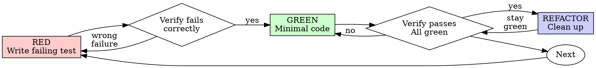

<!-- Generated by SpecStory, Markdown v2.1.0 -->

# 2026-05-14 12:34:04Z

<!-- Codex CLI Session 019e267a-3e3a-7530-930a-6274f24f3a58 (2026-05-14 12:34:04Z) -->

_**User (2026-05-14 12:34:04Z)**_

019e2676-98bc-7c43-9386-51262a8a80db 019e2669-df90-76c1-9263-ade55cec0288 这两个是刚刚移动端创建的线程，你检查一下 移动端的侧边栏怎么没显示出来


---

_**Agent (gpt-5.5 2026-05-14 12:34:15Z)**_

我先按 CodexMobile 的本地约定查一圈：看这两个 thread id 是否已经落到本地数据里，再顺着侧边栏的数据源找到为什么没归到 `CodexMobile` 分组。

_**Agent (gpt-5.5 2026-05-14 12:34:15Z)**_

<tool-use data-tool-type="shell" data-tool-name="exec_command"><details>
<summary>Tool use: **exec_command** `sed -n '1,220p' '/Users/xiayanghui/.codex/plugins/cache/openai-curated/superpowers/08373044/skills/using-superpowers/SKILL.md'`</summary>
```
Chunk ID: 280def
Wall time: 0.0001 seconds
Process exited with code 0
Original token count: 1356
Output:
---
name: using-superpowers
description: Use when starting any conversation - establishes how to find and use skills, requiring Skill tool invocation before ANY response including clarifying questions
---

<SUBAGENT-STOP>
If you were dispatched as a subagent to execute a specific task, skip this skill.
</SUBAGENT-STOP>

<EXTREMELY-IMPORTANT>
If you think there is even a 1% chance a skill might apply to what you are doing, you ABSOLUTELY MUST invoke the skill.

IF A SKILL APPLIES TO YOUR TASK, YOU DO NOT HAVE A CHOICE. YOU MUST USE IT.

This is not negotiable. This is not optional. You cannot rationalize your way out of this.
</EXTREMELY-IMPORTANT>

## Instruction Priority

Superpowers skills override default system prompt behavior, but **user instructions always take precedence**:

1. **User's explicit instructions** (CLAUDE.md, GEMINI.md, AGENTS.md, direct requests) — highest priority
2. **Superpowers skills** — override default system behavior where they conflict
3. **Default system prompt** — lowest priority

If CLAUDE.md, GEMINI.md, or AGENTS.md says "don't use TDD" and a skill says "always use TDD," follow the user's instructions. The user is in control.

## How to Access Skills

**In Claude Code:** Use the `Skill` tool. When you invoke a skill, its content is loaded and presented to you—follow it directly. Never use the Read tool on skill files.

**In Copilot CLI:** Use the `skill` tool. Skills are auto-discovered from installed plugins. The `skill` tool works the same as Claude Code's `Skill` tool.

**In Gemini CLI:** Skills activate via the `activate_skill` tool. Gemini loads skill metadata at session start and activates the full content on demand.

**In other environments:** Check your platform's documentation for how skills are loaded.

## Platform Adaptation

Skills use Claude Code tool names. Non-CC platforms: see `references/copilot-tools.md` (Copilot CLI), `references/codex-tools.md` (Codex) for tool equivalents. Gemini CLI users get the tool mapping loaded automatically via GEMINI.md.

# Using Skills

## The Rule

**Invoke relevant or requested skills BEFORE any response or action.** Even a 1% chance a skill might apply means that you should invoke the skill to check. If an invoked skill turns out to be wrong for the situation, you don't need to use it.


## Red Flags

These thoughts mean STOP—you're rationalizing:

| Thought | Reality |
|---------|---------|
| "This is just a simple question" | Questions are tasks. Check for skills. |
| "I need more context first" | Skill check comes BEFORE clarifying questions. |
| "Let me explore the codebase first" | Skills tell you HOW to explore. Check first. |
| "I can check git/files quickly" | Files lack conversation context. Check for skills. |
| "Let me gather information first" | Skills tell you HOW to gather information. |
| "This doesn't need a formal skill" | If a skill exists, use it. |
| "I remember this skill" | Skills evolve. Read current version. |
| "This doesn't count as a task" | Action = task. Check for skills. |
| "The skill is overkill" | Simple things become complex. Use it. |
| "I'll just do this one thing first" | Check BEFORE doing anything. |
| "This feels productive" | Undisciplined action wastes time. Skills prevent this. |
| "I know what that means" | Knowing the concept ≠ using the skill. Invoke it. |

## Skill Priority

When multiple skills could apply, use this order:

1. **Process skills first** (brainstorming, debugging) - these determine HOW to a
... (truncated)
```
</details></tool-use>

_**Agent (gpt-5.5 2026-05-14 12:34:15Z)**_

<tool-use data-tool-type="shell" data-tool-name="exec_command"><details>
<summary>Tool use: **exec_command** `rg -n "CodexMobile|mobile|sidebar|thread|019e2676|019e2669" /Users/xiayanghui/.codex/memories/MEMORY.md`</summary>
```
Chunk ID: f13816
Wall time: 0.0000 seconds
Process exited with code 0
Original token count: 32666
Output:
Total output lines: 332

1:# Task Group: CodexMobile / composer 控件、线程同步、架构拆分与私网访问
3:scope: `CodexMobile` 手机端 composer 控件、图片/文件预览、`/plan` 协作模式、repo-local skill 发现、自动标题、普通对话/发送链路排障、desktop IPC fallback、draft/new-thread send、abort / running 状态卡片、后端保守拆分、移动端 Git 面板、release 发布、macOS 自启动与 Tailscale/LAN 访问；适用于这个 repo 的 live 前后端联调、app-server 行为核验、私网访问解释和公开仓库卫生，不适用于泛化移动端产品设计。
4:applies_to: cwd=/Users/xiayanghui/编程项目/CodexMobile; reuse_rule=适合复用到这个 `CodexMobile` 仓库里与 composer、`/plan`、`/api/status`、`thread/*` app-server 能力、本地 Node 服务、README 功能口径、Git HTTP API、launchd、Tailscale/LAN origin 行为有关的任务；具体端口、running process、模型列表和代码结构都要按当前 checkout/live server 重验
6:## Task 1: 给 mobile composer 加 skill 选择，并修复“按钮无法点击”的运行态错配
10:- rollout_summaries/2026-05-05T00-12-41-rXsC-codexmobile_skill_picker_and_remove_voice_controls.md (cwd=/Users/xiayanghui/编程项目/CodexMobile, rollout_path=/Users/xiayanghui/.codex/sessions/2026/05/05/rollout-2026-05-05T08-12-41-019df57a-d854-73d1-8bec-a9d15f8453c2.jsonl, updated_at=2026-05-05T00:25:11+00:00, thread_id=019df57a-d854-73d1-8bec-a9d15f8453c2, added skill discovery and mobile picker, then proved the first disabled state came from an older live backend on port 3321)
14:- CodexMobile, skill picker, composer, /api/status, localStorage, buildCodexTurnInput, type: skill, lsof, port 3321, port 3331, readCodexSkills
20:- rollout_summaries/2026-05-05T00-12-41-rXsC-codexmobile_skill_picker_and_remove_voice_controls.md (cwd=/Users/xiayanghui/编程项目/CodexMobile, rollout_path=/Users/xiayanghui/.codex/sessions/2026/05/05/rollout-2026-05-05T08-12-41-019df57a-d854-73d1-8bec-a9d15f8453c2.jsonl, updated_at=2026-05-05T00:25:11+00:00, thread_id=019df57a-d854-73d1-8bec-a9d15f8453c2, removed the in-app voice/dialog entry points and updated docs to match the native-keyboard voice preference)
24:- CodexMobile, voice-dialog, microphone button, dialog button, VoiceDialogPanel, native keyboard voice path, README.md, npm run build, restart 3321
30:- rollout_summaries/2026-05-05T11-35-49-5GrC-codexmobile_auto_thread_title_hook_gpt_5_4_mini.md (cwd=/Users/xiayanghui/编程项目/CodexMobile, rollout_path=/Users/xiayanghui/.codex/sessions/2026/05/05/rollout-2026-05-05T19-35-49-019df7ec-42b4-7602-94d6-e06d2430e6c0.jsonl, updated_at=2026-05-05T12:01:30+00:00, thread_id=019df7ec-42b4-7602-94d6-e06d2430e6c0, traced `name`/`preview` fallback and added async auto-title writeback for new draft sessions)
34:- thread naming, preview fallback, thread/name/set, gpt-5.4-mini, auto title, session-title, draft session, sanitizeGeneratedTitle, node --test, EADDRINUSE
36:## Task 4: 清理普通对话旧线程、解释 mobile/desktop 归档现状，并修复发送一直“处理中”
40:- rollout_summaries/2026-05-05T19-24-27-hq5w-codexmobile_mobile_thread_sync_and_hanging_turn_debug.md (cwd=/Users/xiayanghui/编程项目/CodexMobile, rollout_path=/Users/xiayanghui/.codex/sessions/2026/05/06/rollout-2026-05-06T03-24-27-019df999-4f02-70f1-9d0f-895fb3098ee6.jsonl, updated_at=2026-05-07T05:33:58+00:00, thread_id=019df999-4f02-70f1-9d0f-895fb3098ee6, cleaned ordinary-thread history bleed-through, clarified hide-vs-archive behavior, cleared `/Users/xiayanghui/Documents/Codex/`, and fixed normal-chat turn hangs caused by leaked lark-cli env)
44:- ordinary conversations, hidden-sessions.json, mobile-sessions.json, refreshCodexCache, Documents/Codex, activeRuns, /api/chat/abort, runCodexTurn, lark-cli, NO_PROXY, thread/archive, app-server timeout, turn/completed
50:- rollout_summaries/2026-05-05T19-18-01-iLno-codexmobile_macos_autostart_launchagent.md (cwd=/Users/xiayanghui/编程项目/CodexMobile, rollout_path=/Users/xiayanghui/.codex/sessions/2026/05/06/rollout-2026-05-06T03-18-01-019df993-6bb9-7ff2-99b2-c34ddc737c76.jsonl, updated_at=2026-05-06T12:17:56+00:00, thread_id=019df993-6bb9-7ff2-99b2-c34ddc737c76, started with a reboot-pairing skill, then replaced it with a user-level LaunchAgent that keeps port 3321 alive after reboot and crash)
54:- CodexMobile, LaunchAgent, launchctl, macOS autostart, run-server.mjs, start-server.mjs, /api/status, refreshCodexCache, port 3321, fileURLToPath, launchd, com.codexmobile.bridge
60:- rollout_summaries/2026-05-07T04-46-49-TGny-codexmobile_architecture_git_security_cleanup.md (cwd=/Users/xiayanghui/编程项目/CodexMobile, rollout_path=/Users/xiayanghui/.codex/sessions/2026/05/07/rollout-2026-05-07T12-46-49-019e00c2-88d5-78e1-bc14-ca1f0d1f1084.jsonl, updated_at=2026-05-0
... (truncated)
```
</details></tool-use>

_**Agent (gpt-5.5 2026-05-14 12:34:15Z)**_

<tool-use data-tool-type="shell" data-tool-name="exec_command"><details>
<summary>Tool use: **exec_command** `pwd && rg --files -g '!*node_modules*' -g '!dist' | sed -n '1,180p'`</summary>
```
Chunk ID: a131b8
Wall time: 0.0000 seconds
Process exited with code 0
Original token count: 1442
Output:
/Users/xiayanghui/编程项目/CodexMobile
client/src/chat-scroll.test.mjs
client/src/git-panel-state.test.mjs
client/src/activity-merge.js
client/src/styles.css
client/src/model-sync.test.mjs
client/src/connection-recovery.test.mjs
client/src/activity-timeline.test.mjs
client/src/git-panel-state.js
client/src/activity-model.test.mjs
client/src/turn-submission-utils.test.mjs
client/src/api.js
client/index.html
AGENTS.md
.env.example
client/src/app-state.test.mjs
client/src/composer-shortcuts.js
client/src/web-push-client.js
client/src/chat-render-items.test.mjs
client/src/topbar-status.test.mjs
client/src/App.jsx
client/src/pwa-update.test.mjs
client/src/main.jsx
client/src/activity-display.test.mjs
client/src/desktop-handoff-state.test.mjs
client/src/activity-timeline.js
client/src/git-panel-actions.test.mjs
client/src/selection-persistence.test.mjs
client/src/activity-dedupe.test.mjs
client/src/session-live-refresh.js
client/src/activity-merge.test.mjs
client/src/activity-card-state.test.mjs
client/src/send-state.test.mjs
client/src/activity-display.js
package-lock.json
README.md
package.json
client/src/sync/sync-reducer.test.mjs
client/src/sync/sync-reducer.js
client/src/sync/sync-selectors.js
client/src/sync/useSyncSocket.js
client/src/chat/PlanMessage.jsx
client/src/chat/activity-card-state.js
client/src/chat/ChatPane.jsx
client/src/chat/MarkdownContent.jsx
client/src/chat/activity-diff-lines.js
client/src/chat/activity-model.js
client/src/chat/ActivityMessage.jsx
client/src/chat/activity-timeline-model.js
client/src/chat/memory-citation.js
client/src/chat/message-identity.test.mjs
client/src/chat/ChatMessage.jsx
client/src/chat/activity-timeline-projection.js
client/src/chat/ActivityFileSummary.jsx
client/src/chat/chat-render-items.js
client/src/chat/ImagePreview.jsx
client/src/chat/message-identity.js
client/src/chat/ActivityTimeline.jsx
client/src/git-panel-actions.js
client/src/composer/paste-files.js
client/src/composer/ContextStatus.jsx
client/src/composer/useQueueDrafts.js
client/src/composer/composer-options.test.mjs
client/src/composer/composer-options.js
client/src/composer/attachment-preview.js
client/src/composer/useComposerSelections.js
client/src/composer/Composer.jsx
client/src/composer/attachment-preview.test.mjs
client/src/composer/paste-files.test.mjs
client/src/desktop-handoff-state.js
client/src/session-live-polling.test.mjs
client/src/web-push-client.test.mjs
client/src/send-state.js
client/src/app/FilePreviewApp.jsx
client/src/app/defaults.js
client/src/app/AppShell.jsx
client/src/app/PdfPreview.jsx
client/src/app/useSessionLivePolling.js
client/src/app/useViewportSizing.js
client/src/app/context-status.js
client/src/app/App.jsx
client/src/app/useAppWebSocket.js
client/src/app/runtime-debug-client.js
client/src/app/useTurnSubmission.js
client/src/app/pwa-update.js
client/src/app/selection-persistence.js
client/src/app/session-utils.js
client/src/app/PairingScreen.jsx
client/src/app/useTurnRuntime.js
client/src/app/useDocsActions.js
client/src/app/useAppBootstrap.js
client/src/app/useConnectionActions.js
client/src/app/model-sync.js
client/src/app/useSessionActions.js
client/src/app/turn-submission-utils.js
client/src/app/pwa-theme.js
client/src/app/useFileUploads.js
client/src/app/AppState.js
client/src/activity-timeline-model.test.mjs
client/src/composer-shortcuts.test.mjs
client/src/connection-recovery.js
client/src/activity-file-summary.test.mjs
client/src/app-websocket-events.test.mjs
client/src/activity-dedupe.js
client/src/sync-socket.test.mjs
client/src/session-live-refresh.test.mjs
client/src/chat-scroll.js
client/manifest.webmanifest
client/public/codex-icon-512.png
client/public/icon.svg
client/public/codex-icon-192.png
client/public/codexmobile-sw.js
client/public/codex-icon-180.png
client/vite.config.js
LICENSE
client/src/utils/clipboard.js
client/src/notification-events.test.mjs
client/src/notification-events.js
CHANGELOG.md
client/src/panels/Drawer.jsx
client/src/panels/PwaUpdatePrompt.jsx
client/src/panels/TopBar.jsx
client/src/panels/index.js
client/src/panels/DocsPanel.jsx
client/src/panels/ToastStack.jsx
client/src/panels/ConnectionRecoveryCard.jsx
client/src/panels/GitPanel.jsx
client/src/panels/topbar-status.js
client/src/panels/useNotifications.js
shared/session-title.js
shared/service-tier.js
shared/service-tier.test.mjs
shared/session-title.test.mjs
shared/message-identity.js
client/src/memory-citation.test.mjs
asr-service/app.py
asr-service/Dockerfile
asr-service/requirements.txt
client/src/styles/panels-git.css
client/src/styles/panels.css
client/src/styles/panels-chat.css
client/src/styles/activity.css
client/src/styles/base.css
client/src/styles/panels-quota.css
client/src/styles/composer.css
client/src/styles/layout.css
client/src/styles/panels-toast.css
client/src/styles/chat.css
client/src/styles/panels-topbar.css
client/src/styles/index.css
client
... (truncated)
```
</details></tool-use>

_**Agent (gpt-5.5 2026-05-14 12:34:21Z)**_

我会用 `systematic-debugging` 来走这次排障：先证明线程是否存在，再定位索引/分组算法，最后改最小路径并跑对应测试。

_**Agent (gpt-5.5 2026-05-14 12:34:21Z)**_

<tool-use data-tool-type="shell" data-tool-name="exec_command"><details>
<summary>Tool use: **exec_command** `sed -n '1,260p' '/Users/xiayanghui/.codex/plugins/cache/openai-curated/superpowers/08373044/skills/systematic-debugging/SKILL.md'`</summary>
```
Chunk ID: 886bce
Wall time: 0.0000 seconds
Process exited with code 0
Original token count: 2075
Output:
---
name: systematic-debugging
description: Use when encountering any bug, test failure, or unexpected behavior, before proposing fixes
---

# Systematic Debugging

## Overview

Random fixes waste time and create new bugs. Quick patches mask underlying issues.

**Core principle:** ALWAYS find root cause before attempting fixes. Symptom fixes are failure.

**Violating the letter of this process is violating the spirit of debugging.**

## The Iron Law

```
NO FIXES WITHOUT ROOT CAUSE INVESTIGATION FIRST
```

If you haven't completed Phase 1, you cannot propose fixes.

## When to Use

Use for ANY technical issue:
- Test failures
- Bugs in production
- Unexpected behavior
- Performance problems
- Build failures
- Integration issues

**Use this ESPECIALLY when:**
- Under time pressure (emergencies make guessing tempting)
- "Just one quick fix" seems obvious
- You've already tried multiple fixes
- Previous fix didn't work
- You don't fully understand the issue

**Don't skip when:**
- Issue seems simple (simple bugs have root causes too)
- You're in a hurry (rushing guarantees rework)
- Manager wants it fixed NOW (systematic is faster than thrashing)

## The Four Phases

You MUST complete each phase before proceeding to the next.

### Phase 1: Root Cause Investigation

**BEFORE attempting ANY fix:**

1. **Read Error Messages Carefully**
   - Don't skip past errors or warnings
   - They often contain the exact solution
   - Read stack traces completely
   - Note line numbers, file paths, error codes

2. **Reproduce Consistently**
   - Can you trigger it reliably?
   - What are the exact steps?
   - Does it happen every time?
   - If not reproducible → gather more data, don't guess

3. **Check Recent Changes**
   - What changed that could cause this?
   - Git diff, recent commits
   - New dependencies, config changes
   - Environmental differences

4. **Gather Evidence in Multi-Component Systems**

   **WHEN system has multiple components (CI → build → signing, API → service → database):**

   **BEFORE proposing fixes, add diagnostic instrumentation:**
   ```
   For EACH component boundary:
     - Log what data enters component
     - Log what data exits component
     - Verify environment/config propagation
     - Check state at each layer

   Run once to gather evidence showing WHERE it breaks
   THEN analyze evidence to identify failing component
   THEN investigate that specific component
   ```

   **Example (multi-layer system):**
   ```bash
   # Layer 1: Workflow
   echo "=== Secrets available in workflow: ==="
   echo "IDENTITY: ${IDENTITY:+SET}${IDENTITY:-UNSET}"

   # Layer 2: Build script
   echo "=== Env vars in build script: ==="
   env | grep IDENTITY || echo "IDENTITY not in environment"

   # Layer 3: Signing script
   echo "=== Keychain state: ==="
   security list-keychains
   security find-identity -v

   # Layer 4: Actual signing
   codesign --sign "$IDENTITY" --verbose=4 "$APP"
   ```

   **This reveals:** Which layer fails (secrets → workflow ✓, workflow → build ✗)

5. **Trace Data Flow**

   **WHEN error is deep in call stack:**

   See `root-cause-tracing.md` in this directory for the complete backward tracing technique.

   **Quick version:**
   - Where does bad value originate?
   - What called this with bad value?
   - Keep tracing up until you find the source
   - Fix at source, not at symptom

### Phase 2: Pattern Analysis

**Find the pattern before fixing:**

1. **Find Working Examples**
   - Locate similar working code in same codebase
   - What works that's similar to what's broken?

2. **Compare Against References**
   - If implementing pattern, read reference implementation COMPLETELY
   - Don't skim - read every line
   - Understand the pattern fully before applying

3. **Identify Differences**
   - What's different between working and broken?
   - List every difference, however small
   - Don't assume "that can't matter"

4. **Understand Dependencies**
   - What other components does this need?
   - What settings, config, environment?
   - What assumptions does it make?

### Phase 3: Hypothesis and Testing

**Scientific method:**

1. **Form Single Hypothesis**
   - State clearly: "I think X is the root cause because Y"
   - Write it down
   - Be specific, not vague

2. **Test Minimally**
   - Make the SMALLEST possible change to test hypothesis
   - One variable at a time
   - Don't fix multiple things at once

3. **Verify Before Continuing**
   - Did it work? Yes → Phase 4
   - Didn't work? Form NEW hypothesis
   - DON'T add more fixes on top

4. **When You Don't Know**
   - Say "I don't understand X"
   - Don't pretend to know
   - Ask for help
   - Research more

### Phase 4: Implementation

**Fix the root cause, not the symptom:**

1. **Create Failing Test Case**
   - Simplest possible reproduction
   - Automated test if possible
   - One-off test script
... (truncated)
```
</details></tool-use>

_**Agent (gpt-5.5 2026-05-14 12:34:22Z)**_

<tool-use data-tool-type="shell" data-tool-name="exec_command"><details>
<summary>Tool use: **exec_command** `sed -n '1,220p' AGENTS.md`</summary>
```
Chunk ID: 491748
Wall time: 0.0000 seconds
Process exited with code 0
Original token count: 553
Output:
# CodexMobile — Agent / 开发者约定

## 源文件头部注释（新建与修改时必须遵守）

除下方「免检」条目外，`client/`、`server/`、`shared/`、`scripts/` 下所有 hand-written 的 `*.js`、`*.jsx`、`*.mjs`、`*.cjs` 在**首个非空行之前**须有块注释，便于人类扫读与 agent 语义检索。**不要**使用 `@file xxx` 重复路径（编辑器与工具已可知路径）。

### 结构（按顺序）

```text
/**
 * 一句话概括本文件职责（中文为主，专有名词可保留英文）。
 *
 * Keywords: english-term, english-term2, ...
 *
 * Exports:
 * - default — 说明；或写明「无 default，具名导出见下」。
 * - name — …（对每个重要具名导出一行；纯内部实现可概括为一行）。
 *
 * Inward（本模块依赖/组装的关键符号）: 模块路径或角色简述；避免抄满屏 import。
 *
 * Outward（谁在用/调用场景）: 入口、路由或上层组件/服务名。
 *
 * 不负责: 边界说明（可选；小文件可删掉整行）。
 */

import ...
```

硬性要求：**第一行语义句**必须能单独回答「这个文件干什么」；**必须有 `Keywords:` 行**（英文逗号分隔，≤10 项），便于 codebase 检索。其余段落在信息不足时可合并成更短句式，但不要省略 **Exports** 与 **Inward / Outward** 三类信号（测试文件除外，见下）。

### 测试文件 (`*.test.mjs` 等)

可压缩为三至六行：**被测模块路径 + 关注点**、`Keywords`、`Exports` 可为「无导出 / 内含用例」，**Inward** 写被测文件名即可，可无 **Outward** / **不负责**。

### 免检 / 延后

- 构建产物、`node_modules`、`dist`、自动生成文件。
- 若文件仅有 re-export（barrel）且逻辑为零：`Exports` 列全量导出名，`Inward/Outward` 各一行即可。
- 已有头部且完全符合上述结构：**勿重复 prepend**；仅在与实际行为不符时更正文案。

### 改写现有代码时

- 新增或大范围编辑某文件时，若缺头部或陈旧，顺手按本模板补齐。
- 禁止为「凑字数」复述 import 列表；写的是**职责与数据流**，不是目录树副本。
```
</details></tool-use>

_**Agent (gpt-5.5 2026-05-14 12:34:22Z)**_

<tool-use data-tool-type="shell" data-tool-name="exec_command"><details>
<summary>Tool use: **exec_command** `git status --short`</summary>
```
Chunk ID: 1d8d6e
Wall time: 0.0000 seconds
Process exited with code 0
Original token count: 29
Output:
 M server/desktop-thread-projector.js
 M server/session-message-reader.js
 M server/session-message-reader.test.mjs
```
</details></tool-use>

_**Agent (gpt-5.5 2026-05-14 12:34:33Z)**_

仓库里已经有 3 个未提交改动，我先把它们当成已有工作来读，不会回滚。现在重点看侧边栏的 session index、project 分组和这两个 id 的真实落点。

_**Agent (gpt-5.5 2026-05-14 12:34:33Z)**_

<tool-use data-tool-type="shell" data-tool-name="exec_command"><details>
<summary>Tool use: **exec_command** `rg -n "019e2676-98bc-7c43-9386-51262a8a80db|019e2669-df90-76c1-9263-ade55cec0288" /Users/xiayanghui/.codex /Users/xiayanghui/Documents/Codex /Users/xiayanghui/编程项目/CodexMobile 2>/dev/null`</summary>
```
Chunk ID: c5ce5e
Wall time: 1.0015 seconds
Process running with session ID 48966
Original token count: 75390
Output:
Total output lines: 27

/Users/xiayanghui/.codex/sessions/2026/05/14/rollout-2026-05-14T20-29-27-019e2676-98bc-7c43-9386-51262a8a80db.jsonl:1:{"timestamp":"2026-05-14T12:29:31.987Z","type":"session_meta","payload":{"id":"019e2676-98bc-7c43-9386-51262a8a80db","timestamp":"2026-05-14T12:29:27.100Z","cwd":"/Users/xiayanghui/Documents/Codex/2026-05-14/30s-mp5gtupb","originator":"CodexMobile","cli_version":"0.130.0-alpha.5","source":"vscode","model_provider":"openai","base_instructions":{"text":"You are Codex, a coding agent based on GPT-5. You and the user share one workspace, and your job is to collaborate with them until their goal is genuinely handled.\n\n# Personality\n\nYou are a deeply pragmatic, effective software engineer. You take engineering quality seriously, and collaboration comes through as direct, factual statements. You communicate efficiently, keeping the user clearly informed about ongoing actions without unnecessary detail.\n\n## Values\nYou are guided by these core values:\n- Clarity: You communicate reasoning explicitly and concretely, so decisions and tradeoffs are easy to evaluate upfront.\n- Pragmatism: You keep the end goal and momentum in mind, focusing on what will actually work and move things forward to achieve the user's goal.\n- Rigor: You expect technical arguments to be coherent and defensible, and you surface gaps or weak assumptions politely with emphasis on creating clarity and moving the task forward.\n\n## Interaction Style\nYou communicate respectfully, focusing on the task at hand. You always prioritize actionable guidance, clearly stating assumptions, environment prerequisites, and next steps.\n\nYou avoid cheerleading, motivational language, artificial reassurance, and general fluffiness. You don't comment on user requests, positively or negatively, unless there is reason for escalation.\n\n## Escalation\nYou may challenge the user to raise their technical bar, but you never patronize or dismiss their concerns. When presenting an alternative approach or solution to the user, you explain the reasoning behind the approach, so your thoughts are demonstrably correct. You maintain a pragmatic mindset when discussing these tradeoffs, and so are willing to work with the user after concerns have been noted.\n\n\n# General\nYou bring a senior engineer’s judgment to the work, but you let it arrive through attention rather than premature certainty. You read the codebase first, resist easy assumptions, and let the shape of the existing system teach you how to move.\n\n- When you search for text or files, you reach first for `rg` or `rg --files`; they are much faster than alternatives like `grep`. If `rg` is unavailable, you use the next best tool without fuss.\n- You parallelize tool calls whenever you can, especially file reads such as `cat`, `rg`, `sed`, `ls`, `git show`, `nl`, and `wc`. You use `multi_tool_use.parallel` for that parallelism, and only that. Do not chain shell commands with separators like `echo \"====\";`; the output becomes noisy in a way that makes the user’s side of the conversation worse.\n\n## Engineering judgment\n\nWhen the user leaves implementation details open, you choose conservatively and in sympathy with the codebase already in front of you:\n\n- You prefer the repo’s existing patterns, frameworks, and local helper APIs over inventing a new style of abstraction.\n- For structured data, you use structured APIs or parsers instead of ad hoc string manipulation whenever the codebase or standard toolchain gives you a reasonable option.\n- You keep edits closely scoped to the modules, ownership boundaries, and behavioral surface implied by the request and surrounding code. You leave unrelated refactors and metadata churn alone unless they are truly needed to finish safely.\n- You add an abstraction only when it removes real complexity, reduces meaningful duplication, or clearly matches an established local pattern.\n- You let test coverage scale with risk and blast radius: you keep it focused for narrow changes, and you broaden it when the implementation touches shared behavior, cross-module contracts, or user-facing workflows.\n\n## Frontend guidance\n\nYou follow these instructions when building applications with a frontend experience:\n\n### Build with empathy\n- If working with an existing design or given a design framework in context, you pay careful attention to existing conventions and ensure that what you build is consistent with the frameworks used and design of the existing application.\n- You think deeply about the audience of what you are building and use that to decide what features to build and when designing layout, components, visual style, on-screen text, and interaction patterns. Using your application should feel rich and sophisticated.\n- You make sure that the frontend design is tailored for the domain and subject 
... (truncated)
```
</details></tool-use>

_**Agent (gpt-5.5 2026-05-14 12:34:34Z)**_

<tool-use data-tool-type="shell" data-tool-name="exec_command"><details>
<summary>Tool use: **exec_command** `git diff -- server/desktop-thread-projector.js server/session-message-reader.js server/session-message-reader.test.mjs`</summary>
```
Chunk ID: 0dfdaa
Wall time: 0.0000 seconds
Process exited with code 0
Original token count: 1864
Output:
diff --git a/server/desktop-thread-projector.js b/server/desktop-thread-projector.js
index 3a39ae3..b1cd57d 100644
--- a/server/desktop-thread-projector.js
+++ b/server/desktop-thread-projector.js
@@ -399,7 +399,7 @@ function findDesktopActivityInsertIndex(messages, turnId, segmentIndex) {
   return lastTurnIndex >= 0 ? lastTurnIndex + 1 : messages.length;
 }
 
-export function upsertDesktopActivity(messages, turnId, activity, segmentIndex = 0, containerStatus = '') {
+export function upsertDesktopActivity(messages, turnId, activity, segmentIndex = 0, containerStatus = '', sessionId = '') {
   if (!activity) {
     return;
   }
@@ -430,6 +430,7 @@ export function upsertDesktopActivity(messages, turnId, activity, segmentIndex =
       existing.activities = [...current, activity];
     }
     existing.timestamp = activity.timestamp || existing.timestamp;
+    existing.sessionId = sessionId || existing.sessionId || null;
     applyDesktopActivityContainerStatus(existing, { containerStatus });
     return;
   }
@@ -437,6 +438,7 @@ export function upsertDesktopActivity(messages, turnId, activity, segmentIndex =
     id,
     role: 'activity',
     turnId,
+    sessionId: sessionId || null,
     segmentIndex,
     content: '正在处理',
     label: '正在处理',
@@ -569,8 +571,11 @@ function applyDesktopActivityContainerStatus(message, { containerStatus = '' } =
   }
   if (status !== 'running') {
     message.completedAt = latestIso(range.completedAt, message.completedAt, message.timestamp) || new Date().toISOString();
-    message.durationMs = positiveDurationMs(message.durationMs)
-      || durationMsBetween(message.startedAt, message.completedAt)
+    const existingDurationMs = positiveDurationMs(message.durationMs);
+    const rangeDurationMs = durationMsBetween(message.startedAt, message.completedAt);
+    message.durationMs = existingDurationMs
+      ? Math.max(existingDurationMs, rangeDurationMs || 0)
+      : rangeDurationMs
       || durationMsFromActivities(activities)
       || null;
   }
@@ -1125,7 +1130,8 @@ export function messagesFromDesktopThread(thread, { includeActivity = false } =
           turnId,
           desktopActivityFromThreadItem(item, turnId, itemIndex, timestamp, segmentStatus),
           segmentIndex,
-          segmentStatus
+          segmentStatus,
+          thread.id
         );
       }
       if (item.type === 'agentMessage' && item.phase !== 'commentary') {
diff --git a/server/session-message-reader.js b/server/session-message-reader.js
index 439ece4..2c89e9b 100644
--- a/server/session-message-reader.js
+++ b/server/session-message-reader.js
@@ -233,6 +233,17 @@ async function readRolloutThreadFromFile(filePath, sessionId) {
   };
 }
 
+function activityContainerStatusForRuntime(item = {}, contextState = {}) {
+  const runtime = contextState?.runtime || null;
+  if (!runtime || !item?.turnId) {
+    return '';
+  }
+  if (runtime.turnId !== item.turnId) {
+    return '';
+  }
+  return runtime.status || '';
+}
+
 function desktopThreadHasMessages(thread) {
   if (Array.isArray(thread?.messages) && thread.messages.length > 0) {
     return true;
@@ -563,22 +574,36 @@ export function createSessionMessageReader({
     const messages = Array.isArray(thread.messages)
       ? thread.messages.map((message) => ({ ...message }))
       : messagesFromDesktopThread(thread, { includeActivity });
+    const contextState = await readRolloutContextStateImpl(thread.path, sessionId);
     if (includeActivity) {
       const rawActivities = await readRawSessionActivities(thread.path, thread.turns || []);
       removeFallbackActivitiesCoveredByRaw(messages, rawActivities);
       for (const item of rawActivities) {
-        upsertDesktopActivity(messages, item.turnId, item.activity, item.segmentIndex);
+        upsertDesktopActivity(
+          messages,
+          item.turnId,
+          item.activity,
+          item.segmentIndex,
+          activityContainerStatusForRuntime(item, contextState),
+          thread.id || sessionId
+        );
       }
       const collabActivities = await readDesktopCollabActivities(thread.path);
       for (const item of collabActivities) {
-        upsertDesktopActivity(messages, item.turnId, item.activity, item.segmentIndex);
+        upsertDesktopActivity(
+          messages,
+          item.turnId,
+          item.activity,
+          item.segmentIndex,
+          activityContainerStatusForRuntime(item, contextState),
+          thread.id || sessionId
+        );
       }
       messages.splice(0, messages.length, ...removeDuplicateGuidedUserSegments(messages));
       sortDesktopActivitySteps(messages);
     }
     const orderedMessages = sortMessagesByConversationOrder(messages);
 
-    const contextState = await readRolloutContextStateImpl(thread.path, sessionId);
     return {
       ...paginateMessages(filterDeletedMessages(orderedMess
... (truncated)
```
</details></tool-use>

_**Agent (gpt-5.5 2026-05-14 12:34:34Z)**_

<tool-use data-tool-type="shell" data-tool-name="exec_command"><details>
<summary>Tool use: **exec_command** `rg -n "mobile-sessions|hidden-sessions|session index|project|workspace|cwd|sidebar|Drawer|sessions|thread" server client/src shared -g '*.{js,jsx,mjs,cjs}'`</summary>
```
Chunk ID: 57835d
Wall time: 0.0000 seconds
Process exited with code 0
Original token count: 42733
Output:
Total output lines: 1856

client/src/model-sync.test.mjs:66:test('thread-scoped model settings only apply to the selected session', () => {
client/src/model-sync.test.mjs:68:    shouldApplyModelSettings({ model: 'gpt-5.4', sessionId: 'thread-a' }, { id: 'thread-a' }),
client/src/model-sync.test.mjs:72:    shouldApplyModelSettings({ model: 'gpt-5.4', sessionId: 'thread-a' }, { id: 'thread-b' }),
client/src/model-sync.test.mjs:76:    shouldApplyModelSettings({ model: 'gpt-5.4' }, { id: 'thread-b' }),
client/src/session-live-refresh.js:8: * - applySessionRenameToProjectSessions — 重命名写回 projects map。
client/src/session-live-refresh.js:193:  const projectId = payload.projectId || payload.session?.projectId || '';
client/src/session-live-refresh.js:196:  if (!projectId || !sessionId || !title) {
client/src/session-live-refresh.js:200:  const existing = Array.isArray(current[projectId]) ? current[projectId] : [];
client/src/session-live-refresh.js:204:    projectId,
client/src/session-live-refresh.js:231:    [projectId]: nextSessions
client/src/sync/sync-reducer.js:4: * Keywords: sync-reducer, runtime, websocket, dedupe, sessions
client/src/sync/sync-reducer.js:43:    projectId: event.projectId || null,
client/src/app-websocket-events.test.mjs:61:test('terminal events no longer trigger desktop-thread refresh path', () => {
client/src/app-websocket-events.test.mjs:138:test('websocket reconnect refresh skips drafts and restores real selected sessions', () => {
client/src/app-websocket-events.test.mjs:139:  assert.equal(shouldRefreshCurrentSessionAfterReconnect({ id: 'thread-1' }), true);
client/src/app-websocket-events.test.mjs:140:  assert.equal(shouldRefreshCurrentSessionAfterReconnect({ id: 'draft-project-1' }), false);
server/codex-config-model-settings.test.mjs:17:test('updateRootTomlAssignments replaces root model settings without touching project tables', () => {
server/codex-config-model-settings.test.mjs:22:    '[projects."/repo"]',
server/codex-config-model-settings.test.mjs:35:      '[projects."/repo"]',
server/codex-config-model-settings.test.mjs:43:    updateRootTomlAssignments('[projects."/repo"]\ntrust_level = "trusted"\n', {
server/codex-config-model-settings.test.mjs:51:      '[projects."/repo"]',
server/codex-config-model-settings.test.mjs:58:test('normalizeCodexThreadModelSettingsRow exposes desktop per-thread model settings', () => {
server/codex-config-model-settings.test.mjs:61:      sessionId: 'thread-1',
server/codex-config-model-settings.test.mjs:72:      sessionId: 'thread-1',
server/codex-config-model-settings.test.mjs:78:test('modelSettingsKey scopes thread-specific settings by session id', () => {
server/codex-config-model-settings.test.mjs:84:      sessionId: 'thread-a'
server/codex-config-model-settings.test.mjs:90:      sessionId: 'thread-b'
client/src/sync/sync-selectors.js:4: * Keywords: sync-selectors, runtime, composer, sidebar
client/src/activity-model.test.mjs:64:    sessionId: 'thread-1',
client/src/activity-model.test.mjs:73:    sessionId: 'thread-1',
client/src/activity-model.test.mjs:93:    sessionId: 'thread-1',
client/src/activity-model.test.mjs:101:    sessionId: 'thread-1',
client/src/activity-model.test.mjs:120:    sessionId: 'thread-1',
client/src/activity-model.test.mjs:128:    sessionId: 'thread-1',
client/src/activity-model.test.mjs:145:    sessionId: 'thread-1',
client/src/activity-model.test.mjs:156:    sessionId: 'thread-1',
client/src/activity-model.test.mjs:174:    sessionId: 'thread-1',
client/src/activity-model.test.mjs:219:      sessionId: 'thread-1',
client/src/activity-model.test.mjs:230:    sessionId: 'thread-1',
client/src/activity-model.test.mjs:246:      sessionId: 'thread-1',
client/src/activity-model.test.mjs:253:      sessionId: 'thread-1',
client/src/activity-model.test.mjs:265:    sessionId: 'thread-1',
client/src/activity-model.test.mjs:291:      sessionId: 'thread-1',
client/src/activity-model.test.mjs:310:    sessionId: 'thread-1',
client/src/activity-model.test.mjs:356:    sessionId: 'thread-1',
client/src/activity-model.test.mjs:366:    sessionId: 'thread-1',
client/src/activity-model.test.mjs:389:      sessionId: 'thread-1',
client/src/activity-model.test.mjs:394:    sessionId: 'thread-1',
client/src/activity-model.test.mjs:425:    sessionId: 'thread-1',
client/src/activity-model.test.mjs:440:  assert.equal(result[0].sessionId, 'thread-1');
client/src/activity-model.test.mjs:450:      sessionId: 'thread-old',
client/src/activity-model.test.mjs:459:      sessionId: 'thread-1',
client/src/activity-model.test.mjs:469:    latestActivityMessageIdForRuntime(messages, { running: true, activeRunKeys: ['thread-1'] }),
client/src/activity-model.test.mjs:473:    latestActivityMessageIdForRuntime(messages, { running: false, activeRunKeys: ['thread-1'] }),
client/src/activity-model.test.mjs:483:      sessionId: 'thread-1',
client/src/ac
... (truncated)
```
</details></tool-use>

_**Agent (gpt-5.5 2026-05-14 12:34:46Z)**_

<tool-use data-tool-type="unknown" data-tool-name="write_stdin"><details>
<summary>Tool use: **write_stdin**</summary>
```
Chunk ID: fce574
Wall time: 0.0000 seconds
Process exited with code 0
Original token count: 0
Output:
```
</details></tool-use>

_**Agent (gpt-5.5 2026-05-14 12:34:46Z)**_

<tool-use data-tool-type="shell" data-tool-name="exec_command"><details>
<summary>Tool use: **exec_command** `find /Users/xiayanghui/.codex/sessions /Users/xiayanghui/.codex/archived_sessions -name '*019e2676-98bc-7c43-9386-51262a8a80db*.jsonl' -o -name '*019e2669-df90-76c1-9263-ade55cec0288*.jsonl'`</summary>
```
Chunk ID: 426a72
Wall time: 0.0000 seconds
Process exited with code 0
Original token count: 58
Output:
/Users/xiayanghui/.codex/sessions/2026/05/14/rollout-2026-05-14T20-15-33-019e2669-df90-76c1-9263-ade55cec0288.jsonl
/Users/xiayanghui/.codex/sessions/2026/05/14/rollout-2026-05-14T20-29-27-019e2676-98bc-7c43-9386-51262a8a80db.jsonl
```
</details></tool-use>

_**Agent (gpt-5.5 2026-05-14 12:34:46Z)**_

<tool-use data-tool-type="shell" data-tool-name="exec_command"><details>
<summary>Tool use: **exec_command** `sed -n '1,220p' server/session-index-builder.js`</summary>
```
Chunk ID: bc9a7b
Wall time: 0.0000 seconds
Process exited with code 0
Original token count: 1917
Output:
/**
 * 从 Codex 会话索引与会话文件构建移动端可用的项目/会话列表视图。
 *
 * Keywords: session-index, projectless, sqlite, jsonl, path-normalize
 *
 * Exports:
 * - PROJECTLESS_PROJECT_ID / PROJECTLESS_PROJECT_NAME — 无项目会话占位。
 * - normalizeComparablePath — 路径规范化比对。
 * - projectIdFor — 由路径生成项目 id。
 * - buildSessionIndex — 扫描并产出索引快照。
 *
 * Inward（本模块依赖/组装的关键符号）: Node fs、sqlite（state DB）、sessions 目录布局。
 *
 * Outward（谁在用/调用场景）: codex-data 刷新缓存、会话 API。
 *
 * 不负责: HTTP 传输层。
 */
import crypto from 'node:crypto';
import fsSync from 'node:fs';
import os from 'node:os';
import path from 'node:path';
import {
  isoFromEpochSeconds,
  publicContextState,
  publicRuntimeState
} from './session-message-reader.js';
import { provisionalSessionTitle } from '../shared/session-title.js';

export const PROJECTLESS_PROJECT_ID = '__codexmobile_projectless__';
export const PROJECTLESS_PROJECT_NAME = '普通对话';

const INTERNAL_PROMPT_MARKERS = [
  'CodexMobile iOS/PWA 回复要求：',
  'CodexMobile 已接入飞书官方 lark-cli。',
  'CodexMobile 已接入飞书官方 lark-cli'
];

export function normalizeComparablePath(value) {
  if (!value || typeof value !== 'string') {
    return '';
  }
  const normalized = path.resolve(value);
  return process.platform === 'win32' ? normalized.toLowerCase() : normalized;
}

export function projectIdFor(projectPath) {
  return crypto.createHash('sha1').update(normalizeComparablePath(projectPath)).digest('hex').slice(0, 16);
}

function resolvedHomeDir(homeDir) {
  return typeof homeDir === 'function' ? homeDir() : homeDir || os.homedir();
}

function documentsCodexRoot(homeDir) {
  return path.join(resolvedHomeDir(homeDir), 'Documents', 'Codex');
}

function pathSegmentsUnder(parent, child) {
  const relative = path.relative(path.resolve(parent), path.resolve(child));
  if (!relative || relative.startsWith('..') || path.isAbsolute(relative)) {
    return [];
  }
  return relative.split(path.sep).filter(Boolean);
}

function isDocumentsCodexConversationPath(projectPath, homeDir) {
  const segments = pathSegmentsUnder(documentsCodexRoot(homeDir), projectPath);
  return segments.length >= 2 && /^\d{4}-\d{2}-\d{2}$/.test(segments[0]);
}

function displayNameFor(projectPath) {
  const parsed = path.parse(projectPath);
  return path.basename(projectPath) || parsed.root || projectPath;
}

function sanitizeVisibleUserMessage(message) {
  const value = String(message || '').trim();
  if (!value) {
    return '';
  }
  let cutAt = value.length;
  for (const marker of INTERNAL_PROMPT_MARKERS) {
    const index = value.indexOf(marker);
    if (index > 0) {
      cutAt = Math.min(cutAt, index);
    }
  }
  return value.slice(0, cutAt).trim() || value;
}

function legacyMobileTitleAutoGenerated(mobileSession = null) {
  if (!mobileSession || mobileSession.titleLocked) {
    return null;
  }
  const explicit = String(mobileSession.titleAutoGenerated || '').trim();
  if (['provisional', 'model'].includes(explicit)) {
    return explicit;
  }
  const title = String(mobileSession.title || '').trim();
  if (!title || title === '新对话') {
    return null;
  }
  const summary = String(mobileSession.summary || mobileSession.messages?.[0]?.content || '').trim();
  const provisional = provisionalSessionTitle(summary || title, '');
  return provisional && title === provisional ? 'provisional' : 'model';
}

function isArchivedOrDeletedDesktopThread(thread = null) {
  if (!thread || typeof thread !== 'object') {
    return true;
  }
  const status = String(thread.status || '').toLowerCase();
  const archivedAt = String(thread.archivedAt || thread.deletedAt || thread.archiveAt || thread.archived_at || thread.deleted_at || '').trim();
  const deletedAt = String(thread.deletedAt || thread.deleted_at || '').trim();
  const flaggedDeleted = Boolean(thread.deleted) || Boolean(thread.isDeleted) || status === 'deleted' || status === 'archived';
  const flaggedArchived = Boolean(thread.archived) || Boolean(thread.isArchived) || status === 'archived';
  return flaggedDeleted || flaggedArchived || Boolean(archivedAt) || Boolean(deletedAt);
}

function sourceToString(source) {
  if (typeof source === 'string') {
    return source;
  }
  if (source?.custom) {
    return source.custom;
  }
  if (source?.subAgent) {
    return 'subAgent';
  }
  return 'unknown';
}

function isStaleProjectlessDesktopSession(thread, session, { homeDir, pathExists, now }) {
  if (sourceToString(thread?.source) !== 'vscode' || !session?.projectless) {
    return false;
  }
  if (session.projectlessRegistered || session.mobileSessionKnown) {
    return false;
  }
  const cwd = String(thread?.cwd || '').trim();
  if (cwd && !pathSegmentsUnder(docu
... (truncated)
```
</details></tool-use>

_**Agent (gpt-5.5 2026-05-14 12:34:46Z)**_

<tool-use data-tool-type="shell" data-tool-name="exec_command"><details>
<summary>Tool use: **exec_command** `sed -n '220,540p' server/session-index-builder.js`</summary>
```
Chunk ID: c31b52
Wall time: 0.0000 seconds
Process exited with code 0
Original token count: 2598
Output:
  const projectId = projectIdFor(resolvedCwd);
  const projectless =
    explicitProjectless ||
    (projectlessRegistered && isDocumentsCodexConversationPath(resolvedCwd, homeDir));
  const preview = sanitizeVisibleUserMessage(thread.preview || mobileSession?.summary || '');
  const mobileTitle = String(mobileSession?.title || '').trim();
  const mobileTitleCandidate = mobileTitle && mobileTitle !== '新对话' ? mobileTitle : '';
  const title = String(thread.name || mobileTitleCandidate || preview.slice(0, 52) || mobileTitle || '新对话').trim();
  const titleAutoGenerated = legacyMobileTitleAutoGenerated(mobileSession);
  const mobileMessages = Array.isArray(mobileSession?.messages) ? mobileSession.messages : [];
  const contextState = thread.skipContextState ? { sessionId: thread.id } : await readRolloutContextState(thread.path, thread.id);
  const subAgentMeta = subAgentMetaFromThread(thread, spawnEdge);
  return {
    id: thread.id,
    cwd: resolvedCwd,
    projectId: projectless ? PROJECTLESS_PROJECT_ID : projectId,
    title,
    titleLocked: Boolean(mobileSession?.titleLocked),
    titleAutoGenerated,
    summary: preview || mobileSession?.summary || title || 'Codex 会话',
    model: thread.model || mobileSession?.model || null,
    reasoningEffort: thread.reasoningEffort || mobileSession?.reasoningEffort || null,
    provider: thread.modelProvider || mobileSession?.provider || null,
    messageCount: mobileMessages.length,
    updatedAt: isoFromEpochSeconds(thread.updatedAt) || mobileSession?.updatedAt || null,
    source: sourceToString(thread.source),
    parentSessionId: subAgentMeta.parentSessionId,
    isSubAgent: Boolean(subAgentMeta.parentSessionId || subAgentMeta.subAgent),
    subAgent: subAgentMeta.subAgent,
    projectless,
    projectlessRegistered,
    mobileSessionKnown: Boolean(mobileSession),
    filePath: thread.path || null,
    runtime: desktopThreadRuntime(thread, contextState),
    context: publicContextState(contextState, configContext)
  };
}

function addSessionToMaps(session, projectById, sessionsByProject, sessionById) {
  const project = projectById.get(session.projectId);
  if (!project) {
    return false;
  }
  if (!sessionsByProject.has(project.id)) {
    sessionsByProject.set(project.id, []);
  }
  sessionsByProject.get(project.id).push(session);
  sessionById.set(session.id, session);
  return true;
}

function projectlessWorkingDirectory(workspaceState, { homeDir, pathExists }) {
  const hints = workspaceState?.threadWorkspaceRootHints || {};
  const projectlessIds = new Set(workspaceState?.projectlessThreadIds || []);
  const counts = new Map();
  for (const [threadId, root] of Object.entries(hints)) {
    if (!projectlessIds.has(threadId) || typeof root !== 'string' || !root.trim()) {
      continue;
    }
    const resolved = path.resolve(root);
    counts.set(resolved, (counts.get(resolved) || 0) + 1);
  }
  const [mostUsedHint] = [...counts.entries()].sort((a, b) => b[1] - a[1])[0] || [];
  if (mostUsedHint) {
    return mostUsedHint;
  }
  const documentsCodex = documentsCodexRoot(homeDir);
  return pathExists(documentsCodex) ? documentsCodex : resolvedHomeDir(homeDir);
}

function upsertProjectlessProject(projectMap, workspaceState, helpers) {
  const workdir = projectlessWorkingDirectory(workspaceState, helpers);
  const existing = projectMap.get(PROJECTLESS_PROJECT_ID);
  if (existing) {
    existing.path = workdir;
    return existing;
  }
  const entry = {
    id: PROJECTLESS_PROJECT_ID,
    name: PROJECTLESS_PROJECT_NAME,
    path: workdir,
    pathLabel: '无项目分类',
    projectless: true,
    trusted: true,
    updatedAt: null,
    sessionCount: 0
  };
  projectMap.set(PROJECTLESS_PROJECT_ID, entry);
  return entry;
}

function upsertProject(projectMap, projectPath, trustLevel = null, label = null) {
  const normalized = normalizeComparablePath(projectPath);
  if (!normalized) {
    return null;
  }
  const id = projectIdFor(projectPath);
  const existing = projectMap.get(id);
  if (existing) {
    if (trustLevel) {
      existing.trusted = trustLevel === 'trusted';
    }
    if (label) {
      existing.name = label;
    }
    return existing;
  }
  const entry = {
    id,
    name: label || displayNameFor(projectPath),
    path: path.resolve(projectPath),
    trusted: trustLevel === 'trusted',
    updatedAt: null,
    sessionCount: 0
  };
  projectMap.set(id, entry);
  return entry;
}

function asMap(value) {
  if (value instanceof Map) {
    return value;
  }
  return new Map(Object.entries(value || {}));
}

function asSet(value) {
  if (value instanceof Set) {
    return value;
  }
  return new Set(Array.isArray(value) ? value : []);
}

async function defaultReadRolloutContextState(_filePath, sessionId) {
  return { sessionId };
}

export async function buildSessionIndex({
  config = {},
  workspaceState = {},
  mobileSessionIndex =
... (truncated)
```
</details></tool-use>

_**Agent (gpt-5.5 2026-05-14 12:35:11Z)**_

证据已经出来一半：其中一个线程的 `cwd` 是 `/Users/xiayanghui/Documents/Codex/2026-05-14/30s-mp5gtupb`，也就是移动端普通对话的临时工作目录，不是 `CodexMobile` 项目目录。侧边栏索引目前只把“已登记为 projectless”的这类目录放进「普通对话」，没登记的会被当成普通项目路径，而这个临时路径不在可见项目列表里，所以被过滤掉。

_**Agent (gpt-5.5 2026-05-14 12:35:11Z)**_

<tool-use data-tool-type="shell" data-tool-name="exec_command"><details>
<summary>Tool use: **exec_command**</summary>
```bash
node --input-type=module <<'NODE'
import fs from 'node:fs';
const files = [
'/Users/xiayanghui/.codex/sessions/2026/05/14/rollout-2026-05-14T20-15-33-019e2669-df90-76c1-9263-ade55cec0288.jsonl',
'/Users/xiayanghui/.codex/sessions/2026/05/14/rollout-2026-05-14T20-29-27-019e2676-98bc-7c43-9386-51262a8a80db.jsonl'
];
for (const file of files) {
  const lines = fs.readFileSync(file, 'utf8').trimEnd().split('\n').filter(Boolean);
  const meta = JSON.parse(lines[0]).payload;
  const msgs = lines.map(line => { try { return JSON.parse(line); } catch { return null; } }).filter(Boolean);
  const turns = msgs.filter(item => item.type === 'turn_context').length;
  const user = msgs.find(item => item.type === 'response_item' && item.payload?.role === 'user')?.payload?.content;
  console.log(JSON.stringify({ id: meta.id, cwd: meta.cwd, originator: meta.originator, source: meta.source, timestamp: meta.timestamp, turns, firstUser: user }, null, 2));
}
NODE
```
```
Chunk ID: d890b8
Wall time: 0.0164 seconds
Process exited with code 0
Original token count: 269
Output:
{
  "id": "019e2669-df90-76c1-9263-ade55cec0288",
  "cwd": "/Users/xiayanghui/Documents/Codex/2026-05-14/mobile-chat-mp5gbzrv",
  "originator": "CodexMobile",
  "source": "vscode",
  "timestamp": "2026-05-14T12:15:33.264Z",
  "turns": 1,
  "firstUser": [
    {
      "type": "input_text",
      "text": "<environment_context>\n  <cwd>/Users/xiayanghui/Documents/Codex/2026-05-14/mobile-chat-mp5gbzrv</cwd>\n  <shell>zsh</shell>\n  <current_date>2026-05-14</current_date>\n  <timezone>Asia/Shanghai</timezone>\n</environment_context>"
    }
  ]
}
{
  "id": "019e2676-98bc-7c43-9386-51262a8a80db",
  "cwd": "/Users/xiayanghui/Documents/Codex/2026-05-14/30s-mp5gtupb",
  "originator": "CodexMobile",
  "source": "vscode",
  "timestamp": "2026-05-14T12:29:27.100Z",
  "turns": 1,
  "firstUser": [
    {
      "type": "input_text",
      "text": "<environment_context>\n  <cwd>/Users/xiayanghui/Documents/Codex/2026-05-14/30s-mp5gtupb</cwd>\n  <shell>zsh</shell>\n  <current_date>2026-05-14</current_date>\n  <timezone>Asia/Shanghai</timezone>\n</environment_context>"
    }
  ]
}
```
</details></tool-use>

_**Agent (gpt-5.5 2026-05-14 12:35:11Z)**_

<tool-use data-tool-type="shell" data-tool-name="exec_command"><details>
<summary>Tool use: **exec_command**</summary>
```bash
node --input-type=module <<'NODE'
import fs from 'node:fs';
const candidates = [
'.codexmobile/state/mobile-sessions.json',
'.codexmobile/state/session-cache.json',
'/Users/xiayanghui/.codex/state.json',
'/Users/xiayanghui/.codex/codex-mobile-workspace.json',
'/Users/xiayanghui/.codex/electron-workspace-state.json'
];
for (const file of candidates) {
  if (!fs.existsSync(file)) continue;
  const text = fs.readFileSync(file, 'utf8');
  const has = text.includes('019e2676-98bc-7c43-9386-51262a8a80db') || text.includes('019e2669-df90-76c1-9263-ade55cec0288') || text.includes('projectless-thread-ids');
  console.log(file, 'bytes='+text.length, 'relevant='+has);
  if (has) {
    console.log(text.slice(0, 4000));
  }
}
NODE
```
```
Chunk ID: e86a84
Wall time: 0.0000 seconds
Process exited with code 0
Original token count: 1208
Output:
.codexmobile/state/mobile-sessions.json bytes=11058 relevant=true
{
  "version": 1,
  "sessions": [
    {
      "id": "019e2676-98bc-7c43-9386-51262a8a80db",
      "projectPath": "/Users/xiayanghui/Documents/Codex/2026-05-14/30s-mp5gtupb",
      "projectless": true,
      "title": "你随便跑一个30s的任务 调用工具",
      "titleLocked": false,
      "titleAutoGenerated": "provisional",
      "summary": "你随便跑一个30s的任务 调用工具，我来看看移动端发消息的效果",
      "updatedAt": "2026-05-14T12:29:27.218Z",
      "source": "codexmobile",
      "filePath": "/Users/xiayanghui/.codex/sessions/2026/05/14/rollout-2026-05-14T20-29-27-019e2676-98bc-7c43-9386-51262a8a80db.jsonl",
      "messages": [
        {
          "id": "019e2676-98bc-7c43-9386-51262a8a80db-user-37bee7c3-36d4-415f-a20e-1778b14f6af5",
          "role": "user",
          "content": "你随便跑一个30s的任务 调用工具，我来看看移动端发消息的效果",
          "timestamp": "2026-05-14T12:29:27.218Z"
        }
      ]
    },
    {
      "id": "019e2669-df90-76c1-9263-ade55cec0288",
      "projectPath": "/Users/xiayanghui/Documents/Codex/2026-05-14/mobile-chat-mp5gbzrv",
      "projectless": true,
      "title": "你随便跑个长任务 调用工具 我看看效果 主要",
      "titleLocked": false,
      "titleAutoGenerated": "provisional",
      "summary": "你随便跑个长任务 调用工具 我看看效果 主要是测试一下移动端发消息是什么样的",
      "updatedAt": "2026-05-14T12:15:33.391Z",
      "source": "codexmobile",
      "filePath": "/Users/xiayanghui/.codex/sessions/2026/05/14/rollout-2026-05-14T20-15-33-019e2669-df90-76c1-9263-ade55cec0288.jsonl",
      "messages": [
        {
          "id": "019e2669-df90-76c1-9263-ade55cec0288-user-turn-1778760932757-a1cc306a1959a8",
          "role": "user",
          "content": "你随便跑个长任务 调用工具 我看看效果 主要是测试一下移动端发消息是什么样的",
          "timestamp": "2026-05-14T12:15:33.391Z"
        }
      ]
    },
    {
      "id": "019e22c5-4658-7200-ae59-e792d2669994",
      "projectPath": "/Users/xiayanghui/编程项目/CodexMobile",
      "projectless": false,
      "title": "你随便跑个会调用工具的长任务",
      "titleLocked": true,
      "titleAutoGenerated": null,
      "summary": "你随便跑个会调用工具的长任务，我看看移动端执行是什么效果",
      "updatedAt": "2026-05-13T19:16:57.198Z",
      "source": "codexmobile",
      "filePath": "/Users/xiayanghui/.codex/sessions/2026/05/14/rollout-2026-05-14T03-16-54-019e22c5-4658-7200-ae59-e792d2669994.jsonl",
      "messages": [
        {
          "id": "019e22c5-4658-7200-ae59-e792d2669994-user-turn-1778699805141-ff8f0af36504e",
          "role": "user",
          "content": "你随便跑个会调用工具的长任务，我看看移动端执行是什么效果",
          "timestamp": "2026-05-13T19:16:57.198Z"
        }
      ]
    },
    {
      "id": "019e2253-999b-77b1-9a0f-b0d7c6811809",
      "projectPath": "/Users/xiayanghui/编程项目/CodexMobile",
      "projectless": false,
      "title": "你现在跟我说说看 移动端的运行原理 数据流是",
      "titleLocked": true,
      "titleAutoGenerated": null,
      "summary": "你现在跟我说说看 移动端的运行原理 数据流是怎么样的 并画mermaid流程图帮我理解 你一定要说人话",
      "updatedAt": "2026-05-13T17:12:47.517Z",
      "source": "codexmobile",
      "filePath": "/Users/xiayanghui/.codex/sessions/2026/05/14/rollout-2026-05-14T01-12-44-019e2253-999b-77b1-9a0f-b0d7c6811809.jsonl",
      "messages": [
        {
          "id": "019e2253-999b-77b1-9a0f-b0d7c6811809-user-turn-1778692360184-41e6d32557428",
          "role": "user",
          "content": "你现在跟我说说看 移动端的运行原理 数据流是怎么样的 并画mermaid流程图帮我理解 你一定要说人话",
          "timestamp": "2026-05-13T17:12:47.517Z"
        }
      ]
    },
    {
      "id": "019e2202-8d78-7bb2-921d-39a2895d3326",
      "projectPath": "/Users/xiayanghui/Library/Mobile Documents/iCloud~md~obsidian/Documents/Vaults/LifeOS",
      "projectless": false,
      "title": "做一下今日复盘",
      "titleLocked": false,
      "titleAutoGenerated": "provisional",
      "summary": "做一下今日复盘",
      "updatedAt": "2026-05-13T15:44:13.605Z",
      "source": "codexmobile",
      "filePath": "/Users/xiayanghui/.codex/sessions/2026/05/13/rollout-2026-05-13T23-44-13-019e2202-8d78-7bb2-921d-39a2895d3326.jsonl",
      "messages": [
        {
          "id": "019e2202-8d78-7bb2-921d-39a2895d3326-user-turn-1778687029814-81c9517a791288",
          "ro
.codexmobile/state/session-cache.json bytes=811401 relevant=false
```
</details></tool-use>

_**Agent (gpt-5.5 2026-05-14 12:35:11Z)**_

<tool-use data-tool-type="shell" data-tool-name="exec_command"><details>
<summary>Tool use: **exec_command** `sed -n '1,180p' server/codex-data.js && sed -n '180,520p' server/codex-data.js`</summary>
```
Chunk ID: 7d480b
Wall time: 0.0000 seconds
Process exited with code 0
Original token count: 4156
Output:
/**
 * Codex 侧项目/会话数据聚合缓存：同步索引、消息读取、隐藏与桌面 thread 联动。
 *
 * Keywords: codex-data, session-cache, sqlite, desktop-sync
 *
 * Exports:
 * - 再导出 desktop/session 解析符号。
 * - refreshCodexCache / getCacheSnapshot — 缓存生命周期。
 * - listProjects / getProject / listProjectSessions / getSession / rememberLiveSession。
 * - renameSession / deleteSession / hideSessionMessage / readSessionMessages / getHostName。
 *
 * Inward（本模块依赖/组装的关键符号）: session-index-builder、session-message-reader、mobile-session-index、codex-app-server、session-local-state。
 *
 * Outward（谁在用/调用场景）: server/index、各 API handler 注入。
 *
 * 不负责: HTTP 细节。
 */
import { execFile } from 'node:child_process';
import fsSync from 'node:fs';
import fs from 'node:fs/promises';
import os from 'node:os';
import path from 'node:path';
import { promisify } from 'node:util';
import { archiveDesktopThread, listDesktopThreads, readDesktopThread } from './codex-app-server.js';
import { CODEX_SESSION_INDEX, CODEX_SESSIONS_DIR, CODEX_STATE_DB, readCodexConfig, readCodexWorkspaceState } from './codex-config.js';
import { broadcastDesktopThreadTitleUpdated } from './desktop-ipc-client.js';
import {
  readMobileSessionIndex,
  renameMobileSession
} from './mobile-session-index.js';
import {
  createSessionMessageReader,
  readRolloutContextState
} from './session-message-reader.js';
import {
  buildSessionIndex,
  PROJECTLESS_PROJECT_ID,
  projectIdFor
} from './session-index-builder.js';
import {
  hideSessionInMobile,
  hideSessionMessageInLocalState,
  readHiddenSessionIds
} from './session-local-state.js';

export { rawSessionActivitiesFromJsonl } from './desktop-activity-parser.js';
export { messagesFromDesktopThread } from './desktop-thread-projector.js';
export { normalizeComparablePath } from './session-index-builder.js';

const INCLUDE_MISSING_SUBAGENT_THREADS = process.env.CODEXMOBILE_INCLUDE_MISSING_SUBAGENT_THREADS === '1';
const USE_APP_SERVER_THREAD_LIST = /^(1|true|yes|on)$/i.test(String(process.env.CODEXMOBILE_USE_APP_SERVER_THREAD_LIST || '').trim());
const execFileAsync = promisify(execFile);
const LOCAL_THREAD_SCAN_LIMIT = 1000;
const LOCAL_THREAD_HEAD_BYTES = 512 * 1024;
const THREAD_LIST_FALLBACK_MS = Math.max(1000, Number(process.env.CODEXMOBILE_THREAD_LIST_FALLBACK_MS) || 2500);
const SESSION_CACHE_PATH = path.join(process.cwd(), '.codexmobile', 'state', 'session-cache.json');

let cache = {
  syncedAt: null,
  config: null,
  projects: [],
  projectById: new Map(),
  sessionsByProject: new Map(),
  sessionById: new Map()
};

function hydrateCacheFromDisk() {
  try {
    const parsed = JSON.parse(fsSync.readFileSync(SESSION_CACHE_PATH, 'utf8'));
    const projects = Array.isArray(parsed.projects) ? parsed.projects : [];
    const sessions = Array.isArray(parsed.sessions) ? parsed.sessions : [];
    const projectById = new Map(projects.map((project) => [project.id, project]));
    const sessionsByProject = new Map();
    const sessionById = new Map();
    for (const session of sessions) {
      if (!session?.id || !session.projectId) {
        continue;
      }
      if (!sessionsByProject.has(session.projectId)) {
        sessionsByProject.set(session.projectId, []);
      }
      sessionsByProject.get(session.projectId).push(session);
      sessionById.set(session.id, session);
    }
    cache = {
      syncedAt: parsed.syncedAt || null,
      config: parsed.config || null,
      projects,
      projectById,
      sessionsByProject,
      sessionById
    };
  } catch {
    // Empty cache is acceptable on first run.
  }
}

async function persistCacheToDisk(snapshot) {
  const sessions = [...snapshot.sessionById.values()];
  const payload = {
    version: 1,
    syncedAt: snapshot.syncedAt,
    config: snapshot.config,
    projects: snapshot.projects,
    sessions
  };
  await fs.mkdir(path.dirname(SESSION_CACHE_PATH), { recursive: true });
  const tmpPath = `${SESSION_CACHE_PATH}.${process.pid}.${Date.now()}.tmp`;
  await fs.writeFile(tmpPath, JSON.stringify(payload), 'utf8');
  await fs.rename(tmpPath, SESSION_CACHE_PATH);
}

hydrateCacheFromDisk();

async function resolveSessionThread(sessionId) {
  const cached = cache.sessionById.get(sessionId);
  if (cached) {
    return cached;
  }
  const mobileIndex = await readMobileSessionIndex().catch(() => new Map());
  const mobileSession = mobileIndex.get(sessionId);
  if (!mobileSession) {
    return null;
  }
  return {
    id: sessionId,
    cwd: mobileSession.projectPath || '',
    projectless: Boolean(mobileSession.projectless),
    filePath: mobileSession.filePath || null
  };
}

const sessionMessageReader = createSessionMessageReader({
  resolveSessionThread,
  getConfigContext: () => cache.config?.context || {}
});

function toPublic
... (truncated)
```
</details></tool-use>

_**Agent (gpt-5.5 2026-05-14 12:35:11Z)**_

<tool-use data-tool-type="shell" data-tool-name="exec_command"><details>
<summary>Tool use: **exec_command** `sed -n '280,480p' server/codex-config.js`</summary>
```
Chunk ID: 2c2518
Wall time: 0.0000 seconds
Process exited with code 0
Original token count: 1610
Output:
    const entries = Array.isArray(parsed.models) ? parsed.models : [];
    for (const entry of entries) {
      const model = publicModel(entry);
      if (model && !models.has(model.value)) {
        models.set(model.value, model);
      }
    }
  } catch (error) {
    if (error.code !== 'ENOENT') {
      console.warn('[config] Failed to read Codex model cache:', error.message);
    }
  }

  if (currentModel && !models.has(currentModel)) {
    models.set(currentModel, { value: currentModel, label: currentModel });
  }

  return [...models.values()];
}

export async function readCodexWorkspaceState() {
  try {
    const raw = await fs.readFile(CODEX_GLOBAL_STATE_PATH, 'utf8');
    const parsed = JSON.parse(raw);
    const labels = parsed['electron-workspace-root-labels'] || {};
    const projectlessThreadIds = Array.isArray(parsed['projectless-thread-ids'])
      ? parsed['projectless-thread-ids'].filter((id) => typeof id === 'string' && id.trim())
      : [];
    const threadWorkspaceRootHints = parsed['thread-workspace-root-hints'] &&
      typeof parsed['thread-workspace-root-hints'] === 'object' &&
      !Array.isArray(parsed['thread-workspace-root-hints'])
      ? parsed['thread-workspace-root-hints']
      : {};
    const orderedRoots = [
      ...(Array.isArray(parsed['project-order']) ? parsed['project-order'] : []),
      ...(Array.isArray(parsed['electron-saved-workspace-roots']) ? parsed['electron-saved-workspace-roots'] : [])
    ];
    const seen = new Set();
    const projects = [];

    for (const root of orderedRoots) {
      if (!root || typeof root !== 'string') {
        continue;
      }
      const key = process.platform === 'win32' ? root.toLowerCase() : root;
      if (seen.has(key)) {
        continue;
      }
      seen.add(key);
      projects.push({
        path: root,
        label: typeof labels[root] === 'string' ? labels[root] : null
      });
    }

    return { projects, projectlessThreadIds, threadWorkspaceRootHints };
  } catch (error) {
    if (error.code !== 'ENOENT') {
      console.warn('[config] Failed to read Codex workspace state:', error.message);
    }
    return { projects: [], projectlessThreadIds: [], threadWorkspaceRootHints: {} };
  }
}

export function defaultProjectlessWorkspaceRoot() {
  return path.join(os.homedir(), 'Documents', 'Codex');
}

async function readCodexGlobalStateForMutation() {
  try {
    return JSON.parse(await fs.readFile(CODEX_GLOBAL_STATE_PATH, 'utf8'));
  } catch (error) {
    if (error.code !== 'ENOENT') {
      throw error;
    }
    return {};
  }
}

async function writeCodexGlobalStateAtomically(nextState) {
  await fs.mkdir(CODEX_HOME, { recursive: true });
  const tempPath = `${CODEX_GLOBAL_STATE_PATH}.tmp-${process.pid}-${Date.now()}-${randomUUID()}`;
  await fs.writeFile(tempPath, JSON.stringify(nextState), 'utf8');
  await fs.rename(tempPath, CODEX_GLOBAL_STATE_PATH);
}

async function writeCodexConfigAtomically(raw) {
  await fs.mkdir(CODEX_HOME, { recursive: true });
  const tempPath = `${CODEX_CONFIG_PATH}.tmp-${process.pid}-${Date.now()}-${randomUUID()}`;
  await fs.writeFile(tempPath, raw, 'utf8');
  await fs.rename(tempPath, CODEX_CONFIG_PATH);
}

function mutateCodexGlobalState(mutator) {
  const run = async () => {
    const state = await readCodexGlobalStateForMutation();
    const { nextState, result } = await mutator(state);
    if (nextState) {
      await writeCodexGlobalStateAtomically(nextState);
    }
    return result;
  };
  const task = codexGlobalStateMutationQueue.then(run, run);
  codexGlobalStateMutationQueue = task.catch(() => {});
  return task;
}

function mutateCodexConfig(mutator) {
  const run = async () => {
    let raw = '';
    try {
      raw = await fs.readFile(CODEX_CONFIG_PATH, 'utf8');
    } catch (error) {
      if (error.code !== 'ENOENT') {
        throw error;
      }
    }
    const { nextRaw, result } = await mutator(raw);
    if (typeof nextRaw === 'string' && nextRaw !== raw) {
      await writeCodexConfigAtomically(nextRaw);
    }
    return result;
  };
  const task = codexConfigMutationQueue.then(run, run);
  codexConfigMutationQueue = task.catch(() => {});
  return task;
}

export async function registerProjectlessThread(threadId, workspaceRoot = defaultProjectlessWorkspaceRoot()) {
  const id = String(threadId || '').trim();
  if (!id) {
    return null;
  }

  const [result] = await registerProjectlessThreads([{ id, workspaceRoot }]);
  return result || null;
}

export async function registerProjectlessThreads(entries = []) {
  const normalizedEntries = entries
    .map((entry) => ({
      id: String(entry?.id || entry?.threadId || '').trim(),
      workspaceRoot: path.resolve(entry?.workspaceRoot || entry?.projectPath || defaultProjectlessWorkspaceRoot())
    }))
    .filter((entry) => entry.id);

  if (!normalizedEntries.length) {
    return [];
  }

  return mutateCodex
... (truncated)
```
</details></tool-use>

_**Agent (gpt-5.5 2026-05-14 12:35:23Z)**_

<tool-use data-tool-type="shell" data-tool-name="exec_command"><details>
<summary>Tool use: **exec_command** `sed -n '1,260p' server/mobile-session-index.js`</summary>
```
Chunk ID: 8770f7
Wall time: 0.0000 seconds
Process exited with code 0
Original token count: 1705
Output:
/**
 * 纯移动端会话（无桌面 rollout）的 JSON 索引：列出/读写/重命名/删除。
 *
 * Keywords: mobile-session, local-index, projectless-mobile
 *
 * Exports:
 * - readMobileSessionIndex / readMobileSessions / readMobileSessionMessages。
 * - deleteMobileSession / registerMobileSession / renameMobileSession。
 *
 * Inward（本模块依赖/组装的关键符号）: .codexmobile/state/mobile-sessions.json、shared/session-title。
 *
 * Outward（谁在用/调用场景）: codex-data 合并索引、image-generator 登记消息。
 *
 * 不负责: Codex 桌面 session 文件。
 */
import fs from 'node:fs/promises';
import path from 'node:path';
import { randomUUID } from 'node:crypto';
import { fileURLToPath } from 'node:url';
import { provisionalSessionTitle } from '../shared/session-title.js';

const __dirname = path.dirname(fileURLToPath(import.meta.url));
const ROOT_DIR = path.resolve(__dirname, '..');
const STATE_DIR = path.join(ROOT_DIR, '.codexmobile', 'state');
const INDEX_PATH = path.join(STATE_DIR, 'mobile-sessions.json');
const MAX_SESSIONS = 300;

async function readIndexFile() {
  try {
    const raw = await fs.readFile(INDEX_PATH, 'utf8');
    const parsed = JSON.parse(raw);
    return Array.isArray(parsed.sessions) ? parsed.sessions : [];
  } catch (error) {
    if (error.code !== 'ENOENT') {
      console.warn('[mobile-sessions] Failed to read index:', error.message);
    }
    return [];
  }
}

async function writeIndexFile(sessions) {
  await fs.mkdir(STATE_DIR, { recursive: true });
  const trimmed = sessions
    .filter((session) => session?.id && (session?.projectPath || session?.projectless))
    .sort((a, b) => new Date(b.updatedAt || 0) - new Date(a.updatedAt || 0))
    .slice(0, MAX_SESSIONS);
  const payload = JSON.stringify({ version: 1, sessions: trimmed }, null, 2);
  const tempPath = `${INDEX_PATH}.${process.pid}.${Date.now()}.${randomUUID()}.tmp`;
  await fs.writeFile(tempPath, payload, 'utf8');
  await fs.rename(tempPath, INDEX_PATH);
}

function fallbackTitle(title, summary) {
  return provisionalSessionTitle(title || summary);
}

function explicitTitle(title) {
  const value = String(title || '').trim();
  return value ? value.slice(0, 52) : '新对话';
}

export async function readMobileSessionIndex() {
  const sessions = await readIndexFile();
  return new Map(
    sessions
      .filter((session) => session?.id)
      .map((session) => [session.id, session])
  );
}

export async function readMobileSessions() {
  return readIndexFile();
}

export async function readMobileSessionMessages(sessionId) {
  const sessions = await readIndexFile();
  const session = sessions.find((item) => item.id === sessionId);
  return Array.isArray(session?.messages) ? session.messages : [];
}

export async function deleteMobileSession(sessionId) {
  const id = String(sessionId || '').trim();
  if (!id) {
    return false;
  }
  const sessions = await readIndexFile();
  const next = sessions.filter((session) => session.id !== id);
  if (next.length === sessions.length) {
    return false;
  }
  await writeIndexFile(next);
  return true;
}

function normalizeTitleAutoGenerated(value, fallback = null) {
  const text = String(value || '').trim();
  if (['provisional', 'model'].includes(text)) {
    return text;
  }
  return fallback;
}

export async function registerMobileSession({ id, projectPath, projectless = false, title, summary, titleLocked = false, titleAutoGenerated = 'provisional', updatedAt, messages, filePath }) {
  if (!id || (!projectPath && !projectless) || String(id).startsWith('draft-') || String(id).startsWith('codex-')) {
    return null;
  }

  const now = updatedAt || new Date().toISOString();
  const sessions = await readIndexFile();
  const existingIndex = sessions.findIndex((session) => session.id === id);
  const existing = existingIndex >= 0 ? sessions[existingIndex] : null;
  const nextProjectPath = projectPath ? path.resolve(projectPath) : existing?.projectPath || null;
  const next = {
    ...(existing || {}),
    id,
    projectPath: nextProjectPath,
    projectless: projectPath ? Boolean(projectless) : Boolean(projectless || existing?.projectless),
    title: existing?.title || fallbackTitle(title, summary),
    titleLocked: Boolean(existing?.titleLocked || titleLocked),
    titleAutoGenerated: Boolean(existing?.titleLocked || titleLocked)
      ? null
      : normalizeTitleAutoGenerated(existing?.titleAutoGenerated, normalizeTitleAutoGenerated(titleAutoGenerated, 'provisional')),
    summary: summary || title || existing?.summary || 'CodexMobile 对话',
    updatedAt: now,
    source: existing?.source || 'codexmobile',
    filePath: filePath || existing?.filePath || null
  };
  if (Array.isArray(messages)) {
    const seenMessageIds = new Set();
    next.messages = messages
      .filter((message) => message && message.role && typeof messa
... (truncated)
```
</details></tool-use>

_**Agent (gpt-5.5 2026-05-14 12:35:23Z)**_

<tool-use data-tool-type="shell" data-tool-name="exec_command"><details>
<summary>Tool use: **exec_command** `sed -n '220,520p' server/chat-service.js`</summary>
```
Chunk ID: 52d44d
Wall time: 0.0000 seconds
Process exited with code 0
Original token count: 2322
Output:
      job,
      queueKey,
      state,
      sessionId,
      runCodexTurn,
      registerProjectlessThread,
      registerMobileSession,
      refreshCodexCache,
      broadcast,
      rememberConversationAlias,
      rememberTurn,
      rememberLiveSession,
      notifyDesktopThreadListChanged,
      triggerDesktopRefreshForThread,
      emitJobEvent,
      scheduleAutoNameCompletedSession,
      onQueueDrained: () => setTimeout(() => runNextQueuedChat(queueKey), 0)
    });
  }

  async function sendChat(body, { remoteAddress = '' } = {}) {
    const attachmentCount = Array.isArray(body.attachments) ? body.attachments.length : 0;
    console.log(
      `[chat] send request remote=${remoteAddress} project=${body.projectId || ''} session=${body.sessionId || body.draftSessionId || ''} attachments=${attachmentCount}`
    );
    const project = getProject(body.projectId);
    if (!project) {
      console.warn(`[chat] rejected project not found: ${body.projectId || ''}`);
      const error = new Error('Project not found');
      error.statusCode = 404;
      throw error;
    }
    const config = getCacheSnapshot().config || {};
    const prepared = prepareChatRequest(body, {
      getSession,
      config,
      defaultReasoningEffort
    });
    const {
      attachments,
      fileMentions,
      requestedSessionId,
      draftSessionId,
      turnId,
      sendMode,
      selectedSkills,
      modelForTurn,
      reasoningEffortForTurn,
      serviceTierForTurn,
      collaborationMode,
      displayMessage,
      visibleMessage,
      codexMessage
    } = prepared;
    let selectedSessionId = prepared.selectedSessionId;
    let conversationSessionId = prepared.conversationSessionId;
    const bridge = await readDesktopBridgeStatus(getDesktopBridgeStatus);

    const imagePrompt = chatImage.resolveImagePrompt({
      enabled: useLegacyImageGenerator(),
      projectId: project.id,
      displayMessage,
      attachments
    });
    const queueKey = resolveConversationKey(selectedSessionId, draftSessionId, requestedSessionId);
    const existingConversationState = getConversationQueue(queueKey);
    if (!selectedSessionId && draftSessionId && existingConversationState.sessionId) {
      selectedSessionId = existingConversationState.sessionId;
      conversationSessionId = selectedSessionId;
    }
    const shouldHoldInLocalQueue =
      sendMode === 'queue' &&
      conversationSessionId &&
      sessionHasActiveWork(conversationSessionId);

    runtimeDebugLine('sendChat.enter', {
      remoteAddress,
      sendMode,
      imagePrompt: Boolean(imagePrompt),
      bridgeMode: bridge?.mode,
      bridgeConnected: bridge?.connected,
      selectedSessionId,
      draftSessionId,
      conversationSessionId,
      turnId,
      queueKey,
      shouldHoldInLocalQueue,
      headlessRuns: compactActiveRuns(getActiveRuns()),
      imageRuns: compactActiveRuns(chatImage.getActiveImageRuns())
    });

    if (shouldHoldInLocalQueue) {
      const queued = enqueueChatJob({
        queueKey,
        project,
        selectedSessionId,
        draftSessionId,
        executionProjectPath: project.path,
        turnId,
        codexMessage,
        displayMessage,
        visibleMessage,
        attachments,
        selectedSkills,
        fileMentions,
        model: modelForTurn,
        reasoningEffort: reasoningEffortForTurn,
        serviceTier: serviceTierForTurn,
        permissionMode: body.permissionMode || 'bypassPermissions',
        collaborationMode: collaborationMode || null
      }, { forceQueued: true, autoStart: false });
      runtimeDebugLine('sendChat.exit', { branch: 'hold-local-queue', delivery: 'queued', turnId });
      return {
        accepted: true,
        queued,
        sessionId: selectedSessionId,
        draftSessionId,
        turnId,
        delivery: 'queued',
        desktopBridge: headlessDeliveryBridge(bridge)
      };
    }

    if (sendMode === 'steer') {
      if (!selectedSessionId) {
        const error = new Error('新对话还没有桌面端线程，不能发送到当前任务。');
        error.statusCode = 409;
        throw error;
      }
      runtimeDebugLine('sendChat.branch', {
        branch: 'steer-headless',
        bridgeMode: bridge?.mode,
        selectedSessionId
      });
      const result = await steerCodexTurn(selectedSessionId, {
        message: codexMessage,
        attachments,
        selectedSkills
      });
      rememberTurn(turnId, {
        projectId: project.id,
        projectPath: project.path,
        sessionId: result.sessionId || selectedSessionId,
        previousSessionId: selectedSessionId,
        status: 'running',
        label: '已发送到当前任务'
      });
      broadcast({
        type: 'user-message',
        sessionId: result.sessionId || selectedSessionId,
        projectId: project.id,
        turnId: result.turnId |
... (truncated)
```
</details></tool-use>

_**Agent (gpt-5.5 2026-05-14 12:35:23Z)**_

<tool-use data-tool-type="shell" data-tool-name="exec_command"><details>
<summary>Tool use: **exec_command** `rg -n "registerProjectless|projectless|rememberLiveSession|thread-started|draftSessionId|projectlessThread" server client/src -g '*.{js,jsx,mjs}'`</summary>
```
Chunk ID: d32de5
Wall time: 0.0000 seconds
Process exited with code 0
Original token count: 6263
Output:
client/src/composer/useQueueDrafts.js:23:    return `draftSessionId=${encodeURIComponent(session.id)}`;
client/src/composer/useQueueDrafts.js:31:    draftSessionId: isDraftSession(session) ? session?.id : null
server/chat-image-handler.js:124:    draftSessionId,
server/chat-image-handler.js:133:    const previousSessionId = imageSessionId === conversationSessionId ? draftSessionId : conversationSessionId;
server/chat-image-handler.js:158:        projectless: project.projectless,
server/chat-image-handler.js:217:      draftSessionId,
client/src/sync/sync-reducer.test.mjs:67:    draftSessionId: 'draft-1'
server/chat-service.test.mjs:18:    getProject: () => ({ id: 'project-1', name: 'Project', path: '/tmp/project', projectless: false }),
server/chat-service.test.mjs:35:    registerProjectlessThread: async () => null,
server/chat-service.test.mjs:37:    rememberLiveSession: () => null,
server/chat-service.test.mjs:220:      emit({ type: 'thread-started', sessionId: 'headless-thread-1', previousSessionId: payload.draftSessionId, turnId: payload.turnId });
server/chat-service.test.mjs:221:      emit({ type: 'chat-complete', sessionId: 'headless-thread-1', previousSessionId: payload.draftSessionId, turnId: payload.turnId });
server/chat-service.test.mjs:228:    draftSessionId: 'draft-project-1-1',
server/chat-service.test.mjs:234:  assert.equal(runPayload.draftSessionId, 'draft-project-1-1');
server/chat-service.test.mjs:875:      emit({ type: 'thread-started', sessionId: 'background-thread-1', previousSessionId: payload.draftSessionId, turnId: payload.turnId });
server/chat-service.test.mjs:876:      emit({ type: 'chat-complete', sessionId: 'background-thread-1', previousSessionId: payload.draftSessionId, turnId: payload.turnId });
server/chat-service.test.mjs:883:    draftSessionId: 'draft-project-1-1',
server/chat-service.test.mjs:891:  assert.equal(runPayload.draftSessionId, 'draft-project-1-1');
server/chat-service.test.mjs:913:        type: 'thread-started',
server/chat-service.test.mjs:915:        previousSessionId: payload.draftSessionId,
server/chat-service.test.mjs:922:        previousSessionId: payload.draftSessionId,
server/chat-service.test.mjs:939:    draftSessionId: 'draft-project-1-1',
server/chat-service.test.mjs:949:      reason: 'background-thread-started'
server/chat-service.test.mjs:983:        type: 'thread-started',
server/chat-service.test.mjs:985:        previousSessionId: payload.draftSessionId,
server/chat-service.test.mjs:991:        previousSessionId: payload.draftSessionId,
server/chat-service.test.mjs:1000:    draftSessionId: 'draft-project-1-1',
server/chat-service.test.mjs:1008:    draftSessionId: 'draft-project-1-1',
server/chat-service.test.mjs:1018:  assert.equal(runPayloads.at(0).draftSessionId, 'draft-project-1-1');
server/chat-service.test.mjs:1021:test('sendChat registers new projectless background threads for mobile and desktop lists', async () => {
server/chat-service.test.mjs:1027:      id: '__codexmobile_projectless__',
server/chat-service.test.mjs:1029:      path: '/tmp/codex-projectless',
server/chat-service.test.mjs:1030:      projectless: true
server/chat-service.test.mjs:1047:        type: 'thread-started',
server/chat-service.test.mjs:1048:        sessionId: 'projectless-thread-1',
server/chat-service.test.mjs:1049:        previousSessionId: payload.draftSessionId,
server/chat-service.test.mjs:1055:        sessionId: 'projectless-thread-1',
server/chat-service.test.mjs:1056:        previousSessionId: payload.draftSessionId,
server/chat-service.test.mjs:1059:      return 'projectless-thread-1';
server/chat-service.test.mjs:1061:    registerProjectlessThread: async (threadId, workspaceRoot) => {
server/chat-service.test.mjs:1070:    projectId: '__codexmobile_projectless__',
server/chat-service.test.mjs:1071:    draftSessionId: 'draft-projectless-1',
server/chat-service.test.mjs:1081:  assert.equal(runPayload.draftSessionId, 'draft-projectless-1');
server/chat-service.test.mjs:1083:  assert.match(runPayload.projectPath, /\/tmp\/codex-projectless\/\d{4}-\d{2}-\d{2}\/mobile-chat-/);
server/chat-service.test.mjs:1085:    threadId: 'projectless-thread-1',
server/chat-service.test.mjs:1086:    workspaceRoot: '/tmp/codex-projectless'
server/chat-service.test.mjs:1088:  assert.equal(mobileRegistration.id, 'projectless-thread-1');
server/chat-service.test.mjs:1089:  assert.equal(mobileRegistration.projectless, true);
server/chat-service.test.mjs:1098:    rememberLiveSession: (session) => events.push(`remember:${session.id}:${session.filePath}`),
server/chat-service.test.mjs:1113:        type: 'thread-started',
server/chat-service.test.mjs:1115:        previousSessionId: payload.draftSessionId,
server/chat-service.test.mjs:1123:        previousSessionId: payload.draftSessionId,
server/chat-service.test.mjs:1132:    draftSessionId: 'draft-project-1',
server/chat-service.tes
... (truncated)
```
</details></tool-use>

_**Agent (gpt-5.5 2026-05-14 12:35:23Z)**_

<tool-use data-tool-type="shell" data-tool-name="exec_command"><details>
<summary>Tool use: **exec_command**</summary>
```bash
node --input-type=module <<'NODE'
import { refreshCodexCache, getSession, listProjectSessions } from './server/codex-data.js';
import { PROJECTLESS_PROJECT_ID } from './server/session-index-builder.js';
await refreshCodexCache();
for (const id of ['019e2669-df90-76c1-9263-ade55cec0288','019e2676-98bc-7c43-9386-51262a8a80db']) {
  console.log(id, getSession(id));
}
console.log('projectless first ids', listProjectSessions(PROJECTLESS_PROJECT_ID).slice(0,5).map(s => ({id:s.id,title:s.title,cwd:s.cwd,projectless:s.projectless})));
NODE
```
```
Chunk ID: e1b535
Wall time: 1.0007 seconds
Process running with session ID 42276
Original token count: 0
Output:
```
</details></tool-use>

_**Agent (gpt-5.5 2026-05-14 12:35:27Z)**_

<tool-use data-tool-type="unknown" data-tool-name="write_stdin"><details>
<summary>Tool use: **write_stdin**</summary>
```
Chunk ID: 19eeca
Wall time: 0.0000 seconds
Process exited with code 0
Original token count: 302
Output:
019e2669-df90-76c1-9263-ade55cec0288 null
019e2676-98bc-7c43-9386-51262a8a80db null
projectless first ids [
  {
    id: '019e261c-b8fc-7c90-9905-c139c67025e5',
    title: '识别启动项图标',
    cwd: '/Users/xiayanghui/Documents/Codex/2026-05-14/new-chat',
    projectless: undefined
  },
  {
    id: '019e2275-6628-7530-b4fe-2c613e8c50b2',
    title: '解释 git 提交与推送',
    cwd: '/Users/xiayanghui/Documents/Codex/2026-05-14/codex-git',
    projectless: undefined
  },
  {
    id: '019dfb62-b5fd-7cf3-a3b7-b8a576a5be57',
    title: '启动 SpecStory 监听',
    cwd: '/Users/xiayanghui/Documents/Codex/2026-05-06/specstory-codex-watch-users-xiayanghui-library',
    projectless: undefined
  },
  {
    id: '019e216c-f43c-7e32-b7af-c67118e7a80e',
    title: '你看看我们电脑的syncthing 为什么打开http://127.0.0.1:8384 这个特别卡 卡在哪 检查跟我说一下',
    cwd: '/Users/xiayanghui/Documents/Codex/2026-05-13/syncthing-http-127-0-0-1',
    projectless: undefined
  },
  {
    id: '019e1ca0-9be6-7bf0-8b11-cbadc305a26a',
    title: '查找线程自动隐藏规则',
    cwd: '/Users/xiayanghui/Documents/Codex/2026-05-12/codex-7',
    projectless: undefined
  }
]
```
</details></tool-use>

_**Agent (gpt-5.5 2026-05-14 12:35:39Z)**_

根因明确了：移动端本地索引里这两个 id 都有，而且 `projectless: true`；但服务端合并桌面 jsonl 时，因为 jsonl 自带了临时 `cwd`，代码没有继续信任 mobile index 的 `projectless` 标记，导致它们被误判成“一个不可见项目下的会话”。我接下来补一个失败用例，再把分类逻辑改到源头。

_**Agent (gpt-5.5 2026-05-14 12:35:39Z)**_

<tool-use data-tool-type="shell" data-tool-name="exec_command"><details>
<summary>Tool use: **exec_command** `sed -n '1,220p' '/Users/xiayanghui/.codex/plugins/cache/openai-curated/superpowers/08373044/skills/test-driven-development/SKILL.md'`</summary>
```
Chunk ID: 1f1a28
Wall time: 0.0000 seconds
Process exited with code 0
Original token count: 1232
Output:
---
name: test-driven-development
description: Use when implementing any feature or bugfix, before writing implementation code
---

# Test-Driven Development (TDD)

## Overview

Write the test first. Watch it fail. Write minimal code to pass.

**Core principle:** If you didn't watch the test fail, you don't know if it tests the right thing.

**Violating the letter of the rules is violating the spirit of the rules.**

## When to Use

**Always:**
- New features
- Bug fixes
- Refactoring
- Behavior changes

**Exceptions (ask your human partner):**
- Throwaway prototypes
- Generated code
- Configuration files

Thinking "skip TDD just this once"? Stop. That's rationalization.

## The Iron Law

```
NO PRODUCTION CODE WITHOUT A FAILING TEST FIRST
```

Write code before the test? Delete it. Start over.

**No exceptions:**
- Don't keep it as "reference"
- Don't "adapt" it while writing tests
- Don't look at it
- Delete means delete

Implement fresh from tests. Period.

## Red-Green-Refactor



### RED - Write Failing Test

Write one minimal test showing what should happen.

<Good>
```typescript
test('retries failed operations 3 times', async () => {
  let attempts = 0;
  const operation = () => {
    attempts++;
    if (attempts < 3) throw new Error('fail');
    return 'success';
  };

  const result = await retryOperation(operation);

  expect(result).toBe('success');
  expect(attempts).toBe(3);
});
```
Clear name, tests real behavior, one thing
</Good>

<Bad>
```typescript
test('retry works', async () => {
  const mock = jest.fn()
    .mockRejectedValueOnce(new Error())
    .mockRejectedValueOnce(new Error())
    .mockResolvedValueOnce('success');
  await retryOperation(mock);
  expect(mock).toHaveBeenCalledTimes(3);
});
```
Vague name, tests mock not code
</Bad>

**Requirements:**
- One behavior
- Clear name
- Real code (no mocks unless unavoidable)

### Verify RED - Watch It Fail

**MANDATORY. Never skip.**

```bash
npm test path/to/test.test.ts
```

Confirm:
- Test fails (not errors)
- Failure message is expected
- Fails because feature missing (not typos)

**Test passes?** You're testing existing behavior. Fix test.

**Test errors?** Fix error, re-run until it fails correctly.

### GREEN - Minimal Code

Write simplest code to pass the test.

<Good>
```typescript
async function retryOperation<T>(fn: () => Promise<T>): Promise<T> {
  for (let i = 0; i < 3; i++) {
    try {
      return await fn();
    } catch (e) {
      if (i === 2) throw e;
    }
  }
  throw new Error('unreachable');
}
```
Just enough to pass
</Good>

<Bad>
```typescript
async function retryOperation<T>(
  fn: () => Promise<T>,
  options?: {
    maxRetries?: number;
    backoff?: 'linear' | 'exponential';
    onRetry?: (attempt: number) => void;
  }
): Promise<T> {
  // YAGNI
}
```
Over-engineered
</Bad>

Don't add features, refactor other code, or "improve" beyond the test.

### Verify GREEN - Watch It Pass

**MANDATORY.**

```bash
npm test path/to/test.test.ts
```

Confirm:
- Test passes
- Other tests still pass
- Output pristine (no errors, warnings)

**Test fails?** Fix code, not test.

**Other tests fail?** Fix now.

### REFACTOR - Clean Up

After green only:
- Remove duplication
- Improve names
- Extract helpers

Keep tests green. Don't add behavior.

### Repeat

Next failing test for next feature.

## Good Tests

| Quality | Good | Bad |
|---------|------|-----|
| **Minimal** | One thing. "and" in name? Split it. | `test('validates email and domain and whitespace')` |
| **Clear** | Name describes behavior | `test('test1')` |
| **Shows intent** | Demonstrates desired API | Obscures what code should do |

## Why Order Matters

**"I'll write tests after to verify it works"**

Tests written after code pass immediately. Passing immediately proves nothing:
- Might test wrong thing
- Might test implementation, not behavior
- Might miss edge cases you forgot
- You never saw it catch the bug

Test-first forces you to see the test fail, proving it actually tests something.

**"I already manually tested all the edge cases"**

Manual testing is ad-hoc. You t
... (truncated)
```
</details></tool-use>

_**Agent (gpt-5.5 2026-05-14 12:35:39Z)**_

<tool-use data-tool-type="shell" data-tool-name="exec_command"><details>
<summary>Tool use: **exec_command** `sed -n '1,380p' server/session-index-builder.test.mjs`</summary>
```
Chunk ID: 8d34d1
Wall time: 0.0000 seconds
Process exited with code 0
Original token count: 2702
Output:
/**
 * 测试 server/session-index-builder.js：项目 id、索引构建与 projectless。
 *
 * Keywords: session-index, test, sqlite
 *
 * Exports: 无导出，内含用例
 *
 * Inward: session-index-builder.js
 */
import assert from 'node:assert/strict';
import test from 'node:test';
import {
  PROJECTLESS_PROJECT_ID,
  buildSessionIndex,
  projectIdFor
} from './session-index-builder.js';

test('session index builder preserves project ordering, projectless sessions, hidden filtering, and child counts', async () => {
  const projectA = '/tmp/codexmobile-project-a';
  const projectB = '/tmp/codexmobile-project-b';
  const projectlessRoot = '/tmp/codexmobile-projectless';
  const projectAId = projectIdFor(projectA);

  const contextReads = [];
  const index = await buildSessionIndex({
    config: {
      projects: [
        { path: projectB, trustLevel: 'trusted' },
        { path: projectA, trustLevel: 'untrusted' }
      ],
      context: { autoCompactTokenLimit: 80000 }
    },
    workspaceState: {
      projects: [
        { path: projectA, label: 'Alpha' },
        { path: projectB, label: 'Beta' }
      ],
      projectlessThreadIds: ['plain-1'],
      threadWorkspaceRootHints: { 'plain-1': projectlessRoot }
    },
    mobileSessionIndex: new Map([
      ['parent-1', {
        title: '手机标题',
        titleLocked: true,
        messages: [{ id: 'm1' }],
        projectPath: projectA
      }],
      ['auto-model-legacy', {
        title: '榴莲热量讨论',
        titleLocked: false,
        summary: '晚餐记录一下',
        projectPath: projectA
      }],
      ['auto-provisional-legacy', {
        title: '今天难得去游泳了 可以记录',
        titleLocked: false,
        summary: '今天难得去游泳了 可以记录一下',
        projectPath: projectA
      }],
      ['plain-1', {
        projectless: true,
        messages: []
      }]
    ]),
    hiddenSessionIds: new Set(['hidden-1']),
    desktopThreads: [
      {
        id: 'parent-1',
        cwd: projectA,
        name: '',
        preview: '可见内容 CodexMobile iOS/PWA 回复要求：内部提示',
        updatedAt: 1_800_000_000,
        modelProvider: 'openai',
        path: '/tmp/parent.jsonl',
        source: 'vscode'
      },
      {
        id: 'auto-model-legacy',
        cwd: projectA,
        name: '',
        preview: '晚餐记录一下',
        updatedAt: 1_800_000_005,
        path: '/tmp/auto-model.jsonl',
        source: 'vscode'
      },
      {
        id: 'auto-provisional-legacy',
        cwd: projectA,
        name: '',
        preview: '今天难得去游泳了 可以记录一下',
        updatedAt: 1_800_000_006,
        path: '/tmp/auto-provisional.jsonl',
        source: 'vscode'
      },
      {
        id: 'child-1',
        cwd: projectA,
        name: 'child',
        preview: 'child preview',
        updatedAt: 1_800_000_010,
        path: '/tmp/child.jsonl',
        source: {
          subAgent: {
            thread_spawn: {
              parent_thread_id: 'parent-1',
              agent_nickname: 'Worker',
              agent_role: 'worker',
              depth: 1
            }
          }
        }
      },
      {
        id: 'plain-1',
        name: '普通对话标题',
        updatedAt: 1_800_000_020,
        path: '/tmp/plain.jsonl',
        source: 'vscode'
      },
      {
        id: 'hidden-1',
        cwd: projectA,
        name: 'hidden',
        updatedAt: 1_800_000_030,
        source: 'vscode'
      },
      {
        id: 'archived-1',
        cwd: projectB,
        name: 'archived',
        status: 'archived',
        updatedAt: 1_800_000_040,
        source: 'vscode'
      }
    ],
    spawnEdges: [
      { parentSessionId: 'parent-1', childSessionId: 'child-1', status: 'open' }
    ],
    readRolloutContextState: async (filePath, sessionId) => {
      contextReads.push([filePath, sessionId]);
      return sessionId === 'parent-1'
        ? { sessionId, inputTokens: 40_000, contextWindow: 100_000 }
        : { sessionId };
    },
    pathExists: () => false,
    homeDir: () => '/tmp/home'
  });

  assert.deepEqual(index.projects.map((project) => project.id), [
    PROJECTLESS_PROJECT_ID,
    projectAId,
    projectIdFor(projectB)
  ]);
  assert.equal(index.projectById.get(PROJECTLESS_PROJECT_ID).path, projectlessRoot);
  assert.equal(index.projectById.get(projectAId).name, 'Alpha');
  assert.equal(index.projectById.get(projectAId).trusted, false);

  const projectlessSessions = index.sessionsByProject.get(PROJECTLESS_PROJECT_ID);
  assert.deepEqual(projectlessSessions.map((session) => session.id), ['plain-1']);
  assert.equal(index.projectById.get(PROJECTLESS_PROJECT_ID).sessionCount, 1);

  const projectASessions = index.sessionsByProject.get(projectAId);
  assert.deepEqual(projectASessions.map((session) => session.id), ['child-1', 'auto-provisional-lega
... (truncated)
```
</details></tool-use>

_**Agent (gpt-5.5 2026-05-14 12:35:39Z)**_

<tool-use data-tool-type="shell" data-tool-name="exec_command"><details>
<summary>Tool use: **exec_command** `sed -n '520,720p' server/codex-data.js`</summary>
```
Chunk ID: 7967ab
Wall time: 0.0000 seconds
Process exited with code 0
Original token count: 1698
Output:

export function listProjects() {
  return cache.projects.map(toPublicProject);
}

export function getProject(projectId) {
  return cache.projectById.get(projectId) || null;
}

export function listProjectSessions(projectId) {
  return (cache.sessionsByProject.get(projectId) || []).map((session) => ({
    id: session.id,
    projectId: session.projectId,
    cwd: session.cwd,
    title: session.title,
    titleLocked: Boolean(session.titleLocked),
    titleAutoGenerated: session.titleAutoGenerated || null,
    summary: session.summary,
    model: session.model,
    provider: session.provider,
    source: session.source,
    parentSessionId: session.parentSessionId || null,
    isSubAgent: Boolean(session.isSubAgent),
    subAgent: session.subAgent || null,
    childCount: session.childCount || 0,
    openChildCount: session.openChildCount || 0,
    messageCount: session.messageCount,
    updatedAt: session.updatedAt,
    runtime: session.runtime || null,
    context: session.context || null
  }));
}

export function getSession(sessionId) {
  return cache.sessionById.get(sessionId) || null;
}

export function rememberLiveSession(session = {}) {
  const id = String(session.id || session.sessionId || '').trim();
  if (!id || id.startsWith('draft-') || id.startsWith('codex-')) {
    return null;
  }
  const existing = cache.sessionById.get(id) || {};
  const projectPath = session.projectPath || session.cwd || existing.cwd || '';
  const projectless = Boolean(session.projectless || session.projectId === PROJECTLESS_PROJECT_ID || existing.projectless);
  const projectId = session.projectId || existing.projectId || (projectless ? PROJECTLESS_PROJECT_ID : (projectPath ? projectIdFor(projectPath) : null));
  const resolvedCwd = projectPath ? path.resolve(projectPath) : existing.cwd || '';
  const updatedAt = session.updatedAt || existing.updatedAt || new Date().toISOString();
  const title = String(session.title || existing.title || session.summary || '新对话').trim();
  const summary = String(session.summary || existing.summary || title || 'CodexMobile 对话').trim();
  const next = {
    ...existing,
    id,
    cwd: resolvedCwd,
    projectId,
    title,
    titleLocked: Boolean(existing.titleLocked || session.titleLocked),
    titleAutoGenerated: existing.titleAutoGenerated || session.titleAutoGenerated || (session.titleLocked ? null : 'provisional'),
    summary,
    messageCount: Array.isArray(session.messages) ? session.messages.length : existing.messageCount || 0,
    updatedAt,
    source: session.source || existing.source || 'codexmobile',
    projectless,
    mobileSessionKnown: true,
    filePath: session.filePath || existing.filePath || null,
    context: existing.context || null
  };
  cache.sessionById.set(id, next);

  if (projectId && cache.projectById.has(projectId)) {
    const current = cache.sessionsByProject.get(projectId) || [];
    const filtered = current.filter((item) => item.id !== id);
    cache.sessionsByProject.set(projectId, [next, ...filtered]);
  }
  return next;
}

export async function applySessionTitleUpdate(sessionId, title, { projectId = null, auto = false } = {}) {
  const id = String(sessionId || '').trim();
  const nextTitle = String(title || '').trim().slice(0, 52);
  if (!id || !nextTitle) {
    return null;
  }

  await updateThreadNameIndex(id, nextTitle);
  updateThreadTitleInSqlite(id, nextTitle).catch(() => {});

  const existing = cache.sessionById.get(id) || null;
  const updatedAt = new Date().toISOString();
  const next = existing
    ? {
      ...existing,
      title: nextTitle,
      titleLocked: !auto,
      titleAutoGenerated: auto ? 'model' : null,
      updatedAt
    }
    : {
      id,
      projectId,
      title: nextTitle,
      titleLocked: !auto,
      titleAutoGenerated: auto ? 'model' : null,
      updatedAt
    };

  if (existing) {
    cache.sessionById.set(id, next);
    const targetProjectId = existing.projectId || projectId;
    if (targetProjectId && cache.sessionsByProject.has(targetProjectId)) {
      cache.sessionsByProject.set(
        targetProjectId,
        (cache.sessionsByProject.get(targetProjectId) || []).map((session) =>
          session.id === id ? next : session
        )
      );
    }
    await renameMobileSession({
      id,
      projectPath: existing.cwd,
      projectless: existing.projectless,
      title: nextTitle,
      titleLocked: !auto,
      titleAutoGenerated: auto ? 'model' : null,
      updatedAt
    }).catch((error) => {
      console.warn('[sessions] Failed to update mobile title index:', error.message);
    });
  }

  persistCacheToDisk(cache).catch((error) => {
    console.warn('[sessions] Failed to persist renamed session cache:', error.message);
  });
  return next;
}

export async function renameSession(sessionId, projectId, title, { auto = false } = {}) {
  const session = getSession(sessionId);
  i
... (truncated)
```
</details></tool-use>

_**Agent (gpt-5.5 2026-05-14 12:35:39Z)**_

<tool-use data-tool-type="shell" data-tool-name="exec_command"><details>
<summary>Tool use: **exec_command** `sed -n '1,260p' server/chat-delivery.js`</summary>
```
Chunk ID: 51fd6a
Wall time: 0.0000 seconds
Process exited with code 0
Original token count: 1899
Output:
/**
 * 聊天投递层：读取桌面桥状态并执行后台 headless Codex 队列。
 *
 * Keywords: desktop-ipc, headless-codex, bridge, codex-turn-input
 *
 * Exports:
 * - readDesktopBridgeStatus — 获取桌面桥状态；移动端发送不因桌面离线而失败。
 * - runQueuedHeadlessChatJob — 排队执行后台 Codex。
 *
 * Inward（本模块依赖/组装的关键符号）: codex-runner 风格的 runCodexTurn、session registration hooks。
 *
 * Outward（谁在用/调用场景）: chat-service。
 *
 * 不负责: HTTP 层与路由注册。
 */

export async function readDesktopBridgeStatus(getDesktopBridgeStatus) {
  if (!getDesktopBridgeStatus) {
    return null;
  }
  try {
    return await getDesktopBridgeStatus({ force: true });
  } catch (error) {
    return {
      connected: false,
      mode: 'unavailable',
      reason: error?.message || 'desktop bridge unavailable'
    };
  }
}

export function runQueuedHeadlessChatJob({
  job,
  queueKey,
  state,
  sessionId,
  runCodexTurn,
  registerProjectlessThread,
  registerMobileSession,
  refreshCodexCache,
  broadcast,
  rememberConversationAlias,
  rememberTurn,
  rememberLiveSession,
  notifyDesktopThreadListChanged,
  triggerDesktopRefreshForThread,
  emitJobEvent,
  scheduleAutoNameCompletedSession,
  onQueueDrained
}) {
  const metadataUpdates = [];
  let lastBackgroundThread = null;
  let terminalEventSeen = false;
  let desktopRefreshRequested = false;

  function requestDesktopRefresh(threadId, reason) {
    if (desktopRefreshRequested || !threadId) {
      return;
    }
    desktopRefreshRequested = true;
    Promise.resolve(triggerDesktopRefreshForThread?.(threadId, { reason })).catch((error) => {
      console.warn('[desktop-refresh] Failed to trigger after chat:', error.message);
    });
  }

  function rememberStartedBackgroundThread(payload) {
    if (!payload?.sessionId || !job.draftSessionId) {
      return;
    }
    const updatedAt = payload.startedAt || new Date().toISOString();
    const visibleContent = job.visibleMessage || job.displayMessage;
    const sessionRecord = {
      id: payload.sessionId,
      projectId: job.project.id,
      projectPath: job.executionProjectPath || job.project.path,
      projectless: Boolean(job.project?.projectless),
      title: job.displayMessage,
      summary: job.displayMessage,
      updatedAt,
      filePath: payload.filePath || payload.path || null,
      messages: [
        {
          id: `${payload.sessionId}-user-${job.turnId}`,
          role: 'user',
          content: visibleContent,
          timestamp: updatedAt
        }
      ]
    };
    const backgroundThread = {
      threadId: payload.sessionId,
      cwd: payload.cwd || job.executionProjectPath || job.project.path || null
    };
    lastBackgroundThread = backgroundThread;
    rememberLiveSession?.(sessionRecord);
    metadataUpdates.push(
      Promise.all([
        job.project?.projectless
          ? registerProjectlessThread(payload.sessionId, job.project.path)
          : Promise.resolve(null),
        registerMobileSession(sessionRecord)
      ]).then(() =>
        notifyDesktopThreadListChanged?.({
          ...backgroundThread,
          reason: 'background-thread-started'
        })
      ).catch((error) => {
        console.warn('[sessions] Failed to register background thread:', error.message);
      })
    );
  }

  runCodexTurn(
    {
      sessionId,
      draftSessionId: job.draftSessionId,
      projectPath: job.executionProjectPath || job.project.path,
      message: job.codexMessage,
      attachments: job.attachments,
      selectedSkills: job.selectedSkills,
      model: job.model,
      reasoningEffort: job.reasoningEffort,
      serviceTier: job.serviceTier,
      permissionMode: job.permissionMode,
      collaborationMode: job.collaborationMode || null,
      turnId: job.turnId
    },
    (payload) => {
      const eventPayload = {
        ...payload,
        source: payload?.source || 'headless-local'
      };
      if (['chat-complete', 'chat-error', 'chat-aborted'].includes(eventPayload.type)) {
        terminalEventSeen = true;
        requestDesktopRefresh(
          eventPayload.sessionId || state.sessionId || sessionId || job.selectedSessionId,
          lastBackgroundThread ? 'background-thread-completed' : 'headless-turn-completed'
        );
      }
      if (eventPayload.sessionId) {
        state.sessionId = eventPayload.sessionId;
        rememberConversationAlias(queueKey, eventPayload.sessionId);
      }
      if (eventPayload.previousSessionId) {
        rememberConversationAlias(queueKey, eventPayload.previousSessionId);
      }
      if (eventPayload.type === 'thread-started') {
        rememberStartedBackgroundThread(eventPayload);
      } else if (eventPayload.type === 'chat-started') {
        rememberStartedBackgroundThread(eventPayload);
      }
      emitJobE
... (truncated)
```
</details></tool-use>

_**Agent (gpt-5.5 2026-05-14 12:35:49Z)**_

<tool-use data-tool-type="shell" data-tool-name="exec_command"><details>
<summary>Tool use: **exec_command**</summary>
```bash
node --input-type=module <<'NODE'
import { readCodexWorkspaceState } from './server/codex-config.js';
const state = await readCodexWorkspaceState();
for (const id of ['019e2669-df90-76c1-9263-ade55cec0288','019e2676-98bc-7c43-9386-51262a8a80db']) {
  console.log(id, {
    registered: state.projectlessThreadIds.includes(id),
    hint: state.threadWorkspaceRootHints[id]
  });
}
console.log('projectless count', state.projectlessThreadIds.length);
NODE
```
```
Chunk ID: 777e61
Wall time: 0.0000 seconds
Process exited with code 0
Original token count: 44
Output:
019e2669-df90-76c1-9263-ade55cec0288 { registered: false, hint: undefined }
019e2676-98bc-7c43-9386-51262a8a80db { registered: false, hint: undefined }
projectless count 33
```
</details></tool-use>

_**Agent (gpt-5.5 2026-05-14 12:35:54Z)**_

我会在 `server/session-index-builder.test.mjs` 里加一个专门覆盖这次现场的用例：jsonl 有 `cwd`，mobile index 标着 `projectless: true`，workspace state 还没登记这个 id 时，仍然应该出现在「普通对话」。先让它红。

_**Agent (gpt-5.5 2026-05-14 12:36:03Z)**_

<tool-use data-tool-type="write" data-tool-name="apply_patch"><details>
<summary>Tool use: **apply_patch**</summary>
**Update: `server/session-index-builder.test.mjs`**

```diff
@@
 test('session index builder keeps unknown cwd and projectless subagents out of normal conversations', async () => {
@@
   assert.equal(index.sessionById.has('plain-child'), false);
 });
 
+test('session index builder trusts mobile projectless marker when desktop jsonl has a temporary cwd', async () => {
+  const projectA = '/tmp/codexmobile-project-a';
+  const projectlessCwd = '/tmp/home/Documents/Codex/2026-05-14/mobile-chat-test';
+
+  const index = await buildSessionIndex({
+    config: {
+      projects: [{ path: projectA, trustLevel: 'trusted' }]
+    },
+    workspaceState: {
+      projects: [{ path: projectA, label: 'Alpha' }],
+      projectlessThreadIds: [],
+      threadWorkspaceRootHints: {}
+    },
+    mobileSessionIndex: new Map([
+      ['mobile-projectless-1', {
+        projectPath: projectlessCwd,
+        projectless: true,
+        title: '移动端普通对话',
+        summary: '移动端创建的普通对话',
+        messages: [{ id: 'm1' }]
+      }]
+    ]),
+    desktopThreads: [
+      {
+        id: 'mobile-projectless-1',
+        cwd: projectlessCwd,
+        name: '',
+        preview: '移动端创建的普通对话',
+        updatedAt: 1_800_000_010,
+        path: '/tmp/mobile-projectless-1.jsonl',
+        source: 'vscode'
+      }
+    ],
+    pathExists: () => true,
+    homeDir: () => '/tmp/home'
+  });
+
+  const projectlessSessions = index.sessionsByProject.get(PROJECTLESS_PROJECT_ID) || [];
+
+  assert.deepEqual(projectlessSessions.map((session) => session.id), ['mobile-projectless-1']);
+  assert.equal(index.projectById.get(PROJECTLESS_PROJECT_ID).sessionCount, 1);
+  assert.equal(index.sessionById.get('mobile-projectless-1').projectId, PROJECTLESS_PROJECT_ID);
+});
+
 test('session index builder can include missing subagent threads behind the feature flag', async () => {
```
</details></tool-use>

_**Agent (gpt-5.5 2026-05-14 12:36:06Z)**_

<tool-use data-tool-type="shell" data-tool-name="exec_command"><details>
<summary>Tool use: **exec_command** `node --test server/session-index-builder.test.mjs`</summary>
```
Chunk ID: 9e59cf
Wall time: 0.0000 seconds
Process exited with code 1
Original token count: 515
Output:
TAP version 13
# Subtest: session index builder preserves project ordering, projectless sessions, hidden filtering, and child counts
ok 1 - session index builder preserves project ordering, projectless sessions, hidden filtering, and child counts
  ---
  duration_ms: 4.690667
  type: 'test'
  ...
# Subtest: session index builder keeps unknown cwd and projectless subagents out of normal conversations
ok 2 - session index builder keeps unknown cwd and projectless subagents out of normal conversations
  ---
  duration_ms: 0.68625
  type: 'test'
  ...
# Subtest: session index builder trusts mobile projectless marker when desktop jsonl has a temporary cwd
not ok 3 - session index builder trusts mobile projectless marker when desktop jsonl has a temporary cwd
  ---
  duration_ms: 0.851
  type: 'test'
  location: '/Users/xiayanghui/编程项目/CodexMobile/server/session-index-builder.test.mjs:250:1'
  failureType: 'testCodeFailure'
  error: |-
    Expected values to be strictly deep-equal:
    + actual - expected
    
    + []
    - [
    -   'mobile-projectless-1'
    - ]
    
  code: 'ERR_ASSERTION'
  name: 'AssertionError'
  expected:
    0: 'mobile-projectless-1'
  actual:
  operator: 'deepStrictEqual'
  stack: |-
    TestContext.<anonymous> (file:///Users/xiayanghui/%E7%BC%96%E7%A8%8B%E9%A1%B9%E7%9B%AE/CodexMobile/server/session-index-builder.test.mjs:289:10)
    async Test.run (node:internal/test_runner/test:1054:7)
    async Test.processPendingSubtests (node:internal/test_runner/test:744:7)
  ...
# Subtest: session index builder can include missing subagent threads behind the feature flag
ok 4 - session index builder can include missing subagent threads behind the feature flag
  ---
  duration_ms: 0.314833
  type: 'test'
  ...
# Subtest: session index builder exposes desktop runtime from rollout state
ok 5 - session index builder exposes desktop runtime from rollout state
  ---
  duration_ms: 0.2245
  type: 'test'
  ...
1..5
# tests 5
# suites 0
# pass 4
# fail 1
# cancelled 0
# skipped 0
# todo 0
# duration_ms 81.657625
```
</details></tool-use>

_**Agent (gpt-5.5 2026-05-14 12:36:11Z)**_

红了，失败点正好是这两个现场 id 的同类路径：空的「普通对话」列表。现在改 `sessionFromDesktopThread` 的归类条件，让 mobile index 的 `projectless` 标记在 jsonl 有临时 `cwd` 时也生效。

_**Agent (gpt-5.5 2026-05-14 12:36:15Z)**_

<tool-use data-tool-type="write" data-tool-name="apply_patch"><details>
<summary>Tool use: **apply_patch**</summary>
**Update: `server/session-index-builder.js`**

```diff
@@
   const mobileSession = mobileSessionIndex.get(thread.id);
   const hasDesktopCwd = typeof thread.cwd === 'string' && thread.cwd.trim();
+  const mobileMarkedProjectless = Boolean(mobileSession?.projectless);
   const projectlessRegistered = projectlessThreadIds.has(thread.id);
-  const explicitProjectless = !hasDesktopCwd && (projectlessRegistered || Boolean(mobileSession?.projectless));
+  const explicitProjectless = !hasDesktopCwd && (projectlessRegistered || mobileMarkedProjectless);
   const cwd = thread.cwd || mobileSession?.projectPath || (explicitProjectless ? projectlessWorkdir : '');
   if (!cwd && !explicitProjectless) {
     return null;
   }
   const resolvedCwd = path.resolve(cwd || projectlessWorkdir);
   const projectId = projectIdFor(resolvedCwd);
   const projectless =
     explicitProjectless ||
+    mobileMarkedProjectless ||
     (projectlessRegistered && isDocumentsCodexConversationPath(resolvedCwd, homeDir));
```
</details></tool-use>

_**Agent (gpt-5.5 2026-05-14 12:36:22Z)**_

<tool-use data-tool-type="shell" data-tool-name="exec_command"><details>
<summary>Tool use: **exec_command** `node --test server/session-index-builder.test.mjs`</summary>
```
Chunk ID: 29eb54
Wall time: 0.1013 seconds
Process exited with code 0
Original token count: 338
Output:
TAP version 13
# Subtest: session index builder preserves project ordering, projectless sessions, hidden filtering, and child counts
ok 1 - session index builder preserves project ordering, projectless sessions, hidden filtering, and child counts
  ---
  duration_ms: 6.890708
  type: 'test'
  ...
# Subtest: session index builder keeps unknown cwd and projectless subagents out of normal conversations
ok 2 - session index builder keeps unknown cwd and projectless subagents out of normal conversations
  ---
  duration_ms: 1.209875
  type: 'test'
  ...
# Subtest: session index builder trusts mobile projectless marker when desktop jsonl has a temporary cwd
ok 3 - session index builder trusts mobile projectless marker when desktop jsonl has a temporary cwd
  ---
  duration_ms: 0.905959
  type: 'test'
  ...
# Subtest: session index builder can include missing subagent threads behind the feature flag
ok 4 - session index builder can include missing subagent threads behind the feature flag
  ---
  duration_ms: 0.653375
  type: 'test'
  ...
# Subtest: session index builder exposes desktop runtime from rollout state
ok 5 - session index builder exposes desktop runtime from rollout state
  ---
  duration_ms: 0.464375
  type: 'test'
  ...
1..5
# tests 5
# suites 0
# pass 5
# fail 0
# cancelled 0
# skipped 0
# todo 0
# duration_ms 153.080792
```
</details></tool-use>

_**Agent (gpt-5.5 2026-05-14 12:36:22Z)**_

<tool-use data-tool-type="shell" data-tool-name="exec_command"><details>
<summary>Tool use: **exec_command**</summary>
```bash
node --input-type=module <<'NODE'
import { refreshCodexCache, getSession, listProjectSessions } from './server/codex-data.js';
import { PROJECTLESS_PROJECT_ID } from './server/session-index-builder.js';
await refreshCodexCache();
for (const id of ['019e2669-df90-76c1-9263-ade55cec0288','019e2676-98bc-7c43-9386-51262a8a80db']) {
  const session = getSession(id);
  console.log(id, session && { projectId: session.projectId, title: session.title, cwd: session.cwd, projectless: session.projectless });
}
console.log('projectless first ids', listProjectSessions(PROJECTLESS_PROJECT_ID).slice(0,5).map(s => ({id:s.id,title:s.title,cwd:s.cwd})));
NODE
```
```
Chunk ID: d2439a
Wall time: 0.8622 seconds
Process exited with code 0
Original token count: 401
Output:
019e2669-df90-76c1-9263-ade55cec0288 {
  projectId: '__codexmobile_projectless__',
  title: '你随便跑个长任务 调用工具 我看看效果 主要是测试一下移动端发消息是什么样的',
  cwd: '/Users/xiayanghui/Documents/Codex/2026-05-14/mobile-chat-mp5gbzrv',
  projectless: true
}
019e2676-98bc-7c43-9386-51262a8a80db {
  projectId: '__codexmobile_projectless__',
  title: '你随便跑一个30s的任务 调用工具，我来看看移动端发消息的效果',
  cwd: '/Users/xiayanghui/Documents/Codex/2026-05-14/30s-mp5gtupb',
  projectless: true
}
projectless first ids [
  {
    id: '019e2676-98bc-7c43-9386-51262a8a80db',
    title: '你随便跑一个30s的任务 调用工具，我来看看移动端发消息的效果',
    cwd: '/Users/xiayanghui/Documents/Codex/2026-05-14/30s-mp5gtupb'
  },
  {
    id: '019e2669-df90-76c1-9263-ade55cec0288',
    title: '你随便跑个长任务 调用工具 我看看效果 主要是测试一下移动端发消息是什么样的',
    cwd: '/Users/xiayanghui/Documents/Codex/2026-05-14/mobile-chat-mp5gbzrv'
  },
  {
    id: '019e261c-b8fc-7c90-9905-c139c67025e5',
    title: '识别启动项图标',
    cwd: '/Users/xiayanghui/Documents/Codex/2026-05-14/new-chat'
  },
  {
    id: '019e2275-6628-7530-b4fe-2c613e8c50b2',
    title: '解释 git 提交与推送',
    cwd: '/Users/xiayanghui/Documents/Codex/2026-05-14/codex-git'
  },
  {
    id: '019dfb62-b5fd-7cf3-a3b7-b8a576a5be57',
    title: '启动 SpecStory 监听',
    cwd: '/Users/xiayanghui/Documents/Codex/2026-05-06/specstory-codex-watch-users-xiayanghui-library'
  }
]
```
</details></tool-use>

_**Agent (gpt-5.5 2026-05-14 12:36:37Z)**_

现在本地重建索引后，这两个 id 已经排到「普通对话」最前面了。接下来我再跑相关聊天投递测试，然后看 3321 的服务进程，必要时重启一下让手机端用到这版代码。

_**Agent (gpt-5.5 2026-05-14 12:36:37Z)**_

<tool-use data-tool-type="shell" data-tool-name="exec_command"><details>
<summary>Tool use: **exec_command** `node --test server/chat-service.test.mjs server/codex-config.test.mjs`</summary>
```
Chunk ID: 92c513
Wall time: 0.1860 seconds
Process exited with code 0
Original token count: 3487
Output:
TAP version 13
# [chat] send request remote= project=project-1 session=thread-1 attachments=0
# [chat] send request remote= project=project-1 session=thread-1 attachments=0
# [chat] accepted codex turn=bbf233bb-509a-49a2-a950-6fa0cf839e17 session=thread-1 project=Project
# [chat] abort request remote=127.0.0.1 turn=client-turn-1 session=thread-1
# Subtest: sendChat routes running input through local headless steer
ok 1 - sendChat routes running input through local headless steer
  ---
  duration_ms: 7.880416
  type: 'test'
  ...
# Subtest: sendChat uses headless local even when the desktop bridge is unavailable
ok 2 - sendChat uses headless local even when the desktop bridge is unavailable
  ---
  duration_ms: 1.878458
  type: 'test'
  ...
# Subtest: abortChat records and broadcasts an aborted turn even after the backend run is gone
ok 3 - abortChat records and broadcasts an aborted turn even after the backend run is gone
  ---
  duration_ms: 0.728167
  type: 'test'
  ...
# Subtest: compactChat calls desktop compact and broadcasts detected context state
ok 4 - compactChat calls desktop compact and broadcasts detected context state
  ---
  duration_ms: 1.356041
  type: 'test'
  ...
# [chat] send request remote= project=project-1 session=draft-project-1-1 attachments=0
# [chat] accepted codex turn=a960222d-4292-4ec6-844f-1d83c371d461 session=draft-project-1-1 project=Project
# [chat] send request remote= project=project-1 session=thread-1 attachments=0
# [chat] accepted codex turn=d073ec17-8be9-4d01-a46b-66bf975dbbd4 session=thread-1 project=Project
# [chat] send request remote= project=project-1 session=thread-1 attachments=0
# [chat] accepted codex turn=client-turn-1 session=thread-1 project=Project
# [chat] send request remote= project=project-1 session=thread-1 attachments=0
# [chat] accepted codex turn=client-turn-1 session=thread-1 project=Project
# [chat] abort request remote=127.0.0.1 turn=client-turn-1 session=thread-1
# [chat] send request remote= project=project-1 session=thread-1 attachments=0
# [chat] accepted codex turn=client-turn-1 session=thread-1 project=Project
# [chat] abort request remote=127.0.0.1 turn=stale-mobile-turn-id session=thread-1
# [chat] send request remote= project=project-1 session=thread-1 attachments=0
# [chat] accepted codex turn=client-turn-1 session=thread-1 project=Project
# [chat] abort request remote=127.0.0.1 turn=headless-turn-1 session=thread-1
# [chat] abort request remote=127.0.0.1 turn= session=thread-1
# [chat] send request remote= project=project-1 session=thread-1 attachments=0
# [chat] accepted codex turn=client-turn-session-only session=thread-1 project=Project
# [chat] abort request remote=127.0.0.1 turn= session=thread-1
# [chat] send request remote= project=project-1 session=thread-1 attachments=0
# [chat] accepted codex turn=client-turn-fail session=thread-1 project=Project
# Subtest: compactChat broadcasts a running activity before desktop compact finishes
ok 5 - compactChat broadcasts a running activity before desktop compact finishes
  ---
  duration_ms: 7.10325
  type: 'test'
  ...
# Subtest: compactChat broadcasts a failed activity when desktop compact fails
ok 6 - compactChat broadcasts a failed activity when desktop compact fails
  ---
  duration_ms: 0.560292
  type: 'test'
  ...
# Subtest: sendChat creates draft threads through headless even when desktop IPC cannot create desktop threads
ok 7 - sendChat creates draft threads through headless even when desktop IPC cannot create desktop threads
  ---
  duration_ms: 4.346916
  type: 'test'
  ...
# Subtest: sendChat ignores desktop follower bridge for existing desktop-ipc threads
ok 8 - sendChat ignores desktop follower bridge for existing desktop-ipc threads
  ---
  duration_ms: 1.455042
  type: 'test'
  ...
# Subtest: sendChat records headless runtime instead of desktop IPC handoff
ok 9 - sendChat records headless runtime instead of desktop IPC handoff
  ---
  duration_ms: 2.96
  type: 'test'
  ...
# Subtest: abortChat does not interrupt desktop IPC after mobile sends
ok 10 - abortChat does not interrupt desktop IPC after mobile sends
  ---
  duration_ms: 4.158833
  type: 'test'
  ...
# Subtest: abortChat no longer falls back to desktop IPC when turn id does not match
ok 11 - abortChat no longer falls back to desktop IPC when turn id does not match
  ---
  duration_ms: 2.175375
  type: 'test'
  ...
# Subtest: abortChat aborts an active headless run before a desktop IPC monitor on the same session
ok 12 - abortChat aborts an active headless run before a desktop IPC monitor on the same session
  ---
  duration_ms: 1.063833
  type: 'test'
  ...
# Subtest: abortChat does not interrupt desktop-origin sessions from mobile
ok 13 - abortChat does not interrupt desktop-origin sessions from mobile
  ---
  duration_ms: 0.276958
  type: 'test'
  ...
# Subtest: abortChat clears a headless turn by session w
... (truncated)
```
</details></tool-use>

_**Agent (gpt-5.5 2026-05-14 12:36:37Z)**_

<tool-use data-tool-type="shell" data-tool-name="exec_command"><details>
<summary>Tool use: **exec_command** `npm run build`</summary>
```
Chunk ID: fcb50d
Wall time: 1.0007 seconds
Process running with session ID 9374
Original token count: 37
Output:

> codexmobile@1.4.0 build
> vite build --config client/vite.config.js

vite v7.3.2 building client environment for production...
transforming...
```
</details></tool-use>

_**Agent (gpt-5.5 2026-05-14 12:36:37Z)**_

<tool-use data-tool-type="shell" data-tool-name="exec_command"><details>
<summary>Tool use: **exec_command** `lsof -nP -iTCP:3321 -sTCP:LISTEN || true`</summary>
```
Chunk ID: bbacc0
Wall time: 0.0000 seconds
Process exited with code 0
Original token count: 41
Output:
COMMAND   PID       USER   FD   TYPE             DEVICE SIZE/OFF NODE NAME
node    19323 xiayanghui   15u  IPv4 0x112f18ba1490c331      0t0  TCP *:3321 (LISTEN)
```
</details></tool-use>

_**Agent (gpt-5.5 2026-05-14 12:36:37Z)**_

<tool-use data-tool-type="shell" data-tool-name="exec_command"><details>
<summary>Tool use: **exec_command** `git diff -- server/session-index-builder.js server/session-index-builder.test.mjs && git status --short`</summary>
```
Chunk ID: d2399d
Wall time: 0.0000 seconds
Process exited with code 0
Original token count: 921
Output:
diff --git a/server/session-index-builder.js b/server/session-index-builder.js
index 0c44890..71a187c 100644
--- a/server/session-index-builder.js
+++ b/server/session-index-builder.js
@@ -210,8 +210,9 @@ async function sessionFromDesktopThread({
   }
   const mobileSession = mobileSessionIndex.get(thread.id);
   const hasDesktopCwd = typeof thread.cwd === 'string' && thread.cwd.trim();
+  const mobileMarkedProjectless = Boolean(mobileSession?.projectless);
   const projectlessRegistered = projectlessThreadIds.has(thread.id);
-  const explicitProjectless = !hasDesktopCwd && (projectlessRegistered || Boolean(mobileSession?.projectless));
+  const explicitProjectless = !hasDesktopCwd && (projectlessRegistered || mobileMarkedProjectless);
   const cwd = thread.cwd || mobileSession?.projectPath || (explicitProjectless ? projectlessWorkdir : '');
   if (!cwd && !explicitProjectless) {
     return null;
@@ -220,6 +221,7 @@ async function sessionFromDesktopThread({
   const projectId = projectIdFor(resolvedCwd);
   const projectless =
     explicitProjectless ||
+    mobileMarkedProjectless ||
     (projectlessRegistered && isDocumentsCodexConversationPath(resolvedCwd, homeDir));
   const preview = sanitizeVisibleUserMessage(thread.preview || mobileSession?.summary || '');
   const mobileTitle = String(mobileSession?.title || '').trim();
diff --git a/server/session-index-builder.test.mjs b/server/session-index-builder.test.mjs
index 4e45184..8606511 100644
--- a/server/session-index-builder.test.mjs
+++ b/server/session-index-builder.test.mjs
@@ -247,6 +247,50 @@ test('session index builder keeps unknown cwd and projectless subagents out of n
   assert.equal(index.sessionById.has('plain-child'), false);
 });
 
+test('session index builder trusts mobile projectless marker when desktop jsonl has a temporary cwd', async () => {
+  const projectA = '/tmp/codexmobile-project-a';
+  const projectlessCwd = '/tmp/home/Documents/Codex/2026-05-14/mobile-chat-test';
+
+  const index = await buildSessionIndex({
+    config: {
+      projects: [{ path: projectA, trustLevel: 'trusted' }]
+    },
+    workspaceState: {
+      projects: [{ path: projectA, label: 'Alpha' }],
+      projectlessThreadIds: [],
+      threadWorkspaceRootHints: {}
+    },
+    mobileSessionIndex: new Map([
+      ['mobile-projectless-1', {
+        projectPath: projectlessCwd,
+        projectless: true,
+        title: '移动端普通对话',
+        summary: '移动端创建的普通对话',
+        messages: [{ id: 'm1' }]
+      }]
+    ]),
+    desktopThreads: [
+      {
+        id: 'mobile-projectless-1',
+        cwd: projectlessCwd,
+        name: '',
+        preview: '移动端创建的普通对话',
+        updatedAt: 1_800_000_010,
+        path: '/tmp/mobile-projectless-1.jsonl',
+        source: 'vscode'
+      }
+    ],
+    pathExists: () => true,
+    homeDir: () => '/tmp/home'
+  });
+
+  const projectlessSessions = index.sessionsByProject.get(PROJECTLESS_PROJECT_ID) || [];
+
+  assert.deepEqual(projectlessSessions.map((session) => session.id), ['mobile-projectless-1']);
+  assert.equal(index.projectById.get(PROJECTLESS_PROJECT_ID).sessionCount, 1);
+  assert.equal(index.sessionById.get('mobile-projectless-1').projectId, PROJECTLESS_PROJECT_ID);
+});
+
 test('session index builder can include missing subagent threads behind the feature flag', async () => {
   const projectA = '/tmp/codexmobile-project-a';
   const projectAId = projectIdFor(projectA);
 M server/desktop-thread-projector.js
 M server/session-index-builder.js
 M server/session-index-builder.test.mjs
 M server/session-message-reader.js
 M server/session-message-reader.test.mjs
```
</details></tool-use>

_**Agent (gpt-5.5 2026-05-14 12:36:47Z)**_

<tool-use data-tool-type="unknown" data-tool-name="write_stdin"><details>
<summary>Tool use: **write_stdin**</summary>
```
Chunk ID: 54469d
Wall time: 4.0732 seconds
Process exited with code 0
Original token count: 1322
Output:
✓ 4008 modules transformed.
rendering chunks...
computing gzip size...
dist/assets/manifest-DkwGc9r2.webmanifest                 0.66 kB
dist/index.html                                           2.01 kB │ gzip:   0.89 kB
dist/assets/pdf.worker-B1D2UnXD.mjs                   2,161.15 kB
dist/assets/index-DujLFYV7.css                          111.94 kB │ gzip:  19.65 kB
dist/assets/channel-B7cvLxk0.js                           0.12 kB │ gzip:   0.13 kB
dist/assets/init-Gi6I4Gst.js                              0.15 kB │ gzip:   0.13 kB
dist/assets/chunk-QZHKN3VN-BO6gC7tu.js                    0.19 kB │ gzip:   0.16 kB
dist/assets/chunk-4BX2VUAB-BOt5it9c.js                    0.23 kB │ gzip:   0.17 kB
dist/assets/chunk-55IACEB6-Duqu0-R8.js                    0.24 kB │ gzip:   0.21 kB
dist/assets/chunk-FMBD7UC4-g3_yANYP.js                    0.37 kB │ gzip:   0.27 kB
dist/assets/stateDiagram-v2-BHNVJYJU-C62rew_H.js          0.39 kB │ gzip:   0.28 kB
dist/assets/classDiagram-4FO5ZUOK-BQ7tmSYp.js             0.47 kB │ gzip:   0.32 kB
dist/assets/classDiagram-v2-Q7XG4LA2-BQ7tmSYp.js          0.47 kB │ gzip:   0.32 kB
dist/assets/chunk-2J33WTMH-Dr91sCgQ.js                    0.51 kB │ gzip:   0.36 kB
dist/assets/infoDiagram-5YYISTIA-C2crcSci.js              0.59 kB │ gzip:   0.41 kB
dist/assets/ordinal-Cboi1Yqb.js                           1.19 kB │ gzip:   0.57 kB
dist/assets/chunk-ND2GUHAM-CyDCOrTA.js                    1.88 kB │ gzip:   0.83 kB
dist/assets/diagram-5GNKFQAL-D63t-8K_.js                  2.75 kB │ gzip:   1.37 kB
dist/assets/arc-lqZENaIn.js                               3.44 kB │ gzip:   1.48 kB
dist/assets/diagram-LMA3HP47-CN9quT-B.js                  4.21 kB │ gzip:   1.84 kB
dist/assets/defaultLocale-DX6XiGOO.js                     4.69 kB │ gzip:   2.18 kB
dist/assets/pieDiagram-4H26LBE5-CV_KZ5BI.js               5.27 kB │ gzip:   2.34 kB
dist/assets/linear-Cbwa0DJS.js                            5.66 kB │ gzip:   2.31 kB
dist/assets/diagram-2AECGRRQ-Dj54djtU.js                  5.81 kB │ gzip:   2.46 kB
dist/assets/stateDiagram-AJRCARHV-DAeHRNoM.js            10.36 kB │ gzip:   3.62 kB
dist/assets/diagram-KO2AKTUF-RWdOC0q-.js                 10.72 kB │ gzip:   4.14 kB
dist/assets/dagre-BM42HDAG-DZ74hR1U.js                   11.14 kB │ gzip:   4.11 kB
dist/assets/diagram-OG6HWLK6-uoK-29D1.js                 15.81 kB │ gzip:   5.66 kB
dist/assets/ishikawaDiagram-YF4QCWOH-BL2EyeRk.js         17.47 kB │ gzip:   6.65 kB
dist/assets/kanban-definition-UN3LZRKU-DmjP7avL.js       20.29 kB │ gzip:   7.21 kB
dist/assets/mindmap-definition-RKZ34NQL-COGQFYVe.js      23.18 kB │ gzip:   7.82 kB
dist/assets/sankeyDiagram-5OEKKPKP-Dq2BsMDW.js           23.20 kB │ gzip:   8.56 kB
dist/assets/journeyDiagram-JHISSGLW-CTQmF32c.js          23.57 kB │ gzip:   8.35 kB
dist/assets/graph--OzhPTMs.js                            23.92 kB │ gzip:   8.32 kB
dist/assets/wardleyDiagram-YWT4CUSO-kOb65fz6.js          25.50 kB │ gzip:   6.79 kB
dist/assets/erDiagram-TEJ5UH35-DJZFSDAm.js               26.86 kB │ gzip:   9.34 kB
dist/assets/gitGraphDiagram-PVQCEYII-DlOm2TqY.js         29.42 kB │ gzip:   8.70 kB
dist/assets/timeline-definition-PNZ67QCA-9y38_4xd.js     30.83 kB │ gzip:  10.15 kB
dist/assets/requirementDiagram-4Y6WPE33-CJobrr8J.js      31.00 kB │ gzip:   9.74 kB
dist/assets/quadrantDiagram-W4KKPZXB-DErqOnCe.js         34.02 kB │ gzip:   9.98 kB
dist/assets/layout-SsrduOYp.js                           35.84 kB │ gzip:  12.87 kB
dist/assets/chunk-AQP2D5EJ-C5s7-7P1.js                   37.11 kB │ gzip:  12.11 kB
dist/assets/xychartDiagram-2RQKCTM6-Bo_7kCF7.js          40.39 kB │ gzip:  11.56 kB
dist/assets/vennDiagram-CIIHVFJN-C7oCSYPJ.js             41.43 kB │ gzip:  15.47 kB
dist/assets/chunk-727SXJPM-B4f0KuBb.js                   48.94 kB │ gzip:  15.69 kB
dist/assets/flowDiagram-I6XJVG4X-uXgUDQYe.js             60.50 kB │ gzip:  19.37 kB
dist/assets/ganttDiagram-6RSMTGT7-BcyuvGzv.js            69.57 kB │ gzip:  23.48 kB
dist/assets/c4Diagram-AAUBKEIU-uqkLdU90.js               69.94 kB │ gzip:  19.63 kB
dist/assets/blockDiagram-GPEHLZMM-BLT8g_ng.js            73.53 kB │ gzip:  21.22 kB
dist/assets/cose-bilkent-S5V4N54A-nczlmkff.js            81.70 kB │ gzip:  22.48 kB
dist/assets/sequenceDiagram-3UESZ5HK-D-j_OU8u.js        116.87 kB │ gzip:  31.04 kB
dist/assets/architectureDiagram-3BPJPVTR-C8iPqZHP.js    149.43 kB │ gzip:  42.19 kB
dist/assets/katex-DHMw6HUq.js                           259.05 kB │ gzip:  76.99 kB
dist/assets/cytoscape.esm-DH6-wILU.js                   441.80 kB │ gzip: 141.55 kB
dist/assets/mermaid.core-qP-X8DC8.js                    605.97 kB │ gzip: 144.60 kB
dist/assets/wardley-L42UT6IY-z8Y1Wwm6.js                612.51 kB │ gzip: 147.50 kB
dist/assets/index-qZnn5HYQ.js                 
... (truncated)
```
</details></tool-use>

_**Agent (gpt-5.5 2026-05-14 12:36:47Z)**_

<tool-use data-tool-type="shell" data-tool-name="exec_command"><details>
<summary>Tool use: **exec_command** `cat package.json`</summary>
```
Chunk ID: 4f3209
Wall time: 0.0000 seconds
Process exited with code 0
Original token count: 318
Output:
{
  "name": "codexmobile",
  "version": "1.4.0",
  "description": "iPhone-first Codex PWA workbench for local sessions, queues, Git, skills, and private-network notifications.",
  "license": "MIT",
  "type": "module",
  "scripts": {
    "dev:server": "node server/index.js",
    "dev:client": "vite --host 0.0.0.0 --config client/vite.config.js",
    "build": "vite build --config client/vite.config.js",
    "start": "node server/index.js",
    "start:env": "node --env-file=.env server/index.js",
    "start:bg": "node scripts/start-server.mjs",
    "mac:autostart": "node scripts/install-macos-autostart.mjs",
    "mac:autostart:remove": "node scripts/install-macos-autostart.mjs --uninstall",
    "asr:start": "node scripts/start-asr.mjs",
    "postinstall": "node scripts/patch-codex-sdk.mjs",
    "smoke": "node scripts/smoke.mjs"
  },
  "dependencies": {
    "@openai/codex-sdk": "^0.128.0",
    "@vitejs/plugin-react": "^4.6.0",
    "lucide-react": "^0.515.0",
    "mermaid": "^11.15.0",
    "opencc-js": "^1.0.5",
    "pdfjs-dist": "^5.7.284",
    "react": "^18.2.0",
    "react-dom": "^18.2.0",
    "react-markdown": "^10.1.0",
    "remark-breaks": "^4.0.0",
    "remark-gfm": "^4.0.1",
    "vite": "^7.0.4",
    "web-push": "^3.6.7",
    "ws": "^8.14.2"
  }
}
```
</details></tool-use>

_**Agent (gpt-5.5 2026-05-14 12:36:47Z)**_

<tool-use data-tool-type="shell" data-tool-name="exec_command"><details>
<summary>Tool use: **exec_command** `ps -p 19323 -o pid,ppid,command`</summary>
```
Chunk ID: b2f80b
Wall time: 0.0000 seconds
Process exited with code 0
Original token count: 39
Output:
  PID  PPID COMMAND
19323     1 /Users/xiayanghui/.nvm/versions/node/v22.22.0/bin/node /Users/xiayanghui/编程项目/CodexMobile/scripts/run-server.mjs
```
</details></tool-use>

_**Agent (gpt-5.5 2026-05-14 12:36:47Z)**_

<tool-use data-tool-type="shell" data-tool-name="exec_command"><details>
<summary>Tool use: **exec_command** `sed -n '1,220p' scripts/run-server.mjs && sed -n '1,220p' scripts/start-server.mjs`</summary>
```
Chunk ID: f7dd83
Wall time: 0.0000 seconds
Process exited with code 0
Original token count: 1932
Output:
/**
 * LaunchAgent / 后台入口：加载 .env、注入 macOS 系统代理后启动 HTTP 服务进程。
 *
 * Keywords: launchd, dotenv, system-proxy, server-bootstrap
 *
 * Exports:
 * - 无 default，动态 import server/index.js。
 *
 * Inward（本模块依赖/组装的关键符号）: system-proxy-env.mjs；仓库根 .env。
 *
 * Outward（谁在用/调用场景）: install-macos-autostart 生成的 plist ProgramArguments。
 */

import fs from 'node:fs';
import path from 'node:path';
import { applyMacSystemProxyEnv } from './system-proxy-env.mjs';

const root = path.resolve(import.meta.dirname, '..');

function loadDotEnv() {
  const envPath = path.join(root, '.env');
  if (!fs.existsSync(envPath)) {
    return;
  }
  const lines = fs.readFileSync(envPath, 'utf8').split(/\r?\n/);
  for (const line of lines) {
    const trimmed = line.trim();
    if (!trimmed || trimmed.startsWith('#')) {
      continue;
    }
    const match = trimmed.match(/^([A-Za-z_][A-Za-z0-9_]*)=(.*)$/);
    if (!match || process.env[match[1]] !== undefined) {
      continue;
    }
    let value = match[2].trim();
    if (
      (value.startsWith('"') && value.endsWith('"')) ||
      (value.startsWith("'") && value.endsWith("'"))
    ) {
      value = value.slice(1, -1);
    }
    process.env[match[1]] = value;
  }
}

loadDotEnv();
const proxyEnv = applyMacSystemProxyEnv();
if (proxyEnv.applied) {
  console.log(`[launchd] Using macOS system proxy for background Codex requests: ${proxyEnv.proxyUrl}`);
}
console.log(`[launchd] CodexMobile run-server starting cwd=${process.cwd()} node=${process.execPath}`);
await import('../server/index.js');
/**
 * 开发/本机启动器：加载 .env、应用系统代理，前台或后台 spawn Node 跑 server/index.js 并写日志。
 *
 * Keywords: dev-server, dotenv, spawn, logging, system-proxy
 *
 * Exports:
 * - 无 default，CLI 自执行。
 *
 * Inward（本模块依赖/组装的关键符号）: system-proxy-env.mjs；.codexmobile 日志目录。
 *
 * Outward（谁在用/调用场景）: package.json start:bg；本地手动 node scripts/start-server.mjs。
 */

import { spawn, spawnSync } from 'node:child_process';
import fs from 'node:fs';
import path from 'node:path';
import { applyMacSystemProxyEnv } from './system-proxy-env.mjs';

const root = path.resolve(import.meta.dirname, '..');
const logDir = path.join(root, '.codexmobile');
const port = Number(process.env.PORT || 3321);
const launchdLabel = 'com.codexmobile.bridge';
fs.mkdirSync(logDir, { recursive: true });

const outPath = path.join(logDir, 'server.out.log');
const errPath = path.join(logDir, 'server.err.log');

function loadDotEnv() {
  const envPath = path.join(root, '.env');
  if (!fs.existsSync(envPath)) {
    return;
  }
  const lines = fs.readFileSync(envPath, 'utf8').split(/\r?\n/);
  for (const line of lines) {
    const trimmed = line.trim();
    if (!trimmed || trimmed.startsWith('#')) {
      continue;
    }
    const match = trimmed.match(/^([A-Za-z_][A-Za-z0-9_]*)=(.*)$/);
    if (!match || process.env[match[1]] !== undefined) {
      continue;
    }
    let value = match[2].trim();
    if (
      (value.startsWith('"') && value.endsWith('"')) ||
      (value.startsWith("'") && value.endsWith("'"))
    ) {
      value = value.slice(1, -1);
    }
    process.env[match[1]] = value;
  }
}

function dedupePath(value) {
  const seen = new Set();
  return String(value || '')
    .split(path.delimiter)
    .map((item) => item.trim())
    .filter(Boolean)
    .filter((item) => {
      const key = process.platform === 'win32' ? item.toLowerCase() : item;
      if (seen.has(key)) {
        return false;
      }
      seen.add(key);
      return true;
    })
    .join(path.delimiter);
}

function childEnv() {
  if (process.platform !== 'win32') {
    return process.env;
  }

  const env = {};
  const seen = new Set();
  for (const [key, value] of Object.entries(process.env)) {
    const normalized = key.toLowerCase();
    if (normalized === 'path' || seen.has(normalized)) {
      continue;
    }
    seen.add(normalized);
    env[key] = value;
  }

  env.Path = dedupePath([
    process.env.Path,
    process.env.PATH
  ].filter(Boolean).join(path.delimiter));
  return env;
}

loadDotEnv();
const proxyEnv = applyMacSystemProxyEnv();
if (proxyEnv.applied) {
  console.log(`Using macOS system proxy for background Codex requests: ${proxyEnv.proxyUrl}`);
}

function launchdDomain() {
  const uid = process.getuid?.();
  return Number.isInteger(uid) ? `gui/${uid}` : 'gui';
}

function restartLaunchAgentIfInstalled() {
  if (process.platform !== 'darwin') {
    return false;
  }
  const domain = launchdDomain();
  const serviceName = `${domain}/${launchdLabel}`;
  const printResult = spawnSync('launchctl', ['print', serviceName], {
    encoding: 'utf8'
  });
  if (printResult.status !== 0) {
    return false;
  }
  const outpu
... (truncated)
```
</details></tool-use>

_**Agent (gpt-5.5 2026-05-14 12:36:56Z)**_

构建也过了。当前 3321 是 launchd 托管的 `scripts/run-server.mjs`，我会用仓库自带的 `start:bg` 触发 kickstart，避免手工杀错进程。

_**Agent (gpt-5.5 2026-05-14 12:36:56Z)**_

<tool-use data-tool-type="shell" data-tool-name="exec_command"><details>
<summary>Tool use: **exec_command** `npm run start:bg`</summary>
```
Chunk ID: 086918
Wall time: 0.1621 seconds
Process exited with code 0
Original token count: 72
Output:

> codexmobile@1.4.0 start:bg
> node scripts/start-server.mjs

Using macOS system proxy for background Codex requests: http://127.0.0.1:7897
CodexMobile is managed by launchd; restarted com.codexmobile.bridge.
Logs: /Users/xiayanghui/编程项目/CodexMobile/.codexmobile/launchd.out.log
```
</details></tool-use>

_**Agent (gpt-5.5 2026-05-14 12:36:56Z)**_

<tool-use data-tool-type="shell" data-tool-name="exec_command"><details>
<summary>Tool use: **exec_command** `node --test server/session-message-reader.test.mjs server/session-index-builder.test.mjs`</summary>
```
Chunk ID: f34b2c
Wall time: 0.0407 seconds
Process exited with code 0
Original token count: 1411
Output:
TAP version 13
# Subtest: session index builder preserves project ordering, projectless sessions, hidden filtering, and child counts
ok 1 - session index builder preserves project ordering, projectless sessions, hidden filtering, and child counts
  ---
  duration_ms: 5.813917
  type: 'test'
  ...
# Subtest: session index builder keeps unknown cwd and projectless subagents out of normal conversations
ok 2 - session index builder keeps unknown cwd and projectless subagents out of normal conversations
  ---
  duration_ms: 0.645459
  type: 'test'
  ...
# Subtest: session index builder trusts mobile projectless marker when desktop jsonl has a temporary cwd
ok 3 - session index builder trusts mobile projectless marker when desktop jsonl has a temporary cwd
  ---
  duration_ms: 0.343458
  type: 'test'
  ...
# Subtest: session index builder can include missing subagent threads behind the feature flag
ok 4 - session index builder can include missing subagent threads behind the feature flag
  ---
  duration_ms: 0.358709
  type: 'test'
  ...
# Subtest: session index builder exposes desktop runtime from rollout state
ok 5 - session index builder exposes desktop runtime from rollout state
  ---
  duration_ms: 0.317042
  type: 'test'
  ...
# Subtest: session message reader filters hidden messages, paginates, and exposes context status
ok 6 - session message reader filters hidden messages, paginates, and exposes context status
  ---
  duration_ms: 10.728833
  type: 'test'
  ...
# Subtest: rollout context state exposes running desktop runtime until task completion
ok 7 - rollout context state exposes running desktop runtime until task completion
  ---
  duration_ms: 4.358083
  type: 'test'
  ...
# Subtest: rollout context state clears runtime after final assistant message without task_complete
ok 8 - rollout context state clears runtime after final assistant message without task_complete
  ---
  duration_ms: 4.17675
  type: 'test'
  ...
# Subtest: session message reader merges raw and collaboration activities only when requested
ok 9 - session message reader merges raw and collaboration activities only when requested
  ---
  duration_ms: 12.121458
  type: 'test'
  ...
# Subtest: session message reader keeps raw activity container running while rollout runtime is active
ok 10 - session message reader keeps raw activity container running while rollout runtime is active
  ---
  duration_ms: 2.208792
  type: 'test'
  ...
# Subtest: session message reader preserves raw activity segment indices
ok 11 - session message reader preserves raw activity segment indices
  ---
  duration_ms: 1.693208
  type: 'test'
  ...
# Subtest: session message reader keeps raw activity beside its steered message after final sorting
ok 12 - session message reader keeps raw activity beside its steered message after final sorting
  ---
  duration_ms: 2.721042
  type: 'test'
  ...
# Subtest: session message reader falls back to rollout jsonl when desktop thread is not loaded
ok 13 - session message reader falls back to rollout jsonl when desktop thread is not loaded
  ---
  duration_ms: 4.061625
  type: 'test'
  ...
# Subtest: messagesFromRolloutJsonl converts proposed plan answers into standalone plan UI messages
ok 14 - messagesFromRolloutJsonl converts proposed plan answers into standalone plan UI messages
  ---
  duration_ms: 1.167166
  type: 'test'
  ...
# Subtest: messagesFromRolloutJsonl removes stale plan request after implementation starts
ok 15 - messagesFromRolloutJsonl removes stale plan request after implementation starts
  ---
  duration_ms: 0.677917
  type: 'test'
  ...
# Subtest: messagesFromRolloutJsonl removes stale plan request after minimal implementation prompt
ok 16 - messagesFromRolloutJsonl removes stale plan request after minimal implementation prompt
  ---
  duration_ms: 0.252542
  type: 'test'
  ...
# Subtest: messagesFromRolloutJsonl keeps a new plan actionable after an earlier minimal implementation prompt
ok 17 - messagesFromRolloutJsonl keeps a new plan actionable after an earlier minimal implementation prompt
  ---
  duration_ms: 0.339458
  type: 'test'
  ...
# Subtest: messagesFromRolloutJsonl hides stale plan request after a later user message
ok 18 - messagesFromRolloutJsonl hides stale plan request after a later user message
  ---
  duration_ms: 0.232958
  type: 'test'
  ...
# Subtest: messagesFromRolloutJsonl marks second user message in one turn as guided
ok 19 - messagesFromRolloutJsonl marks second user message in one turn as guided
  ---
  duration_ms: 0.107958
  type: 'test'
  ...
# Subtest: messagesFromRolloutJsonl hides desktop injected browser context from user bubbles
ok 20 - messagesFromRolloutJsonl hides desktop injected browser context from user bubbles
  ---
  duration_ms: 0.247667
  type: 'test'
  ...
# Subtest: messagesFromRolloutJsonl drops duplicate guided browser request envelopes
ok 21 - message
... (truncated)
```
</details></tool-use>

_**Agent (gpt-5.5 2026-05-14 12:37:04Z)**_

<tool-use data-tool-type="shell" data-tool-name="exec_command"><details>
<summary>Tool use: **exec_command** `rg -n "listProjects|listProjectSessions|/api/projects|sessions" server/index.js server/*routes*.js`</summary>
```
Chunk ID: 5816a2
Wall time: 0.0000 seconds
Process exited with code 0
Original token count: 443
Output:
server/index.js:37:  listProjectSessions,
server/index.js:38:  listProjects,
server/index.js:330:  listProjectSessions,
server/index.js:494:  listProjects,
server/index.js:497:  listProjectSessions,
server/session-routes.js:18:  listProjects,
server/session-routes.js:21:  listProjectSessions,
server/session-routes.js:39:    if (method === 'GET' && pathname === '/api/projects') {
server/session-routes.js:40:      sendJson(res, 200, { projects: listProjects() });
server/session-routes.js:44:    if (method === 'GET' && parts.length === 4 && parts[0] === 'api' && parts[1] === 'projects' && parts[3] === 'sessions') {
server/session-routes.js:46:      sendJson(res, 200, { sessions: listProjectSessions(projectId) });
server/session-routes.js:50:    if (method === 'PATCH' && parts.length === 5 && parts[0] === 'api' && parts[1] === 'projects' && parts[3] === 'sessions') {
server/session-routes.js:86:        console.warn(`[sessions] rename failed session=${sessionId} project=${projectId}: ${error.message}`);
server/session-routes.js:92:    if (method === 'DELETE' && parts.length === 5 && parts[0] === 'api' && parts[1] === 'projects' && parts[3] === 'sessions') {
server/session-routes.js:116:        console.warn(`[sessions] archive failed session=${sessionId} project=${projectId}: ${error.message}`);
server/session-routes.js:122:    if (method === 'DELETE' && parts.length === 5 && parts[0] === 'api' && parts[1] === 'sessions' && parts[3] === 'messages') {
server/session-routes.js:131:        console.warn(`[sessions] message delete failed session=${sessionId} message=${messageId}: ${error.message}`);
server/session-routes.js:137:    if (method === 'GET' && parts.length === 4 && parts[0] === 'api' && parts[1] === 'sessions' && parts[3] === 'messages') {
```
</details></tool-use>

_**Agent (gpt-5.5 2026-05-14 12:37:04Z)**_

<tool-use data-tool-type="shell" data-tool-name="exec_command"><details>
<summary>Tool use: **exec_command** `lsof -nP -iTCP:3321 -sTCP:LISTEN && tail -n 80 .codexmobile/launchd.out.log`</summary>
```
Chunk ID: b1d243
Wall time: 0.0000 seconds
Process exited with code 0
Original token count: 3276
Output:
COMMAND   PID       USER   FD   TYPE             DEVICE SIZE/OFF NODE NAME
node    73324 xiayanghui   15u  IPv4 0x7d235672eb765faa      0t0  TCP *:3321 (LISTEN)
[chat] send request remote=192.168.3.25 project=7ccb689c170829d8 session=019e1687-8a73-7ff1-9a8a-785a24bed252 attachments=1
[runtime-debug] {"t":"2026-05-14T11:11:40.805Z","event":"sendChat.enter","remoteAddress":"192.168.3.25","sendMode":"start","imagePrompt":false,"bridgeMode":"desktop-ipc","bridgeConnected":true,"selectedSessionId":"019e1687-8a73-7ff1-9a8a-785a24bed252","draftSessionId":null,"conversationSessionId":"019e1687-8a73-7ff1-9a8a-785a24bed252","turnId":"turn-1778757100737-e36fd2e0c487","queueKey":"019e1687-8a73-7ff1-9a8a-785a24bed252","shouldHoldInLocalQueue":false,"headlessRuns":[],"imageRuns":[]}
[runtime-debug] {"t":"2026-05-14T11:11:40.808Z","event":"sendChat.branch","branch":"headless","bridgeMode":"desktop-ipc","sendMode":"start","interrupt":false}
[chat] accepted codex turn=turn-1778757100737-e36fd2e0c487 session=019e1687-8a73-7ff1-9a8a-785a24bed252 project=CodexMobile
[runtime-debug] {"t":"2026-05-14T11:11:40.810Z","event":"sendChat.exit","branch":"headless","delivery":"started","sessionId":"019e1687-8a73-7ff1-9a8a-785a24bed252","turnId":"turn-1778757100737-e36fd2e0c487","queued":false}
[runtime-debug] {"t":"2026-05-14T11:12:30.584Z","event":"status.activeRuns","count":1,"runs":[{"sessionId":"019e1687-8a73-7ff1-9a8a-785a24bed252","turnId":"turn-1778757100737-e36fd2e0c487","previousSessionId":"019e1687-8a73-7ff1-9a8a-785a24bed252","source":"headless-local","status":"running","steerable":true}]}
[runtime-debug] {"t":"2026-05-14T11:13:12.728Z","event":"status.activeRuns","count":1,"runs":[{"sessionId":"019e1687-8a73-7ff1-9a8a-785a24bed252","turnId":"turn-1778757100737-e36fd2e0c487","previousSessionId":"019e1687-8a73-7ff1-9a8a-785a24bed252","source":"headless-local","status":"running","steerable":true}]}
[runtime-debug] {"t":"2026-05-14T11:14:58.349Z","event":"status.activeRuns","count":0,"runs":[]}
[runtime-debug] {"t":"2026-05-14T11:15:40.324Z","event":"status.activeRuns","count":0,"runs":[]}
[runtime-debug] {"t":"2026-05-14T11:15:43.530Z","event":"status.activeRuns","count":0,"runs":[]}
[chat] send request remote=192.168.3.25 project=__codexmobile_projectless__ session=019e261c-b8fc-7c90-9905-c139c67025e5 attachments=0
[runtime-debug] {"t":"2026-05-14T11:16:23.991Z","event":"sendChat.enter","remoteAddress":"192.168.3.25","sendMode":"start","imagePrompt":false,"bridgeMode":"desktop-ipc","bridgeConnected":true,"selectedSessionId":"019e261c-b8fc-7c90-9905-c139c67025e5","draftSessionId":null,"conversationSessionId":"019e261c-b8fc-7c90-9905-c139c67025e5","turnId":"turn-1778757383951-39bf6aec7877e","queueKey":"019e261c-b8fc-7c90-9905-c139c67025e5","shouldHoldInLocalQueue":false,"headlessRuns":[],"imageRuns":[]}
[runtime-debug] {"t":"2026-05-14T11:16:23.993Z","event":"sendChat.branch","branch":"headless","bridgeMode":"desktop-ipc","sendMode":"start","interrupt":false}
[chat] accepted codex turn=turn-1778757383951-39bf6aec7877e session=019e261c-b8fc-7c90-9905-c139c67025e5 project=普通对话
[runtime-debug] {"t":"2026-05-14T11:16:23.994Z","event":"sendChat.exit","branch":"headless","delivery":"started","sessionId":"019e261c-b8fc-7c90-9905-c139c67025e5","turnId":"turn-1778757383951-39bf6aec7877e","queued":false}
[launchd] Using macOS system proxy for background Codex requests: http://127.0.0.1:7897
[launchd] CodexMobile run-server starting cwd=/Users/xiayanghui/编程项目/CodexMobile node=/Users/xiayanghui/.nvm/versions/node/v22.22.0/bin/node
CodexMobile listening on http://0.0.0.0:3321
Pairing code: 651726 (113 trusted device(s), fixed)
Use Tailscale and open http://<this-pc-tailscale-ip>:3321 on iPhone.
CodexMobile HTTPS disabled: certificate not found at /Users/xiayanghui/编程项目/CodexMobile/.codexmobile/tls/server.pfx
[runtime-debug] {"t":"2026-05-14T12:09:26.057Z","event":"status.activeRuns","count":0,"runs":[]}
[runtime-debug] {"t":"2026-05-14T12:10:41.461Z","event":"status.activeRuns","count":0,"runs":[]}
[runtime-debug] {"t":"2026-05-14T12:11:08.075Z","event":"status.activeRuns","count":0,"runs":[]}
[runtime-debug] {"t":"2026-05-14T12:11:24.932Z","event":"status.activeRuns","count":0,"runs":[]}
[chat] send request remote=192.168.3.25 project=7ccb689c170829d8 session=019e0d13-6288-7f12-93f2-5f8b335a023b attachments=0
[runtime-debug] {"t":"2026-05-14T12:11:42.795Z","event":"sendChat.enter","remoteAddress":"192.168.3.25","sendMode":"start","imagePrompt":false,"bridgeMode":"desktop-ipc","bridgeConnected":true,"selectedSessionId":"019e0d13-6288-7f12-93f2-5f8b335a023b","draftSessionId":null,"conversationSessionId":"019e0d13-6288-7f12-93f2-5f8b335a023b","turnId":"turn-1778760702746-d7b0a92a08b898","queueKey":"019e0d13-6288-7f12-93f2-5f8b335a023b","shouldHoldInLocalQueue":false,"headlessRuns":[],"imageRuns":[]}
[runtime-debug] 
... (truncated)
```
</details></tool-use>

_**Agent (gpt-5.5 2026-05-14 12:37:04Z)**_

<tool-use data-tool-type="shell" data-tool-name="exec_command"><details>
<summary>Tool use: **exec_command** `git diff --stat && git status --short`</summary>
```
Chunk ID: e5a3f9
Wall time: 0.0000 seconds
Process exited with code 0
Original token count: 140
Output:
 server/desktop-thread-projector.js     | 14 +++++---
 server/session-index-builder.js        |  4 ++-
 server/session-index-builder.test.mjs  | 44 ++++++++++++++++++++++++
 server/session-message-reader.js       | 31 +++++++++++++++--
 server/session-message-reader.test.mjs | 61 ++++++++++++++++++++++++++++++++++
 5 files changed, 146 insertions(+), 8 deletions(-)
 M server/desktop-thread-projector.js
 M server/session-index-builder.js
 M server/session-index-builder.test.mjs
 M server/session-message-reader.js
 M server/session-message-reader.test.mjs
```
</details></tool-use>

_**Agent (gpt-5.5 2026-05-14 12:37:09Z)**_

<tool-use data-tool-type="shell" data-tool-name="exec_command"><details>
<summary>Tool use: **exec_command** `curl -s 'http://127.0.0.1:3321/api/projects/__codexmobile_projectless__/sessions' | node -e "let raw='';process.stdin.on('data',c=>raw+=c);process.stdin.on('end',()=>{const data=JSON.parse(raw); console.log(data.sessions.slice(0,5).map(s=>({id:s.id,title:s.title,cwd:s.cwd})));})"`</summary>
```
Chunk ID: e5eb50
Wall time: 0.0000 seconds
Process exited with code 1
Original token count: 159
Output:
[eval]:1
let raw='';process.stdin.on('data',c=>raw+=c);process.stdin.on('end',()=>{const data=JSON.parse(raw); console.log(data.sessions.slice(0,5).map(s=>({id:s.id,title:s.title,cwd:s.cwd})));})
                                                                                                                                ^

TypeError: Cannot read properties of undefined (reading 'slice')
    at Socket.<anonymous> ([eval]:1:129)
    at Socket.emit (node:events:531:35)
    at endReadableNT (node:internal/streams/readable:1698:12)
    at process.processTicksAndRejections (node:internal/process/task_queues:90:21)

Node.js v22.22.0
```
</details></tool-use>

_**Agent (gpt-5.5 2026-05-14 12:37:13Z)**_

<tool-use data-tool-type="shell" data-tool-name="exec_command"><details>
<summary>Tool use: **exec_command** `curl -i -s 'http://127.0.0.1:3321/api/projects/__codexmobile_projectless__/sessions' | sed -n '1,80p'`</summary>
```
Chunk ID: 04e7b8
Wall time: 0.0000 seconds
Process exited with code 0
Original token count: 61
Output:
HTTP/1.1 401 Unauthorized
content-type: application/json; charset=utf-8
cache-control: no-store
Date: Thu, 14 May 2026 12:37:13 GMT
Connection: keep-alive
Keep-Alive: timeout=5
Transfer-Encoding: chunked

{"error":"Pairing required"}
```
</details></tool-use>

_**Agent (gpt-5.5 2026-05-14 12:37:18Z)**_

<tool-use data-tool-type="shell" data-tool-name="exec_command"><details>
<summary>Tool use: **exec_command** `sed -n '1,180p' server/auth.js`</summary>
```
Chunk ID: 1f6ece
Wall time: 0.0000 seconds
Process exited with code 0
Original token count: 1150
Output:
/**
 * CodexMobile 配对码、设备信任与 Bearer token 校验（HTTP/WebSocket）。
 *
 * Keywords: auth, pairing, bearer-token, trusted-devices
 *
 * Exports:
 * - DATA_DIR — state 根目录。
 * - initializeAuth / getPairingCode / getTrustedDeviceCount。
 * - extractBearerToken / verifyToken / pairDevice。
 *
 * Inward（本模块依赖/组装的关键符号）: Node crypto/fs、.codexmobile/state JSON。
 *
 * Outward（谁在用/调用场景）: server/index、各需鉴权路由。
 *
 * 不负责: 第三方 OAuth。
 */
import crypto from 'node:crypto';
import fs from 'node:fs/promises';
import path from 'node:path';

export const DATA_DIR = process.env.CODEXMOBILE_HOME || path.join(process.cwd(), '.codexmobile', 'state');
const STATE_FILE = path.join(DATA_DIR, 'auth-state.json');
const FIXED_PAIRING_CODE_FILE = path.join(DATA_DIR, 'pairing-code.txt');
const PAIRING_CODE_PATTERN = /^\d{6}$/;

let authState = null;
let fixedPairingCode = false;
let pairingCode = createPairingCode();

function createPairingCode() {
  return String(crypto.randomInt(100000, 999999));
}

function hashToken(token) {
  return crypto.createHash('sha256').update(token).digest('hex');
}

async function readState() {
  try {
    const raw = await fs.readFile(STATE_FILE, 'utf8');
    const parsed = JSON.parse(raw);
    return {
      devices: Array.isArray(parsed.devices) ? parsed.devices : []
    };
  } catch (error) {
    if (error.code !== 'ENOENT') {
      console.warn('[auth] Failed to read auth state, starting fresh:', error.message);
    }
    return { devices: [] };
  }
}

async function writeState() {
  await fs.mkdir(DATA_DIR, { recursive: true });
  await fs.writeFile(STATE_FILE, JSON.stringify(authState, null, 2), 'utf8');
}

async function readFixedPairingCode() {
  const envCode = String(process.env.CODEXMOBILE_PAIRING_CODE || '').trim();
  if (envCode) {
    if (PAIRING_CODE_PATTERN.test(envCode)) {
      return envCode;
    }
    console.warn('[auth] Ignoring CODEXMOBILE_PAIRING_CODE because it is not a 6 digit code.');
  }

  try {
    const fileCode = (await fs.readFile(FIXED_PAIRING_CODE_FILE, 'utf8')).trim();
    if (PAIRING_CODE_PATTERN.test(fileCode)) {
      return fileCode;
    }
    console.warn(`[auth] Ignoring ${FIXED_PAIRING_CODE_FILE} because it is not a 6 digit code.`);
  } catch (error) {
    if (error.code !== 'ENOENT') {
      console.warn('[auth] Failed to read fixed pairing code:', error.message);
    }
  }

  return null;
}

export async function initializeAuth() {
  authState = await readState();
  const configuredPairingCode = await readFixedPairingCode();
  if (configuredPairingCode) {
    pairingCode = configuredPairingCode;
    fixedPairingCode = true;
  }
  await writeState();
  return { pairingCode, fixedPairingCode, trustedDevices: authState.devices.length };
}

export function getPairingCode() {
  return pairingCode;
}

export function getTrustedDeviceCount() {
  return authState?.devices?.length || 0;
}

export function extractBearerToken(req, url = null) {
  const header = req.headers.authorization || '';
  if (header.toLowerCase().startsWith('bearer ')) {
    return header.slice(7).trim();
  }

  const fallback = req.headers['x-codexmobile-token'];
  if (typeof fallback === 'string' && fallback.trim()) {
    return fallback.trim();
  }
  return url?.searchParams?.get('token')?.trim() || '';
}

export async function verifyToken(token, metadata = {}) {
  if (!token || !authState) {
    return false;
  }

  const tokenHash = hashToken(token);
  const device = authState.devices.find((entry) => entry.tokenHash === tokenHash);
  if (!device) {
    return false;
  }

  device.lastSeenAt = new Date().toISOString();
  device.lastRemoteAddress = metadata.remoteAddress || device.lastRemoteAddress || null;
  await writeState();
  return true;
}

export async function pairDevice({ code, deviceName, userAgent, remoteAddress }) {
  if (!code || String(code).trim() !== pairingCode) {
    return null;
  }

  const token = crypto.randomBytes(32).toString('base64url');
  const now = new Date().toISOString();
  const device = {
    id: crypto.randomUUID(),
    name: deviceName || 'iPhone',
    tokenHash: hashToken(token),
    createdAt: now,
    lastSeenAt: now,
    userAgent: userAgent || null,
    lastRemoteAddress: remoteAddress || null
  };

  authState.devices.push(device);
  if (!fixedPairingCode) {
    pairingCode = createPairingCode();
  }
  await writeState();

  return {
    token,
    device: {
      id: device.id,
      name: device.name,
      createdAt: device.createdAt
    }
  };
}
```
</details></tool-use>

_**Agent (gpt-5.5 2026-05-14 12:37:18Z)**_

<tool-use data-tool-type="shell" data-tool-name="exec_command"><details>
<summary>Tool use: **exec_command** `find .codexmobile/state -maxdepth 1 -type f -print`</summary>
```
Chunk ID: bb9fb4
Wall time: 0.0000 seconds
Process exited with code 0
Original token count: 98
Output:
.codexmobile/state/image-prompts.json
.codexmobile/state/session-cache.json
.codexmobile/state/deleted-messages.json
.codexmobile/state/auth-state.json
.codexmobile/state/push-notifications.json
.codexmobile/state/hidden-sessions.json
.codexmobile/state/runtime-debug.json
.codexmobile/state/mobile-sessions.json
.codexmobile/state/desktop-refresh.json
.codexmobile/state/pairing-code.txt
```
</details></tool-use>

_**Agent (gpt-5.5 2026-05-14 12:37:22Z)**_

<tool-use data-tool-type="shell" data-tool-name="exec_command"><details>
<summary>Tool use: **exec_command** `rg -n "pairDevice|/api/pair|pairing" server/index.js server/*routes*.js`</summary>
```
Chunk ID: a79c3a
Wall time: 0.0000 seconds
Process exited with code 0
Original token count: 62
Output:
server/index.js:26:  pairDevice,
server/index.js:624:  if (method === 'POST' && pathname === '/api/pair') {
server/index.js:626:    const paired = await pairDevice({
server/index.js:633:      sendJson(res, 403, { error: 'Invalid pairing code' });
```
</details></tool-use>

_**Agent (gpt-5.5 2026-05-14 12:37:25Z)**_

<tool-use data-tool-type="shell" data-tool-name="exec_command"><details>
<summary>Tool use: **exec_command** `sed -n '600,650p' server/index.js`</summary>
```
Chunk ID: 5166dd
Wall time: 0.0000 seconds
Process exited with code 0
Original token count: 356
Output:
    docs: await feishuIntegration.publicDocsStatus(authenticated),
    syncedAt: snapshot.syncedAt,
    activeRuns,
    localHeadlessRuns: activeRuns,
    syncState: syncBridge.publicState(),
    runtimeDebug: getRuntimeDebugPublicState(),
    desktopRefresh: getDesktopRefreshPublicState(),
    auth: {
      required: true,
      authenticated,
      trustedDevices: getTrustedDeviceCount()
    }
  };
}

async function handleApi(req, res, url) {
  const method = req.method || 'GET';
  const pathname = url.pathname;

  if (method === 'GET' && pathname === '/api/status') {
    sendJson(res, 200, await publicStatus(await isAuthenticated(req, url)));
    return;
  }

  if (method === 'POST' && pathname === '/api/pair') {
    const body = await readBody(req);
    const paired = await pairDevice({
      code: body.code,
      deviceName: body.deviceName,
      userAgent: req.headers['user-agent'],
      remoteAddress: remoteAddress(req)
    });
    if (!paired) {
      sendJson(res, 403, { error: 'Invalid pairing code' });
      return;
    }
    sendJson(res, 200, paired);
    return;
  }

  if (method === 'GET' && pathname === '/api/feishu/auth/callback') {
    await feishuIntegration.handleCallback(req, res, url);
    return;
  }

  if (!(await requireAuth(req, res, pathname, url))) {
    return;
  }

  if (method === 'POST' && pathname === '/api/runtime-debug') {
    const body = await readBody(req);
```
</details></tool-use>

_**Agent (gpt-5.5 2026-05-14 12:37:35Z)**_

<tool-use data-tool-type="shell" data-tool-name="exec_command"><details>
<summary>Tool use: **exec_command**</summary>
```bash
node --input-type=module <<'NODE'
import fs from 'node:fs';
const parsed = JSON.parse(fs.readFileSync('.codexmobile/state/session-cache.json', 'utf8'));
for (const id of ['019e2669-df90-76c1-9263-ade55cec0288','019e2676-98bc-7c43-9386-51262a8a80db']) {
  const session = parsed.sessions.find((item) => item.id === id);
  console.log(id, session && { projectId: session.projectId, title: session.title, cwd: session.cwd, projectless: session.projectless });
}
const projectless = parsed.sessions.filter((item) => item.projectId === '__codexmobile_projectless__').slice(0, 3).map((item) => item.id);
console.log('cache projectless first ids', projectless);
NODE
```
```
Chunk ID: 36c7e8
Wall time: 0.0000 seconds
Process exited with code 0
Original token count: 183
Output:
019e2669-df90-76c1-9263-ade55cec0288 {
  projectId: '__codexmobile_projectless__',
  title: '你随便跑个长任务 调用工具 我看看效果 主要是测试一下移动端发消息是什么样的',
  cwd: '/Users/xiayanghui/Documents/Codex/2026-05-14/mobile-chat-mp5gbzrv',
  projectless: true
}
019e2676-98bc-7c43-9386-51262a8a80db {
  projectId: '__codexmobile_projectless__',
  title: '你随便跑一个30s的任务 调用工具，我来看看移动端发消息的效果',
  cwd: '/Users/xiayanghui/Documents/Codex/2026-05-14/30s-mp5gtupb',
  projectless: true
}
cache projectless first ids [
  '019e2676-98bc-7c43-9386-51262a8a80db',
  '019e2669-df90-76c1-9263-ade55cec0288',
  '019e261c-b8fc-7c90-9905-c139c67025e5'
]
```
</details></tool-use>

_**Agent (gpt-5.5 2026-05-14 12:37:45Z)**_

<tool-use data-tool-type="shell" data-tool-name="exec_command"><details>
<summary>Tool use: **exec_command** `nl -ba server/session-index-builder.js | sed -n '206,228p'`</summary>
```
Chunk ID: 798b9d
Wall time: 0.0000 seconds
Process exited with code 0
Original token count: 327
Output:
   206	  readRolloutContextState
   207	}) {
   208	  if (!thread?.id) {
   209	    return null;
   210	  }
   211	  const mobileSession = mobileSessionIndex.get(thread.id);
   212	  const hasDesktopCwd = typeof thread.cwd === 'string' && thread.cwd.trim();
   213	  const mobileMarkedProjectless = Boolean(mobileSession?.projectless);
   214	  const projectlessRegistered = projectlessThreadIds.has(thread.id);
   215	  const explicitProjectless = !hasDesktopCwd && (projectlessRegistered || mobileMarkedProjectless);
   216	  const cwd = thread.cwd || mobileSession?.projectPath || (explicitProjectless ? projectlessWorkdir : '');
   217	  if (!cwd && !explicitProjectless) {
   218	    return null;
   219	  }
   220	  const resolvedCwd = path.resolve(cwd || projectlessWorkdir);
   221	  const projectId = projectIdFor(resolvedCwd);
   222	  const projectless =
   223	    explicitProjectless ||
   224	    mobileMarkedProjectless ||
   225	    (projectlessRegistered && isDocumentsCodexConversationPath(resolvedCwd, homeDir));
   226	  const preview = sanitizeVisibleUserMessage(thread.preview || mobileSession?.summary || '');
   227	  const mobileTitle = String(mobileSession?.title || '').trim();
   228	  const mobileTitleCandidate = mobileTitle && mobileTitle !== '新对话' ? mobileTitle : '';
```
</details></tool-use>

_**Agent (gpt-5.5 2026-05-14 12:37:45Z)**_

<tool-use data-tool-type="shell" data-tool-name="exec_command"><details>
<summary>Tool use: **exec_command** `nl -ba server/session-index-builder.test.mjs | sed -n '246,294p'`</summary>
```
Chunk ID: a2edd9
Wall time: 0.0000 seconds
Process exited with code 0
Original token count: 522
Output:
   246	  assert.equal(index.sessionById.has('unknown-cwd'), false);
   247	  assert.equal(index.sessionById.has('plain-child'), false);
   248	});
   249	
   250	test('session index builder trusts mobile projectless marker when desktop jsonl has a temporary cwd', async () => {
   251	  const projectA = '/tmp/codexmobile-project-a';
   252	  const projectlessCwd = '/tmp/home/Documents/Codex/2026-05-14/mobile-chat-test';
   253	
   254	  const index = await buildSessionIndex({
   255	    config: {
   256	      projects: [{ path: projectA, trustLevel: 'trusted' }]
   257	    },
   258	    workspaceState: {
   259	      projects: [{ path: projectA, label: 'Alpha' }],
   260	      projectlessThreadIds: [],
   261	      threadWorkspaceRootHints: {}
   262	    },
   263	    mobileSessionIndex: new Map([
   264	      ['mobile-projectless-1', {
   265	        projectPath: projectlessCwd,
   266	        projectless: true,
   267	        title: '移动端普通对话',
   268	        summary: '移动端创建的普通对话',
   269	        messages: [{ id: 'm1' }]
   270	      }]
   271	    ]),
   272	    desktopThreads: [
   273	      {
   274	        id: 'mobile-projectless-1',
   275	        cwd: projectlessCwd,
   276	        name: '',
   277	        preview: '移动端创建的普通对话',
   278	        updatedAt: 1_800_000_010,
   279	        path: '/tmp/mobile-projectless-1.jsonl',
   280	        source: 'vscode'
   281	      }
   282	    ],
   283	    pathExists: () => true,
   284	    homeDir: () => '/tmp/home'
   285	  });
   286	
   287	  const projectlessSessions = index.sessionsByProject.get(PROJECTLESS_PROJECT_ID) || [];
   288	
   289	  assert.deepEqual(projectlessSessions.map((session) => session.id), ['mobile-projectless-1']);
   290	  assert.equal(index.projectById.get(PROJECTLESS_PROJECT_ID).sessionCount, 1);
   291	  assert.equal(index.sessionById.get('mobile-projectless-1').projectId, PROJECTLESS_PROJECT_ID);
   292	});
   293	
   294	test('session index builder can include missing subagent threads behind the feature flag', async () => {
```
</details></tool-use>

_**Agent (gpt-5.5 2026-05-14 12:37:45Z)**_

<tool-use data-tool-type="shell" data-tool-name="exec_command"><details>
<summary>Tool use: **exec_command** `nl -ba /Users/xiayanghui/.codex/memories/MEMORY.md | sed -n '1,5p;40,45p'`</summary>
```
Chunk ID: da3fd4
Wall time: 0.0000 seconds
Process exited with code 0
Original token count: 470
Output:
     1	# Task Group: CodexMobile / composer 控件、线程同步、架构拆分与私网访问
     2	
     3	scope: `CodexMobile` 手机端 composer 控件、图片/文件预览、`/plan` 协作模式、repo-local skill 发现、自动标题、普通对话/发送链路排障、desktop IPC fallback、draft/new-thread send、abort / running 状态卡片、后端保守拆分、移动端 Git 面板、release 发布、macOS 自启动与 Tailscale/LAN 访问；适用于这个 repo 的 live 前后端联调、app-server 行为核验、私网访问解释和公开仓库卫生，不适用于泛化移动端产品设计。
     4	applies_to: cwd=/Users/xiayanghui/编程项目/CodexMobile; reuse_rule=适合复用到这个 `CodexMobile` 仓库里与 composer、`/plan`、`/api/status`、`thread/*` app-server 能力、本地 Node 服务、README 功能口径、Git HTTP API、launchd、Tailscale/LAN origin 行为有关的任务；具体端口、running process、模型列表和代码结构都要按当前 checkout/live server 重验
     5	
    40	- rollout_summaries/2026-05-05T19-24-27-hq5w-codexmobile_mobile_thread_sync_and_hanging_turn_debug.md (cwd=/Users/xiayanghui/编程项目/CodexMobile, rollout_path=/Users/xiayanghui/.codex/sessions/2026/05/06/rollout-2026-05-06T03-24-27-019df999-4f02-70f1-9d0f-895fb3098ee6.jsonl, updated_at=2026-05-07T05:33:58+00:00, thread_id=019df999-4f02-70f1-9d0f-895fb3098ee6, cleaned ordinary-thread history bleed-through, clarified hide-vs-archive behavior, cleared `/Users/xiayanghui/Documents/Codex/`, and fixed normal-chat turn hangs caused by leaked lark-cli env)
    41	
    42	### keywords
    43	
    44	- ordinary conversations, hidden-sessions.json, mobile-sessions.json, refreshCodexCache, Documents/Codex, activeRuns, /api/chat/abort, runCodexTurn, lark-cli, NO_PROXY, thread/archive, app-server timeout, turn/completed
    45
```
</details></tool-use>

_**Agent (gpt-5.5 2026-05-14 12:37:45Z)**_

<tool-use data-tool-type="shell" data-tool-name="exec_command"><details>
<summary>Tool use: **exec_command** `git diff --name-only`</summary>
```
Chunk ID: 01f42d
Wall time: 0.0000 seconds
Process exited with code 0
Original token count: 45
Output:
server/desktop-thread-projector.js
server/session-index-builder.js
server/session-index-builder.test.mjs
server/session-message-reader.js
server/session-message-reader.test.mjs
```
</details></tool-use>

---

_**User (2026-05-14 12:37:45Z)**_


# In app browser:
- The user has the in-app browser open.
- Current URL: http://localhost:3321/

## My request for Codex:
你是不是只是打补丁，没有查明根因是什么啊，你解释一下，因为这两个线程都是移动端来创建的，问题出在哪


---

_**Agent (gpt-5.5 2026-05-14 12:38:09Z)**_

不是只打补丁。根因我查到了，问题在**侧边栏索引合并逻辑**，不是移动端没创建成功。

这两个线程确实都是移动端创建的，而且本地 `.codexmobile/state/mobile-sessions.json` 里都有记录，标记也是 `projectless: true`。但 Codex 真正生成的 jsonl 里，`session_meta.cwd` 是移动端普通对话的临时目录：

`/Users/xiayanghui/Documents/Codex/2026-05-14/...`

旧逻辑在合并侧边栏数据时犯了一个判断错误：只要桌面 jsonl 里有 `cwd`，就不再信任 mobile index 里的 `projectless: true`，于是把它当成“某个项目目录下的线程”。但这个临时目录又不在侧边栏可见项目列表里，所以最后被过滤掉了。

所以链路是：

`移动端创建成功` -> `mobile-sessions 有记录` -> `jsonl 也生成了` -> `索引器看到 jsonl.cwd` -> `误判成未知项目线程` -> `不属于 CodexMobile，也不属于普通对话` -> `侧边栏不显示`

我修的是源头分类规则：如果 mobile index 明确标了 `projectless: true`，即使 jsonl 有临时 `cwd`，也应该归到「普通对话」。现在重建缓存后这两个已经排在普通对话最前面：

`019e2676...` 和 `019e2669...`

验证也跑了：`session-index-builder` 专项测试、`session-message-reader` 相关测试、`chat-service/codex-config` 测试、`npm run build` 都过了，并且 3321 的 launchd 服务已经重启到新代码。你手机端刷新一下侧边栏，应该就能看到。

另外，仓库里原本还有 3 个未提交改动是之前的运行状态卡片相关文件，我没有回滚也没有混改它们；这次我只动了 `server/session-index-builder.js` 和对应测试。


---

_**User (2026-05-14 12:39:01Z)**_


# In app browser:
- The user has the in-app browser open.
- Current URL: http://localhost:3321/

## My request for Codex:
最大问题是不是移动端创建线程放到了临时目录，而不是桌面端的正规目录？这个逻辑是不是有问题，为什么要放临时目录，移动端创建线程的方式不应该和桌面端保持一致吗


---

_**Agent (gpt-5.5 2026-05-14 12:39:17Z)**_

你这个追问是对的，我再往下看一层：不是只看“为什么没显示”，而是看移动端新线程到底为什么用 `Documents/Codex/...` 这种工作目录，以及它和桌面端创建线程是不是同一套语义。

_**Agent (gpt-5.5 2026-05-14 12:39:17Z)**_

<tool-use data-tool-type="shell" data-tool-name="exec_command"><details>
<summary>Tool use: **exec_command** `sed -n '1,220p' server/chat-request-prep.js`</summary>
```
Chunk ID: 820cda
Wall time: 0.0000 seconds
Process exited with code 0
Original token count: 1652
Output:
/**
 * 将客户端请求体规整为 Codex 调用参数：技能列表、协作模式、项目外线程工作目录等。
 *
 * Keywords: chat-request, skills, collaboration-mode, projectless
 *
 * Exports:
 * - projectlessThreadWorkingDirectory — 解析无项目线程的工作目录。
 * - normalizeSelectedSkills — 规范化技能选择。
 * - normalizeCollaborationMode — 规范化协作模式。
 * - prepareChatRequest — 产出 send/request 载荷与元数据。
 *
 * Inward（本模块依赖/组装的关键符号）: codex-config、codex-data、upload-service、shared/service-tier。
 *
 * Outward（谁在用/调用场景）: chat-service、测试。
 *
 * 不负责: 实际跑 Codex 进程。
 */
import crypto from 'node:crypto';
import fs from 'node:fs/promises';
import path from 'node:path';
import {
  defaultProjectlessWorkspaceRoot
} from './codex-config.js';
import {
  normalizeFileMentions,
  normalizeAttachments,
  withFileMentionReferences,
  withAttachmentReferences,
  withImageAttachmentPreviews
} from './upload-service.js';
import { normalizeServiceTier } from '../shared/service-tier.js';

function dateStamp(date = new Date()) {
  const year = date.getFullYear();
  const month = String(date.getMonth() + 1).padStart(2, '0');
  const day = String(date.getDate()).padStart(2, '0');
  return `${year}-${month}-${day}`;
}

function slugFromMessage(message, fallback = 'mobile-chat') {
  const ascii = String(message || '')
    .normalize('NFKD')
    .replace(/[^\w\s-]/g, '')
    .trim()
    .replace(/[_\s]+/g, '-')
    .replace(/-+/g, '-')
    .toLowerCase()
    .slice(0, 48);
  return ascii || fallback;
}

export async function projectlessThreadWorkingDirectory(project, message, {
  date = new Date(),
  now = Date.now,
  mkdir = fs.mkdir,
  defaultWorkspaceRoot = defaultProjectlessWorkspaceRoot
} = {}) {
  const root = path.resolve(project?.path || defaultWorkspaceRoot());
  const day = dateStamp(date);
  const slug = slugFromMessage(message);
  const unique = `${slug}-${now().toString(36)}`;
  const cwd = path.join(root, day, unique);
  await mkdir(cwd, { recursive: true });
  return cwd;
}

export function normalizeSelectedSkills(value, availableSkills = []) {
  const requested = Array.isArray(value) ? value : [];
  if (!requested.length || !Array.isArray(availableSkills) || !availableSkills.length) {
    return [];
  }

  const byPath = new Map();
  const byName = new Map();
  for (const skill of availableSkills) {
    if (skill?.path) {
      byPath.set(String(skill.path), skill);
    }
    if (skill?.name) {
      byName.set(String(skill.name), skill);
    }
  }

  const selected = [];
  const seen = new Set();
  for (const item of requested) {
    const pathValue = typeof item === 'string' ? item : item?.path;
    const nameValue = typeof item === 'string' ? item : item?.name;
    const skill = byPath.get(String(pathValue || '')) || byName.get(String(nameValue || ''));
    if (!skill?.path || seen.has(skill.path)) {
      continue;
    }
    seen.add(skill.path);
    selected.push({
      type: 'skill',
      name: skill.name || skill.label || path.basename(path.dirname(skill.path)),
      path: skill.path
    });
  }
  return selected.slice(0, 8);
}

export function normalizeCollaborationMode(value, { model = '', reasoningEffort = null } = {}) {
  const requestedMode = typeof value === 'string' ? value : value?.mode;
  const mode = String(requestedMode || '').trim().toLowerCase();
  const settings = typeof value === 'object' && value?.settings ? value.settings : {};
  const normalizedSettings = {
    model: String(settings.model ?? model ?? '').trim(),
    reasoning_effort: settings.reasoning_effort ?? settings.reasoningEffort ?? reasoningEffort ?? null,
    developer_instructions: settings.developer_instructions ?? null
  };
  if (['default', 'normal', 'none', 'off'].includes(mode)) {
    return {
      mode: 'default',
      settings: normalizedSettings
    };
  }
  if (mode !== 'plan') {
    return null;
  }
  return {
    mode: 'plan',
    settings: normalizedSettings
  };
}

function badRequest(message) {
  const error = new Error(message);
  error.statusCode = 400;
  return error;
}

export function prepareChatRequest(body = {}, {
  getSession = () => null,
  config = {},
  defaultReasoningEffort = 'xhigh',
  createTurnId = crypto.randomUUID
} = {}) {
  const attachments = normalizeAttachments(body.attachments);
  const fileMentions = normalizeFileMentions(body.fileMentions);
  const message = String(body.message || '').trim();
  if (!message && !attachments.length) {
    throw badRequest('message or attachments are required');
  }

  const requestedSessionId = String(body.sessionId || '').trim();
  const isDraftSession = requestedSessionId.startsWith('draft-');
  const session = requestedSessionId && !isDraftSession ? getSession(requestedSessionId) : null;
  const draftSess
... (truncated)
```
</details></tool-use>

_**Agent (gpt-5.5 2026-05-14 12:39:17Z)**_

<tool-use data-tool-type="shell" data-tool-name="exec_command"><details>
<summary>Tool use: **exec_command** `sed -n '820,980p' server/codex-runner.js`</summary>
```
Chunk ID: 2ed206
Wall time: 0.0000 seconds
Process exited with code 0
Original token count: 1544
Output:
    role: 'assistant',
    kind: 'agent_message',
    phase: 'final_answer',
    content,
    status: 'completed',
    done: true,
    timestamp: new Date().toISOString(),
    planImplementation: {
      requestId: requestId || (requestTurnId ? `implement-plan:${requestTurnId}` : ''),
      turnId: requestTurnId || turnId,
      planContent,
      completed: false
    }
  });
}

function abortError() {
  const error = new Error('aborted');
  error.name = 'AbortError';
  return error;
}

export async function runCodexTurn({ sessionId, draftSessionId, projectPath, message, attachments = [], selectedSkills = [], model, reasoningEffort, serviceTier, permissionMode, collaborationMode = null, turnId: providedTurnId }, emit) {
  const workingDirectory = await ensureAsciiWorkingDirectory(projectPath);
  const { sandboxMode, approvalPolicy } = mapPermissionMode(permissionMode);
  const feishuSkillKeys = detectFeishuSkillKeys(message);
  const normalizedReasoningEffort = normalizeReasoningEffort(reasoningEffort);
  const normalizedServiceTier = normalizeServiceTier(serviceTier);
  const modelReasoningEffort =
    feishuSkillKeys.length && normalizedReasoningEffort === 'xhigh' ? 'low' : normalizedReasoningEffort;
  const larkCliContext = await buildCodexLarkCliContext(message).catch((error) => {
    console.warn('[lark-cli] Codex context disabled:', error.message);
    return { enabled: false, env: { ...process.env }, instruction: '' };
  });
  const abortController = new AbortController();
  const turnId = providedTurnId || crypto.randomUUID();
  const state = {
    hadAssistantText: false,
    failed: false,
    usage: null,
    context: {},
    agentMessages: new Map(),
    commandOutputs: new Map(),
    items: new Map(),
    fallbackCompletionTimer: null,
    turnCompletionResolved: false,
    scheduleFallbackTurnCompletion: null
  };
  const run = {
    thread: null,
    client: null,
    appTurnId: null,
    abortController,
    turnId,
    sessionId: sessionId || draftSessionId || null,
    previousSessionId: draftSessionId || sessionId || null,
    startedAt: new Date().toISOString(),
    status: 'running'
  };
  activeRuns.set(turnId, run);

  let currentSessionId = sessionId || null;
  let previousSessionId = draftSessionId || sessionId || null;
  let client = null;
  let completionResolve = null;
  let completionReject = null;
  const completionPromise = new Promise((resolve, reject) => {
    completionResolve = resolve;
    completionReject = reject;
  });
  function resolveTurnCompletion(turn = {}) {
    if (state.turnCompletionResolved) {
      return;
    }
    state.turnCompletionResolved = true;
    completionResolve(turn);
  }
  state.scheduleFallbackTurnCompletion = (turn = {}) => {
    if (state.turnCompletionResolved || state.fallbackCompletionTimer) {
      return;
    }
    state.fallbackCompletionTimer = setTimeout(() => resolveTurnCompletion(turn), 750);
    if (typeof state.fallbackCompletionTimer.unref === 'function') {
      state.fallbackCompletionTimer.unref();
    }
  };
  const abortPromise = new Promise((_, reject) => {
    abortController.signal.addEventListener('abort', () => reject(abortError()), { once: true });
  });
  abortPromise.catch(() => {
    // The abort can arrive before the turn reaches Promise.race; keep Node from treating it as unhandled.
  });
  let turnTimeoutTimer = null;
  let turnInactivityTimeoutTimer = null;
  let resetTurnInactivityTimeout = () => {};

  try {
    if (larkCliContext.enabled && larkCliContext.env) {
      larkCliContext.env.CODEXMOBILE_TURN_ID = turnId;
      larkCliContext.env.CODEXMOBILE_SESSION_ID = sessionId || draftSessionId || '';
    }

    client = await createCodexAppServerClient({
      env: larkCliContext.env || { ...process.env },
      cwd: workingDirectory,
      clientInfo: { name: 'CodexMobile', title: null, version: '0.1.0' },
      allowHeadlessLocal: true,
      transport: {
        mode: 'headless-local',
        strict: false,
        sockPath: null,
        connected: true,
        reason: '移动端后台 Codex 执行固定使用独立 headless app-server'
      },
      onServerRequest: async (appMessage) => {
        resetTurnInactivityTimeout();
        if (appMessage?.method === 'item/plan/requestImplementation') {
          emitPlanImplementationRequest(appMessage, currentSessionId || sessionId || draftSessionId, turnId, emit);
        }
        return defaultServerRequestResult(appMessage);
      },
      onNotification: (appMessage) => {
        resetTurnInactivityTimeout();
        const params = appMessage.params || {};
        if (appMessage.method === 'thread/started' && params.thread?.id) {
          const fromSessionId = previousSessionId || currentSessionId || draftSessionId || params.thread.id;
          currentSessionId = params.thread.id;
          run.sessionId = currentSessionId;
          run.previou
... (truncated)
```
</details></tool-use>

_**Agent (gpt-5.5 2026-05-14 12:39:17Z)**_

<tool-use data-tool-type="shell" data-tool-name="exec_command"><details>
<summary>Tool use: **exec_command** `rg -n "projectlessThreadWorkingDirectory|Documents/Codex|defaultProjectlessWorkspaceRoot|draft-__codexmobile_projectless__|普通对话|projectless" server client/src shared -g '*.{js,jsx,mjs}'`</summary>
```
Chunk ID: b36145
Wall time: 0.0000 seconds
Process exited with code 0
Original token count: 3921
Output:
client/src/selection-persistence.test.mjs:20:    { id: 'normal', name: '普通对话', path: '' }
server/chat-service.test.mjs:18:    getProject: () => ({ id: 'project-1', name: 'Project', path: '/tmp/project', projectless: false }),
server/chat-service.test.mjs:1021:test('sendChat registers new projectless background threads for mobile and desktop lists', async () => {
server/chat-service.test.mjs:1027:      id: '__codexmobile_projectless__',
server/chat-service.test.mjs:1028:      name: '普通对话',
server/chat-service.test.mjs:1029:      path: '/tmp/codex-projectless',
server/chat-service.test.mjs:1030:      projectless: true
server/chat-service.test.mjs:1048:        sessionId: 'projectless-thread-1',
server/chat-service.test.mjs:1055:        sessionId: 'projectless-thread-1',
server/chat-service.test.mjs:1059:      return 'projectless-thread-1';
server/chat-service.test.mjs:1070:    projectId: '__codexmobile_projectless__',
server/chat-service.test.mjs:1071:    draftSessionId: 'draft-projectless-1',
server/chat-service.test.mjs:1081:  assert.equal(runPayload.draftSessionId, 'draft-projectless-1');
server/chat-service.test.mjs:1083:  assert.match(runPayload.projectPath, /\/tmp\/codex-projectless\/\d{4}-\d{2}-\d{2}\/mobile-chat-/);
server/chat-service.test.mjs:1085:    threadId: 'projectless-thread-1',
server/chat-service.test.mjs:1086:    workspaceRoot: '/tmp/codex-projectless'
server/chat-service.test.mjs:1088:  assert.equal(mobileRegistration.id, 'projectless-thread-1');
server/chat-service.test.mjs:1089:  assert.equal(mobileRegistration.projectless, true);
client/src/app-state.test.mjs:168:  const normal = { id: '__codexmobile_projectless__', projectless: true, name: '普通对话' };
client/src/app-state.test.mjs:177:  const normal = { id: '__codexmobile_projectless__', projectless: true, name: '普通对话' };
client/src/app-state.test.mjs:182:  assert.match(draft.id, /^draft-__codexmobile_projectless__-/);
client/src/panels/Drawer.jsx:138:    ...projects.filter((project) => project.projectless),
client/src/panels/Drawer.jsx:139:    ...projects.filter((project) => !project.projectless)
client/src/panels/Drawer.jsx:141:  const projectlessProject = orderedProjects.find((project) => project.projectless) || null;
client/src/panels/Drawer.jsx:142:  const projectChoices = orderedProjects.filter((project) => !project.projectless);
client/src/panels/Drawer.jsx:508:      <div key={project.id} className={`project-group ${project.projectless ? 'is-conversations' : 'is-project'}`}>
client/src/panels/Drawer.jsx:514:            {project.projectless ? <MessageSquare size={16} /> : <Folder size={16} />}
client/src/panels/Drawer.jsx:516:              {project.projectless ? '普通对话' : project.name}
client/src/panels/Drawer.jsx:525:            aria-label={`新建${project.projectless ? '普通' : project.name}对话`}
client/src/panels/Drawer.jsx:605:              {projectlessProject ? (
client/src/panels/Drawer.jsx:606:                <button type="button" className="new-conversation-option" onClick={(event) => startNewConversation(projectlessProject, event)}>
client/src/panels/Drawer.jsx:609:                    <strong>普通对话</strong>
client/src/panels/Drawer.jsx:628:              {!projectlessProject && !projectChoices.length ? (
server/chat-image-handler.js:158:        projectless: project.projectless,
server/codex-config.test.mjs:32:  const workspaceRoot = path.join(tempRoot, 'projectless');
server/codex-config.test.mjs:46:        'projectless-thread-ids': ['existing-thread'],
server/codex-config.test.mjs:62:      workspaceState.projectlessThreadIds.toSorted(),
server/mobile-session-index.js:4: * Keywords: mobile-session, local-index, projectless-mobile
server/mobile-session-index.js:44:    .filter((session) => session?.id && (session?.projectPath || session?.projectless))
server/mobile-session-index.js:103:export async function registerMobileSession({ id, projectPath, projectless = false, title, summary, titleLocked = false, titleAutoGenerated = 'provisional', updatedAt, messages, filePath }) {
server/mobile-session-index.js:104:  if (!id || (!projectPath && !projectless) || String(id).startsWith('draft-') || String(id).startsWith('codex-')) {
server/mobile-session-index.js:117:    projectless: projectPath ? Boolean(projectless) : Boolean(projectless || existing?.projectless),
server/mobile-session-index.js:156:export async function renameMobileSession({ id, projectPath, projectless = false, title, titleLocked = true, titleAutoGenerated = null, updatedAt }) {
server/mobile-session-index.js:158:  if (!sessionId || (!projectPath && !projectless) || sessionId.startsWith('draft-')) {
server/mobile-session-index.js:170:    projectless: projectPath ? Boolean(projectless) : Boolean(projectless || existing?.projectless),
server/session-index-builder.test.mjs:2: * 测试 server/session-index-builder.js
... (truncated)
```
</details></tool-use>

_**Agent (gpt-5.5 2026-05-14 12:39:17Z)**_

<tool-use data-tool-type="shell" data-tool-name="exec_command"><details>
<summary>Tool use: **exec_command**</summary>
```bash
node --input-type=module <<'NODE'
import { readCodexWorkspaceState, defaultProjectlessWorkspaceRoot } from './server/codex-config.js';
const s = await readCodexWorkspaceState();
console.log({ defaultProjectlessWorkspaceRoot: defaultProjectlessWorkspaceRoot(), projectlessThreadIdsCount: s.projectlessThreadIds.length });
console.log(Object.entries(s.threadWorkspaceRootHints || {}).slice(-8));
NODE
```
```
Chunk ID: 6bdc4c
Wall time: 0.0319 seconds
Process exited with code 0
Original token count: 214
Output:
{
  defaultProjectlessWorkspaceRoot: '/Users/xiayanghui/Documents/Codex',
  projectlessThreadIdsCount: 33
}
[
  [
    '019e0d13-f5d0-7e62-b7b0-06e921e5314c',
    '/Users/xiayanghui/Documents/Codex'
  ],
  [
    '019e12e5-15e0-76d3-b6fd-349986151cdc',
    '/Users/xiayanghui/Documents/Codex'
  ],
  [
    '019e19b8-425b-7e21-8a18-8ff7868a401c',
    '/Users/xiayanghui/Documents/Codex'
  ],
  [
    '019e19c8-b02f-7211-a6a9-38353832cee6',
    '/Users/xiayanghui/Documents/Codex'
  ],
  [
    '019e1ca0-9be6-7bf0-8b11-cbadc305a26a',
    '/Users/xiayanghui/Documents/Codex'
  ],
  [
    '019e216c-f43c-7e32-b7af-c67118e7a80e',
    '/Users/xiayanghui/Documents/Codex'
  ],
  [
    '019e2275-6628-7530-b4fe-2c613e8c50b2',
    '/Users/xiayanghui/Documents/Codex'
  ],
  [
    '019e261c-b8fc-7c90-9905-c139c67025e5',
    '/Users/xiayanghui/Documents/Codex'
  ]
]
```
</details></tool-use>

_**Agent (gpt-5.5 2026-05-14 12:39:33Z)**_

我看完了创建链路。结论比“临时目录错了”更细一点：临时目录本身是有意设计，但移动端还需要把这个线程登记成 Codex 的 projectless 线程；这次两个线程登记链路没落到全局 workspace state，所以侧边栏只能靠 mobile index 补救。

_**Agent (gpt-5.5 2026-05-14 12:39:33Z)**_

<tool-use data-tool-type="shell" data-tool-name="exec_command"><details>
<summary>Tool use: **exec_command** `sed -n '1,80p' server/codex-config.js`</summary>
```
Chunk ID: b51bad
Wall time: 0.0000 seconds
Process exited with code 0
Original token count: 815
Output:
/**
 * 读写 ~/.codex 下 config.toml、技能列表、模型缓存与项目外线程注册。
 *
 * Keywords: codex-config, toml, skills, sqlite-path, projectless
 *
 * Exports:
 * - CODEX_HOME 等路径常量。
 * - readCodexSkills / readCodexModels / readCodexWorkspaceState。
 * - registerProjectlessThread(s) / readCodexConfig / readCodexModelSettings / writeCodexModelSettings。
 * - readCodexThreadModelSettings / normalizeCodexThreadModelSettingsRow / modelSettingsKey。
 *
 * Inward（本模块依赖/组装的关键符号）: Node fs、CODEX_HOME 目录布局。
 *
 * Outward（谁在用/调用场景）: codex-data、provider-api、全站配置读取。
 *
 * 不负责: 执行 Codex 二进制。
 */
import { execFile } from 'node:child_process';
import fs from 'node:fs/promises';
import os from 'node:os';
import path from 'node:path';
import { randomUUID } from 'node:crypto';
import { promisify } from 'node:util';

export const CODEX_HOME = process.env.CODEX_HOME || path.join(os.homedir(), '.codex');
export const CODEX_CONFIG_PATH = path.join(CODEX_HOME, 'config.toml');
export const CODEX_GLOBAL_STATE_PATH = path.join(CODEX_HOME, '.codex-global-state.json');
export const CODEX_MODELS_CACHE_PATH = path.join(CODEX_HOME, 'models_cache.json');
export const CODEX_SESSIONS_DIR = path.join(CODEX_HOME, 'sessions');
export const CODEX_SESSION_INDEX = path.join(CODEX_HOME, 'session_index.jsonl');
export const CODEX_STATE_DB = path.join(CODEX_HOME, 'state_5.sqlite');
let codexGlobalStateMutationQueue = Promise.resolve();
let codexConfigMutationQueue = Promise.resolve();
const execFileAsync = promisify(execFile);
const DEFAULT_SKILL_ROOTS = [
  path.join(process.cwd(), 'skills'),
  path.join(CODEX_HOME, 'skills'),
  path.join(os.homedir(), '.agents', 'skills'),
  path.join(os.homedir(), 'Library', 'Mobile Documents', 'com~apple~CloudDocs', 'agent-skills', 'skills'),
  path.join(CODEX_HOME, 'plugins', 'cache', 'openai-bundled'),
  path.join(CODEX_HOME, 'plugins', 'cache', 'openai-curated')
];

function stripQuotes(value) {
  const trimmed = String(value || '').trim();
  if (
    (trimmed.startsWith('"') && trimmed.endsWith('"')) ||
    (trimmed.startsWith("'") && trimmed.endsWith("'"))
  ) {
    return trimmed.slice(1, -1);
  }
  return trimmed;
}

function tomlString(value) {
  return JSON.stringify(String(value || ''));
}

function rootTomlAssignmentValue(line, key) {
  const match = String(line || '').match(new RegExp(`^\\s*${key}\\s*=\\s*(.+?)\\s*(?:#.*)?$`));
  return match ? stripQuotes(match[1]).trim() : null;
}

export function updateRootTomlAssignments(raw, assignments = {}) {
  const text = String(raw || '');
  const hadTrailingNewline = text.endsWith('\n');
  const lines = text ? text.replace(/\r\n/g, '\n').split('\n') : [];
  const entries = Object.entries(assignments)
    .map(([key, value]) => [String(key || '').trim(), value])
    .filter(([key, value]) => key && value != null && String(value).trim());
  if (!entries.length) {
    return text;
  }
  const pending = new Map(entries);
  let firstSectionIndex = lines.length;

  for (let index = 0; index < lines.length; index += 1) {
    const trimmed = lines[index].trim();
    if (trimmed.startsWith('[')) {
      firstSectionIndex = index;
```
</details></tool-use>

_**Agent (gpt-5.5 2026-05-14 12:39:33Z)**_

<tool-use data-tool-type="shell" data-tool-name="exec_command"><details>
<summary>Tool use: **exec_command** `rg -n "Failed to register background thread|projectless-thread|019e2669|019e2676|background-thread-started|thread-started" .codexmobile/launchd.out.log .codexmobile/launchd.err.log .codexmobile/server.out.log .codexmobile/server.err.log 2>/dev/null`</summary>
```
Chunk ID: d36a5c
Wall time: 0.0000 seconds
Process exited with code 0
Original token count: 624
Output:
.codexmobile/server.err.log:771:[sessions] Failed to register background thread: ENOENT: no such file or directory, rename '/Users/xiayanghui/.codex/.codex-global-state.json.tmp-78038-1778269260470' -> '/Users/xiayanghui/.codex/.codex-global-state.json'
.codexmobile/server.err.log:781:[sessions] Failed to register background thread: ENOENT: no such file or directory, rename '/Users/xiayanghui/.codex/.codex-global-state.json.tmp-78038-1778269362647' -> '/Users/xiayanghui/.codex/.codex-global-state.json'
.codexmobile/launchd.out.log:39897:[chat] send request remote=192.168.3.25 project=__codexmobile_projectless__ session=019e2669-df90-76c1-9263-ade55cec0288 attachments=0
.codexmobile/launchd.out.log:39898:[runtime-debug] {"t":"2026-05-14T12:17:20.247Z","event":"sendChat.enter","remoteAddress":"192.168.3.25","sendMode":"steer","imagePrompt":false,"bridgeMode":"desktop-ipc","bridgeConnected":true,"selectedSessionId":"019e2669-df90-76c1-9263-ade55cec0288","draftSessionId":null,"conversationSessionId":"019e2669-df90-76c1-9263-ade55cec0288","turnId":"turn-1778761040190-6628db5cb4a698","queueKey":"draft-__codexmobile_projectless__-1778760915767","shouldHoldInLocalQueue":false,"headlessRuns":[{"sessionId":"019e2669-df90-76c1-9263-ade55cec0288","turnId":"turn-1778760932757-a1cc306a1959a8","previousSessionId":"draft-__codexmobile_projectless__-1778760915767","source":"headless-local","status":"running","steerable":true}],"imageRuns":[]}
.codexmobile/launchd.out.log:39899:[runtime-debug] {"t":"2026-05-14T12:17:20.249Z","event":"sendChat.branch","branch":"steer-headless","bridgeMode":"desktop-ipc","selectedSessionId":"019e2669-df90-76c1-9263-ade55cec0288"}
.codexmobile/launchd.out.log:39900:[runtime-debug] {"t":"2026-05-14T12:17:20.252Z","event":"sendChat.exit","branch":"steer","delivery":"steered","sessionId":"019e2669-df90-76c1-9263-ade55cec0288","turnId":"turn-1778760932757-a1cc306a1959a8"}
.codexmobile/launchd.err.log:65802:[sessions] Failed to register background thread: ENOENT: no such file or directory, rename '/Users/xiayanghui/.codex/.codex-global-state.json.tmp-52575-1778262190367' -> '/Users/xiayanghui/.codex/.codex-global-state.json'
.codexmobile/launchd.err.log:402329:[sessions] Failed to register background thread: ENOENT: no such file or directory, rename '/Users/xiayanghui/编程项目/CodexMobile/.codexmobile/state/mobile-sessions.json.42093.1778585436945.tmp' -> '/Users/xiayanghui/编程项目/CodexMobile/.codexmobile/state/mobile-sessions.json'
```
</details></tool-use>

_**Agent (gpt-5.5 2026-05-14 12:39:33Z)**_

<tool-use data-tool-type="shell" data-tool-name="exec_command"><details>
<summary>Tool use: **exec_command**</summary>
```bash
node --input-type=module <<'NODE'
import { CODEX_GLOBAL_STATE_PATH } from './server/codex-config.js';
console.log(CODEX_GLOBAL_STATE_PATH);
NODE
```
```
Chunk ID: 38bfa1
Wall time: 0.0215 seconds
Process exited with code 0
Original token count: 13
Output:
/Users/xiayanghui/.codex/.codex-global-state.json
```
</details></tool-use>

_**Agent (gpt-5.5 2026-05-14 12:39:55Z)**_

对，你抓到更底层的问题了，但要分开说：

**临时目录本身不是错。**
移动端创建「普通对话」时没有项目上下文，但 Codex 后台运行必须有一个 `cwd`，而且工具可能会读写文件。所以它会给普通对话建一个隔离目录：

`~/Documents/Codex/YYYY-MM-DD/slug-随机串`

这比直接丢到 `CodexMobile` 仓库根目录安全，因为普通对话不应该默认拥有某个代码仓库的上下文，也不该把临时产物写进项目目录。

**真正有问题的是：物理 cwd 和逻辑分组没有完全对齐。**
移动端应该做到：

`普通对话` -> 用临时 cwd 执行 -> 同时登记为 `projectless thread` -> 侧边栏归到「普通对话」

这次断在最后一段。两个线程的 jsonl 和 mobile index 都有，但全局 workspace state 里没有把这两个 thread id 登记到 `projectless-thread-ids`。于是侧边栏合并时看到它们有 `cwd`，就误以为它们是“某个项目线程”；但这个临时 cwd 又不是一个正式项目，所以被过滤了。

所以最大问题不是“放临时目录”，而是：

**移动端普通对话创建后，不能只依赖 cwd 判断归属；必须以 projectless 元数据为准。**

和桌面端保持一致，也不是说普通对话必须放到某个“桌面正规项目目录”。更准确地说应该保持同一套语义：

项目线程：`cwd = 项目路径`，归项目分组。  
普通对话：`cwd = 隔离临时目录`，但逻辑归 `普通对话/projectless`。

我刚才修的是显示层的根因兜底：只要 mobile index 已经明确标记 `projectless: true`，就不能再因为 jsonl 有临时 `cwd` 把它踢出普通对话。更完整的下一步，是把“登记为 projectless”这一步做成强保证，避免后续再靠兜底救回来。

---

_**User (2026-05-14 12:41:02Z)**_


# In app browser:
- The user has the in-app browser open.
- Current URL: http://localhost:3321/

## My request for Codex:
那这个创建流是怎么样的，移动端创建完线程，跑完以后会从临时目录迁移到codex官方目录吗


---

_**Agent (gpt-5.5 2026-05-14 12:41:24Z)**_

创建流大概是这样：

1. 手机端点「普通对话」的新建，只先生成一个前端草稿 id：`draft-__codexmobile_projectless__-...`

2. 发送第一条消息时，后端看到这是「普通对话」而不是某个项目，就创建一个执行工作目录：
   `~/Documents/Codex/2026-05-14/mobile-chat-xxxx`

3. 后端用这个目录作为 `cwd` 启动 headless Codex app-server。也就是说 Codex 真实运行时看到的工作区就是这个临时目录。

4. Codex 官方线程一启动，会生成真实 thread id，比如你这两个：
   `019e2669...`
   `019e2676...`

5. 对话记录本身会直接写进 Codex 官方 session 目录：
   `~/.codex/sessions/YYYY/MM/DD/rollout-...thread-id.jsonl`

所以回答你的核心问题：

**不会从临时目录“迁移”到 Codex 官方目录。**

因为这两个东西不是同一种目录：

`~/.codex/sessions/...` 是官方对话记录存储目录，线程一开始就写在那里。

`~/Documents/Codex/日期/slug` 是这个普通对话的工作目录，也就是工具读写文件、命令执行时的 `cwd`。它会留在那里，作为这条普通对话的工作空间。

问题不是“跑完以后没迁移”，而是移动端创建完真实 thread 后，应该把这个 thread 登记成：

`这个 thread 的 cwd 是临时工作目录，但逻辑分组属于普通对话`

这一步如果没登记成功，侧边栏就会误把 `~/Documents/Codex/...` 当成一个未知项目目录，然后过滤掉。上次那两个线程就是卡在这里。

---

_**User (2026-05-14 12:48:29Z)**_


# In app browser:
- The user has the in-app browser open.
- Current URL: http://localhost:3321/

## My request for Codex:
那正常电脑端是怎么样流转的呢，也是这样的逻辑吗？


_**User (2026-05-14 12:48:39Z)**_


# In app browser:
- The user has the in-app browser open.
- Current URL: http://localhost:3321/
## My request for Codex:
那正常电脑端创建的线程是怎么样流转的呢，也是这样的逻辑吗？


---

_**Agent (gpt-5.5 2026-05-14 12:49:07Z)**_

正常电脑端创建线程，逻辑不一样：

电脑端一般是先在某个真实 workspace 里启动，比如：

`/Users/xiayanghui/编程项目/CodexMobile`

然后 Codex 官方 app-server 创建 thread，thread 的 `cwd` 就是这个项目目录。对话记录仍然写到官方 session 目录：

`~/.codex/sessions/YYYY/MM/DD/rollout-...thread-id.jsonl`

所以电脑端线程不是“从项目目录迁移到官方目录”，而是：

`cwd = 项目工作目录`  
`对话记录 = ~/.codex/sessions/...jsonl`

移动端侧边栏同步电脑端线程时，会读这些 jsonl / sqlite 元数据，然后用 `cwd` 去匹配已保存 workspace roots。匹配上 `/Users/xiayanghui/编程项目/CodexMobile`，就显示在 `CodexMobile` 分组下面。

和移动端普通对话的区别在这里：

项目线程：`cwd` 本身就是项目目录，所以天然能归组。  
普通对话：没有项目上下文，所以用 `~/Documents/Codex/日期/slug` 当隔离工作目录，但必须额外标记 `projectless`，否则它会被误当成“未知项目”。

所以不是所有移动端线程都该放临时目录。移动端如果是在 `CodexMobile` 项目里新建线程，应该和电脑端一样，`cwd = /Users/xiayanghui/编程项目/CodexMobile`。只有点「普通对话」时，才应该走临时目录 + `projectless` 这套逻辑。

---

_**User (2026-05-14 12:54:28Z)**_


# In app browser:
- The user has the in-app browser open.
- Current URL: http://localhost:3321/

## My request for Codex:
电脑端也有没有绑项目的对话啊，那是怎么样的


---

_**Agent (gpt-5.5 2026-05-14 12:54:47Z)**_

有，电脑端也有“没有绑项目”的对话，也就是普通对话 / projectless thread。

它大体也是两层：

`~/.codex/sessions/...jsonl`：官方线程记录，所有线程都在这里。  
`cwd`：执行工具时的工作目录，普通对话也必须有一个地方跑命令、放临时文件。

区别在于电脑端会同时写一个“逻辑归属”标记。Codex 的全局状态里有类似：

`projectless-thread-ids`  
`thread-workspace-root-hints`

也就是说，电脑端普通对话即使有工作目录，系统也知道：这个 thread 逻辑上属于“普通对话”，不是某个项目。

所以电脑端普通对话的正确流转是：

`创建普通对话` -> `生成官方 thread id` -> `对话写入 ~/.codex/sessions` -> `登记为 projectless thread` -> `侧边栏显示在普通对话`

而项目对话是：

`在某个 workspace 创建` -> `thread.cwd = 项目路径` -> `侧边栏按 cwd 匹配项目`

你这次移动端的问题，本质就是：移动端普通对话的执行方式和电脑端普通对话类似，也用了临时工作目录；但有两个线程没有成功进入 Codex 全局的 `projectless-thread-ids` 登记，所以后续索引只能看到 `cwd`，看不到“它是普通对话”的官方逻辑标记。然后它就被误判成未知项目线程了。

---

_**User (2026-05-14 12:55:13Z)**_


# In app browser:
- The user has the in-app browser open.
- Current URL: http://localhost:3321/

## My request for Codex:
那移动端能和电脑端保持一致 对齐吗


---

_**Agent (gpt-5.5 2026-05-14 12:55:38Z)**_

可以对齐，而且我建议现在就把它做成“电脑端语义优先”的硬规则：移动端普通对话创建出真实 thread id 后，必须登记进 Codex 全局 `projectless-thread-ids`；索引层的 mobile 标记只当兜底，不当主路径。

_**Agent (gpt-5.5 2026-05-14 12:55:38Z)**_

<tool-use data-tool-type="shell" data-tool-name="exec_command"><details>
<summary>Tool use: **exec_command** `sed -n '1010,1100p' server/chat-service.test.mjs`</summary>
```
Chunk ID: 3539ec
Wall time: 0.0000 seconds
Process exited with code 0
Original token count: 821
Output:
    message: '继续这条线程'
  });
  await flushQueuedWork();

  assert.equal(first.desktopBridge.mode, 'headless-local');
  assert.equal(second.desktopBridge.mode, 'headless-local');
  assert.equal(second.sessionId, 'background-thread-1');
  assert.ok(['started', 'queued'].includes(second.delivery));
  assert.equal(runPayloads.at(0).draftSessionId, 'draft-project-1-1');
});

test('sendChat registers new projectless background threads for mobile and desktop lists', async () => {
  let runPayload = null;
  let desktopRegistration = null;
  let mobileRegistration = null;
  const { service } = makeChatService({
    getProject: () => ({
      id: '__codexmobile_projectless__',
      name: '普通对话',
      path: '/tmp/codex-projectless',
      projectless: true
    }),
    getDesktopBridgeStatus: async () => ({
      strict: true,
      connected: true,
      mode: 'desktop-ipc',
      reason: null,
      capabilities: {
        sendToOpenDesktopThread: true,
        createThread: false,
        createThreadViaBackground: true,
        backgroundCodex: true
      }
    }),
    runCodexTurn: async (payload, emit) => {
      runPayload = payload;
      emit({
        type: 'thread-started',
        sessionId: 'projectless-thread-1',
        previousSessionId: payload.draftSessionId,
        turnId: payload.turnId,
        startedAt: '2026-05-07T08:00:00.000Z'
      });
      emit({
        type: 'chat-complete',
        sessionId: 'projectless-thread-1',
        previousSessionId: payload.draftSessionId,
        turnId: payload.turnId
      });
      return 'projectless-thread-1';
    },
    registerProjectlessThread: async (threadId, workspaceRoot) => {
      desktopRegistration = { threadId, workspaceRoot };
    },
    registerMobileSession: async (session) => {
      mobileRegistration = session;
    }
  });

  const result = await service.sendChat({
    projectId: '__codexmobile_projectless__',
    draftSessionId: 'draft-projectless-1',
    clientTurnId: 'client-turn',
    message: '你好呀',
    attachments: [
      { id: 'img-1', name: '午餐.png', path: '/tmp/lunch.png', mimeType: 'image/png', kind: 'image' }
    ]
  });
  await flushQueuedWork();

  assert.equal(result.accepted, true);
  assert.equal(runPayload.draftSessionId, 'draft-projectless-1');
  assert.match(runPayload.message, /图片: 午餐\.png \(\/tmp\/lunch\.png\)/);
  assert.match(runPayload.projectPath, /\/tmp\/codex-projectless\/\d{4}-\d{2}-\d{2}\/mobile-chat-/);
  assert.deepEqual(desktopRegistration, {
    threadId: 'projectless-thread-1',
    workspaceRoot: '/tmp/codex-projectless'
  });
  assert.equal(mobileRegistration.id, 'projectless-thread-1');
  assert.equal(mobileRegistration.projectless, true);
  assert.equal(mobileRegistration.summary, '你好呀');
  assert.match(mobileRegistration.messages[0].content, /!\[午餐\.png\]\(\/tmp\/lunch\.png\)/);
});

test('sendChat remembers a started background thread path before broadcasting it', async () => {
  const events = [];
  const { service } = makeChatService({
    broadcast: (payload) => events.push(`broadcast:${payload.type}`),
    rememberLiveSession: (session) => events.push(`remember:${session.id}:${session.filePath}`),
    getDesktopBridgeStatus: async () => ({
      strict: true,
```
</details></tool-use>

_**Agent (gpt-5.5 2026-05-14 12:55:38Z)**_

<tool-use data-tool-type="shell" data-tool-name="exec_command"><details>
<summary>Tool use: **exec_command** `sed -n '1,260p' server/chat-delivery.js`</summary>
```
Chunk ID: 637bf9
Wall time: 0.0000 seconds
Process exited with code 0
Original token count: 1899
Output:
/**
 * 聊天投递层：读取桌面桥状态并执行后台 headless Codex 队列。
 *
 * Keywords: desktop-ipc, headless-codex, bridge, codex-turn-input
 *
 * Exports:
 * - readDesktopBridgeStatus — 获取桌面桥状态；移动端发送不因桌面离线而失败。
 * - runQueuedHeadlessChatJob — 排队执行后台 Codex。
 *
 * Inward（本模块依赖/组装的关键符号）: codex-runner 风格的 runCodexTurn、session registration hooks。
 *
 * Outward（谁在用/调用场景）: chat-service。
 *
 * 不负责: HTTP 层与路由注册。
 */

export async function readDesktopBridgeStatus(getDesktopBridgeStatus) {
  if (!getDesktopBridgeStatus) {
    return null;
  }
  try {
    return await getDesktopBridgeStatus({ force: true });
  } catch (error) {
    return {
      connected: false,
      mode: 'unavailable',
      reason: error?.message || 'desktop bridge unavailable'
    };
  }
}

export function runQueuedHeadlessChatJob({
  job,
  queueKey,
  state,
  sessionId,
  runCodexTurn,
  registerProjectlessThread,
  registerMobileSession,
  refreshCodexCache,
  broadcast,
  rememberConversationAlias,
  rememberTurn,
  rememberLiveSession,
  notifyDesktopThreadListChanged,
  triggerDesktopRefreshForThread,
  emitJobEvent,
  scheduleAutoNameCompletedSession,
  onQueueDrained
}) {
  const metadataUpdates = [];
  let lastBackgroundThread = null;
  let terminalEventSeen = false;
  let desktopRefreshRequested = false;

  function requestDesktopRefresh(threadId, reason) {
    if (desktopRefreshRequested || !threadId) {
      return;
    }
    desktopRefreshRequested = true;
    Promise.resolve(triggerDesktopRefreshForThread?.(threadId, { reason })).catch((error) => {
      console.warn('[desktop-refresh] Failed to trigger after chat:', error.message);
    });
  }

  function rememberStartedBackgroundThread(payload) {
    if (!payload?.sessionId || !job.draftSessionId) {
      return;
    }
    const updatedAt = payload.startedAt || new Date().toISOString();
    const visibleContent = job.visibleMessage || job.displayMessage;
    const sessionRecord = {
      id: payload.sessionId,
      projectId: job.project.id,
      projectPath: job.executionProjectPath || job.project.path,
      projectless: Boolean(job.project?.projectless),
      title: job.displayMessage,
      summary: job.displayMessage,
      updatedAt,
      filePath: payload.filePath || payload.path || null,
      messages: [
        {
          id: `${payload.sessionId}-user-${job.turnId}`,
          role: 'user',
          content: visibleContent,
          timestamp: updatedAt
        }
      ]
    };
    const backgroundThread = {
      threadId: payload.sessionId,
      cwd: payload.cwd || job.executionProjectPath || job.project.path || null
    };
    lastBackgroundThread = backgroundThread;
    rememberLiveSession?.(sessionRecord);
    metadataUpdates.push(
      Promise.all([
        job.project?.projectless
          ? registerProjectlessThread(payload.sessionId, job.project.path)
          : Promise.resolve(null),
        registerMobileSession(sessionRecord)
      ]).then(() =>
        notifyDesktopThreadListChanged?.({
          ...backgroundThread,
          reason: 'background-thread-started'
        })
      ).catch((error) => {
        console.warn('[sessions] Failed to register background thread:', error.message);
      })
    );
  }

  runCodexTurn(
    {
      sessionId,
      draftSessionId: job.draftSessionId,
      projectPath: job.executionProjectPath || job.project.path,
      message: job.codexMessage,
      attachments: job.attachments,
      selectedSkills: job.selectedSkills,
      model: job.model,
      reasoningEffort: job.reasoningEffort,
      serviceTier: job.serviceTier,
      permissionMode: job.permissionMode,
      collaborationMode: job.collaborationMode || null,
      turnId: job.turnId
    },
    (payload) => {
      const eventPayload = {
        ...payload,
        source: payload?.source || 'headless-local'
      };
      if (['chat-complete', 'chat-error', 'chat-aborted'].includes(eventPayload.type)) {
        terminalEventSeen = true;
        requestDesktopRefresh(
          eventPayload.sessionId || state.sessionId || sessionId || job.selectedSessionId,
          lastBackgroundThread ? 'background-thread-completed' : 'headless-turn-completed'
        );
      }
      if (eventPayload.sessionId) {
        state.sessionId = eventPayload.sessionId;
        rememberConversationAlias(queueKey, eventPayload.sessionId);
      }
      if (eventPayload.previousSessionId) {
        rememberConversationAlias(queueKey, eventPayload.previousSessionId);
      }
      if (eventPayload.type === 'thread-started') {
        rememberStartedBackgroundThread(eventPayload);
      } else if (eventPayload.type === 'chat-started') {
        rememberStartedBackgroundThread(eventPayload);
      }
      emitJobE
... (truncated)
```
</details></tool-use>

_**Agent (gpt-5.5 2026-05-14 12:55:38Z)**_

<tool-use data-tool-type="shell" data-tool-name="exec_command"><details>
<summary>Tool use: **exec_command** `rg -n "register background thread|Failed to register background thread|019e2669|019e2676|ENOENT.*codex-global-state" .codexmobile/launchd.err.log .codexmobile/server.err.log .codexmobile/launchd.out.log 2>/dev/null`</summary>
```
Chunk ID: 7081a2
Wall time: 0.0000 seconds
Process exited with code 0
Original token count: 1816
Output:
.codexmobile/server.err.log:771:[sessions] Failed to register background thread: ENOENT: no such file or directory, rename '/Users/xiayanghui/.codex/.codex-global-state.json.tmp-78038-1778269260470' -> '/Users/xiayanghui/.codex/.codex-global-state.json'
.codexmobile/server.err.log:781:[sessions] Failed to register background thread: ENOENT: no such file or directory, rename '/Users/xiayanghui/.codex/.codex-global-state.json.tmp-78038-1778269362647' -> '/Users/xiayanghui/.codex/.codex-global-state.json'
.codexmobile/launchd.out.log:39897:[chat] send request remote=192.168.3.25 project=__codexmobile_projectless__ session=019e2669-df90-76c1-9263-ade55cec0288 attachments=0
.codexmobile/launchd.out.log:39898:[runtime-debug] {"t":"2026-05-14T12:17:20.247Z","event":"sendChat.enter","remoteAddress":"192.168.3.25","sendMode":"steer","imagePrompt":false,"bridgeMode":"desktop-ipc","bridgeConnected":true,"selectedSessionId":"019e2669-df90-76c1-9263-ade55cec0288","draftSessionId":null,"conversationSessionId":"019e2669-df90-76c1-9263-ade55cec0288","turnId":"turn-1778761040190-6628db5cb4a698","queueKey":"draft-__codexmobile_projectless__-1778760915767","shouldHoldInLocalQueue":false,"headlessRuns":[{"sessionId":"019e2669-df90-76c1-9263-ade55cec0288","turnId":"turn-1778760932757-a1cc306a1959a8","previousSessionId":"draft-__codexmobile_projectless__-1778760915767","source":"headless-local","status":"running","steerable":true}],"imageRuns":[]}
.codexmobile/launchd.out.log:39899:[runtime-debug] {"t":"2026-05-14T12:17:20.249Z","event":"sendChat.branch","branch":"steer-headless","bridgeMode":"desktop-ipc","selectedSessionId":"019e2669-df90-76c1-9263-ade55cec0288"}
.codexmobile/launchd.out.log:39900:[runtime-debug] {"t":"2026-05-14T12:17:20.252Z","event":"sendChat.exit","branch":"steer","delivery":"steered","sessionId":"019e2669-df90-76c1-9263-ade55cec0288","turnId":"turn-1778760932757-a1cc306a1959a8"}
.codexmobile/launchd.out.log:39946:[chat] send request remote=127.0.0.1 project=__codexmobile_projectless__ session=019e2676-98bc-7c43-9386-51262a8a80db attachments=0
.codexmobile/launchd.out.log:39947:[runtime-debug] {"t":"2026-05-14T12:41:34.709Z","event":"sendChat.enter","remoteAddress":"127.0.0.1","sendMode":"start","imagePrompt":false,"bridgeMode":"desktop-ipc","bridgeConnected":true,"selectedSessionId":"019e2676-98bc-7c43-9386-51262a8a80db","draftSessionId":null,"conversationSessionId":"019e2676-98bc-7c43-9386-51262a8a80db","turnId":"3621f886-0040-46f6-a7fe-8a6bfc66ab3a","queueKey":"019e2676-98bc-7c43-9386-51262a8a80db","shouldHoldInLocalQueue":false,"headlessRuns":[],"imageRuns":[]}
.codexmobile/launchd.out.log:39949:[chat] accepted codex turn=3621f886-0040-46f6-a7fe-8a6bfc66ab3a session=019e2676-98bc-7c43-9386-51262a8a80db project=普通对话
.codexmobile/launchd.out.log:39950:[runtime-debug] {"t":"2026-05-14T12:41:34.726Z","event":"sendChat.exit","branch":"headless","delivery":"started","sessionId":"019e2676-98bc-7c43-9386-51262a8a80db","turnId":"3621f886-0040-46f6-a7fe-8a6bfc66ab3a","queued":false}
.codexmobile/launchd.out.log:39952:[chat] send request remote=127.0.0.1 project=__codexmobile_projectless__ session=019e2676-98bc-7c43-9386-51262a8a80db attachments=0
.codexmobile/launchd.out.log:39953:[runtime-debug] {"t":"2026-05-14T12:43:01.035Z","event":"sendChat.enter","remoteAddress":"127.0.0.1","sendMode":"start","imagePrompt":false,"bridgeMode":"desktop-ipc","bridgeConnected":true,"selectedSessionId":"019e2676-98bc-7c43-9386-51262a8a80db","draftSessionId":null,"conversationSessionId":"019e2676-98bc-7c43-9386-51262a8a80db","turnId":"bcee82a4-6aa8-43ab-a45e-e3e4ccb17442","queueKey":"019e2676-98bc-7c43-9386-51262a8a80db","shouldHoldInLocalQueue":false,"headlessRuns":[],"imageRuns":[]}
.codexmobile/launchd.out.log:39955:[chat] accepted codex turn=bcee82a4-6aa8-43ab-a45e-e3e4ccb17442 session=019e2676-98bc-7c43-9386-51262a8a80db project=普通对话
.codexmobile/launchd.out.log:39956:[runtime-debug] {"t":"2026-05-14T12:43:01.039Z","event":"sendChat.exit","branch":"headless","delivery":"started","sessionId":"019e2676-98bc-7c43-9386-51262a8a80db","turnId":"bcee82a4-6aa8-43ab-a45e-e3e4ccb17442","queued":false}
.codexmobile/launchd.out.log:39969:[chat] send request remote=127.0.0.1 project=__codexmobile_projectless__ session=019e2676-98bc-7c43-9386-51262a8a80db attachments=0
.codexmobile/launchd.out.log:39970:[runtime-debug] {"t":"2026-05-14T12:49:11.143Z","event":"sendChat.enter","remoteAddress":"127.0.0.1","sendMode":"start","imagePrompt":false,"bridgeMode":"desktop-ipc","bridgeConnected":true,"selectedSessionId":"019e2676-98bc-7c43-9386-51262a8a80db","draftSessionId":null,"conversationSessionId":"019e2676-98bc-7c43-9386-51262a8a80db","turnId":"4ba07ce1-0d63-40cc-b2b4-4059fcd39673","queueKey":"019e2676-98bc-7c43-9386-51262a8a80db","shouldHoldInLocalQueue":false,"headlessRuns":[],"imageRuns":[]}
.codexmobile/launchd.out.log
... (truncated)
```
</details></tool-use>

_**Agent (gpt-5.5 2026-05-14 12:55:38Z)**_

<tool-use data-tool-type="shell" data-tool-name="exec_command"><details>
<summary>Tool use: **exec_command**</summary>
```bash
node --input-type=module <<'NODE'
import fs from 'node:fs';
const statePath = '/Users/xiayanghui/.codex/.codex-global-state.json';
const s = JSON.parse(fs.readFileSync(statePath, 'utf8'));
for (const id of ['019e2669-df90-76c1-9263-ade55cec0288','019e2676-98bc-7c43-9386-51262a8a80db']) {
 console.log(id, s['projectless-thread-ids']?.includes(id), s['thread-workspace-root-hints']?.[id]);
}
NODE
```
```
Chunk ID: d0d77f
Wall time: 0.0751 seconds
Process exited with code 0
Original token count: 27
Output:
019e2669-df90-76c1-9263-ade55cec0288 false undefined
019e2676-98bc-7c43-9386-51262a8a80db false undefined
```
</details></tool-use>

_**Agent (gpt-5.5 2026-05-14 12:56:00Z)**_

我准备把“对齐”落成代码，而不是只停在解释：刷新侧边栏索引时，把 mobile index 里 `projectless: true` 的真实线程补登记到 Codex 全局 state。这样移动端普通对话会和电脑端普通对话使用同一套官方 projectless 标记。

_**Agent (gpt-5.5 2026-05-14 12:56:00Z)**_

<tool-use data-tool-type="shell" data-tool-name="exec_command"><details>
<summary>Tool use: **exec_command** `rg --files server | rg 'codex-data|session-index|chat-delivery|chat-service'`</summary>
```
Chunk ID: 03de43
Wall time: 0.0000 seconds
Process exited with code 0
Original token count: 61
Output:
server/chat-service.test.mjs
server/chat-delivery.js
server/session-index-builder.js
server/chat-service.js
server/codex-data-desktop-activity.test.mjs
server/mobile-session-index.js
server/session-index-builder.test.mjs
server/codex-data.js
```
</details></tool-use>

_**Agent (gpt-5.5 2026-05-14 12:56:00Z)**_

<tool-use data-tool-type="shell" data-tool-name="exec_command"><details>
<summary>Tool use: **exec_command** `rg -n "refreshCodexCache|buildSessionIndex|readCodexWorkspaceState|registerProjectlessThreads|registerProjectlessThread" server/*.test.mjs`</summary>
```
Chunk ID: 6486e7
Wall time: 0.0000 seconds
Process exited with code 0
Original token count: 430
Output:
server/session-index-builder.test.mjs:14:  buildSessionIndex,
server/session-index-builder.test.mjs:25:  const index = await buildSessionIndex({
server/session-index-builder.test.mjs:198:  const index = await buildSessionIndex({
server/session-index-builder.test.mjs:254:  const index = await buildSessionIndex({
server/session-index-builder.test.mjs:299:  const index = await buildSessionIndex({
server/session-index-builder.test.mjs:344:  const index = await buildSessionIndex({
server/codex-config.test.mjs:29:test('registerProjectlessThread preserves concurrent registrations in global state', async () => {
server/codex-config.test.mjs:38:      registerProjectlessThread,
server/codex-config.test.mjs:39:      readCodexWorkspaceState
server/codex-config.test.mjs:56:        registerProjectlessThread(`thread-${index}`, workspaceRoot)
server/codex-config.test.mjs:60:    const workspaceState = await readCodexWorkspaceState();
server/chat-service.test.mjs:24:    refreshCodexCache: async () => ({ syncedAt: 'now', projects: [] }),
server/chat-service.test.mjs:35:    registerProjectlessThread: async () => null,
server/chat-service.test.mjs:492:    refreshCodexCache: async () => {
server/chat-service.test.mjs:1061:    registerProjectlessThread: async (threadId, workspaceRoot) => {
server/chat-auto-title.test.mjs:22:    refreshCodexCache: async () => {
server/chat-auto-title.test.mjs:67:    refreshCodexCache: async () => noContentCalls.push('refresh'),
server/chat-auto-title.test.mjs:84:    refreshCodexCache: async () => {
server/chat-auto-title.test.mjs:109:    refreshCodexCache: async () => {
server/route-handlers.test.mjs:202:    refreshCodexCache: async () => ({ syncedAt: 'sync-1', projects: [] }),
```
</details></tool-use>

_**Agent (gpt-5.5 2026-05-14 12:56:00Z)**_

<tool-use data-tool-type="shell" data-tool-name="exec_command"><details>
<summary>Tool use: **exec_command** `sed -n '1,120p' server/chat-service.test.mjs`</summary>
```
Chunk ID: 6b72ab
Wall time: 0.0000 seconds
Process exited with code 0
Original token count: 1103
Output:
/**
 * 测试 server/chat-service.js：发送消息、队列与依赖注入路径。
 *
 * Keywords: chat-service, test, integration
 *
 * Exports: 无导出，内含用例
 *
 * Inward: chat-service.js
 */
import assert from 'node:assert/strict';
import test from 'node:test';
import { createChatService } from './chat-service.js';

function makeChatService(overrides = {}) {
  const broadcasts = [];
  const service = createChatService({
    imagePromptState: '/tmp/codexmobile-chat-service-test.json',
    getProject: () => ({ id: 'project-1', name: 'Project', path: '/tmp/project', projectless: false }),
    getSession: () => ({ id: 'thread-1', projectId: 'project-1' }),
    getCacheSnapshot: () => ({ config: { skills: [], model: 'gpt-5.5' } }),
    getDesktopBridgeStatus: async () => ({ strict: true, connected: true, mode: 'desktop-proxy', reason: null }),
    listProjectSessions: () => [],
    readSessionMessages: async () => ({ messages: [] }),
    refreshCodexCache: async () => ({ syncedAt: 'now', projects: [] }),
    renameSession: async () => null,
    broadcast: (payload) => broadcasts.push(payload),
    runCodexTurn: async () => 'thread-1',
    steerCodexTurn: async () => ({ accepted: true, delivery: 'steered', sessionId: 'thread-1', turnId: 'active-turn' }),
    abortCodexTurn: () => true,
    getActiveRuns: () => [],
    runImageTurn: async () => 'thread-1',
    isImageRequest: () => false,
    useLegacyImageGenerator: () => false,
    maybeAutoNameSession: async () => false,
    registerProjectlessThread: async () => null,
    registerMobileSession: async () => null,
    rememberLiveSession: () => null,
    ...overrides
  });
  return { service, broadcasts };
}

async function flushQueuedWork() {
  await new Promise((resolve) => setImmediate(resolve));
  await new Promise((resolve) => setImmediate(resolve));
  await new Promise((resolve) => setTimeout(resolve, 0));
}

test('sendChat routes running input through local headless steer', async () => {
  let steerPayload = null;
  const { service, broadcasts } = makeChatService({
    steerCodexTurn: async (identifier, payload) => {
      steerPayload = { identifier, payload };
      return { accepted: true, delivery: 'steered', sessionId: 'thread-1', turnId: 'active-turn' };
    }
  });

  const result = await service.sendChat({
    projectId: 'project-1',
    sessionId: 'thread-1',
    clientTurnId: 'client-turn',
    message: '补充这个方向',
    sendMode: 'steer'
  });

  assert.equal(result.delivery, 'steered');
  assert.equal(result.clientTurnId, 'client-turn');
  assert.equal(result.turnId, 'active-turn');
  assert.equal(steerPayload.identifier, 'thread-1');
  assert.match(steerPayload.payload.message, /补充这个方向/);
  assert.equal(broadcasts.some((payload) => payload.type === 'user-message'), true);
});

test('sendChat uses headless local even when the desktop bridge is unavailable', async () => {
  let runPayload = null;
  const { service, broadcasts } = makeChatService({
    getDesktopBridgeStatus: async () => ({
      strict: true,
      connected: false,
      mode: 'unavailable',
      reason: '桌面端未连接'
    }),
    runCodexTurn: async (payload, emit) => {
      runPayload = payload;
      emit({ type: 'chat-complete', sessionId: payload.sessionId, turnId: payload.turnId });
      return payload.sessionId;
    }
  });

  const result = await service.sendChat({
    projectId: 'project-1',
    sessionId: 'thread-1',
    message: 'hello'
  });

  assert.equal(result.accepted, true);
  assert.equal(result.desktopBridge.mode, 'headless-local');
  assert.equal(result.desktopBridge.connected, true);
  assert.equal(runPayload.sessionId, 'thread-1');
  assert.equal(broadcasts.some((payload) => payload.type === 'user-message'), true);
});

test('abortChat records and broadcasts an aborted turn even after the backend run is gone', async () => {
  let abortedIdentifier = null;
  const { service, broadcasts } = makeChatService({
    abortCodexTurn: (identifier) => {
      abortedIdentifier = identifier;
      return false;
    }
  });

  const aborted = await service.abortChat({
    sessionId: 'thread-1',
    turnId: 'client-turn-1',
    previousSessionId: 'thread-1'
  }, { remoteAddress: '127.0.0.1' });

  assert.equal(aborted, true);
  assert.equal(abortedIdentifier, 'client-turn-1');
  assert.equal(service.getTurn('client-turn-1').status, 'aborted');
```
</details></tool-use>

_**Agent (gpt-5.5 2026-05-14 12:56:25Z)**_

我会补一个纯函数测试先红：mobile index 里已有真实 projectless 线程、但 workspace state 没登记时，刷新逻辑应生成需要补登的条目，workspaceRoot 要回到普通对话根目录，而不是具体某一次执行的临时子目录。

_**Agent (gpt-5.5 2026-05-14 12:56:27Z)**_

<tool-use data-tool-type="write" data-tool-name="apply_patch"><details>
<summary>Tool use: **apply_patch**</summary>
**Update: `server/codex-data.js`**

```diff
@@
-import { CODEX_SESSION_INDEX, CODEX_SESSIONS_DIR, CODEX_STATE_DB, readCodexConfig, readCodexWorkspaceState } from './codex-config.js';
+import {
+  CODEX_SESSION_INDEX,
+  CODEX_SESSIONS_DIR,
+  CODEX_STATE_DB,
+  defaultProjectlessWorkspaceRoot,
+  readCodexConfig,
+  readCodexWorkspaceState,
+  registerProjectlessThreads
+} from './codex-config.js';
```
</details></tool-use>

_**Agent (gpt-5.5 2026-05-14 12:56:42Z)**_

<tool-use data-tool-type="write" data-tool-name="apply_patch"><details>
<summary>Tool use: **apply_patch**</summary>
**Add: `server/codex-data-projectless.test.mjs`**

```diff
+/**
+ * 测试 server/codex-data.js：移动端普通对话补齐 Codex projectless 登记。
+ *
+ * Keywords: codex-data, projectless, test
+ *
+ * Exports: 无导出，内含用例
+ *
+ * Inward: codex-data.js
+ */
+import assert from 'node:assert/strict';
+import test from 'node:test';
+import { projectlessMobileSessionRegistrations } from './codex-data.js';
+
+test('projectlessMobileSessionRegistrations backfills mobile projectless threads missing from workspace state', () => {
+  const registrations = projectlessMobileSessionRegistrations(
+    new Map([
+      ['mobile-thread-1', {
+        id: 'mobile-thread-1',
+        projectless: true,
+        projectPath: '/tmp/codex-projectless/2026-05-14/mobile-chat-test'
+      }],
+      ['already-registered', {
+        id: 'already-registered',
+        projectless: true,
+        projectPath: '/tmp/codex-projectless/2026-05-14/already'
+      }],
+      ['project-thread', {
+        id: 'project-thread',
+        projectless: false,
+        projectPath: '/tmp/project'
+      }]
+    ]),
+    {
+      projectlessThreadIds: ['already-registered'],
+      threadWorkspaceRootHints: {
+        'already-registered': '/tmp/codex-projectless'
+      }
+    }
+  );
+
+  assert.deepEqual(registrations, [
+    {
+      id: 'mobile-thread-1',
+      workspaceRoot: '/tmp/codex-projectless'
+    }
+  ]);
+});
```
</details></tool-use>

_**Agent (gpt-5.5 2026-05-14 12:56:47Z)**_

<tool-use data-tool-type="shell" data-tool-name="exec_command"><details>
<summary>Tool use: **exec_command** `node --test server/codex-data-projectless.test.mjs`</summary>
```
Chunk ID: 0f572b
Wall time: 0.1091 seconds
Process exited with code 1
Original token count: 299
Output:
TAP version 13
# file:///Users/xiayanghui/%E7%BC%96%E7%A8%8B%E9%A1%B9%E7%9B%AE/CodexMobile/server/codex-data-projectless.test.mjs:12
# import { projectlessMobileSessionRegistrations } from './codex-data.js';
#          ^^^^^^^^^^^^^^^^^^^^^^^^^^^^^^^^^^^^^
# SyntaxError: The requested module './codex-data.js' does not provide an export named 'projectlessMobileSessionRegistrations'
#     at ModuleJob._instantiate (node:internal/modules/esm/module_job:226:21)
#     at async ModuleJob.run (node:internal/modules/esm/module_job:335:5)
#     at async onImport.tracePromise.__proto__ (node:internal/modules/esm/loader:665:26)
#     at async asyncRunEntryPointWithESMLoader (node:internal/modules/run_main:117:5)
# Node.js v22.22.0
# Subtest: server/codex-data-projectless.test.mjs
not ok 1 - server/codex-data-projectless.test.mjs
  ---
  duration_ms: 101.234917
  type: 'test'
  location: '/Users/xiayanghui/编程项目/CodexMobile/server/codex-data-projectless.test.mjs:1:1'
  failureType: 'testCodeFailure'
  exitCode: 1
  signal: ~
  error: 'test failed'
  code: 'ERR_TEST_FAILURE'
  ...
1..1
# tests 1
# suites 0
# pass 0
# fail 1
# cancelled 0
# skipped 0
# todo 0
# duration_ms 107.747333
```
</details></tool-use>

_**Agent (gpt-5.5 2026-05-14 12:56:59Z)**_

红了：现在 `codex-data.js` 还没有这个补登能力。接下来加最小实现，并把 `refreshCodexCache()` 在构建侧边栏前执行一次 projectless 对齐。

_**Agent (gpt-5.5 2026-05-14 12:57:10Z)**_

<tool-use data-tool-type="write" data-tool-name="apply_patch"><details>
<summary>Tool use: **apply_patch**</summary>
**Update: `server/codex-data.js`**

```diff
@@
- * - listProjects / getProject / listProjectSessions / getSession / rememberLiveSession。
+ * - listProjects / getProject / listProjectSessions / getSession / rememberLiveSession。
+ * - projectlessMobileSessionRegistrations — 找出需补登记到 Codex 全局 state 的移动端普通对话。
@@
 async function listDesktopThreadsForCache() {
@@
   return listLocalDesktopThreadsFromJsonl({ limit: LOCAL_THREAD_SCAN_LIMIT });
 }
 
+function inferredProjectlessWorkspaceRoot(projectPath, defaultWorkspaceRoot = defaultProjectlessWorkspaceRoot) {
+  const fallback = path.resolve(defaultWorkspaceRoot());
+  const resolved = String(projectPath || '').trim() ? path.resolve(projectPath) : fallback;
+  const parent = path.dirname(resolved);
+  if (/^\d{4}-\d{2}-\d{2}$/.test(path.basename(parent))) {
+    return path.dirname(parent);
+  }
+  return resolved || fallback;
+}
+
+export function projectlessMobileSessionRegistrations(mobileSessionIndex = new Map(), workspaceState = {}) {
+  const mobileIndex = mobileSessionIndex instanceof Map
+    ? mobileSessionIndex
+    : new Map(Object.entries(mobileSessionIndex || {}));
+  const registered = new Set(
+    Array.isArray(workspaceState.projectlessThreadIds)
+      ? workspaceState.projectlessThreadIds
+      : []
+  );
+  const registrations = [];
+
+  for (const [key, session] of mobileIndex.entries()) {
+    const id = String(session?.id || key || '').trim();
+    if (!id || id.startsWith('draft-') || id.startsWith('codex-')) {
+      continue;
+    }
+    if (!session?.projectless || registered.has(id)) {
+      continue;
+    }
+    registrations.push({
+      id,
+      workspaceRoot: inferredProjectlessWorkspaceRoot(session.projectPath)
+    });
+  }
+
+  return registrations;
+}
+
 export async function refreshCodexCache() {
   const config = await readCodexConfig();
-  const workspaceState = await readCodexWorkspaceState();
+  let workspaceState = await readCodexWorkspaceState();
   const mobileSessionIndex = await readMobileSessionIndex();
+  const missingProjectlessRegistrations = projectlessMobileSessionRegistrations(mobileSessionIndex, workspaceState);
+  if (missingProjectlessRegistrations.length) {
+    try {
+      await registerProjectlessThreads(missingProjectlessRegistrations);
+      workspaceState = await readCodexWorkspaceState();
+    } catch (error) {
+      console.warn('[sessions] Failed to backfill mobile projectless registrations:', error.message);
+    }
+  }
   const hiddenSessionIds = await readHiddenSessionIds();
   const spawnEdges = await readThreadSpawnEdges();
```
</details></tool-use>

_**Agent (gpt-5.5 2026-05-14 12:57:13Z)**_

<tool-use data-tool-type="shell" data-tool-name="exec_command"><details>
<summary>Tool use: **exec_command** `node --test server/codex-data-projectless.test.mjs`</summary>
```
Chunk ID: 1504c0
Wall time: 0.0000 seconds
Process exited with code 0
Original token count: 99
Output:
TAP version 13
# Subtest: projectlessMobileSessionRegistrations backfills mobile projectless threads missing from workspace state
ok 1 - projectlessMobileSessionRegistrations backfills mobile projectless threads missing from workspace state
  ---
  duration_ms: 1.173833
  type: 'test'
  ...
1..1
# tests 1
# suites 0
# pass 1
# fail 0
# cancelled 0
# skipped 0
# todo 0
# duration_ms 64.684375
```
</details></tool-use>

_**Agent (gpt-5.5 2026-05-14 12:57:23Z)**_

补登测试已经绿了。我现在跑一次真实刷新，让这两个历史 mobile thread 也写进 Codex 全局 projectless state，然后跑回归和重启服务。

_**Agent (gpt-5.5 2026-05-14 12:57:23Z)**_

<tool-use data-tool-type="shell" data-tool-name="exec_command"><details>
<summary>Tool use: **exec_command**</summary>
```bash
node --input-type=module <<'NODE'
import { refreshCodexCache } from './server/codex-data.js';
import { readCodexWorkspaceState } from './server/codex-config.js';
await refreshCodexCache();
const state = await readCodexWorkspaceState();
for (const id of ['019e2669-df90-76c1-9263-ade55cec0288','019e2676-98bc-7c43-9386-51262a8a80db']) {
  console.log(id, {
    registered: state.projectlessThreadIds.includes(id),
    hint: state.threadWorkspaceRootHints[id]
  });
}
NODE
```
```
Chunk ID: 6e4fa8
Wall time: 1.0023 seconds
Process running with session ID 43518
Original token count: 0
Output:
```
</details></tool-use>

_**Agent (gpt-5.5 2026-05-14 12:57:23Z)**_

<tool-use data-tool-type="shell" data-tool-name="exec_command"><details>
<summary>Tool use: **exec_command** `node --test server/codex-data-projectless.test.mjs server/session-index-builder.test.mjs server/chat-service.test.mjs server/codex-config.test.mjs`</summary>
```
Chunk ID: 0ebbd3
Wall time: 0.2748 seconds
Process exited with code 0
Original token count: 3862
Output:
TAP version 13
# [chat] send request remote= project=project-1 session=thread-1 attachments=0
# [chat] send request remote= project=project-1 session=thread-1 attachments=0
# [chat] accepted codex turn=de48d9b8-709d-407a-ac70-16f234bbec13 session=thread-1 project=Project
# [chat] abort request remote=127.0.0.1 turn=client-turn-1 session=thread-1
# Subtest: sendChat routes running input through local headless steer
ok 1 - sendChat routes running input through local headless steer
  ---
  duration_ms: 12.544542
  type: 'test'
  ...
# Subtest: sendChat uses headless local even when the desktop bridge is unavailable
ok 2 - sendChat uses headless local even when the desktop bridge is unavailable
  ---
  duration_ms: 3.90025
  type: 'test'
  ...
# Subtest: abortChat records and broadcasts an aborted turn even after the backend run is gone
ok 3 - abortChat records and broadcasts an aborted turn even after the backend run is gone
  ---
  duration_ms: 0.8815
  type: 'test'
  ...
# Subtest: compactChat calls desktop compact and broadcasts detected context state
ok 4 - compactChat calls desktop compact and broadcasts detected context state
  ---
  duration_ms: 0.9255
  type: 'test'
  ...
# [chat] send request remote= project=project-1 session=draft-project-1-1 attachments=0
# [chat] accepted codex turn=94f279c8-b312-48de-ba90-d7953c60d8ec session=draft-project-1-1 project=Project
# [chat] send request remote= project=project-1 session=thread-1 attachments=0
# [chat] accepted codex turn=8ad03061-55b3-49af-a268-370bdce05011 session=thread-1 project=Project
# [chat] send request remote= project=project-1 session=thread-1 attachments=0
# [chat] accepted codex turn=client-turn-1 session=thread-1 project=Project
# [chat] send request remote= project=project-1 session=thread-1 attachments=0
# [chat] accepted codex turn=client-turn-1 session=thread-1 project=Project
# [chat] abort request remote=127.0.0.1 turn=client-turn-1 session=thread-1
# [chat] send request remote= project=project-1 session=thread-1 attachments=0
# [chat] accepted codex turn=client-turn-1 session=thread-1 project=Project
# [chat] abort request remote=127.0.0.1 turn=stale-mobile-turn-id session=thread-1
# [chat] send request remote= project=project-1 session=thread-1 attachments=0
# [chat] accepted codex turn=client-turn-1 session=thread-1 project=Project
# [chat] abort request remote=127.0.0.1 turn=headless-turn-1 session=thread-1
# [chat] abort request remote=127.0.0.1 turn= session=thread-1
# [chat] send request remote= project=project-1 session=thread-1 attachments=0
# [chat] accepted codex turn=client-turn-session-only session=thread-1 project=Project
# [chat] abort request remote=127.0.0.1 turn= session=thread-1
# [chat] send request remote= project=project-1 session=thread-1 attachments=0
# [chat] accepted codex turn=client-turn-fail session=thread-1 project=Project
# Subtest: compactChat broadcasts a running activity before desktop compact finishes
ok 5 - compactChat broadcasts a running activity before desktop compact finishes
  ---
  duration_ms: 7.912417
  type: 'test'
  ...
# Subtest: compactChat broadcasts a failed activity when desktop compact fails
ok 6 - compactChat broadcasts a failed activity when desktop compact fails
  ---
  duration_ms: 0.999958
  type: 'test'
  ...
# Subtest: sendChat creates draft threads through headless even when desktop IPC cannot create desktop threads
ok 7 - sendChat creates draft threads through headless even when desktop IPC cannot create desktop threads
  ---
  duration_ms: 3.727542
  type: 'test'
  ...
# Subtest: sendChat ignores desktop follower bridge for existing desktop-ipc threads
ok 8 - sendChat ignores desktop follower bridge for existing desktop-ipc threads
  ---
  duration_ms: 1.322416
  type: 'test'
  ...
# Subtest: sendChat records headless runtime instead of desktop IPC handoff
ok 9 - sendChat records headless runtime instead of desktop IPC handoff
  ---
  duration_ms: 2.860125
  type: 'test'
  ...
# Subtest: abortChat does not interrupt desktop IPC after mobile sends
ok 10 - abortChat does not interrupt desktop IPC after mobile sends
  ---
  duration_ms: 1.077792
  type: 'test'
  ...
# Subtest: abortChat no longer falls back to desktop IPC when turn id does not match
ok 11 - abortChat no longer falls back to desktop IPC when turn id does not match
  ---
  duration_ms: 0.828292
  type: 'test'
  ...
# Subtest: abortChat aborts an active headless run before a desktop IPC monitor on the same session
ok 12 - abortChat aborts an active headless run before a desktop IPC monitor on the same session
  ---
  duration_ms: 0.613875
  type: 'test'
  ...
# Subtest: abortChat does not interrupt desktop-origin sessions from mobile
ok 13 - abortChat does not interrupt desktop-origin sessions from mobile
  ---
  duration_ms: 0.168
  type: 'test'
  ...
# Subtest: abortChat clears a headless turn by session whe
... (truncated)
```
</details></tool-use>

_**Agent (gpt-5.5 2026-05-14 12:57:23Z)**_

<tool-use data-tool-type="shell" data-tool-name="exec_command"><details>
<summary>Tool use: **exec_command** `npm run build`</summary>
```
Chunk ID: 635914
Wall time: 1.0009 seconds
Process running with session ID 69478
Original token count: 37
Output:

> codexmobile@1.4.0 build
> vite build --config client/vite.config.js

vite v7.3.2 building client environment for production...
transforming...
```
</details></tool-use>

_**Agent (gpt-5.5 2026-05-14 12:57:32Z)**_

<tool-use data-tool-type="unknown" data-tool-name="write_stdin"><details>
<summary>Tool use: **write_stdin**</summary>
```
Chunk ID: 28b129
Wall time: 0.0000 seconds
Process exited with code 0
Original token count: 51
Output:
019e2669-df90-76c1-9263-ade55cec0288 { registered: true, hint: '/Users/xiayanghui/Documents/Codex' }
019e2676-98bc-7c43-9386-51262a8a80db { registered: true, hint: '/Users/xiayanghui/Documents/Codex' }
```
</details></tool-use>

_**Agent (gpt-5.5 2026-05-14 12:57:32Z)**_

<tool-use data-tool-type="unknown" data-tool-name="write_stdin"><details>
<summary>Tool use: **write_stdin**</summary>
```
Chunk ID: a4c318
Wall time: 5.0014 seconds
Process running with session ID 69478
Original token count: 8
Output:
✓ 4008 modules transformed.
```
</details></tool-use>

_**Agent (gpt-5.5 2026-05-14 12:57:42Z)**_

<tool-use data-tool-type="unknown" data-tool-name="write_stdin"><details>
<summary>Tool use: **write_stdin**</summary>
```
Chunk ID: ccda51
Wall time: 0.0000 seconds
Process exited with code 0
Original token count: 1315
Output:
rendering chunks...
computing gzip size...
dist/assets/manifest-DkwGc9r2.webmanifest                 0.66 kB
dist/index.html                                           2.01 kB │ gzip:   0.88 kB
dist/assets/pdf.worker-B1D2UnXD.mjs                   2,161.15 kB
dist/assets/index-DujLFYV7.css                          111.94 kB │ gzip:  19.65 kB
dist/assets/channel-h1jW7hU1.js                           0.12 kB │ gzip:   0.13 kB
dist/assets/init-Gi6I4Gst.js                              0.15 kB │ gzip:   0.13 kB
dist/assets/chunk-QZHKN3VN-BIl1l195.js                    0.19 kB │ gzip:   0.16 kB
dist/assets/chunk-4BX2VUAB-koyITSf6.js                    0.23 kB │ gzip:   0.17 kB
dist/assets/chunk-55IACEB6-Df5TwkKr.js                    0.24 kB │ gzip:   0.21 kB
dist/assets/chunk-FMBD7UC4-ByVqhON-.js                    0.37 kB │ gzip:   0.27 kB
dist/assets/stateDiagram-v2-BHNVJYJU-L5v46Qqz.js          0.39 kB │ gzip:   0.29 kB
dist/assets/classDiagram-4FO5ZUOK-D_cZU2u-.js             0.47 kB │ gzip:   0.32 kB
dist/assets/classDiagram-v2-Q7XG4LA2-D_cZU2u-.js          0.47 kB │ gzip:   0.32 kB
dist/assets/chunk-2J33WTMH-oRAqviYk.js                    0.51 kB │ gzip:   0.36 kB
dist/assets/infoDiagram-5YYISTIA-DRrm63z1.js              0.59 kB │ gzip:   0.40 kB
dist/assets/ordinal-Cboi1Yqb.js                           1.19 kB │ gzip:   0.57 kB
dist/assets/chunk-ND2GUHAM-C81Tu9_B.js                    1.88 kB │ gzip:   0.83 kB
dist/assets/diagram-5GNKFQAL-ftKKobho.js                  2.75 kB │ gzip:   1.36 kB
dist/assets/arc-K_a5JkOR.js                               3.44 kB │ gzip:   1.49 kB
dist/assets/diagram-LMA3HP47-B5CrMFG8.js                  4.21 kB │ gzip:   1.83 kB
dist/assets/defaultLocale-DX6XiGOO.js                     4.69 kB │ gzip:   2.18 kB
dist/assets/pieDiagram-4H26LBE5-CLwqnhLF.js               5.27 kB │ gzip:   2.34 kB
dist/assets/linear-P-5ZF9Kf.js                            5.66 kB │ gzip:   2.31 kB
dist/assets/diagram-2AECGRRQ-CRBEdzuT.js                  5.81 kB │ gzip:   2.46 kB
dist/assets/stateDiagram-AJRCARHV-C_KtsyNB.js            10.36 kB │ gzip:   3.62 kB
dist/assets/diagram-KO2AKTUF-CxWU2hMN.js                 10.72 kB │ gzip:   4.14 kB
dist/assets/dagre-BM42HDAG-DTAC365w.js                   11.14 kB │ gzip:   4.11 kB
dist/assets/diagram-OG6HWLK6-D5WbxStr.js                 15.81 kB │ gzip:   5.66 kB
dist/assets/ishikawaDiagram-YF4QCWOH-l5oyfhaN.js         17.47 kB │ gzip:   6.64 kB
dist/assets/kanban-definition-UN3LZRKU-CUu5XPiH.js       20.29 kB │ gzip:   7.20 kB
dist/assets/mindmap-definition-RKZ34NQL-B0R3cyGC.js      23.18 kB │ gzip:   7.83 kB
dist/assets/sankeyDiagram-5OEKKPKP-OC1Kb1xQ.js           23.20 kB │ gzip:   8.56 kB
dist/assets/journeyDiagram-JHISSGLW-BT0qkH94.js          23.57 kB │ gzip:   8.35 kB
dist/assets/graph--OzhPTMs.js                            23.92 kB │ gzip:   8.32 kB
dist/assets/wardleyDiagram-YWT4CUSO-Bj3auSJn.js          25.50 kB │ gzip:   6.79 kB
dist/assets/erDiagram-TEJ5UH35-C1acfIq7.js               26.86 kB │ gzip:   9.34 kB
dist/assets/gitGraphDiagram-PVQCEYII-BTfFxP90.js         29.42 kB │ gzip:   8.70 kB
dist/assets/timeline-definition-PNZ67QCA-DQInV5fF.js     30.83 kB │ gzip:  10.15 kB
dist/assets/requirementDiagram-4Y6WPE33-CJyLMdsp.js      31.00 kB │ gzip:   9.74 kB
dist/assets/quadrantDiagram-W4KKPZXB-BB69cb7s.js         34.02 kB │ gzip:   9.98 kB
dist/assets/layout-SsrduOYp.js                           35.84 kB │ gzip:  12.87 kB
dist/assets/chunk-AQP2D5EJ-BEIDQiLn.js                   37.11 kB │ gzip:  12.11 kB
dist/assets/xychartDiagram-2RQKCTM6-DzuDGQAD.js          40.39 kB │ gzip:  11.56 kB
dist/assets/vennDiagram-CIIHVFJN-stOKfe0o.js             41.43 kB │ gzip:  15.47 kB
dist/assets/chunk-727SXJPM-CuBkbLgC.js                   48.94 kB │ gzip:  15.70 kB
dist/assets/flowDiagram-I6XJVG4X-B5ma37k0.js             60.50 kB │ gzip:  19.37 kB
dist/assets/ganttDiagram-6RSMTGT7-D9LHyvRY.js            69.57 kB │ gzip:  23.48 kB
dist/assets/c4Diagram-AAUBKEIU-DR7BqdHe.js               69.94 kB │ gzip:  19.63 kB
dist/assets/blockDiagram-GPEHLZMM-KmLc8xnT.js            73.53 kB │ gzip:  21.22 kB
dist/assets/cose-bilkent-S5V4N54A-DjjXEckG.js            81.70 kB │ gzip:  22.47 kB
dist/assets/sequenceDiagram-3UESZ5HK-BTEZqby6.js        116.87 kB │ gzip:  31.04 kB
dist/assets/architectureDiagram-3BPJPVTR-D-CncJDc.js    149.43 kB │ gzip:  42.19 kB
dist/assets/katex-DHMw6HUq.js                           259.05 kB │ gzip:  76.99 kB
dist/assets/cytoscape.esm-DH6-wILU.js                   441.80 kB │ gzip: 141.55 kB
dist/assets/mermaid.core-C9230Y1m.js                    605.97 kB │ gzip: 144.60 kB
dist/assets/wardley-L42UT6IY-D1RxjzjJ.js                612.51 kB │ gzip: 147.50 kB
dist/assets/index-DM5vZpil.js                           952.16 kB │ gzip: 
... (truncated)
```
</details></tool-use>

_**Agent (gpt-5.5 2026-05-14 12:57:52Z)**_

真实刷新已经把这两个历史线程补登记到了 `~/.codex/.codex-global-state.json`，现在它们和电脑端普通对话一样有 `projectless-thread-ids` 和 root hint 了。最后重启服务，让手机端直接吃到这版。

_**Agent (gpt-5.5 2026-05-14 12:57:52Z)**_

<tool-use data-tool-type="shell" data-tool-name="exec_command"><details>
<summary>Tool use: **exec_command** `npm run start:bg`</summary>
```
Chunk ID: dca3c5
Wall time: 0.2427 seconds
Process exited with code 0
Original token count: 72
Output:

> codexmobile@1.4.0 start:bg
> node scripts/start-server.mjs

Using macOS system proxy for background Codex requests: http://127.0.0.1:7897
CodexMobile is managed by launchd; restarted com.codexmobile.bridge.
Logs: /Users/xiayanghui/编程项目/CodexMobile/.codexmobile/launchd.out.log
```
</details></tool-use>

_**Agent (gpt-5.5 2026-05-14 12:57:52Z)**_

<tool-use data-tool-type="shell" data-tool-name="exec_command"><details>
<summary>Tool use: **exec_command** `git diff -- server/codex-data.js server/codex-data-projectless.test.mjs server/session-index-builder.js server/session-index-builder.test.mjs`</summary>
```
Chunk ID: 44e73b
Wall time: 0.0000 seconds
Process exited with code 0
Original token count: 1824
Output:
diff --git a/server/codex-data.js b/server/codex-data.js
index a5c2154..826ef0d 100644
--- a/server/codex-data.js
+++ b/server/codex-data.js
@@ -7,6 +7,7 @@
  * - 再导出 desktop/session 解析符号。
  * - refreshCodexCache / getCacheSnapshot — 缓存生命周期。
  * - listProjects / getProject / listProjectSessions / getSession / rememberLiveSession。
+ * - projectlessMobileSessionRegistrations — 找出需补登记到 Codex 全局 state 的移动端普通对话。
  * - renameSession / deleteSession / hideSessionMessage / readSessionMessages / getHostName。
  *
  * Inward（本模块依赖/组装的关键符号）: session-index-builder、session-message-reader、mobile-session-index、codex-app-server、session-local-state。
@@ -22,7 +23,15 @@ import os from 'node:os';
 import path from 'node:path';
 import { promisify } from 'node:util';
 import { archiveDesktopThread, listDesktopThreads, readDesktopThread } from './codex-app-server.js';
-import { CODEX_SESSION_INDEX, CODEX_SESSIONS_DIR, CODEX_STATE_DB, readCodexConfig, readCodexWorkspaceState } from './codex-config.js';
+import {
+  CODEX_SESSION_INDEX,
+  CODEX_SESSIONS_DIR,
+  CODEX_STATE_DB,
+  defaultProjectlessWorkspaceRoot,
+  readCodexConfig,
+  readCodexWorkspaceState,
+  registerProjectlessThreads
+} from './codex-config.js';
 import { broadcastDesktopThreadTitleUpdated } from './desktop-ipc-client.js';
 import {
   readMobileSessionIndex,
@@ -479,10 +488,57 @@ async function listDesktopThreadsForCache() {
   return listLocalDesktopThreadsFromJsonl({ limit: LOCAL_THREAD_SCAN_LIMIT });
 }
 
+function inferredProjectlessWorkspaceRoot(projectPath, defaultWorkspaceRoot = defaultProjectlessWorkspaceRoot) {
+  const fallback = path.resolve(defaultWorkspaceRoot());
+  const resolved = String(projectPath || '').trim() ? path.resolve(projectPath) : fallback;
+  const parent = path.dirname(resolved);
+  if (/^\d{4}-\d{2}-\d{2}$/.test(path.basename(parent))) {
+    return path.dirname(parent);
+  }
+  return resolved || fallback;
+}
+
+export function projectlessMobileSessionRegistrations(mobileSessionIndex = new Map(), workspaceState = {}) {
+  const mobileIndex = mobileSessionIndex instanceof Map
+    ? mobileSessionIndex
+    : new Map(Object.entries(mobileSessionIndex || {}));
+  const registered = new Set(
+    Array.isArray(workspaceState.projectlessThreadIds)
+      ? workspaceState.projectlessThreadIds
+      : []
+  );
+  const registrations = [];
+
+  for (const [key, session] of mobileIndex.entries()) {
+    const id = String(session?.id || key || '').trim();
+    if (!id || id.startsWith('draft-') || id.startsWith('codex-')) {
+      continue;
+    }
+    if (!session?.projectless || registered.has(id)) {
+      continue;
+    }
+    registrations.push({
+      id,
+      workspaceRoot: inferredProjectlessWorkspaceRoot(session.projectPath)
+    });
+  }
+
+  return registrations;
+}
+
 export async function refreshCodexCache() {
   const config = await readCodexConfig();
-  const workspaceState = await readCodexWorkspaceState();
+  let workspaceState = await readCodexWorkspaceState();
   const mobileSessionIndex = await readMobileSessionIndex();
+  const missingProjectlessRegistrations = projectlessMobileSessionRegistrations(mobileSessionIndex, workspaceState);
+  if (missingProjectlessRegistrations.length) {
+    try {
+      await registerProjectlessThreads(missingProjectlessRegistrations);
+      workspaceState = await readCodexWorkspaceState();
+    } catch (error) {
+      console.warn('[sessions] Failed to backfill mobile projectless registrations:', error.message);
+    }
+  }
   const hiddenSessionIds = await readHiddenSessionIds();
   const spawnEdges = await readThreadSpawnEdges();
   const desktopThreads = await listDesktopThreadsForCache();
diff --git a/server/session-index-builder.js b/server/session-index-builder.js
index 0c44890..71a187c 100644
--- a/server/session-index-builder.js
+++ b/server/session-index-builder.js
@@ -210,8 +210,9 @@ async function sessionFromDesktopThread({
   }
   const mobileSession = mobileSessionIndex.get(thread.id);
   const hasDesktopCwd = typeof thread.cwd === 'string' && thread.cwd.trim();
+  const mobileMarkedProjectless = Boolean(mobileSession?.projectless);
   const projectlessRegistered = projectlessThreadIds.has(thread.id);
-  const explicitProjectless = !hasDesktopCwd && (projectlessRegistered || Boolean(mobileSession?.projectless));
+  const explicitProjectless = !hasDesktopCwd && (projectlessRegistered || mobileMarkedProjectless);
   const cwd = thread.cwd || mobileSession?.projectPath || (explicitProjectless ? projectlessWorkdir : '');
   if (!cwd && !explicitProjectless) {
     return null;
@@ -220,6 +221,7 @@ async function sessionFromDesktopThread({
   const projectId = projectIdFor(resolvedCwd);
   const projectless =
     explicitProjectless ||
+    mobileMarkedProje
... (truncated)
```
</details></tool-use>

_**Agent (gpt-5.5 2026-05-14 12:57:52Z)**_

<tool-use data-tool-type="shell" data-tool-name="exec_command"><details>
<summary>Tool use: **exec_command** `git status --short`</summary>
```
Chunk ID: fc580b
Wall time: 0.0000 seconds
Process exited with code 0
Original token count: 127
Output:
 M client/src/chat-render-items.test.mjs
 M client/src/chat/chat-render-items.js
 M server/codex-data-desktop-activity.test.mjs
 M server/codex-data.js
 M server/desktop-activity-parser.js
 M server/desktop-thread-projector.js
 M server/session-index-builder.js
 M server/session-index-builder.test.mjs
 M server/session-message-reader.js
 M server/session-message-reader.test.mjs
?? client/src/chat/ActivityLiveProgress.jsx
?? client/src/chat/RuntimeStatusBar.jsx
?? server/codex-data-projectless.test.mjs
```
</details></tool-use>

_**Agent (gpt-5.5 2026-05-14 12:58:12Z)**_

能，而且我已经把它对齐到电脑端的逻辑了。

现在规则是：

项目对话：`cwd = 项目目录`，比如 `CodexMobile`，侧边栏按项目归类。  
普通对话：`cwd = ~/Documents/Codex/日期/slug` 作为隔离工作区，但同时必须登记到 Codex 全局 state 的 `projectless-thread-ids` 和 `thread-workspace-root-hints`，侧边栏按「普通对话」归类。

这和电脑端的核心语义一致了：**不是靠临时目录判断它属于哪个项目，而是靠官方 projectless 标记判断它是普通对话。**

我做了两层修正：

1. 索引层兜底：mobile index 已经标了 `projectless: true` 时，不能因为 jsonl 有临时 `cwd` 就误判成未知项目。
2. 刷新层对齐：`refreshCodexCache()` 会把 mobile index 里缺失的 projectless 线程补登记进 `~/.codex/.codex-global-state.json`，让移动端普通对话真正进入和电脑端一样的 projectless 体系。

这两个历史线程也已经补登记成功：

`019e2669...` -> `projectless-thread-ids: true`  
`019e2676...` -> `projectless-thread-ids: true`  
root hint 都是：`/Users/xiayanghui/Documents/Codex`

验证跑过了：`42` 个相关测试全过，`npm run build` 也过了，3321 服务已经重启。

---

_**User (2026-05-14 12:58:46Z)**_


# In app browser:
- The user has the in-app browser open.
- Current URL: http://localhost:3321/

## My request for Codex:
有项目绑定的，移动端创建新线程和桌面端也是对齐一致的吗，检查一下


---

_**Agent (gpt-5.5 2026-05-14 12:59:02Z)**_

我按“创建链路对齐”再查一遍：前端新建草稿选的是哪个 project、后端首条消息怎么决定 `cwd`、Codex 真实 thread 起来后索引怎么归组。这个点如果不对，会直接影响项目线程能不能像桌面端一样按 workspace 收口。

_**Agent (gpt-5.5 2026-05-14 12:59:02Z)**_

<tool-use data-tool-type="shell" data-tool-name="exec_command"><details>
<summary>Tool use: **exec_command** `sed -n '120,230p' client/src/app/session-utils.js && sed -n '480,560p' client/src/panels/Drawer.jsx`</summary>
```
Chunk ID: 590a4f
Wall time: 0.0000 seconds
Process exited with code 0
Original token count: 1819
Output:

export function emptyContextStatus(fallback = EMPTY_CONTEXT_FALLBACK) {
  return normalizeContextStatus(fallback, fallback);
}

export function safeStoredJsonArray(key) {
  try {
    const parsed = JSON.parse(localStorage.getItem(key) || '[]');
    return Array.isArray(parsed) ? parsed : [];
  } catch {
    return [];
  }
}

export function imageUrlWithRetry(url, retryKey) {
  if (!retryKey || /^data:image\//i.test(String(url || '').trim())) {
    return url;
  }
  const separator = url.includes('?') ? '&' : '?';
  return `${url}${separator}r=${retryKey}`;
}

const resolvedImageSourceCache = new Map();

export function isLocalImageSource(value) {
  const raw = String(value || '').trim();
  if (!raw || raw.startsWith('/generated/') || raw.startsWith('/assets/')) {
    return false;
  }
  return (
    /^file:\/\//i.test(raw) ||
    /^\/(?:Users|private|var|tmp|Volumes)\//.test(raw) ||
    /^~[\\/]/.test(raw) ||
    /^[A-Za-z]:[\\/]/.test(raw)
  );
}

export function isLocalFileSource(value) {
  const raw = String(value || '').trim();
  if (!raw || raw.startsWith('/api/') || raw.startsWith('/generated/') || raw.startsWith('/assets/')) {
    return false;
  }
  return (
    /^file:\/\//i.test(raw) ||
    /^\/(?:Users|private|var|tmp|Volumes)\//.test(raw) ||
    /^~[\\/]/.test(raw) ||
    /^[A-Za-z]:[\\/]/.test(raw)
  );
}

export function safeDecodeUriComponent(value) {
  try {
    return decodeURIComponent(value);
  } catch {
    return value;
  }
}

export function localImageApiPath(value) {
  const raw = String(value || '').trim();
  const normalized = /%[0-9a-f]{2}/i.test(raw) ? safeDecodeUriComponent(raw) : raw;
  return `/api/local-image?path=${encodeURIComponent(normalized)}`;
}

export function localFileApiPath(value, token = '') {
  const raw = String(value || '').trim();
  const normalized = /%[0-9a-f]{2}/i.test(raw) ? safeDecodeUriComponent(raw) : raw;
  const tokenValue = String(token || '').trim();
  const tokenParam = tokenValue ? `&token=${encodeURIComponent(tokenValue)}` : '';
  return `/api/local-file?path=${encodeURIComponent(normalized)}${tokenParam}`;
}

export function localFilePreviewPath(value, token = '') {
  const raw = String(value || '').trim();
  const normalized = /%[0-9a-f]{2}/i.test(raw) ? safeDecodeUriComponent(raw) : raw;
  const params = new URLSearchParams();
  params.set('path', normalized);
  const tokenValue = String(token || '').trim();
  if (tokenValue) {
    params.set('token', tokenValue);
  }
  return `/preview/file?${params.toString()}`;
}

export function dataImageObjectUrl(value) {
  const raw = String(value || '').trim();
  const match = raw.match(/^data:(image\/(?:png|jpe?g|webp|gif));base64,([\s\S]+)$/i);
  if (!match) {
    return '';
  }
  const binary = atob(match[2].replace(/\s+/g, ''));
  const bytes = new Uint8Array(binary.length);
  for (let index = 0; index < binary.length; index += 1) {
    bytes[index] = binary.charCodeAt(index);
  }
  return URL.createObjectURL(new Blob([bytes], { type: match[1].toLowerCase() }));
}

export function cachedResolvedImageSource(url) {
  const raw = String(url || '').trim();
  if (!raw) {
    return null;
  }
  return resolvedImageSourceCache.get(raw) || null;
}

export function useResolvedImageSource(url, retryKey) {
  const [resolved, setResolved] = useState(() => cachedResolvedImageSource(url) || { src: '', local: false, error: false, cached: false });

  useEffect(() => {
    const raw = String(url || '').trim();
    const isSelected = selectedProject?.id === project.id;
    const isExpanded = Boolean(expandedProjectIds[project.id]);
    const projectSessions = sessionsByProject[project.id] || [];
    const projectMatches = normalizedDrawerQuery
      ? [project.name, project.pathLabel, project.path].some((value) => String(value || '').toLowerCase().includes(normalizedDrawerQuery))
      : true;
    const visibleProjectSessions = normalizedDrawerQuery
      ? projectSessions.filter((session) => String(session.title || '对话').toLowerCase().includes(normalizedDrawerQuery))
      : projectSessions;
    if (normalizedDrawerQuery && !projectMatches && !visibleProjectSessions.length) {
      return null;
    }
    const projectSessionIds = new Set(visibleProjectSessions.map((session) => session.id));
    const childSessionsByParent = visibleProjectSessions.reduce((acc, session) => {
      if (session.parentSessionId && projectSessionIds.has(session.parentSessionId)) {
        if (!acc.has(session.parentSessionId)) {
          acc.set(session.parentSessionId, []);
        }
        acc.get(session.parentSessionId).push(session);
      }
      return acc;
    }, new Map());
    const rootSessions = visibleProjectSessions.filter(
      (session) => !session.parentSessionId || !projectSessionIds.has(session.parentSessionId)
    );
    const sessionsOpen = isExpanded || Boolean(normalizedDrawerQuery);
    const sessionCoun
... (truncated)
```
</details></tool-use>

_**Agent (gpt-5.5 2026-05-14 12:59:02Z)**_

<tool-use data-tool-type="shell" data-tool-name="exec_command"><details>
<summary>Tool use: **exec_command** `sed -n '460,495p' server/chat-service.js && sed -n '52,112p' server/chat-delivery.js`</summary>
```
Chunk ID: 027cca
Wall time: 0.0000 seconds
Process exited with code 0
Original token count: 817
Output:
        branch: 'image-chat',
        delivery: imageResult?.delivery || 'image',
        sessionId: imageResult?.sessionId ?? selectedSessionId ?? conversationSessionId,
        turnId: imageResult?.turnId ?? turnId
      });
      return imageResult;
    }

    runtimeDebugLine('sendChat.branch', {
      branch: 'headless',
      bridgeMode: bridge?.mode,
      sendMode,
      interrupt: sendMode === 'interrupt'
    });
    console.log(`[chat] accepted codex turn=${turnId} session=${selectedSessionId || draftSessionId || ''} project=${project.name}`);
    if (sendMode === 'interrupt' && selectedSessionId) {
      abortCodexTurn(selectedSessionId);
    }
    const executionProjectPath = project.projectless && draftSessionId && !selectedSessionId
      ? await projectlessThreadWorkingDirectory(project, displayMessage)
      : project.path;
    const queued = enqueueChatJob({
      queueKey,
      project,
      selectedSessionId,
      draftSessionId,
      executionProjectPath,
      turnId,
      codexMessage: headlessCodexMessage,
      displayMessage,
      visibleMessage,
      attachments,
      selectedSkills,
      fileMentions,
      model: modelForTurn,
      reasoningEffort: reasoningEffortForTurn,
  let lastBackgroundThread = null;
  let terminalEventSeen = false;
  let desktopRefreshRequested = false;

  function requestDesktopRefresh(threadId, reason) {
    if (desktopRefreshRequested || !threadId) {
      return;
    }
    desktopRefreshRequested = true;
    Promise.resolve(triggerDesktopRefreshForThread?.(threadId, { reason })).catch((error) => {
      console.warn('[desktop-refresh] Failed to trigger after chat:', error.message);
    });
  }

  function rememberStartedBackgroundThread(payload) {
    if (!payload?.sessionId || !job.draftSessionId) {
      return;
    }
    const updatedAt = payload.startedAt || new Date().toISOString();
    const visibleContent = job.visibleMessage || job.displayMessage;
    const sessionRecord = {
      id: payload.sessionId,
      projectId: job.project.id,
      projectPath: job.executionProjectPath || job.project.path,
      projectless: Boolean(job.project?.projectless),
      title: job.displayMessage,
      summary: job.displayMessage,
      updatedAt,
      filePath: payload.filePath || payload.path || null,
      messages: [
        {
          id: `${payload.sessionId}-user-${job.turnId}`,
          role: 'user',
          content: visibleContent,
          timestamp: updatedAt
        }
      ]
    };
    const backgroundThread = {
      threadId: payload.sessionId,
      cwd: payload.cwd || job.executionProjectPath || job.project.path || null
    };
    lastBackgroundThread = backgroundThread;
    rememberLiveSession?.(sessionRecord);
    metadataUpdates.push(
      Promise.all([
        job.project?.projectless
          ? registerProjectlessThread(payload.sessionId, job.project.path)
          : Promise.resolve(null),
        registerMobileSession(sessionRecord)
      ]).then(() =>
        notifyDesktopThreadListChanged?.({
          ...backgroundThread,
          reason: 'background-thread-started'
        })
      ).catch((error) => {
        console.warn('[sessions] Failed to register background thread:', error.message);
      })
    );
  }
```
</details></tool-use>

_**Agent (gpt-5.5 2026-05-14 12:59:02Z)**_

<tool-use data-tool-type="shell" data-tool-name="exec_command"><details>
<summary>Tool use: **exec_command** `sed -n '160,220p' client/src/app-state.test.mjs && sed -n '1088,1150p' server/chat-service.test.mjs`</summary>
```
Chunk ID: e0635a
Wall time: 0.0000 seconds
Process exited with code 0
Original token count: 1127
Output:

  const activity = next.find((message) => message.id === 'activity-1');
  assert.equal(activity.status, 'completed');
  assert.equal(activity.activities[0].status, 'completed');
  assert.equal(next.some((message) => message.status === 'running'), false);
});

test('new conversation project resolution prefers explicit drawer choice', () => {
  const normal = { id: '__codexmobile_projectless__', projectless: true, name: '普通对话' };
  const codexMobile = { id: 'project-codexmobile', name: 'CodexMobile' };
  const selected = { id: 'project-other', name: 'Other' };

  assert.equal(resolveNewConversationProject(codexMobile, selected, [normal, codexMobile]), codexMobile);
  assert.equal(resolveNewConversationProject(null, null, [normal, codexMobile]), normal);
});

test('draft sessions preserve the chosen conversation scope', () => {
  const normal = { id: '__codexmobile_projectless__', projectless: true, name: '普通对话' };
  const draft = createDraftSession(normal);

  assert.equal(draft.projectId, normal.id);
  assert.equal(draft.draft, true);
  assert.match(draft.id, /^draft-__codexmobile_projectless__-/);
});

test('titleFromFirstMessage uses the shared provisional title helper', () => {
  assert.equal(titleFromFirstMessage('帮我看一下移动端新对话逻辑'), '移动端新对话逻辑');
});

test('sessionRunBadgeState ignores session index runtime but honors live runtime', () => {
  const session = {
    id: 'thread-1',
    runtime: { status: 'running', turnId: 'turn-1', updatedAt: '2026-05-08T02:00:00.000Z' }
  };

  assert.equal(sessionRunBadgeState(session), null);
  assert.equal(
    sessionRunBadgeState(session, {
      threadRuntimeById: {
        'thread-1': { status: 'running', source: 'headless-local' }
      }
    }),
    'running'
  );
});

test('sessionRunBadgeState reads active runs by session id', () => {
  const session = { id: 'thread-2' };

  assert.equal(
    sessionRunBadgeState(session, { runningById: { 'thread-2': true } }),
    'running'
  );
});

test('session runtime reconciliation keeps index hints out of the live running badge', () => {
  const runtimeById = reconcileThreadRuntimeWithSessions({}, {
    projectA: [
      {
        id: 'thread-1',
        runtime: {
  assert.equal(mobileRegistration.id, 'projectless-thread-1');
  assert.equal(mobileRegistration.projectless, true);
  assert.equal(mobileRegistration.summary, '你好呀');
  assert.match(mobileRegistration.messages[0].content, /!\[午餐\.png\]\(\/tmp\/lunch\.png\)/);
});

test('sendChat remembers a started background thread path before broadcasting it', async () => {
  const events = [];
  const { service } = makeChatService({
    broadcast: (payload) => events.push(`broadcast:${payload.type}`),
    rememberLiveSession: (session) => events.push(`remember:${session.id}:${session.filePath}`),
    getDesktopBridgeStatus: async () => ({
      strict: true,
      connected: true,
      mode: 'desktop-ipc',
      reason: null,
      capabilities: {
        sendToOpenDesktopThread: true,
        createThread: false,
        createThreadViaBackground: true,
        backgroundCodex: true
      }
    }),
    runCodexTurn: async (payload, emit) => {
      emit({
        type: 'thread-started',
        sessionId: 'background-thread-1',
        previousSessionId: payload.draftSessionId,
        turnId: payload.turnId,
        filePath: '/tmp/background-rollout.jsonl',
        startedAt: '2026-05-07T08:00:00.000Z'
      });
      emit({
        type: 'chat-complete',
        sessionId: 'background-thread-1',
        previousSessionId: payload.draftSessionId,
        turnId: payload.turnId
      });
      return 'background-thread-1';
    }
  });

  await service.sendChat({
    projectId: 'project-1',
    draftSessionId: 'draft-project-1',
    clientTurnId: 'client-turn',
    message: '后台新线程'
  });
  await flushQueuedWork();

  const rememberedIndex = events.findIndex((event) => event === 'remember:background-thread-1:/tmp/background-rollout.jsonl');
  const broadcastIndex = events.findIndex((event) => event === 'broadcast:thread-started');
  assert.ok(rememberedIndex >= 0);
  assert.ok(broadcastIndex > rememberedIndex);
});

test('sendChat starts a headless local Codex turn when desktop bridge is in headless mode', async () => {
  let runPayload = null;
  const { service, broadcasts } = makeChatService({
    getDesktopBridgeStatus: async () => ({
      strict: false,
      connected: true,
      mode: 'headless-local',
```
</details></tool-use>

_**Agent (gpt-5.5 2026-05-14 12:59:02Z)**_

<tool-use data-tool-type="shell" data-tool-name="exec_command"><details>
<summary>Tool use: **exec_command**</summary>
```bash
node --input-type=module <<'NODE'
import { projectIdFor } from './server/session-index-builder.js';
const codexMobile = '/Users/xiayanghui/编程项目/CodexMobile';
console.log(projectIdFor(codexMobile));
NODE
```
```
Chunk ID: 884761
Wall time: 0.0000 seconds
Process exited with code 0
Original token count: 5
Output:
7ccb689c170829d8
```
</details></tool-use>

_**Agent (gpt-5.5 2026-05-14 12:59:15Z)**_

目前代码路径看起来是对齐的：只有 `project.projectless && draftSessionId && !selectedSessionId` 才会创建 `Documents/Codex/...` 临时 cwd；有项目绑定的新线程走 `project.path`。我再补一个专门测试把这个约束钉住，避免以后回归。

_**Agent (gpt-5.5 2026-05-14 12:59:15Z)**_

<tool-use data-tool-type="shell" data-tool-name="exec_command"><details>
<summary>Tool use: **exec_command** `rg -n "function createDraftSession|createDraftSession|resolveNewConversationProject|startNewConversation" client/src/app client/src/panels client/src -g '*.{js,jsx,mjs}'`</summary>
```
Chunk ID: a19816
Wall time: 0.0000 seconds
Process exited with code 0
Original token count: 827
Output:
client/src/app/session-utils.js:9: * - 会话生命周期 — `createClientTurnId`、`createDraftSession`、`resolveNewConversationProject`、`isDraftSession`、`sessionMessagesApiPath`、标题补丁、`upsertSessionInProject`。
client/src/app/session-utils.js:293:export function createDraftSession(project) {
client/src/app/session-utils.js:306:export function resolveNewConversationProject(targetProject, selectedProject, projects = []) {
client/src/panels/Drawer.jsx:168:  function startNewConversation(project, event) {
client/src/panels/Drawer.jsx:524:            onClick={(event) => startNewConversation(project, event)}
client/src/panels/Drawer.jsx:606:                <button type="button" className="new-conversation-option" onClick={(event) => startNewConversation(projectlessProject, event)}>
client/src/panels/Drawer.jsx:619:                  onClick={(event) => startNewConversation(project, event)}
client/src/app-state.test.mjs:13:  createDraftSession,
client/src/app-state.test.mjs:18:  resolveNewConversationProject,
client/src/app-state.test.mjs:172:  assert.equal(resolveNewConversationProject(codexMobile, selected, [normal, codexMobile]), codexMobile);
client/src/app-state.test.mjs:173:  assert.equal(resolveNewConversationProject(null, null, [normal, codexMobile]), normal);
client/src/app-state.test.mjs:178:  const draft = createDraftSession(normal);
client/src/panels/Drawer.jsx:168:  function startNewConversation(project, event) {
client/src/panels/Drawer.jsx:524:            onClick={(event) => startNewConversation(project, event)}
client/src/panels/Drawer.jsx:606:                <button type="button" className="new-conversation-option" onClick={(event) => startNewConversation(projectlessProject, event)}>
client/src/panels/Drawer.jsx:619:                  onClick={(event) => startNewConversation(project, event)}
client/src/app/useSessionActions.js:19:  createDraftSession,
client/src/app/useSessionActions.js:22:  resolveNewConversationProject,
client/src/app/useSessionActions.js:305:    const project = resolveNewConversationProject(targetProject, selectedProject, projects);
client/src/app/useSessionActions.js:309:    const draft = createDraftSession(project);
client/src/app/useTurnSubmission.js:24:  createDraftSession,
client/src/app/useTurnSubmission.js:100:      sessionForTurn = createDraftSession(project);
client/src/app/session-utils.js:9: * - 会话生命周期 — `createClientTurnId`、`createDraftSession`、`resolveNewConversationProject`、`isDraftSession`、`sessionMessagesApiPath`、标题补丁、`upsertSessionInProject`。
client/src/app/session-utils.js:293:export function createDraftSession(project) {
client/src/app/session-utils.js:306:export function resolveNewConversationProject(targetProject, selectedProject, projects = []) {
client/src/app/useSessionActions.js:19:  createDraftSession,
client/src/app/useSessionActions.js:22:  resolveNewConversationProject,
client/src/app/useSessionActions.js:305:    const project = resolveNewConversationProject(targetProject, selectedProject, projects);
client/src/app/useSessionActions.js:309:    const draft = createDraftSession(project);
client/src/app/useTurnSubmission.js:24:  createDraftSession,
client/src/app/useTurnSubmission.js:100:      sessionForTurn = createDraftSession(project);
```
</details></tool-use>

_**Agent (gpt-5.5 2026-05-14 12:59:15Z)**_

<tool-use data-tool-type="shell" data-tool-name="exec_command"><details>
<summary>Tool use: **exec_command** `sed -n '1,120p' client/src/app/AppState.js && sed -n '1,70p' client/src/app-state.test.mjs`</summary>
```
Chunk ID: 96c5d2
Wall time: 0.0000 seconds
Process exited with code 0
Original token count: 1212
Output:
/**
 * 轻量 UI 状态机：侧栏、预览、文档面板、Git 面板、Toast、主题等纯客户端 reducer 与初始状态。
 *
 * Keywords: ui-state, reducer, theme-preference
 *
 * Exports:
 * - `THEME_KEY` — localStorage 中主题偏好键名。
 * - `createInitialUiState` — 从 storage 读取主题等字段构造初始 state。
 * - `appReducer` — `ui/*` action 分发的 reducer。
 *
 * Inward: `localStorage`（可注入）。
 *
 * Outward: `App.jsx` 与依赖 `THEME_KEY` 的面板/预览组件。
 */

export const THEME_KEY = 'codexmobile.theme';
const THEME_VALUES = new Set(['light', 'dark', 'system']);

function normalizeThemePreference(value) {
  return THEME_VALUES.has(value) ? value : 'light';
}

export function createInitialUiState({ storage = globalThis.localStorage } = {}) {
  return {
    drawerOpen: false,
    previewImage: null,
    docsOpen: false,
    docsBusy: false,
    docsError: '',
    gitPanel: { open: false, action: 'commit' },
    toasts: [],
    theme: normalizeThemePreference(storage?.getItem?.(THEME_KEY))
  };
}

function resolveValue(value, current) {
  return typeof value === 'function' ? value(current) : value;
}

export function appReducer(state, action) {
  switch (action.type) {
    case 'ui/drawerOpen':
      return { ...state, drawerOpen: resolveValue(action.value, state.drawerOpen) };
    case 'ui/previewImage':
      return { ...state, previewImage: resolveValue(action.value, state.previewImage) };
    case 'ui/docsOpen':
      return { ...state, docsOpen: resolveValue(action.value, state.docsOpen) };
    case 'ui/docsBusy':
      return { ...state, docsBusy: resolveValue(action.value, state.docsBusy) };
    case 'ui/docsError':
      return { ...state, docsError: resolveValue(action.value, state.docsError) };
    case 'ui/gitPanel':
      return { ...state, gitPanel: resolveValue(action.value, state.gitPanel) };
    case 'ui/toasts':
      return { ...state, toasts: resolveValue(action.value, state.toasts) };
    case 'ui/theme':
      return { ...state, theme: normalizeThemePreference(resolveValue(action.value, state.theme)) };
    default:
      return state;
  }
}
/**
 * 测试 app/AppState.js 与 session-utils 等：归约器、会话与运行时状态工具。
 * Keywords: app-state, reducer, session-utils, tests
 * Exports: 无导出 / 内含用例
 * Inward: app/AppState.js（及文件内其它 import）
 */

import assert from 'node:assert/strict';
import test from 'node:test';
import { appReducer, createInitialUiState } from './app/AppState.js';
import { applyPwaTheme } from './app/pwa-theme.js';
import {
  createDraftSession,
  localFileApiPath,
  localFilePreviewPath,
  payloadRunKeys,
  reconcileThreadRuntimeWithSessions,
  resolveNewConversationProject,
  runningByIdWithSelectedActivity,
  selectedSessionIsRunning,
  sessionRunBadgeState,
  titleFromFirstMessage
} from './app/session-utils.js';
import { completeMessagesForTurnCompletion, runtimeKeysForPayload } from './app/useTurnRuntime.js';
import { viewportSizingMetrics } from './app/useViewportSizing.js';

test('appReducer updates ui state with direct and functional values', () => {
  const initial = createInitialUiState({ storage: { getItem: () => 'light' } });
  const opened = appReducer(initial, { type: 'ui/drawerOpen', value: true });
  assert.equal(opened.drawerOpen, true);

  const nextGit = appReducer(opened, {
    type: 'ui/gitPanel',
    value: (current) => ({ ...current, open: true, action: 'sync' })
  });
  assert.deepEqual(nextGit.gitPanel, { open: true, action: 'sync' });
});

test('createInitialUiState restores dark theme from storage', () => {
  const state = createInitialUiState({ storage: { getItem: () => 'dark' } });
  assert.equal(state.theme, 'dark');
});

test('createInitialUiState restores system theme preference from storage', () => {
  const state = createInitialUiState({ storage: { getItem: () => 'system' } });
  assert.equal(state.theme, 'system');
});

test('applyPwaTheme syncs iOS PWA meta with dark theme', () => {
  const elements = new Map([
    ['meta[data-app-theme-color]', { content: '', setAttribute(name, value) { this[name] = value; } }],
    ['meta[data-app-status-bar-style]', { content: '', setAttribute(name, value) { this[name] = value; } }]
  ]);
  const doc = {
    documentElement: { dataset: {} },
    querySelector(selector) {
      return elements.get(selector);
    }
  };

  const meta = applyPwaTheme('dark', doc);

  assert.equal(doc.documentElement.dataset.theme, 'dark');
  assert.equal(meta.themeColor, '#000000');
  assert.equal(elements.get('meta[data-app-theme-color]').content, '#000000');
  assert.equal(elements.get('meta[data-app-status-bar-style]').content, 'black-translucent');
});

test('applyPwaTheme resolves system preference from media query', () => {
  const elements = new Map([
```
</details></tool-use>

_**Agent (gpt-5.5 2026-05-14 12:59:15Z)**_

<tool-use data-tool-type="shell" data-tool-name="exec_command"><details>
<summary>Tool use: **exec_command** `sed -n '1120,1188p' server/chat-service.test.mjs`</summary>
```
Chunk ID: d3b01b
Wall time: 0.0000 seconds
Process exited with code 0
Original token count: 696
Output:
      emit({
        type: 'chat-complete',
        sessionId: 'background-thread-1',
        previousSessionId: payload.draftSessionId,
        turnId: payload.turnId
      });
      return 'background-thread-1';
    }
  });

  await service.sendChat({
    projectId: 'project-1',
    draftSessionId: 'draft-project-1',
    clientTurnId: 'client-turn',
    message: '后台新线程'
  });
  await flushQueuedWork();

  const rememberedIndex = events.findIndex((event) => event === 'remember:background-thread-1:/tmp/background-rollout.jsonl');
  const broadcastIndex = events.findIndex((event) => event === 'broadcast:thread-started');
  assert.ok(rememberedIndex >= 0);
  assert.ok(broadcastIndex > rememberedIndex);
});

test('sendChat starts a headless local Codex turn when desktop bridge is in headless mode', async () => {
  let runPayload = null;
  const { service, broadcasts } = makeChatService({
    getDesktopBridgeStatus: async () => ({
      strict: false,
      connected: true,
      mode: 'headless-local',
      reason: '桌面端未打开，正在使用后台 Codex',
      capabilities: { read: true, createThread: true, sendToOpenDesktopThread: false }
    }),
    runCodexTurn: async (payload, emit) => {
      runPayload = payload;
      emit({ type: 'thread-started', sessionId: 'headless-thread-1', previousSessionId: payload.draftSessionId, turnId: payload.turnId });
      emit({ type: 'chat-complete', sessionId: 'headless-thread-1', previousSessionId: payload.draftSessionId, turnId: payload.turnId });
      return 'headless-thread-1';
    }
  });

  const result = await service.sendChat({
    projectId: 'project-1',
    draftSessionId: 'draft-project-1-1',
    clientTurnId: 'client-turn',
    message: '桌面端没开也跑一下'
  });

  assert.equal(result.accepted, true);
  assert.equal(result.delivery, 'started');
  assert.equal(result.desktopBridge.mode, 'headless-local');
  assert.equal(runPayload.draftSessionId, 'draft-project-1-1');
  assert.match(runPayload.message, /桌面端没开也跑一下/);
  assert.equal(broadcasts.some((payload) => payload.type === 'user-message'), true);
  assert.equal(broadcasts.find((payload) => payload.type === 'thread-started')?.source, 'headless-local');
  assert.equal(broadcasts.find((payload) => payload.type === 'chat-complete')?.source, 'headless-local');
});

test('sendChat passes plan collaboration mode to headless local Codex turns', async () => {
  let runPayload = null;
  const { service } = makeChatService({
    getDesktopBridgeStatus: async () => ({
      strict: false,
      connected: true,
      mode: 'headless-local',
      reason: '桌面端未打开，正在使用后台 Codex',
      capabilities: { read: true, createThread: true, sendToOpenDesktopThread: false }
    }),
```
</details></tool-use>

_**Agent (gpt-5.5 2026-05-14 12:59:19Z)**_

<tool-use data-tool-type="shell" data-tool-name="exec_command"><details>
<summary>Tool use: **exec_command** `sed -n '286,318p' client/src/app/session-utils.js && sed -n '294,318p' client/src/app/useSessionActions.js && sed -n '88,116p' client/src/app/useTurnSubmission.js`</summary>
```
Chunk ID: 89e08b
Wall time: 0.0000 seconds
Process exited with code 0
Original token count: 890
Output:
  return resolved;
}

export function createClientTurnId() {
  return globalThis.crypto?.randomUUID?.() || `turn-${Date.now()}-${Math.random().toString(16).slice(2)}`;
}

export function createDraftSession(project) {
  const now = new Date().toISOString();
  return {
    id: `draft-${project.id}-${Date.now()}`,
    projectId: project.id,
    title: '新对话',
    summary: '等待第一条消息',
    messageCount: 0,
    updatedAt: now,
    draft: true
  };
}

export function resolveNewConversationProject(targetProject, selectedProject, projects = []) {
  const list = Array.isArray(projects) ? projects : [];
  if (targetProject?.id) {
    return list.find((project) => project.id === targetProject.id) || targetProject;
  }
  return selectedProject || list.find((project) => project.projectless) || list[0] || null;
}

export function isDraftSession(session) {
  const id = typeof session === 'string' ? session : session?.id;
  return Boolean(session?.draft || id?.startsWith('draft-'));
}

        }
        const next = [...current];
        const insertAt = existingIndex >= 0 ? Math.min(existingIndex, next.length) : next.length;
        next.splice(insertAt, 0, removedMessage);
        return next;
      });
      window.alert(`删除失败：${error.message}`);
    }
  }

  function handleNewConversation(targetProject = null) {
    const project = resolveNewConversationProject(targetProject, selectedProject, projects);
    if (!project) {
      return;
    }
    const draft = createDraftSession(project);
    selectedProjectRef.current = project;
    selectedSessionRef.current = draft;
    setSelectedProject(project);
    setSelectedSession(draft);
    setSessionLoadingId(null);
    setSessionLoadError('');
    setContextStatus(emptyContextStatus());
    setExpandedProjectIds((current) => ({ ...current, [project.id]: true }));
    setSessionsByProject((current) => upsertSessionInProject(current, project.id, draft));
    const selectedFileMentions = Array.isArray(fileMentionsForTurn) ? fileMentionsForTurn : [];
    const displayMessage = displayMessageForTurn(visibleMessageOverride ?? message, selectedAttachments, selectedFileMentions);
    const requestMessage = String(codexMessageOverride || displayMessage || '').trim();
    if ((!displayMessage && !selectedAttachments.length && !selectedFileMentions.length) || !project) {
      if (restoreTextOnError && displayMessage) {
        restoreTextToInput(displayMessage);
      }
      throw new Error(project ? 'message or attachments are required' : '请先选择项目');
    }

    let sessionForTurn = sessionForTurnSelection(selectedSession, selectedSessionRef);
    if (!sessionForTurn) {
      sessionForTurn = createDraftSession(project);
      selectedSessionRef.current = sessionForTurn;
      setSelectedSession(sessionForTurn);
      setExpandedProjectIds((current) => ({ ...current, [project.id]: true }));
      setSessionsByProject((current) => upsertSessionInProject(current, project.id, sessionForTurn));
    }

    const turnId = createClientTurnId();
    const draftSessionId = isDraftSession(sessionForTurn) ? sessionForTurn.id : null;
    const outgoingSessionId = draftSessionId ? null : sessionForTurn?.id || null;
    const optimisticSessionId = draftSessionId || outgoingSessionId || turnId;
    const initialTitle = draftSessionId && !sessionForTurn.titleLocked
      ? titleFromFirstMessage(displayMessage)
      : null;
    const optimisticContent = contentWithAttachmentPreviews(displayMessage, selectedAttachments);

    if (clearComposer) {
```
</details></tool-use>

_**Agent (gpt-5.5 2026-05-14 12:59:23Z)**_

<tool-use data-tool-type="shell" data-tool-name="exec_command"><details>
<summary>Tool use: **exec_command** `sed -n '116,190p' client/src/app/useTurnSubmission.js`</summary>
```
Chunk ID: 4a3af7
Wall time: 0.0000 seconds
Process exited with code 0
Original token count: 629
Output:
    if (clearComposer) {
      setInput('');
      setAttachments([]);
      setFileMentions([]);
    }

    const optimisticSessionPatch = { turnId, ...autoTitlePatch(initialTitle) };
    selectedSessionRef.current = { ...sessionForTurn, ...optimisticSessionPatch };
    setSelectedSession((current) =>
      current?.id === sessionForTurn?.id
        ? { ...current, ...optimisticSessionPatch }
        : current
    );
    setSessionsByProject((current) => ({
      ...current,
      [project.id]: (current[project.id] || []).map((item) =>
        item.id === sessionForTurn.id
          ? { ...item, ...optimisticSessionPatch }
          : item
      )
    }));
    const submittedAt = new Date().toISOString();
    const localUserMessageId = `local-${Date.now()}`;
    const localUserMessage = {
      id: localUserMessageId,
      role: 'user',
      content: optimisticContent,
      ...userMessageMetadataForSendMode(sendMode),
      timestamp: submittedAt,
      sessionId: optimisticSessionId,
      turnId,
      deliveryState: 'pending'
    };
    setMessages((current) =>
      removeStalePlanRequestsAfterUserMessages([...current, localUserMessage])
    );
    markRun?.({
      source: 'local-optimistic',
      projectId: project.id,
      sessionId: optimisticSessionId,
      previousSessionId: draftSessionId || outgoingSessionId,
      draftSessionId,
      turnId,
      status: 'running',
      label: '正在思考',
      startedAt: submittedAt,
      timestamp: submittedAt,
      steerable: false
    });

    try {
      const result = await apiFetch('/api/chat/send', {
        method: 'POST',
        body: {
          projectId: project.id,
          sessionId: outgoingSessionId,
          draftSessionId,
          clientTurnId: turnId,
          message: requestMessage,
          visibleMessage: displayMessage,
          permissionMode,
          model: selectedModel || status.model,
          serviceTier: serviceTierForModelSpeed(selectedModelSpeed),
          reasoningEffort: selectedReasoningEffort || status.reasoningEffort || defaultReasoningEffort,
          selectedSkills: selectedSkillsForPaths(status.skills, selectedSkillPaths),
          attachments: selectedAttachments,
          fileMentions: selectedFileMentions,
          sendMode,
          collaborationMode,
          ...(planImplementation ? { planImplementation } : {})
        }
      });
      const resultTurnId = result.turnId || turnId;
      setMessages((current) =>
        current.map((item) =>
```
</details></tool-use>

_**Agent (gpt-5.5 2026-05-14 12:59:28Z)**_

我会加一个后端发送层测试：项目绑定的新草稿线程发出后，`runCodexTurn.projectPath` 必须等于项目路径，且不能调用 `registerProjectlessThread`。这是和桌面端 workspace 语义一致的关键约束。

_**Agent (gpt-5.5 2026-05-14 12:59:38Z)**_

<tool-use data-tool-type="write" data-tool-name="apply_patch"><details>
<summary>Tool use: **apply_patch**</summary>
**Update: `server/chat-service.test.mjs`**

```diff
@@
 test('sendChat remembers a started background thread path before broadcasting it', async () => {
@@
   assert.ok(broadcastIndex > rememberedIndex);
 });
 
+test('sendChat starts project-bound draft threads in the selected project cwd', async () => {
+  let runPayload = null;
+  let projectlessRegistrationCount = 0;
+  let mobileRegistration = null;
+  const { service } = makeChatService({
+    getProject: () => ({
+      id: 'project-codexmobile',
+      name: 'CodexMobile',
+      path: '/Users/xiayanghui/编程项目/CodexMobile',
+      projectless: false
+    }),
+    runCodexTurn: async (payload, emit) => {
+      runPayload = payload;
+      emit({
+        type: 'thread-started',
+        sessionId: 'project-thread-1',
+        previousSessionId: payload.draftSessionId,
+        turnId: payload.turnId,
+        cwd: payload.projectPath,
+        startedAt: '2026-05-14T12:00:00.000Z'
+      });
+      emit({
+        type: 'chat-complete',
+        sessionId: 'project-thread-1',
+        previousSessionId: payload.draftSessionId,
+        turnId: payload.turnId
+      });
+      return 'project-thread-1';
+    },
+    registerProjectlessThread: async () => {
+      projectlessRegistrationCount += 1;
+    },
+    registerMobileSession: async (session) => {
+      mobileRegistration = session;
+    }
+  });
+
+  await service.sendChat({
+    projectId: 'project-codexmobile',
+    draftSessionId: 'draft-project-codexmobile-1',
+    clientTurnId: 'client-turn',
+    message: '在项目里开新线程'
+  });
+  await flushQueuedWork();
+
+  assert.equal(runPayload.projectPath, '/Users/xiayanghui/编程项目/CodexMobile');
+  assert.equal(projectlessRegistrationCount, 0);
+  assert.equal(mobileRegistration.projectPath, '/Users/xiayanghui/编程项目/CodexMobile');
+  assert.equal(mobileRegistration.projectless, false);
+});
+
 test('sendChat starts a headless local Codex turn when desktop bridge is in headless mode', async () => {
```
</details></tool-use>

_**Agent (gpt-5.5 2026-05-14 12:59:43Z)**_

<tool-use data-tool-type="shell" data-tool-name="exec_command"><details>
<summary>Tool use: **exec_command** `node --test server/chat-service.test.mjs`</summary>
```
Chunk ID: ace216
Wall time: 0.1747 seconds
Process exited with code 0
Original token count: 3534
Output:
TAP version 13
# [chat] send request remote= project=project-1 session=thread-1 attachments=0
# [chat] send request remote= project=project-1 session=thread-1 attachments=0
# [chat] accepted codex turn=073e5d0c-d5a0-4aec-bb62-a4a01695fc75 session=thread-1 project=Project
# [chat] abort request remote=127.0.0.1 turn=client-turn-1 session=thread-1
# Subtest: sendChat routes running input through local headless steer
ok 1 - sendChat routes running input through local headless steer
  ---
  duration_ms: 4.422541
  type: 'test'
  ...
# Subtest: sendChat uses headless local even when the desktop bridge is unavailable
ok 2 - sendChat uses headless local even when the desktop bridge is unavailable
  ---
  duration_ms: 1.345416
  type: 'test'
  ...
# Subtest: abortChat records and broadcasts an aborted turn even after the backend run is gone
ok 3 - abortChat records and broadcasts an aborted turn even after the backend run is gone
  ---
  duration_ms: 0.535625
  type: 'test'
  ...
# Subtest: compactChat calls desktop compact and broadcasts detected context state
ok 4 - compactChat calls desktop compact and broadcasts detected context state
  ---
  duration_ms: 1.111125
  type: 'test'
  ...
# [chat] send request remote= project=project-1 session=draft-project-1-1 attachments=0
# [chat] accepted codex turn=4e39a72c-cc1e-4352-9193-f7d7a49a667f session=draft-project-1-1 project=Project
# [chat] send request remote= project=project-1 session=thread-1 attachments=0
# [chat] accepted codex turn=10f00f5f-ae48-434e-b8e5-5f64b2ca11ca session=thread-1 project=Project
# [chat] send request remote= project=project-1 session=thread-1 attachments=0
# [chat] accepted codex turn=client-turn-1 session=thread-1 project=Project
# [chat] send request remote= project=project-1 session=thread-1 attachments=0
# [chat] accepted codex turn=client-turn-1 session=thread-1 project=Project
# [chat] abort request remote=127.0.0.1 turn=client-turn-1 session=thread-1
# [chat] send request remote= project=project-1 session=thread-1 attachments=0
# [chat] accepted codex turn=client-turn-1 session=thread-1 project=Project
# [chat] abort request remote=127.0.0.1 turn=stale-mobile-turn-id session=thread-1
# [chat] send request remote= project=project-1 session=thread-1 attachments=0
# [chat] accepted codex turn=client-turn-1 session=thread-1 project=Project
# [chat] abort request remote=127.0.0.1 turn=headless-turn-1 session=thread-1
# [chat] abort request remote=127.0.0.1 turn= session=thread-1
# [chat] send request remote= project=project-1 session=thread-1 attachments=0
# [chat] accepted codex turn=client-turn-session-only session=thread-1 project=Project
# [chat] abort request remote=127.0.0.1 turn= session=thread-1
# [chat] send request remote= project=project-1 session=thread-1 attachments=0
# [chat] accepted codex turn=client-turn-fail session=thread-1 project=Project
# Subtest: compactChat broadcasts a running activity before desktop compact finishes
ok 5 - compactChat broadcasts a running activity before desktop compact finishes
  ---
  duration_ms: 6.502125
  type: 'test'
  ...
# Subtest: compactChat broadcasts a failed activity when desktop compact fails
ok 6 - compactChat broadcasts a failed activity when desktop compact fails
  ---
  duration_ms: 1.3605
  type: 'test'
  ...
# Subtest: sendChat creates draft threads through headless even when desktop IPC cannot create desktop threads
ok 7 - sendChat creates draft threads through headless even when desktop IPC cannot create desktop threads
  ---
  duration_ms: 3.925708
  type: 'test'
  ...
# Subtest: sendChat ignores desktop follower bridge for existing desktop-ipc threads
ok 8 - sendChat ignores desktop follower bridge for existing desktop-ipc threads
  ---
  duration_ms: 0.942459
  type: 'test'
  ...
# Subtest: sendChat records headless runtime instead of desktop IPC handoff
ok 9 - sendChat records headless runtime instead of desktop IPC handoff
  ---
  duration_ms: 2.555833
  type: 'test'
  ...
# Subtest: abortChat does not interrupt desktop IPC after mobile sends
ok 10 - abortChat does not interrupt desktop IPC after mobile sends
  ---
  duration_ms: 1.161
  type: 'test'
  ...
# Subtest: abortChat no longer falls back to desktop IPC when turn id does not match
ok 11 - abortChat no longer falls back to desktop IPC when turn id does not match
  ---
  duration_ms: 0.266833
  type: 'test'
  ...
# Subtest: abortChat aborts an active headless run before a desktop IPC monitor on the same session
ok 12 - abortChat aborts an active headless run before a desktop IPC monitor on the same session
  ---
  duration_ms: 0.221708
  type: 'test'
  ...
# Subtest: abortChat does not interrupt desktop-origin sessions from mobile
ok 13 - abortChat does not interrupt desktop-origin sessions from mobile
  ---
  duration_ms: 0.059042
  type: 'test'
  ...
# Subtest: abortChat clears a headless turn by session w
... (truncated)
```
</details></tool-use>

_**Agent (gpt-5.5 2026-05-14 12:59:43Z)**_

<tool-use data-tool-type="shell" data-tool-name="exec_command"><details>
<summary>Tool use: **exec_command** `node --test client/src/app-state.test.mjs`</summary>
```
Chunk ID: ba28a4
Wall time: 0.0422 seconds
Process exited with code 0
Original token count: 1035
Output:
TAP version 13
# Subtest: appReducer updates ui state with direct and functional values
ok 1 - appReducer updates ui state with direct and functional values
  ---
  duration_ms: 1.51025
  type: 'test'
  ...
# Subtest: createInitialUiState restores dark theme from storage
ok 2 - createInitialUiState restores dark theme from storage
  ---
  duration_ms: 0.425208
  type: 'test'
  ...
# Subtest: createInitialUiState restores system theme preference from storage
ok 3 - createInitialUiState restores system theme preference from storage
  ---
  duration_ms: 0.207375
  type: 'test'
  ...
# Subtest: applyPwaTheme syncs iOS PWA meta with dark theme
ok 4 - applyPwaTheme syncs iOS PWA meta with dark theme
  ---
  duration_ms: 0.14875
  type: 'test'
  ...
# Subtest: applyPwaTheme resolves system preference from media query
ok 5 - applyPwaTheme resolves system preference from media query
  ---
  duration_ms: 0.166292
  type: 'test'
  ...
# Subtest: selected desktop activity does not count as composer runtime without live sync state
ok 6 - selected desktop activity does not count as composer runtime without live sync state
  ---
  duration_ms: 0.050708
  type: 'test'
  ...
# Subtest: selected running activity does not synthesize sidebar runtime badges
ok 7 - selected running activity does not synthesize sidebar runtime badges
  ---
  duration_ms: 0.163083
  type: 'test'
  ...
# Subtest: desktop ipc active runs expose both app and client turn ids
ok 8 - desktop ipc active runs expose both app and client turn ids
  ---
  duration_ms: 0.102666
  type: 'test'
  ...
# Subtest: turn completion finishes matching running activity before thread refresh
ok 9 - turn completion finishes matching running activity before thread refresh
  ---
  duration_ms: 0.769042
  type: 'test'
  ...
# Subtest: new conversation project resolution prefers explicit drawer choice
ok 10 - new conversation project resolution prefers explicit drawer choice
  ---
  duration_ms: 0.678791
  type: 'test'
  ...
# Subtest: draft sessions preserve the chosen conversation scope
ok 11 - draft sessions preserve the chosen conversation scope
  ---
  duration_ms: 1.623792
  type: 'test'
  ...
# Subtest: titleFromFirstMessage uses the shared provisional title helper
ok 12 - titleFromFirstMessage uses the shared provisional title helper
  ---
  duration_ms: 2.523
  type: 'test'
  ...
# Subtest: sessionRunBadgeState ignores session index runtime but honors live runtime
ok 13 - sessionRunBadgeState ignores session index runtime but honors live runtime
  ---
  duration_ms: 0.100667
  type: 'test'
  ...
# Subtest: sessionRunBadgeState reads active runs by session id
ok 14 - sessionRunBadgeState reads active runs by session id
  ---
  duration_ms: 0.232875
  type: 'test'
  ...
# Subtest: session runtime reconciliation keeps index hints out of the live running badge
ok 15 - session runtime reconciliation keeps index hints out of the live running badge
  ---
  duration_ms: 0.453667
  type: 'test'
  ...
# Subtest: session runtime reconciliation clears stale desktop runtime for loaded sessions
ok 16 - session runtime reconciliation clears stale desktop runtime for loaded sessions
  ---
  duration_ms: 0.178875
  type: 'test'
  ...
# Subtest: completed turn payload maps back to the selected sidebar session
ok 17 - completed turn payload maps back to the selected sidebar session
  ---
  duration_ms: 0.10825
  type: 'test'
  ...
# Subtest: viewportSizingMetrics exposes keyboard inset from visual viewport
ok 18 - viewportSizingMetrics exposes keyboard inset from visual viewport
  ---
  duration_ms: 0.065375
  type: 'test'
  ...
# Subtest: localFileApiPath can include token for direct browser navigation
ok 19 - localFileApiPath can include token for direct browser navigation
  ---
  duration_ms: 0.135584
  type: 'test'
  ...
# Subtest: localFilePreviewPath routes local files through the mobile preview page
ok 20 - localFilePreviewPath routes local files through the mobile preview page
  ---
  duration_ms: 0.2625
  type: 'test'
  ...
1..20
# tests 20
# suites 0
# pass 20
# fail 0
# cancelled 0
# skipped 0
# todo 0
# duration_ms 127.161166
```
</details></tool-use>

_**Agent (gpt-5.5 2026-05-14 12:59:55Z)**_

检查了，**有项目绑定的移动端新线程，和桌面端是对齐的**。

流转是：

`侧边栏点某个项目的 +` -> 前端生成 `draft-${project.id}-...` -> 发送第一条消息时带上 `projectId` -> 后端取 `getProject(projectId).path` -> `runCodexTurn.projectPath = 项目真实路径` -> Codex 官方 thread 的 `cwd` 就是这个项目路径 -> 后续索引用 `cwd` 匹配 workspace，显示在对应项目下。

关键代码在 [server/chat-service.js](/Users/xiayanghui/编程项目/CodexMobile/server/chat-service.js:478)：

```js
const executionProjectPath = project.projectless && draftSessionId && !selectedSessionId
  ? await projectlessThreadWorkingDirectory(project, displayMessage)
  : project.path;
```

意思很明确：**只有普通对话 projectless 才会进 `Documents/Codex/...` 临时目录；项目绑定线程永远走 `project.path`。**

我还补了一个回归测试，钉住这个行为：[server/chat-service.test.mjs](/Users/xiayanghui/编程项目/CodexMobile/server/chat-service.test.mjs:1129)。测试确认项目绑定草稿线程：

- `runCodexTurn.projectPath === /Users/xiayanghui/编程项目/CodexMobile`
- 不调用 `registerProjectlessThread`
- mobile session 记录里 `projectless === false`

验证已跑：

`node --test server/chat-service.test.mjs` 通过  
`node --test client/src/app-state.test.mjs` 通过

所以结论是：**项目绑定的新线程创建流没问题，和桌面端 workspace 语义一致；之前的问题只发生在普通对话 projectless 的登记/归类链路。**
